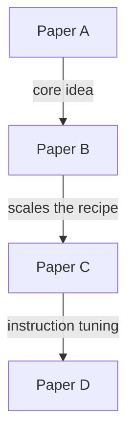

# Relation Summary

## What I do

This skill reads a paper-reading markdown note, infers the main paper lineage, and creates or updates a `## Relation` section with a compact mermaid graph.

The graph should cover not only papers explicitly named in the note, but also direct upstream work, direct downstream work, and other milestone papers that are important for understanding the main line.

I follow the relation style already used in this repository, especially `AI/ml/LLM/Paper-Reading/01-Milestone.md` and `AI/ml/DL/CV/Paper-Reading/01-Basic-Model-Zoo.md`.

## Use this skill when

- A paper-reading markdown note is missing a `## Relation` section
- A note already has a mermaid relation graph but it needs to be expanded
- The note mentions only part of the literature and important predecessor, successor, or milestone papers should be added
- You want a compact paper-lineage graph instead of a long related-work list

## Local repository conventions to follow

- Prefer a `## Relation` H2 section near the end of the note
- Use a fenced mermaid block with `graph TD`
- Use compact node labels in square brackets
- Use short edge labels such as `residual`, `scale parameters and data`, `bidirectional pretraining`
- Use mermaid `%%` comments to separate branches when helpful
- Keep the graph compact and readable in Typora
- Preserve frontmatter, title, TOC, and unrelated note content
- If useful, add one short interpretation line after the graph

## Core output contract

The output should be a single relation graph that explains the main research trajectory.

Default scope:

- papers explicitly named in the note
- direct predecessors that are necessary to understand the line
- direct successors that materially advanced the line
- missing milestone papers that make the graph meaningfully more complete

Default size limit:

- prefer roughly 5-14 nodes total
- add at most 3-8 missing papers by default
- stop when extra nodes no longer improve understanding of the main line

The graph is for understanding, not for exhaustive bibliography coverage.

## Source priority for adding missing papers

Use sources in this order:

1. the note itself
2. papers explicitly cited or discussed by the note's papers
3. high-quality citation metadata sources such as Semantic Scholar or OpenAlex
4. strong survey/review papers in the same topic
5. official project pages or author-written explainers

Important:

- The note and the papers remain primary evidence for the relation graph
- Metadata sources are for discovery and triage, not for replacing the paper's actual claims
- Do not add a paper just because it is globally famous; it must help explain this note's main line

## Candidate discovery buckets

When building the graph, search in these buckets:

### 1. Explicit papers in the note

These are the seed papers.

Extract all papers explicitly named, cited, or clearly discussed in the note.

### 2. Direct predecessors

Add papers that clearly introduce the idea, mechanism, or framing that the seed paper builds on.

Typical predecessor signals:

- cited in the note as prior work
- cited in the seed paper's motivation or related work
- repeatedly identified by surveys as the main precursor

### 3. Direct successors

Add early or important follow-up papers that materially advanced the same line.

Typical successor signals:

- direct citation successors within the same method family
- papers that scale, generalize, align, or simplify the seed idea
- papers repeatedly highlighted by surveys or metadata as key successors

### 4. Missing milestone bridge papers

Add papers that make the timeline intelligible when the note jumps too far.

Examples:

- a bridge between precursor and seed
- a bridge between seed and a later dominant family
- a paper that defines a named branch used by later work

## Evidence rule for adding papers you do not already know

Only add a missing paper when it passes both gates below.

### Structural-signal gate

The paper should satisfy at least 2 of these signals:

- appears in the reference chain of a seed paper
- appears as a direct or near direct citation successor of a seed paper, usually within 1 hop and within the same method family
- appears in related-work metadata for a seed paper
- appears across multiple seed papers
- is emphasized in a high-quality survey or review

### Importance-signal gate

The paper should satisfy at least 1 of these signals:

- clearly defines a major method family, training recipe, loss, dataset, or paradigm
- repeatedly appears as a milestone in survey/review discussions
- has clear line-specific impact, such as becoming a standard baseline, creating a recognized branch, or being repeatedly reused by later papers in the same line
- is necessary to explain why the next paper in the chain matters

If a paper does not clear both gates, do not add it.

## Existing mermaid merge and rebuild rules

If the note already contains a mermaid graph under `## Relation`, do not treat it as disposable.

Use this sequence:

1. parse the existing graph
2. extract existing nodes, edges, branch comments, and graph direction
3. merge newly discovered papers and relations into that structure
4. regenerate a cleaner unified mermaid block

For this skill, a valid existing relation means one that is understandable, on-topic for the note's main research line, and not clearly contradicted by the note or by high-confidence paper evidence.

If an existing relation is weakly worded but still reasonable, keep it.
If an existing relation is unsupported, off-topic, or clearly wrong, it may be removed or relabeled, but only with explicit justification grounded in the note or high-confidence sources.

When rebuilding:

- preserve every valid existing node unless it is an exact duplicate
- preserve every valid existing edge unless it is an exact duplicate
- preserve useful branch comments when possible
- preserve existing edge direction unless there is clear evidence it is wrong
- prefer existing node wording when it is already clear and concise
- if the existing graph uses a direction other than `TD`, preserve the relation semantics first, then normalize the final rebuilt block to `graph TD` to match repository convention

Allowed normalization:

- remove exact duplicate nodes or edges
- reorder lines for readability
- tighten obviously redundant labels
- align all relations into a single readable `graph TD` block
- collapse clearly tangential side branches only when doing so does not remove a valid main-line relation

Not allowed:

- deleting existing valid relations just because they were not rediscovered
- replacing the whole graph with a different storyline
- silently dropping user-written comments that still make sense
- aggressively renaming all nodes into a new style

## How to choose graph structure

Prefer a main chronological line with short side branches.

Useful relation types include:

- idea precursor
- architecture simplification or replacement
- scaling or training-recipe continuation
- branching family
- alignment or multimodal extension

Prefer short labels that describe the transition, for example:

- `soft alignment`
- `remove recurrence, full attention`
- `decoder-only LM`
- `instruction tuning plus RLHF`
- `open-weight recipe`

Avoid vague labels such as `improves`, `better`, or `more advanced`.

## Quality bar for the final graph

Before finishing, check:

- Does the graph tell one understandable story?
- Does every added paper help explain the line?
- Are there any obvious missing bridge papers?
- Is the graph still compact enough to scan quickly?
- Would removing any added paper leave the storyline weaker?

If the graph starts to feel like a literature dump, shrink it.

Precedence rule:

- preserving valid main-line relations beats aggressive shrinking
- compactness is achieved by rejecting weak new additions and trimming tangential branches, not by deleting valid core relations

## Edge cases under `## Relation`

- If there is one existing mermaid block, merge into it and rebuild one final graph.
- If there are multiple existing mermaid blocks, prefer the most complete on-topic block as the merge base and preserve any still-useful information from the others.
- If `## Relation` also contains prose, keep useful prose unless it directly conflicts with the rebuilt graph.
- If there is no mermaid block but there is prose under `## Relation`, preserve the prose and insert one new mermaid block above or below it, whichever reads more naturally.

## Must do

1. Read the whole target markdown note before building the graph.
2. Inspect nearby notes in the same directory and match their local style.
3. Create `## Relation` if it does not exist.
4. If a mermaid graph already exists under `## Relation`, parse and merge it before rebuilding.
5. Add missing papers only when they pass the evidence rules.
6. Prefer the smallest graph that still explains the main line.
7. Keep the final graph in one fenced mermaid block using `graph TD`.
8. Preserve unrelated note content.

## Must not do

- Do not rewrite the note into a full literature survey.
- Do not add papers from title similarity alone.
- Do not add globally famous papers that are irrelevant to the note's main line.
- Do not delete existing valid relations just because the new search did not rediscover them.
- Do not replace a user's graph with an unrelated new structure.
- Do not create multiple competing mermaid graphs under the same `## Relation` section by default.
- Do not invent causal relations without evidence.
- Do not let metadata sources override what the papers and note actually say.

## Minimal workflow

1. Read the note and identify seed papers.
2. Read any existing `## Relation` mermaid block.
3. Discover direct predecessors, direct successors, and necessary bridge papers.
4. Filter candidates through the evidence rules.
5. Merge accepted papers into the existing relation structure.
6. Rebuild one compact `graph TD` block.
7. Optionally add one short interpretation sentence below the graph.

## Output shape example

````markdown
## Relation



- One useful way to read this trajectory is: **A -> B -> C -> D**.
````
