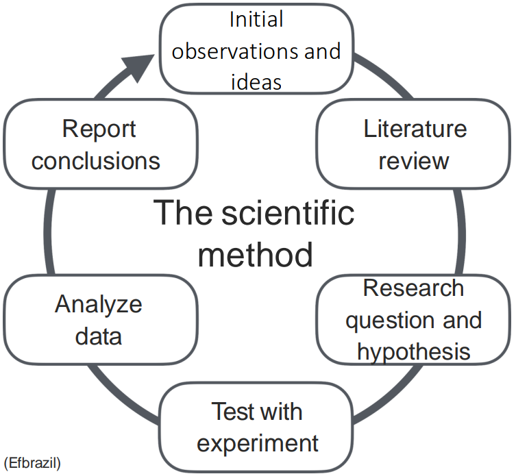

# Foundations of AI

Follow the MIT how2ai course. Check the [references](#References). How to AI (Almost) Anything

[TOC]

## Introduction

### Course syllabus and requirements

- Chapters
  1. Foundations of AI
  2. Foundations of multimodal AI
  3. Large models and modern AI
  4. Interactive AI

- Assignment: read required papers and other resources. Summarize the main take-away points 

### Introduction to AI and AI research

check all the research project [here](https://mit-mi.github.io/how2ai-course/spring2025/schedule/lec1%20-%20introduction.pdf). Research Projects on

- New Modalities
- AI Reasoning
- Interactive Agents
- Embodied and Tangible AI

- Socially Intelligent AI

- Human-AI Interaction
- Ethics and Safety

### How to AI research

> not that useful

The Research Process

#### How to generate research ideas

[The Idea Hexagon: A Framework for Innovation](https://medium.com/spotprobe/the-hexagon-of-ideas-02e5b770d75e)

1. Bottom-Up Discovery

   Turn a concrete understanding of existing research's failings to a higher-level experimental question.

2. Top-down Design

   Move from a higher-level question to a lower-level concrete testing of that question.

#### How to do literature review and read a paper

#### How to write a paper

### Readings

- **Foundations and Trends in Multimodal Machine Learning: Principles, Challenges, and Open Questions**. Paul Pu Liang et.al. **arxiv**, **2022**, ([link](https://arxiv.org/abs/2209.03430v2)).

  However, the breadth of progress in multimodal research has made it difficult to identify the common themes and open questions in the field

  We start by defining three key principles of modality *heterogeneity*, *connections*, and *interactions* that have driven subsequent innovations, and propose a taxonomy of six core technical challenges: *representation*, *alignment*, *reasoning*, *generation*, *transference*, and *quantification* covering historical and recent trends

- **Multimodal Machine Learning: A Survey and Taxonomy**. Tadas Baltrušaitis et.al. **arxiv**, **2017**, ([link](https://arxiv.org/abs/1705.09406v2)).

- **Representation Learning: A Review and New Perspectives**. Yoshua Bengio et.al. **arxiv**, **2012**, ([link](https://arxiv.org/abs/1206.5538v3)).

## References

- [mit how2ai-course](https://mit-mi.github.io/how2ai-course/spring2025/schedule/)

- [The Idea Hexagon: A Framework for Innovation](https://medium.com/spotprobe/the-hexagon-of-ideas-02e5b770d75e)

