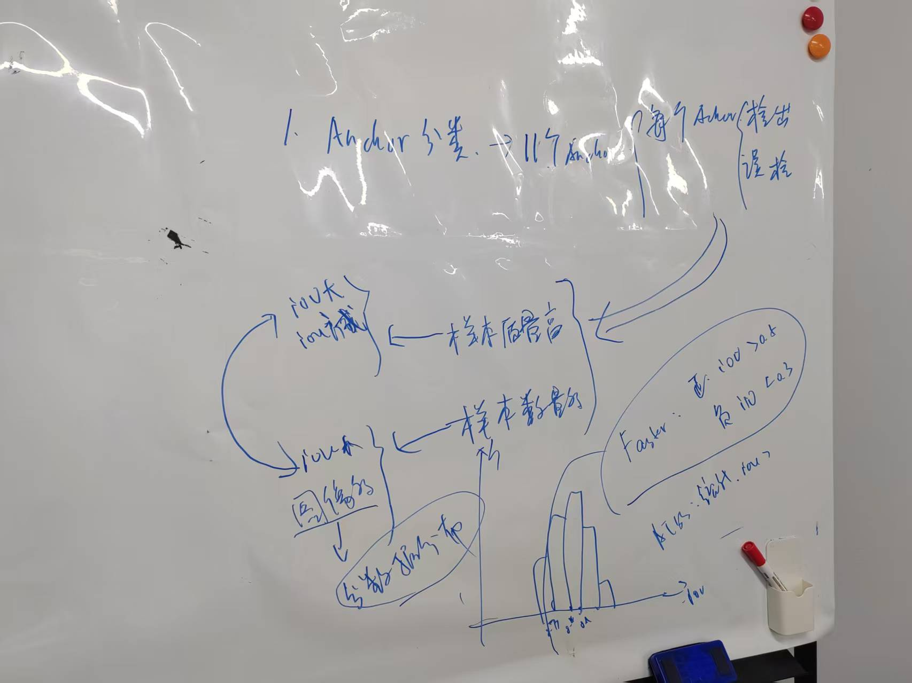
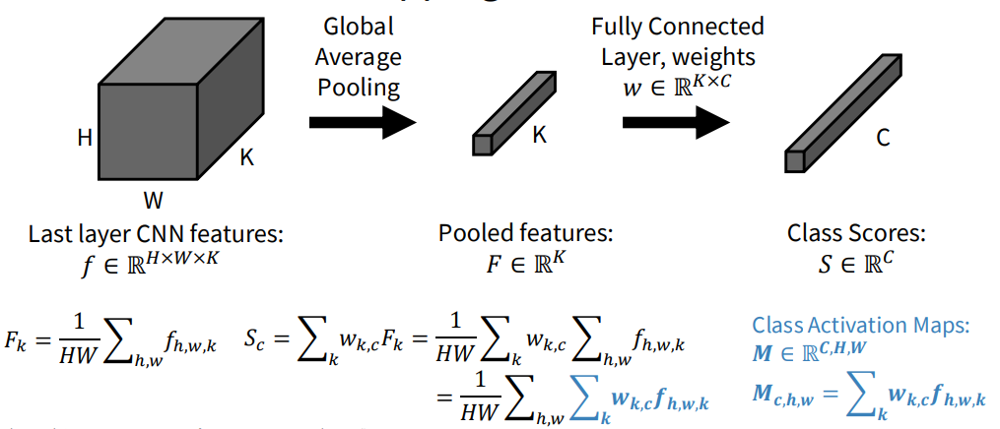

# Object Detection Basics
[TOC]

Quick guide to core object detection ideas: how boxes are defined and refined, how detectors are structured, how we evaluate them, and the trade-offs between design choices.

可能这节最重要的是目标检测的本质部分

<!--more-->

## Computer Vision Tasks


## Bounding Boxes

- **Takeaway**: Boxes are the basic localization unit and the target for regression in detectors.
- **Prior**: Early detectors hand-crafted region proposals; modern models regress box offsets directly.
- **Core Mechanism**: Parameterize rectangles and learn offsets to align with ground truth.
  - Corner: \((x_{\min}, y_{\min}, x_{\max}, y_{\max})\)
  - Center: \((x_c, y_c, w, h)\); YOLO uses normalized values in \([0,1]\)
  - Regression target predicts \((\Delta x, \Delta y, \Delta w, \Delta h)\) to refine a prior box.
- **Pros**: Simple, differentiable, works with CNN/transformer heads.
- **Cons**: Axis-aligned only; sensitive to aspect-ratio priors; limited for rotated or elongated objects.

## Object Detection Evaluation Metrics

- **Takeaway**: IoU decides match quality; precision/recall summarize correctness; AP/mAP aggregate performance.
- **Prior**: Binary classification metrics extended with IoU thresholds (VOC, COCO).
- **Core Mechanism**: Sort detections by confidence, match to GT via IoU, compute PR curve, integrate to AP; average AP over classes for mAP.

| Metric    | What It Measures                         | How It’s Computed                              | Why It Matters                      |
| --------- | ---------------------------------------- | ---------------------------------------------- | ----------------------------------- |
| IoU       | Overlap quality                          | \(\frac{\text{intersection}}{\text{union}}\) | Defines TP/FP, used in losses       |
| Precision | Correctness of positives                 | \(\frac{TP}{TP+FP}\)                          | Penalizes false alarms              |
| Recall    | Coverage of true objects                 | \(\frac{TP}{TP+FN}\)                          | Penalizes missed detections         |
| F1-score  | Balance of precision and recall          | \(2 \cdot \frac{P \cdot R}{P + R}\)          | Single operating-point score        |
| AP        | Area under PR curve for one class        | Integral of PR curve (COCO), 11-pt (VOC)       | Class-level quality                 |
| mAP       | Mean AP across classes                   | Average of class APs                          | Standard leaderboard metric         |
| AR        | Average recall under limits              | COCO AR@1/10/100                               | Measures ability to find GTs        |

## One-Stage Object Detectors

- **Takeaway**: Predict boxes and classes in one pass for speed.
- **Prior**: Designed to avoid slow proposal stages (YOLO, SSD).
- **Core Mechanism**: Backbone → (optional) neck → dense head outputs box regression + objectness + class scores; multitask loss ties localization and classification.
- **Pros**: Real-time friendly; simpler deployment; stable end-to-end training.
- **Cons**: Historically weaker localization; class imbalance and NMS sensitivity; many dense negatives.

**Pipeline snapshot**
- Backbone: feature extractor (e.g., ResNet, MobileNet, CSPDarknet).
- Neck: multi-scale fusion (FPN, PANet, BiFPN) to help small objects.
- Head: dense predictions per location (box offsets, objectness, class probs).

**Representative models**: YOLO family, SSD, RetinaNet (Focal Loss), FCOS (anchor-free), YOLOv8 (anchor-free, decoupled heads, IoU losses).

## Two-Stage Object Detectors

- **Takeaway**: Separate proposal generation from classification/regression to maximize accuracy.
- **Prior**: Region-based detectors (R-CNN → Fast/Faster R-CNN) introduced learnable proposals.
- **Core Mechanism**: Stage 1 RPN proposes boxes; Stage 2 ROI head classifies and refines each proposal using pooled features.
- **Pros**: Strong localization; robust on crowded/complex scenes; extensible (e.g., Mask R-CNN).
- **Cons**: Slower; heavier; less edge-friendly.

**Pipeline snapshot**
- Backbone: feature extractor (e.g., ResNet, Swin Transformer).
- RPN: proposes ~200–300 candidate boxes with objectness + regression offsets.
- ROI head: ROI Align/Pooling → small head for class scores + box refinements; variants add masks (Mask R-CNN) or keypoints.

**Representative models**: Faster R-CNN (baseline two-stage), Mask R-CNN (adds instance masks), Cascade R-CNN (multi-stage refinement), Sparse R-CNN (learned proposals, no RPN).

## Feature Pyramid Networks (FPN)

- **Takeaway**: Strengthen semantics at multiple scales to detect small and large objects together.
- **Prior**: Single-resolution backbones lacked detail for small objects.
- **Core Mechanism**: Top-down pathway with lateral connections merges high-level semantics with high-resolution features; outputs a pyramid of feature maps.
- **Pros**: Better small-object recall; reusable neck for many detectors.
- **Cons**: Extra compute/memory; design choices (levels, fusion) affect latency.

## Anchor-Based Detectors

- **Takeaway**: Use predefined boxes (anchors) as priors and regress offsets.
- **Prior**: Early dense detectors needed fixed priors for scale/aspect coverage.
- **Core Mechanism**: Place \(k\) anchors per location per FPN level; assign via IoU thresholds; train objectness, class label, and box offsets.
- **Pros**: Stable training; explicit control over scales/ratios; mature ecosystem (YOLOv2/3, RetinaNet, Faster R-CNN RPN).
- **Cons**: Hyperparameter heavy (scales/ratios/thresholds); many negatives → imbalance; sensitive to dataset priors.

**Anchor math**
- Anchor \(a = (x_a, y_a, w_a, h_a)\); predict offsets \(t = (\Delta x, \Delta y, \Delta w, \Delta h)\).
- Decode: \(x = x_a + \Delta x \, w_a,\; y = y_a + \Delta y \, h_a,\; w = w_a e^{\Delta w},\; h = h_a e^{\Delta h}\).

## Anchor-Free Detectors

- **Takeaway**: Predict boxes directly without predefined anchors.

  > [!NOTE]
  >
  > 只是指不需要人为预先设定anchor，但实际上还是有anchor的
  >
  > 其实anchor-free和anchor-base本质相同，可以将anchor-free每个grid-cell看作长宽都为0的anchor

- **Prior**: Simplify design and reduce imbalance (FCOS, CornerNet, CenterNet, YOLOX/YOLOv8, DETR).

- **Core Mechanism**: Predict centers/keypoints/queries on feature maps; assign positives via center sampling or optimal transport/masks; regress distances to box edges.

- **Pros**: Fewer hyperparameters; cleaner formulation; better small-object behavior; easier to adapt across datasets.

- **Cons**: Requires careful positive sampling; may need specialized losses for stability.

**Representative families**: FCOS (center-based), CornerNet/CenterNet (keypoints), YOLOX/YOLOv8 (center-based + OTA), DETR (transformer queries, no NMS).

### Dense prediction vs Sparse prediction

在anchor-free中，又分为dense prediction and sparse prediction

- dense detection head: 在每个grid都进行预测

  - Pros

    - recall 高

    - 能覆盖整个图像

    - 小目标检测能力强

  - Cons

    - 产生大量冗余候选框，需要 **NMS**

      > [!NOTE]
      >
      > NMS 的问题：
      >
      > 1. 不是 end-to-end
      > 2. 破坏梯度传播
      > 3. 推理增加 latency
      > 4. 对 crowded scenes 不稳定
      >
      > 所以也有很多论文在做NMS trick engineering

    - label assignment是核心难点、

    - 优化目标常常不一致

      > [!NOTE]
      >
      > Dense detector 的 loss 通常是：
      > $$
      > L = L_{cls} + L_{reg}
      > $$
      > 例如 RetinaNet：
      > $$
      > L = L_{focal} + L_{box}
      > $$
      > 但问题是：
      >
      > ```
      > training objective ≠ evaluation metric
      > ```
      >
      > 评估指标是：AP
      >
      > 而 AP 依赖
      >
      > ```
      > ranking + NMS
      > ```
      >
      > 这导致训练优化方向和最终 evaluation 不完全一致。


- Sparse Detection Head(不需要nms) : 这些模型通过 **query / proposal** 直接预测目标

  - Pros

    - 不需要 NMS
    - 预测结果更干净
    - end-to-end 训练

  - Cons

    - recall 可能较低
    - 训练难度较高
    - 小目标 detection 有时困难

  | 模型            | 类型   |
  | --------------- | ------ |
  | DETR            | sparse |
  | Deformable DETR | sparse |
  | DINO            | sparse |
  | Sparse R-CNN    | sparse |

#### Q&A

那么为什么使用transfomer可以来解决dense prediction的问题，实现sparse呢？

> [!NOTE]
>
> Sparse detection 最大的困难：目标之间的竞争
>
> 目标检测不是独立预测问题，而是 **集合预测问题**。
>
> 假设图像中有 $M$ 个目标：
> $$
> \{y_1, y_2, ..., y_M\}
> $$
> 模型预测 $K$ 个候选：
> $$
> \{\hat y_1, \hat y_2, ..., \hat y_K\}
> $$
> 要求：
> $$
> K \ge M
> $$
> 问题是：哪些 prediction 对应哪些目标
>
> 如果没有机制协调预测，就会出现：多个 prediction 预测同一个目标，这就是 **duplicate boxes** 问题。
>
> Dense detector 用NMS解决。
>
> Sparse detector需要一种 **预测之间互相协调的机制**
>
> 现在就回到原始的问题，为什么CNN不行而transfomer可以
>
> - CNN不行是因为每个位置的预测是互相独立的，
>   $$
>   P(y_i∣x)
>   $$
>   但目标检测需要：
>   $$
>   P(y_i | x, y_{-i})
>   $$
>   也就是：一个预测必须知道其他预测在干什么
>
> - transfomer的self-attention解决了这个问题
>
>   ```
>   Q = query
>   K = key
>   V = value
>   ```
>
>   在 detection 中：
>
>   ```
>   query = object queries
>   ```
>
>   因此每个 query 都可以看到所有其他 query。这样就可以避免duplicate boxes，下面举个例子
>
>   ```
>   query 1 预测 dog
>   query 2 看到 query 1
>   query 2 会避免再预测 dog
>   ```
>
>   这就是 implicit NMS
>
> - Cross attention找到目标
>
>   Decoder 还有 **cross-attention**：
>   $$
>   \text{Attention}(Q_{obj}, K_{img}, V_{img})
>   $$
>   其中：
>
>   ```
>   Q = object query
>   K,V = image feature
>   ```
>
>   含义是：
>
>   ```
>   query 在 feature map 中寻找目标
>   ```
>
>   于是 detection 过程变成：
>
>   ```
>   query → search object
>   ```
>
>   而不是：
>
>   ```
>   pixel → predict object
>   ```
>
>   这正是 **dense → sparse** 的转变。

## 目标检测的本质

目标检测训练里，核心一直都是这件事：**哪些预测单元算正样本，它们分别监督哪个 gt**

1. anchor-based: 预测单元是 anchor

   所以它的分配问题常表现为：

   - 同一 gt 会匹配很多 anchor
   - 同一 anchor 可能和多个 gt 都有较高 IoU
   - 多个 gt 会争同一个 anchor
   - 尤其在目标靠得近、大小相似、嵌套时更明显

2. anchor-free(dense-prediction): 预测单元不再是预设 anchor，而是**特征图上的点**，或者以点为中心定义的一小块候选区域

   所以它的问题变成：

   - 哪些点属于某个 gt
   - 如果一个点落进多个 gt，该归谁
   - 不同层级的点该由哪一层负责
   - 一个 gt 太小或太大时，哪些点才是有效正样本
   - 中心区域怎么定义，边界点要不要算

所以本质上来看anchor-base和anchor-free是一样的，只是冲突的可视化形态变了，或者说anchor-free就是把每个点上的anchor数量设置为1,所生成的anchor尺寸都设置为0的anchor-base。唯一区别就是正负样本的划分和回归方法的不一样。Anchor-base根据IOU选择正负样本,Anchor-free根据位置选择正负样本。Anchor-base回归的是与anchor的偏移,Anchor-free回归的是与网格中心点的距离

从训练的角度来看:anchor-base的解空间相比于acnhor-free更小,毕竟只是回归anchor和gt之间的偏移,所以说收敛的理论上应该更快。因为anchor-free的解空间更大,所以会更灵活,模型敢于在任何地方尝试任何的形状,所以其检出率肯定会更高,也就是recall会更高,但是也就意味着会有更多的误检,那么如何降低这个误检呢?所以在anchor-free的方法里面会通过一些方法来re-weight检测结果,就像fcos里面的centerness分支。所以在anchor-free的方法里面,如何对检出的结果进行re-weight也是一个可以研究的点



当我们处理一个anchor base的检测任务的时候，我们如何设置anchor呢，一般是根据训练集合的数据分布进行统计获得的那么为什么要这样呢？这里就要介绍我们目标检测任务的目的：提高检出，减少误检，即提高precision，减小recall，那么如何实现呢。也就是要我们预先设定的每个anchor都能学得好：

> [!NOTE]
>
> 为什么是每个，因为一旦有anchor学习不好就会使得该anchor对应的检测目标识别效果不好，precision低或者出现误检。

那么我们如何能使得每个anchor学习好呢？就需要训练样本对每个anchor(不同尺度、大小)都要有以下要求：

- 样本质量高（什么叫样本质量高，就是分配anchor与gt时，匹配的程度高）：要iou_thres大，当然后面有添加类别感知的方法来评定好坏
- 样本数量多（让尽可能多的anchor去匹配gt）：iou_thres小，图像多

这里就出现了一个矛盾：iou_thres既要大又要小，所以我们对于thres是做trade-off的，现在的很多label assignment就是在用不同的方法调整得到一个好的iou_thres，那么到底好不好呢，我们可以统计看一下最后输出的调整后的iou_thres是什么样的，大概就知道数据集和咱们的anchor匹配是怎么样的。这就可以指导我们调整我们的整体模型框架。

## Non-Maximum Suppression (NMS)

- **Takeaway**: Prunes overlapping detections to keep one box per object.
- **Prior**: Dense heads emit many overlapping candidates that need consolidation.
- **Core Mechanism**: Sort by confidence, keep the highest, remove boxes with IoU above a threshold; variants include Soft-NMS and DIoU-NMS.

### Plain NMS

- **Pros**: Simple, effective, and fast; improves precision.
- **Cons**: Threshold-sensitive; can drop true positives in crowded scenes; adds a post-processing step.

### Box Voting

- Takeaway: NMS+merge. Merges overlapping boxes instead of discarding them
- Pros:
  - Often improves localization accuracy and recall by averaging boxes weighted by scores.
- Cons:
  - Slightly slower; if voting IoU is too low, can over-merge and blur localization; can retain more boxes if thresholds aren’t tuned.

## Visualization & Understanding

### Model Layers Visualization

- What: Model-layer visualization means: looking inside the network to see what each layer (or neuron / channel) is doing.

- Why: The goals:

  - Debug: Is the network learning something reasonable or is it broken?
  - Interpret: Are early layers edge detectors? Are later layers detecting parts or objects?
  - Intuition: Understand how information flows and transforms through the network.

- How: For CNNs, we usually:

  1. Visualize **feature maps / activations**: what the layer outputs for a given image.
  2. Visualize **learned filters / kernels**: especially early conv layers, to see edge / color detectors.

  Just input an image and extract the feature map each channel.

### Saliency Maps

- What: A saliency map tells you: **for a given input image and a given class prediction, which pixels are most important for that prediction?**

  > Example: 例如肿瘤检查，看那个像素影响最大，即可定位肿瘤信息

- Basic idea: compute the **gradient of the score for class c with respect to the input image**:
  $$
  S_c(x) = \frac{\partial f_c(x)}{\partial x}
  $$
  $|S_c(x)|$ large ⇒ small change at that pixel changes the score a lot ⇒ pixel is important.

### CAM & Grad-CAM

- CAM (Class Activation Mapping)

  CAM shows **which spatial regions** are most responsible for the prediction of a class, but it assumes a specific architecture:

  - CNN backbone
  - Global Average Pooling (GAP)
  - Linear classification layer directly after GAP (no additional FCs)

  Under this architecture, you can directly compute a weighted sum of feature maps for a class.

  

- Grad-CAM (Gradient-weighted CAM)

  Grad-CAM generalizes CAM to **any CNN-based architecture**, including those with fully connected layers, more complex heads, etc.

### 推理输出可视化

我们要分析模型训练的好坏，不能只是单纯看一个mAP就可以了，还要深入查看

1. 先看哪些类别漏检/误检多，哪些类别容易互相混淆

2. 看目标属性

   ```
   小目标
   细长目标
   遮挡目标
   模糊目标
   暗光目标
   密集目标
   边缘区域目标
   ```

3. 看错误类型

   - 漏检

     - 根本没看到

       先看一下（把分数拉低），看一下gt周围是否有预测框，如果仍然没有，说明模型根本没有学到这类特征（特别是小模型）

       1. 增加这类样本数量
       2. （如果是小目标）强化小目标特征层。也可能是正样本分配使得小目标吃亏
       3. 针对遮挡、模糊做数据增强

     - 看到了，但分数太低

       这种一般称为难样本，主要原因可能是正负样本太不平衡，训练集和验证集分布不一致，loss不太适合导致分类分支学得弱

       1. 检查 focal loss 或等价机制的参数是否合适
       2. 调整正负样本比例
       3. 提高这类难样本在训练中的占比

     - 看到了，但类别错了

       类间特征太像，标注边界不一致，类别定义本身模糊，某些类别样本太少

       1. 做类别混淆矩阵
       2. 找最容易互相混淆的类别对
       3. 增加容易混淆类别的对比样本

     - 看到了，但框偏得太多

       这就是回归分支没学好，其本质一般是数据标注方面，标注的框不太稳定（有时高，有时宽）

       1. 加强高分辨率特征层
       2. 单独统计小目标的 IoU 分布
       3. 检查回归损失

     - 看到了，但被 NMS 压掉了

       直接先不同的nms阈值看看效果，尝试soft nms或更合适的去重方式

   - 误检

     - 纯背景误检

       这类最典型。背景纹理、阴影、反光、边缘、重复图案被当成目标。本质就是背景和前景在特征空间没有拉开

       1. data:看训练集中是否缺少这类复杂背景

       2. train:收集这些容易误检的背景图，作为 hard negative

          做更有针对性的负样本挖掘。

     - 相似物体误检

     - 类别混淆

     - 重复检测

     - 框偏了，导致没和真值匹配

     - 标注缺失导致看起来像误检

## References

- Stanford CS231n intro slides: <https://cs231n.stanford.edu/slides/2024/lecture_9.pdf>
- NMS overview: <https://towardsdatascience.com/non-maxima-suppression-139f7e00f0b5/>
- Anchor boxes explainer: <https://towardsdatascience.com/anchor-boxes-the-key-to-quality-object-detection-ddf9d612d4f9/>
- PyTorch detection tutorial: <https://docs.pytorch.org/tutorials/intermediate/torchvision_tutorial.html>
- Intro to object detection: <https://www.geeksforgeeks.org/computer-vision/what-is-object-detection-in-computer-vision/>
