# Object Detection Model Zoo

Focus on object detection models

[TOC]

## MobileNet Zoo

- **MobileNets: Efficient Convolutional Neural Networks for Mobile Vision Applications**. Andrew G. Howard et.al. **arxiv**, **2017**, ([link](https://arxiv.org/abs/1704.04861v1)).

  - Takeaway: MobileNet v1 replaces standard convs with **depthwise + pointwise** convs (DSC) to cut FLOPs/params for mobile.

  - Motivation: Classical CNNs (VGG, ResNet) use full 3×3 convolutions with cost:

    - Computation: `H × W × Cin × Cout × K²`
    - Parameters: `Cin × Cout × K²`

    This is too heavy for phones and embedded devices.

  - Core Mechanism: Depthwise Separable Convolutions(DSC): Replace a standard `K×K` conv with:

    - **Depthwise conv**: `K×K` per input channel, no channel mixing
    - **Pointwise conv**: `1×1` conv to mix channels

    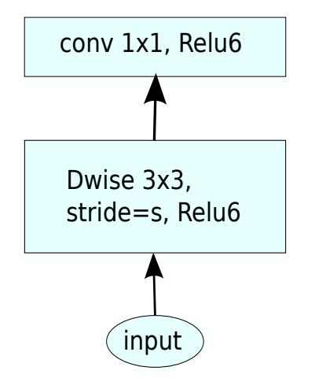

    This factorizes computation:

    - Original MACs: `H × W × Cin × Cout × K²`
    - DSC MACs: `H × W × (Cin × K² + Cin × Cout)`

    For typical settings (e.g., `K=3`, `Cin ~ Cout`), this greatly reduces compute. Additionally, MobileNet v1 introduces:

    - width multiplier $\alpha$: thinner models, controls the number of channels in each layer

    - resolution multiplier $\rho$: reduce the computational cost, controls the input image resolution
      $$
      D_K \times D_K \times \alpha M \times \rho D_F \times \rho D_F+\alpha M \times \alpha N \times  \rho D_F \times \rho D_F
      $$

    Together, they form a simple knob set for accuracy–efficiency trade-offs.

    > [!TIP]
    >
    > Less regularization and data augmentation techniques because **small models have less trouble with overfitting**.

  - Pros

    - Massive reduction in FLOPs and parameters vs full convs.

  - Cons

    - Pure DSC networks can be **memory-bound** (low compute/memory ratio).
    - Representational power is weaker than advanced backbones (e.g., ResNet, MobileNet v2/v3).
    - No explicit mechanism to handle **information loss** in low-dimensional bottlenecks.

- **MobileNetV2: Inverted Residuals and Linear Bottlenecks**. Mark Sandler et.al. **arxiv**, **2018**, ([link](https://arxiv.org/abs/1801.04381v4)).

  - Takeaway: MobileNet v2 introduces the **Inverted Residual + Linear Bottleneck** block, improving over v1.

  - Motivation: MobileNet v1’s DSC is efficient but suffers from information loss in narrow intermediate layers. And there`s no residual connections in most layers.

  - Core Mechanism:

    a novel layer module: the inverted residual with linear bottleneck

    1. **Expansion**:
       The input is first passed through a **1×1 convolution** that **expands** the number of channels, increasing the model’s representational capacity.
    2. **Depthwise Separable Convolution**:
       After the expansion, a **depthwise separable convolution** (which is more computationally efficient than a regular convolution) is applied. This operation is performed on each channel separately, rather than combining all channels together, reducing the number of parameters and computation.
    3. **Projection (Linear Bottleneck)**:
       The **output** of the depthwise separable convolution is then passed through a **1×1 convolution** that **projects** the feature map back to a smaller number of channels.

    

    > [!NOTE]
    >
    > ReLU6: $y = min(max(x,0),6)$, cut the value in 6

    Key tricks:

    - linear bottlenecks

      No non-linearity (e.g., ReLU) after the final projection to avoid losing information in low-dimensional space (maintain representational power).

    - Inverted residuals

      - Normal bottleneck use $1\times 1$ layers to reduce and then increase(restore) dimensions, which helps in reducing computational cost. However, this comes with a trade-off, as you need to balance the reduction in dimensions with the need to preserve sufficient information.
      - Inverted residuals use $1\times 1$ layers to increase and then reduce dimensions

  - Pros

    - Remains highly efficient and widely adopted in detection/segmentation backbones.

  - Cons

    - Still heavily reliant on depthwise conv (memory-bound).
    - This design is not memory-efficient for both inference and training.

- __Searching for MobileNetV3.__ *Andrew G. Howard et al.* __2019 IEEE/CVF International Conference on Computer Vision (ICCV), 2019__ [(Arxiv)](https://arxiv.org/abs/1905.02244) [(S2)](https://www.semanticscholar.org/paper/5e19eba1e6644f7c83f607383d256deea71f87ae) ([code_link](https://github.com/d-li14/mobilenetv3.pytorch))(Citations __8097__)

  - Takeaway: MobileNet v3 combines（有点缝合怪的感觉）:

    - **Inverted residual blocks from v2**,
    - **Squeeze-and-Excitation (SE)** for channel attention,
    - **NAS-based layer configuration** and customized **nonlinearities** (h-swish, h-sigmoid), to push mobile efficiency further while keeping FLOPs low.

  - Motivation: Google’s work on NAS and SE (SENet, EfficientNet) motivates an automated and more refined design.

  - Core Mechanism:

    MobilenetV3 block: MobileNetV2 + Squeeze-and-Excite

    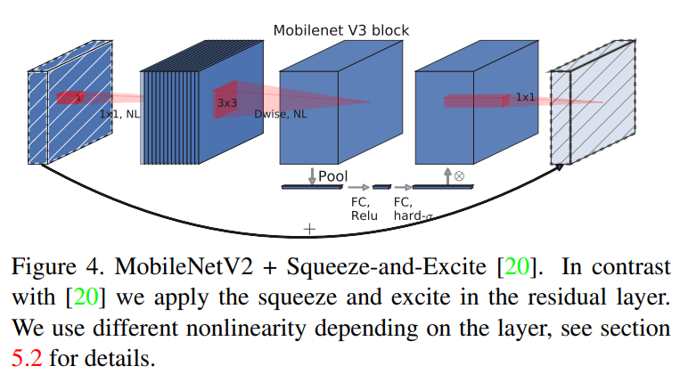

    Key tricks

    - Introduces **h-swish** (hard-swish) and **h-sigmoid** as cheap approximations of swish/sigmoid, better suited for mobile hardware.
      $$
      \text{hsigmoid}(x) = \frac{ReLU6(x+3)}{6},\quad \text{h-swish}(x) = x\cdot \frac{ReLU6(x+3)}{6}
      $$
      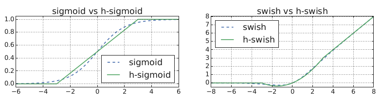

    - Overall architecture (widths, kernel sizes, presence of SE, activation type) is discovered via **NAS** under latency constraints.

  - Pipeline:

    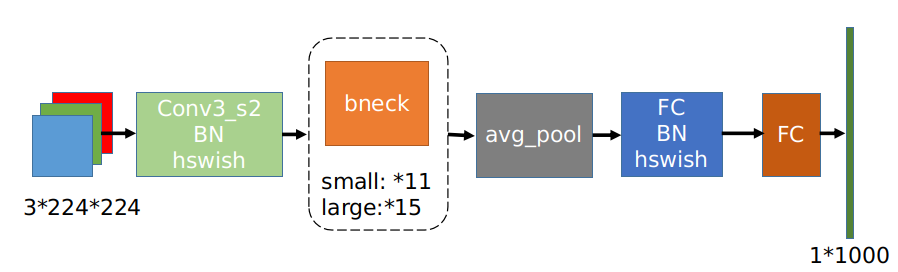

  - Pros

    - Architecture tailored for target latency on specific hardware.
    - **Excellent backbone** for mobile classification and detection.

  - Cons

    - Harder to reason about or modify compared to simple v1/v2 patterns.

## R-CNN Zoo

check [here](./02-4-RCNN-Zoo.md)

## FCN

用于处理语义分割的问题：语义分割是这针对像素而言的，要求每个像素都要确定其具体的所属类别

- FCN(Fully Convolutional Networks)

  - Motivation

    图像分类网络往往输出是全连接层的输出,也就是输出一维的张量,然后Softmax归一化为每一个类别的概率,但是这样一维的特征向量就显式的丢失了空间信息。而语义分割需要空间信息，因此我们最后输出需要是一张二维的特征图，然后对每个像素做softmax分类

  - Core Mechanism

    其实将图像分类网络的最后的全连接层换成卷积层就可以输出二维特征图了,这样整个网络都是由卷积层组成,这样的网络叫做FCN(全卷积网络)

    - Architecture

      

      > 这里21是因为在数据集PascalVOC进行的实验,共20类（21=20+1）

    - skip connection融合浅层特征

## FPN Zoo

- __Feature Pyramid Networks for Object Detection.__ *Tsung-Yi Lin et al.* __arXiv, 2016__ [(Arxiv)](https://arxiv.org/abs/1612.03144) 

  - Takeaway

    Feature Pyramid Networks (FPN) is a multi-scale feature fusion architecture for object detection. Its key idea is to combine the **strong semantics of deep layers** with the **high resolution of shallow layers** through a **top-down pathway with lateral connections**, producing feature maps at multiple scales that are all semantically strong. 

  - Motivation

    Object detection must handle objects of very different sizes, but standard ConvNet backbones naturally create a hierarchy where:

    - shallow layers have **high resolution** but **weak semantics**
    - deep layers have **strong semantics** but **low resolution**

    Traditional image pyramids can address scale variation, but they are expensive in computation and memory. Before FPN, many detectors either relied mainly on the final deep feature map, which hurts small-object detection, or built pyramids in less efficient ways. FPN was proposed to exploit the **inherent pyramidal hierarchy** inside ConvNets and build a strong feature pyramid with only marginal extra cost.

  - Core Mechanism

    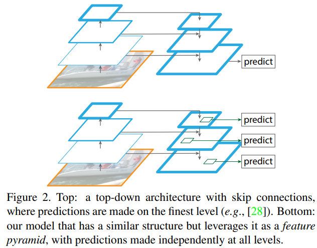

    FPN has three core parts:

    1. backbone to extract features
       \[
       C_2,\; C_3,\; C_4,\; C_5
       \]
       
    2. Top-down pathway
       
       Starting from the deepest feature map, FPN upsamples higher-level semantic features and sends them downward.

    3. Lateral connections
       
       At each scale, the upsampled high-level feature is merged with the corresponding backbone feature using a lateral \(1\times1\) convolution.

    The fused pyramid features are denoted:

    \[
    P_2,\; P_3,\; P_4,\; P_5
    \]

    A common way to write the fusion is:

    \[
    P_l = \mathrm{Conv}_{3\times3}\!\left(\mathrm{Conv}_{1\times1}(C_l) + \mathrm{Up}(P_{l+1})\right)
    \]

    > [!note]
    >
    > several ways to fuse the feature
    >
    > 1. use 1×1 Convolution to  align channels and add element-wisely
    >    - cheap and keeps channel dimension fixed
    > 2. just channel concatenation

    where:

    - \(C_l\) is the backbone feature at level \(l\)
    - \(P_{l+1}\) is the higher-level pyramid feature
    - \(\mathrm{Up}(\cdot)\) is usually 2× upsampling
    - \(\mathrm{Conv}_{1\times1}\) aligns channel dimensions
    - \(\mathrm{Conv}_{3\times3}\) reduces aliasing after fusion

    The highest pyramid level is usually initialized as:

    \[
    P_5 = \mathrm{Conv}_{1\times1}(C_5)
    \]

    So the whole design can be understood as:

    \[
    \text{high-level semantics} + \text{low-level spatial detail} \rightarrow \text{multi-scale strong features}
    \]

    This is the central reason FPN works especially well for detection across scales, including small objects. 

  - Pros

    - Strong, efficient and simple

  - Cons

    - Fusion is relatively simple: FPN mainly uses element-wise addition, which may not be the most expressive cross-scale fusion strategy.
    - Information flow is mostly top-down: lower-level detailed information is enhanced by high-level semantics, but reverse aggregation is limited.
      - Sol: later methods such as PANet were designed partly to address this.

    - Scale assignment is heuristic: assigning objects to feature levels is not fully adaptive in the original design.

- __Path Aggregation Network for Instance Segmentation.__ *Shu Liu et al.* __arXiv, 2018__ [(Arxiv)](https://arxiv.org/abs/1803.01534) [(Code)](https://github.com/ShuLiu1993/PANet)

  - Takeaway
  
    Path Aggregation Network (PANet) is an extension of FPN-based instance segmentation that improves information flow across feature levels. Its main idea is to strengthen **bottom-up localization propagation**, **multi-level RoI feature aggregation**, and **mask prediction fusion**, so proposal-based segmentation and detection can use both strong semantics and precise spatial details more effectively. :contentReference[oaicite:0]{index=0}
  
  - Motivation
  
    In FPN-based frameworks such as Mask R-CNN, high-level features contain strong semantics, but accurate localization cues often originate from lower layers. The original PANet paper argues that the path from shallow localization features to topmost features is too long, which can weaken precise spatial information for downstream proposal classification, box regression, and mask prediction. PANet was proposed to shorten this path and let proposal subnetworks access useful information from **all** pyramid levels more directly.
  
  - Core Mechanism
  
    
  
    Figure: Illustration of our framework. (a) FPN backbone. (b) Bottom-up path augmentation. (c) Adaptive feature pooling. (d) Box branch. (e) Fully-connected fusion. Note that we omit channel dimension of feature maps in (a) and (b) for brevity.
  
    > [!TIP]
    >
    > the dashed green line is a shortcut
  
    1. Bottom-up Path Augmentation
       
       On top of the standard FPN top-down pyramid, PANet adds an extra **bottom-up path** so lower-level localization signals can travel upward more efficiently. This strengthens the whole feature hierarchy with spatially precise information.
  
       $$
       P_l = \text{Conv}_{3\times3}\left(\text{Conv}_{1\times1}(C_l) + \text{Up}(P_{l+1})\right) \\
       N_{l+1} = \text{Conv}_{3\times3}\left(P_{l+1} + \text{Conv}_{3\times3}^{stride=2}(N_l)\right)
       $$
       
    2. Adaptive Feature Pooling
       
       In standard FPN-based RoI assignment, each proposal is usually mapped to only one pyramid level. PANet instead pools RoI features from **all feature levels** and fuses them, so each proposal can use multi-scale information directly.
  
       A concise mathematical view is:
       
       \[
       \mathbf{r} = \sum_{l} \alpha_l \, \mathrm{RoIAlign}(N_l, \mathrm{RoI}),
       \]
       
       where:
       
       - \(N_l\) is the feature map at level \(l\)
       - \(\mathrm{RoIAlign}(N_l, \mathrm{RoI})\) extracts proposal features from level \(l\)
       - \(\alpha_l\) is a fusion weight
  
       > [!TIP]
       >
       > The paper’s core point is not the exact symbol choice, but the idea that proposal features **should aggregate information from all pyramid levels rather than only one**.
       
    3. Fully-Connected Fusion for Mask Prediction
       
       PANet adds a complementary branch for mask prediction that captures a different view of each proposal, then fuses it with the normal FCN-style mask branch. This improves mask quality by combining local dense prediction with more global proposal-level information. 
  
       A simple fusion expression is:
       
       \[
       \mathbf{m}_{\text{final}} = \mathbf{m}_{\text{fcn}} + \mathbf{m}_{\text{fc}},
       \]
       
       where:
       
       - \(\mathbf{m}_{\text{fcn}}\) is the mask from the convolutional mask branch
       - \(\mathbf{m}_{\text{fc}}\) is the mask from the fully-connected branch
  
       Again, this is a compact mathematical summary of the fusion idea described in the paper.

## GhostNet Zoo

- **GhostNet: More Features from Cheap Operations**. Kai Han et.al. **arxiv**, **2019**, ([link](https://arxiv.org/abs/1911.11907v2))([code link](https://github.com/huawei-noah/Efficient-AI-Backbones)) (Citations __5494__).

  - Takeaway: GhostNet dramatically reduces the cost of convolution by observing that many feature maps in standard CNNs are *redundant* and can be generated by cheap linear transformations instead of expensive convolutions.

  - Motivation: Standard CNNs generate feature maps like:$Y = Conv(X)$. But analysis shows:

    - Many feature maps are **highly correlated**
    - Much of the computation is **producing redundant information**
    - Depthwise conv reduces compute but becomes **memory-bound**
    - Mobile models (MobileNetV1/V2/V3) still require substantial 1×1 conv operations

  - Core Mechanism: Ghost Module

    

    GhostModule proposes that output feature maps consist of:

    - **Intrinsic features:** small set of essential feature maps (computed by real convolution)

    - **Ghost features:** redundant maps derived from intrinsic ones (via cheap ops)

      > [!NOTE]
      >
      > Here cheap operation is actually group convolution, when group number == input channel number, which is equivalent to depthwise separable convolution. Of course, we can apply other ops like affine transformation, wavelet transformation, shift etc.

    GhostBottleneck

    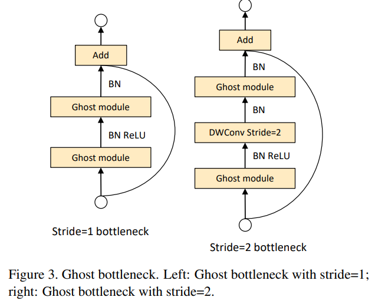

    ```
    Input
      → GhostModule (expand)
        → DepthwiseConv (if stride=2)
          → Squeeze-and-Excitation (optional)
            → GhostModule (project)
    + Shortcut (identity or depthwise+pointwise)
    ```

    > [!TIP]
    >
    > We found that the construction process of GhostNet is to use Ghost bottleneck to replace the bottleneck in MobileNetV3.

  - Pipeline

    ```mermaid
    flowchart LR

    A[Intrinsic Feature Generation<br/>Apply standard 1x1 or 3x3 conv<br/>Produce a small set of intrinsic feature maps]
        --> B[Ghost Feature Generation<br/>Apply cheap linear ops -- DW conv etc.<br/>Generate additional ghost feature maps]

    B --> C[Concatenation<br/>Merge intrinsic + ghost features<br/>Match full conv output dimensions]

    C --> D[Optional Squeeze-and-Excitation<br/>Channel attention to refine features]

    D --> E[Stack Ghost Bottlenecks<br/>Form GhostNet blocks and full network]

    ```

  - Pros

    - Massive reduction of FLOPs
    - Generalizable: Ghost Module can replace conv in ResNet, MobileNet, etc.

  - Cons

    - Depthwise convolution is memory-bound: Latency improvements may vary by hardware.
    - Cheap operations (depthwise conv, linear transforms) are inherently local. Missing global or long-range feature interactions.

- __GhostNetV2: Enhance Cheap Operation with Long-Range Attention.__ *Yehui Tang et al.* __ArXiv, 2022__ [(Arxiv)](https://arxiv.org/abs/2211.12905) [(S2)](https://www.semanticscholar.org/paper/3e420beb7f5d1bc370470b31908dd766ba35eedd) (Citations __582__)

  - Takeaway: GhostNetV2 = GhostNet + long-range spatial modeling (DFC) with almost zero extra cost.

  - Motivation

    - Cheap operations (depthwise conv, linear transforms) are inherently local.
    - Transformers provide global attention, but are too costly for mobile.

  - Core Mechanism

    GhostNetV2 introduces the **Decoupled Fully Connected (DFC)** mechanism — a computationally cheap yet globally aware operator.

    DFC is a spatial long-range attention operator that approximates a **fully connected** layer over the spatial dimension **but decouples it into two 1D projections**, making it extremely efficient.

    One way to implement an attention map using an FC layer is
    $$
    {a}_{hw}=\sum_{h^\prime,w^\prime}{F_{hw,h^\prime,w^\prime}\odot
    {z}_{h^\prime,w^\prime}} \tag{3}
    $$
    $ \odot $ represents the element-wise multiplication，$ F^{HW\times H\times W} $is the learnable weight. Still $O(H^2W^2)$

    CNN features are 2D, and this 2D shape naturally provides a perspective to reduce the computational load of the FC layer. The author decomposes Equation 3 into 2 FC layers and aggregates features along the horizontal and vertical directions respectively.
    $$
    {a}_{hw}^\prime=\sum_{h^\prime=1}^{H}{F_{h,h^\prime w}^H\odot {z}_{h^\prime w}},h=1,2,\cdot\cdot\cdot,H,w=1,2,\cdot\cdot\cdot,W \tag{4}
    $$

    $$
    {a}_{hw}=\sum_{w^\prime=1}^{W}{F_{w,h w^\prime}^W\odot {a}_{hw^\prime}^\prime},h=1,2,\cdot\cdot\cdot,H,w=1,2,\cdot\cdot\cdot,W \tag{5}
    $$

    The computational complexity of the attention module can be reduced to $O(H^2W+HW^2)$.

    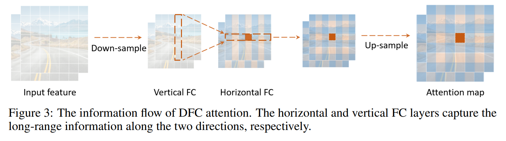

    GhostNetV2 bottleneck

    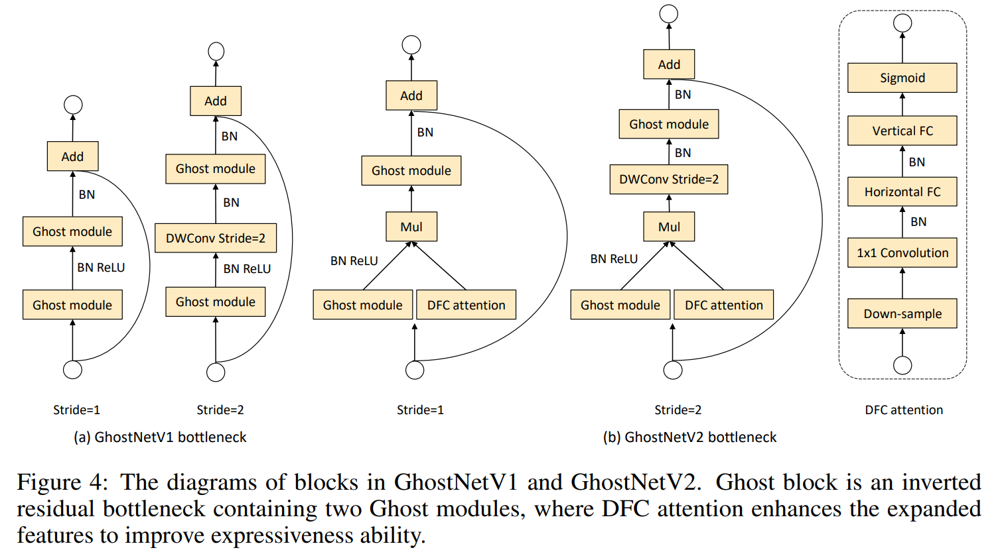

  - Pros:

    - Adds long-range spatial reasoning
    - **Versatile**: works for classification, detection, segmentation, and mobile vision tasks

  - Cons:

    - More complex
    - Less mathematically expressive than Transformers

- __GhostNets on Heterogeneous Devices via Cheap Operations.__ *Kai Han et al.* __International Journal of Computer Vision, 2022__ [(Arxiv)](https://arxiv.org/abs/2201.03297) [(S2)](https://www.semanticscholar.org/paper/c3a302ed0a8687f8b7bc50e4a1dff0f96b4fbf52) (Citations __165__)

  - Takeaway: This paper generalizes GhostNet to **heterogeneous hardware (CPU and GPU)** by:

    - Designing a **CPU-efficient Ghost module (C-Ghost)** that operates at the feature-map level with cheap operations, and
    - Designing a **GPU-efficient Ghost stage (G-Ghost)** that exploits **stage-wise redundancy** while avoiding GPU-inefficient ops like heavy depthwise conv.

  - Motivation:

    -

  - Core Mechanism: G-Ghost

    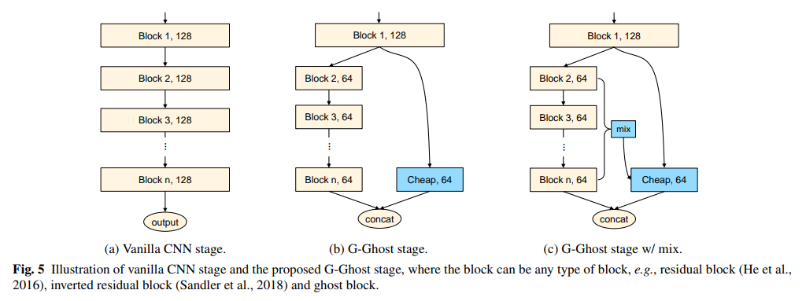

    why mix: There might be a lack of deep information that needs to be extracted in multiple layers later on, so add the rich expressive power of the middle layer, and then mix

    how mix: Global average pooling

    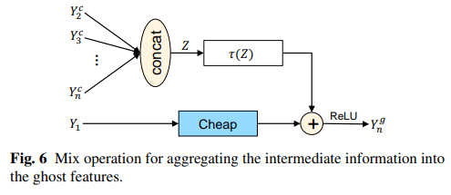

  - Pros

    - plug-and-play
    - GPU-friendly

  - Cons

    - Less “unified” than a single-architecture solution

- __RepGhost: A Hardware-Efficient Ghost Module via Re-parameterization.__ *Chengpeng Chen et al.* __ArXiv, 2022__ [(Arxiv)](https://arxiv.org/abs/2211.06088) [(S2)](https://www.semanticscholar.org/paper/d8d754d93d4a4fcc62838429fd36f795cb8f5d98) (Citations __144__)

  - Takeaway: RepGhost replaces the original Ghost module’s feature concatenation with a re-parameterizable, add-based design that implicitly reuses features in the weight space instead of the feature space.
  - Motivation:
    - [CPU vs GPU] We call the original Ghost as C-Ghost because cheap operations such as Depthwise are more friendly to mobile devices such as pipelined CPUs and ARM, but are not so "cheap" for GPUs with strong parallel computing capabilities. Because the computational density of Depthwise operations is relatively low. So we want to dive into a module more GPU-friendly.
    - [Concat vs Add] `concat` vs `add` on ARM:
      - Same params and FLOPs,
      - But `concat` is about **2× slower** than `add` due to memory access overhead.

## NanoDet Zoo

- NanoDet. ([Intro](https://zhuanlan.zhihu.com/p/306530300))

- __NanoDet-Plus: Super fast and high accuracy lightweight anchor-free object detection model.__ *RangiLyu.* __GitHub software repository, 2021__ [(Intro)](https://zhuanlan.zhihu.com/p/449912627) [(Code)](https://github.com/RangiLyu/nanodet). 

  - Takeaway: 

    lightweight, anchor-free, one-stage object detector. Tiny and fast with better feature fusion (Ghost-PAN) and better label assignment during training (AGM + DSLA). 良心涨点

  - Core Mechanism

    ```
    ShuffleNetV2 Backbone → GhostPAN → NanoDetPlusHead
                          └── GhostPAN_copy → aux_head (training only)
    ```
  
    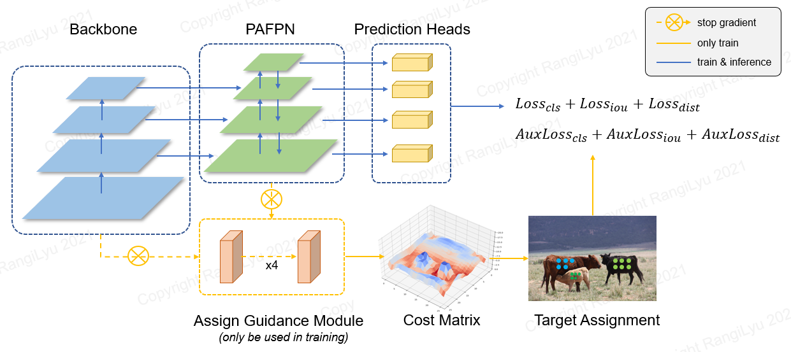
  
    > [!WARNING]
    >
    > 这个图片画的有问题,因为没有直接从backbone输入到assign guidance module的部分
  
    - Ghost-PAN(a light feature pyramid):add ghost blocks to PAN module for lightweight multi-scale fusion
    
      $$
      \{C_3,C_4,C_5\}
      \;\xrightarrow{\text{1×1 reduce conv}}\;
      \{\tilde C_3,\tilde C_4,\tilde C_5\} \\
      \text{Top-down: }\;
      P_{l}^{td}=\text{GhostBlock}\big(\operatorname{Concat}(\operatorname{Up}(P_{l+1}^{td}),\tilde C_l)\big) \\
      \text{Bottom-up: }\;
      P_{l+1}^{out}=\text{GhostBlock}\big(\operatorname{Concat}(\operatorname{Down}(P_l^{out}),P_{l+1}^{td})\big)
      $$
    
      Pipeline
    
      1. reduce all input feature C channels to a fixed value
      2. Top-down: upsample P(bilinear), cancat with C, and send into the ghostblock to get the fused feature
      3. Bottom-up: downsample N(conv with stride=2), cancat with P, and send into the ghostblock to get the fused feature
      4. extra layer: 为了增强对更大目标的检测。this combines:
         - a stride-2 transform of the original deepest reduced backbone feature
         - a stride-2 transform of the current deepest PAN output
    
    - head: output num_cls+4*(reg_max+1) where the reg_max is the distribution for each side
    
      > [!NOTE]
      >
      > - 对于小网络, 独立的head会好点
      > - 对于大网络, share的head会收敛快点
    
    - label assignment: 用更强大branch的来指导head做匹配 AGM + DSLA
    
      - AGM(Assign Guidance Module): guide the head to do label assignment.
    
        > [!TIP]
        >
        > Training-only auxiliary branch
        >
        > aux head 训练一段时间(10epochs)需要 detach，Reason：它在 NanoDet-Plus 里主要是做 assignment guidance，不希望这条辅助分配路径持续反向干扰 backbone 和主 FPN 的特征学习
    
        1. deepcopy fpn as aux_fpn, concat the fpn_feat and aux_fpn_feat as dual_fpn_feat to send into the aux_head 通道信息更丰富
        2. AGM用4个3x3的conv+1个conv对每个slot进行预测，得到预测类概率和检测框送进DSLA
        
      - DSLA(Dynamic Soft Label Assigner): 就是simota
        
        后处理：解决一个 prior 匹配多个 GT 的冲突：只保留cost最小的gt
    
    
    - training recipe: AdamW+CosineAnnealingLR+EMA
    

## Yolo Zoo

check [here](02-2-YOLO-Zoo.md)


## FCOS Zoo

- __FCOS: Fully Convolutional One-Stage Object Detection.__ *Zhi Tian et al.* __2019 IEEE/CVF International Conference on Computer Vision (ICCV), 2019__ [(Arxiv)](https://arxiv.org/abs/1904.01355) [(S2)](https://www.semanticscholar.org/paper/e2751a898867ce6687e08a5cc7bdb562e999b841) [(Code)](https://github.com/tianzhi0549/FCOS/) (Citations __5666__)

  - Takeaway: FCOS is an **anchor-free, proposal-free, one-stage detector** that predicts objects **per pixel** using a fully convolutional head.

    > 第一个这样做得比较好的，直接回归点到四边的距离

  - Motivation

    我们想要实现anchor-free, proposal-free, one-stage detector，那么就需要判断哪里有物体（换句话说就是每个像素是否有物体），物体是哪一类，边界框在哪。这就和FCN语义分割比较像

  - Core Mechanism
  
    - Architure:
  
      
  
      就是比语义分割多了一个画框的问题，那么在FCN的基础上再参考anchor-base的方法，多用一个head来预测边界框即可。这也是为什么输出是二维特征图的原因
  
      ```
      backbone+FPN+head
      ```
  
    - backbone
      
    - FPN: fuse the features
      
    - head：共享权重的检测头
  
      > [!NOTE]
      >
      > 检测头有共享权重的，也有不共享的
      
      - 归一化方法：使用Group Normalization
      
      Per location on a feature map, FCOS predicts three things： **classification, box regression, centerness**
      
      - Box regression uses distances to four sides of the target box
        $$
        \mathbf{t} = (l, t, r, b)
        $$
        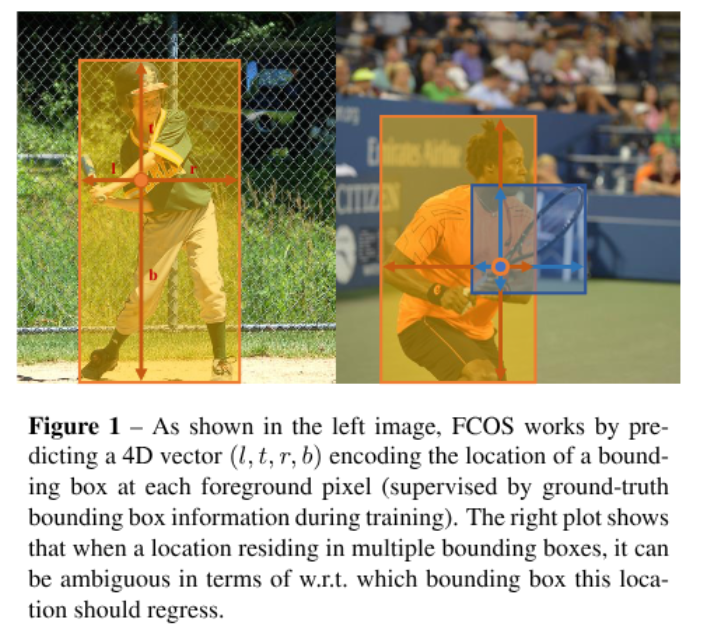
      
        For a feature-map location mapped to image coordinates $(x, y)$ and a ground-truth box with corners $(x_0, y_0)$ and $(x_1, y_1)$
        $$
        l = x - x_0,\quad t = y - y_0,\quad r = x_1 - x,\quad b = y_1 - y
        $$
      
      - Centerness down-weights locations near box edges: a **localization quality indicator**
        $$
        \text{centerness} =
        \sqrt{
        \frac{\min(l, r)}{\max(l, r)}
        \cdot
        \frac{\min(t, b)}{\max(t, b)}
        }
        $$
      
        > [!TIP]
        >
        > We employ sqrt here to slow down the decay of the centerness
      
        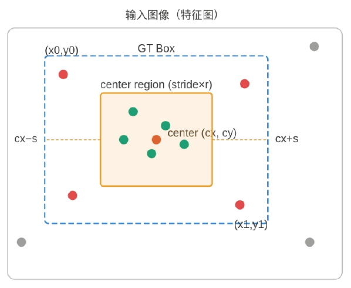
      
        > [!NOTE]
        >
        > 现在我们来讨论一下为什么需要一个centerness？中心度
        >
        > 因为进行正负样本选择时发现分布在框边缘的那些点得到的框效果是不好的，这里有几个解释
        >
        > 1. 其感受野是有限的，更多地依赖于非此物体的信息
        > 2. 更容易回归，中心点预测得到的四个边界值的差距不会很大，比较平滑
        >
        > 因为设置了一个center region(大小由超参数设置)，这样会加剧正负样本不平衡的问题，因此为了缓解这个问题，cls branch使用的是focal loss
      
      Final score at inference multiplies classification confidence and centerness
      $$
      s = \sigma(p_{\text{cls}})\cdot \sigma(p_{\text{ctr}})
      $$
      Training objective combines classification, regression, and centerness losses
      $$
      L = L_{\text{cls}} + \lambda L_{\text{reg}} + \gamma L_{\text{ctr}}
      $$
      A common regression choice in FCOS is IoU or GIoU loss
      $$
      L_{\text{reg}} = 1 - \mathrm{IoU}(B, B^{gt})
      $$
      
      $$
      L_{\text{reg}} = 1 - \mathrm{GIoU}(B, B^{gt})
      $$
  
    Cons
  
    - FCOS的centerness分支在轻量级的模型上很难收敛
      - Sol: GFL 完美去掉了Centerness分支

这里来总结一下anchor-base and anchor-free

- Anchor-base和Anchor-free实质上就是一个东西,就拿acnhor-based方法来说,如果把每个点上的anchor数量设置为1,所生成的anchor尺寸都设置为0,这部就变为了anchor-free类似的方法

  那么区别其实在于正负样本的选择和回归方法

- 正负样本选择：Anchor-base根据IOU选择正负样本,Anchor-free根据位置选择正负样本(其实思想差不多)，在这个框架下，本质就是去解决如何处理正负样本不均的问题

- anchor-free检出率更高，recall更高，也会有更多的误检，因此常通过re-weight来检测出结果（fcos里面的centerness就是如此）

## EfficientNet Zoo

## DETR Zoo

[check here](02-3-DETR-Zoo.md)

## Shuffle-Net Zoo

- **ShuffleNet: An Extremely Efficient Convolutional Neural Network for Mobile Devices**. Xiangyu Zhang et.al. **arxiv**, **2017**, ([link](https://arxiv.org/abs/1707.01083v2)).

  - Takeaway: ShuffleNet designs extremely efficient CNNs using:

    - **Group Convolutions** to reduce computation,
    - **Channel Shuffle** to preserve information flow across groups, making it suitable for very low FLOP budgets.

  - Core Mechanism: Group convolutions and shuffling

    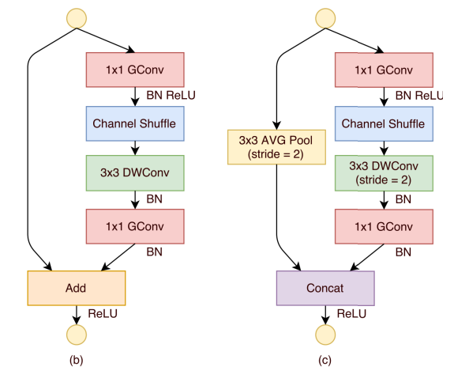

    

  - Cons

    - Channel shuffle pattern can be non-trivial for some inference engines.
    - Accuracy still limited compared to newer designs like MobileNet v3, GhostNet, MobileOne at similar budgets.

- __ShuffleNet V2: Practical Guidelines for Efficient CNN Architecture Design.__ *Ningning Ma et al.* __ArXiv, 2018__ [(Arxiv)](https://arxiv.org/abs/1807.11164) [(S2)](https://www.semanticscholar.org/paper/c02b909a514af6b9255315e2d50112845ca5ed0e) (Citations __6114__)

## SSD Zoo

- **SSD: Single Shot MultiBox Detector**. Liu Wei et.al. **No journal**, **2016**, ([link](https://doi.org/10.1007/978-3-319-46448-0_2)) [(Code)](https://github.com/sgrvinod/a-PyTorch-Tutorial-to-Object-Detection?tab=readme-ov-file).

  - Takeaway: SSD is a **single-stage, anchor-based** detector that predicts on **multi-scale feature maps** in one pass.

  - Motivation: YOLO showed that single-stage detection is fast but initially had localization and small-object issues. There was a need for a detector that:

    - is single-shot (no proposal stage),
    - uses multi-scale features for better small-object detection,
    - keeps good speed–accuracy trade-of

  - Core Mechanism: Architecture

    ```
    backbone+FPN+head
    ```

    - Use a backbone network (e.g., VGG, MobileNet) and attach **extra conv layers** to produce a **feature pyramid**.
    - On each selected feature map:
      - Define a set of **default boxes (anchors)** with different aspect ratios and scales.
      - Use small conv filters to predict:
        - class scores for each default box,
        - bounding box offsets for each default box.
    - Combine predictions from all feature maps and apply NMS.

    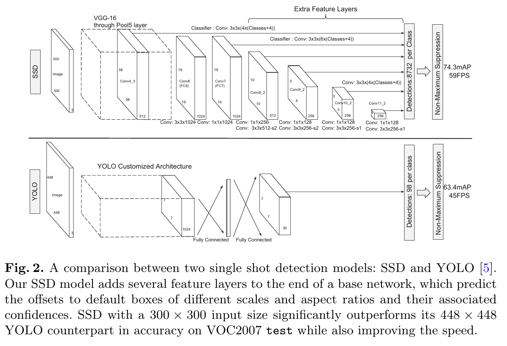

    > [!NOTE]
    >
    > This is why it's called **single-shot**: All predictions happen in **one forward pass**, **on multiple scales**.

  - Pros:

    - Eliminate proposal generation and resampling entirely.
    - Multi-scale feature maps improve detection across object sizes.

  - Cons:

    - Performance on **very small objects** is weaker than some later methods (e.g., FPN-based detectors), since SSD relies on relatively shallow high-resolution maps with limited semantics.
    - The hand-designed scales/aspect ratios of default boxes require tuning for new datasets

## MobileOne Zoo

- **MobileOne: An Improved One millisecond Mobile Backbone**. Pavan Kumar Anasosalu Vasu et.al. **arxiv**, **2022**, ([link](https://arxiv.org/abs/2206.04040v2)).

  - Takeaway: MobileOne trains **multi-branch** blocks, then **fuses to a single conv** for fast mobile inference.

  - Prior:

    BN：
    $$
      \hat{x} = \frac{x - \mu}{\sqrt{\sigma^2+\epsilon}}
    $$
    
    然后再接一个可学习的缩放和平移：
    
    $$
      y = \gamma \hat{x} + \beta
    $$
    
    这里：
    
      - $\mu$：被归一化维度上的均值
      - $\sigma^2$：方差
      - $\epsilon$：防止除零
      - $\gamma$：可学习缩放参数
      - $\beta$：可学习平移参数
    
    注意，normalization 不是简单地强行把特征固定死。因为后面有 $\gamma,\beta$，网络仍然可以学回自己需要的尺度和偏移。s
    
    **吸 BN（BN folding / Conv-BN fusion）** 是 MobileOne 做结构重参数化之前最基础的一步：把推理阶段的 `BatchNorm2d` 参数直接“吸收”进前面的卷积核和 bias 中，从而把
    
    $$
    \operatorname{Conv}(W,b) \rightarrow \operatorname{BN}(\gamma,\beta,\mu,\sigma^2,\epsilon)
    $$
    
    等价改写成一个新的卷积
    
    $$
    \operatorname{Conv}(W_{\mathrm{fold}}, b_{\mathrm{fold}}).
    $$
    
    设输入特征为 $x$，卷积输出为

    $$
    z_c = (W_c * x) + b_c,
    $$
    
    其中 $c$ 表示输出通道，$W_c$ 是第 $c$ 个输出通道对应的卷积核，$b_c$ 是卷积 bias。BN 在推理阶段不再使用当前 batch 的均值和方差，而是使用训练中累计得到的 running statistics：
    
    $$
    y_c
    =
    \gamma_c \frac{z_c-\mu_c}{\sqrt{\sigma_c^2+\epsilon}}+\beta_c.
    $$
    
    各参数含义如下：
    
    - $\gamma_c$: BN 的 learnable scale，对应 `bn.weight[c]`；
    - $\beta_c$: BN 的 learnable shift，对应 `bn.bias[c]`；
    - $\mu_c$: BN 的 running mean，对应 `bn.running_mean[c]`；
    - $\sigma_c^2$: BN 的 running variance，对应 `bn.running_var[c]`；
    - $\epsilon$: 防止除零的数值稳定项，对应 `bn.eps`；
    - $W_c,b_c$: 原卷积第 $c$ 个输出通道的 weight 和 bias。

    将 $z_c=(W_c*x)+b_c$ 代入 BN：
    
    $$
    \begin{aligned}
    y_c
    &= \gamma_c
       \frac{(W_c*x)+b_c-\mu_c}
       {\sqrt{\sigma_c^2+\epsilon}}
       + \beta_c \\
    &= \left(
       \frac{\gamma_c}{\sqrt{\sigma_c^2+\epsilon}} W_c
       \right) * x
       +
       \left(
       \beta_c + \frac{\gamma_c}{\sqrt{\sigma_c^2+\epsilon}}(b_c-\mu_c)
       \right).
    \end{aligned}
    $$
    
    因此吸 BN 后的新卷积参数为
    
    $$
    \boxed{
    W_{\mathrm{fold},c}
    =
    \frac{\gamma_c}{\sqrt{\sigma_c^2+\epsilon}} W_c
    }
    $$
    
    $$
    \boxed{
    b_{\mathrm{fold},c}
    =
    \beta_c + \frac{\gamma_c}{\sqrt{\sigma_c^2+\epsilon}}(b_c-\mu_c)
    }
    $$
    
  - Motivation: Structural reparameterization (e.g., RepVGG) shows we can **train multi-branch, infer single-branch** by fusing conv+BN branches into one conv.
  
    > [!IMPORTANT]
    >
    > The relationship between these two indicators(**floating-point operations (FLOPs) and parameter count**) and the specific latency of the model is not so clear. For the **specific latency**, we should also consider **memory access cost(MAC) and degree of parallelism.**
  
  - Core Mechanism: Architectural Blocks(MobileOne block)
  
    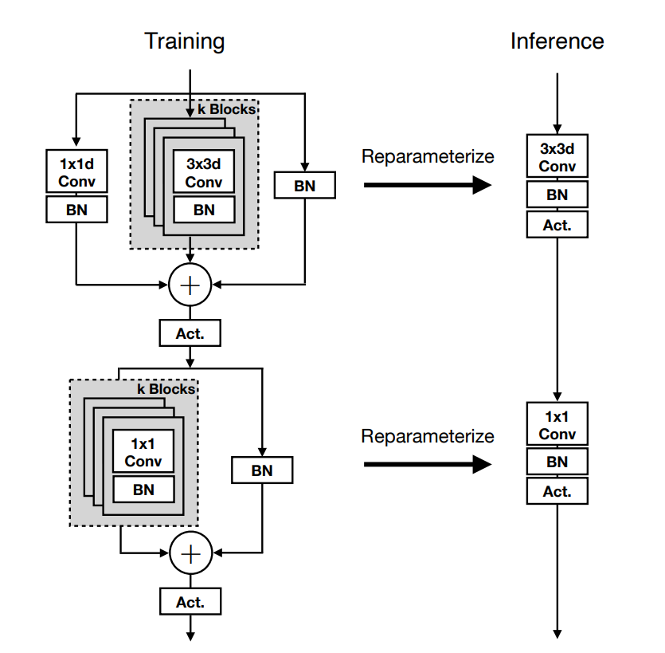
  
    Use structural re-parameterization to decouple the *training* architecture from the *inference* architecture
  
    具体来说，MobileOne 的 re-parameterization 做的是把训练时的多分支线性/仿射变换，等价合并成推理时的一个卷积层。先看单个 `Conv-BN` 分支也就是吸BN的操作
  
    设第 $i$ 个卷积分支融合后的参数为 $(W_i', b_i')$，`scale` 分支融合后为 $(W_s', b_s')$，identity 分支融合后为 $(W_{\mathrm{id}}', b_{\mathrm{id}}')$。由于这些分支的输出是在非线性激活之前直接相加，所以有
    
    $$
    \begin{aligned}
    y
    &= \sum_{i=1}^{n} (W_i' * x + b_i')
       + \operatorname{Pad}(W_s') * x + b_s'
       + W_{\mathrm{id}}' * x + b_{\mathrm{id}}' \\
    &= \left(
        \sum_{i=1}^{n} W_i'
        + \operatorname{Pad}(W_s')
        + W_{\mathrm{id}}'
       \right) * x
       + \left(
        \sum_{i=1}^{n} b_i'
        + b_s'
        + b_{\mathrm{id}}'
       \right).
    \end{aligned}
    $$
    
    所以最终可重参数化成一个卷积：
    
    $$
    \boxed{
    W_{\mathrm{rep}} =
    \sum_{i=1}^{n} W_i'
    + \operatorname{Pad}(W_s')
    + W_{\mathrm{id}}'
    }
    $$
  
    $$
    \boxed{
    b_{\mathrm{rep}} =
    \sum_{i=1}^{n} b_i'
    + b_s'
    + b_{\mathrm{id}}'
    }
    $$
  
    对 `rbr_scale`，它原本是 $1 \times 1$ 卷积，不能直接和 $k \times k$ 主分支相加，因此需要把它 zero-pad 到 $k \times k$，并把原来的 $1 \times 1$ 权重放在中心位置：
  
    $$
    \operatorname{Pad}(W_s')_{c,d,u,v} =
    \begin{cases}
    W_{s,c,d,0,0}', & u = \lfloor k/2 \rfloor,\ v = \lfloor k/2 \rfloor, \\
    0, & \text{otherwise}.
    \end{cases}
    $$
  
    对 `rbr_skip`，identity 可以看成一个特殊卷积核：中心位置为 1，其余位置为 0。若是普通卷积或 depthwise/group convolution，代码用 `i % input_dim` 来保证每个输出通道只连接到它在该 group 内对应的输入通道：
  
    $$
    W_{\mathrm{id},c,d,u,v} =
    \begin{cases}
    1, & d = c \bmod (C_{\mathrm{in}}/g),\ u = \lfloor k/2 \rfloor,\ v = \lfloor k/2 \rfloor, \\
    0, & \text{otherwise}.
    \end{cases}
    $$
    
    其中 $C_{\mathrm{in}}$ 是输入通道数，$g$ 是 `groups`。然后这个 identity kernel 也按照上面的 BN 融合公式得到 $(W_{\mathrm{id}}', b_{\mathrm{id}}')$。
    
    之所以可以这样做，核心原因是：卷积是线性变换，BN 在推理阶段使用固定均值和方差，因此是逐通道仿射变换；多个分支在激活函数之前相加时，若它们的 stride、padding、groups 和输出 shape 对齐，多个仿射卷积的和仍然是一个仿射卷积。因此训练时可以保留多分支结构来增加优化自由度，推理时则把这些分支无损合并为单个 `Conv2d(weight=W_rep, bias=b_rep)`，得到与训练结构相同的输出但更低的延迟和更好的硬件执行效率。
    
    - the DSC module is integrated by "scale branch", "skip branch" and "conv branches"
    
      - `rbr_scale`: center-only 1×1 path (after padding) that improves channel-wise scaling flexibility
      - `rbr_skip`: identity + BN path providing residual-like behavior and extra affine freedom
      - `rbr_conv`: main expressive conv paths (3×3 or 1×1)
    
    
    
  - Pipeline
  
    - 先来看看结构
  
      ```python
      # 可以看到只有前2个小模型的"num_conv_branches": 4,其他都是2,说明branch不是越大越好的
      PARAMS = {
          "s0small": {"width_multipliers": (0.5, 0.75, 0.5, 0.5), "num_conv_branches": 4},
          "s0": {"width_multipliers": (0.75, 1.0, 1.0, 2.0), "num_conv_branches": 4},
          "s0_b2": {"width_multipliers": (0.75, 1.0, 1.0, 2.0), "num_conv_branches": 2},
          "s1": {"width_multipliers": (1.5, 1.5, 2.0, 2.5)},
          "s2": {"width_multipliers": (1.5, 2.0, 2.5, 4.0)},
          "s3": {"width_multipliers": (2.0, 2.5, 3.0, 4.0)},
          "s4": {"width_multipliers": (3.0, 3.5, 3.5, 4.0), "use_se": True},
      }
      
      def mobileone(
          num_classes: int = 1000,
          inference_mode: bool = False,
          variant: str = "s0",
          stagetype=None,
      ) -> nn.Module:
          """Get MobileOne model.
      
          :param num_classes: Number of classes in the dataset.
          :param inference_mode: If True, instantiates model in inference mode.
          :param variant: Which type of model to generate.
          :param stagetype:
          :return: MobileOne model."""
          return MobileOne(
              num_classes=num_classes,
              inference_mode=inference_mode,
              stagetype=stagetype,
              **(PARAMS[variant]),
          )
      ```
      
      然后我们来看看MobileOne的具体构造
      
      ```
      # Build stages
              self.stage0 = MobileOneBlock(
                  in_channels=3,
                  out_channels=self.in_planes,
                  kernel_size=3,
                  stride=2,
                  padding=1,
                  inference_mode=self.inference_mode,
              )
              self.cur_layer_idx = 1
              self.stage1 = self._make_stage(
                  int(64 * width_multipliers[0]), num_blocks_per_stage[0], num_se_blocks=0
              )
              self.stage2 = self._make_stage(
                  int(128 * width_multipliers[1]), num_blocks_per_stage[1], num_se_blocks=0
              )
              if self.stagetype == "stage3s1":
                  self.stage3 = self._make_stride1_stage(
                      int(256 * width_multipliers[2]),
                      num_blocks_per_stage[2],
                      num_se_blocks=int(num_blocks_per_stage[2] // 2) if use_se else 0,
                  )
              else:
                  self.stage3 = self._make_stage(
                      int(256 * width_multipliers[2]),
                      num_blocks_per_stage[2],
                      num_se_blocks=int(num_blocks_per_stage[2] // 2) if use_se else 0,
                  )
                  self.stage4 = self._make_stage(
                      int(512 * width_multipliers[3]),
                      num_blocks_per_stage[3],
                      num_se_blocks=num_blocks_per_stage[3] if use_se else 0,
                      stride=1 if self.stagetype == "stage4s1" else 2,
                  )
                  self.gap = nn.AdaptiveAvgPool2d(output_size=1)
                  self.linear = nn.Linear(int(512 * width_multipliers[3]), num_classes)
      ```
      
      构造了四个stage,然后一个池化层+线性层,直接输出类别
      
      ```
      def _make_stage(
          self, planes: int, num_blocks: int, num_se_blocks: int, stride: int = 2
      ) -> nn.Sequential:
      
              # Get strides for all layers
              strides = [stride] + [1] * (num_blocks - 1)
              blocks = []
              for ix, stride in enumerate(strides):
                  use_se = False
                  if num_se_blocks > num_blocks:
                      raise ValueError("Number of SE blocks cannot exceed number of layers.")
                  if ix >= (num_blocks - num_se_blocks):
                      use_se = True
      
                  # Depthwise conv
                  blocks.append(
                      MobileOneBlock(
                          in_channels=self.in_planes,
                          out_channels=self.in_planes,
                          kernel_size=3,
                          stride=stride,
                          padding=1,
                          groups=self.in_planes,
                          inference_mode=self.inference_mode,
                          use_se=use_se,
                          num_conv_branches=self.num_conv_branches,
                      )
                  )
                  # Pointwise conv
                  blocks.append(
                      MobileOneBlock(
                          in_channels=self.in_planes,
                          out_channels=planes,
                          kernel_size=1,
                          stride=1,
                          padding=0,
                          groups=1,
                          inference_mode=self.inference_mode,
                          use_se=use_se,
                          num_conv_branches=self.num_conv_branches,
                      )
                  )
                  self.in_planes = planes
                  self.cur_layer_idx += 1
              return nn.Sequential(*blocks)
      ```
      
    - reparameterize
  
      ```python
      def reparameterize(self):
          """ Following works like `RepVGG: Making VGG-style ConvNets Great Again` -
          https://arxiv.org/pdf/2101.03697.pdf. We re-parameterize multi-branched
          architecture used at training time to obtain a plain CNN-like structure
          for inference.
          """
          if self.inference_mode:
              return
          kernel, bias = self._get_kernel_bias()
          self.reparam_conv = nn.Conv2d(in_channels=self.rbr_conv[0].conv.in_channels,
                                        out_channels=self.rbr_conv[0].conv.out_channels,
                                        kernel_size=self.rbr_conv[0].conv.kernel_size,
                                        stride=self.rbr_conv[0].conv.stride,
                                        padding=self.rbr_conv[0].conv.padding,
                                        dilation=self.rbr_conv[0].conv.dilation,
                                        groups=self.rbr_conv[0].conv.groups,
                                        bias=True)
          self.reparam_conv.weight.data = kernel
          self.reparam_conv.bias.data = bias
      
          # Delete un-used branches
          for para in self.parameters():
              para.detach_()
          self.__delattr__('rbr_conv')
          self.__delattr__('rbr_scale')
          if hasattr(self, 'rbr_skip'):
              self.__delattr__('rbr_skip')
      
          self.inference_mode = True
      ```
  
      当然主要是`._get_kernel_bias`的计算
  
      ```python
      def _get_kernel_bias(self) -> Tuple[torch.Tensor, torch.Tensor]:
          """ Method to obtain re-parameterized kernel and bias.
          Reference: https://github.com/DingXiaoH/RepVGG/blob/main/repvgg.py#L83
      
          :return: Tuple of (kernel, bias) after fusing branches.
          """
          # get weights and bias of scale branch
          kernel_scale = 0
          bias_scale = 0
          if self.rbr_scale is not None:
              kernel_scale, bias_scale = self._fuse_bn_tensor(self.rbr_scale)
              # Pad scale branch kernel to match conv branch kernel size.
              pad = self.kernel_size // 2
              kernel_scale = torch.nn.functional.pad(kernel_scale,
                                                     [pad, pad, pad, pad])
      
          # get weights and bias of skip branch
          kernel_identity = 0
          bias_identity = 0
          if self.rbr_skip is not None:
              kernel_identity, bias_identity = self._fuse_bn_tensor(self.rbr_skip)
      
          # get weights and bias of conv branches
          kernel_conv = 0
          bias_conv = 0
          for ix in range(self.num_conv_branches):
              _kernel, _bias = self._fuse_bn_tensor(self.rbr_conv[ix])
              kernel_conv += _kernel
              bias_conv += _bias
      
          kernel_final = kernel_conv + kernel_scale + kernel_identity
          bias_final = bias_conv + bias_scale + bias_identity
          return kernel_final, bias_final
      
      def _fuse_bn_tensor(self, branch) -> Tuple[torch.Tensor, torch.Tensor]:
          """ Method to fuse batchnorm layer with preceeding conv layer.
          Reference: https://github.com/DingXiaoH/RepVGG/blob/main/repvgg.py#L95
      
          :param branch:
          :return: Tuple of (kernel, bias) after fusing batchnorm.
          """
          if isinstance(branch, nn.Sequential):
              kernel = branch.conv.weight
              running_mean = branch.bn.running_mean
              running_var = branch.bn.running_var
              gamma = branch.bn.weight
              beta = branch.bn.bias
              eps = branch.bn.eps
          else:
              assert isinstance(branch, nn.BatchNorm2d)
              if not hasattr(self, 'id_tensor'):
                  input_dim = self.in_channels // self.groups
                  kernel_value = torch.zeros((self.in_channels,
                                              input_dim,
                                              self.kernel_size,
                                              self.kernel_size),
                                             dtype=branch.weight.dtype,
                                             device=branch.weight.device)
                  for i in range(self.in_channels):
                      kernel_value[i, i % input_dim,
                                   self.kernel_size // 2,
                                   self.kernel_size // 2] = 1
                  self.id_tensor = kernel_value
              kernel = self.id_tensor
              running_mean = branch.running_mean
              running_var = branch.running_var
              gamma = branch.weight
              beta = branch.bias
              eps = branch.eps
          std = (running_var + eps).sqrt()
          t = (gamma / std).reshape(-1, 1, 1, 1)
          return kernel * t, beta - running_mean * gamma / std
      
      def _conv_bn(self,
                   kernel_size: int,
                   padding: int) -> nn.Sequential:
          """ Helper method to construct conv-batchnorm layers.
      
          :param kernel_size: Size of the convolution kernel.
          :param padding: Zero-padding size.
          :return: Conv-BN module.
          """
          mod_list = nn.Sequential()
          mod_list.add_module('conv', nn.Conv2d(in_channels=self.in_channels,
                                                out_channels=self.out_channels,
                                                kernel_size=kernel_size,
                                                stride=self.stride,
                                                padding=padding,
                                                groups=self.groups,
                                                bias=False))
          mod_list.add_module('bn', nn.BatchNorm2d(num_features=self.out_channels))
          return mod_list
      ```
  
  - Pros
  
    - Extremely fast at inference due to: Single-path structure/Fewer ops, better cache behavior.
  
  - Cons
  
    - Once fused, the model loses its multi-branch flexibility (harder to fine-tune structurally).


## Vit Zoo

check [here](./02-5-Vit-Zoo.md)


## Others

- __Spatial Pyramid Pooling in Deep Convolutional Networks for Visual Recognition.__ *Kaiming He et al.* __IEEE Transactions on Pattern Analysis and Machine Intelligence, 2014__ [(Arxiv)](https://arxiv.org/abs/1406.4729) [(S2)](https://www.semanticscholar.org/paper/cbb19236820a96038d000dc629225d36e0b6294a) (Citations __12112__)

  - Takeaway: SPP uses **multi-level pooling** to produce fixed-length features from **any input size**.

  - Motivation: Before SPP, standard CNN (e.g., AlexNet, VGG-style networks) required **fixed-size inputs**

  - Core Mechanism

    Apply pooling over **spatial bins of different granularities**, producing a **fixed-dimensional output** independent of the input feature map size.

  

- __VarifocalNet: An IoU-aware Dense Object Detector.__ *Haoyang Zhang et al.* __2021 IEEE/CVF Conference on Computer Vision and Pattern Recognition (CVPR), 2020__ [(Arxiv)](__VarifocalNet: An IoU-aware Dense Object Detector.__ *Haoyang Zhang et al.* __2021 IEEE/CVF Conference on Computer Vision and Pattern Recognition (CVPR), 2020__ [(Arxiv)](https://arxiv.org/abs/2008.13367) [(S2)](https://www.semanticscholar.org/paper/14c3510e4f4b370d5cd0420037406024533f4b6f) (Citations __851__)) [(S2)](https://www.semanticscholar.org/paper/14c3510e4f4b370d5cd0420037406024533f4b6f) (Citations __1305__)

- __A Dual Weighting Label Assignment Scheme for Object Detection.__ *Shuai Li et al.* __2022 IEEE/CVF Conference on Computer Vision and Pattern Recognition (CVPR), 2022__ [(Arxiv)](https://arxiv.org/abs/2203.09730) [(S2)](https://www.semanticscholar.org/paper/8e68ea6bf41335d341cf629fa03b91463531bf98) (Citations __100__)

- __Once for All: Train One Network and Specialize it for Efficient Deployment.__ *Han Cai et al.* __ArXiv, 2019__ [(Arxiv)](https://arxiv.org/abs/1908.09791) [(S2)](https://www.semanticscholar.org/paper/7823292e5c4b05c47af91ab6ddf671a0da709e82) (Citations __1414__)

- __PBADet: A One-Stage Anchor-Free Approach for Part-Body Association.__ *Zhongpai Gao et al.* __ArXiv, 2024__ [(Arxiv)](https://arxiv.org/abs/2402.07814) [(S2)](https://www.semanticscholar.org/paper/1ba604d5766f632f5430b8a5d8f9d656645ac8a6) (Citations __1__)

  - Takeaway: PBADet predicts part boxes plus a **part → body-center offset** for one-stage association.

    

  - Motivation: Earlier pipelines often used **two-stage** designs (detect bodies and parts separately, then associate) or **body → part offsets** (e.g., predicting multiple offsets from each body to many parts), which can become **channel-heavy** as part types grow and can be brittle under occlusion/invisibility. PBADet instead flips the direction to **part → body** with a single universal offset.

  - Core Mechanism: For each part candidate (dense point/feature location), PBADet predicts:

    1. the **part bounding box** + classification, and
    2. a **2D vector** that points from the part to its **owning body center**.
        This keeps the association head **constant-sized** regardless of the number of part categories.

  - Pros:

    - Simple & fast: one-stage, anchor-free; lightweight association head
    - Scalable: offset head does **not** grow with part category count

  - Cons:

    - **Still relies on post-processing matching** (not fully end-to-end assignment)
    - **Sensitive to body detection quality**: missed/shifted body boxes can break association. Crowded/overlapping people may confuse the assignments.

## References

- [Depthwise Convolution explanation]( https://towardsdatascience.com/a-basic-introduction-to-separable-convolutions-b99ec3102728)
- [MobileNetv2 explanation]( https://ai.googleblog.com/2018/04/mobilenetv2-next-generation-of-on.html)
- [MobileNetV2 explained video](https://www.youtube.com/watch?v=DkNIBBBvcPs)
- [MobileNetV1_intro](https://research.google/blog/mobilenets-open-source-models-for-efficient-on-device-vision/?_gl=1)
- ###### [Selective-search](https://learnopencv.com/selective-search-for-object-detection-cpp-python/)
