# DETR Zoo

## DETR

- __End-to-End Object Detection with Transformers.__ *Nicolas Carion et al.* __ECCV, 2020__ [(Arxiv)](https://arxiv.org/abs/2005.12872) [(S2)](https://www.semanticscholar.org/paper/962dc29fdc3fbdc5930a10aba114050b82fe5a3e)[(code_link)](https://github.com/facebookresearch/detr)[(Video)](https://www.bilibili.com/video/BV1GB4y1X72R/?spm_id_from=333.337.search-card.all.click&vd_source=3a8e3df5af30a81c441200ce3c96e8fc) (Citations __15847__)

  - Takeaway: DETR(DEtection TRansformer) 将目标检测重新定义为 set prediction 问题——用 Transformer encoder-decoder 直接输出一组无序预测框，再通过 **Hungarian bipartite matching** 做一对一匹配。彻底消除了 anchor、NMS、region proposal 等手工组件，是第一个真正的 **end-to-end object detector**。虽收敛慢（500 epoch），但开启了 DETR 系列（Deformable DETR, DINO, RT-DETR 等）的整个方向。

    > [!NOTE]
    >
    > set prediction 问题(集合预测问题)：
    >
    > 什么是集合预测问题？模型不是按固定位置、固定顺序去预测结果，而是直接预测一个“集合”{目标1,目标2...}，集合是没有顺序的

  - Motivation: 

    1. Transformer已经在其他领域游龙了，能否用在目标检测领域

    2. 能否像 NLP 一样，把 detection 中所有手工设计的组件（anchor, NMS, label assignment规则）全部踢掉，用 Transformer 的 attention 机制自然地学习物体间关系？

  - Core Mechanism:

    DETR 的创新可以归纳为三个点，各自替代了传统检测器中的手工模块：

    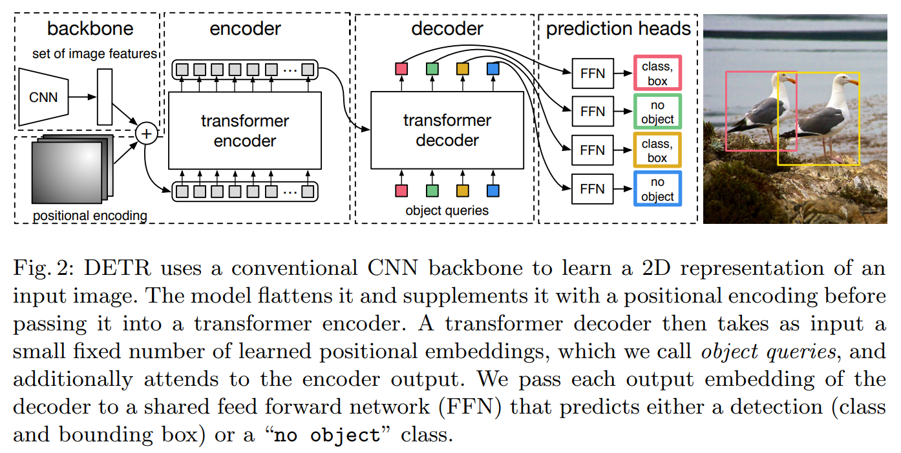

    > DETR 整体架构：backbone → encoder → decoder → prediction heads。decoder 的 object queries 是 learnable embeddings，每个 query 负责一个物体。

    - **Object Queries（Learnable Embeddings）→ 替代 anchor**

      

      - **What**：$N$ 个可学习的 embedding vectors（默认 $N=100$），作为 decoder 的输入 query，训练后每个 query 学会关注图像中特定位置/模式的物体。
      - **Why**：传统检测器需要预先定义 anchor boxes（尺寸、长宽比、位置），这些是手工 heuristic。Object queries 是可学习的，让模型自己学出"该问什么问题"。
      - **How**：`nn.Embedding(num_queries, hidden_dim)` → 与 encoder 输出做 cross-attention → 每个 query 输出一个 class + bbox。

        Begins as a ramdom vector(n,learnable) and take the encoder output as side input.

        > [!TIP]
        >
        > It seems like you trained n different people to ask different questions about the input image.

        > [!NOTE]
        >
        > 为什么需要这个query?：因为 decoder 不是自己凭空开始工作的，它需要一组初始"查询 token"（参考LLM）
        >
  
      这里需要介绍一下decoder的不同（因为这里与LLM的decoder一个一个token输出是不一样的）
  
      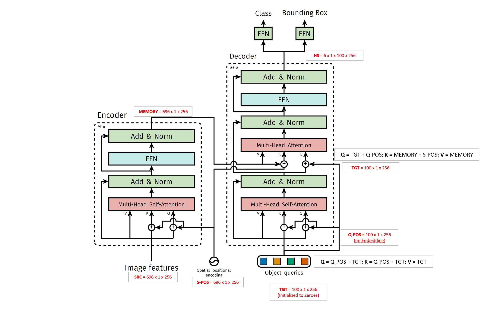
  
      ```
      # 也就是图里面的Q-POS
      query_embed = query_embed.unsqueeze(1).repeat(1, bs, 1)
      # tgt stands for target
      tgt = torch.zeros_like(query_embed)
      hs = self.decoder(
          tgt,
          memory,
          memory_key_padding_mask=mask,
          pos=pos_embed,
          query_pos=query_embed
      )
      
      decoder self-attention:
      Q = tgt + object_query
      K = tgt + object_query
      V = tgt
      
      decoder cross-attention:
      Q = tgt + object_query
      K = encoder_memory + image_pos
      V = encoder_memory
      ```

      | 名称         | 代码变量                     | 作用                       | 是否可学习             | 初始值     |
      | ------------ | ---------------------------- | -------------------------- | ---------------------- | ---------- |
      | tgt          | `tgt`                        | decoder 当前内容状态       | 不是单独参数           | 全 0       |
      | object query | `query_embed` 或 `query_pos` | 给每个检测槽位提供身份提示 | 是 learnable embedding | 随机初始化 |
  
      > [!NOTE]
      >
      > 为什么tgt初始化为全0？ -- 因为原始 DETR 的 decoder 一开始没有像 NLP 那样的 target token
      >
      > object query默认标准正态分布初始化，然后不断学习
  
    - **Transformer Encoder → 替代CNN特征提取与混合**
  
      
  
      - **What**：标准 Transformer encoder，输入为 backbone feature map + positional encoding，输出全局增强的特征图。self-attention 让每个像素与所有其他像素交互。
  
        > [!NOTE]
        >
        > 为什么这样设计对于图像的检测是有用的呢？
        > Let`s check why the encoder is useful for image detection. Now each point in the matrix connect two points in the $H\times W$ map and 2 points can define a bbox. Which means every element in the matrix stands for the information about different bboxes.
  
      - **Why**：encoder 的 self-attention 输出是一个 $HW \times HW$ 的 attention matrix，其中每个元素表示两个像素点的关系。两个点可以定义一个 bbox——因此 encoder 本质上是让模型学习所有可能的 bounding box 关系。
  
      - **How**：6 层 encoder，每层 Multi-Head Self-Attention + FFN，复杂度 $\mathcal{O}(H^2W^2C)$（二次方——后续 Deformable DETR 主要改进这点）。
  
    - **Set Prediction via Hungarian Matching → 替代 NMS + Label Assignment**
  
      - **What**：DETR 预测 $N$ 个 object queries（$N=100$，远多于图中物体数），每个 query 输出一个 class + bbox。训练时用 **Hungarian bipartite matching** 在 GT 和 predictions 之间做一对一最优匹配——匹配上的 predictions 是正样本，其余为负样本（包括多余的 query 输出"no object" $\varnothing$）。匹配代价由三部分组成：
        $$
        \sigma = \arg\min_{\sigma} \sum_i \mathcal{L}_{match}(y_i, \hat{y}_{\sigma(i)})
        $$
        
        - class probability（所有query）：$-p_{\sigma(i)}(c_i)$（预测 GT 类别的概率越大，代价越小）
        
          > [!NOTE]
          >
          > 为什么是这个？
          >
          > 因为分类损失 cross entropy 类似$-\log p(c_i)$，这里使用概率项近似$1-\log p(c_i)$，因为只关心匹配的cost所以去掉1,最后只有$-p(c_i)$
        
        - L1 box distance（仅匹配query）
        
        - GIoU loss（仅匹配query）
        
      - **Why**：传统检测器需要 NMS 去除重复框，且 label assignment 依赖 IoU threshold 等手工规则。Hungarian matching 天然保证每个 GT 只有一个匹配 prediction（one-to-one），推理时无需 NMS，训练时无需手工 assignment 规则。
  
      - **How**：对每张图的 cost matrix（$N_{pred} \times N_{gt}$），用 scipy 的 `linear_sum_assignment`（匈牙利算法）求解最优匹配 → matched pairs 计算分类+回归 loss → unmatched predictions 计算 "no object" loss。
  
        This makes detections **order-invariant** and **unique**, removing NMS.
  
        > [!NOTE]
        >
        > 二分图匹配（Bipartite Matching）
        >
        > Sol: 匈牙利算法（Hungarian Algorithm）就是一个解决二分图最优匹配问题的经典算法
        
      - 这里不同层的decoder输出都可以看作是对bbox的微调,因此要对中间层加 auxiliary loss(每层query输出进入FFD算loss)

  - Pipeline:
  
    
  
    现在有上图大概知道整体结构框架，下面我们结合代码来深入探究每个部分的实现。这里我们用resnet50作为backbone，选取一张大小为`[H=800,W=1200]`的图片作为输入

    ```python
    model = DETR(
        backbone=backbone_with_pos,
        transformer=transformer,
        num_classes=91,
        num_queries=num_queries,
        aux_loss=False,
    )
    ```
  
    - backbone: `num_channel = 2048`

      - backbone: 选一个backbone（这里以resnet50作为参考）

        ```
        self.body = IntermediateLayerGetter(backbone, return_layers=return_layers) #用于提取中间特征层
        xs = self.body(tensor_list.tensors)
        ```
  
        这里得到的xs是一个字典eg:
  
        ```
        {
        	"0": feature_map
        }
        ```
  
        然后再用一层字典封装:因为输出的xs只是特征图，后续detr还需要mask（对应featuremap的大小，使用F.interpolate放缩），因为重新构建了一个字典，下面代码中name是每个层的编号0,1，x是featuremap，看你需要哪些层提取出来变为新的NestedTensor
  
        ```python
        out: Dict[str, NestedTensor] = {}
        for name, x in xs.items():
            m = tensor_list.mask
            assert m is not None
            mask = F.interpolate(m[None].float(), size=x.shape[-2:]).to(torch.bool)[0]
            out[name] = NestedTensor(x, mask)
        return out
        ```
  
      - positional embedding: 正弦位置编码PositionEmbeddingSine，实现和transformer中的positional embedding差不多，而且泛化到了图像。最后输出`[B, 2 * num_pos_feats(128), H, W]`
  
      - jointer: combine backbone and position embedding
      
        - 输入：NestedTensor`[1,2048,25,38]`
      
          > [!NOTE]
          >
          > 这里`[1,2048,25,38]`是
          >
          > - 1：1 张图
          > - 2048：ResNet-50 最后一层 layer4 的通道数
          > - 25 x 38：原图 800 x 1200 经过 backbone 下采样后的空间大小
        
          - tensor_list.tensors：真正的图像 batch，形状通常是 [B, C, H, W]
          - tensor_list.mask：padding 区域标记，形状通常是 [B, H, W]
        
          如何得到的
        
        - 分别输入给backbone and positional embedding
        
        - 输出：`[features, pos(position embedding)]`
        
          实际上在后续的使用中pos_embedding就是直接加在了tensor上
        
          ```python
          def with_pos_embed(self, tensor, pos: Optional[Tensor]):
              return tensor if pos is None else tensor + pos
          ```
      
    - transformer: 
  
      ```
      transformer = Transformer(d_model=256, return_intermediate_dec=True)
      ```
  
      > [!TIP]
      >
      > d_model = 2*num_pos_feats=256
  
      ```python
      self.query_embed = nn.Embedding(num_queries, hidden_dim) # 本质上是一个可学习参数表，没有输入，当作被训练为查询不同信息的侦探
      self.input_proj = nn.Conv2d(backbone.num_channels, hidden_dim, kernel_size=1)
      # input_proj先经过一个 1x1 conv，把通道数从 2048 压成 256(transformer input)
      ```
  
      ```python
      hs = self.transformer(self.input_proj(src), mask, self.query_embed.weight, pos[-1])[0]
      ```
  
      > 具体结构见attention is all you need
  
      detr使用的transformer和原始transformer不一样的地方就在多了learned queries`self.query_embed.weight`
  
      > 直接取query_embed的权重，没有输入
      
      这是 DETR 里那 num_queries（默认100） 个 learned queries
      
      - shape 通常是：[num_queries, hidden_dim] = [100, 256]
      - 每个 query 都会在 decoder 里尝试负责一个目标
      
      ```
      query features
         ↓
      self-attention among queries
         ↓
      cross-attention: query attends to image memory
         ↓
      FFN
         ↓
      prediction head: class + box delta
         ↓
      update reference box
      ```
      
      最后transformer输出`hs=torch.Size([6, 1, 100, 256])`
      
      > [!NOTE]
      >
      > 我们来看看输出为什么是这个样子：`[layer_num,batch_size,num_queries,hidden_dim]`
      
    - class and bbox
  
      在得到transformer的输出后：
  
      ```
      self.class_embed = nn.Linear(hidden_dim, num_classes + 1)
      self.bbox_embed = MLP(hidden_dim, hidden_dim, 4, 3)
      
      outputs_class = self.class_embed(hs)
      outputs_coord = self.bbox_embed(hs).sigmoid()
      out = {'pred_logits': outputs_class[-1], 'pred_boxes': outputs_coord[-1]}
      # 只选decoder最后一层的输出最为最终输出
      ```
  
      所以最终每张图得到的是：
  
        - pred_logits.shape = [1, 100, num_classes + 1]
        - pred_boxes.shape = [1, 100, 4]
  
    上述只是介绍了推理阶段，现在我们来看看训练阶段。我们主要来看看如何匹配和loss计算的
  
    在看这两个之前，如果是训练阶段
  
    ```
    if self.aux_loss:
          out['aux_outputs'] = self._set_aux_loss(outputs_class, outputs_coord)
    ```

    这里训练和推理第一次出现分叉：
    - 推理一般只看最终层 pred_logits、pred_boxes
    - 训练如果 aux_loss=True，还会额外用每个 decoder 中间层的输出算辅助损失
  
    > [!TIP]
    >
    > 训练过程不止看最终结果，还看过程草稿
  
    在类别`SetCriterion`中，主要先后做了两件事
  
    1. compute hungarian assignment between ground truth boxes and the outputs of the model -- 做匹配
  
       ```
       outputs_without_aux = {k: v for k, v in outputs.items() if k != 'aux_outputs'}
       
       # Retrieve the matching between the outputs of the last layer and the targets
       # 直接匈牙利算法做二分图匹配
       indices = self.matcher(outputs_without_aux, targets)
       # 归一化计算，避免不同batch中gt数量不一样的影响
       # Compute the average number of target boxes accross all nodes, for normalization purposes
       num_boxes = sum(len(t["labels"]) for t in targets)
       num_boxes = torch.as_tensor([num_boxes], dtype=torch.float, device=next(iter(outputs.values())).device)
       if is_dist_avail_and_initialized():
           torch.distributed.all_reduce(num_boxes)
       num_boxes = torch.clamp(num_boxes / get_world_size(), min=1).item()
       ```
  
       那么关键就是看matcher中是如何计算的：

       ```
       # Compute the classification cost. Contrary to the loss, we don't use the NLL,
       # but approximate it in 1 - proba[target class].
       # The 1 is a constant that doesn't change the matching, it can be ommitted.
       # 分类代价：预测这个 GT 类别的概率越大，代价越小
       cost_class = -out_prob[:, tgt_ids]
       
       # Compute the L1 cost between boxes
       cost_bbox = torch.cdist(out_bbox, tgt_bbox, p=1)
       
       # Compute the giou cost betwen boxes
       cost_giou = -generalized_box_iou(box_cxcywh_to_xyxy(out_bbox), box_cxcywh_to_xyxy(tgt_bbox))
       
       # Final cost matrix
       C = self.cost_bbox * cost_bbox + self.cost_class * cost_class + self.cost_giou * cost_giou
       # 真正使用匈牙利算法做匹配
       indices = [linear_sum_assignment(c[i]) for i, c in enumerate(C.split(sizes, -1))]
       ```
  
    2. supervise each pair of matched ground-truth / prediction (supervise class and box) -- 算loss
  
  - Pros
  
    - **End-to-end, NMS-free**：首次实现真正的端到端检测，推理不需要任何后处理。
    - **架构简洁统一**：backbone + Transformer + prediction heads，无 anchor/NMS/region proposal 等手工模块。
    - **并行解码**：所有 object queries 同时解码（不像 RNN 要串行），推理快。
  
    > [!NOTE]
    >
    > RNNs for object detection were much slower and less effective, because they made predictions **sequentially rather than in parallel**.
  
  - Cons
  
    - **收敛极慢**：需要 500 epochs 训练（Faster R-CNN 只需 ~12），训练时间 ~2000 GPU-hours。
    - **小目标弱**：$AP_S$ 仅 20.5，因为只用 single-scale 低分辨率特征图（encoder 的 $\mathcal{O}(H^2W^2C)$ 复杂度限制高分辨率输入）。
    - **计算量大**：encoder self-attention 复杂度与特征图空间尺寸二次方关系，大图训练/推理昂贵。
    - **Query 数量固定**：$N=100$ 个 queries 需预设，图中物体少于 100 时有冗余，多于 100 时无法检测（实际 COCO 图中很少超过 100）。

## DETR Varients

下面这两篇都在解决原始 DETR 的一个核心问题：原始 DETR 太依赖随机 object query 自己学会找目标，早期训练时匹配不稳定，所以收敛慢。

- __DAB-DETR: Dynamic Anchor Boxes are Better Queries for DETR.__ *Shilong Liu et al.* __ArXiv, 2022__ [(Arxiv)](https://arxiv.org/abs/2201.12329) [(S2)](https://www.semanticscholar.org/paper/004f1d2b1b7d7dcecafdd94daee9c1b0aa3e65cf) (Citations __1226__)
  - Takeaway: DAB-DETR 把 DETR 中抽象的 object query 改成带有 `(x, y, w, h)` 的 dynamic anchor box query，让 query 一开始就有明确空间先验，并在 decoder 中逐层 refinement

    > [!NOTE]
    >
    > 类似Cascade R-CNN，世界是个大环，又回到了two-stage（螺旋上升）
  
  - Core Mechanism
  
    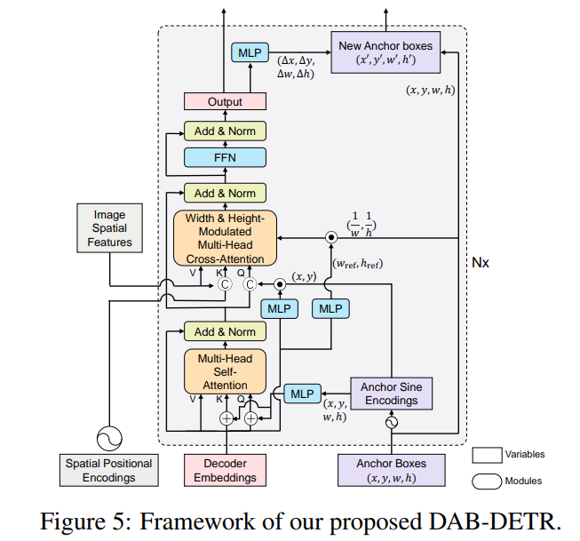
  
    > 把这个图的每个部分看懂了就懂了
  
    - anchor boxes: dynamic anchor box query，让 query 一开始就有明确空间先验，并在 decoder 中逐层 refinement
  
      ```
      k# 其中 DAB-DETR 默认 query_dim = 4（变成一个anchor），num_queries = 300
      self.refpoint_embed = nn.Embedding(num_queries, query_dim)
      ```
  
      其实就相当于把之前的object_query当作了anchor box,每一行就是一个 query 对应的 anchor box `anchor_i = [x_i, y_i, w_i, h_i]`
  
    - decoder embeddings就是之前的tgt，还是全是0
  
    - width & height-modulated multi-head cross-attention
  
      用 anchor box 的宽高信息去调制 query 的 positional attention，让大 box 和小 box 的 attention 范围不一样
  
      ```
      if self.modulate_hw_attn:
          refHW_cond = self.ref_anchor_head(output).sigmoid()
          query_sine_embed[..., self.d_model // 2:] *= (
              refHW_cond[..., 0] / obj_center[..., 2]
          ).unsqueeze(-1)
      
          query_sine_embed[..., :self.d_model // 2] *= (
              refHW_cond[..., 1] / obj_center[..., 3]
          ).unsqueeze(-1)
      ```
  
      `ref_anchor_head(output)` 会预测一个和宽高相关的调制因子，然后去缩放 query sine embedding
  
      > [!NOTE]
      >
      > 大的HW，大目标attention应该覆盖更大范围，多看点。小目标就少看点
  
    - 为什么self attention是 add，cross attention是concat?
  
      self attention中，自己交流，用add就行
  
      cross attention中为了更强的内容和位置匹配，使用concat，attention score 可以近似理解成：
      $$
      q k^T
      =
      [q_c, q_p] [k_c, k_p]^T
      =
      q_c k_c^T + q_p k_p^T
      $$
      其中：
  
      ```
      q_c k_c^T 是内容相似性
      q_p k_p^T 是位置相似性
      ```
  
    - anchor sine encoding + MLP到底是啥
  
      ```
      anchor box 原始形式:
          [x, y, w, h]
      
      anchor sine encoding:
          把 box 坐标变成高维 sin-cos 特征
      
      ref_point_head MLP:
          把这个高维位置特征映射到 decoder hidden_dim
      
      query_pos:
          真正送入 attention 的 query position embedding
      ```
  
    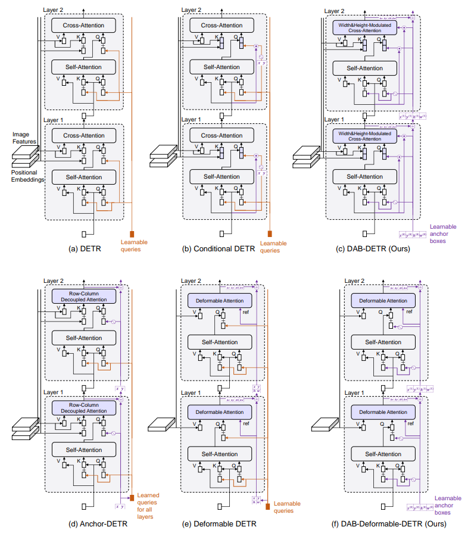
  
- __DN-DETR: Accelerate DETR Training by Introducing Query DeNoising.__ *Feng Li et al.* __2022 IEEE/CVF Conference on Computer Vision and Pattern Recognition (CVPR), 2022__ [(Arxiv)](https://arxiv.org/abs/2203.01305) [(S2)](https://www.semanticscholar.org/paper/78d02f2909a582c624eca2d0f67c91ee91974180) (Citations __1111__)
  - Takeaway: DN-DETR 在训练时加入 query denoising，把加噪后的 GT label 和 box 送入 decoder，并要求模型恢复原始 GT。result:降低 Hungarian matching 早期不稳定带来的训练难度，加速 DETR-like models 收敛
  
  - Motivation:
  
    认为DETR 收敛慢的一个重要原因是 Hungarian matching 在训练早期不稳定，导致同一个 GT 在不同训练阶段可能被不同 query 学习，从而造成优化目标不一致
  
  - Core Mechanism
  
    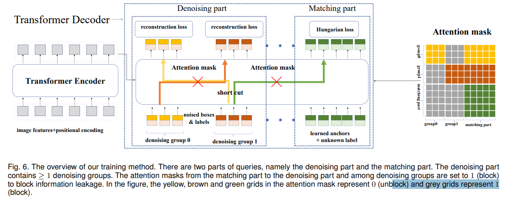
    
    是直接在DAB-DETR的基础上进行了修改
    
    ```
    GT labels + GT boxes
        |
        v
    复制多组
        |
        v
    对 label 和 box 加噪声
        |
        v
    生成 denoising queries
        |
        v
    和普通 matching queries 拼接
        |
        v
    送入 Transformer decoder
        |
        v
    拆分 decoder 输出
        |
        |---------------- denoising outputs
        |                 直接和原始 GT 计算 DN loss
        |
        |---------------- matching outputs
                          继续 Hungarian matching
                          计算 DETR loss
    ```
    
    
  
- __Dome-DETR: DETR with Density-Oriented Feature-Query Manipulation for Efficient Tiny Object Detection.__ *Zhangchi Hu et al.* __arXiv, 2025__ [(Arxiv)](https://arxiv.org/abs/2505.05741)

## Deformable DETR

- __Deformable DETR: Deformable Transformers for End-to-End Object Detection.__ *Xizhou Zhu et al.* __ICLR, 2021__ (Oral) [(Arxiv)](https://arxiv.org/abs/2010.04159) [(Code)](https://github.com/fundamentalvision/Deformable-DETR) (Citations __6350+__)

  - Takeaway: Deformable DETR 用 **deformable attention** 替代 DETR 的全局 dense attention——每个 query 只关注 reference point 周围的 **少量可学习采样点**（而非全部像素），将 encoder 复杂度从 $\mathcal{O}(H^2W^2C)$ 降为 $\mathcal{O}(HWC^2)$，同时通过 multi-scale deformable attention 自然聚合多尺度特征。结果是 **训练收敛快 10 倍、小目标 AP 大幅提升**，成为后续几乎所有 DETR 系列（RT-DETR, DINO 等）的基础 backbone。ICLR 2021 Oral。

  - Prior：detr, attention, deformable convolution。这里主要介绍一下可变形卷积

    普通卷积的采样位置是固定的。例如一个 3×3 卷积，在特征图某个位置 $p_0$ 上，会固定采样周围 9 个点：
    $$
    p_0 + p_k,\quad p_k \in \{(-1,-1),(-1,0),\dots,(1,1)\}
    $$
    输出可以写成：
    $$
    y(p_0)=\sum_k w_k \cdot x(p_0+p_k)
    $$
    这里的问题是：**卷积核的形状是固定的矩形网格**。但真实物体往往有形变，比如人弯腰、动物姿态变化、车辆角度变化。固定 3×3 网格不一定能对准物体的关键区域。
  
    ------
  
    Deformable Convolution 的核心思想是：不再固定采样 3×3 网格，而是让网络自己预测每个采样点的偏移量。
  
    于是采样位置变成：
    $$
    p_0 + p_k + \Delta p_k
    $$
    输出变为：
    $$
    y(p_0)=\sum_k w_k \cdot x(p_0+p_k+\Delta p_k)
    $$
    其中 $\Delta p_k$ 是网络学习出来的 offset。也就是说，卷积核不再是死板的方形，而是可以根据图像内容“弯曲”“拉伸”“移动”。
  
    可以理解为：
  
    ```
    普通卷积：
    □ □ □
    □ ● □
    □ □ □
    
    Deformable Conv：
       □
    □     □
       ●   □
    □       □
    ```

    这些采样点会自动偏向有用区域，比如物体边缘、关节、纹理等。

    > [!NOTE]
    >
    > 当然$\Delta p_k$得到的可能是小数，这个时候对应的值就用双线性插值得到
  
    Deformable Conv v1 主要学习 offset：
    $$
    p_k \rightarrow p_k + \Delta p_k
    $$
    Deformable Conv v2 又进一步加入 modulation scalar，也就是给每个采样点一个权重系数：
    $$
    y(p_0)=\sum_k w_k \cdot x(p_0+p_k+\Delta p_k)\cdot \Delta m_k
    $$
    其中 $\Delta m_k \in [0,1]$。 DCNv2：学位置 + 学重要性

  - Motivation: DETR 的两个致命问题源于 Transformer attention 在图像特征图上的固有缺陷：

    1. **收敛极慢**：DETR 需要 500 epochs 才能收敛（Faster R-CNN 只需 ~12 epochs）。根因是 attention 初始化时权重接近均匀分布（$A_{mqk} \approx 1/N_k$），导致梯度模糊，需要极长训练才能让 attention 学会聚焦到有意义的稀疏位置。
    2. **小目标检测弱 + 无法用高分辨率特征图**：现代检测器依赖高分辨率特征图检测小目标，但 DETR encoder 的自注意力复杂度为 $\mathcal{O}(H^2W^2C)$——空间尺寸翻倍，计算量翻四倍。因此 DETR 只能用低分辨率特征图（DC5 也只轻微改善），小目标 AP 仅 20.5。
  
    Insight：**deformable convolution 在图像域已经证明 sparse spatial sampling 高效且有效，但它缺少 Transformer 的 element relation modeling 能力。二者结合就能同时解决效率和建模能力问题。**
  
  - Core Mechanism:
  
    
  
    > Figure 1: Deformable DETR 整体架构。Encoder 用多尺度 deformable attention 替代全局 self-attention，Decoder 的 cross-attention 也替换为 multi-scale deformable attention，自注意力保持不变。
  
    Deformable DETR 的核心是 **deformable attention module**——它不像标准 attention 那样在所有 key 上做 softmax，而是对每个 query 只在一小簇 **可学习的采样点** 上做加权聚合。在此基础上自然扩展到**多尺度multi-scale**、并衍生出 iterative refinement 和 two-stage 变体。
  
    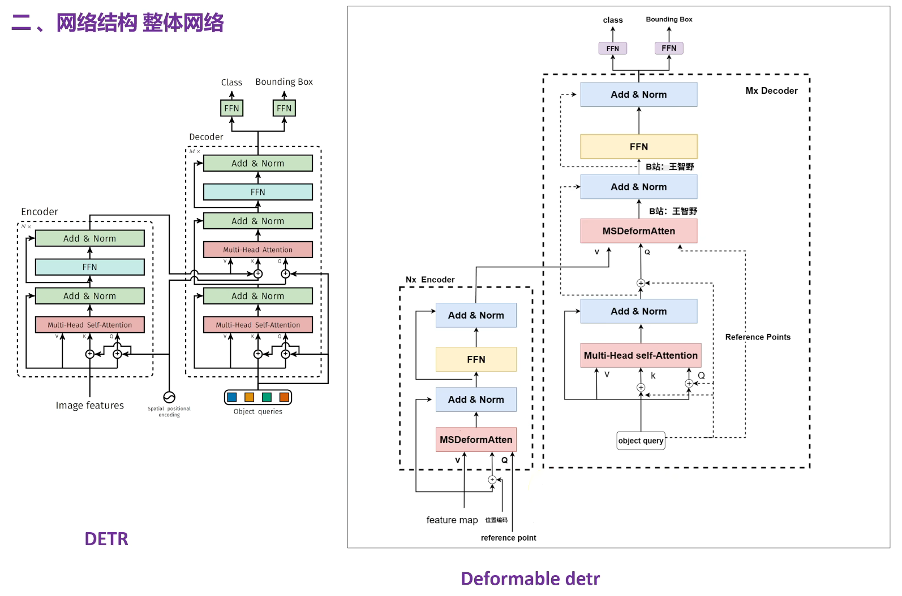
  
    > [!WARNING]
    >
    > 这里是用reference point还是proposal anchor???
  
    - Deformable Attention Module（核心模块）
  
      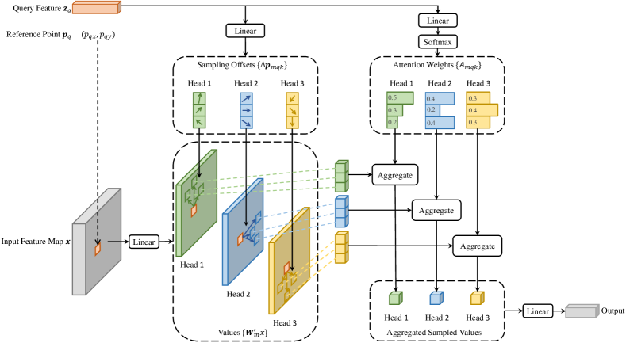
  
      > Figure 2: Deformable Attention 示意。每个 query 从特征图中采样 K=4 个点（橙色圆圈），采样偏移量和注意力权重均由 query 特征通过线性投影预测。
  
      - **What**: 给定 query feature $\boldsymbol{z}_q$ 和 reference point $\boldsymbol{p}_q$(每个query都有一个对应的reference point)，deformable attention 只在 $\boldsymbol{p}_q$ 周围采样 $K$ 个点（默认 $K=4$），每个点由采样偏移 $\Delta\boldsymbol{p}_{mqk}$ 和注意力权重 $A_{mqk}$ 控制：
        $$
        \text{DeformAttn}(\boldsymbol{z}_q, \boldsymbol{p}_q, \boldsymbol{x}) =
        \sum_{m=1}^{M} \boldsymbol{W}_m
        \left[
        \sum_{k=1}^{K} A_{mqk} \cdot \boldsymbol{W}'_m \, \boldsymbol{x}\left(\boldsymbol{p}_q + \Delta\boldsymbol{p}_{mqk}\right)
        \right]
        $$
        其中 $M$ 是 head 数，$K$ 是每 head 采样点数（$K \ll HW$）。$\Delta\boldsymbol{p} \in \mathbb{R}^2$ 和 $A \in [0,1]$ 均由 query 特征 $\boldsymbol{z}_q$ 通过线性投影得到（投影输出 $3MK$ 维：$2MK$ 给偏移量(2是x+y)，$MK$ 给 softmax 后的注意力权重）。因为 $\boldsymbol{p}_q + \Delta\boldsymbol{p}$ 是分数坐标，使用双线性插值取值。
  
        > [!NOTE]
        >
        > 这里head就是multi-head attention中的head，把 C 维特征拆成多个子空间，每个 head 在自己的子空间里独立计算 attention，最后把多个 head 的结果拼接起来。这里假设featuremap是96维，head=3，那么每个就负责32维。所以最后输出Head1/2/3是concat到一起再输入linear得到output
        
        对比标准 attention：
        $$
        \text{Attention}(Q,K,V) = \text{Softmax}\left(\frac{QK^T}{\sqrt{d}}\right)V, \quad \text{complexity: } \mathcal{O}(N_q \times HW\times C),\\
        when~self-attention~ N_q=HW,O((HW)^2C)
        $$
        Deformable attention 复杂度为 $\mathcal{O}(2N_q C^2 + \min(HWC^2, N_q K C^2))$。在 encoder 中 $N_q = HW$，复杂度降至 $\mathcal{O}(HWC^2)$；在 decoder cross-attention 中 $N_q = N$（query 数），复杂度降至 $\mathcal{O}(NKC^2)$，与空间尺寸无关。
        
        $N$是多尺度特征图的token总数，$N_k$为key/value的数量，$N_q$为query数量，decoder中为定值（300），encoder中$N_q = N_k = H * W$，$B$为batch，$C$为hidden dimension，$M$为attention heads，$d=C/M$为每个head的维度
        
        > [!NOTE]
        >
        > query是如何得到的：
        >
        > - encoder中，将所有多尺度特征图上的位置拼接起来`[B, S, C]`，其中$S = \sum_{l=1}^{L} H_l W_l$，然后再加上每个position embedding
        > - decoder定值，query=300为一个embedding_layer
        >
        > reference point如何得到：
        >
        > - encoder 的 reference point：来自 feature map 上每个位置的归一化坐标。
        >
        >
        > - one-stage decoder 的 reference point：由 learnable object query 经过 linear + sigmoid 预测出来。
        
      - **Why**: 标准 attention 初始化时 $A_{mqk} \approx 1/N_k$（均匀分布），当 $N_k = HW$ 很大时梯度几乎无差别，模型需要漫长训练才能学会聚焦。deformable attention 将选择范围缩到 $K$ 个点，初始化时这些点分布在 reference 附近，天然具有空间先验。同时复杂度从二次降为线性，使高分辨率特征图变得可用。
  
    - Multi-Scale Deformable Attention（多尺度扩展）
  
      - **What**: 将 deformable attention 从单尺度扩展为在 $L$ 层特征图（默认 $L=4$，对应 $C_3$ 到 $C_6$）上同时采样。每个 query 在每层采样 $K$ 个点，总计 $LK$ 个采样点。公式扩展为：
        $$
        \text{MSDeformAttn}(\boldsymbol{z}_q, \hat{\boldsymbol{p}}_q, \{\boldsymbol{x}^l\}_{l=1}^{L}) =
        \sum_{m=1}^{M} \boldsymbol{W}_m
        \left[
        \sum_{l=1}^{L} \sum_{k=1}^{K} A_{mlqk} \cdot \boldsymbol{W}'_m \, \boldsymbol{x}^l\left(\phi_l(\hat{\boldsymbol{p}}_q) + \Delta\boldsymbol{p}_{mlqk}\right)
        \right]
        $$
        其中 $\hat{\boldsymbol{p}}_q \in [0,1]^2$ 是归一化参考点坐标，$\phi_l(\cdot)$ 将其映射到第 $l$ 层特征图的实际坐标。注意力权重跨所有尺度和采样点做 softmax 归一化：$\sum_{l=1}^{L}\sum_{k=1}^{K} A_{mlqk} = 1$。
  
      - **Why**: 不同尺度的物体需要不同分辨率的特征来检测——大物体在低分辨率高层语义特征上检测，小物体需要高分辨率低层特征。标准 DETR 只能用单尺度特征图，小目标检测严重受限。Multi-scale deformable attention 让每个 query  可以自适应地从最相关的尺度提取信息，**无需额外 FPN**（实验证明加了 FPN 也无额外收益，因为 attention 本身就能跨尺度通信）。
  
      - **How**: 多尺度特征图从 ResNet 的 $C_3, C_4, C_5$ 经 1×1 conv 投影到 $C=256$，再对 $C_5$ 做 3×3 stride-2 conv 得到 $C_6$，共 4 层。encoder 中 query 和 key 都是多尺度特征图像素，每个像素的 reference point 就是它自己。为区分不同尺度，引入可学习的 **scale-level embedding** $\boldsymbol{e}_l$ 加到特征上。
  
    - Deformable Transformer Encoder & Decoder（在 DETR 中替换 attention）
  
      - **What**: **Encoder** 将所有 self-attention 层替换为 multi-scale deformable attention（query/key 都是多尺度特征图像素）。**Decoder** 只将 cross-attention 替换为 multi-scale deformable attention，self-attention 保持不变（仍是标准 attention，因为 object query 数量 $N=300$ 不大）。每个 object query 的 reference point $\hat{\boldsymbol{p}}_q$ 由 query embedding 经线性层 + sigmoid 预测得到，bbox 预测为相对 reference point 的偏移量（而非绝对坐标），加速收敛。
      - **Why**: Encoder 中 query/key 数量 = HW（可达数千），用 deformable attention 将复杂度从二次降为线性。Decoder 中 cross-attention 的 key 是图像特征（也是 $HW$ 级别），同样需要 deformable attention 提效；但 self-attention 的 query/key 只有 $N=300$ 个，标准 attention 完全可承受。
      - **How**: Encoder 输入多尺度特征图 + 位置编码 + scale-level embedding，输出相同分辨率的多尺度特征图。Decoder 输入 object queries + encoder 输出，每层 cross-attention 用 multi-scale deformable attention 从各尺度提取特征，每层输出用于预测 bbox 偏移和类别。
  
    - Iterative Bounding Box Refinement（逐层迭代精修）
  
      - **What**: 每个 decoder layer 基于前一层预测的 bbox 进行 refine，而非从头预测。即第 $i$ 层的 reference point 来自第 $i-1$ 层的预测框中心，第 $i$ 层预测的是相对于第 $i-1$ 层框的偏移量。
      - **Why**: 类似于光流中的 iterative refinement，逐层递进比每层独立预测更稳定，让 decoder 各层的 attention 和 bbox 预测形成强耦合。
      - **How**: 前一层预测框反传（detached）作为下一层 reference，每层预测相对偏移。此机制 +0.8 AP（43.8→45.4）。
  
  - Pipeline:
  
    1. **Backbone**：ResNet（默认 R50）提取 $C_3, C_4, C_5$ 特征图，1×1 conv 投影到 $C=256$，对 $C_5$ 做 stride-2 conv 得到 $C_6$。
    2. **Positional Encoding**：对每层特征图加正弦位置编码 + 可学习 scale-level embedding。
    3. **Deformable Transformer Encoder**：6 层，每层对多尺度特征图做 multi-scale deformable self-attention（$M=8, K=4$），参数跨尺度共享。输出增强后的多尺度特征图。
    4. **Deformable Transformer Decoder**：6 层，每层先做标准 self-attention（query 间交互），再做 multi-scale deformable cross-attention（从 encoder 输出提取特征）。每层输出预测 bbox（相对 reference 的偏移）和类别。
    5. **Iterative Refinement**（可选）：每层 decoder 的 reference point 来自前一层预测框，预测该层相对于前层的偏移。
    6. **Two-Stage**（可选）：第一阶段 encoder-only 生成 proposals，第二阶段 decoder refine。
    7. **Output**：decoder 最终层输出 300 个预测（class + bbox），Hungarian matching + Focal Loss（分类）+ L1 + GIoU（回归）。
  
    > 关键配置：$M=8$ heads, $K=4$ sampling points/head, 4 尺度特征图 → 每 query 采样 $8 \times 4 \times 4 = 128$ 个点。相比标准 attention 的 $HW$ 个 key（如 25×38=950），计算量大幅降低且更聚焦。
  
  - Pros:
  
    - **收敛速度飞跃**：50 epochs 达到 DETR 500 epochs 的精度，训练时间从 2000 GPU-hours 降至 325。
    - **小目标大幅改善**：$AP_S$ 从 20.5 提升至 26.4（+5.9），多尺度 deformable attention 让高分辨率特征可用。
    - **线性复杂度**：encoder 复杂度从 $\mathcal{O}(H^2W^2C)$ 降至 $\mathcal{O}(HWC^2)$，可处理高分辨率输入。
    - **无 FPN 也能跨尺度融合**：MSDeformAttn 自身就能在 attention 中聚合多尺度信息，加 FPN 无额外收益。
    - **成为 DETR 系列基石**：Deformable attention 被后续几乎所有 DETR 变体（DAB-DETR, DN-DETR, DINO, RT-DETR 等）采用为标配模块。
  
  - Cons:
  
    - **实现复杂**：需要自定义 CUDA kernel（MSDeformAttn）来实现高效的双线性插值采样，工程门槛高于标准 Transformer。
    - **无序内存访问**：deformable attention 的采样点坐标不连续，导致内存访问模式对 GPU cache 不友好，同等 FLOPs 下比普通卷积慢（论文报 19 FPS vs Faster R-CNN 26 FPS）。
    - **仍需要位置编码和 scale-level embedding**：比标准 ViT 多了额外的手工设计组件。
    - **two-stage 变体增加了训练复杂度**：第一阶段 encoder-only 的 proposal 生成需要额外的检测头和训练配置。

## RT-DERT

> 轻量化的DERT

### v1

- __DETRs Beat YOLOs on Real-time Object Detection.__ *Yian Zhao et al.* __CVPR, 2024__ [(Arxiv)](https://arxiv.org/abs/2304.08069) [(Code)](https://github.com/lyuwenyu/RT-DETR) -- RT-DETR ([My PDF](https://drive.google.com/file/d/1uKjcYN7M3TNowkB-Iscpr-SsQHz4ve-S/view?usp=drivesdk))

  - Takeaway: RT-DETR 是第一个真正面向 **real-time end-to-end detection** 的 DETR 系列模型，通过 **efficient hybrid encoder** 和 **uncertainty-minimal query selection** 消除 YOLO 系列 NMS 带来的速度/阈值不稳定问题，同时在 COCO 上达到比当时 YOLO 更好的 speed-accuracy trade-off。

    > Real-Time DEtection TRansformer (RT-DETR)

  - Motivation: YOLO 系列虽然快，但依赖 NMS 后处理；NMS latency 随 confidence / IoU threshold 和候选框数量变化，且阈值会影响 AP。DETR 天然 NMS-free，但传统 DETR/Deformable-DETR 的 encoder/decoder 计算太重，无法发挥 end-to-end 推理优势。因此论文目标是：保留 DETR 的一对一集合预测，同时把 Transformer detector 做到 real-time。

  - Core Mechanism:

    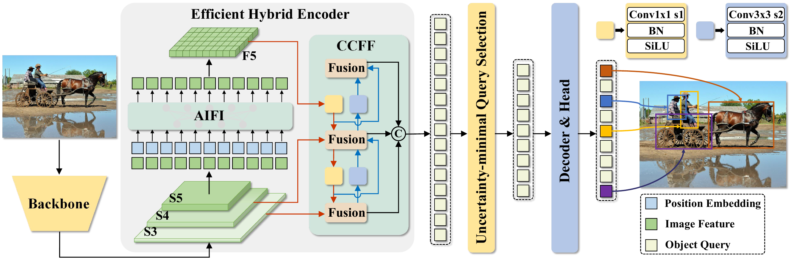

    > RT-DETR pipeline: backbone 输出多尺度特征，hybrid encoder 先做 AIFI 再做 CCFF，query selection 选择高质量 encoder features 初始化 decoder queries，最后 decoder 直接输出类别和框，不需要 NMS。

    - Efficient Hybrid Encoder = AIFI + CCFF

      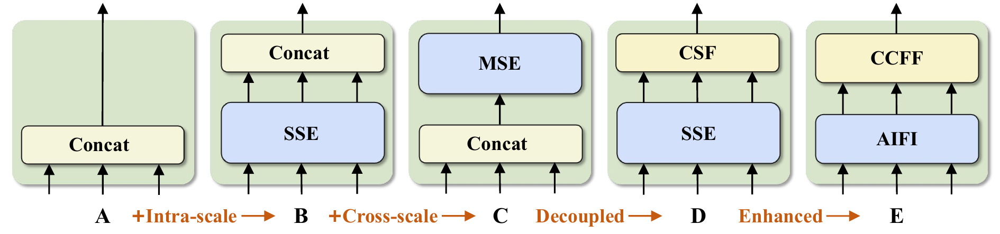

      > The encoder structure for each variant. SSE represents theTransformer encoder, and CSF represents cross-scale fusion. AIFI and CCFF are the two modules designed into our hybrid encoder.

      - **What**: 将 multi-scale Transformer encoder 拆成两个更便宜的部分：只在最高层语义特征 $S_5$ 上做 **Attention-based Intra-scale Feature Interaction (AIFI)**，再用 CNN/PANet-style 的 **CNN-based Cross-scale Feature Fusion (CCFF)** 融合 $S_3,S_4,F_5$。
        $$
        \begin{aligned}
        \mathcal{Q}=\mathcal{K}=\mathcal{V}&=\mathrm{Flatten}(S_5),\\
        F_5&=\mathrm{Reshape}(\mathrm{AIFI}(\mathcal{Q},\mathcal{K},\mathcal{V})),\\
        O&=\mathrm{CCFF}(\{S_3,S_4,F_5\})
        \end{aligned}
        $$
      - **Why**: 直接把多尺度特征拼成长序列做 Transformer encoder 会让序列长度暴涨，encoder 成为 latency bottleneck。低层特征语义弱，在低层做 self-attention 容易重复且混乱；高层 $S_5$ 更适合建模 object-level semantic interaction。
      - **How**: AIFI 只处理 $S_5$，显著减少 attention cost；CCFF 用卷积融合相邻尺度，避免昂贵的跨尺度 Transformer attention。论文 ablation 中，最终 hybrid encoder 比多尺度 Transformer encoder 更快且 AP 更高。

    - Uncertainty-minimal Query Selection

      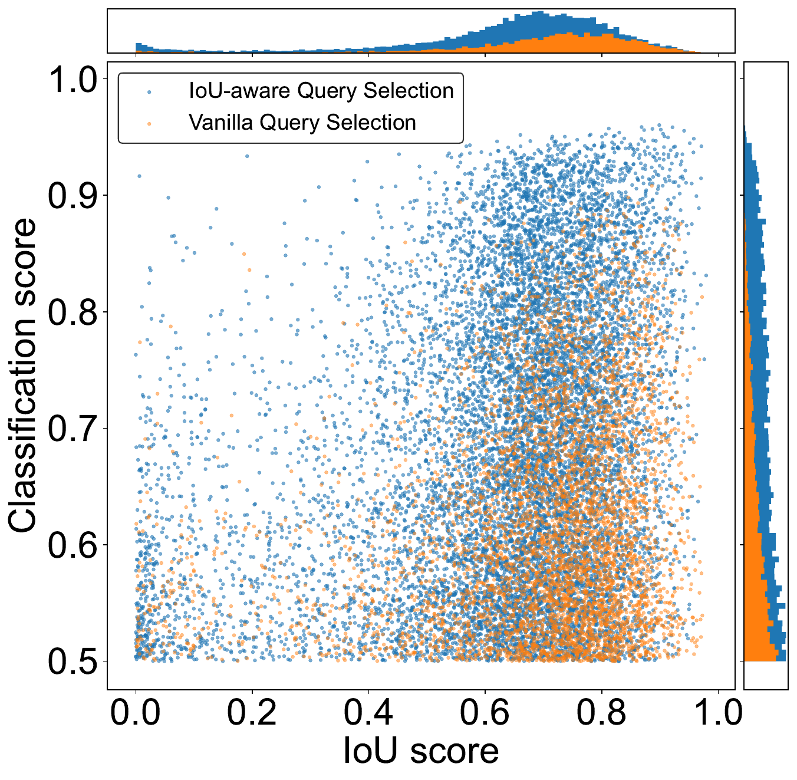

      - **What**: 不只按 classification confidence 选择 top-K encoder features，而是显式考虑 classification 与 localization 的一致性，把低定位置信度的 feature 从 query 初始化中排除。
        $$
        \mathcal{U}(\hat{X})=\|\mathcal{P}(\hat{X})-\mathcal{C}(\hat{X})\|,\quad \hat{X}\in\mathbb{R}^{D}
        $$
        这里 $\mathcal{P}$ 表示 localization distribution，$\mathcal{C}$ 表示 classification distribution，差异越大说明 feature uncertainty 越高。
        
        > [!NOTE]
        >
        > 但是输入这个selection module的只是一堆query，我如何计算classification 与 localization 的一致性呢？
        >
        > 见pipeline部分
        >
        > 我觉得这里的公式很有问题，实际上就是用一个分类头训练一个iou-aware的分数，然后选topk个
        
      - **Why**: DETR decoder 的 object query 很难优化，好的初始化很关键；只看分类分数会选到“分类像前景但框不准”的 feature，导致 decoder 初始 query uncertainty 高。low localization confidence

      - **How**: 将 uncertainty 融入 encoder prediction 的训练损失，让 encoder 同时学会类别和定位质量一致的 feature；query selection 再从这些高质量 features 中选 top-K 初始化 decoder。

    - Flexible Decoder Speed Tuning
  
      - **What**: RT-DETR 保留多层 decoder，但推理时可以裁掉后面的 decoder layers 来换速度。
      - **Why**: DETR decoder 是逐层 refine boxes，后几层主要带来小幅 AP gain；不同实时场景对 latency/AP 的需求不同。
      - **How**: 训练一次完整 decoder，部署时通过选择 decoder 层数实现 speed tuning、
  
  - Pipeline:
  
    1. 输入图像经过 backbone(这里以resnet50为例)，取最后三个 stage 的多尺度特征 $\{S_3,S_4,S_5\}$。

    2. 输入到hybrid encoder
  
       1. 输入 [512, 1024, 2048] 通过 1x1 Conv + BN 全部投影成 hidden_dim=256
       
       2. AIFI 仅对 $S_5$ 做 self-attention，获得语义增强的 $F_5$。就是一层transformer encoder，将$S_5$展平输入
  
          ```python
          h, w = proj_feats[2].shape[2:]
          
          src_flatten = proj_feats[2].flatten(2).permute(0, 2, 1)
          # [B, 256, H5, W5] -> [B, H5*W5, 256]
          
          pos_embed = build_2d_sincos_position_embedding(w, h, hidden_dim)
          
          memory = self.encoder[0](src_flatten, pos_embed=pos_embed)
          
          proj_feats[2] = memory.permute(0, 2, 1).reshape(B, 256, h, w)
          ```
       
       3. CCFF 将 $S_3,S_4,F_5$ 进行 cross-scale fusion（就是一个PAN），得到 encoder image features。
       
          用CSPRepLayer模块做特征融合
       
          ```
          x1 = conv1(x)
          x1 = RepVggBlock(x1)
          x2 = conv2(x)
          out = conv3(x1 + x2)
          ```
       
    3. 再输入到RT-DETR Transformer Decoder
  
       1. 实际上在进入decoder之前先做了cls and loc pred，下面我们来完整走一遍：
       
          1. CCFF输出不同stride的featuremap，会被flatten之后然后concat起来变成token，我们会用一个index知道每个token的位置
       
             ```
             spatial_shapes = [[80, 80], [40, 40], [20, 20]]
             level_start_index = [0, 6400, 8000]
             ```
       
          2. 对每个token, 在Query Selection 前先生成 anchors
       
             ```python
             # 每个尺度固定大小的wh，以及自己对应的中心点
             anchors, valid_mask = self._generate_anchors(spatial_shapes, device=memory.device)
             memory = valid_mask.to(memory.dtype) * memory
             # 再对anchors做inverse sigmoid / logit 变换，与后面refine bbox对齐
             anchors = torch.log(anchors / (1 - anchors))
             ```
       
          3. 然后对每个token分别做分类和回归预测
       
             ```
             output_memory = self.enc_output(memory)
             
             enc_outputs_class = self.enc_score_head(output_memory)
             enc_outputs_coord_unact = self.enc_bbox_head(output_memory) + anchors
             ```
       
             `enc_outputs_class` 用来给每个 token 打分，`enc_outputs_coord_unact` 是每个 token 对应的初始 box 预测
       
             > [!NOTE]
             >
             > 训练分类头时，把分类分数训练成 localization-aware / IoU-aware score：用 IoU-aware / Varifocal-style 分类目标，把正样本的分类 target 从硬标签 1 改成与预测框 IoU 相关的 soft score
       
             > [!NOTE]
             >
             > 这里的头就是简单的线性分类头
             >
             > ```python
             > # encoder head
             > self.enc_output = nn.Sequential(
             >     nn.Linear(hidden_dim, hidden_dim),
             >     nn.LayerNorm(hidden_dim,)
             > )
             > 
             > self.enc_score_head = nn.Linear(hidden_dim, num_classes)
             > self.enc_bbox_head = MLP(hidden_dim, hidden_dim, 4, num_layers=3)
             > ```
             >
             > 这几个 head 有专门初始化：
             >
             > ```python
             > bias = bias_init_with_prob(0.01)
             > 
             > init.constant_(self.enc_score_head.bias, bias)
             > 
             > init.constant_(self.enc_bbox_head.layers[-1].weight, 0)
             > init.constant_(self.enc_bbox_head.layers[-1].bias, 0)
             > ```
             >
             > 分类头初始时偏向低前景概率，避免一开始全是高置信前景；bbox head 最后一层初始化为 0，使初始 bbox delta 为 0
       
             > [!WARNING]
             >
             > 只有Top-K 结果会被当作一组辅助检测结果来训练，感觉怪怪的
       
       2. Uncertainty-minimal query selection 选择 top-K 高质量 encoder features 作为 decoder 初始 object queries。
       
       3. ```
          query self-attention
            -> multi-scale deformable cross-attention
            -> FFN
          ```
       
    4. Decoder 逐层 refine queries 并输出类别与 bbox；因为是一对一集合预测，推理阶段直接输出结果，不走 NMS。
  
  - Pros:
  
    - **NMS-free real-time detector**：避免 YOLO NMS 的额外 latency 和阈值敏感性。
    - **速度-精度强**：RT-DETR-R50/R101 在 COCO 上达到 53.1/54.3 AP，同时在 T4 TensorRT FP16 上达到 108/74 FPS。
    - **工程可调**：通过 decoder layer 数量直接调节速度，无需重新训练。
    - **扩展性好**：后续 RT-DETRv2/v3/v4 都沿用其 hybrid encoder + query selection 的主线继续增强。
  
  - Cons:
  
    - **仍有 Transformer/CUDA 工程成本**：相比纯 CNN YOLO，部署依赖 MSDeformAttn / TensorRT 等高效实现。
    - **训练仍是 DETR-style**：虽然推理快，但训练配置、Hungarian matching、decoder aux heads 比 YOLO 复杂。
    - 小目标检测效果仍然不好

### v2

> 一份纯工程方面的增量补充

- __RT-DETRv2: Improved Baseline with Bag-of-Freebies for Real-Time Detection Transformer.__ *Wenyu Lv et al.* __ArXiv, 2024__ [(Arxiv)](https://arxiv.org/abs/2407.17140) [(S2)](https://www.semanticscholar.org/paper/1e030d91607e38b7b7fdd002123ca8baafbedc8f) [(Code)](https://github.com/lyuwenyu/RT-DETR?tab=readme-ov-file)(Citations __186__)

  - Takeaway: RT-DETRv2 是对 RT-DETR 的一次 **pragmatic baseline upgrade**：不改架构主线，而是通过多尺度差异化的 deformable sampling、离散采样替代 grid_sample、动态数据增强和 scale-adaptive 超参，在 **不损失推理速度** 的前提下显著提升各尺寸模型的 AP，同时消除 DETR 部署时的 grid_sample 约束。

  - Motivation: RT-DETR 虽然打通了 real-time DETR 路线，但仍有两个实际痛点：
    1. **部署受限**：RT-DETR 的 deformable attention 依赖 `grid_sample`（双线性插值采样），而 YOLO 系列没有此算子，导致 DETR 在部分推理后端（如某些边缘设备/简易推理框架）上无法部署。
    2. **训练策略一刀切**：不同 backbone 规模（R18~R101）共用同一套数据增强和 optimizer 超参，小 backbone 特征质量弱但学习率不够大，大 backbone 已预训练较好却用相同 LR，导致各 scale 模型都未达最优。

    论文定位是 "bag-of-freebies"：只改训练/部署策略，不增推理开销

  - Core Mechanism:

    RT-DETRv2 框架结构与 RT-DETR 完全相同（backbone → hybrid encoder → decoder），只修改 decoder 的 deformable attention 和训练策略。

    - Distinct Sampling Points per Scale（差异化采样点数）

      - **What**: 在 decoder 的 multi-scale deformable attention 中，对不同尺度特征图设置**不同数量的 sampling points**，而非像原版 RT-DETR/Deformable DETR 那样所有尺度用相同点数。总采样点数计算公式为 `num_head × num_point × num_query × num_decoder`，其中 `num_point` 是各尺度采样点数之和。
      - **Why**: 不同尺度特征图的语义密度和信息量不同（高层 $S_5$ 语义强但空间粗，低层 $S_3$ 空间细但语义弱），统一采样点数忽略了这种 intrinsic difference，限制了 deformable attention 的特征提取能力。
      - **How**: 论文通过 ablation 发现即使大幅减少总采样点数（如从 86,400 降至 21,600），AP 仅下降 0.6，**说明原版采样存在大量冗余**。差异化配置可以更高效地分配计算预算。

    - Discrete Sampling（离散采样替代 grid_sample）

      - **What**: 用一个可选的 `discrete_sample` 算子替代 `grid_sample`：对 deformable attention 预测的采样偏移量做**取整（rounding）**，跳过耗时的双线性插值。由于取整不可导，训练时关掉预测偏移量参数的梯度。实际流程是先 `grid_sample` 预训练 6× schedule，再 `discrete_sample` 微调 1× schedule，推理时只用 `discrete_sample`。
      - **Why**: `grid_sample` 是 DETR 区别于 YOLO 的特有算子，限制了 DETR 在各类推理后端的广泛部署。离散采样消除了这一部署约束，使 RT-DETR 可以像 YOLO 一样在任何支持基本卷积/矩阵运算的后端上运行。
      - **How**: 离散采样带来的精度损失极小（AP 仅降 0.1~0.4），但彻底移除了对 `grid_sample` 的依赖。

    - Dynamic Data Augmentation（动态数据增强）

      - **What**: 训练早期使用强数据增强（RT-DETR 原版配置），训练最后 2 个 epoch 关闭 `RandomPhotometricDistort`, `RandomZoomOut`, `RandomIoUCrop`, `MultiScaleInput`，减弱增强强度。
      - **Why**: 早期模型泛化能力弱，需要强增强来学习鲁棒特征；后期模型已趋于收敛，强增强反而可能干扰对 target domain 的适应。
      - **How**: 是一个简单的 schedule-based 策略，无额外超参。

    - Scale-Adaptive Hyperparameters（按模型规模自适应超参）

      - **What**: 为不同 backbone 规模的检测器设置**不同的 backbone learning rate**：轻量 backbone（R18）LR 更大（1e-4），重量 backbone（R101）LR 更小（1e-6），detector 部分统一用 1e-4。
      - **Why**: 轻量 backbone 预训练特征质量较低，需要更大学习率来充分适应检测任务；大 backbone 预训练特征已较强，过大 LR 会破坏预训练权重。
      - **How**: 具体配置见下表（`lr` 单位为学习率）：

        | Model | Backbone | lr_backbone | lr_det |
        |-------|----------|-------------|--------|
        | RT-DETRv2-S | ResNet18 | 1e-4 | 1e-4 |
        | RT-DETRv2-M | ResNet34 | 5e-5 | 1e-4 |
        | RT-DETRv2-L | ResNet50 | 1e-5 | 1e-4 |
        | RT-DETRv2-X | ResNet101 | 1e-6 | 1e-4 |


### v3

- __RT-DETRv3: Real-time End-to-End Object Detection with Hierarchical Dense Positive Supervision.__ *Shuo Wang et al.* __WACV, 2025__ [(Arxiv)](https://arxiv.org/abs/2409.08475) [(Code)](https://github.com/clxia12/RT-DETRv3)

  - Takeaway: RT-DETRv3 针对 RT-DETR/RT-DETRv2 的 **Hungarian one-to-one matching 监督过稀疏**问题，提出 **Hierarchical Dense Positive Supervision**：在训练期同时给 encoder 和 decoder 加 one-to-many 正样本监督，推理期全部移除，因此精度提升但 latency 不变。

    > [!TIP]
    >
    > 这和YOLOv10的思想是一样的

  - Motivation: DETR 系列依赖一对一匹配来保持 end-to-end/no-NMS，但每个 GT 只监督一个 query，和 YOLO/PP-YOLOE 这类 dense detector 相比，encoder feature 和 decoder queries 得到的正样本信号太少。RT-DETR 虽然通过 AIFI + CCFF + query selection 做到了 real-time，但 sparse supervision 会限制收敛速度和最终 AP。

  - Core Mechanism:

    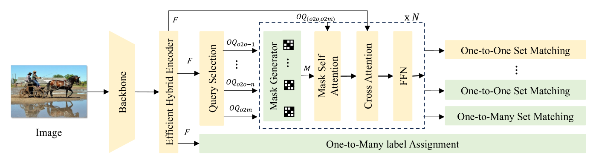

    > Figure 2. RT-DETRv3 保留 RT-DETR 主干结构（yellow），只在训练阶段加入绿色的 hierarchical dense supervision branches；evaluation 时这些 auxiliary branches 全部丢弃。
  
    从绿色部分我们可以看出主要就是增加了三个部分，下面来分别介绍

    ```
    1. Encoder 侧：CNN-based auxiliary branch
    2. Decoder 侧：Self-Attention Perturbation
    3. Decoder 侧：Shared-weight one-to-many decoder branch
    ```
  
    - CNN-based One-to-Many Auxiliary Branch
  
      - **What**: 在 efficient hybrid encoder 输出的多尺度特征 $\{C_3,C_4,C_5\}$ 上接一个 CNN dense head（论文采用 PP-YOLOE style head），使用 ATSS/TaskAlign 这类 one-to-many assignment 给 encoder 提供更密集的正样本监督。
      - **Why**: 原始 decoder 的 Hungarian matching 只会让少量 query 得到正样本，解决 encoder 训练信号不够密集的问题
      - **How**: auxiliary head 与原 RT-DETR decoder 并行训练，classification 用 VFL，localization 用 DFL 等 PP-YOLOE 配置；该 branch 只贡献训练损失 $L_{aux}$，推理时删除。直接用现成的实现
  
    - Multi-Group Self-Attention Perturbation (MGSA)
  
      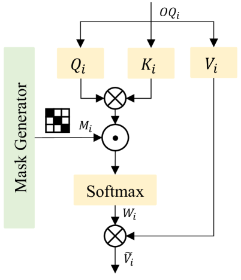
  
      - **What**: 为 decoder 生成多组 object queries，并给每组 query 的 self-attention 加随机 mask perturbation(扰动)，让不同 query group 产生不同的正样本匹配分布。
        $$
        Q_i,K_i,V_i=\mathrm{Linear}(OQ_i),\quad
        W_i=\mathrm{Softmax}\left(M_i(Q_iK_i^T)\right),\quad
        \tilde{V}_i=W_iV_i
        $$
      - **Why**: 如果所有 query 都看到同样的 self-attention 关系，Hungarian matching 仍容易只强化少数 query；随机扰动让多个相关 query 有机会匹配同一目标附近的正样本，从而 enrich decoder supervision。
      - **How**: $N$ 组 query 共享 decoder 参数，每组保持 RT-DETR 的 one-to-one matching，最后平均得到：
        $$
        L_{o2o}=\frac{1}{N}\sum_{i=1}^{N} L_{o2o}^{i}
        $$
  
    - Shared-weight One-to-Many Decoder Branch
  
      - **What**: 在 decoder 中额外加入一个参数共享的 one-to-many branch，把每个 GT 复制 $m$ 次（默认 $m=4$），使更多高质量 queries 可以匹配同一个目标。
      
      - **Why**: 让多个高质量 query 可以同时匹配同一个 ground truth
      
        > [!NOTE]
        >
        > 为什么复制的不同组（实际上是一样的）会GT匹配不同的queries，因为MGSA的随即mask会产生不同的匹配
      
      - **How**: branch 训练时产生 $L_{o2m}$，推理时与 CNN auxiliary head 一样删除。总训练目标为：
        $$
        L=\alpha L_{aux}+\beta L_{o2o}+\gamma L_{o2m}
        $$
        默认 $\alpha=\beta=\gamma=1$。
  
  - Pipeline:
  
    1. 图像经过 RT-DETR backbone + efficient hybrid encoder 得到 $\{C_3,C_4,C_5\}$。
    2. **训练期**：encoder features 同时进入 CNN one-to-many auxiliary head 和原始 transformer decoder。
    3. Query selection 产生多组 object queries，MGSA 用随机 mask 扰动 self-attention，使不同 query group 形成不同 positive assignment。
    4. 额外 one-to-many decoder branch 将 GT 复制 $m$ 次进行 dense matching；总损失为 $L_{aux}+L_{o2o}+L_{o2m}$ 的加权和。
    5. **推理期**：所有 auxiliary branches 和 perturbation branches 移除，只保留原 RT-DETR inference graph，因此参数量和 latency 与 baseline 基本一致。
  
  - Pros:
  
    - **零推理开销**：所有新增模块都是 training-only，不破坏 RT-DETR 的 real-time deployment。
    - **同时补强 encoder/decoder**：CNN branch 负责 dense encoder supervision，MGSA + O2M decoder branch 负责增加 decoder positive queries。
    - **效果稳定**：COCO 上 RT-DETRv3-R18 达到 48.1 AP（120 epochs 为 48.7 AP），R101 达到 54.6 AP，优于同系列 RT-DETR/RT-DETRv2。
  
  - Cons:
  
    - **训练图更复杂**：需要额外 CNN head、多组 query 和 one-to-many branch，训练显存/实现复杂度高于 RT-DETRv2。
    - **依赖 dense assignment 经验**：CNN auxiliary branch 复用 PP-YOLOE/ATSS/TaskAlign 配置，方法简洁性不如纯 DETR matching。
    - **小模型收益更明显**：大 backbone（R50/R101）提升相对较小，仍需要较长 schedule 或 extra data 才能继续拉高上限。

### v4

- __RT-DETRv4: Painlessly Furthering Real-Time Object Detection with Vision Foundation Models.__ *Zijun Liao, Yian Zhao, Xin Shan, Yu Yan, Chang Liu, Lei Lu, Xiangyang Ji, Jie Chen.* __arXiv, 2025__ [(Arxiv)](https://arxiv.org/abs/2510.25257) [(S2)](https://www.semanticscholar.org/paper/arXiv:2510.25257) [(Code)](https://github.com/RT-DETRs/RT-DETRv4) ([My PDF](https://drive.google.com/file/d/14Mgq9ypkGGYOxZlgAZqlRImj6VmtipXz/view?usp=drivesdk))

  - Takeaway: RT-DETRv4 提出一种 **training-only 蒸馏框架**，利用 Vision Foundation Model（DINOv3）作为语义教师，通过 **Deep Semantic Injector (DSI)** + **Gradient-guided Adaptive Modulation (GAM)** 提升轻量 DETR 检测器的语义表征，**推理时零额外开销**，在 COCO 上达到 SOTA（57.0 AP @ 78 FPS）。

  - Motivation: 轻量实时检测器在追求高推理速度时，主干网络和高效编码器不可避免地削弱了特征语义表达能力。RT-DETR 的 hybrid encoder 中存在 **F5 Semantic Bottleneck**——AIFI 模块的输出 $F_5$ 是整个编码器中唯一经过 self-attention 增强的特征，但其优化仅依赖从 decoder 反向传播的间接梯度，缺乏直接语义监督。同时，Vision Foundation Models（VFMs）在大规模自监督预训练后拥有极强的语义表征能力，但受限于模型规模无法直接部署。

  - Core Mechanism:

    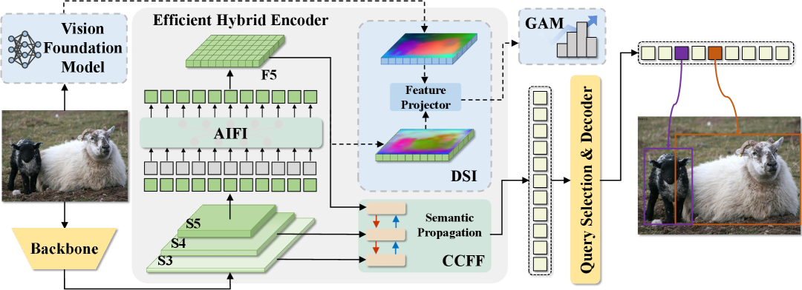

    > Figure 2. Overview of RT-DETRv4. We leverage a Vision Foundation Model (VFM) to extract high-quality semantic representations, which are aligned with the deepest feature map (F5) from the AIFI module via a Feature Projector in the Deep Semantic Injector (DSI). To ensure faster and more stable convergence, a Gradient-guided Adaptive Modulation (GAM) dynamically adjusts the DSI loss during training. The proposed framework operates only during the training phase (highlighted by dashed arrows and blue blocks) of the real-time detector and keeps the original architecture unchanged during inference and deployment, introducing no additional overhead while improving accuracy

    > [!NOTE]
    >
    > 其实也就是加了一个蒸馏的监督，然后用DSI来对齐，用GAM动态调整监督强度

    RT-DETRv4 的核心是一个 **training-only 蒸馏框架**（蓝色模块仅在训练时使用，推理时完全移除），由两个关键组件构成：DSI+GAM

    - Deep Semantic Injector (DSI)

      > [!NOTE]
      >
      > 目的就是蒸馏大模型的深层表达

      - **What**: 在训练阶段，用一个轻量的 Feature Projector 将 AIFI 输出 $F_5$ 投影到与 VFM 教师特征 $F_{\mathcal{T}}$ 相同的语义空间，通过 **patch-wise cosine similarity loss** 显式对齐两者：
        $$
        \mathcal{L}_{DSI}(F_5', F_{\mathcal{T}}') = -\frac{1}{H_5 W_5} \sum_{i,j} \frac{F_5'(i,j) \cdot F_{\mathcal{T}}'(i,j)}{\|F_5'(i,j)\| \|F_{\mathcal{T}}'(i,j)\|}
        $$

      - **Why**: $F_5$ 是 hybrid encoder 中唯一承载全局语义的特征，直接影响后续 CCFF 融合、query 初始化和 decoder 性能。直接对 backbone 多尺度特征 $(S_3,S_4,S_5)$ 或混合位置施加监督无效（ablation 显示 0 gain），因为 CNN backbone 特征与 transformer-based AIFI 存在优化冲突。只对齐 $F_5$ 的设计让梯度同时流回 AIFI 和 backbone，实现协同增强。

      - **How**: 使用冻结的 DINOv3-ViT-B 作为教师 $\mathcal{T}$，取其 patch tokens 重塑为 2D grid $F_{\mathcal{T}}^{sp}$，插值到 $F_5$ 的空间分辨率。学生侧 $F_5$ 通过线性层（最优 lightweight projector）投影到教师通道维度。两条路径在归一化后计算余弦相似度，整个 DSI 模块仅在训练时存在。
        
        > 用patch对stride了
        
        \[
        \begin{aligned}
        F_{\mathcal{T}}^{\mathrm{sp}} &= \operatorname{Reshape}(T_p), 
        &\quad F_{\mathcal{T}}^{\mathrm{sp}} &\in \mathbb{R}^{H_{\mathcal{T}} \times W_{\mathcal{T}} \times C_{\mathcal{T}}}, \\
        F'_{\mathcal{T}} &= \operatorname{Interpolate}(F_{\mathcal{T}}^{\mathrm{sp}}), 
        &\quad F'_{\mathcal{T}} &\in \mathbb{R}^{H_5 \times W_5 \times C_{\mathcal{T}}}, \\
        F'_5 &= \mathcal{P}(F_5), 
        &\quad F'_5 &\in \mathbb{R}^{H_5 \times W_5 \times C_{\mathcal{T}}}
        \end{aligned}
        \]
        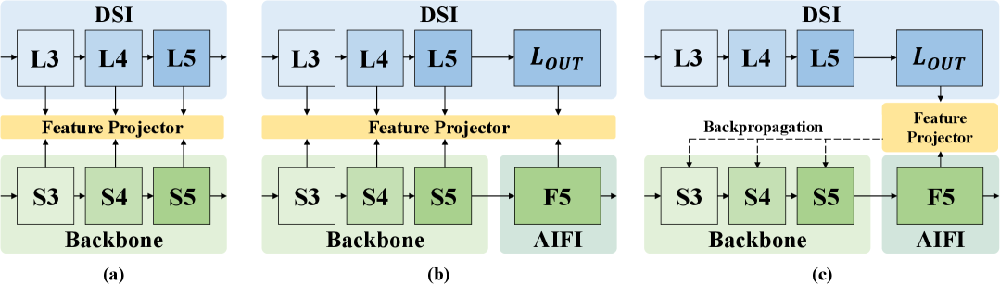
        
        > 这里是几个不同的DSI的结构，最后使用的是c，只利用AIFI输出的F5来对齐

    - Gradient-guided Adaptive Modulation (GAM)

      > [!NOTE]
      >
      > 解决 VFM 与轻量检测器之间架构和学习目标差异导致的训练不稳定问题 based on gradient norm ratios
      
      - **What**: 在每个 epoch 结束时，计算 AIFI 模块梯度范数占总梯度的比例 $\bar{r}_e$，若超出目标区间 $[\rho-\delta, \rho+\delta]$，则动态调整 DSI loss 权重 $\lambda$ (每个epoch调整一次)：
        $$
        \lambda_{e+1} = \begin{cases}
        \lambda_e \cdot \frac{\rho-\delta}{\bar{r}_e}, & \text{if } \bar{r}_e > \rho+\delta \\[8pt]
        \lambda_e \cdot \frac{\rho+\delta}{\bar{r}_e}, & \text{if } \bar{r}_e < \rho-\delta \\[8pt]
        \lambda_e, & \text{otherwise}
        \end{cases}
        $$

      - **Why**: 静态 $\lambda$ 在训练早期要么语义监督不足，要么后期过度主导检测目标（ablation 中直接调 λ 最佳仅 55.1 AP vs GAM 的 55.4 AP）。GAM 让语义蒸馏和检测目标在整个训练过程中保持平衡，无需手动调参。
      
      - **How**: 将模型组件分为 $\mathcal{C} = \{\text{Backbone, AIFI, CCFF, Decoder}\}$，每步计算各组件的 L1 梯度范数，epoch 末取平均得 $\bar{r}_e$。$\rho$ 控制期望的 AIFI 梯度贡献强度，$\delta$ 控制调整的敏感度/稳定性权衡。GAM 采用边界驱动（boundary-based）而非中点驱动的更新策略，因为 AIFI 的梯度中只有一部分来自 $\mathcal{L}_{DSI}$。
      
        > [!NOTE]
        >
        > 为什么不是调到中点而是边界：
        >
        > 如果当前梯度比例低于区间，它调到上边界；如果高于区间，它调到下边界。论文解释是：只有一部分 AIFI 梯度来自 DSI loss，所以用边界而不是中点能让训练更稳定，避免在平衡点附近振荡
      
      Total loss
      $$
      \mathcal{L}_{total} = \mathcal{L}_{det} + \lambda \mathcal{L}_{DSI}
      $$

  - Pipeline:

    1. **训练阶段**:
       - 图像同时送入检测器 backbone 和冻结的 VFM teacher（DINOv3-ViT-B）
       
         在DINOv3中还先做了image的 avgpool。RT-DETRv4 在 DINOv3 之前对输入进行 2× 下采样，以匹配 AIFI 步长。
       
       - Backbone 提取多尺度特征 $S_3, S_4, S_5$ → AIFI 生成 $F_5$ → **DSI align** $F_5$ with VFM features → 计算 $\mathcal{L}_{DSI}$
       
         ```
         backbone S5
           -> input_proj
           -> AIFI
           -> F5
           -> Linear projector: 256 -> 768(就是一层线性层)
           -> student_distill_output
           
         Loss计算:
         	# 1. 通道必须一致
             # student 已经通过 projector 变成 teacher_dim
             assert student.shape[1] == teacher.shape[1]
         
             # 2. 空间尺寸不一致时，把 teacher resize 到 student 尺寸
             Hs, Ws = student.shape[-2:]
             Ht, Wt = teacher.shape[-2:]
         
             if (Hs, Ws) != (Ht, Wt):
                 teacher = F.interpolate(
                     teacher,
                     size=(Hs, Ws),
                     mode="bilinear",
                     align_corners=False,
                 )
         
             # 3. [B, C, H, W] -> [B, HW, C]
             student = student.flatten(2).permute(0, 2, 1)
             teacher = teacher.flatten(2).permute(0, 2, 1)
         
             # 4. patch-wise L2 normalize
             student = F.normalize(student, p=2, dim=-1)
             teacher = F.normalize(teacher, p=2, dim=-1)
         
             # 5. patch-wise cosine distance
             cos = F.cosine_similarity(student, teacher, dim=-1)
         
             loss = (1.0 - cos).mean()
         ```
       
       - $F_5$ 继续进入 CCFF 与 $S_3, S_4$ 融合得到 $P_3, P_4, P_5$ → Decoder → 计算 $\mathcal{L}_{det}$
       
       - GAM 在每个 epoch 结束时根据梯度统计动态调整 $\lambda$，总损失为 $\mathcal{L}_{total} = \mathcal{L}_{det} + \lambda\mathcal{L}_{DSI}$
       
         ```python
         RT-DETRv4 的 GAM，这是梯度累计的部分，而不是跟踪的部分：
         # engine/solver/det_engine.py
         def _compute_encoder_transformer_grad_percentage(model) -> float:
             total_l1 = 0.0
             enc_l1 = 0.0
             for name, param in model.named_parameters():
                 grad = param.grad
                 if grad is None: continue
                 val = grad.detach().abs().sum().item()
                 total_l1 += val
                 if name.startswith('module.encoder.encoder'):  # ← 只跟踪这个
                     enc_l1 += val
             return 100.0 * enc_l1 / total_l1
         ```
         
         跟踪的对象：module.encoder.encoder —— 即 AIFI（Attention-based Intra-scale Feature Interaction）
    
  - Pros:
  
    - **零推理开销**：训练时蒸馏，推理时无任何额外参数/计算/延迟，直接部署原有轻量架构
    - **方法通用**：在 RT-DETRv2, D-FINE, DEIM 上均带来 consistent gain（+0.3~0.5 AP）
    - **SOTA 性能**：RT-DETRv4-S/M/L/X 分别为 49.7/53.5/55.4/57.0 AP，全尺寸超越 DEIM 和 YOLO 最新版本
    - **适配 VFM 演进**：框架与 VFM 类型和规模无关（agnostic），可随 VFM 进步无缝升级
    - **自动平衡训练**：GAM 消除了手动调节蒸馏权重的需要
  
  - Cons:
  
    - **训练时依赖 VFM**：需要加载 DINOv3-ViT-B（约 86M 参数）作为 teacher，增加训练显存和时间
    - **仅限 training-time 增强**：对已部署模型的精度提升依赖重新训练，无法后装
    - **GAM 引入超参**：$\rho$ 和 $\delta$ 需要根据检测器规模设定，虽有一组默认值但并非完全无调参
    - **只适用于 DETR-based 检测器**：论文仅在 DETR 系列上验证，迁移到 YOLO 等 anchor-based 检测器的效果未知

## DINO

> 此DINO非meta那个DINO family

- **DINO: DETR with Improved DeNoising Anchor Boxes for End-to-End Object Detection**. Hao Zhang et.al. **arXiv**, **2022**, [(Arxiv)](https://arxiv.org/abs/2203.03605) [(Code)](https://github.com/IDEA-Research/DINO). -- DINO

  - Takeaway: DINO（**D**ETR with **I**mproved de**N**oising anch**O**r boxes）融合 DAB-DETR + DN-DETR + Deformable DETR 三条线的优点，提出三个关键改进——**Contrastive DeNoising (CDN)**、**Mixed Query Selection**、**Look Forward Twice**——使 DETR 系列首次在 COCO 上以 12-epoch 训练达到 49.4 AP（R50），逼近同期经典检测器，同时保持 end-to-end / NMS-free。

    > [!TIP]
    >
    > transformer加自监督在视觉也很香——DN/CDN 本质上是用"构造带噪 GT → 让 decoder 学去噪"的方式做自监督辅助训练。

  - Motivation: DETR 虽开启了 end-to-end detection，但 DAB-DETR / DN-DETR / Deformable DETR 等后续工作各自只解决了部分问题，DETR 系列整体仍落后于经过多年优化的经典检测器（Faster R-CNN / YOLO 等）。DINO 要同时回答两个问题：

    1. 如何让 DETR 的精度追上甚至超越经典检测器？
    2. The *scalability* of DETR-like models has not been well studied. —— DETR 架构能否像经典检测器一样通过更强的 backbone 和更大数据持续 scale up？

  - Core Mechanism:

    DINO combines ideas from `DAB-DETR`, `DN-DETR`, and `Deformable DETR`, then improves three critical pieces rather than proposing an entirely new detector family.

    Architecture
  
    
  
    > Figure 2: DINO 整体框架。改进主要在 Transformer encoder 和 decoder：encoder 最后一层的 top-K features 初始化 decoder positional queries（content queries 保持可学习），decoder 包含 Contrastive DeNoising (CDN) 部分（同时含正负样本）。

    作为 DETR-like 模型，DINO 包含 backbone、多层 Transformer encoder、多层 Transformer decoder 和多个预测头。遵循 **DAB-DETR**，decoder queries 被表述为动态 anchor boxes 并逐层 refine；遵循 **DN-DETR**，在 decoder 中加入带噪声的 GT labels + boxes 辅助训练以稳定 bipartite matching；采用 **Deformable DETR** 的 deformable attention 提高计算效率。

    在此基础上提出三项新方法：

    ```
    Contrastive DeNoising Training：对比式去噪训练
    Mixed Query Selection：混合 query 选择
    Look Forward Twice：向前看两次的 box 更新
    ```

    - Contrastive DeNoising (CDN) —— 解决 one-to-one matching 的 anchor 混淆
  
      - **What**: 相比 DN-DETR 只构造 positive denoising queries（加小噪声 → 恢复 GT），CDN 为每个 GT 同时构造 **positive** 和 **negative** denoising queries：同一个 GT box 加两种不同程度的噪声，噪声小的标记为正（应该拉向 GT），噪声大的标记为负（应该推离 GT）。
        
        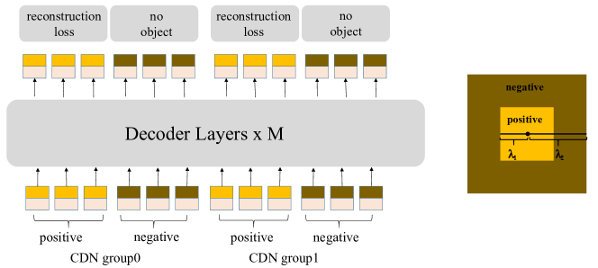
  
      - **Why**: 在DN-DETR中DN 帮助 decoder 学会"附近有 GT 的 anchor 如何预测"，但缺少"附近无物体的 anchor 应该预测为无物体"的能力。这会带来一个问题：当多个 anchor 都靠近同一个目标时，模型可能都想把它们修正成同一个 GT，从而产生重复预测。CDN 通过正负对比让 decoder 学会区分"该选哪个 anchor"和"该拒绝哪个 anchor"。（这就是contrastive的来源）
        
        > [!NOTE]
        >
        > **Prior：先理解 DN (DeNoising) 是什么**
        >
        > 核心思想是：把真实 GT 框和 GT 类别复制几份，故意加上一些扰动，再喂给 decoder，让模型学会把这些带噪声的输入恢复回正确目标。
        >
        > **query 就是 anchor**，一般由两个部分组成：
        >
        > - **tgt** (target tensor)：这个 query 的内容向量，负责"找什么"
        > - **refpoint_embed**：这个 query 的参考位置/参考框，负责"去哪找"。decoder 在这个基础上进行 fine tune。有两种生成方法：
        >   1. 单阶段：直接学习一个"reference embedding"
        >   2. 两阶段（默认）：先让 encoder 为所有空间位置生成 proposal，再按分类分数选 top-k proposal 作为 decoder 初始 reference boxes
        >
        > **noise**：人为加到 GT 标签和 GT 框上的扰动，不是给图像加噪点。
        >
        > **具体噪声如何添加的？**
        >
        > - label noise：把一部分真实类别随机改成别的类别
        > - box noise：把真实框的位置和大小随机扰动，并且负样本那一半的框扰动更大，所以更"难"
        >
        > **如何加入训练？**
        >
        > - 普通 query：负责正常检测，最后还要走 Hungarian matching。
        > - DN/CDN query：由 GT 直接构造，带噪声，但监督更直接。
        >
        > 两者一起送进transformer但不会互相乱看，因为有专门的 attn_mask 做隔离，输出后，DN 部分会被单独切出来计算 dn loss

      - **How**: CDN queries 与普通 object queries 拼接后一起送入 decoder，通过 attention mask 防止 CDN queries 与 matching queries 之间的信息泄露。CDN queries 的监督是一对一的（每个 noisy query 对应一个 GT），loss 直接计算，不走 Hungarian matching。
  
      - **验证**：论文用 ATD (Average Top-K Distance) —— 匹配 anchors 与目标框的 L1 距离（取最差的 k 个）来度量 anchor quality：
        $$
        \mathrm{ATD}(k)=\frac{1}{k}\sum \mathrm{topK}\left(\left\{\lVert b_0-a_0\rVert_1,\lVert b_1-a_1\rVert_1,\ldots,\lVert b_{N-1}-a_{N-1}\rVert_1\right\},k\right)
        $$
        Lower ATD means the matched anchors are closer to their target boxes —— CDN 显著降低了 ATD，证明其改善了 matching 质量。用最差的k个来衡量。

    - Mixed Query Selection —— 更好的 decoder query 初始化
  
      - **What**: 从 encoder 最后一层输出的 top-K 特征中选取位置信息来初始化 decoder 的 **positional queries**（参考点/参考框），但 decoder 的 **content queries** 保持为 learnable embeddings（不初始化）。
        
        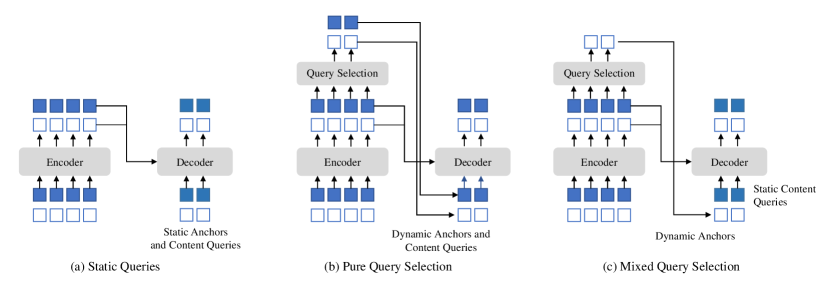
  
        > [!NOTE]
        >
        > 这里的topk到底是对什么进行排序？ -- top-K 是按 encoder 每个位置的“分类/objectness 分数”排序的。输出加了分类头
        >
        > 为什么输出会有两种，白的和蓝的，分别代表什么，为什么mixed就是仅使用白的，不使用蓝的？
        >
        > 白的是bbox，蓝的是encoder是feature，decoder是content query，将query selection输出的当作dynamic anchors和content query一起作为query输入decoder，实现详见pipeline
        >
        > | Query 部分                           | 来源                 | 是否随图像变化 | 作用                                |
        > | ------------------------------------ | -------------------- | -------------- | ----------------------------------- |
        > | **positional query / anchor box**    | encoder top-K 候选框 | 是             | 告诉 decoder “去哪里看”             |
        > | **content query / target embedding** | learnable embedding  | 否             | 学习“用什么语义槽位去聚合/识别目标” |
        >
        > | 方法                      | 位置 query 来源     | content query 来源     | 是否图像自适应           | 主要问题                      |
        > | ------------------------- | ------------------- | ---------------------- | ------------------------ | ----------------------------- |
        > | **Static Query**          | learnable/static    | learnable/static       | 否                       | 缺少当前图像的空间先验        |
        > | **Pure Query Selection**  | encoder top-K boxes | encoder top-K features | 是                       | content 可能粗糙、局部、混杂  |
        > | **Mixed Query Selection** | encoder top-K boxes | learnable embedding    | 位置自适应，内容静态可学 | 折中方案，依赖 top-K box 质量 |
        
      - **Why**: 
        - 方案 b（Deformable DETR 的两阶段方法）：位置查询和内容查询均从 encoder features 的线性变换生成——但这些特征未经 decoder refine，内容质量粗糙，可能包含多个物体或仅是物体一部分，对 decoder 造成误导。
        - 方案 c（DINO）：仅用 encoder features 增强**位置查询**（提供空间先验），保持 content queries 可学习——让 decoder 第一层专注于利用空间先验，不被低质量的初步内容特征干扰。
        
      - **How**: 对 encoder 输出做分类/回归预测 → 选 top-K 高分类分的 proposal → 其位置信息（reference points/boxes）作为 decoder positional queries；content queries 仍为 `nn.Embedding(num_queries, hidden_dim)`。
  
    - Look Forward Twice —— box refinement 的梯度优化
  
      - **What**: 对 decoder 逐层迭代 bbox refinement 做梯度设计改进——第 $i$ 层的 box 分支不仅被第 $i$ 层自己的 loss 更新，还额外受到第 $i+1$ 层 loss 的梯度影响。
        
        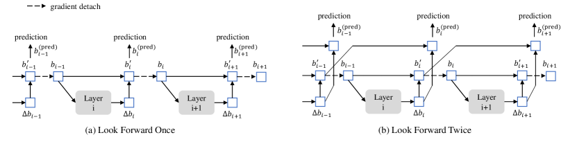
  
        > Comparison of box update in Deformable DETR and our method.
  
      - **Why**: Deformable DETR 的 iterative refinement 中，第 $i$ 层的 refined box 传给第 $i+1$ 层时做了 detach（梯度不回流），这是为了训练稳定。但结果是早层的框比较粗，却只能被自己层的 loss 监督，无法从后层更精细的框获得学习信号。DINO 通过 gradient 设计让后层帮助监督前层。
        
        > [!NOTE]
        >
        > 为什么这样是有用的？
        >
        > 直觉上看早层的框比较粗，如果能用后层的细框监督会更好
  
      - **How**: 核心公式：
        $$
        \Delta b_i = \text{Layer}_i(b_{i-1}),\quad b_i' = \text{Update}(b_{i-1},\Delta b_i) \\
        b_i = \text{Detach}(b_i'),\quad b_i^{(pred)} = \text{Update}(b_{i-1}',\Delta b_i)
        $$
        1. $b_i$（给下一层 decoder 用的 reference）保持 detached，维持训练稳定。
        2. $b_i^{(pred)}$（给当前层监督输出用的）不加 detach——因此第 $i+1$ 层的 loss 梯度可以通过 $b_{i-1}'$ 回流到第 $i$ 层。
  
  - Pipeline:
  
    这里讲述完整的工程实现和一些工程细节。
  
    1. Feed the image into a backbone and build multi-scale features.
  
       输出得到的feat=[feature, mask], mask主要给 transformer 用，避免 attention 去看 padding 区域（因为输出图片尺寸不一致会被padding到相同尺寸，是当前 batch 里"经过数据增强后的图片"的最大尺寸，不是一个写死的全局固定值）
  
    2. Add CDN queries built from noisy positive and negative ground-truth boxes.

       生成额外的 denoising label query, box query 和 attention mask
  
    3. Use the transformer encoder to enhance those features and produce encoder proposals.
  
       - feature输入transformer encoder之前，还要把不同层特征统一投影到 transformer 需要的 hidden dim；如果配置的特征层数比 backbone 实际输出更多，还会继续下采样补额外层
  
    4. Select top-K encoder outputs for positional query initialization while keeping learnable content queries.
  
       在选topk之前，先做了dense proposal，然后encoder dense head 预测每个 proposal 的类别分数和 box offset
  
       ```python
       enc_outputs_class_unselected = self.enc_out_class_embed(output_memory)
       enc_outputs_coord_unselected = self.enc_out_bbox_embed(output_memory) + output_proposals
       
       topk_proposals = torch.topk(
           enc_outputs_class_unselected.max(-1)[0],
           topk,
           dim=1
       )[1]
       ```
  
       然后将top-K encoder 候选对应的 refined box，处于inverse-sigmoid / unsigmoid 空间送进decoder，给 decoder 一个强空间先验
  
       > [!NOTE]
       >
       > 这和 DAB-DETR 的思想一致：query 的位置部分可以看作动态 anchor box
  
    5. Run the decoder with deformable attention and iterative box refinement (with Look Forward Twice gradient design).
  
       ```
       tgt                 # content query，形状 [num_queries, batch, hidden_dim]
       refpoints_unsigmoid # positional query 的原始形式，形状 [num_queries, batch, 4]
       memory              # encoder image features
       pos                 # image feature 的位置编码
       ```
  
       传入decoder时content query和positional query是分开传入的，然后会对positional query做处理，得到query_pos
  
       ```
       refpoints_unsigmoid
           ↓ sigmoid
       reference_points: cx, cy, w, h
           ↓ sine embedding
       query_sine_embed
           ↓ MLP
       query_pos
       ```
  
       在self-attention中将两个query加起来，作为q/k，value只做content
  
       ```python
       q = k = self.with_pos_embed(tgt, tgt_query_pos)
       tgt2 = self.self_attn(q, k, tgt, attn_mask=self_attn_mask)[0]
       ```
  
       > [!NOTE]
       >
       > 为什么 Q/K 加位置？
       >
       > 因为 self-attention 要判断 **query 和 query 之间的关系**。如果只用 `tgt`，模型只知道每个 query 的语义状态；加上 `query_pos` 后，模型还知道这些 query 当前对应的空间位置。eg:`query A: 在左上角，看起来像 person`
  
       逐层输出offset来refine bbox
  
       ```
        for layer_id, layer in enumerate(self.layers):
       
                   # 1. box 坐标转成高维位置编码
                   query_sine_embed = gen_sineembed_for_position(reference_points)
       
                   # 2. MLP 得到 attention 里使用的 query_pos
                   query_pos = self.ref_point_head(query_sine_embed)
       
                   # 3. 一层 decoder：content 和 position 在 attention 内部相加
                   output = layer(
                       tgt=output,
                       memory=memory,
                       query_pos=query_pos,
                       memory_pos=memory_pos,
                   )
       
                   # 4. 用当前 content query 预测 box delta
                   delta = self.bbox_embed[layer_id](output)
       
                   # 5. iterative refinement
                   new_ref_unsigmoid = inverse_sigmoid(reference_points) + delta
                   reference_points = new_ref_unsigmoid.sigmoid().detach()
       
                   all_outputs.append(output)
                   all_refs.append(reference_points)
       ```
  
       
  
    6. Output final class logits and refined boxes end-to-end, using standard classification plus `L1` and `GIoU` box losses.
  
  - Pros:
  
    - Greatly improves convergence relative to earlier DETR-style baselines（12 epoch 达到 49.4 AP，而 DETR 500 epoch 仅 42.0）。
    - Keeps the end-to-end detection pipeline without NMS.
    - Combines modular improvements that are well supported by ablations.
    - Scales well to stronger backbones and extra detection pretraining（Swin-L 达 63.3 AP）。
  
  - Cons:
  
    - The method is engineering-heavy, with gains coming from several coordinated tricks rather than one simple mechanism.
    - Best headline results depend on strong backbones and extra pretraining.
    - Multi-scale deformable attention and larger variants are still computationally heavy.
    - It is less conceptually minimal than vanilla DETR because it accumulates multiple training and refinement techniques.

## Relation

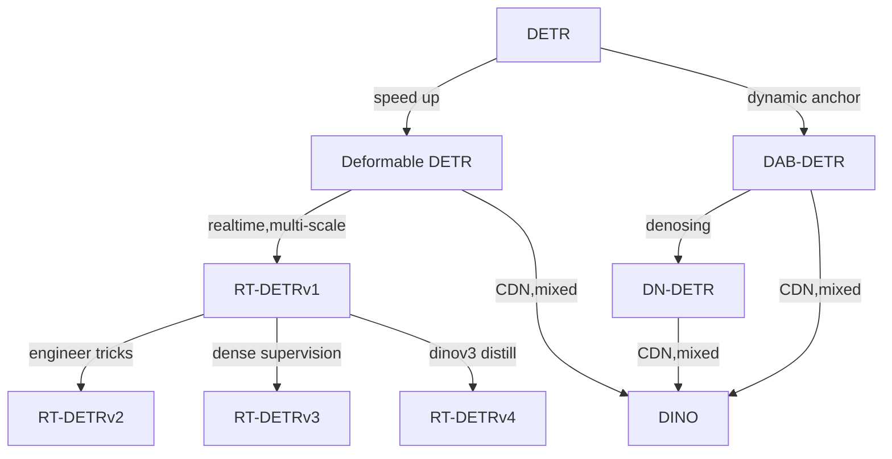
