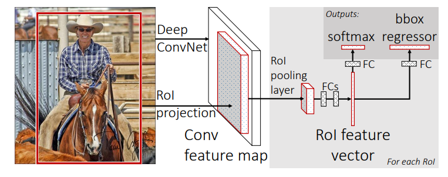
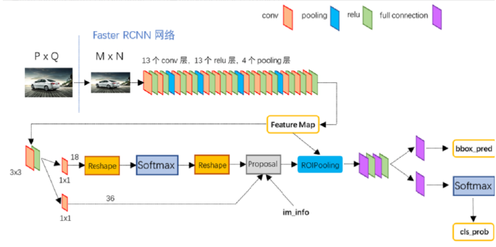
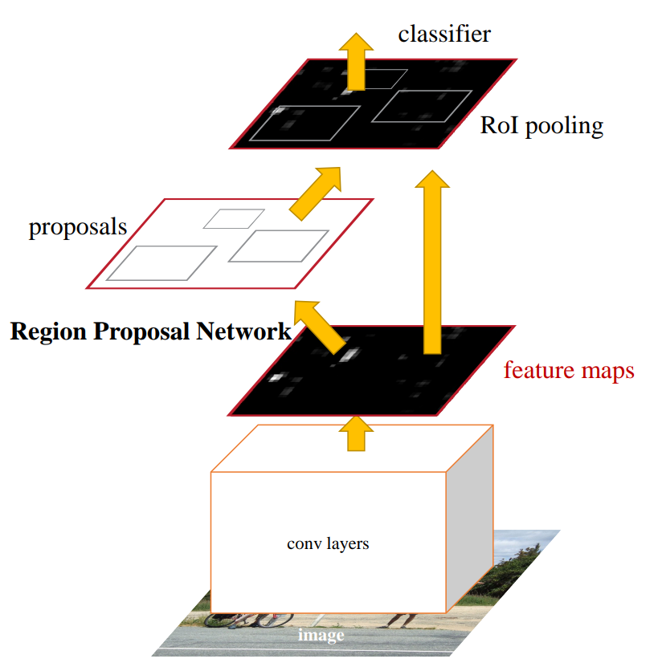

# R-CNN Zoo

## R-CNN

- **Rich feature hierarchies for accurate object detection and semantic segmentation**. Ross Girshick et.al. **arxiv**, **2013**, ([link](https://arxiv.org/abs/1311.2524v5)).

  > R-CNN: Regions with CNN features

  - Takeaway

    CNN on region proposals (Selective Search): run the CNN **on each region proposals**.

    

    -  Module design: Region proposals(Selective Search) + Feature extraction(4096-dimensional vector using pre-trained CNN) +  classspecific linear SVMs
    -  drawback: multi-stage / non end-to-end, slow, require large disk space

  - Core Mechanism

    To solve the labeled datais scarce: use unsupervised pre-training, followed by supervised fine-tuning/supervised pre-training on a large auxiliary dataset (ILSVRC), followed by domainspecific fine-tuning on a small dataset(is also effective)

  - Cons

    - very slow: need to do ~2k independent forward passes for each image.

## Fast R-CNN

- **Fast R-CNN**. Ross Girshick et.al. **arxiv**, **2015**, ([link](https://arxiv.org/abs/1504.08083v2)).

  - Run the CNN **once per image** to get a feature map, then use **ROI pooling** to reuse convolutional features for all proposals. Train classification and bbox regression jointly with a single softmax + regression head.

    

    > how to project: using the network’s total stride s to map box coordinates from image space to feature-map space: divide coordinates by s, then crop that sub-region from the conv feature map.

    - Joint loss: classification cross-entropy + smooth L1 bbox regression loss.
    - The RoI pooling layer uses max pooling to convert the features inside any valid region of interest into a small feature map with a fixed spatial extent of H × W (e.g., 7 × 7).

  - Cons:

    - Proposals are the test-time computational bottleneck in state-of-the-art detection systems.

## Faster R-CNN

- **Faster R-CNN: Towards Real-Time Object Detection with Region Proposal Networks**. Shaoqing Ren et.al. **arxiv**, **2015**, ([link](https://arxiv.org/abs/1506.01497v3)).

  - Takeaway: Faster R-CNN adds an **RPN** to generate proposals, enabling end-to-end **two-stage detection** without external proposal methods.

    Faster R-CNN’s key idea:  **Learn region proposals with a CNN (RPN) that shares features with the detector.**

  - Motivation

    - **R-CNN**: Selective Search proposals + per-region CNN; very slow.
    - **Fast R-CNN**: Single CNN per image + ROI pooling; faster but still depends on external region proposal (e.g., Selective Search), which is CPU-bound and slow.

    The bottleneck: generating region proposals outside the CNN.

    所以就想要去除region proposals outside the CNN这个步骤，那么去除之后，如何对这么多的anchor进行选择呢？

  - Core Mechanism: 

    - Architecture

      

    如何得到proposal:Attach an **RPN head** on top which slides small conv over the feature map.(基本就是一个3*3 conv接上两个head) For each spatial position, predicts:

    - objectness scores for multiple anchors,
    - bounding box regressions for anchors.

    然后对anchor进行了初步的筛选和微调,常见步骤:

    1. 将 proposal 裁剪到图像边界内
    2. 去掉太小的 proposal
    3. 按 objectness score 排序
    4. 取 top-M 个 proposal
    5. 做 NMS 去掉高度重复的框
    6. 再取 top-N 个 proposal

    > [!NOTE]
    >
    > The RPN module serves as the '**attention**' of this unified network.

    - 正负样本的选择

      Faster R-CNN有两次正负样本的选择,在RPN阶段和最后的Head阶段,但是其选择的依据都是判断anchor和GT的IOU,然后再按照一定的正负样本比例来选择训练样本

    > [!NOTE]
    >
    > 在训练阶段和推理阶段proposal使用是不一样的
    >
    > - 训练需要更多样本，proposal_number很多，正负样本选择常`正:负=1:3`
    >
    > - 推理需要更快速度，proposal_number较少，直接使用top-K proposal

    Then generate proposals from RPN and apply **ROI pooling / ROI Align** on shared features. 这些anchor经过rpn输出proposal,这些proposal的坐标是原图上的坐标,经过步长计算出该proposal对应特征图上的ROI。将ROI这部分特征送到后面的分类头和回归头

    > [!NOTE]
    >
    > ROI Pooling是如何对不同大小ROI特征区域进行处理的，如何处理大小不同的输入:
    >
    > 1. **先规定一个输出尺寸**，比如 $H \times W = 7 \times 7$；
    > 2. **把当前这个 $h \times w$ 的区域，均匀切成 $H \times W$ 个小格子**；
    > 3. 每个小格子内部做一次 **max pooling**；
    > 4. 这样每个小格子输出 1 个值，最终就得到一个 $H \times W$ 的结果。

    > [!TIP]
    >
    > 相当于前面proposal没有用了,作用仅仅是取出feature

    

    - Loss由四个部分组成
      $$
      L = L_{rpn\_cls} + L_{rpn\_bbox} + L_{rcnn\_cls} + L_{rcnn\_bbox}
      $$

  - Pros:

    - End-to-end CNN-based detection with learned proposals.
    - Flexible: works with various backbones (ResNet, MobileNet, etc.).

  - Cons:

    - relatively heavy / two-stage: 1.RPN to generate proposals. 2.ROI head to classify and refine them.
    - Anchor-based design: many hyperparameters, inefficiency
    - IOU阈值处理
      - 低阈值：anchor可能比物体小or大，（proposal常常更大，因为是相当于attention已经训练过一遍了）
      - 高阈值：1.减少正样本的数量，进一步加剧了正负样本不平衡，2.mismatch问题，高IOU的正样本质量很高，但是推理阶段的anchor质量参差不起，倒是数据分布不一样

## Mask R-CNN

- **Mask R-CNN**. Kaiming He et.al. **arxiv**, **2017**, ([link](https://arxiv.org/abs/1703.06870v3)).
  - check分割部分

- __MAFE R-CNN: Selecting More Samples to Learn Category-aware Features for Small Object Detection.__ *Yichen Li et al.* __arXiv, 2025__ [(Arxiv)](https://arxiv.org/abs/2505.16442) 见small object

> [!TIP]
>
> The R-CNN universe is not used any more because all of they require large calculation.
