# ViT Zoo

Focus on Vision Transformer variants and their core design trade-offs.

[TOC]

## ViT

- **An Image is Worth 16x16 Words: Transformers for Image Recognition at Scale**. Alexey Dosovitskiy et.al. **arxiv**, **2020**, ([link](https://arxiv.org/abs/2010.11929)). ([My PDF](https://drive.google.com/file/d/1bosN8AC80PN7-CLeX2Ay0Pj1i_Lsyp_u/view?usp=drivesdk))

  - Takeaway: ViT directly splits an image into fixed-size patches, turns them into a token sequence, and applies a vanilla Transformer encoder for image classification. 顾名思义，一个image batch = 1 token

    > [!TIP]
    >
    > transformer 开始正式杀入 CV(虽然只做了一个简单的分类), 而且几乎没有引入 CV-specialized inductive bias。给CV挖了一个大坑
    >
    > 打破了nlp和CV模型不一致的问题，又给多模态挖了一个大坑

  - Motivation: CNN 的局部归纳偏置很强，而transformers没有这些归纳偏置（先验知识）
  
    - 平移不变性
    - 局部性
  
    为什么之前transformer没有用到CV，到底有什么难处？
  
    1. 需要把图片这个2d转换为1d的序列输入encoder
    2. 计算复杂度是$O(n^2)$，如果直接像素输入序列太长计算复杂度会爆炸
  
    但作者想验证一个更激进的问题: if we scale data and model size enough, can a pure Transformer also work for vision?
  
  - Core Mechanism:
  
    
  
    > [!NOTE]
    >
    > Figure 1: Model overview. We split an image into fixed-size patches, linearly embed each of them, add position embeddings, and feed the resulting sequence of vectors to a standard Transformer encoder. In order to perform classification, we use the standard approach of adding an extra learnable “classification token” to the sequence. The illustration of the Transformer encoder was inspired by Vaswani et al. (2017).
    >
    > 这里的`0*`就是对应的可学习的分类token（小白纸），位置始终在0,它可以和所有patch交互，因此最后分类直接看这一个的输出就可以了
  
    - Patchify + linear projection
  
      把输入图像切成固定大小的 patch, 每个 patch flatten 后映射到同一维度的 token embedding。然后拼接一个可学习的 `[CLS]` token, 再加位置编码:
  
      $$
      z_0 = [x_{\mathrm{cls}}; x_p^1E; x_p^2E; \dots; x_p^NE] + E_{\mathrm{pos}}
      $$
  
      这里 $N=HW/P^2$, 表示 patch 数量; $E$ 是 patch projection matrix。这样图像就被改写成标准 Transformer 可处理的 token sequence。
  
      > [!NOTE]
      >
      > 输入224\*224的图片，每个patch为16\*16，那么有14\*14=196个序列长度(BERT256)就变为可以接受的了
  
    - Standard Transformer encoder
  
      后续基本就是 vanilla encoder stack: LayerNorm + Multi-Head Self-Attention + MLP block + residual connection。核心收益是所有 patch 从第一层开始就能做 global interaction。
      
    - Position embedding
  
      原文还做了不同位置编码的实验：无编码/1-d/2-d/relative，结果就是没编码稍微差一点，有编码效果都差不多
  
  - Pipeline:
  
    1. Input image 切成 $P\times P$ patches.
  
       这里用224\*224举例，分为16\*16的patch，因此序列长度为14\*14=19
  
    2. Flatten each patch and linearly project to token embeddings.
  
       每个patch的维度是16\*16\*3=768，这个linearly project就是一个fc(768\*768(d_model，后面这个768是可以改变的，取决于你模型想要做多大))
  
    3. Prepend `[CLS]` token and add positional embeddings.
  
       得到197\*768
  
    4. Feed the full sequence into Transformer encoder layers.
  
       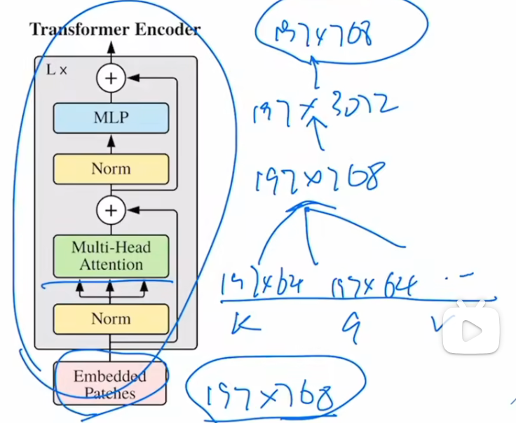
  
       这里多头注意力,Vit-base用的12个头，因此k,q,v的维度是197\*64(768/12)
  
    5. Use the final `[CLS]` representation for classification.
  
  - Experiment
  
    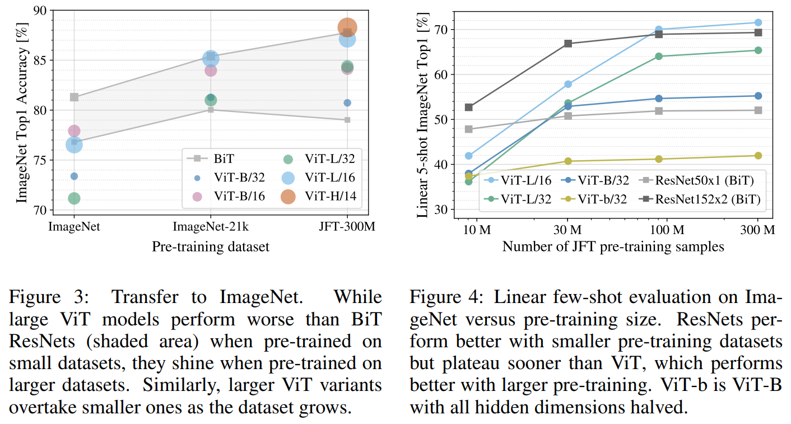
    
    可以看到Vit的随着数据集的扩大不断变强的能力
  
  - Pros
  
    - Global receptive field from the first layer.
    - Architecture is simple and highly scalable.
    - Became the base template for many later ViT variants.
  
  - Cons
  
    - Weak locality prior, so it is data-hungry.
    - Full attention has quadratic cost w.r.t. token number.
    - Plain single-scale design is not ideal for dense prediction.

## FastVit

- __FastViT: A Fast Hybrid Vision Transformer using Structural Reparameterization.__ *Pavan Kumar Anasosalu Vasu et al.* __arXiv, 2023__ [(Arxiv)](https://arxiv.org/abs/2303.14189) 

  > MobileOne 原班人马打造，可以看做是 MobileOne 的方法在 Transformer 上的一个改进型的应用

  - Takeaway: a hybrid vision transformer architecture that obtains the state-of-the-art latency-accuracy trade-off. 引入了一种新的 token mixer，叫做 RepMixer，它使用结构重新参数化技术，通过删除网络中的 Shortcut 来降低内存访问成本。效果也很好

  - Motivation: 很多 hybrid ViT 在 accuracy 上已经不错，但真实设备上的 latency 往往并不理想。论文的核心切入点不是只看 FLOPs，而是进一步关注 **memory access cost**: skip connection、branching 和 attention-like mixing 在移动端会带来真实时延开销，因此作者希望设计一个对 mobile inference 更友好的 hybrid backbone。

  - Core Mechanism

    - Architecture: FastViT 是一个 hybrid vision transformer，也就是混合式视觉 Transformer。作者把网络分成了四个 stage。前 3 个 stage 主要用 RepMixer 来做 token mixing，第 4 个 stage 才使用 self attention

      

      - 每个stage分辨率减半，通道数加倍

    - a new token mixer: RepMixer。它的目标不是像标准注意力那样做全局交互，而是更像一个高效的局部信息搅拌器，用深度卷积去混合空间信息。下面介绍一下主要特点

      > [!TIP]
      >
      > skip connection由于增加了内存访问成本 (memory access cost)，这些跳过连接在延迟方面占了很大的开销。所以这里想到了使用**结构重参数化**来删除 skip-connection

      1. use structural reparameterization to remove skip connection

      2. 为主要的层添加一些过参数化的额外的分支，以在训练时提升模型的精度，在推理时全部消除

      3. 使用了大核卷积在前几个阶段替换掉 self-attention

         主要是在FFN和Patch Embedding中加入

  - Pipeline:

    1. Input image 先经过 patch embedding / early convolution stem.
    2. 前几个 stage 使用 RepMixer block 做高效 token mixing, 同时逐 stage 下采样。
    3. 后期 stage 再引入 self-attention，补充更强的全局建模能力。
    4. 训练时使用 over-parameterized branches，推理前通过 structural reparameterization 融合成单分支高效模型。
    5. 最终输出用于 classification，也可迁移到 detection、segmentation 等下游任务。

  - Pros

    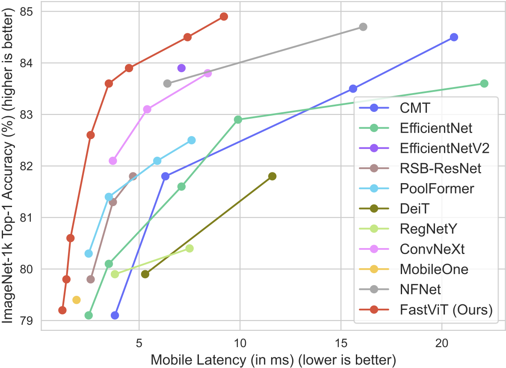

    - 非常强调 real-world latency，而不只是 paper FLOPs。
    - RepMixer + reparameterization 在移动端部署场景里很有针对性。
    - 兼顾 CNN 式层次结构和 Transformer 式后期全局建模，迁移性较强。

  - Cons

    - 本质上仍然是 carefully engineered hybrid design，结构不如 plain ViT 那么统一简洁。
    - 性能优势部分依赖特定硬件与部署实现，跨平台结论要谨慎看。
    - 早期主要依赖局部 mixing，长程依赖仍然更多留到后期 attention stage 处理。

## Swin Transformer

- **Swin Transformer: Hierarchical Vision Transformer using Shifted Windows**. Ze Liu et.al. **arxiv**, **2021**, ([link](https://arxiv.org/abs/2103.14030)). ([My PDF](https://drive.google.com/file/d/1ITHMu_BCEdOAe-d2UTodE8FjAdfbX44L/view?usp=drivesdk)) ICCV 21最佳论文

  - Takeaway: 用window-based local attention + shifted windows 来替 global attention with, 并且搭建一个hierarchical backbone. 有线性计算复杂度

    > 出来就屠榜了

  - Motivation: 原始 ViT 的 token resolution 基本固定，而且全局 attention 的复杂度随图像尺寸二次增长，不太适合高分辨率输入和 dense prediction。Swin 的目标就是同时解决 efficiency 和 multi-scale representation 这两个问题。
  
    > [!NOTE]
    >
    > 为什么要多尺度呢？因为Vit只做了分类任务，这里希望能将transformer处理视觉中的所有任务。
    >
    > 虽然展望了CV和NLP的大一统，但是swin-t还是更多地利用了CV中的先验知识，或者说Vit更简单和接近大一统

  - Core Mechanism:

    
  
    > W-MSA and SW-MSA are multi-head self attention modules with regular and shifted windowing configurations, respectively.
    >
    > LayerNorm (LN) 
    >
    > patch merging类似于pooling
    >
    > 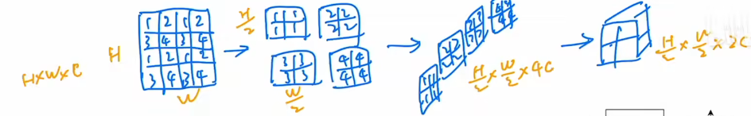

    - Hierarchical backbone

      Swin 不再一直保持固定 token 数，而是像 CNN 一样逐 stage 下采样，让 feature map 分辨率逐渐降低、通道数逐渐升高，因此天然更适合作为通用 backbone。

    - Window-based self-attention
  
      self-attention 不在整张图上做，而是在每个 non-overlapping local window 内做。这样复杂度从全局 attention 的 quadratic cost 降到对图像大小近似线性:
  
      $$
      \Omega(\mathrm{\text{}MSA}) = 4hwC^2 + 2(hw)^2C \\
      \Omega(\mathrm{W\text{-}MSA}) = 4hwC^2 + 2M^2hwC
      $$
  
      其中 $h,w$ 是 feature map spatial size, $C$ 是通道维度, $M$ 是 window size。关键点在于第二项不再是 $(hw)^2$ 级别。
  
    - Shifted window connection
  
      如果一直使用固定窗口，不同窗口之间无法通信。Swin 采用交替的 W-MSA / SW-MSA: 一层按常规窗口分块，下一层把窗口平移半个 window size，让跨窗口的信息通过 attention 自然传播。
      
      
      
      > [!NOTE]
      >
      > 为了不让shift window之后进行九个格子的attention，这里将ABC拼接到下面来，然后还是计算attention，但是因为除了左上格子，其他格子的东西是拼接的，不应该进行attentino，因此通过掩码来实现，最后再拼接回去
      >
      > 
      >
      > 可以自己想想为什么长这样
  
  - Pipeline:
  
    1. Split image into non-overlapping patches and embed them.
    2. Process tokens with Swin blocks inside local windows.
    3. Alternate regular windows and shifted windows for cross-window interaction.
    4. Use patch merging between stages to downsample and expand channels.
    5. Output multi-scale features for classification or dense prediction heads.
  
  - Pros
  
    - Linear-complexity attention w.r.t. image size.
    - Multi-scale hierarchy makes it detection/segmentation friendly.
    - Strong general-purpose backbone performance.
  
  - Cons
  
    - Window partition introduces extra design complexity.
    - Long-range interaction is weaker than full global attention in a single layer.
    - Performance depends on careful stage/window hyperparameter choices.

## MLP-Mixer

- **MLP-Mixer: An all-MLP Architecture for Vision**. Ilya Tolstikhin et.al. **arxiv**, **2021**, ([link](https://arxiv.org/abs/2105.01601)).

  - Takeaway: MLP-Mixer shows that image classification does not strictly require convolution or self-attention; a stack of token-mixing MLPs and channel-mixing MLPs can already achieve competitive results.

  - Motivation: 在 ViT 爆火之后，一个自然问题是: Transformer 的成功到底来自 attention，还是来自 patchify + large-scale training 这套 recipe? MLP-Mixer 的回答是，attention 不是必要条件。

  - Core Mechanism:

    

    - Token-mixing MLP

      输入张量可记为 $X\in\mathbb{R}^{S\times C}$, 其中 $S$ 是 patch/token 数量，$C$ 是 channel 维度。token-mixing MLP 固定每个 channel，沿 token 维做混合，让不同 patch 之间交换空间信息:

      $$
      U_{*,i} = X_{*,i} + W_2\sigma(W_1\,\mathrm{LN}(X)_{*,i})
      $$

      这里的 MLP 是在 token 维度上工作的，因此本质上在做 spatial mixing。

    - Channel-mixing MLP

      然后固定每个 token，沿 channel 维再做一次标准 MLP:

      $$
      Y_{j,*} = U_{j,*} + W_4\sigma(W_3\,\mathrm{LN}(U)_{j,*})
      $$

      这样两个 MLP 一个负责跨 patch 交流，一个负责单 patch 内的特征变换，组合起来替代 conv 和 attention。

  - Pipeline:

    1. Split image into patches and linearly embed them.
    2. Stack Mixer layers.
    3. In each layer, run token-mixing MLP across patches.
    4. Run channel-mixing MLP across feature channels.
    5. Global pool and classify.

  - Pros

    - Architecture is extremely clean and conceptually simple.
    - Good evidence that patch-based modeling recipe matters a lot.
    - Works competitively when trained at scale.

  - Cons

    - No built-in locality or hierarchy.
    - Token-mixing MLP parameterization is tied to sequence length.
    - Mainly strong on classification, less naturally suited for dense tasks.

## IGPT

## BEiT

- **BEiT: BERT Pre-Training of Image Transformers**. Hangbo Bao et.al. **arxiv**, **2021**, ([link](https://arxiv.org/abs/2106.08254)) ([OpenReview](https://openreview.net/forum?id=p-BhZSz59o4)).

  - Takeaway: BEiT 把 BERT-style masked language modeling 迁移到视觉上：不是重建 raw pixels，而是 mask 掉 image patches 后去预测离散化的 visual tokens，因此提供了一种比直接像素回归更抽象的离散 token-level pretraining 目标。

  - Motivation: ViT 虽然在 supervised setting 很强，但仍然非常依赖大规模标注数据。NLP 里的 BERT 说明 masked token prediction 可以学到很强的通用表示，因此一个自然问题就是：对图像来说，能不能像 BERT 一样通过 masked modeling 做自监督预训练？

    难点在于 image patch 不像 word token 那样天然离散，所以不能直接照搬 MLM。

  - Core Mechanism:

    

    > [!NOTE]
    >
    > 这个 overview figure 很直观地展示了 BEiT 的核心思想：输入给 ViT 的是被 mask 的 patch sequence，而监督信号来自一个 pretrained tokenizer 产生的 discrete visual tokens。

    - Discrete visual tokens as targets

      BEiT 先用一个预训练好的 image tokenizer（论文中使用 dVAE）把图像转换成离散 visual tokens。这样每个 patch 都有一个类似“视觉词表 id”的目标标签，masked image modeling 就被转化成 masked token classification。

    - Frozen tokenizer supervision

      同一张图片一方面会被 patchify 后送进 ViT encoder，另一方面由一个预训练好的 tokenizer 产生离散 visual tokens 作为监督目标。训练时真正被优化的是 masked patch sequence 上的 ViT encoder，而 tokenizer 主要提供被 mask 位置原本对应的 target ids。

    - Masked image modeling objective

      其核心目标可以写成：

      $$
      \mathcal{L}_{\mathrm{MIM}} = - \sum_{i \in \mathcal{M}} \log p_\theta(z_i \mid x^{\mathrm{masked}})
      $$

      其中 $\\mathcal{M}$ 是被 mask 的 patch 位置，$z_i$ 是 tokenizer 给出的离散 visual token。关键点是：预测目标不是 pixel value，而是离散语义 token，因此任务更像 BERT 的 masked token recovery。

  - Pipeline:

    1. Input image 一方面被切成 patches，另一方面送入 pretrained tokenizer 得到 discrete visual tokens。
    2. 随机 mask 一部分输入 patches。
    3. 将带 mask 的 patch sequence 输入 bidirectional ViT encoder。
    4. 仅在 masked positions 上预测原始 visual token ids。
    5. 预训练完成后，丢弃 token prediction head，将 encoder 用于 classification / detection / segmentation 等下游任务。

  - Pros

    - 比 pixel reconstruction 更偏 semantic supervision，更接近 NLP 中 BERT 的训练方式。
    - 证明了 masked image modeling 可以成为 ViT 的有效自监督预训练范式。
    - 为后续 MAE、SimMIM 等 MIM 路线提供了重要起点。

  - Cons

    - 依赖额外的 tokenizer（例如 dVAE），训练流程不如后来的 MAE 那么简洁。
    - 预训练目标质量会受到离散 tokenizer 本身质量的影响。
    - 相比直接 reconstruct pixels，整个 tokenizer + masked-token classification 设计更复杂，工程成本更高。
    - 与后来的 MAE 相比，BEiT 仍然在 full-length token sequence 上做 encoder 计算，因此没有 MAE 那种明显的 encoder-side efficiency 优势。

## MAE

- **Masked Autoencoders Are Scalable Vision Learners**. Kaiming He et.al. **arxiv**, **2021**, ([link](https://arxiv.org/abs/2111.06377)). ([My PDF](https://drive.google.com/file/d/1o2CegIX6zjekBU0JEa4G2zy59Bn4SZlI/view?usp=drivesdk))

  - Takeaway: MAE uses heavy random masking plus an asymmetric encoder-decoder to turn image reconstruction into an efficient and scalable self-supervised pretraining objective for ViTs. 所以这篇论文名就完整介绍了内容

    > [!TIP]
    >
    > 用Vit来做跟BERT一样的自监督学习

    > [!note]
    >
    > 这里我们理解一下什么是auto，为什么这里叫autoencoder: auto自 是指输入和输出的东西是一样的，所以nlp中输入输出都是一些words(token)因此叫做autoregression

  - Motivation: BERT-style masked modeling 在 NLP 很成功，但在图像上直接照搬通常效果一般，因为像素冗余度太高、重建任务太容易。MAE 的核心问题就是: how to make masked image modeling non-trivial and efficient enough for large ViTs?

  - Core Mechanism:
  
    
  
    MAE实际就是观察部分的数据，然后重构完整的信号。
  
    > [!NOTE]
    >
    > 主要做了三件事情，用Vit来做跟BERT一样的自监督学习，其实Vit也已经做过了，但是MAE：
    >
    > 1. mask更多，让任务更复杂，学到更好的表征
    > 2. 用transformer decoder直接还原原始信息，使得流程简单
    > 3. 加上Vit工作后的各种技术，使得训练更鲁棒一点
  
    - High masking ratio
  
      MAE 直接随机 mask 掉约 75% patches。这个比例非常高，使得重建任务不再是 low-level copy，而更像是逼模型去理解全局语义和结构。
  
    - Asymmetric encoder-decoder
  
      encoder 只处理 visible patches, 不输入 mask token；decoder 再把 latent 表示和 mask tokens 拼起来做重建。这样 encoder 的计算量明显下降，是 MAE 训练高效的关键原因之一。
  
      Asymmetric非对称体现在：输入不同，维度也不同，因此中间会有一层linear
  
      > [!NOTE]
      >
      > 输入不同：
      >
      > - encoder只能看见一些没被mask的patch，避免了transformer的计算复杂度，输出latent representation
      > - decoder输入完整的patch，被mask掉的patch会用一个mask_token来代替+位置编码
  
    - ReconAsymmetricstruction objective on masked patches
  
      训练目标只在被 mask 的 patch 上计算像素重建误差，做了一个简单的MSE(mean square error) only on the masked patches:
  
      $$
      \mathcal{L} = \frac{1}{|\mathcal{M}|}\sum_{i\in\mathcal{M}} \lVert x_i - \hat{x}_i \rVert_2^2
      $$
  
      其中 $\mathcal{M}$ 是 masked patch 集合。作者发现这种简单的 pixel reconstruction target 就足够学到很强的 visual representation。
  
  - Pipeline:
  
    1. Split image into patches.
    2. Randomly mask a large portion of patches, typically 75%.
    3. Feed only visible patches to the ViT encoder.
    4. Append mask tokens and use a lightweight decoder to reconstruct missing patches.
    5. Pretrain with reconstruction loss, then discard decoder and finetune the encoder for downstream tasks.
  
  - Pros
  
    - Very simple self-supervised pretraining recipe.
    - Encoder-side compute is efficient because masked patches are skipped.
    - Scales well to large ViT backbones and transfers strongly.
  
  - Cons
  
    - Pretraining and finetuning are two-stage rather than end-to-end downstream training.
    - Reconstruction objective is still pixel-level, so representation quality depends on masking strategy.
    - Benefit is most obvious when enough pretraining compute is available.

## SimCLR

- **A Simple Framework for Contrastive Learning of Visual Representations**. Ting Chen et.al. **ICML**, **2020**, ([Arxiv](https://arxiv.org/abs/2002.05709)) [(Code)](https://github.com/google-research/simclr). ([My PDF](https://drive.google.com/open?id=1AsvXgGqrEvev7nSUiyjYTDqfPvdNfHtK))

  - Takeaway: SimCLR 提出一个非常简洁的视觉对比学习框架：对同一张图片做两次强 augmentation，把两视图拉近、把 batch 内其它视图推远；它证明了 strong augmentation、nonlinear projection head、normalized temperature-scaled contrastive loss 和 large batch/long training 是视觉 contrastive representation learning 的关键 recipe。

  - Motivation: 早期 self-supervised visual representation learning 往往依赖复杂 pretext task、specialized architecture、memory bank 或 handcrafted heuristic。SimCLR 想回答的问题是：如果去掉 memory bank / special architecture，仅用 end-to-end contrastive learning，哪些训练组件真正决定 representation quality？

    > [!NOTE]
    >
    > 这里有个trade-off:
    >
    > 因为需要大batch更好，因为负样本更多，任务更难，更能学习。但是当batch大了之后，会有很多false negetive，比如都是两只哈巴狗（不同图片），这时是当作负样本被推开的
    >
    > 实际上大的batch size是必要的（可以查看MoCo的介绍），SimCLR是直接end-to-end的学习，因为有google的tpu，batch_size为8192，已经满足大batch_size的需求了

  - Core Mechanism:

    

    > [!NOTE]
    >
    > SimCLR 的结构刻意保持简单：两次 augmentation 产生 positive pair，经同一个 encoder $f(\cdot)$ 得到 representation $h$，再经 projection head $g(\cdot)$ 得到 contrastive space 中的 $z$；预训练结束后丢弃 $g$，只保留 encoder representation $h$。

    - Strong data augmentation defines the task

      **What**: 对每个 image 随机采样两种 augmentation view，形成 positive pair；论文中关键组合是 random crop + color distortion，并加入 Gaussian blur。

      **Why**: contrastive learning 的“标签”完全来自 view construction。如果 augmentation 太弱，模型可以利用 low-level shortcut；如果 augmentation 合理，模型必须学习对语义保持不变的 representation。
  
      **How**: 一个 minibatch 有 $N$ 张图，每张图生成两个 views，共 $2N$ 个样本；同一原图的两个 views 是 positive，其余 $2(N-1)$ 个 views 都作为 in-batch negatives。

    - Nonlinear projection head separates training space and representation space

      **What**: encoder $f(\cdot)$ 输出 $h_i$，projection head $g(\cdot)$ 再映射到 $z_i$，contrastive loss 作用在 $z$ 上而不是直接作用在 $h$ 上：
  
      $$
      h_i = f(\tilde{x}_i), \qquad z_i = g(h_i)=W^{(2)}\sigma(W^{(1)}h_i)
      $$

      **Why**: 论文发现加一个 nonlinear projection head 会**明显提升**最终 encoder representation 的 linear evaluation 质量；直觉上，projection head 可以吸收 contrastive objective 需要的不变性约束，让下游使用的 $h$ 保留更多有用信息。
  
      > [!NOTE]
      >
      > 什么是projection head 可以吸收 contrastive objective 需要的不变性约束？为什么需要吸收这个约束？
      >
      > 如果没有projection head模型会被鼓励忽略：颜色变化、局部细节这些内容，这对 contrastive task 是好的，因为它让两个 view 更容易被拉近（这就是不变性约束），我们希望projection head来满足这些不变性约束，而representation希望尽量保留更丰富的信息
  
      **How**: 训练时同时更新 $f$ 和 $g$；下游分类、迁移或 finetune 时丢弃 $g$，只使用 $h=f(x)$。
  
    - Loss: NT-Xent loss with normalized embeddings and temperature
  
      **What**: 对 positive pair $(i,j)$，SimCLR 使用 normalized temperature-scaled cross entropy loss：
      $$
      \ell_{i,j} = -\log \frac{\exp(\operatorname{sim}(z_i,z_j)/\tau)}{\sum_{k=1}^{2N} \mathbf{1}_{[k\neq i]}\exp(\operatorname{sim}(z_i,z_k)/\tau)} \\
      \mathcal{L}
      =
      \frac{1}{2N}
      \sum_{k=1}^{N}
      \left[
      \ell_{2k-1,2k}
      +
      \ell_{2k,2k-1}
      \right]
      $$
      
      其中 $\text{sim}(z_i, z_j)=\frac{z_i^\top z_j}{\|z_i\|\|z_j\|}$ 是 cosine similarity，$\tau$ 是 temperature，$1_{k\ne i}$排除自己和自己的相似度。分子拉近同一图片的两个 augmented views，分母把 batch 内其它 views 当 negatives 推远。
      
      > [!NOTE]
      >
      > 本质是一个cross entropy：
      >
      > 可以把公式改写成 softmax 分类。
      >
      > 对 anchor $z_i$，模型给每个候选 $z_k$ 一个 logit：
      > $$
      > \text{logit}_{i,k}
      > =
      > \frac{\text{sim}(z_i,z_k)}{\tau}
      > $$
      > 然后 softmax 得到 $z_k$ 是正样本的概率：
      > $$
      > p_{i,k}
      > =
      > \frac{
      > \exp(\text{sim}(z_i,z_k)/\tau)
      > }{
      > \sum_{m=1}^{2N} \mathbf{1}_{m \ne i}
      > \exp(\text{sim}(z_i,z_m)/\tau)
      > }
      > $$
      > 真正的正确类别是 $j$，所以 loss 就是：
      > $$
      > \ell_{i,j} = -\log p_{i,j}
      > $$
      > 这和普通分类交叉熵非常像。
      >
      > 所以要有$\tau$来控制temperature参数，如果 $\tau$ 较大，softmax 会更平滑。这时每个候选项的概率差距变小，模型不会过度关注 hard negatives
      
      > [!NOTE]
      >
      > 下面我们从梯度的角度来看看这个loss为什么会有用
      >
      > 对相似度求导，可以得到直观结论：
      >
      > 对于正样本 $j$：
      > $$
      > \frac{\partial \ell_{i,j}}{\partial \text{sim}(z_i,z_j)}
      > =
      > \frac{p_{i,j}-1}{\tau}
      > $$
      > 因为 $p_{i,j}<1$，所以这个值通常是负的。梯度下降会让正样本相似度变大。
      >
      > 对于负样本 $k$：
      > $$
      > \frac{\partial \ell_{i,j}}{\partial \text{sim}(z_i,z_k)}
      > =
      > \frac{p_{i,k}}{\tau}
      > $$
      > 这个值是正的。梯度下降会让负样本相似度变小。
      
      **Why**: normalization 和 temperature 共同控制 similarity scale 与 hard negative 权重，使 contrastive cross entropy 更稳定、更适合大 batch 训练。
      
      **How**: loss 对每个 positive pair 双向计算：$(2k-1,2k)$ 和 $(2k,2k-1)$ 都参与最终 mini-batch loss。
      
      > [!NOTE]
      >
      > 对N个原图，每张生成两个view，因此输入应该是2N，对每个输入view，要在另外的2N-1中找到对应的view
  
  - Pipeline:
  
    1. 从 unlabeled dataset 采样一个 minibatch，共 $N$ 张 images。
    2. 对每张 image 独立采样两次 augmentation，得到 $2N$ 个 correlated views。
    3. 每个 view 经过共享 encoder $f$ 得到 representation $h$，再经过 projection head $g$ 得到 $z$。
    4. 对每个 view，把同源 view 作为 positive，把 batch 内其它 $2N-2$ 个 views 作为 negatives，计算 NT-Xent loss。
    5. 预训练结束后丢弃 projection head，用 encoder representation $h$ 做 linear evaluation、semi-supervised finetuning 或 downstream transfer。
  
  - Pros
  
    - 框架非常简单，不需要 memory bank、momentum encoder 或 specialized architecture。
    - 明确指出 augmentation composition、projection head、temperature 和 batch size / training length 对 contrastive learning 的影响。
    - 在 ImageNet linear evaluation 和 few-label finetuning 上展示了 self-supervised pretraining 可以接近强 supervised ResNet-50 baseline。
  
  - Cons
  
    - 对 large batch 和 long training 比较敏感，训练资源需求高。
    - 强依赖 carefully designed augmentations；augmentation 选择不当会直接改变 pretext task 的语义。
    - In-batch negative 机制可能把语义相近但不同实例的图片当成 negatives，存在 false negative 问题。

## MoCo

- **Momentum Contrast for Unsupervised Visual Representation Learning**. Kaiming He et.al. **CVPR**, **2020**, ([Arxiv](https://arxiv.org/abs/1911.05722)) [(CVF)](https://openaccess.thecvf.com/content_CVPR_2020/html/He_Momentum_Contrast_for_Unsupervised_Visual_Representation_Learning_CVPR_2020_paper.html) [(Code)](https://github.com/facebookresearch/moco). ([My PDF](https://drive.google.com/file/d/1eD-1PnWox5H9K87435BdAuLOkwza-H7L/view?usp=drivesdk))

  - Takeaway: MoCo 把 contrastive learning 看成 dictionary lookup：用一个动态 queue 存大量 negative keys，同时用 momentum encoder 生成稳定 keys，从而在不需要超大 batch 的情况下训练强视觉表征。

    > [!NOTE]
    >
    > 大家关注MoCo的原因是：MoCo是第一个使用无监督的预训练全面在主流视觉任务上比有监督预训练效果更好
    >
    > 当然我们对无监督学习还有其他期待：像nlp那样，更大模型+更多data是否能不断地提升性能

  - Prior

    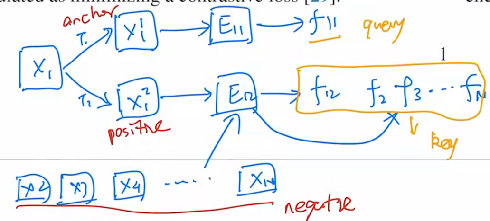

    > [!NOTE]
    >
    > 将对比学习归纳为一个动态字典的问题：query and key，使得query和key中positive向量相似，与negative key远离

    - NCE loss：
      - Motivation: 之前直接用CE来计算，但是因为是自监督学习，所以相当于每张图片都是一个类，这样类别很大，softmax基本就不work了，
      - Core: 我们在CE上进行改进得到NCE(noise contrastive estimation)，之前类别多产生问题，所以这里就只用两分类: data sample and noisy sample，NCE 用真实样本和噪声样本做二分类。但是数据还是很多，因此就使用采样的方法，所以叫做estimation

  - Motivation: 早期 instance-level contrastive learning 通常有两个矛盾：end-to-end 大 batch 方法需要很多 GPU memory，memory bank 方法虽然能存很多 negatives，但 encoder 更新后 bank 中旧特征容易不一致。
  
    

    > [!NOTE]
    >
    > 在MoCo之前主要有两种结构
    >
    > - end-to-end：有分别有两个encoder（可一样也可不一样），Pro:可动态更新consistent好，Con:需要大的batch_size(SimCLR好因为其8192的batch_size)。
    > - memory bank：对所有图片的特征直接先存起来，每次取出来$k_{sample}$计算loss，然后更新encoder，只是对$k_{sample}$推理得到新的特征更新memory bank。Pro:不需要大的batch_size，因为我已经用bank存起来了（随便取），Con:因为memory bank中的不同key是不同时间的encoder计算得到的，存在inconsistent
  
    因此我们想要 a large and consistent dictionary
  
    MoCo 的想法是不用特别大的 batch，而是维护一个动态队列来存储很多历史负样本
  
    > [!NOTE]
    >
    > large dictionary: 表征更加丰富，避免学到shortcut
  
  - Core Mechanism:
  
    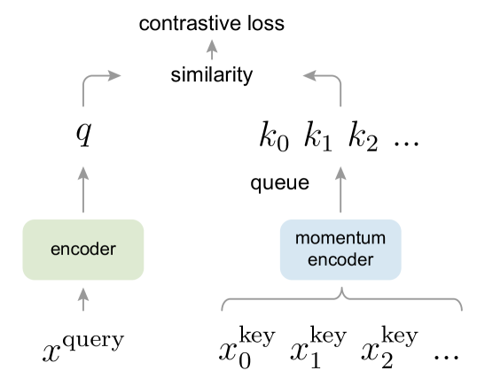
  
    - Contrastive learning as dictionary lookup
  
      对一张图片做两种 augmentation，query encoder 产生 $q$，key encoder 产生正样本 $k_+$；queue 中其它图片的 keys 作为 negatives。核心 InfoNCE loss 是：
  
      $$
      \mathcal{L}_q = -\log \frac{\exp(q\cdot k_+ / \tau)}{\sum_{i=0}^{K}\exp(q\cdot k_i / \tau)}
      $$
  
      其中 $\tau$ 是 temperature，$K$ 是 queue 中 negative keys 数量。这个目标本质上是在大量候选 key 里识别与 query 匹配的 positive key。
  
      > [!NOTE]
      >
      > 本质上是将NCE去除的多分类又弄了回来，变成K+1类别的分类任务（回到cross entropy了）
  
    - Dynamic queue as a large dictionary
  
      MoCo 不把 negatives 限制在当前 mini-batch，而是维护一个 FIFO queue：当前 batch 的 keys enqueue，最旧的 keys dequeue。这样 dictionary size 和 batch size 解耦，可以用较小 batch 获得大量 negatives。
  
    - Momentum encoder for consistent keys
  
      如果 key encoder 每一步都被 backprop 直接更新，queue 里不同时间产生的 keys 会来自差异很大的 encoder，破坏 dictionary consistency。MoCo 用 query encoder 的 moving average 来更新 key encoder：
  
      $$
      \theta_{\mathrm{k}} \leftarrow m\theta_{\mathrm{k}} + (1-m)\theta_{\mathrm{q}}
      $$
  
      其中 $\theta_q$ 由梯度更新，$\theta_k$ 只做 momentum update。$m$ 接近 1 时，key encoder 变化更慢，queue 中旧 keys 与新 keys 更一致。
  
  - Pipeline:
  
    1. 对同一张 image 采样两种 random augmentations，分别作为 query view 和 key view。
    2. query view 输入 encoder $f_q$ 得到 $q$，key view 输入 momentum encoder $f_k$ 得到 $k_+$。
    3. 用 $q$ 与 $k_+$ 作为 positive pair，用 queue 中其它 keys 作为 negatives 计算 InfoNCE loss。
    4. 只通过 backprop 更新 $f_q$；再用 momentum rule 更新 $f_k$。
    5. 将当前 batch 的 keys 放入 queue，移除最旧 keys；预训练后丢弃 projection head，用 backbone 表征迁移到 detection、segmentation 等下游任务。
  
  - Pros
  
    - Large negative dictionary 不再依赖超大 batch，训练资源更友好。
    - Momentum encoder 明确解决 queued features 的 consistency 问题。
    - 在 ImageNet linear evaluation 和 detection/segmentation transfer 上证明了 unsupervised pretraining 可以接近甚至推动 supervised pretraining。
  
  - Cons
  
    - 仍然依赖大量 negative samples 和 carefully designed augmentations。
    - Queue 带来额外状态管理，训练流程比普通 supervised learning 更复杂。
    - Instance discrimination 更偏 invariance learning，可能丢失对某些细粒度差异有用的信息。

## DINO

### DINOv1

> 下面介绍的DINO是meta的dino

- __Emerging Properties in Self-Supervised Vision Transformers.__ *Mathilde Caron et al.(meta FAIR)* __ICCV, 2021__ [(Arxiv)](https://arxiv.org/abs/2104.14294) [(Code)](https://github.com/facebookresearch/dino)

  - Takeaway: DINOv1 把 self-supervised ViT 训练解释为 **self-distillation with no labels**：student 预测 momentum teacher 在不同 image views 上的输出，不需要 labels、negative pairs 或 contrastive memory bank。它的重要发现是：自监督 ViT 的 last-block self-attention 会自然浮现 object boundaries / semantic layout，同时 frozen feature 也能做很强的 k-NN / linear evaluation。

  - Motivation: 早期 ViT 在视觉里主要依赖 supervised pretraining，虽然分类表现接近 convnet，但计算更重、数据需求更高，也没有展示出明显不同于 convnet 的 feature property。论文怀疑问题不只在 architecture，而在 **image-level label supervision 太贫乏**：一张图被压成单个类别标签，会丢掉 object parts、boundaries、layout 等丰富视觉信息。目标是验证：如果用 self-supervised objective 训练 ViT，是否会出现更适合 dense visual understanding 的 emergent properties？

  - Core Mechanism:

    

    DINOv1 用同构 student/teacher 网络（参数不同，结构相同）做 cross-view prediction；输入图片，然后都会输出k-dim feature，teacher输出用batch mean做centering处理，用temprature-softmax计算得到p，然后算loss更新梯度，teacher stop-gradient，并由 student 的 EMA 参数更新。

    - Self-distillation with no labels

      - **What**: student $g_{\theta_s}$ 和 teacher $g_{\theta_t}$ 输出 $K$ 维概率分布，student 被训练去匹配 teacher 在另一种 crop/view 上的输出。给定温度 $\tau_s$：

        $$
        P_s(x)^{(i)}=\frac{\exp(g_{\theta_s}(x)^{(i)}/\tau_s)}
        {\sum_{k=1}^{K}\exp(g_{\theta_s}(x)^{(k)}/\tau_s)}
        $$

        基础 loss 是 teacher distribution 到 student distribution 的 cross-entropy：

        $$
        \min_{\theta_s} H(P_t(x),P_s(x')), \quad H(a,b)=-a\log b
        $$

      - **Why**: 传统 contrastive learning 依赖 negative pairs / queue / large batch 来避免 collapse；DINO 改成“预测 teacher 的 sharpened distribution”，把 SSL 直接写成 knowledge distillation 形式，训练目标更简单，也天然适合 ViT。

      - **How**: 对同一图像生成不同 augmentation views，teacher 输出 stop-gradient，只更新 student；teacher 不是固定外部模型，而是在训练过程中由 student 的历史平均动态构建。

    - Multi-crop local-to-global training

      - **What**: 对每张图生成两个 global crops 和多个 local crops；student 看所有 crops，teacher 只看 global crops，要求 local view 也能预测 global teacher 的输出：

        $$
        \min_{\theta_s}
        \sum_{x\in\{x_1^g,x_2^g\}}
        \sum_{\substack{x'\in V\\x'\ne x}}
        H(P_t(x),P_s(x'))
        $$
        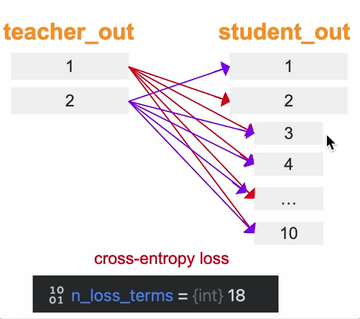

      - **Why**: global view 提供完整 object/scene 语义，local view 只看到局部区域；让 local 对齐 global 可以迫使模型学习 part-to-object、local-to-global 的语义一致性，而不是只记住局部纹理。

      - **How**: 论文默认使用 $2\times224^2$ global views 和若干 $96^2$ local views；所有 pairwise cross-view losses 汇总训练 student。

    - Momentum teacher + stop-gradient

      - **What**: teacher 参数由 student 参数的 exponential moving average 更新：
        $$
        \theta_t \leftarrow \lambda\theta_t + (1-\lambda)\theta_s
        $$

      - **Why**: 如果 teacher 只是当前 student 的直接拷贝，目标会快速漂移甚至 collapse；EMA teacher 相当于历史 student ensemble，target 更平滑、更稳定，实验中 teacher representation 也通常优于 student。

      - **How**: 反向传播只穿过 student；每一步先用 SGD 更新 student，再用 EMA 更新 teacher。训练结束后通常使用 teacher backbone 做 evaluation / downstream feature extraction。

    - Centering + sharpening 防止 collapse

      - **What**: teacher 输出在 softmax 前先减去 batch center，再用较低 teacher temperature 做 sharpening：

        $$
        P_t(x)=\text{softmax}\left(\frac{g_{\theta_t}(x)-c}{\tau_t}\right)
        $$

        center 用 EMA 更新：

        $$
        c \leftarrow mc + (1-m)\frac{1}{B}\sum_{i=1}^{B}g_{\theta_t}(x_i)
        $$

      - **Why**: centering 防止某一维长期支配输出，但会推动分布趋向 uniform；sharpening 让 teacher target 更尖锐，但单独使用又可能导致另一种 collapse。两者配合在 momentum teacher 下形成平衡。

      - **How**: DINO 不依赖 batch normalization、predictor、negative samples 或 Sinkhorn-Knopp；只对 teacher branch 做 center + temperature sharpening，student branch 使用较高温度 softmax。

    - Emergent self-attention segmentation

      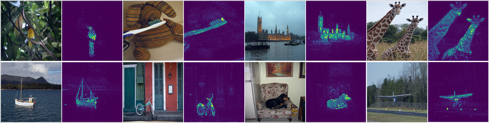

      > DINO 训练的 ViT last-block `[CLS]` attention 能直接突出 objects / boundaries，说明 SSL ViT feature 保留了 dense layout information。

      - **What**: 在 ViT-S/8 等小 patch 模型中，最后一层 `[CLS]` token 的 attention maps 会自然聚焦 foreground object，并覆盖比较完整的 object region。
      - **Why**: supervised classification 只要求预测类别，容易只关注 discriminative part；DINO 的 cross-view SSL 要求不同 crops 共享一致语义，更鼓励模型保留 object-level layout。
      - **How**: 不需要额外 segmentation labels；直接 threshold / visualize last-block self-attention heads 就能得到粗 segmentation mask。这也是后续 DINOv2/DINOv3 强调 dense feature quality 的起点。

  - Pipeline:

    1. 输入 unlabeled images，对每张图采样 2 个 global crops 和多个 local crops，并做 color jitter、blur、solarization 等 augmentation。
    2. student ViT 处理所有 crops；teacher ViT 只处理 global crops，二者 architecture 相同但参数不同。
    3. teacher logits 做 centering + sharpening，并 stop-gradient；student logits 做 temperature softmax。
    4. 对所有 teacher global view 与 student 其他 views 计算 cross-entropy，训练 student 预测 teacher distribution。
    5. 用 SGD/AdamW 更新 student，再用 EMA 更新 teacher 参数和 center。
    6. 训练后用 frozen backbone 做 k-NN、linear probing、image retrieval，或直接可视化 ViT self-attention maps。

  - Pros:

    - **目标简单**：不用 labels、negative pairs、memory bank，也不需要改 ViT architecture。
    - **ViT synergy 强**：self-supervised ViT 同时获得强 image-level representation 和可视化明显的 object-level attention。
    - **下游友好**：features 可直接用于 k-NN / linear evaluation / retrieval，attention maps 还能支持 unsupervised segmentation-like analysis。
    - **启发后续工作**：DINOv2/DINOv3 延续了 DINO 的 student-teacher SSL 思路，并进一步加入 iBOT、KoLeo、data curation 和 scale-up。

  - Cons:

    - **训练仍较敏感**：teacher temperature、warmup、EMA momentum、center update、crop strategy 都会影响稳定性。
    - **attention 不是完整 segmentation 模型**：emergent masks 很有解释性，但边界精度和类别语义不能直接替代 supervised segmentation。
    - **ImageNet-centric bias**：multi-crop local-to-global 受 ImageNet object-centric 数据分布影响，迁移到复杂场景/多物体图像时不一定同样干净。
    - **主要是 representation pretraining**：它不是 detection/segmentation framework，本身不提供任务 head，需要配合下游模型使用。

### DINOv2

- __DINOv2: Learning Robust Visual Features without Supervision.__ *Maxime Oquab et al.* __arXiv, 2023__ [(Arxiv)](https://arxiv.org/abs/2304.07193) [(Code)](https://github.com/facebookresearch/dinov2) (Citations __3100+__)

  - Takeaway: DINOv2 证明 **纯 self-supervised learning** 可以在大规模 curated data 上训练出与弱监督模型（OpenCLIP）媲美甚至超越的 **通用视觉特征**（all-purpose visual features），同时不需要任何文本/标注，且在 image-level 和 pixel-level 任务上都能 frozen 使用。

  - Motivation: NLP 的 foundation model（如 BERT, GPT）通过大规模无监督预训练产生通用特征，但 CV 领域的主流仍是 text-guided pretraining（CLIP 等），这限制了能保留的图像信息（caption 只能近似描述图像），且需要对齐的图文数据。自监督方法虽然理论上能从 raw image 学到更丰富的信息，但之前大多只在 ImageNet-1k 这样的小规模 curated（精选） 数据上验证，扩展到大规模 uncurated 数据时特征质量会显著下降。

    论文要回答的核心问题：如果把 self-supervised learning 的 data 和 model 都 scale up，同时做好 data curation，能否产生真正的通用视觉 foundation model？

  - Core Mechanism:

    

    > DINOv2 在 8 类 vision task 上随模型规模增长的性能表现，与 self-supervised 方法和 weakly-supervised 方法对比。

    DINOv2 的核心 recipe 可概括为：**curated data + combined SSL objectives + efficient large-scale training + distillation**。

    - Automatic Data Curation Pipeline → LVD-142M

      - **What**: 不依赖任何 metadata/text/预训练模型，纯靠图像视觉相似性从 1.2B uncurrated web images 中检索与 curated datasets 相似的图像，构建出 142M 的 LVD-142M 数据集。Pipeline 流程：embedding → deduplication → retrieval → clustering-based rebalancing。
      - **Why**: 直接在大规模 uncurated 数据上训练 SSL 会导致特征质量下降（数据噪声大、domain 不平衡）。需要像 NLP 那样做 data curation，但又不能依赖 text metadata。
      - **How**: 用一个在 ImageNet-22k 上预训练的 ViT-H/16 做 image embedding，然后用 Faiss 做 k-means clustering + cosine similarity retrieval。对每个 curated image 取 N=4 个 nearest neighbors 组成 LVD-142M。整个 pipeline 在 20×V100 节点上运行不到 2 天。

    - Combined Discriminative SSL Objectives

      - **What**: 训练目标和 DINOv3 一致，由三个 loss 组成：
        $$
        \mathcal{L}_{Pre} = \mathcal{L}_{DINO} + \mathcal{L}_{iBOT} + 0.1\mathcal{L}_{KoLeo}
        $$
        其中：

        - $\mathcal{L}_{DINO}$：image-level cross-entropy，student/teacher 的 `[CLS]` token 之间做 prototype matching，负责全局语义。
        - $\mathcal{L}_{iBOT}$：patch-level cross-entropy，student 的 masked patch tokens 预测 teacher 对应位置的 patch tokens，负责局部结构/dense features。
        - $\mathcal{L}_{KoLeo}$：Kozachenko-Leonenko differential entropy estimator，鼓励 batch 内特征均匀分布（feature spread），防止 collapse。

      - **Why**: DINO 保证 image-level 分类/检索能力，iBOT 保证 pixel-level segmentation/matching 能力，KoLeo 防止特征坍缩。三者互补覆盖 global + local + diversity。

      - **How**: 使用 student-teacher 框架，teacher 通过 EMA 更新。采用 Sinkhorn-Knopp centering（来自 SwAV）替代原 DINO/iBOT 的 softmax centering。**Untying heads**：与 iBOT 原论文不同，DINOv2 发现 scale up 后 DINO head 和 iBOT head 共享参数反而不利，改为独立 head。

    - Efficient Large-Scale Training Implementation

      - **What**: 四项关键工程优化使训练速度和显存显著优于 iBOT 原实现（~2× faster, ~1/3 memory）：
        1. **FlashAttention**：自研版，要求 embedding dim per head 为 64 的倍数以最大化 GPU 效率。ViT-g 设计为 1536 dim / 24 heads = 64 dim/head。
        2. **Sequence Packing**：将大小 crops 的 token sequences 拼接成一条长序列，用 block-diagonal attention mask 隔离，避免多次 forward。
        3. **Efficient Stochastic Depth**：随机 drop 残差分支，通过 shuffle + slice 跳过计算而非 mask 结果，drop rate=40% 时几乎等比例节省计算。
        4. **FSDP**（Fully-Sharded Data Parallel）：跨 GPU 分片模型参数。
      - **Why**: 训练 1B 参数的 ViT-g 需要极致的计算/显存效率。
      - **How**: 全部基于 PyTorch 2.0 + xFormers + A100 GPU 实现。

    - Model Distillation & High-Resolution Adaptation

      - **What**: 先训练一个 ViT-g（1.1B params）teacher，再蒸馏出 ViT-S/B/L 等小模型。预训练最后阶段进行 short high-resolution adaptation（将分辨率从 224 提升到 518），增强 pixel-level dense features。
      - **Why**: 大 teacher 学到最强的特征，蒸馏让学生模型也受益；高分辨率对 segmentation/depth 等 dense task 很重要，但全程高分辨率训练太贵。
      - **How**: 蒸馏时小模型同时用 DINO + iBOT loss 学习 teacher 输出；高分辨率 adaptation 只在最后短时间进行。

  - Pipeline:

    1. **Data curation**：从 1.2B web images 中通过 embedding → dedup → retrieval → clustering 构建 LVD-142M。
    2. **Pre-training**：ViT-g teacher 在 LVD-142M 上用 DINO + iBOT + KoLeo 训练，student-teacher EMA 框架，Sinkhorn-Knopp centering，FlashAttention + sequence packing + efficient stochastic depth + FSDP。
    3. **High-resolution adaptation**：将分辨率从 224 升至 518，短期继续训练以强化 dense features。
    4. **Distillation**：将 ViT-g teacher 的特征蒸馏到 ViT-S/B/L 等小模型，同样用 DINO + iBOT loss。
    5. **Downstream usage**：frozen backbone + linear probe 或 lightweight head，覆盖 classification, segmentation, depth estimation, retrieval, matching 等任务。

  - Pros:

    - **真正的通用视觉特征**：单个 frozen encoder 在 image-level（分类/检索）和 pixel-level（分割/深度/匹配）任务上同时表现优异，无需 finetuning。
    - **纯自监督**：不需要任何文本、标注或 metadata，可以从 raw images 学习，扩展到标注稀缺的领域（如遥感、医学影像）。
    - **训练 recipe 完善**：data curation + 多项工程优化的组合经过充分 ablation，可复现性强。
    - **模型族完整**：从 ViT-S 到 ViT-g 多尺寸可选，且提供代码和权重。
    - **特征性质好**：patch features 的 PCA 可视化显示清晰的语义对应（同部位在不同姿态/物体间对应），dense matching 效果好。

  - Cons:

    - **训练成本极高**：需要 ViT-g (1.1B)、LVD-142M 数据集和大量 A100 GPU，普通研究者难以复现完整训练。
    - **依赖 data curation pipeline**：LVD-142M 的构建过程复杂，且 curated seed datasets 的选择会影响最终特征质量。
    - **pixel-level 任务仍需 head**：虽然 backbone 是 frozen 的，但 segmentation/depth 等任务仍需训练 task-specific head（只是比 finetuning 轻量）。
    - **不是 detection 论文**：DINOv2 是通用 visual encoder，不是 object detector；用于检测时需配合 detection head。

### DINOv3

- __DINOv3.__ *Oriane Siméoni et al.* __arXiv, 2025__ [(Arxiv)](https://arxiv.org/abs/2508.10104) [(Code)](https://github.com/facebookresearch/dinov3) ([My PDF](https://drive.google.com/file/d/18FfKn4mDpbYVsJkSdcWxSX3wJPrxkE56/view?usp=drivesdk))

  - Takeaway: DINOv3 是 Meta 提出的 self-supervised vision foundation model family，通过 scaling data/model、**Gram anchoring** 和 post-training adaptation，让单个 frozen visual encoder 同时具备强 global representation 和高质量 dense features。

  - Motivation: DINOv2 已证明 SSL visual features 很强，但进一步扩大到更大模型和更长训练时会出现两个问题：训练 horizon 难以预设，且 dense patch feature maps 会逐渐退化，导致 segmentation/depth/matching 等 dense tasks 不稳定。DINOv3 的目标是让 SSL backbone 在无人工标注、无任务 finetuning 的情况下覆盖 natural images、aerial images 等多域任务。

  - Core Mechanism:

    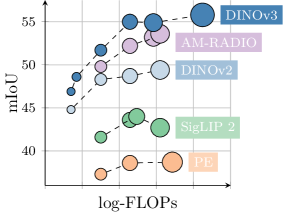

    > DINOv3 family 在 dense benchmark（如 ADE20k semantic segmentation）上显著优于以往 self-/weakly-supervised foundation models。

    - Large-scale SSL Pre-training

      - **What**: 训练一个 ViT-7B/16 teacher，并蒸馏出 ViT-S/B/L/H+、ConvNeXt 等多尺寸 family；主预训练目标仍由 DINO image-level objective、iBOT patch-level objective 和 KoLeo regularizer 组成。
        $$
        \mathcal{L}_{Pre}=\mathcal{L}_{DINO}+\mathcal{L}_{iBOT}+0.1\mathcal{L}_{DKoLeo}
        $$

      - **Why**: DINO global loss 强化图像级语义，iBOT patch loss 保留局部结构，KoLeo 鼓励 batch 内 feature spread；组合起来兼顾 classification/recognition 与 dense prediction。

      - **How**: 使用 curated large-scale data、RoPE + RoPE-box jittering、constant LR/weight decay/teacher EMA momentum 来避免必须提前知道训练总时长。

    - Gram Anchoring for Dense Features

      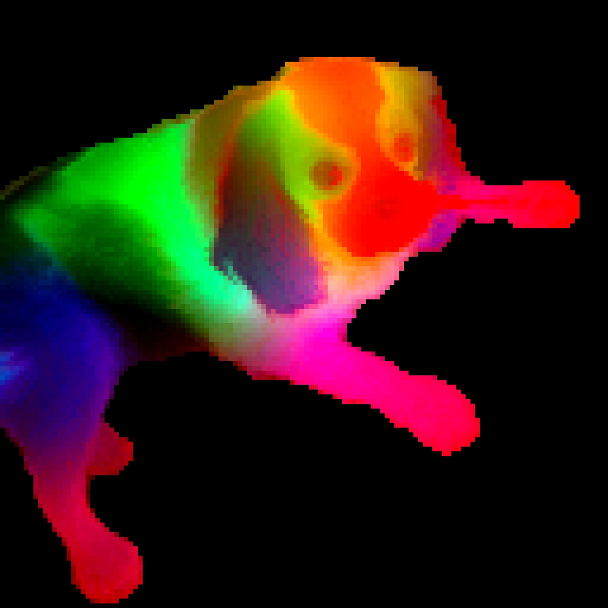

      - **What**: 不直接固定 patch features，而是约束 student patch features 的 pairwise similarity structure 接近早期 dense quality 更好的 Gram teacher。
        $$
        \mathcal{L}_{Gram}=\left\|\mathbf{X}_{S}\mathbf{X}_{S}^{\top}-\mathbf{X}_{G}\mathbf{X}_{G}^{\top}\right\|_{F}^{2}
        $$
        其中 $\mathbf{X}_S,\mathbf{X}_G\in\mathbb{R}^{P\times d}$ 是 $L_2$ normalized patch features，$P$ 为 patch 数量。

      - **Why**: 长训练后 global objective 会逐渐主导，patch-level consistency 退化；Gram loss 只锚定 patch 间相似关系，让 feature 本身仍可继续学习语义。

      - **How**: 在 refinement / high-resolution adaptation 阶段加入 Gram objective，使用早期 teacher 或 7B teacher 作为 Gram anchor，尤其用于保持高分辨率 dense feature maps 的稳定性。

    - Post-training: Resolution Scaling, Distillation, Text Alignment

      - **What**: 预训练后进行 high-resolution adaptation（global crops 512/768，local crops 112/168/224/336）、multi-student distillation，以及 frozen visual encoder + text encoder 的 dino.txt alignment。
      - **Why**: 不同下游任务需要不同 resolution、模型大小和 open-vocabulary 能力；post-training 让同一 SSL backbone family 更容易部署。
      - **How**: 多学生蒸馏共享 7B teacher inference，降低 teacher 计算开销；text alignment 采用 LiT-style contrastive objective，并拼接 mean-pooled patch embeddings 与 CLS token，使 text alignment 不只依赖 global feature。

  - Pipeline:

    1. 收集并清洗大规模无标注图像数据，构造 web/natural 与 satellite 等训练集合。
    2. 用 DINO + iBOT + KoLeo 进行 large-scale SSL pre-training，训练 ViT-7B teacher。
    3. 在 refinement / high-resolution adaptation 中加入 Gram anchoring，防止 long schedule 下 dense features collapse。
    4. 将 7B teacher 蒸馏到 ViT/ConvNeXt 多尺寸学生模型，并进行 resolution adaptation。
    5. 下游使用时通常 freeze DINOv3 backbone，通过 linear probing、lightweight heads 或 dino.txt 做 segmentation、depth、detection、matching、classification 等任务。

  - Pros:

    - **Dense features 很强**：patch-level maps 在 segmentation、depth、3D correspondence、video tracking 等任务中表现突出。
    - **无需人工标签预训练**：核心视觉 backbone 由 self-supervised learning 得到，适合扩展到 metadata 稀缺的科学/遥感等领域。
    - **模型 family 完整**：从 ViT-S/B/L 到 ViT-7B、ConvNeXt 和 satellite variants，覆盖不同 deployment budgets。
    - **可作为 teacher**：RT-DETRv4 等工作可直接用 DINOv3 作为 VFM teacher 提供高质量 semantic features。

  - Cons:

    - **训练成本极高**：7B teacher、大规模数据和多阶段 post-training 对算力要求很高。
    - **工程链路复杂**：data curation、constant-schedule SSL、Gram anchoring、high-res adaptation、multi-student distillation 都需要精细实现。
    - **模型权重/使用受发布策略约束**：官方权重下载与部分 adapters 需要按 Meta 发布流程获取，不像小型开源模型那样即取即用。

### DINO-X

- __DINO-X: A Unified Vision Model for Open-World Object Detection and Understanding.__ *Tianhe Ren et al.* __arXiv, 2024__ [(Arxiv)](https://arxiv.org/abs/2411.14347)

### Grounding DINO

- __Grounding DINO: Marrying DINO with Grounded Pre-Training for Open-Set Object Detection.__ *Shilong Liu et al.* __arXiv, 2023__ [(Arxiv)](https://arxiv.org/abs/2303.05499) [(Code)](https://github.com/IDEA-Research/GroundingDINO)
  - Takeaway: open-vocabulary detection(见多模态)

## Relation

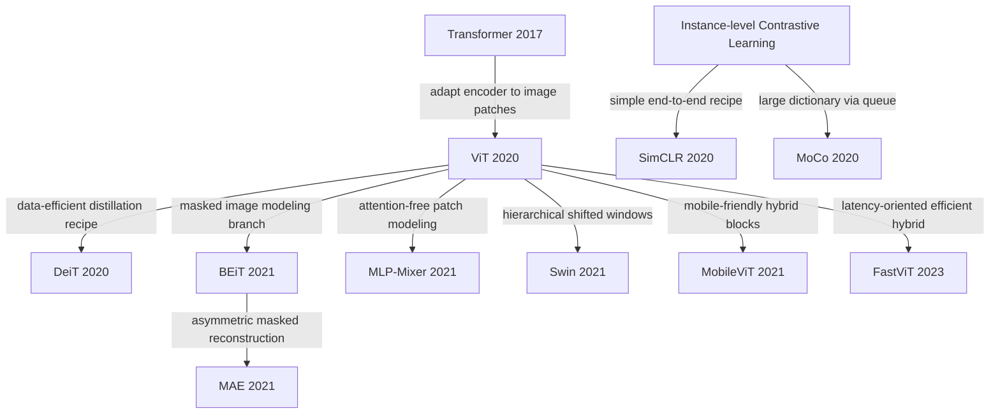

- One useful way to read this trajectory is: **Transformer -> ViT -> training recipe / masked pretraining / contrastive pretraining / architecture variants / efficient mobile hybrids**, where DeiT makes ViT more data-efficient, BEiT and MAE anchor the masked-modeling branch, SimCLR and MoCo anchor the instance-level contrastive branch, Swin strengthens dense prediction, and FastViT pushes the line toward real-device latency.
