# ViT Zoo

Focus on Vision Transformer variants and their core design trade-offs.

[TOC]

## Vit

- **An Image is Worth 16x16 Words: Transformers for Image Recognition at Scale**. Alexey Dosovitskiy et.al. **arxiv**, **2020**, ([link](https://arxiv.org/abs/2010.11929)). ([My PDF](https://drive.google.com/file/d/1bosN8AC80PN7-CLeX2Ay0Pj1i_Lsyp_u/view?usp=drivesdk))

  - Takeaway: ViT directly splits an image into fixed-size patches, turns them into a token sequence, and applies a vanilla Transformer encoder for image classification. 顾名思义，一个image batch = 1 token

    > [!TIP]
    >
    > transformer 开始正式杀入 CV(虽然只做了一个简单的分类), 而且几乎没有引入 CV-specialized inductive bias。给CV挖了一个大坑
    >
    > 打破了nlp和CV模型不一致的问题，又给多模态挖了一个大坑

  - Motivation: CNN 的局部归纳偏置很强(平移不变性, 局部性)，而transformers没有这些归纳偏置（先验知识），但有scale-law
  
    为什么之前transformer没有用到CV，到底有什么难处？
    
  1. 需要把图片这个2d转换为1d的序列输入encoder
    2. 计算复杂度是$O(n^2)$，如果直接像素输入序列太长计算复杂度会爆炸
  
  - Core Mechanism:
  
    
  
    将图片分为fixed-size patches，然后展平+pos embedding，送进encoder。为了做分类任务，加上了一个extra learnable “classification token” to the sequence
    
    这里的`*`就是对应的可学习的分类token（小白纸），位置始终在0,它可以和所有patch交互，因此最后分类直接看这一个的输出就可以了
    
    - Patchify + linear projection
  
      把输入图像切成固定大小的 patch, 每个 patch flatten 后映射到同一维度的 token embedding。然后拼接一个可学习的 `[CLS]` token(初始为0), 再加位置编码:
  
      $$
      z_0 = [x_{\mathrm{cls}}; x_p^1E; x_p^2E; \dots; x_p^NE] + E_{\mathrm{pos}}
      $$
    
      这里 $N=HW/P^2$, 表示 patch 数量; $E$ 是 patch projection matrix。这样图像就被改写成标准 Transformer 可处理的 token sequence。
  
      > [!NOTE]
      >
      > 输入224\*224的图片，每个patch为16\*16，那么有14\*14=196个序列长度(BERT256)就变为可以接受的了
    
  - Pipeline:
  
    1. Input image 切成 $P\times P$ patches.
  
       这里用224\*224举例，分为16\*16的patch，因此序列长度为14\*14=196
  
    2. Flatten each patch and linearly project to token embeddings.
  
       每个patch的维度是16\*16\*3=768，这个linearly project就是一个fc(768\*768(d_model，后面这个768是可以改变的，取决于你模型想要做多大))
  
    3. Prepend `[CLS]` token and add positional embeddings.
  
       得到197\*768
  
    4. Feed the full sequence into Transformer encoder layers.
  
    5. Use the final `[CLS]` representation for classification.
  
  - Cons
  
    - data-hungry.
    - 平方计算复杂度
    - Plain single-scale design is not ideal for dense prediction.

## DeiT

- **Training data-efficient image transformers & distillation through attention**. Hugo Touvron et.al. **ICML**, **2021** [(PMLR)](https://proceedings.mlr.press/v139/touvron21a.html) [(Arxiv)](https://arxiv.org/abs/2012.12877) [(Code)](https://github.com/facebookresearch/deit) (Citations __8600+__)

  - Takeaway: 训练tricks + transformer-specific distillation token，data-efficient

  - Core Mechanism:

    - **Data-efficient ViT training recipe**

      AdamW+strong data augmentation(RandAugment、Mixup、CutMix、Random Erasing、Stochastic Depth、Repeated Augmentation)+Label Smoothing，以及高分辨率 fine-tuning 时的位置编码插值。

    - **distillation**

      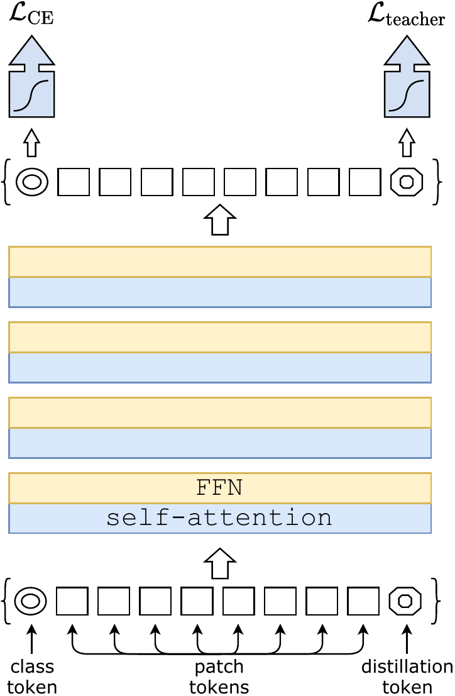

      DeiT 的 distillation token(类似cls token，学习teacher hard label) 和 `[CLS]` token 一起进入 Transformer，通过 self-attention 与 patch tokens 交互；输出端分别接 class head 和 distillation head。 最后默认使用 late fusion，把两个 head 的 softmax 输出相加得到最终 prediction
      
      DeiT 发现对 Transformer 来说，hard label distillation 比soft更有效

## Swin Transformer

- **Swin Transformer: Hierarchical Vision Transformer using Shifted Windows**. Ze Liu et.al. **arxiv**, **2021**, ([link](https://arxiv.org/abs/2103.14030))([My PDF](https://drive.google.com/file/d/1ITHMu_BCEdOAe-d2UTodE8FjAdfbX44L/view?usp=drivesdk)) ICCV 21最佳论文

  - Takeaway: 用window-based local attention + shifted windows 来替 global attention with, 并且搭建一个hierarchical backbone. 有线性计算复杂度。效果屠榜

  - Motivation: 希望transformer也能用在除了分类外的其他视觉任务（高分辨率输入+ dense prediction）。

    需要 efficiency + multi-scale
  
  - Core Mechanism:
  
    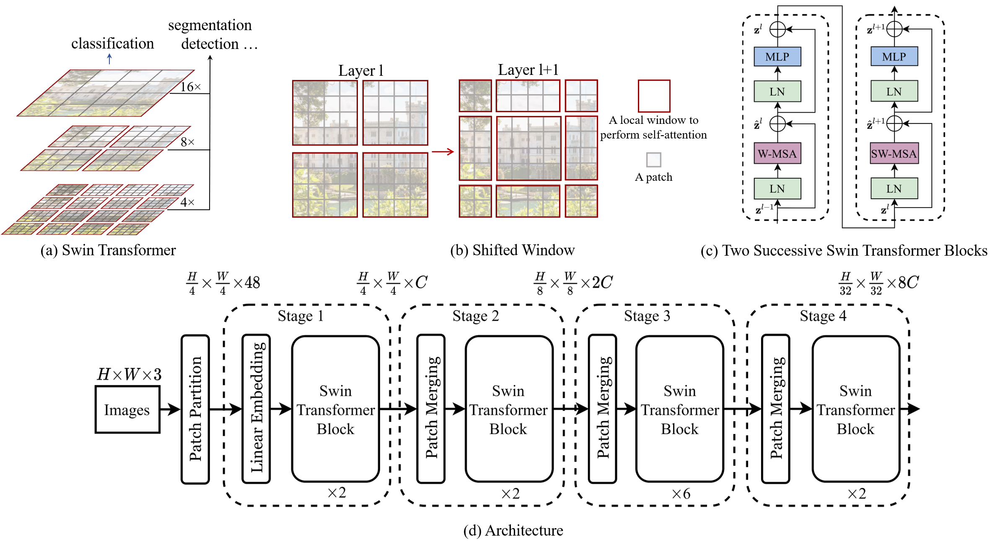
  
    - Hierarchical backbone：逐 stage 下采样，增加channel
    
    - patch partition: 把image分为patches(4\*4\*3)作为1个token
    
    - patch merging：把相邻的 patch token 合并，从而降低空间分辨率，同时增加通道数
  
      $2\times2$ token取出来concat，然后LayerNorm 和 Linear 层，把通道数从 $4C$ 降到 $2C$
  
    - Window-based self-attention
  
      self-attention 不在整张图上做，而是在每个 non-overlapping local window 内做。这样复杂度从全局 attention 的 quadratic cost 降到对图像大小近似线性:
    
      $$
      \Omega(\mathrm{\text{}MSA}) = 4hwC^2 + 2(hw)^2C \\
      \Omega(\mathrm{W\text{-}MSA}) = 4hwC^2 + 2M^2hwC
      $$
  
      其中 $h,w$ 是 feature map spatial size, $C$ 是通道维度, $M$ 是 window size。关键点在于第二项不再是 $(hw)^2$ 级别。
  
    - Shifted window connection
    
      > [!TIP]
      >
      > MSA(Multi-head Self-Attention), W-MSA(Window-based Multi-head Self-Attention),SW-MSA(shifted)
      
      如果一直使用固定窗口，不同窗口之间无法通信。Swin 采用交替的 W-MSA / SW-MSA: 一层按常规窗口分块，下一层把窗口平移半个 window size，让跨窗口的信息通过 attention 自然传播。
      
      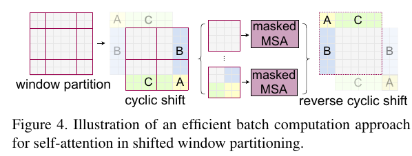
      
      > [!NOTE]
      >
      > 为了不让shift window之后进行九个格子的attention，这里将ABC拼接到下面来，然后还是正常计算attention，但是因为除了左上格子，其他格子的东西是拼接的，不应该进行attention，因此通过掩码来实现，最后再拼接回去
      >
      > 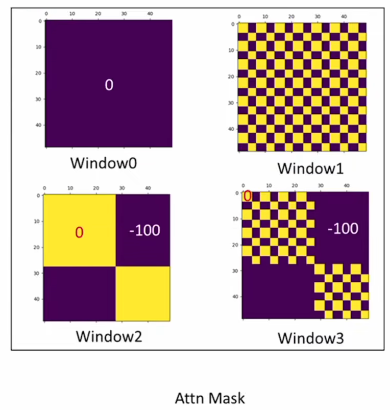
    
  - Pros: Linear-complexity attention + multi-scale，效果很好
  
  - Cons
  
    - Long-range interaction is weaker than full global attention in a single layer.
    - CV先验更多

### MLP-Mixer

- **MLP-Mixer: An all-MLP Architecture for Vision**. Ilya Tolstikhin et.al. **arxiv**, **2021**, ([Arxiv](https://arxiv.org/abs/2105.01601)).

  - Takeaway: a stack of mixing MLPs效果也很好。想要说明Transformer的成功来自整个网络架构而不是attention

  - Core Mechanism:

    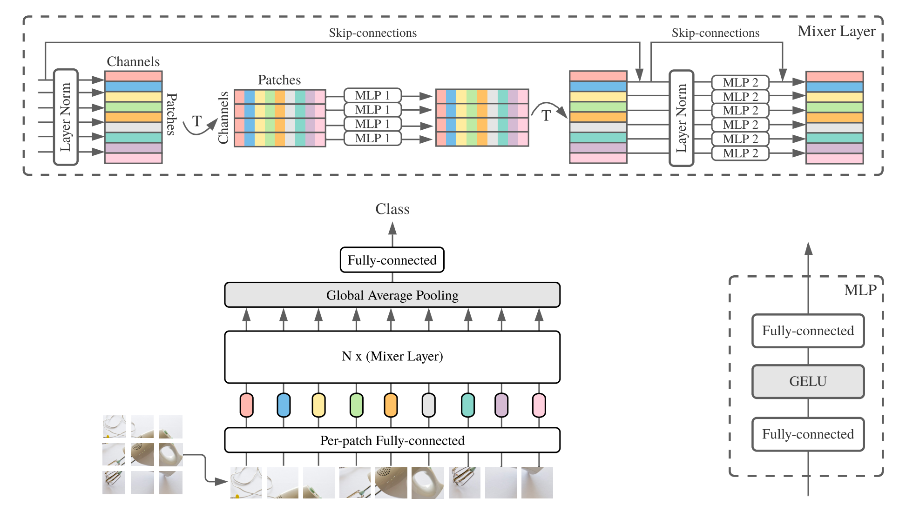

    - Token-mixing MLP

      输入张量可记为 $X\in\mathbb{R}^{S\times C}$, 其中 $S$ 是 patch/token 数量，$C$ 是 channel 维度。token-mixing MLP 固定每个 channel，沿 token 维做混合，让不同 patch 之间交换空间信息:

      $$
      U_{*,i} = X_{*,i} + W_2\sigma(W_1\,\mathrm{LN}(X)_{*,i})
      $$

      这里的 MLP 是在 token 维度上工作的，因此本质上在做 spatial mixing。

    - Channel-mixing MLP

      然后固定每个 token，沿 channel 维再做一次标准 MLP:

      $$
      Y_{j,*} = U_{j,*} + W_4\sigma(W_3\,\mathrm{LN}(U)_{j,*})
      $$

      这样两个 MLP 一个负责跨 patch 交流，一个负责单 patch 内的特征变换，组合起来替代 conv 和 attention。

  - Experiment

    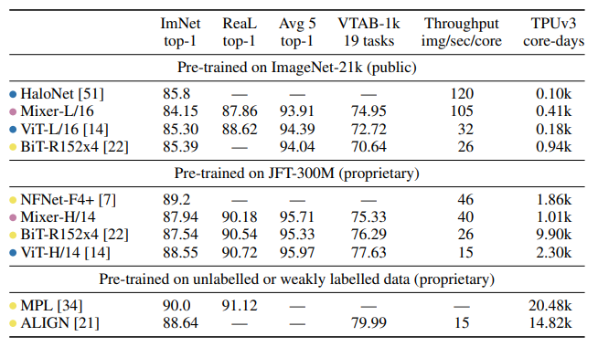

  - Cons: mainly strong on classification

### MetaFormer

- __MetaFormer is Actually What You Need for Vision.__ *Weihao Yu et al.* __CVPR Oral__, __2022__ [(Arxiv)](https://arxiv.org/abs/2111.11418) [(S2)](https://www.semanticscholar.org/paper/57150ca7d793d6f784cf82da1c349edf7beb6bc2) [(Code)](https://github.com/sail-sg/poolformer) (Citations __1334__)

  - Takeaway: 好的性能来自一套更 general 的 block architecture

  - Core Mechanism:

    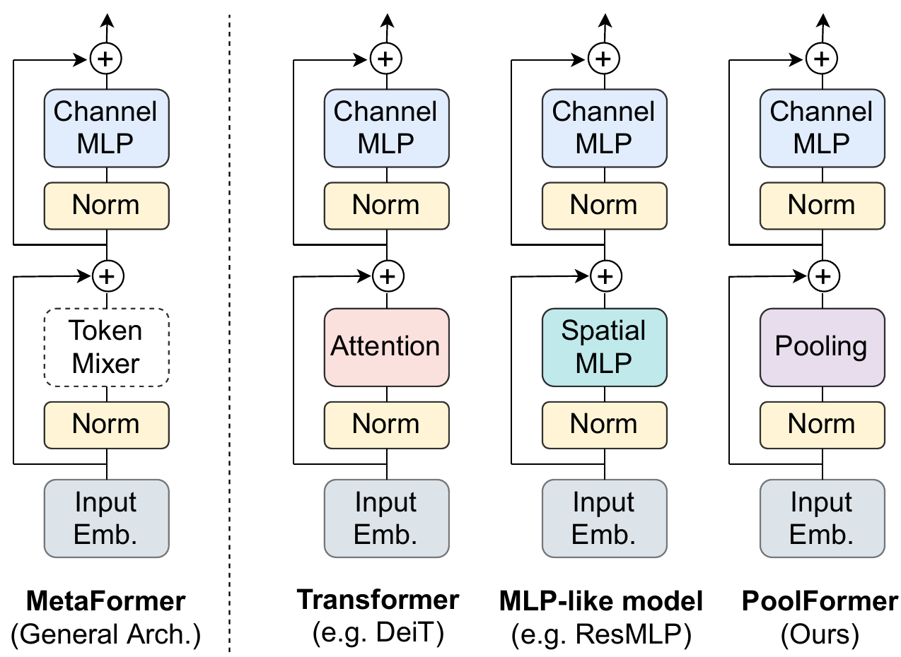

    MetaFormer 把 Transformer 抽象成不指定 token mixer 的通用架构；attention、spatial MLP、pooling 都只是这个架构下的不同 mixer 实例

    - 用pooling构造了一个poolformer来验证，效果很好

    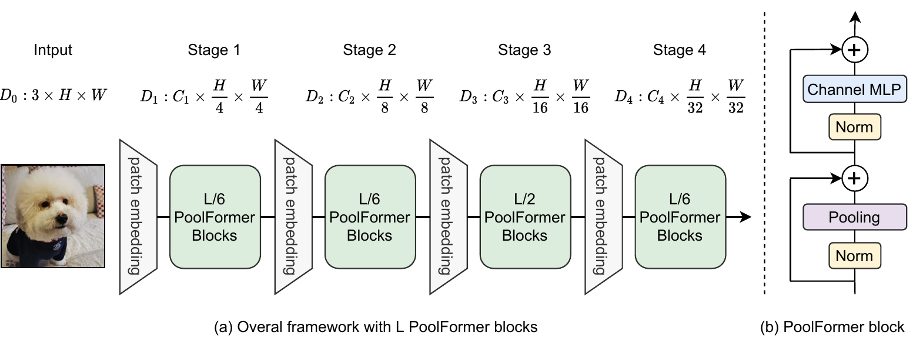
  

### FastVit

- __FastViT: A Fast Hybrid Vision Transformer using Structural Reparameterization.__ *Pavan Kumar Anasosalu Vasu et al.* __arXiv, 2023, ICCV 2023__ [(Arxiv)](https://arxiv.org/abs/2303.14189) 

  - Takeaway: Mobileone + attention in CV. realtime

  - Core Mechanism

    

    FastViT 是一个 hybrid vision transformer，四个 stage。前 3 个 stage 主要用 RepMixer 来做 token mixing，第 4 个 stage 才使用 self-attention

    每个stage分辨率减半，通道数加倍

    - RepMixer: 这次将残差连接也进行了re-parameterize

      将原本的操作：$Y = \text{BN}(\sigma(\text{DWConv}(X))) + X$，去除非线性，并重新排列，改为
      $$
      Y = \text{DWConv}(\text{BN}(X)) + X \\
      inference: \quad Y = \text{DWConv}(X)
      $$

## IGPT

- 

## BEiT

- **BEiT: BERT Pre-Training of Image Transformers**. Hangbo Bao et.al. **arxiv**, **2021**, ([Arxiv](https://arxiv.org/abs/2106.08254)) ([OpenReview](https://openreview.net/forum?id=p-BhZSz59o4)).

  - Takeaway: 像 BERT 一样通过 masked modeling 做自监督预训练

    BEiT: **B**idirectional **E**ncoder representation from **I**mage **T**ransformers

  - Motivation: 

    难点在于 image patch 不像 word token 那样天然离散，所以不能直接照搬 MLM。

  - Core Mechanism:

    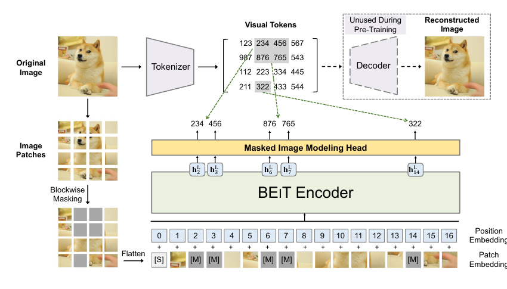
  
    输入给 ViT 的是被 mask 的 patch sequence，而监督信号来自一个 pretrained tokenizer 产生的 discrete visual tokens。

    - Discrete visual tokens as targets
  
      BEiT 先用一个预训练好的 image tokenizer（论文中使用discrete VAE,frozen）把图像转换成离散 visual tokens。这样每个 patch 都有一个类似“视觉词表 id”的目标标签，masked image modeling 就被转化成 masked token classification。监督训练vit encoder
      $$
      \mathcal{L}_{\mathrm{MIM}} = - \sum_{i \in \mathcal{M}} \log p_\theta(z_i \mid x^{\mathrm{masked}})
      $$
  
      其中 $\mathcal{M}$ 是被 mask 的 patch 位置，$z_i$ 是 tokenizer 给出的离散 visual token。
  
      key：预测目标不是 pixel value，而是离散语义 token，因此任务更像 BERT 的 masked token recovery。
  
  - Pros: 引领 MIM(masked image modeling) 可以成为 ViT 的有效自监督预训练范式。
  
  - Cons: 依赖额外的 tokenizer（例如 dVAE）
  

## MAE

- **Masked Autoencoders Are Scalable Vision Learners**. Kaiming He et.al. **arxiv**, **2021**, ([Arxiv](https://arxiv.org/abs/2111.06377)). ([My PDF](https://drive.google.com/file/d/1o2CegIX6zjekBU0JEa4G2zy59Bn4SZlI/view?usp=drivesdk))

  - Takeaway: heavy random masking + an asymmetric encoder-decoder将图像reconstruction变为scalable自监督预训练方法. 

    > 所以这篇论文名就完整介绍了内容
    
    > [!note]
    >
    > 这里我们理解一下什么是auto，为什么这里叫autoencoder: auto自，是指输入和输出的东西是一样的，所以nlp中输入输出都是一些words因此叫做autoregression
    
  - Core Mechanism:

    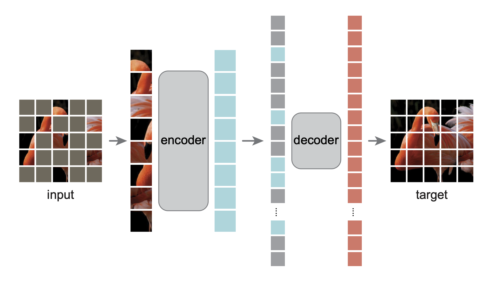

    MAEencoder观察部分的数据，decoder重构完整的信号。
  
    - High masking ratio
  
      MAE 直接随机 mask 掉约 75% patches。这个比例非常高，使得重建任务不再是 low-level copy，而更像是逼模型去理解全局语义和结构。
  
    - Asymmetric encoder-decoder
  
      encoder 只处理 visible patches, 不输入 mask token；decoder 再把 latent 表示和 mask tokens 拼起来做重建。这样 encoder 的计算量明显下降
  
      - encoder: patch token+pos_embed->random mask。 只处理 visible patches。dim=768。cls token初始全0,pos_embed不学习
      - decoder: unshuffle->输入完整的patch，被mask掉的patch会用一个mask_token+pos_embed。dim=512
        - 其中的cls沿用encoder的cls token输出，但是最后不进行loss计算，没啥用。
        - MAE 的 mask token 是一个全局可学习参数，不是每张图重新初始化
  
      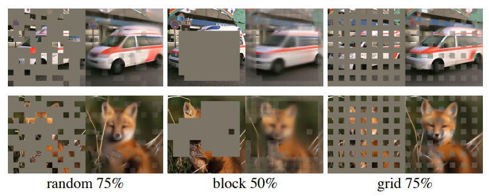
  
      Asymmetric非对称体现在：输入不同，维度也不同，因此中间会有一层linear layer对齐
  
    - Pretrain with reconstruction loss(mse on masked patch)
  
      下游任务只用encoder，微调的时候可以将pos_embed改为可学习的
  
  - Pros: 
  
    - simple, scales well to large ViT backbones and transfers strongly.

## DINO

### DINOv1

> 下面介绍的DINO是meta的dino

- __Emerging Properties in Self-Supervised Vision Transformers.__ *Mathilde Caron et al.(meta FAIR)* __ICCV, 2021__ [(Arxiv)](https://arxiv.org/abs/2104.14294) [(Code)](https://github.com/facebookresearch/dino)

  - Takeaway: DINOv1 就是BYOL+Vit。 check 对比学习, ViT 在自监督训练下能学出语义区域和 object boundary

### iBOT

- **iBOT: Image BERT Pre-Training with Online Tokenizer**. Jinghao Zhou et.al Bytedance. **ICLR**, **2022**, [(Arxiv)](https://arxiv.org/abs/2111.07832) [(Code)](https://github.com/bytedance/ibot).

  - Takeaway: DINO 的 image-level representation + BEiT-style MIM 的 patch-level pretraining

  - Core Mechanism:

    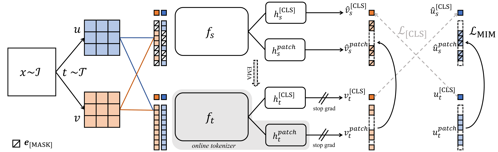

    iBOT 的 teacher 干两个活

    1. like DINO 提供 `[CLS]` token 的 self-distillation target

    2. 作为 online tokenizer，为 student 的 masked patch tokens 提供 patch-level target distribution。
       $$
       \mathcal{L}_{\mathrm{MIM}}
       =
       -\sum_{i=1}^{N}m_i\cdot
       P_{\theta'}^{\mathrm{patch}}(u_i)^{T}
       \log P_{\theta}^{\mathrm{patch}}(\hat{u}_i)
       $$
  
       其中 $\hat{u}$ 是 masked view，$m_i=1$ 表示第 $i$ 个 patch 被 mask
  
    - shared projection head. iBOT 让 `[CLS]` token 和 patch tokens 共用 projection head
  
  - Pros: end to end
  

### DINOv2

- __DINOv2: Learning Robust Visual Features without Supervision.__ *Maxime Oquab et al.* __arXiv, 2023__ [(Arxiv)](https://arxiv.org/abs/2304.07193) [(Code)](https://github.com/facebookresearch/dinov2) (Citations __3100+__)

  - Takeaway: 把 DINO 和 iBOT 这些方法真正 scale 到 foundation model 级别。

  - Core Mechanism:

    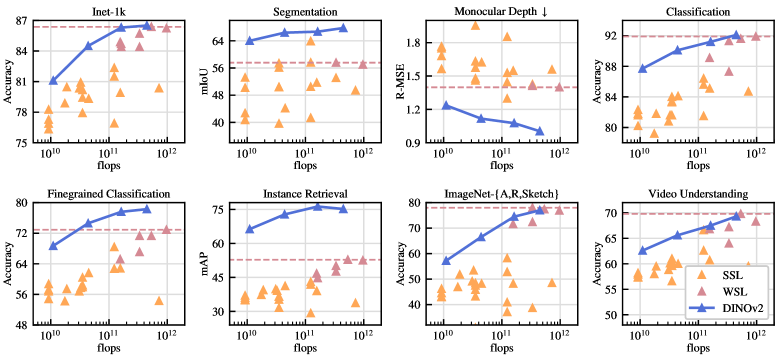

    DINOv2 的核心 recipe ：**curated data + combined SSL objectives + efficient large-scale training + distillation**。

    - Automatic Data Curation Pipeline → LVD-142M

      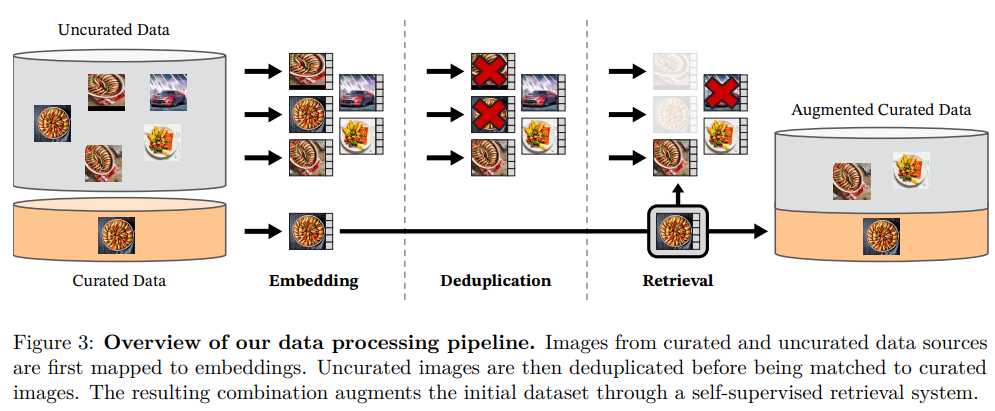

      不依赖任何 metadata/text/预训练模型，纯靠图像视觉相似性从 1.2B uncurrated web images 中检索与 curated datasets 相似的图像，构建出 142M 的 LVD-142M 数据集。Pipeline 流程：embedding → deduplication → retrieval → clustering-based rebalancing。
      
    - Combined Discriminative SSL Objectives
    
      由三个 loss 组成：
      $$
      \mathcal{L}_{Pre} = \mathcal{L}_{DINO} + \mathcal{L}_{iBOT} + 0.1\mathcal{L}_{KoLeo}
      $$
      其中：
    
      - $\mathcal{L}_{DINO}$：image-level cross-entropy，student/teacher 的 `[CLS]` token 之间做 prototype matching，负责全局语义。
      - $\mathcal{L}_{iBOT}$：patch-level cross-entropy，student 的 masked patch tokens 预测 teacher 对应位置的 patch tokens，负责局部结构/dense features。(只包含MIM部分，其实写$L_{BEiT}$更好)
      - $\mathcal{L}_{KoLeo}$：Kozachenko-Leonenko differential entropy estimator，鼓励 batch 内特征均匀分布（feature spread），防止 collapse。
  
      使用 student-teacher 框架，teacher 通过 EMA 更新。采用 Sinkhorn-Knopp centering（来自 SwAV）替代原 DINO/iBOT 的 softmax centering。
    
      **Untying heads**：与 iBOT 原论文不同，DINOv2 发现 scale up 后独立 head更好
  
    - many engineer tricks

    - Model Distillation & High-Resolution Adaptation

      先训练一个 ViT-g（1.1B params）teacher，再蒸馏出 ViT-S/B/L 等小模型。预训练最后阶段进行 short high-resolution adaptation（将分辨率从 224 提升到 518），增强 pixel-level dense features。
    
  - Pros: foundation model
  

### Vision Transformers Need Registers

- __Vision Transformers Need Registers.__ *Timothée Darcet et al.* __arXiv, 2023__ [(Arxiv)](https://arxiv.org/abs/2309.16588) 

  - Takeaway: 用register token解决high-norm token problem

  - Prior: high-norm token 是什么

    在 ViT 中，图像被切成 patch。每个 patch 经过 Transformer 后，会得到一个 token feature：$h_i \in \mathbb{R}^{D}$，这个 token 的 norm 通常指它的 L2 范数：$\|h_i\|_2$

    如果某些 patch token 的 norm 远远大于其他 token，就叫 **high-norm token** 或 **outlier token**

  - Motivation:

    DINOv2 等大 ViT 中一些背景区域的 patch token 具有异常大的 feature norm

    - Insight: ViT 发现有些背景 patch 对识别图像内容没那么重要，于是把它们当成“临时草稿纸”使用，不再表达patch feature而是内部计算的token
    - Cons: 污染dense feature map/attention map

  - Core Mechanism

    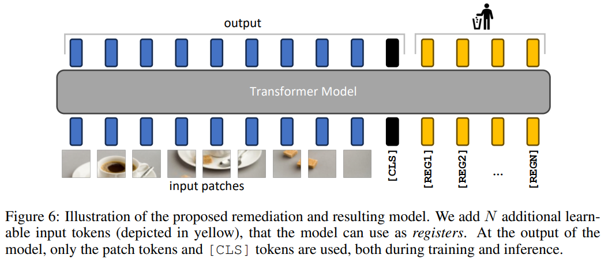

    register token 是一些额外加入 ViT 输入序列的 learnable tokens。

    原本 ViT 输入是：
    $$
    [\text{CLS}, x_1, x_2, \dots, x_N]
    $$
    加 register token 后变成：
    $$
    [\text{CLS}, r_1, r_2, \dots, r_M, x_1, x_2, \dots, x_N]
    $$
    $r_1, r_2, \dots, r_M$就是 register tokens，给模型提供专门的内部计算空间。

### DINOv2 with registers

### DINOv3

- __DINOv3.__ *Oriane Siméoni et al.* __arXiv, 2025__ [(Arxiv)](https://arxiv.org/abs/2508.10104) [(Code)](https://github.com/facebookresearch/dinov3) ([My PDF](https://drive.google.com/file/d/18FfKn4mDpbYVsJkSdcWxSX3wJPrxkE56/view?usp=drivesdk)) 技术报告

  - Takeaway: continue to scale up and fix problems(Gram anchoring)

  - Motivation: scale up`s problems：

    1. 训练 horizon(训练iter) 难以预设

       训练越久，global task 可能继续变好，但 dense task 可能变差

    2. dense patch feature maps 会逐渐退化

  - Core Mechanism:

  - train recipe: curated large-scale data + RoPE + RoPE-box jittering + constant LR/weight decay/teacher EMA momentum(避免必须提前知道训练总时长)，仍需warmup
  
  - Gram Anchoring for Dense Features
  
    用早期 dense feature 更好的模型作为 Gram teacher，让后续模型保持 patch 之间的相似性结构
  
    $$
      \mathcal{L}_{Gram}=\left\|\mathbf{X}_{S}\mathbf{X}_{S}^{\top}-\mathbf{X}_{G}\mathbf{X}_{G}^{\top}\right\|_{F}^{2}
    $$
      其中 $\mathbf{X}_S,\mathbf{X}_G\in\mathbb{R}^{P\times d}$ 是 $L_2$ normalized patch features，$P$ 为 patch 数量
    
    - Post-training: Resolution Scaling, Distillation, Text Alignment
  
      预训练后进行 high-resolution adaptation（global crops 512/768，local crops 112/168/224/336）、multi-student distillation，以及 frozen visual encoder + text encoder 的 dino.txt alignment。
  
  - Pros: Dense features 很强

### DINO-X

- __DINO-X: A Unified Vision Model for Open-World Object Detection and Understanding.__ *Tianhe Ren et al.* __arXiv, 2024__ [(Arxiv)](https://arxiv.org/abs/2411.14347)

### Grounding DINO

- __Grounding DINO: Marrying DINO with Grounded Pre-Training for Open-Set Object Detection.__ *Shilong Liu et al.* __arXiv, 2023__ [(Arxiv)](https://arxiv.org/abs/2303.05499) [(Code)](https://github.com/IDEA-Research/GroundingDINO)
  - Takeaway: open-vocabulary detection(见多模态)

## Relation

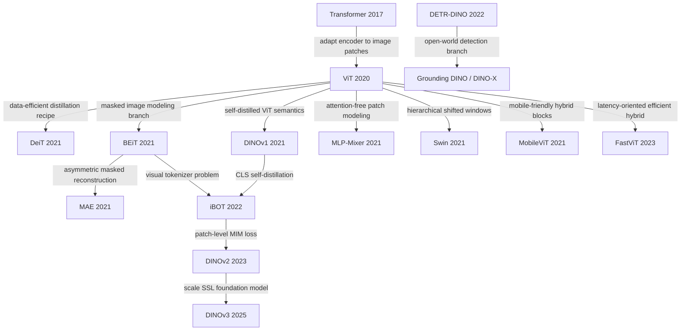
