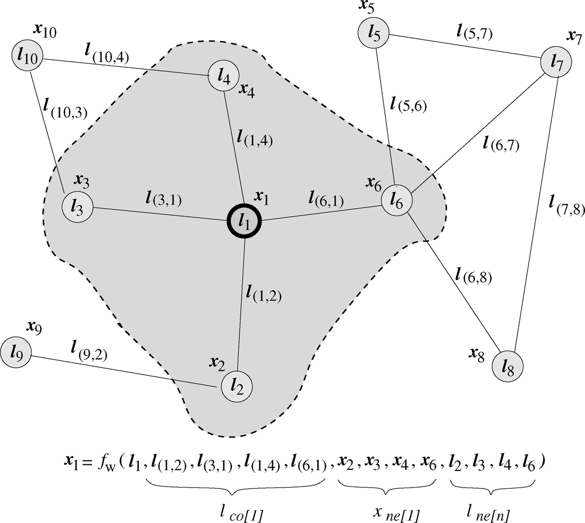
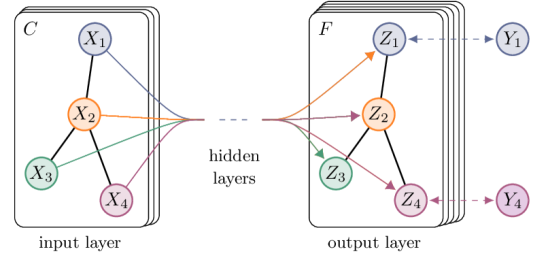

# GN Zoo

Focus on Graph Neural Network variants and their core message-passing / graph-convolution design trade-offs.

[TOC]

## GNN

- **The Graph Neural Network Model**. Franco Scarselli et.al. **IEEE Transactions on Neural Networks**, **2009**, ([link](https://doi.org/10.1109/TNN.2008.2005605)).

  - Takeaway: 早期 GNN 把一个样本域直接表示成 graph, 让每个 node 通过邻居、边和自身 label 递归更新 hidden state, 最后在 fixed point 上做 node / graph prediction。它的关键意义是把神经网络从 Euclidean data 推到 arbitrary graph, 但训练依赖 contraction mapping, 因而表达和优化都偏受限。

  - Motivation: 很多数据天然是 relational domain, 例如网页链接、分子结构、图像中的对象关系等。传统方法通常先把 graph 压成固定长度向量，再交给 MLP / SVM, 这会丢掉结构信息；GNN 的目标是直接把整张 graph 作为输入，让预测可以利用 node feature、edge relation 和全局 graph context。

  - Core Mechanism:

    

    - State transition function

      每个 node $n$ 维护一个 hidden state $x_n$, 用共享的 transition function $f_w$ 从自身 label、相邻边 label、邻居 hidden states 和邻居 label 中更新：

      $$
      x_n = f_w(l_n, l_{co[n]}, x_{ne[n]}, l_{ne[n]})
      $$

      这里 $ne[n]$ 表示 node $n$ 的邻居集合，$co[n]$ 表示 incident edges。直观上，这就是最早的 **message passing**: 每个点不断接收邻居状态并更新自己。

    - Fixed-point representation

      把所有 node states 拼起来，整张图的更新可以写成：

      $$
      x = F_w(x, l), \qquad o = G_w(x, l_N)
      $$

      $F_w$ 反复迭代直到收敛，$G_w$ 再根据最终 node state 产生输出 $o$。这让 GNN 能处理任意大小和拓扑的 graph, 因为参数共享在局部 transition function 中。

    - Contraction constraint

      为了保证 fixed point 存在且可通过迭代求出，原始 GNN 要求 $F_w$ 是 contraction map:

      $$
      \|F_w(x,l)-F_w(y,l)\| \le \mu \|x-y\|,\quad 0 \le \mu < 1
      $$

      这个条件保证 Banach fixed-point convergence, 但也限制了模型设计：transition function 不能随意变强，否则可能不收敛或训练困难。

  - Pipeline:

    1. 将样本表示为 graph: nodes / edges 带有 label 或 feature.
    2. 初始化每个 node 的 hidden state $x_n$.
    3. 反复应用共享的 $f_w$ 聚合邻居信息并更新 node state, 直到达到 fixed point.
    4. 用 output function $g_w$ 或 $G_w$ 从 node states 产生 node-level / graph-level prediction.
    5. 通过监督目标训练 $f_w, g_w$, 同时约束 transition dynamics 保持收敛。

  - Pros

    - 直接面向 arbitrary graph, 不需要先手工压成固定向量。
    - 很早就明确了 node state + neighbor aggregation + shared parameters 的核心范式。
    - 理论上讨论了 graph function approximation 和 fixed-point convergence。

  - Cons

    - 依赖 fixed-point 迭代，训练和推理都比后来的 layer-wise GNN 更重。
    - contraction constraint 限制模型表达能力，也让实现复杂。
    - 早期形式不如现代 message passing GNN / GCN 那样容易堆叠、并行和迁移。

## GCN

- **Semi-Supervised Classification with Graph Convolutional Networks**. Thomas N. Kipf et.al. **ICLR**, **2017**, ([link](https://arxiv.org/abs/1609.02907)). ([OpenReview](https://openreview.net/forum?id=SJU4ayYgl)) ([Code](https://github.com/tkipf/gcn))

  - Takeaway: GCN 用 spectral graph convolution 的一阶局部近似，得到一个极简的 layer-wise propagation rule: normalized adjacency 做邻居聚合，线性层做特征变换。它把 graph semi-supervised node classification 做成了可端到端训练、复杂度近似随 edges 线性增长的深度模型。

  - Motivation: 传统 graph-based semi-supervised learning 往往依赖固定的平滑正则或图核方法，难以同时学习 node feature 与 graph structure。Spectral CNN on graphs 理论上优雅，但需要 graph Laplacian eigen-decomposition, 对大图代价高；GCN 希望保留局部 graph convolution 的思想，同时把计算简化到可扩展的 message passing。

  - Core Mechanism:

    

    - Renormalized neighbor aggregation

      GCN 先给 adjacency 加 self-loop, 再做 symmetric normalization:

      $$
      \tilde{A}=A+I_N,\qquad \tilde{D}_{ii}=\sum_j \tilde{A}_{ij}
      $$

      加 self-loop 是为了让 node 保留自身特征；归一化是为了避免高 degree nodes 的 feature scale 过大。最终一层 GCN 写成：

      $$
      H^{(l+1)} =
      \sigma\!\left(
      \tilde{D}^{-\frac12}\tilde{A}\tilde{D}^{-\frac12}
      H^{(l)}W^{(l)}
      \right)
      $$

      其中 $H^{(0)}=X$, $W^{(l)}$ 是可学习参数。可以理解为：先把邻居和自己的 feature 做 normalized average / smoothing, 再做 learnable linear transform 和 non-linearity。

    - First-order spectral approximation

      论文从 spectral graph convolution 出发，把 Chebyshev polynomial filter 截断到一阶，再用 renormalization trick 稳定训练。这样避免显式特征分解，也让每层只聚合 1-hop neighborhood; 堆叠 $L$ 层后，每个 node 可以看到 $L$-hop context。

    - Semi-supervised node classifier

      对 citation network 这类只有少量 labeled nodes 的任务，GCN 使用两层模型：

      $$
      Z=f(X,A)=
      \mathrm{softmax}\!\left(
      \hat{A}\,\mathrm{ReLU}(\hat{A}XW^{(0)})W^{(1)}
      \right)
      $$

      其中 $\hat{A}=\tilde{D}^{-\frac12}\tilde{A}\tilde{D}^{-\frac12}$。Loss 只在 labeled nodes 上计算 cross entropy, 但 message passing 会让 unlabeled graph structure 参与 representation learning。

  - Pipeline:

    1. Input: node feature matrix $X$ 和 graph adjacency matrix $A$.
    2. 对 $A$ 加 self-loop 得到 $\tilde{A}$, 并计算 normalized adjacency $\hat{A}$.
    3. 每层执行 $\hat{A}H^{(l)}W^{(l)}$，完成邻居聚合 + feature transform.
    4. 两层 GCN 输出每个 node 的 class probability $Z$.
    5. 只对 labeled node subset 计算 supervised cross-entropy, 反向传播更新所有层参数。

  - Pros

    - 结构极简，核心公式就是 normalized adjacency + linear transform。
    - 复杂度随 graph edges 近似线性，适合 sparse citation / knowledge graph。
    - 同时利用 node features 与 graph topology, 在少标签 node classification 中很有效。

  - Cons

    - 每层主要聚合 1-hop，长程依赖需要堆叠层数，但深层容易 over-smoothing。
    - 原始 GCN 假设固定 graph 上的 transductive learning, 对动态图或 inductive generalization 支持有限。
    - Normalized averaging 会弱化边类型、方向和复杂关系，需要后续 GAT / R-GCN / GraphSAGE 等扩展。
