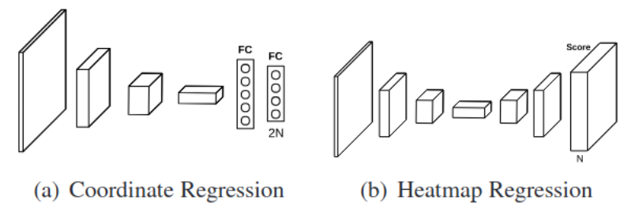
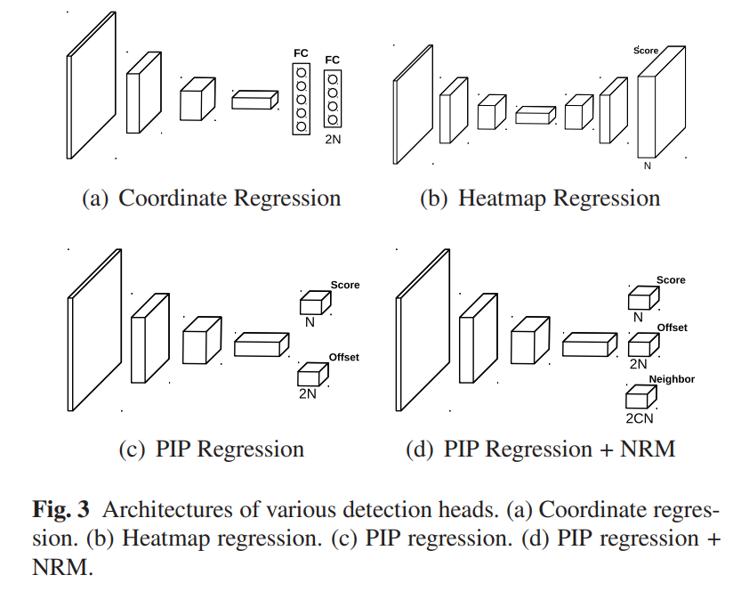
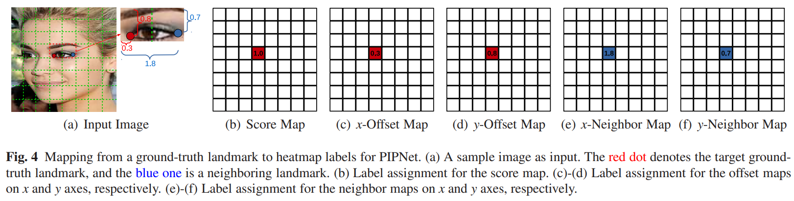
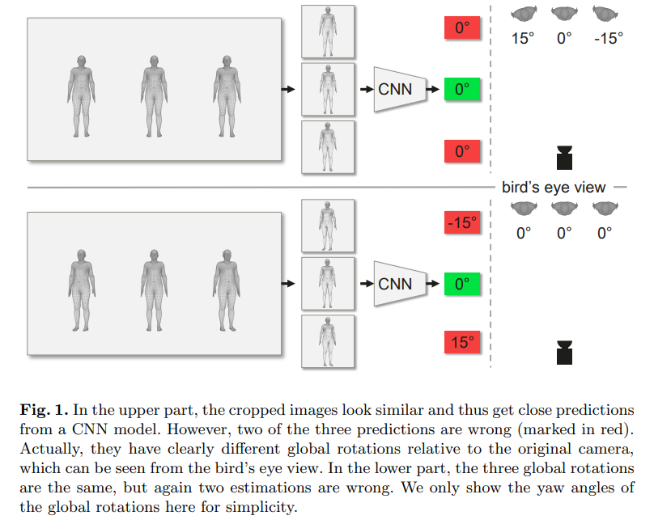
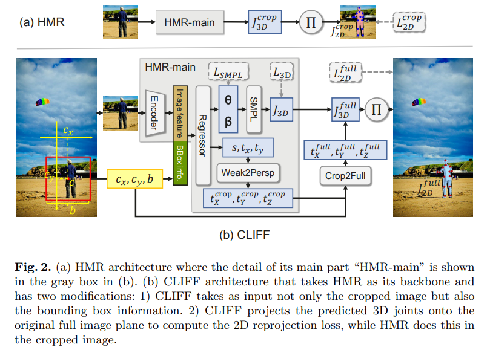
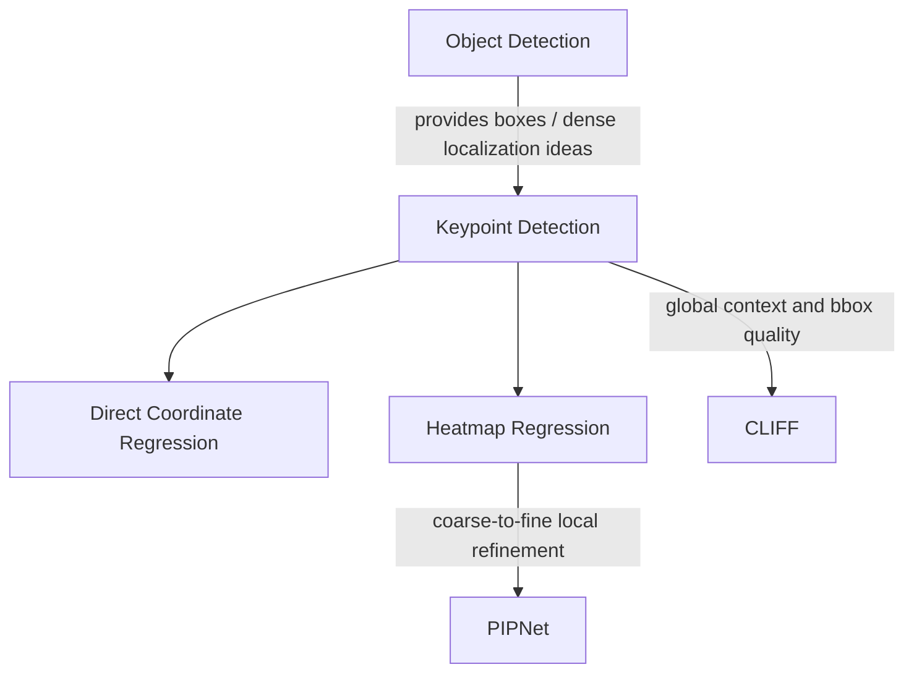

# Keypoint Detection

## Intro

Keypoint Detection 预测 facial landmarks、human pose joints 等结构化点。它和 Object Detection 相关，因为二者都需要 localization、dense prediction，以及 confidence / geometry consistency。

## Papers

在介绍新方法之前，先介绍一些主流的关键点检测方法（主要是两种）

> 假设有10个关键点

- Direct Coordinate Regression(直接坐标回归)

  backbone输出特征图后,经过展平或者全局平均池化,然后经过全连接层直接输出每个关键点的坐标(x,y),也就是网络输出长度为 2 × N = 20的一维向量,包含了每一个关键点的坐标:$(x_1,y_1,...x_{10},y_{10})$

  - Pros: 快，利用全局信息特征
  - Cons: 精度低，

- Heatmap Regression:即生成一个高斯热力图,取响应最大的位置

  backbone输出特征图之后,再经过一系列的反卷积,双线性插值等方式把特征图还原回输入图片分辨率大小。通常恢复到原图尺寸的1/4,这里以h,w 表示原图尺寸的1/4

  最终输出 10 × h × w 的热力图,每一个通道代表一个关键点

  - 训练的时候,真实关键点的坐标附近的高斯区域的数值都为1递减至0,然后计算回归损失。
  - 推理的时候,每个通道取出来argmax最大的位置,然后映射回原图尺寸

  - Pros: 
    - 精度较高，直接基于特征图来进行预测的,保留了空间结构,每个关键点都是根据局部特征单独预测的
    - 该方法的监督信号是一个像素周围高斯的多个像素,梯度信号充足,相比直接坐标回归中一个点只有2个坐标的偏移误差反馈来说,网络收敛的更好
  - Cons
    - 计算量大
    - 利用局部特征而没有全局特征

  > [!NOTE]
  >
  > 其实,基于Heatmap的方法和SOLO、FCOS里面的类别分支本质上是一个东西,都是在网格上进行密集预测,判断每一个网格的属性

- __Pixel-in-Pixel Net: Towards Efficient Facial Landmark Detection in the Wild.__ *Haibo Jin et al.* __arXiv, 2020__ [(Arxiv)](https://arxiv.org/abs/2003.03771) 

  - Takeaway

    PIPNet is an efficient facial landmark detector that predicts landmark **grid locations on low-resolution feature maps** and refines them with **within-grid offsets**, so it avoids heavy repeated upsampling while preserving strong localization accuracy. It also adds a **Neighbor Regression Module** for more consistent face shapes and a **Self-Training with Curriculum** strategy to improve cross-domain generalization.
    
  - Motivation
  
    在[Intro](##Intro)中介绍了两种常规方法，各自有优缺点，所以希望将两种方法结合
    
    - Heatmap regression was accurate but computationally heavy and sometimes produced inconsistent shapes under difficult poses.
    - Coordinate regression was faster and more globally stable, but it was less precise in local landmark placement.
    - In addition, models trained on one dataset often degraded on other domains because of domain gaps.
    
  - Core Mechanism
  
    - Architecture
    
      
    
    - 主要是输出head的设置
    
      将两种方法结合对特征图上的每一个网格不仅要预测关键点是否存在,还要预测关键点关于该网格左上角的偏移。也就是使用HeatMap方法确定关键点粗略位置,这样就包含了空间结构信息,然后使用回归方法回归出来偏差来补足偏差。也就是两个head,一个负责粗略位置,一个负责精细的调整。
    
      - HeatMap分支:取消上采样,直接在下采样后的特征图上预测关键点的粗略位置。
      - Regression分支:预测粗略位置相对于所在网格的左上角的位置偏移量
    
      这样两个head就和目标检测比较类似了,一个分支预测是否存在关键点,存在的话是哪一个关键点。另一个分支就是预测关键点的详细位置。
    
      热力图方法没有回归方法中的全局信息特征,导致连续性很差。那么如何利用到更多的特征来保证关键点的连续性呢?提出了NRM模块,来缓和这个问题
    
      > [!NOTE]
      >
      > 只能是“缓和”,因为该模块只是利用了更多的特征来保证关键点的稳定行,还是没有从根本上解决问题,也就是全局特征的使用。
    
      所谓NRM,其实就是让原本每一格预测一个关键点,变成了预测多个关键点,也就是说,一块特征除了预测自己那个点外,还要预测周围最近的关键点。实质上是对于一个网格是否为关键的预测,不仅仅利用了当前网格对应的区域特征,还利用了周围网格的区域特征,也就是说,对于一个关键点的预测,利用了更多的特征,实现了更大区域的特征共享
    
      > [!NOTE]
      >
      > PIPNet和SOLO以及目标检测分类head本质上是相同的,都是在网格上进行
      > 分类预测。区别就在于给网格分配的标签不同,那么就使网格绑定的语义对象
      > 不同
    
    - 正负样本分配
    
      
    
      一共三个分支，5个head输出：score map负责预测当前网格是否存在关键点,x-map和y-map是真实关键点坐标相对于这个网格左上角在x,y方向上的偏移量。x-neighbor-map和y-neighbor-map是邻居关键点相对于这个网格左上角的偏移
    
      > [!NOTE]
      >
      > 每个关键点还要预测10个邻居关键点。所以通道数就是关键点数量*10(这里10是一个超参数)
      >
      > 邻居的选择是使用欧式距离计算出来的
    
    - loss
    
      - 分类分支,直接和label计算mse,这里为什么没有使用交叉熵,因为正样本太少,特征图上仅有一个网格是正样本。
      - 其他分支计算L1 loss
    
    - 推理输出：将自己计算得到的精确坐标和其他邻居对自己的预测坐标加起来平均计算

### Cliff

- **CLIFF: Carrying Location Information in Full Frames into Human Pose and Shape Estimation**. Zhihao Li et.al. **ECCV**, **2022**, [(Arxiv)](https://arxiv.org/abs/2208.00571) [(Code)](https://github.com/huawei-noah/noah-research/tree/master/CLIFF).

  - Takeaway:

    CLIFF improves top-down 3D human pose and shape estimation by carrying full-frame person location into both the input and the 2D reprojection supervision, which substantially improves global rotation estimation. It also introduces a CLIFF-based pseudo-GT annotator to generate stronger 3D supervision for in-the-wild 2D datasets.

  - Prior

    SMPL

  - Motivation:
  
    传统 top-down human mesh recovery 方法会先 crop 出人体框，再对 crop 后的图像回归 SMPL 参数。但 crop 这一步会把人在整张图里的位置和尺度信息丢掉，导致模型很难恢复相机坐标系下的 global rotation。

    
  
    - Cropped people can look visually similar even when their true global rotations relative to the original camera are very different.
    - Reprojection loss computed only in the cropped image gives an incomplete geometric constraint, so the model may twist articulated pose to compensate for global rotation errors.
    - Existing pseudo-GT annotators built on cropped-image pipelines therefore also produce weaker 3D labels, especially for root orientation.

  - Core Mechanism:

    - Architecture
  
      

      CLIFF keeps the standard cropped-person encoder, but additionally feeds the bounding box location and size from the original full image into the regressor. This gives the model a simple geometric cue about where the crop came from in the camera view.
  
      $$
      I_{bbox} = \left[\frac{c_x}{f_{CLIFF}},\frac{c_y}{f_{CLIFF}},\frac{b}{f_{CLIFF}}\right]
      $$

      其中 $(c_x,c_y)$ 是 bbox center 相对于 full-image center 的偏移，$b$ 是原始 bbox size，$f_{CLIFF}$ 是 full-frame camera focal length。前两项本质上编码了 crop 相对原始相机视角的偏转信息，因此模型可以更容易恢复 global rotation。
  
    - Full-frame supervision
  
      CLIFF 不再只在 crop 坐标系里计算 reprojection loss，而是先把 root translation 从 crop camera 转到 full-image camera，再把 3D joints 投影回整张图像。这样 2D supervision 和真实成像过程更一致。
  
      $$
      \begin{aligned}
      t_X^{full} & = t_X^{crop} + \frac{2c_x}{b\,s}, \\
      t_Y^{full} & = t_Y^{crop} + \frac{2c_y}{b\,s}, \\
      t_Z^{full} & = t_Z^{crop} \cdot \frac{f_{CLIFF}}{f_{HMR}} \cdot \frac{r}{b}
      \end{aligned}
      $$

      然后用 $J_{2D}^{full} = \Pi(J_{3D} + \mathbf{1}\mathbf{t}^{full})$ 计算 $L_{2D}^{full}$。相比 crop-level projection，这个监督对 global rotation 更敏感，也更符合 perspective distortion。

    - CLIFF annotator
  
      作者进一步基于 CLIFF 构建 pseudo-GT annotator：先在有 3D 标注的数据上预训练 CLIFF，再在目标 2D 数据集上预测一版 SMPL 参数作为 explicit prior，然后用 2D keypoints weak supervision + 该 prior 进行 finetune，最后生成 pseudo-GT。核心收益是：生成的 3D labels 对 global orientation 和 articulated pose 都更稳定。
  
  - Pipeline:
  
    1. Detect a person and crop the person patch, but also keep the original bbox center and bbox size in the full frame.
    2. Encode the crop image, concatenate image features with bbox-derived location features, and regress SMPL pose/shape plus weak-perspective camera parameters.
    3. Convert the predicted root translation from crop coordinates to the original full-image camera coordinates.
    4. Project predicted 3D joints onto the full image to compute 2D reprojection loss, together with SMPL parameter loss and 3D joint loss when available.
    5. For pseudo-GT generation, pretrain CLIFF, predict SMPL parameters on the target 2D dataset, finetune with 2D supervision plus the predicted parameters as regularization, then export the final pseudo labels.
  
  - Pros:
  
    - Uses a very lightweight modification to inject full-frame geometry, instead of requiring slow post-processing optimization.
    - Improves global rotation noticeably, so MPJPE and mesh quality improve even when PA-MPJPE is already competitive.
    - Strong benchmark results: CLIFF (HR-W48) reaches 69.0 MPJPE / 43.0 PA-MPJPE / 81.2 PVE on 3DPW and 81.0 MPJPE / 76.0 MVE on AGORA.
    - The CLIFF annotator produces stronger pseudo-GT for in-the-wild datasets, which also improves downstream training.
  
  - Cons:
  
    - 仍然是 top-down pipeline，依赖 person detection / bbox quality；bbox 不准时，location cue 和投影监督都会受影响。
    - Additional full-frame geometry helps root orientation most directly, but does not remove the fundamental monocular depth ambiguity.
    - Method needs either camera intrinsics or an approximate focal length estimate $f \approx \sqrt{w^2 + h^2}$, so camera mismatch can still hurt performance.

## Relation

