# Segmentation

[TOC]

## Intro

分割领域可以理解为目标检测的“像素级版本”。检测回答 **目标在哪里**，分割回答 **每个像素属于谁**。分为以下几个方面

- 语义分割Semantic Segmentation：语义分割给每个像素一个类别标签。

  比如图中所有人都标成 person，所有车都标成 car，但不区分第 1 个人和第 2 个人

- 实例分割Instance Segmentation：实例分割不仅要知道像素类别，还要区分同类中的不同个体。

  比如图中有 3 个人，语义分割只知道它们都是 person，实例分割要分成 person 1、person 2、person 3

- 全景分割Panoptic Segmentation

  全景分割统一了 semantic segmentation 和 instance segmentation。

  它同时处理：

  ```
  things：可数物体，比如 person、car、dog
  stuff：不可数背景区域，比如 sky、road、grass
  ```

  Panoptic Segmentation 论文明确把 semantic segmentation 和 instance segmentation 统一成一个任务，并提出 PQ 指标评价整体场景分割质量

- Interactive / Promptable Segmentation：允许用户用点、框、mask、文本等 prompt 指定要分割的区域

## Papers

| Paper / Method | 为什么放入这个任务 | 在任务中的作用 | 详细笔记 |
| --- | --- | --- | --- |
| Mask R-CNN | 在 Faster R-CNN 上增加 mask branch。 | Two-stage instance segmentation baseline | [02-4-RCNN-Zoo](02-4-RCNN-Zoo.md) |
| SOLO | 从 grid / location-based prediction 角度建模 instance segmentation。 | One-stage segmentation route | [02-OD-Model-Zoo](02-OD-Model-Zoo.md#solo-zoo) |

### U-Net

分割的一个核心矛盾是：

```
深层特征语义强，但分辨率低
浅层特征细节多，但语义弱
```

所以 encoder-decoder 结构很自然地出现了

```
Backbone / Encoder + Decoder + Pixel-wise Classification
```

- U-Net
- SegNet

### Mask R-CNN

- **Mask R-CNN**. Kaiming He et.al. **arxiv**, **2017**, ([link](https://arxiv.org/abs/1703.06870v3)).

  - Takeaway: 做实例分割

  - Prior

    语义分割和实例分割，实例分割多了一步：如何将同一类别的不同个体区分开来？

    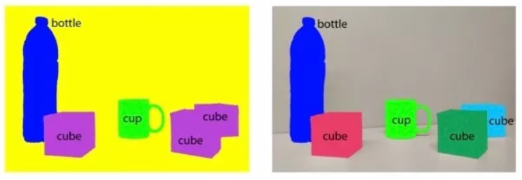

  - Motivation

  - Core Mechanism

    如何区分呢？直接在语义分割的基础上画框，在faster R-CNN基础上添加一个mask分支（即FCN结构）

    - Architecture

      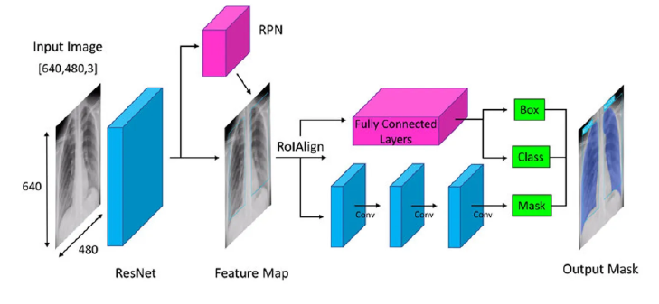

    - 新增的mask分支

      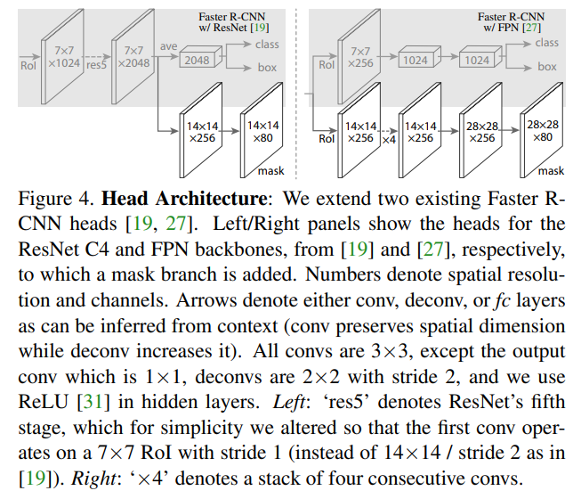

      > [!NOTE]
      >
      > 这样的处理方法叫detect-then-segment，所以对检测框的依赖程度比较高,框歪了,或者漏
      > 了,那么分割也就错了
      >
      > 还有其他的处理方法：比如，嵌入向量聚类:Semantic Instance Segmentation with a Discriminative Loss Function：先做语义分割,把同一语义类别的像素找出来,然后再同一类的像素之间做聚类,分出不同的实例（这里模型输出是一个高维向量embedding，因此可以做聚类）这种方法很慢（聚类就很慢），超参影响很大

  - Cons

    

### SOLO

#### v1

- __SOLO: Segmenting Objects by Locations.__ *Xinlong Wang et al.* __European Conference on Computer Vision, 2019__ [(Arxiv)](https://arxiv.org/abs/1912.04488) [(S2)](https://www.semanticscholar.org/paper/4c4f040d0c4ed6d434534fc278e886db31c0d8b4) (Citations __807__)

  - Takeaway

    A new, embarrassingly simple approach to instance segmentation in images by introducing the notion of "instance categories", which assigns categories to each pixel within an instance according to the instance's location and size thus nicely converting instance mask segmentation into a classification-solvable problem.根据实例的位置和大小为实例中的每个像素分配类别

  - Motivation

    之前的实例分割方法都是阶段性的,要不先分出来实例再分割,要不就是先分割再分出来实例,能不能实现一个直接端到端的方法?直接输出不同的实例呢?——位置和形状，那么怎么表示呢

    - 位置：FCOS里面的网格,不同的网格的感受野内的特征是不一样的，因此不同位置上的实例就是不同的实例，转化为了位置分类
    - 形状：形状变化很大，这里用大小来表示

  - Core Mechanism

    - Architecture

      

      将实例分割重新表述为两个同时的、类别预测和实例掩码生成问题。具体而
      言,将输入图像划分为统一的网格,即 S × S 。如果对象的中心落入网格单
      元,则该网格单元负责该实例对象的语义类别预测以及mask预测

    - Head

      

      > [!NOTE]
      >
      > 上面分支是$S\times S$，每个网格对应instance mash branch的一个channel。即分类通道上的一个网格是和掩码分支输出的一个通道有一对一的关系。
      >
      > 那么掩码分支的通道和分类分支的网格有对应的关系,所以,不同位置的特征也要去该位置对应的通道上输出mask。但是卷积具有平移不变性,一个特征无论在哪个位置,其都是不变的。那我应该如何根据特征来决定将其输出到对应的mask通道上呢?所以,在mask分支中,会引入位置
      > 编码
      >
      > 

    - Matrix NMS

      Matrix NMS 本质上是 Soft-NMS 的并行实现。它引入了一个“衰减因子”的概念。也就是说对于任何一个框,他最终**被保留的概率取决于他自己原本的分数和他被比他分数高的框的抑制程度**。该方法结合了Soft-NMS和Fast-NMS的方法

      - 传统NMS:只要一个框的IOU和得分最高的框的IOU大于阈值就被抑制，串行计算，很慢
      - FastNMS:假设所有的框是同时存在的,直接通过IOU判断哪些框应该被抑制,实现了并行计算NMS,速度很快
      - SoftNMS:不会像传统NMS那样直接删除掉框,而是衰减其分数,这样能够一定程度上的缓解密集检测的问题
      - Matrix NMS:结合将FastNMS和Soft-NMS，既并行计算，又不会直接删框，A,B两个框,A的得分高,B在计算被A抑制的程度的时候,也要考虑到A本身是否已经被更高得分的框抑制了,如果A已经被抑制了,那么对B的一直程度就应该减少一点,因为A本来就是一个被抑制的框


#### v2

- __SOLOv2: Dynamic, Faster and Stronger.__ *Xinlong Wang et al.* __ArXiv, 2020__ [(Arxiv)](https://arxiv.org/abs/2003.10152) [(S2)](https://www.semanticscholar.org/paper/fab853583c8465c01e2b8244debaa2bcd6be18d6) (Citations __99__)

  > Arxiv和S2上面的论文名字还不一样的，奇怪

  - Takeaway

  - Motivation

    SOLOv1中提出的mask head的通道数是网格的数量，很多都是冗余的，因此想要对其做一些改进

  - Core Mechanism

    - Architecture

      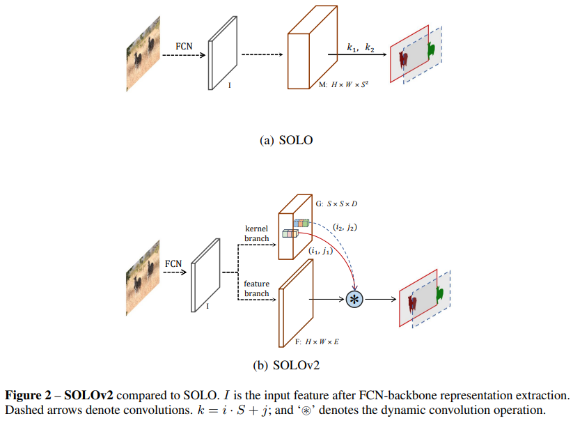

    - decoupled head

      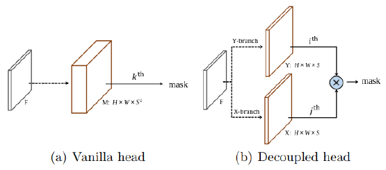

      每个通道不再预测mask,而是预测X和Y方向两个向量,类似的,每个网格都有一个X,Y向量。第 i个网格的Mask直接取出来第i个X,Y向量相乘即可得到

    - 动态卷积

      > 对照结构图查看

      将mask head分为两个branch。上面这个branch输出的是卷积核的参数,通道数就是卷积核参数的个数,也就是说每个网格都会对应一个卷积核。下面这个分支输出的就是一张特征图。当需要第 i个网格的mask的时候,就将第 i个网格逐通道取出来卷积核的参数,然后取下面分支输出的特征图上进行卷积操作,再经过sigmoid就得到了最终的mask


### MaskFormer

DETR 思想进入分割领域后的重要结果

MaskFormer+Mask2Former


### Open-vocabulary Segmentation and Foundation model

多模态领域了

> 从这里我们可以看到，检测领域的发展同样适用于分割任务，也就是CV领域基本是想通的，一个任务的idea可以很容易扩展到另外的任务


### SAM

Promptable Segmentation

#### v1

- __Segment Anything.__ *Alexander Kirillov, Eric Mintun, Nikhila Ravi, Hanzi Mao, Chloe Rolland, Laura Gustafson, Tete Xiao, Spencer Whitehead, Alexander C. Berg, Wan-Yen Lo, Piotr Dollár, Ross Girshick.* __ICCV, 2023__ [(Arxiv)](https://arxiv.org/abs/2304.02643) [(S2)](https://www.semanticscholar.org/paper/7470a1702c8c86e6f28d32cfa315381150102f5b) (Citations __13595__) ([My PDF](https://drive.google.com/file/d/12oXS9-O43Ti0cTeQ0gMbJZD3xVwCpUL3/view?usp=drivesdk))

  - Takeaway

    SAM（Segment Anything Model）是 CV 领域第一个真正的 **foundation model for segmentation**。它提出了 *promptable segmentation* 任务：给定任意 prompt（点/框/mask/文本），返回一个 valid mask；并通过 model-in-the-loop 的 data engine 构建了 SA-1B（11M 图像、1.1B mask），实现强大的 zero-shot 泛化能力 —— 在 23 个 unseen 分割数据集上，单点 prompt 的 zero-shot 性能常常接近甚至超越此前的 fully supervised 方法。

  - Motivation

    分割领域长期缺乏像 NLP 中 GPT 那样的 foundation model。核心瓶颈：
    - **缺少统一的任务定义**：传统分割方法（semantic/instance/panoptic）各自为政，无法像 NLP 的 next-token-prediction 那样通过单一 pre-training objective 泛化到多种下游任务
    - **缺少 web-scale 标注数据**：NLP 可以从互联网海量文本中学习，但 segmentation mask 无法从网络上自然获取 —— 当时最大的分割数据集也仅有约 2.7M mask，远不足以支撑 foundation model 训练
    - **缺少 ambiguity 处理能力**：现实场景中 prompt 往往是模糊的（如点在衬衫上 → 衬衫还是人？），传统分割模型输出唯一 mask 会做平均化，导致不合理的输出

  - Core Mechanism

    主要做了三点工作

    1. a prompt-able segmentation task
    2. a segmentation model (SAM)
    3. a data engine

    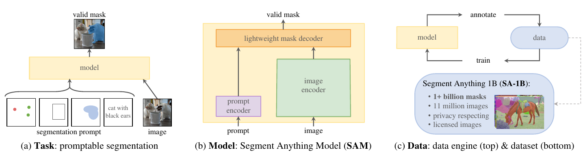

    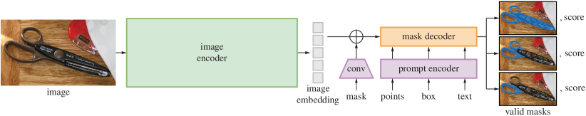

    - Promptable Segmentation Task

      **What**：给定任意 segmentation prompt $p$（foreground/background point、rough box、mask、free-form text），输出一个 *valid* segmentation mask（even for ambiguous prompt，至少给出一个合理的 mask）。

      本质是将分割问题重新定义为 **prompt → mask** 的映射，对标 NLP 中 prompt → response 的范式。
  
      **Why**：这个 task definition 既是 pre-training objective，也是 zero-shot transfer 的接口。下游任务（edge detection、instance segmentation、object proposal 等）可以通过 prompt engineering 转换为该 task 的形式，从而实现单一模型的 task generalization。
  
      **How**：训练时对每个 GT mask 模拟 interactive setup —— 随机采样 11 轮 geometric prompt（点/框/mask），每一轮都要求模型输出 valid mask 并与 GT 比对。这种 training scheme 来自 interactive segmentation 的迭代标注流程。
  
    - Model Architecture: Image Encoder + Prompt Encoder + Lightweight Mask Decoder
  
      **What**：SAM 采用三组件设计：
  
      - **Image Encoder**：MAE pre-trained ViT（支持 ViT-B/L/H），处理高分辨率输入（$1024 \times 1024$），仅在每张图片上运行一次，输出 image embedding
  
      - **Prompt Encoder**：处理两类 prompt —— *sparse*（point/box/text）和 *dense*（mask）。Point 和 box 通过 positional encoding + learned embedding 表示；text 使用 CLIP text encoder；mask 通过卷积嵌入后 element-wise 加到 image embedding 上
  
        > [!TIP]
        >
        > 这些不同形式的编码还挺麻烦的
  
        - point: 编码e-point由两部分组成e-point=PE(x,y)+e-fb，一是位置编码PE(x,y)，坐标编码采用正余弦编码形式，如下；二是前景/背景编码e-fb，当指定是前景时使用前景编码，反之则背景编码。
        - box
        - text: 文本提示使用CLIP的文本编码器进行编码，“文本长度”*256的矩阵
  
        Prompt Encoder 稀疏提示编码器由Point、Box和Text三部分concat得到
  
        ```
        prompt token=[e-point，e-box，e-text] #一个“N1*256”的矩阵
        ```
  
      - **Mask Decoder**：轻量级 Transformer decoder（仅 2 个 block），将 image embedding 与 prompt embedding 通过 cross-attention 融合，最终由一个 output token 经 MLP 映射为 dynamic linear classifier，在 image embedding 的每个空间位置产生 foreground probability

        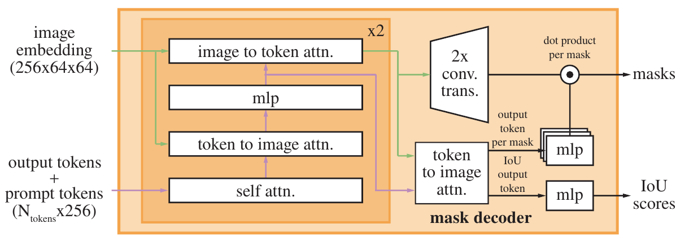
  
      **Why**：image encoder heavy + decoder light 的设计将计算开销摊销：image embedding 计算一次后，每次新的 prompt 只需要跑 prompt encoder + mask decoder（~50ms in browser，on CPU），实现真正的交互式实时分割。

      > 之前的分割模型要么不可 prompt（固定任务），要么不支持实时多次交互。
  
    - Ambiguity-Aware Design: 3-Mask Output with Min-Loss Training

      **What**：对于 ambiguous prompt（如 single point on a shirt），SAM 输出 **3 个 valid mask**（对应 whole/part/subpart 三层嵌套），并为每个 mask 预测一个 confidence score（estimated IoU）用于排序。训练时只对 loss 最小的 mask 反向传播：
      $$
      \mathcal{L} = \min_{i \in \{1,2,3\}} \mathcal{L}_{\text{mask}}(M_i, GT)
      $$
      **Why**：如果只输出一个 mask，模型在 ambiguous prompt 下会平均化多个 valid mask，产生不合理结果。3-mask 设计覆盖了"整体→部分→子部分"的嵌套层级，这是现实分割标注中最常见的 ambiguity 模式。
  
      > [!WARNING]
      >
      > 还是不是很理解3 mask的作用，为啥要这个？一个prompt的提示是有歧义的，但是有没有什么更好的解决办法
      >
      > 为什么可以覆盖，为什么只选loss最小的学习
  
      **How**：mask decoder 输出 3 个 output token，每个对应一个 mask head。训练时只 backprop loss 最小的那个 mask（类似于 multiple choice learning），确保每个 head 学到不同的 ambiguity 模式。Inference 时输出 3 个 mask + score，用户/下游系统根据 score 选择。
  
    - Data Engine: Model-in-the-Loop 三级标注流水线
  
      **What**：由于 mask 无法从网络直接获取，设计了 model-in-the-loop 的 data engine，分三个阶段迭代：
      1. **Assisted-manual stage**（人工主导）：标注员使用 SAM 交互式标注（点击点 → brush/eraser 精修）。从公共数据集初始化 SAM，随数据增多 retrain 6 次，标注速度从 34s/mask → 14s/mask。产出 4.3M mask/120k 图像。
      2. **Semi-automatic stage**（人机协作）：先自动检测 confident mask（训练通用 "object" 类别的 box detector），标注员补充未标注物体以增加 diversity。retrain 5 次。产出 5.9M mask/180k 图像（累计 10.2M mask）。
      3. **Fully automatic stage**（全自动）：用 $32 \times 32$ 规则网格的 foreground point prompt 遍历每张图 → 筛选 confident（IoU head）+ stable（thresholding at $0.5 \pm \delta$ 结果稳定）+ NMS 去重 → 最终平均每张图产出 ~100 个高质量 mask。全自动处理所有 11M 图像，产出 1.1B mask。
  
      **Why**：解决了分割领域没有 "web-scale data" 的根本困难。不需要人工标注 1B mask，而是利用模型能力自我增强 —— 模型越好 → 自动标注质量越高 → 数据越多 → 模型更好，形成飞轮。
  
      **How**：三个阶段逐步提高自动化和 scale。前两个阶段训练出 ambiguity-aware SAM，第三阶段全自动生成 SA-1B。SA-1B 的自动 mask 质量经过验证：94% 的自动 mask 与人工精修 mask 的 IoU > 90%，甚至超过传统数据集的人工标注一致性（85-91% IoU）。
  
      > [!NOTE]
      >
      > SA-1B 仅包含全自动 stage 生成的 mask（99.1% 是自动生成），不含前两个阶段的人工标注数据。这是有意设计：自动 mask 的质量已经足够高，且这样让数据集完全可复现、可 scale。
  
  - Pipeline
  
    1. **Pre-training**：在 SA-1B（及前期标注数据）上训练 SAM，使用 promptable segmentation objective。对每个 GT mask 随机采样 point/box/mask prompt 共 11 轮，每轮要求输出 valid mask。loss 为 focal loss + dice loss 的线性组合，使用 min-loss（3-mask 中取最小 loss backprop）
    2. **Inference - 交互式使用**：image encoder 跑一次 → 用户在浏览器中点/画框 → prompt encoder + mask decoder 50ms 内返回 3 个候选 mask + IoU confidence → 用户选择或继续 refine
    3. **Inference - 下游任务 zero-shot transfer**：将下游任务的输出转化为 prompt 喂给 SAM。例如：object detector 的 box → prompt SAM → instance segmentation；edge detector 的输出 → prompt SAM → 精细 mask；grid of points → prompt SAM → object proposal
    4. **Automatic mask generation**：$32 \times 32$ grid point prompt → 每个点输出 3 个 mask → IoU 筛选 confident mask → stability check → NMS 去重 → 最终 mask set
  
  - Pros
  
    - **CV 分割领域的 foundation model 里程碑**：首次将 promptable 思想从 NLP 成功迁移到 segmentation，证明单一模型可以通过 prompt engineering 泛化到多种分割任务
    - **SA-1B 数据集的贡献独立于模型**：1.1B mask 是前最大数据集（Open Images）的 400x，为整个 CV 社区提供了训练 foundation model 的基础设施
    - **架构简洁高效**：heavy encoder + light decoder 的设计将 image encoding 摊销，prompt 响应仅需 50ms，真正实现可交互
    - **Ambiguity-aware 设计巧妙**：3-mask 输出 + min-loss training 以极低 overhead 解决了分割中最棘手的 ambiguity 问题
    - **Zero-shot 泛化能力惊人**：在 23 个 unseen 数据集上单点 prompt 性能接近或超越 fully supervised 方法，展示了 foundation model 的真正实力
  
  - Cons
  
    - **Text prompt 能力较弱**：text-to-mask 仅在初步探索阶段，远不如 point/box prompt 可靠。SAM 本质上还是以 spatial prompt 为主的模型，CLIP text encoder 只是"接上去"的
    - **计算成本高**：ViT-H 的 image encoder 推理成本大（尤其是高分辨率 1024×1024），在低资源设备上部署困难。SAMv2 后续通过 memory attention 和 streaming 部分缓解
    - **不输出语义标签**：SA-1B 和 SAM 都是 class-agnostic 的，mask 只有"是一个 segmented region"的信息，没有 "cat"/"dog" 等语义类别。需要下游结合分类器或检测器才能做 semantic instance segmentation
    - **细粒度边界不够精准**：mask decoder 仅 2 层 Transformer + 简单上采样，对于头发丝、物体边缘等 fine-grained boundary 的处理不如专门的分割方法精细
    - **Data engine 对初始种子质量敏感**：前两个 stage 依赖人工标注作为种子数据，如果初始标注质量或 diversity 有偏差，会通过飞轮效应放大


#### v2

- __SAM 2: Segment Anything in Images and Videos.__ *Nikhila Ravi et al.* __ArXiv, 2024__ [(Arxiv)](https://arxiv.org/abs/2408.00714) [(S2)](https://www.semanticscholar.org/paper/92a09cdfc19f3f582d89c28c1b4f386299cc69e1) (Citations __3291__) ([My PDF](https://drive.google.com/file/d/1iDrQpnRbgJOoNAQL0gMMTrpdkn2fdaZO/view?usp=drivesdk))

  - Takeaway

    将 SAM 从图像域自然地推广到视频域，通过引入 streaming memory bank 实现帧级实时交互式视频分割。统一模型在一个框架内同时完成 image segmentation 和 video segmentation，在视频任务上以 3× 更少交互达到更高精度，在图像任务上比 SAM 快 6× 且更准。

  - Motivation

    现实世界中的视觉内容越来越多以视频形式存在，AR/VR、自动驾驶、视频编辑等应用需要 temporal localization 而不仅仅是 image-level segmentation。视频分割面临独特挑战：物体因运动/形变/遮挡/光照变化导致外观剧烈变化，视频帧常常质量更低（运动模糊、低分辨率），需要高效处理大量帧。

    此前的方法（如 SAM+XMem++、SAM+Cutie）采用 decoupled 方案：用 SAM 在单帧生成 mask，再用 VOS tracker 传播到其他帧。这种两阶段的方案有根本缺陷：tracker 不一定对所有物体有效，SAM 在视频帧上性能下降，且**没有交互式 refinement 机制**——一旦出错只能在该帧从头用 SAM 重新标注并重启 tracking。

    SAM 2 的核心 insight：**将 temporal propagation 与 interactive segmentation 统一到一个 streaming 模型中**，利用 memory 保存之前帧的预测和 prompt 信息，使得后续帧的 refinement 只需少量 correction clicks 即可恢复正确结果。

  - Core Mechanism

    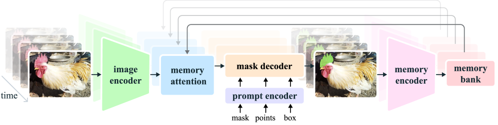

    **Overall**: SAM 2 = Image encoder + Memory attention + Prompt encoder & Mask decoder + Memory encoder + Memory bank。视频帧以 streaming 方式逐帧处理，image encoder 只跑一次为每帧生成 unconditioned embedding，memory attention 用 cross-attention 将当前帧特征与 memory bank 中存储的过往帧信息融合，mask decoder（基本沿用 SAM 设计）据此预测当前帧的 mask。

    #### Streaming Memory Bank

    - **What**: 一个 FIFO 队列结构的记忆库，存储两类信息：
      - **Spatial features**: 最多 $N$ 个近期帧的 memory（由 memory encoder 生成的空间特征图） + 最多 $M$ 个被 prompt 过的帧的 memory
      - **Object pointers**: 轻量级向量列表，来自每帧 mask decoder 的 output token，编码目标物体的高层语义信息

    - **Why**: 视频分割需要跨帧传递目标信息。传统的 VOS 方法要么只条件化于首帧，要么用 RNN/Transformer 编码所有历史——前者在遮挡/形变时脆弱，后者计算量随帧数增长。Memory bank 设计使模型能够基于已存储的历史信息高效推理，同时支持 refinement（任意帧的新 prompt 可即刻更新 memory 并影响后续预测）。

    - **How**: Memory encoder 将当前帧的预测 mask 经卷积下采样后与 image encoder 输出做 element-wise 加和，再经轻量卷积融合，存入 memory bank。对于 VOS 场景（仅首帧有 mask prompt），memory bank 始终保留首帧 memory + 最近 $N$ 帧 memory。对于交互式场景（中途有 refinement click），被 prompt 帧的 memory 也进入 bank。近期帧的 memory 嵌入 temporal position encoding 以建模短时运动信息。

    #### Memory Attention

    - **What**: 堆叠 $L$ 个 transformer block，每个 block 执行：
      1. Self-attention on current frame features
      2. Cross-attention to memory bank（spatial features + object pointers）
      3. MLP

    - **Why**: 当前帧的 image encoder 输出是 unconditioned 的（不携带任何目标信息）。Memory attention 通过 cross-attention 将当前帧与 memory bank 中的目标历史信息融合，使 mask decoder 得到受历史预测和 prompt 条件化的 frame embedding。

    - **How**: 自注意力和交叉注意力均使用 vanilla attention（可利用 FlashAttention 等高效算子），并引入 2D spatial RoPE 编码空间位置信息（但 object pointer tokens 不加 RoPE，因为它们没有特定空间对应）。Memory attention 的输出送入 mask decoder。

    #### 与 SAM 的关键区别

    - **Occlusion head**: 新增一个 head 预测当前帧目标是否存在（binary prediction）。这在 video 中是必要的——目标可能被完全遮挡后重新出现。SAM 假设有 positive prompt 就一定存在有效目标，不适用于视频。
    - **Skip connections**: 从 hierarchical image encoder（Hiera）的高分辨率层绕过 memory attention 直接连到 mask decoder 上采样层，保留细粒度空间细节。
    - **Multi-mask 传播**: 与 SAM 类似的 multi-mask 预测机制在每帧生效。若无后续 prompt 解决歧义，只传播 predicted IoU 最高的 mask。

    #### Training Loss

    $$\mathcal{L} = \underbrace{20 \cdot (\mathcal{L}_{\text{focal}} + \mathcal{L}_{\text{dice}})}_{\text{mask loss}} + \underbrace{1 \cdot \mathcal{L}_{\text{MAE}}}_{\text{IoU}} + \underbrace{1 \cdot \mathcal{L}_{\text{CE}}}_{\text{occlusion}}$$

    - 训练时联合使用 image 和 video 数据，模拟交互式 prompting：随机选择 8-frame 序列中的最多 2 帧给 prompt（mask 50%、positive click 25%、box 25%），以一定概率采样 correction clicks

  - Pipeline

    1. **Input**: 视频帧序列 + 用户在任意帧上的 prompt（click/box/mask）
    2. **Image encoding**: Hiera encoder（MAE 预训练，hierarchical）对每帧跑一次，输出多尺度 feature embeddings
    3. **Memory attention**: 当前帧 embedding 与 memory bank（前 $N$ 帧 spatial features + object pointers + 被 prompt 帧）做 cross-attention，得到 conditioned frame embedding
    4. **Mask decoding**: Prompt encoder（沿用 SAM 设计）+ mask decoder（two-way transformer blocks + skip connections from Hiera high-res features），输出 multi-mask predictions + IoU scores + occlusion score
    5. **Memory update**: Memory encoder 将当前帧预测 mask + image embedding 融合，压入 memory bank FIFO；object pointer 从 decoder output token 提取并追加
    6. **输出**: 当前帧的 segmentation mask + 整个视频的 masklet；用户可随时在任意帧追加 prompt 进行 refinement

  - Pros

    - **统一架构**: 同时覆盖 image 和 video segmentation，image 输入退化为单帧视频（memory 为空），行为等价于 SAM
    - **3× 更少交互**: 在 9 个 zero-shot video 数据集上，用 3 clicks 即可超越 SAM+XMem++/Cutie 等 baseline
    - **实时速度**: Hiera-B+ 达到 43.8 FPS（单 A100），支持流式逐帧处理
    - **巨大数据集**: SA-V 包含 50.9K 视频 / 35.5M masks（是此前最大 VOS 数据集的 53×），且标注覆盖 whole objects + parts + subparts，不限于特定语义类别
    - **交互式 refinement**: 一次 click 即可从错误中恢复（而不需要像 decoupled 方案那样从头来）
    - **Image 任务更强**: 在 37 个 zero-shot image segmentation benchmark 上超越 SAM，同时快 6×

  - Cons

    - **镜头切换脆弱**: 跨 shot changes 时容易丢失目标
    - **细长/快速运动物体**: 对非常细的、快速运动的物体跟踪精度有限
    - **长时遮挡和 crowded scenes**: 长时间完全遮挡后重识别困难，相似外观的多个物体（如多个相同杂耍球）容易混淆
    - **多物体独立处理**: 同时跟踪多个物体时，每个物体独立处理，仅共享 per-frame embeddings，无 inter-object communication
    - **数据引擎依赖人工**: masklet quality verification 和新帧 correction 仍需人工 annotator 参与


#### v3

- __SAM 3: Segment Anything with Concepts.__ *Nicolas Carion, Laura Gustafson, Yuan-Ting Hu et al.* __ArXiv, 2025__ [(Arxiv)](https://arxiv.org/abs/2511.16719) [(Code)](https://github.com/facebookresearch/sam3) ([My PDF](https://drive.google.com/file/d/1XE7n7B8Z6J59pB70wSC6E8U4ftK9sEAz/view?usp=drivesdk))

  - Takeaway

    SAM 3 将 SAM 系列从"用 visual prompt（点、框）分割单个物体"扩展到"用 concept prompt（短名词短语、image exemplar，或两者组合）检测、分割并追踪**所有**匹配的实例"，提出了 Promptable Concept Segmentation (PCS) 任务。通过 decoupled presence head、detector+tracker 共享 backbone、以及一个基于 AI + 人工的数据引擎（4M unique concept labels），SAM 3 在 PCS 上比现有系统准确率翻倍，同时保持了 SAM v1/v2 的 visual prompt 交互能力。

  - Motivation

    - SAM v1/v2 解决的是 **Promptable Visual Segmentation (PVS)**：给定一个 visual prompt（点、框、mask），只分割 **一个** 物体实例
    - 实际应用中，用户更常见的问题是"图中所有的『猫』在哪里？"——需要把 query 理解为概念（concept），而非单个 visual cue
    - 已有的 open-vocabulary detector（如 OWLv2, GroundingDINO）能做开放词汇检测，但缺乏高质量 mask 输出和 video tracking 能力；APE、DINO-X 等 specialist 也受限于训练数据和任务定义
    - SAM 3 将 PVS 推广为 **PCS**：输入 concept prompt → 输出所有匹配实例的 instance mask + semantic mask + tracking ID

  - Core Mechanism

    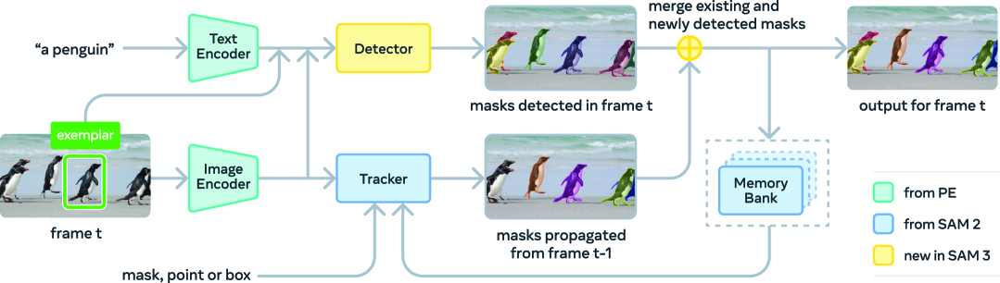

    **Architecture 总览**：SAM 3 = **Detector**（DETR-based，负责图像级检测）+ **Tracker**（SAM 2 style memory-based，负责视频 tracking），两者共享一个 Perception Encoder (PE) backbone。Detector 是 identity-agnostic 的（只关心"这是什么概念"），Tracker 负责在不同帧之间维护 identity（"这个 instance 和上一帧的是同一个"），二者解耦避免了 task conflict。

    - **Presence Head（核心创新）**

      - **What**: 在 DETR decoder 中引入一个全局 `[presence]` token，专门负责判断"这个名词短语是否在图像中存在"，即预测 $p(\text{NP is present in input})$。每个 proposal query $q_i$ 只需解决 localization 问题 $p(q_i \text{ is a match} \mid \text{NP is present})$。最终分数：

        $$\text{score}(q_i) = p(\text{NP is present}) \cdot p(q_i \text{ is a match} \mid \text{NP is present})$$

      - **Why**: DETR 的 object query 同时需要"识别（what）"和"定位（where）"。识别需要全局上下文，定位天然是局部的，二者在同一个 query 上冲突。尤其在有 hard negative 的训练中（图像中不存在 prompt 描述的概念），query 很难学会输出正确的低置信度。Presence head 将识别和定位解耦，让 query 专注于 localization。
      - **How**: `[presence]` token 是一个可学习的全局 token，通过 cross-attention 从整张图像的特征中聚合上下文信息，输出一个全局的 presence 分数。训练时对 presence head 使用单独的 binary classification loss。

    - **Concept Prompt**

      - **What**: Concept prompt 包括三种形式：(1) 短名词短语（如 `"yellow school bus"`），(2) image exemplar（正/负 bounding box），(3) 两者组合。Image exemplar 的作用是"以图搜物"——给一个 positive box 示例，模型找出图中所有类似物体（而非 SAM v1/v2 那样只返回一个 mask）。

      - **Why**: 纯文本 prompt 对罕见概念、主观描述（"cozy"、"large"）表现不佳，image exemplar 补充了视觉信号，交互式地纠正漏检和误检。
      - **How**: Image exemplar 通过 ROI-pooled visual features + 位置编码 + 标签编码（positive/negative），经一个小 transformer 处理后拼接到 text tokens 上，共同作为 prompt tokens 输入 detector。

    - **Video Tracking: Detect-them-track**

      - **What**: video 推理分为三步（per frame）：
        $$\hat{\mathcal{M}}_t = \text{propagate}(\mathcal{M}_{t-1}), \quad \mathcal{O}_t = \text{detect}(I_t, P), \quad \mathcal{M}_t = \text{match\_and\_update}(\hat{\mathcal{M}}_t, \mathcal{O}_t)$$

      - **Why**: 纯 tracker（如 SAM 2）依赖第一帧的初始化，新出现的物体无法被检测到；纯 per-frame detector 则丢失了跨帧 identity。Detect-then-track 结合两者优点。

      - **How**: Tracker 使用 SAM 2 的 memory bank 机制（memory encoder + memory bank + mask decoder），跨帧传播 masklets。Tracker 的预测 $\hat{\mathcal{M}}_t$ 与 detector 的当前帧检测 $\mathcal{O}_t$ 通过 IoU matching 关联（Hungarian matching），匹配成功的保留 identity，未匹配的 detector 输出 spawn 新 masklet。额外的 temporal disambiguation：若 masklet 连续多帧未被 detector 确认（detection score 低于阈值），则被抑制；定期用高置信度 detector 输出重新 prompt tracker 以修正 drift。

    - **Interactive Refinement**

      - SAM 3 完全继承 SAM v1/v2 的交互能力：用户可以在任意 frame 上用 positive/negative clicks 精调单个 mask(let)，精调后的 mask 自动传播到整个视频。

  - Pipeline

    1. __PE backbone__：Perception Encoder 同时编码图像和文本 prompt，输出对齐的 vision-language features
    2. __Detector (DETR-based)__：
       - Text tokens + image exemplar tokens → prompt tokens
       - Fusion encoder：image features cross-attend to prompt tokens，实现 vision-language 融合
       - DETR decoder：learned object queries + box-region positional bias → 预测 binary class logits（是否匹配概念）+ bbox delta + instance mask + semantic mask
       - `[presence]` token 输出全局 presence score，与 per-query score 相乘得到最终置信度
    3. __Tracker (SAM 2 style)__：
       - 第一帧：detector 输出 → 初始化 masklets
       - 后续帧：memory encoder + memory bank → mask decoder 传播 masklets
    4. __Training stages__：
       - Stage 1: PE backbone pre-training
       - Stage 2: detector pre-training (SA-Co/HQ + SA-Co/SYN)
       - Stage 3: detector fine-tuning (high-quality data)
       - Stage 4: tracker training (frozen PE backbone)
    5. __Data Engine__：
       - Phase 1: 人工 verification（4.3M image-NP pairs）
       - Phase 2: 用 Llama 3.2 做 AI verifier，同时生成 hard negative NPs（122M pairs）
       - Phase 3: 扩展 domain 覆盖 + SA-Co ontology（22.4M nodes，Wikidata-based）（19.5M pairs）
       - Phase 4: video 标注（52.5K videos，467K masklets）
    6. __Inference__：单图 ~30ms（H200 GPU，100+ objects），视频 tracking 在 ~5 个并发 object 时接近实时

  - Pros

    - __任务定义清晰且实用__：PCS 是比 SAM v1/v2 更贴近实际需求的 task formulation——用户想分割"概念"而非"一个区域"
    - __Presence head 设计精巧__：以极小的额外成本解决了 open-vocabulary detection 中 recognition/localization 冲突的关键问题，尤其在 hard negatives 场景下效果显著
    - __统一架构__：一次推理同时输出 instance mask + semantic mask + bbox + tracking ID，无需组合多个模型
    - __保留 SAM 生态兼容性__：完全向后兼容 SAM v1/v2 的 visual prompt（点、框、mask），也可以作为 interactive segmentation tool 使用
    - __强大的交互能力__：image exemplar（正/负 box）和 click refinement 可以迭代式地纠正模型错误，3 次交互即可提升 +21.6 cgF1
    - __数据引擎可扩展__：AI verifier（Llama 3.2 fine-tuned）将标注吞吐提升 2x，hard negative NP 生成策略有效提升模型 calibration

  - Cons

    - __限于简单名词短语__：不支持长 referring expression 或需要 reasoning 的 query（需搭配 MLLM 使用，增加推理成本）
    - __concept prompt 不可随意混合__：text prompt 和 exemplar prompt 必须指向同一概念类别，否则行为未定义（如先用"cat" text prompt，再用"tail" exemplar 无效）
    - __video inference 随物体数扩展__：当 scene 中匹配物体数量较多时（>10），tracking latency 线性增长
    - __依赖大规模数据引擎__：4M concepts 的训练数据依赖于复杂的 human-AI-in-the-loop pipeline，复现门槛高
    - __PCS 任务本身的歧义性__：多义词（mouse 动物/设备）、主观描述（cozy）、边界模糊（mirror 含不含镜框）等问题没有根本解决，仅通过多 annotator 和 ambiguity module 缓解


## Relation

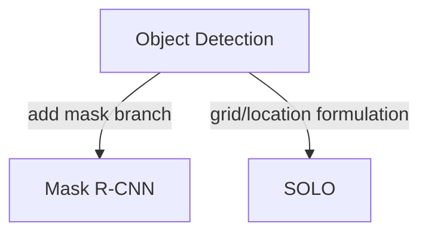

