# Task: Object Tracking

[TOC]

## Task Definition

Object Tracking 估计目标在时间维度上的 identity、location 和 shape。根据输出形式和目标数量，可以拆成几条常见任务线：

- **VOT / Visual Object Tracking**：通常指 **single object tracking**。第一帧给定 target box，后续每帧输出同一目标的 bbox；评价重点是 robustness、accuracy、speed，典型 benchmark 包括 OTB、VOT、LaSOT、TrackingNet、GOT-10k。
- **VOS / Video Object Segmentation**：给定第一帧 mask 或 prompt，后续逐帧输出目标 mask；相比 VOT，输出从 box 变成 dense mask，难点从 localization 扩展到 boundary、occlusion、identity consistency 和 long-term memory。
- **MOT / Multiple Object Tracking**：通常是 tracking-by-detection pipeline：每帧检测多个目标，再通过 motion、appearance 和 matching 做 association。

> [!NOTE]
>
> VOT 和 VOS 的核心差别不是“有没有时间”，而是 **state representation** 不同：VOT 多数维护 bbox state，VOS 维护 pixel-level mask / object memory。SiamMask、SAM 2 等方法说明二者可以被统一到 tracking + segmentation 的框架里。

## Paper Matrix

| Paper / Method | 为什么放入这个任务 | 在任务中的作用 | 详细笔记 |
| --- | --- | --- | --- |
| SORT | 经典 tracking-by-detection baseline。 | MOT: motion + detection association baseline | External note not yet added |
| DeepSORT | 增加 appearance embeddings 来提升 association。 | MOT: appearance-aware tracking baseline | External note not yet added |
| ByteTrack | 利用 low-score detections 参与 association。 | MOT: detection confidence / association bridge | External note not yet added |
| SiamFC | 现代 VOT 中 offline-trained Siamese matching 的起点。 | VOT: CNN Siamese template-search baseline | [SiamFC](#siamfc) |
| SiamRPN | 把 Siamese tracking 改写成 local one-shot detection。 | VOT: Siamese + RPN head | [SiamRPN](#siamrpn) |
| SiamRPN++ | 解决 deep backbone 在 Siamese tracking 中的 translation invariance 问题。 | VOT: deep CNN Siamese tracker | [SiamRPN++](#siamrpn) |
| SiamMask | 在 Siamese tracker 上加 mask branch，连接 VOT 和 VOS。 | VOT/VOS bridge: box + mask | [SiamMask](#siammask) |
| TransT | 用 attention fusion 替代简单 correlation。 | VOT: CNN + Transformer fusion | [TransT](#transt) |
| STARK | 用 encoder-decoder transformer 做 direct box prediction，并引入时空信息。 | VOT: spatio-temporal transformer | [STARK](#stark) |
| MixFormer | 将 feature extraction 和 target information integration 合并到 Mixed Attention 中。 | VOT: one-stream transformer transition | [MixFormer](#mixformer) |
| OSTrack | 经典 one-stream ViT tracker，template/search 双向信息流。 | VOT: canonical one-stream framework | [OSTrack](#ostrack) |
| OSVOS | 第一帧 mask + one-shot fine-tuning 的早期 VOS 标杆。 | VOS: one-shot online adaptation | [OSVOS](#osvos) |
| FEELVOS | 用 global/local embedding matching 去掉 test-time fine-tuning。 | VOS: embedding matching baseline | [FEELVOS](#feelvos) |
| STM | 过去帧和 mask 作为 external memory，做 dense space-time matching。 | VOS: memory network milestone | [STM](#stm) |
| STCN | 重新思考 STM，对帧间 correspondence 和 memory voting 做简化。 | VOS: efficient memory correspondence | [STCN](#stcn) |
| AOT | 用 identification + transformer 同时关联多目标。 | VOS: multi-object transformer association | [AOT](#aot) |
| XMem | 用 sensory/working/long-term memory 处理长视频。 | VOS: long-term memory management | [XMem](#xmem) |
| Cutie | 从 pixel memory 转向 object-level memory reading。 | VOS: object-query memory | [Cutie](#cutie) |

## Relation

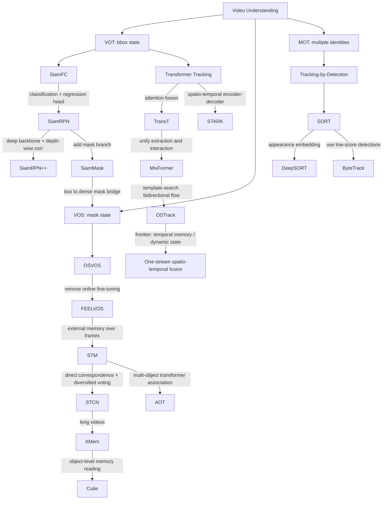

## Concept Notes

### VOT: from Siamese CNN to one-stream Transformer

早期 deep VOT 的主线是 **template-search matching**：第一帧 crop 出 template $z$，当前帧 crop 出 search region $x$，模型输出 response map 或 box。SiamFC 证明了 offline training 的 fully-convolutional Siamese network 可以做到 real-time tracking；SiamRPN / SiamRPN++ 进一步把 tracking 改写成 local detection，并引入 bbox regression、deep backbone 和 depth-wise correlation。

Transformer 之后，问题从“如何设计 correlation head”变成“如何让 template 与 search 更充分交互”。TransT 用 self-attention + cross-attention 替代局部线性 correlation；STARK 把 tracking 改成 spatio-temporal transformer + direct box prediction；MixFormer 和 OSTrack 则进入 **one-stream**：template tokens 和 search tokens 在同一个 Transformer 中共同学习，使 feature extraction 和 relation modeling 不再是分开的两阶段。

> [!TIP]
>
> one-stream tracker 的关键不是“少一个分支”，而是 **target-aware feature learning**：search feature 在 backbone 内部就能被 template 引导，而不是 backbone 提完特征后再做一次 relation module。

### One-stream 中的时空信息融合

OSTrack 这类 one-stream ViT 主要融合的是 **template-search spatial relation**。更进一步的问题是：tracking 不只依赖第一帧 template，还依赖历史帧状态，例如 recent appearance、occlusion state、motion trend 和 dynamic template quality。

因此后续方向通常会加入：

1. **Dynamic template / online template update**：从历史帧挑选高置信模板，避免只依赖第一帧。
2. **Temporal memory tokens**：把历史帧 feature 或 compressed prompts 写入 memory，再和当前 search tokens 融合。
3. **Spatio-temporal token interaction**：让当前帧 search token 同时和 template tokens、历史 tokens 做 attention。
4. **Reliability filtering**：只把可靠历史状态写入 memory，避免 drift 被模型记住。

这条线可以理解成：**Siamese matching -> Transformer relation modeling -> one-stream target-aware representation -> one-stream + temporal memory**。

### VOS: from first-frame fine-tuning to memory networks

VOS 的输入通常是 first-frame mask，输出是每帧 dense mask。OSVOS 先把它做成 one-shot learning：先学通用 foreground segmentation，再在测试视频第一帧上 fine-tune 到具体对象。FEELVOS 则用 pixel embedding matching 从第一帧和上一帧传播信息，避免慢速 online fine-tuning。

STM 是 VOS 的关键转折：把过去帧图像和 mask 写成 external memory，当前帧作为 query，通过 dense space-time matching 读出相关信息。STCN 进一步指出，直接 frame correspondence 比反复编码 per-object mask 更高效，并用 negative squared Euclidean distance 改善 memory coverage。AOT、XMem、Cutie 则分别推进 multi-object association、long-term memory 和 object-level memory reading。

## Papers

### VOT

#### SiamFC

- **Fully-Convolutional Siamese Networks for Object Tracking**. Luca Bertinetto et.al. **ECCV Workshop**, **2016**, [(Arxiv)](https://arxiv.org/abs/1606.09549).

  - Takeaway:

    SiamFC 把 arbitrary object tracking 做成 offline-trained Siamese similarity learning：第一帧模板和当前帧搜索区域共享 CNN，最后用 cross-correlation 产生 response map，因此不需要测试时在线 SGD，也能 real-time。

  - Motivation:

    传统 tracker 常依赖视频内在线学习，表达能力受限；早期 deep tracker 又经常要 test-time fine-tuning，速度慢。SiamFC 的目标是学习一个通用 matching function，让任意目标只靠第一帧 template 就能跟踪。

  - Core Mechanism:

    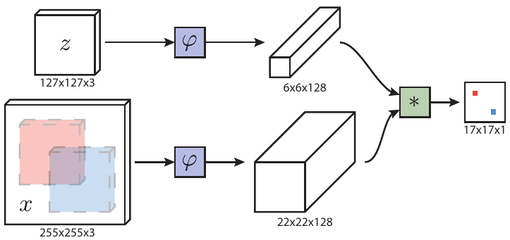

    - **What: fully-convolutional Siamese matching.** Template $z$ 和 search region $x$ 通过共享 CNN $\varphi$ 提特征，再做 cross-correlation 得到 dense response map：

      $$
      f(z, x) = \varphi(z) * \varphi(x) + b
      $$

      其中 $*$ 是 correlation，response map 峰值对应目标中心。

    - **Why: avoid online learning.** 模型在大量视频对上离线训练，测试时只需要第一帧 crop 作为 template，避免每个视频重新 SGD。
    - **How: dense sliding-window in one forward.** 因为网络是 fully-convolutional，search region 中所有候选位置一次前向完成，相当于高效 dense matching。

  - Pipeline:

    1. 第一帧根据 bbox crop template。
    2. 当前帧围绕上一帧位置 crop search region。
    3. Siamese CNN 提取两路 feature 并 cross-correlate。
    4. 取 response map 最大值更新目标中心，并用 multi-scale search 估计尺度。

  - Pros:

    - 结构极简、速度快、奠定 Siamese tracking 主线。
    - 离线训练 + 在线匹配的范式非常适合 arbitrary object tracking。

  - Cons:

    - 主要输出位置响应，bbox 尺度/长宽比建模较弱。
    - Template 基本固定，长期外观变化时容易 drift。

#### SiamRPN

- **High Performance Visual Tracking with Siamese Region Proposal Network**. Bo Li et.al. **CVPR**, **2018**, [(CVF)](https://openaccess.thecvf.com/content_cvpr_2018/html/Li_High_Performance_Visual_CVPR_2018_paper.html).

  - Takeaway:

    SiamRPN 把 Siamese tracking 改成 local one-shot detection：在 Siamese feature 上接 RPN classification branch 和 regression branch，直接预测 anchor 是否为目标以及 bbox offset。

  - Motivation:

    SiamFC 的 response map 更像分类定位，bbox regression 能力不足；如果把 search region 看成局部检测区域，就可以借鉴 Faster R-CNN / RPN 的 anchor classification + regression 思路。

  - Core Mechanism:

    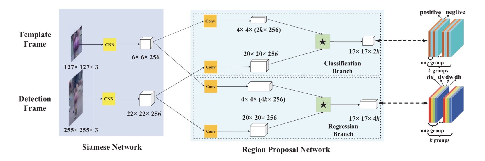

    - **What: Siamese + RPN head.** Siamese subnetwork 提取 template/search 特征，RPN head 分成 classification branch 和 regression branch。
    - **Why: tracking as local detection.** 目标尺度和长宽比不再只靠 response map / multi-scale search，而是由 anchors + bbox regression 显式建模。
    - **How: precompute template branch.** 推理时 template feature 可缓存，correlation layer 可实现成卷积，因此速度很高。训练目标是标准 RPN multi-task loss：

      $$
      L = L_{cls} + \lambda L_{reg}
      $$

  - Pipeline:

    1. 第一帧 crop template 并缓存 template feature。
    2. 每帧 crop search region。
    3. 对 search anchors 做 target/background classification 和 box regression。
    4. 选择最高分 proposal 作为当前目标框。

  - Pros:

    - 比 SiamFC 更自然地处理 scale 和 aspect ratio。
    - 仍然保持很高速度，适合 real-time tracking。

  - Cons:

    - 依赖 anchors 和局部搜索。
    - 遮挡、大位移、出视野后重现仍容易失败。

#### SiamRPN++

- **SiamRPN++: Evolution of Siamese Visual Tracking with Very Deep Networks**. Bo Li et.al. **CVPR**, **2019**, [(CVF)](https://openaccess.thecvf.com/content_CVPR_2019/html/Li_SiamRPN_Evolution_of_Siamese_Visual_Tracking_With_Very_Deep_Networks_CVPR_2019_paper.html).

  - Takeaway:

    SiamRPN++ 解决 Siamese tracker 难以使用 very deep backbone 的问题，使 ResNet-driven Siamese tracking 变得可行。

  - Motivation:

    Siamese tracking 依赖严格 translation invariance，但 deep CNN 的 padding 等操作会破坏这种性质，导致中心偏置和训练不稳定。

  - Core Mechanism:

    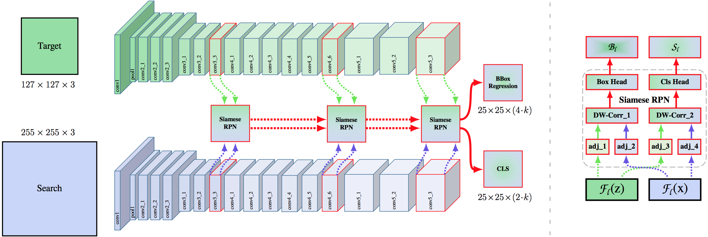

    - **What: deep Siamese tracking.** 使用 ResNet-50 等深层 backbone，并通过 stride / dilation 调整保持 tracking 需要的空间分辨率。
    - **Why: fix translation-invariance breakage.** 深层网络 padding 等操作带来中心偏置，论文用 spatial aware sampling 缓解训练时目标总在中心的问题。
    - **How: depth-wise correlation + layer-wise aggregation.** 不同层分别做 depth-wise correlation，再用可学习权重融合分类和回归结果：

      $$
      S_{all}=\sum_l \alpha_l S_l, \qquad B_{all}=\sum_l \beta_l B_l
      $$

  - Pipeline:

    1. 使用 ResNet 等深层 backbone 提取 template/search 多层特征。
    2. 对多层 feature 做 depth-wise correlation。
    3. 分类分支判断目标，回归分支预测 bbox。
    4. 融合多层预测得到最终结果。

  - Pros:

    - 将 Siamese tracker 带入 deep backbone 时代。
    - Depth-wise correlation 兼顾效果和参数效率。

  - Cons:

    - 仍是 correlation + head 的 two-stream 思路。
    - Template/search 交互主要发生在 backbone 之后。

#### SiamMask

- **Fast Online Object Tracking and Segmentation: A Unifying Approach**. Qiang Wang et.al. **CVPR**, **2019**, [(Arxiv)](https://arxiv.org/abs/1812.05050) [(Code)](https://github.com/foolwood/SiamMask).

  - Takeaway:

    SiamMask 在 Siamese tracker 上增加 binary segmentation branch，使同一个模型可以从第一帧 bbox 出发同时输出 target box、rotated box 和 class-agnostic mask。

  - Motivation:

    VOT 输出 box，VOS 输出 mask，但二者都依赖“给定目标，在后续帧中定位目标”。如果 Siamese tracker 已经学会 target-specific matching，那么 mask branch 可以把定位结果细化到像素级。

  - Core Mechanism:

    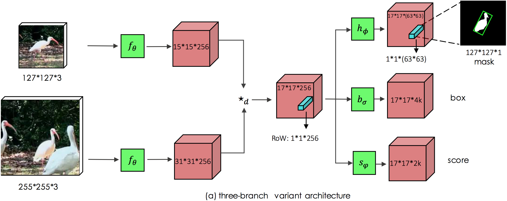

    - **What: add mask branch to Siamese tracking.** 主体仍是 Siamese matching + classification/regression，额外 mask branch 对候选目标区域预测 class-agnostic binary mask。
    - **Why: unify VOT and VOS.** 输入只需要第一帧 bbox，但输出可以包含 bbox、rotated bbox 和 mask，因此把 box tracking 和 semi-supervised VOS 连接起来。
    - **How: joint objective.** 离线训练时同时优化 mask、score 和 box：

      $$
      L_{3B}=\lambda_1L_{mask}+\lambda_2L_{score}+\lambda_3L_{box}
      $$

  - Pipeline:

    1. 用第一帧 bbox 初始化 template。
    2. 当前帧 search region 经过 Siamese backbone 和 correlation。
    3. 分类/回归 head 输出目标位置，mask head 输出目标区域 mask。
    4. 从 mask 也可以进一步得到 rotated bounding box。

  - Pros:

    - 很好地连接 VOT 和 VOS。
    - 可以实时输出 box 和 mask。

  - Cons:

    - Mask quality 依赖 tracking localization。
    - 长期记忆和复杂遮挡处理不如后续 VOS memory methods。

#### TransT

- **Transformer Tracking**. Xin Chen et.al. **CVPR**, **2021**, [(Arxiv)](https://arxiv.org/abs/2103.15436) [(Code)](https://github.com/chenxin-dlut/TransT).

  - Takeaway:

    TransT 用 attention-based feature fusion 替代 Siamese tracker 中常见的简单 correlation，让 template 和 search 之间能进行更强的语义交互。

  - Motivation:

    Cross-correlation 本质是局部线性匹配，表达能力有限，容易陷入局部最优；Transformer 的 self-attention / cross-attention 可以建模更丰富的 template-search relation。

  - Core Mechanism:

    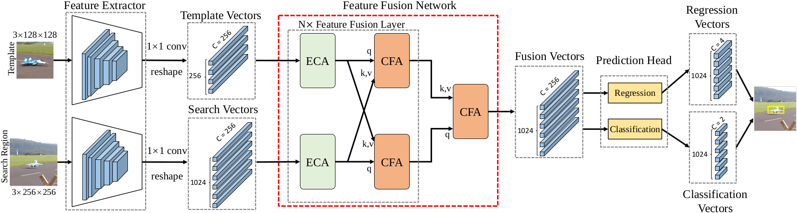

    - **What: attention feature fusion.** Ego-context augment module 分别对 template/search feature 做 self-attention；cross-feature augment module 在两者之间做 cross-attention。
    - **Why: correlation is too local.** 简单 correlation 只做局部线性匹配，难以表达更高层语义关系。
    - **How: Transformer attention.** 核心 attention 形式为：

      $$
      \mathrm{Attention}(Q,K,V)=\mathrm{softmax}\left(\frac{QK^T}{\sqrt{d}}\right)V
      $$

      融合后的 feature 接 classification + regression head 输出目标框。

  - Pipeline:

    1. CNN backbone 分别提取 template/search feature。
    2. 用 self-attention 建模各自上下文。
    3. 用 cross-attention 进行 template-search fusion。
    4. 预测 target confidence 和 bbox。

  - Pros:

    - 从 correlation 过渡到 attention fusion，是 Transformer tracker 的重要起点。
    - Template-search 语义交互比局部相关更强。

  - Cons:

    - 仍是先双流提特征、再单独 relation modeling 的 two-stage 结构。
    - 时序历史建模仍较弱。

#### STARK

- **Learning Spatio-Temporal Transformer for Visual Tracking**. Bin Yan et.al. **ICCV**, **2021**, [(Arxiv)](https://arxiv.org/abs/2103.17154) [(Code)](https://github.com/researchmm/Stark).

  - Takeaway:

    STARK 将 tracking 建模成 spatio-temporal transformer 上的 direct bounding box prediction，不使用 anchors、proposals、cosine window 或 box smoothing。

  - Motivation:

    传统 Siamese tracker 往往需要很多 hand-crafted post-processing；同时，长期跟踪需要利用历史模板和当前搜索区域之间的时空关系。

  - Core Mechanism:

    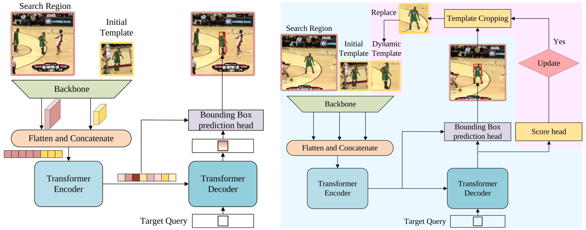

    - **What: encoder-decoder spatio-temporal tracker.** Encoder 建模 initial template、dynamic template 和 search region 之间的全局时空依赖；decoder 用 learned query 读取目标相关信息。
    - **Why: simplify tracking pipeline.** 直接 box prediction 可以去掉 anchors、proposal、cosine window 和 box smoothing 等手工后处理。
    - **How: corner-based direct prediction.** Box head 估计目标框角点，训练用 IoU loss + L1 loss，并用 score head 控制 dynamic template update。

  - Pipeline:

    1. 输入 initial template、dynamic template 和当前 search image。
    2. Backbone 提取特征后送入 encoder 做时空关系建模。
    3. Decoder 用 learned query 读取目标相关信息。
    4. Box head 直接输出目标框。

  - Pros:

    - Tracking pipeline 更接近 DETR 式 end-to-end prediction。
    - 显式引入 spatio-temporal modeling 和 dynamic template。

  - Cons:

    - 相比纯 one-stream ViT，结构仍包含较清晰的 encoder-decoder relation stage。
    - Dynamic template 仍需要可靠 score 控制，否则可能引入 drift。

#### MixFormer

- **MixFormer: End-to-End Tracking with Iterative Mixed Attention**. Yutao Cui et.al. **CVPR Oral**, **2022**, [(Arxiv)](https://arxiv.org/abs/2203.11082) [(Code)](https://github.com/MCG-NJU/MixFormer).

  - Takeaway:

    MixFormer 用 Mixed Attention Module 同步完成 feature extraction 和 target information integration，是 one-stream tracker 的关键过渡。

  - Motivation:

    之前 tracker 常把 feature extraction、target-search interaction 和 box estimation 拆成多阶段，导致 search feature 在早期并不 target-aware。

  - Core Mechanism:

    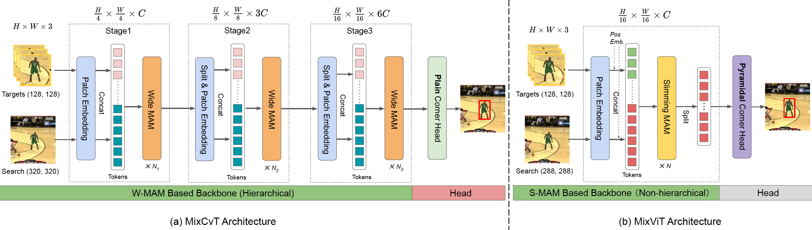

    - **What: Mixed Attention Module.** MAM 同时处理 template tokens 和 search tokens，让 feature extraction 和 target information integration 同步发生。
    - **Why: make search features target-aware earlier.** 目标信息不再等 backbone 提完特征后才融合，而是在每层 attention 中逐步注入。
    - **How: asymmetric mixed attention.** Template 和 search 的 key/value 拼接后参与 attention，search branch 可用 asymmetric design 降低成本：

      $$
      k_m=\mathrm{Concat}(k_t,k_s), \qquad
      \mathrm{Attn}_t=\mathrm{softmax}\left(\frac{q_tk_m^T}{\sqrt{d}}\right)v_m
      $$

      Score prediction module 负责选择可靠 online templates。

  - Pipeline:

    1. 将 template 和 search patches 输入堆叠的 MAM。
    2. 每层同时做特征抽取和 template-search communication。
    3. 用 localization head 预测 bbox。
    4. 在线 tracking 中根据 score 选择或更新模板。

  - Pros:

    - 将 relation modeling 前移到 backbone 内部。
    - 兼顾 one-stream interaction 和动态模板选择。

  - Cons:

    - Mixed attention 设计较专门。
    - 结构不如后续纯 ViT one-stream 简洁。

#### OSTrack

- **Joint Feature Learning and Relation Modeling for Tracking: A One-Stream Framework**. Botao Ye et.al. **ECCV**, **2022**, [(Arxiv)](https://arxiv.org/abs/2203.11991) [(Code)](https://github.com/botaoye/OSTrack).

  - Takeaway:

    OSTrack 是经典 one-stream ViT tracker：把 template 和 search image pairs 在同一个 Transformer 中连接起来，用双向信息流统一 feature learning 和 relation modeling。

  - Motivation:

    Two-stream / two-stage tracker 先分开提特征再做关系建模，导致 backbone feature 缺少 target awareness，目标与背景可分性有限。

  - Core Mechanism:

    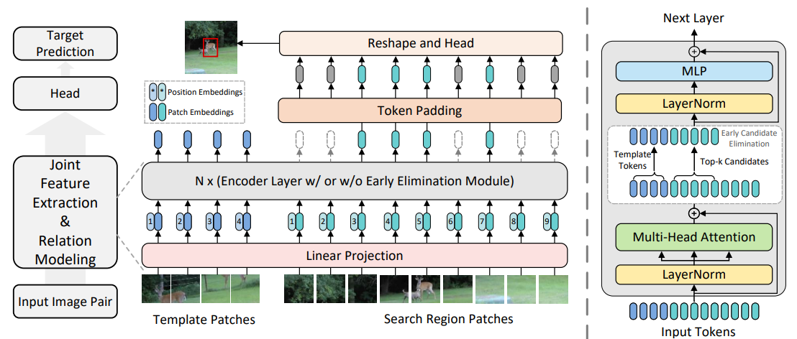

    - **What: one-stream ViT tracking.** Template tokens 与 search tokens 拼接后在同一个 ViT 中共同 self-attention，双向信息流同时做 feature learning 和 relation modeling。
    - **Why: avoid target-agnostic backbone features.** Two-stream tracker 的 search feature 在 backbone 阶段看不到 template，OSTrack 让 search feature 从早期就被 template 引导。
    - **How: early candidate elimination.** 根据 one-stream 内部 similarity prior 提前删掉低价值 search tokens，减少后续 attention 计算。Tracking head 输出 classification map、offset 和 size。

  - Pipeline:

    1. Patchify template 和 search image。
    2. 拼接 token 并加入位置/区域信息。
    3. 经过 one-stream ViT 进行双向信息交互。
    4. 对 search tokens 接 tracking head 预测 bbox。

  - Pros:

    - One-stream tracking 的代表框架。
    - 结构简洁、收敛快、性能/速度平衡好。

  - Cons:

    - 原始形式主要融合 template-search 空间关系。
    - 长时序 memory 和可靠历史状态建模仍需后续工作补充。

### VOS

#### OSVOS

- **One-Shot Video Object Segmentation**. Sergi Caelles et.al. **CVPR**, **2017**, [(Arxiv)](https://arxiv.org/abs/1611.05198).

  - Takeaway:

    OSVOS 定义了 semi-supervised VOS 的经典 one-shot pipeline：给定第一帧 mask，模型通过 test-time fine-tuning 学习当前视频目标外观，然后独立分割后续帧。

  - Motivation:

    VOS 需要 segment 一个“任意目标”，类别不固定；因此模型既要有通用 foreground segmentation 能力，又要能快速适配第一帧指定目标。

  - Core Mechanism:

    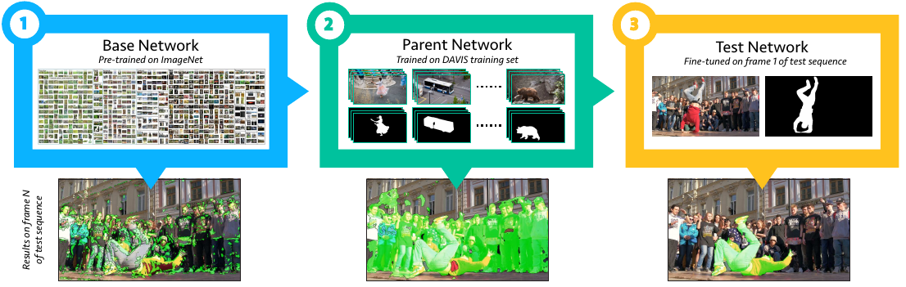

    - **What: three-stage transfer.** ImageNet semantic features -> DAVIS foreground parent network -> 测试视频第一帧 one-shot fine-tuning。
    - **Why: arbitrary target adaptation.** 类别不固定时，第一帧 mask 是最直接的 target-specific supervision。
    - **How: class-balanced pixel loss.** Foreground/background 极不平衡，所以使用 class-balanced cross entropy：

      $$
      \ell=-\beta\sum_{j\in Y_+}\log P(y_j=1|X)
      -(1-\beta)\sum_{j\in Y_-}\log P(y_j=0|X)
      $$

      每帧独立预测 mask，时序一致性主要来自稳定的 target-specific appearance model。

  - Pipeline:

    1. 预训练一个 FCN-style foreground segmentation network。
    2. 测试时用第一帧 mask 对网络做 one-shot fine-tuning。
    3. 对后续每帧独立前向得到目标 mask。

  - Pros:

    - 早期强基线，明确了 first-frame mask supervision 的任务范式。
    - 不依赖 optical flow 或 recurrent module，概念清楚。

  - Cons:

    - Test-time fine-tuning 慢。
    - 不显式利用帧间时序信息。

#### FEELVOS

- **FEELVOS: Fast End-to-End Embedding Learning for Video Object Segmentation**. Paul Voigtlaender et.al. **CVPR**, **2019**, [(Arxiv)](https://arxiv.org/abs/1902.09513).

  - Takeaway:

    FEELVOS 用 pixel-wise embedding + global/local matching 传播第一帧和上一帧信息，去掉了 OSVOS 式在线 fine-tuning。

  - Motivation:

    许多 VOS 方法效果强但流程复杂、依赖第一帧 fine-tuning 或速度较慢；FEELVOS 希望端到端训练一个快速可用的 matching-based VOS。

  - Core Mechanism:

    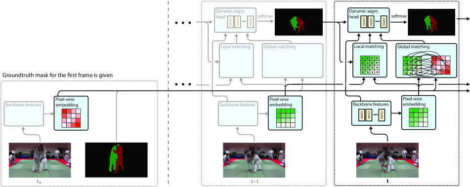

    - **What: embedding as soft guidance.** Pixel embedding 不直接做 nearest-neighbor label，而是生成 matching cues 供 segmentation head 使用。
    - **Why: combine long-term identity and short-term continuity.** Global matching 对第一帧保持身份一致，local matching 对上一帧附近区域保持运动连续。
    - **How: global/local matching distance.** 像素 $p,q$ 的 embedding distance 被转换成相似 cue：

      $$
      d(p,q)=1-\frac{2}{1+\exp(\lVert e_p-e_q\rVert^2)}
      $$

      Global cue 可写为 $G_{t,o}(p)=\min_{q\in\mathcal{P}_{1,o}} d(p,q)$，local cue 类似但只在上一帧局部窗口内搜索。

  - Pipeline:

    1. 编码第一帧、上一帧和当前帧的 pixel embeddings。
    2. 对当前帧执行 global first-frame matching 和 local previous-frame matching。
    3. 将 matching maps 与图像特征送入 segmentation head。
    4. 输出当前帧每个目标的 mask。

  - Pros:

    - 无需 test-time fine-tuning。
    - 同时利用 first-frame identity 与 previous-frame continuity。

  - Cons:

    - Matching 主要依赖 embedding 距离。
    - 面对长时遮挡或大外观变化仍有限。

#### STM

- **Video Object Segmentation using Space-Time Memory Networks**. Seoung Wug Oh et.al. **ICCV**, **2019**, [(Arxiv)](https://arxiv.org/abs/1904.00607).

  - Takeaway:

    STM 是 VOS memory-network 里程碑：把过去帧图像和 mask 作为 external memory，当前帧作为 query，通过 dense space-time matching 读出目标信息。

  - Motivation:

    VOS 的可用线索会随着视频推理不断增加，但早期方法通常只用第一帧或上一帧，无法充分利用所有可靠历史信息。

  - Core Mechanism:

    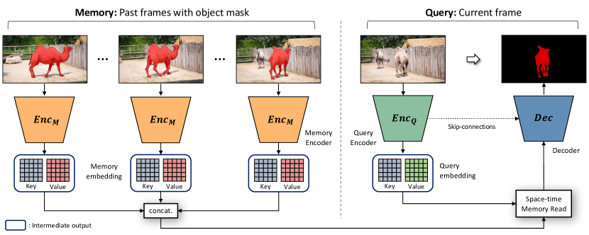

    - **What: external space-time memory.** Memory encoder 把历史 frame + mask 编成 memory keys / values；query encoder 把当前 frame 编成 query key/value。
    - **Why: exploit all available guidance.** 推理过程中历史预测越来越多，STM 允许当前帧从所有可靠历史帧中读信息，而不是只看第一帧或上一帧。
    - **How: dense memory read.** Query pixel 与所有 memory space-time locations 匹配，再加权读取 memory values：

      $$
      \mathbf{y}_i=
      \left[
      \mathbf{v}^{Q}_i,
      \frac{1}{Z}\sum_j f(\mathbf{k}^{Q}_i,\mathbf{k}^{M}_j)\mathbf{v}^{M}_j
      \right]
      $$

      其中 $j$ 遍历 memory 中所有时空位置，读出的 memory value 和当前 query value 一起送入 decoder。

  - Pipeline:

    1. 将第一帧 GT mask 写入 memory。
    2. 当前帧作为 query，与 memory 中所有历史位置匹配。
    3. 读取 memory values 并和当前帧 feature 融合。
    4. Decoder 输出当前帧 mask，并可把预测结果继续写入 memory。

  - Pros:

    - 充分利用历史帧。
    - 对 appearance change 和 occlusion 更鲁棒。

  - Cons:

    - Memory size 随时间增长。
    - Per-object mask encoding 和 dense matching 成本较高。

#### STCN

- **Rethinking Space-Time Networks with Improved Memory Coverage for Efficient Video Object Segmentation**. Ho Kei Cheng et.al. **NeurIPS**, **2021**, [(Arxiv)](https://arxiv.org/abs/2106.05210) [(Project)](https://hkchengrex.github.io/STCN/).

  - Takeaway:

    STCN 重新审视 STM，直接建立 frame-to-frame correspondence，避免每个目标反复编码 mask features，并用 diversified voting 改善 memory coverage。

  - Motivation:

    STM 的 inner-product affinity 会让少数 memory nodes 长期主导投票，导致 memory 使用不充分；同时多目标时 per-object processing 成本高。

  - Core Mechanism:

    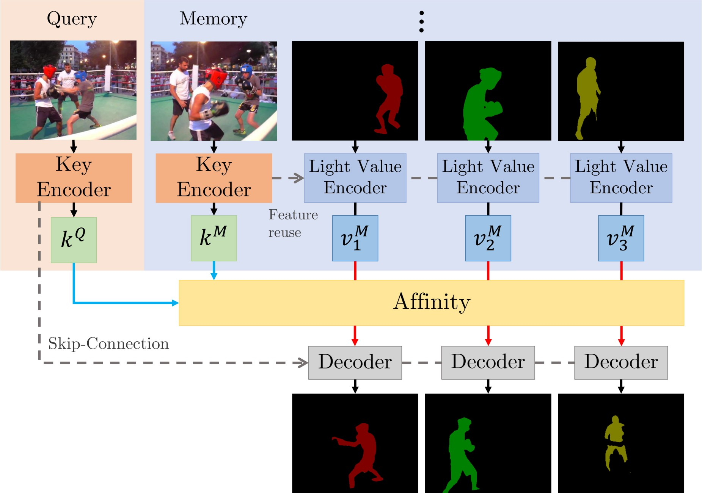

    - **What: image-to-image correspondence.** Key encoder 是 Siamese 且 mask-independent，因此一个 affinity matrix 可以被多个目标共享。
    - **Why: improve memory coverage.** Dot-product affinity 容易让少数 memory nodes 主导投票，STCN 用 L2 similarity 让更多 memory nodes 有机会贡献。
    - **How: diversified voting.** Memory read 权重为 $\mathbf{W}_{ij}=\frac{\exp(\mathbf{S}_{ij})}{\sum_n\exp(\mathbf{S}_{nj})}$，其中核心 similarity 改成：

      $$
      s(k_i^Q, k_j^M) = -\lVert k_i^Q - k_j^M \rVert_2^2
      $$

  - Pipeline:

    1. 编码当前 frame key 和 memory frame keys。
    2. 计算 query-memory correspondence。
    3. 从历史 mask/value 中聚合信息。
    4. Decoder 输出当前多目标 mask。

  - Pros:

    - 比 STM 更高效，multi-object 推理速度更好。
    - Memory 使用更均匀。

  - Cons:

    - 仍属于 memory matching 框架。
    - 超长视频需要进一步 memory management。

#### AOT

- **Associating Objects with Transformers for Video Object Segmentation**. Zongxin Yang et.al. **NeurIPS**, **2021**, [(Arxiv)](https://arxiv.org/abs/2106.02638).

  - Takeaway:

    AOT 用 identification mechanism 把多个目标关联到同一个高维 embedding space，并用 Long Short-Term Transformer 做层次化 matching 和 propagation。

  - Motivation:

    很多 VOS 方法在多目标场景下需要逐个目标匹配和解码，计算量随目标数线性增长；AOT 希望像处理单目标一样同时处理多个对象。

  - Core Mechanism:

    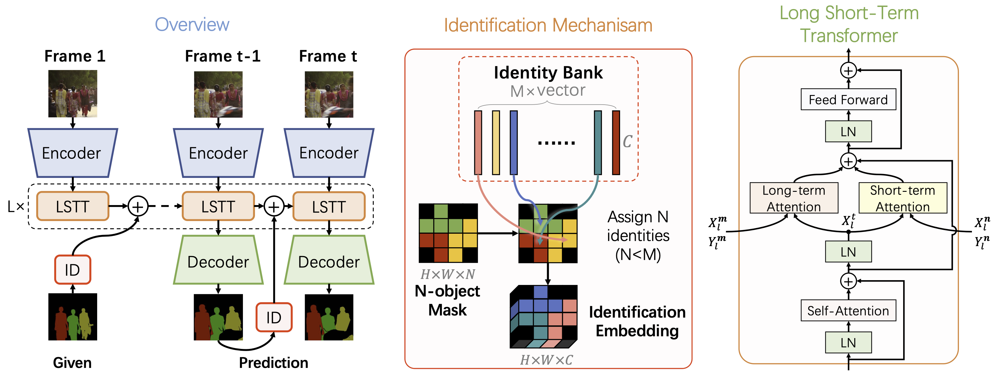

    - **What: ID-aware multi-object propagation.** AOT 给不同对象注入 identification embedding，使多个目标可以在同一 embedding space 中同时匹配和解码。
    - **Why: avoid per-object repeated decoding.** 多目标不再逐个目标运行完整 segmentation pipeline，速度更接近单目标处理。
    - **How: ID embedding + LSTT.** Identification embedding 可写成：

      $$
      E=ID(Y,D)=YPD
      $$

      Long Short-Term Transformer 同时建模 long-term memory attention 和 short-term local attention。

  - Pipeline:

    1. 从第一帧 masks 构建多目标 identification embeddings。
    2. 对当前帧和历史信息做 transformer propagation。
    3. 在统一 embedding space 中区分并输出多个目标 mask。

  - Pros:

    - 多目标 VOS 效率高。
    - Transformer association 强化 identity consistency。

  - Cons:

    - 结构比 STM/STCN 更复杂。
    - 性能依赖 ID embedding 与 propagation 设计。

#### XMem

- **XMem: Long-Term Video Object Segmentation with an Atkinson-Shiffrin Memory Model**. Ho Kei Cheng et.al. **ECCV**, **2022**, [(Arxiv)](https://arxiv.org/abs/2207.07115) [(Project)](https://hkchengrex.github.io/XMem).

  - Takeaway:

    XMem 面向 long-term VOS，借鉴 Atkinson-Shiffrin memory model，将 memory 分成 sensory memory、working memory 和 long-term memory，避免长视频中 memory 爆炸。

  - Motivation:

    单一 memory store 会把 memory consumption 和 accuracy 绑死：存太少会忘，存太多会慢。长视频需要更像人类记忆一样进行短期缓存和长期压缩。

  - Core Mechanism:

    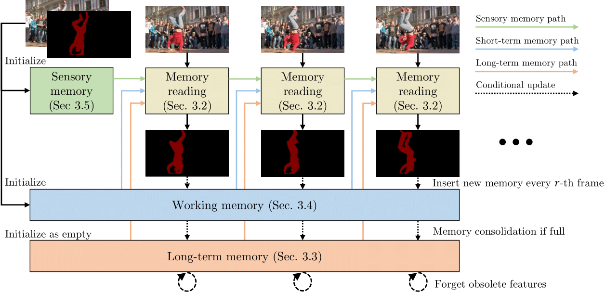

    - **What: three memory stores.** Sensory memory 快速更新，working memory 保留高分辨率近期特征，long-term memory 保存紧凑 prototypes。
    - **Why: long videos need memory management.** 单一 memory store 要么忘得快，要么无限增长；XMem 把短期细节和长期稳定性拆开。
    - **How: memory read and potentiation.** Memory read 可写成：

      $$
      \mathbf{F}=\mathbf{v}\mathbf{W}(\mathbf{k},\mathbf{q})
      $$

      Memory potentiation 会把活跃 working memory elements consolidation 到 long-term memory，避免长视频性能衰减。

  - Pipeline:

    1. 当前帧读取 sensory/working/long-term memories。
    2. 结合 memory readout 和当前图像特征预测 mask。
    3. 将新结果写入 sensory/working memory。
    4. 定期把常用 working memory 压缩进 long-term memory。

  - Pros:

    - 适合长视频。
    - Memory 结构清晰，兼顾短期细节和长期稳定性。

  - Cons:

    - Memory policy 增加系统复杂度。
    - 错误预测写入 memory 后仍可能传播。

#### Cutie

- **Putting the Object Back into Video Object Segmentation**. Ho Kei Cheng et.al. **CVPR Highlight**, **2024**, [(Arxiv)](https://arxiv.org/abs/2310.12982) [(Project)](https://hkchengrex.github.io/Cutie).

  - Takeaway:

    Cutie 从 bottom-up pixel-level memory reading 转向 top-down object-level memory reading，用 object queries 表示目标，再和高分辨率 pixel features 交互。

  - Motivation:

    Pixel-level matching 在 distractors 多、目标相似或遮挡时容易受噪声干扰；VOS 需要把“对象”作为高层单位重新放回 memory reading 中。

  - Core Mechanism:

    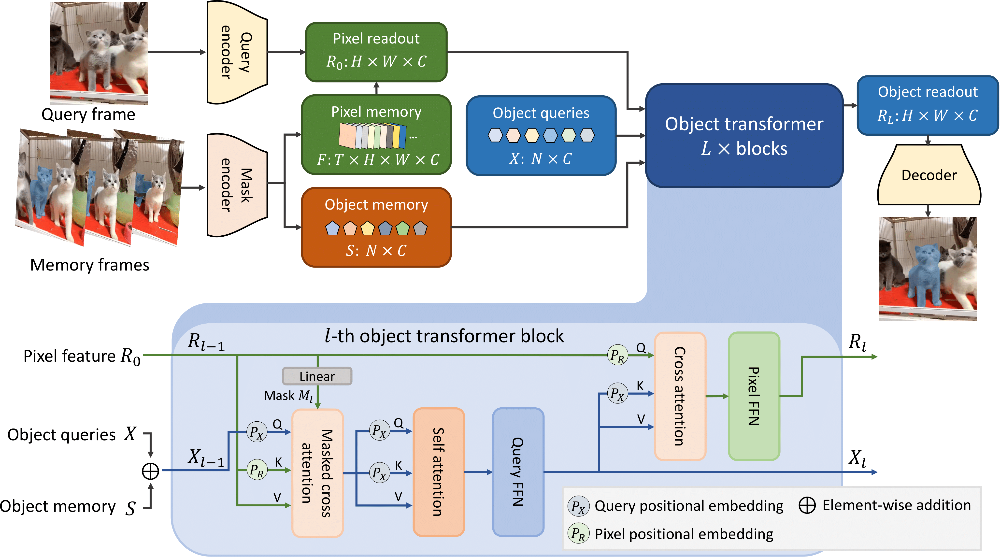

    - **What: object-level memory reading.** Object queries 作为 target object 的高层摘要，从 memory 中读取 object-level representation，同时保留 pixel memory 负责细节。
    - **Why: pixel matching is noisy.** Distractors 多或目标相似时，bottom-up pixel-level readout 容易被局部噪声干扰。
    - **How: masked object transformer.** Foreground/background masked cross-attention 强制 query 更干净地关注前景或背景：

      $$
      X'_l=\mathrm{softmax}(\mathcal{M}_l+Q_lK_l^T)V_l+X_l
      $$

      Object queries 与 high-resolution pixel features 迭代交互后再解码 mask。

  - Pipeline:

    1. 从 memory 中读取目标相关 object queries。
    2. Object transformer 将 query-level target information 注入当前帧 pixel features。
    3. 结合高分辨率 feature 输出精细 mask。
    4. 将可靠结果写回 memory 供后续帧使用。

  - Pros:

    - 对 distractors 更鲁棒。
    - Object-level abstraction 与 pixel-level detail 结合得更好。

  - Cons:

    - 已经属于较新的强模型，理解成本高于 STM/STCN。
    - 仍依赖 memory quality。

## Expansion Notes

- VOT 后续可以继续补充 SeqTrack / ARTrack 这类 **tracking as sequence generation** 路线，以及 Uni-MDTrack、STDTrack 等 **one-stream + temporal memory / dynamic state** 的新工作。
- VOS 后续可以继续补充 SAM 2，把 promptable foundation segmentation 与 streaming video memory 联系起来。
- 如果要更系统地覆盖 MOT，可以另补 SORT、DeepSORT、FairMOT、ByteTrack、BoT-SORT、OC-SORT 等 tracking-by-detection 主线。
