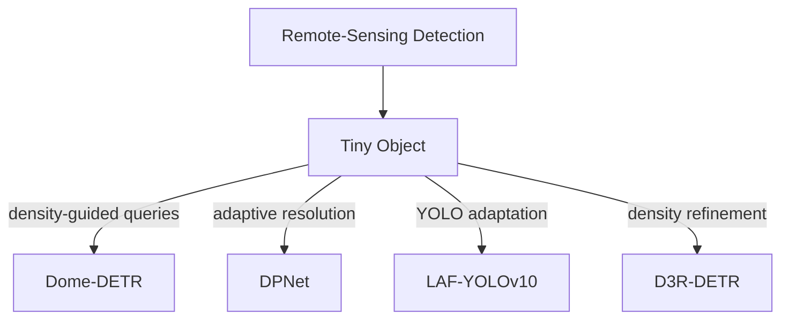

# Remote-Sensing Detection

[TOC]

## Task Definition

Remote-Sensing Detection / Aerial Detection 关注高空、遥感或无人机场景中的目标检测。这类场景通常包含 tiny objects、dense clusters、large scale variation 和 domain-specific backgrounds。

## Paper Matrix

| Paper | 为什么放入这个任务 | 在任务中的作用 | 详细笔记 |
| --- | --- | --- | --- |
| Dome-DETR | 使用 density-guided feature/query manipulation 处理 tiny aerial objects。 | Density-aware DETR route | [03-4-Small-Object](03-4-Small-Object.md) |
| DPNet | 预测 image-dependent resolution / down-sampling factor。 | Adaptive resolution route | [03-4-Small-Object](03-4-Small-Object.md) |
| LAF-YOLOv10 | 将 YOLOv10-style detection 与小目标模块结合，用于 UAV imagery。 | UAV-specific detector modification | [03-4-Small-Object](03-4-Small-Object.md) |
| D3R-DETR | 使用 dual-domain density refinement 处理 tiny aerial objects。 | Density-refinement route | [03-4-Small-Object](03-4-Small-Object.md) |

## Relation

## Open Questions

- 哪些 remote-sensing 方法是真正 task-specific，而不只是 generic small-object tricks？
- scale distribution 应该如何影响 preprocessing 和 model design？
