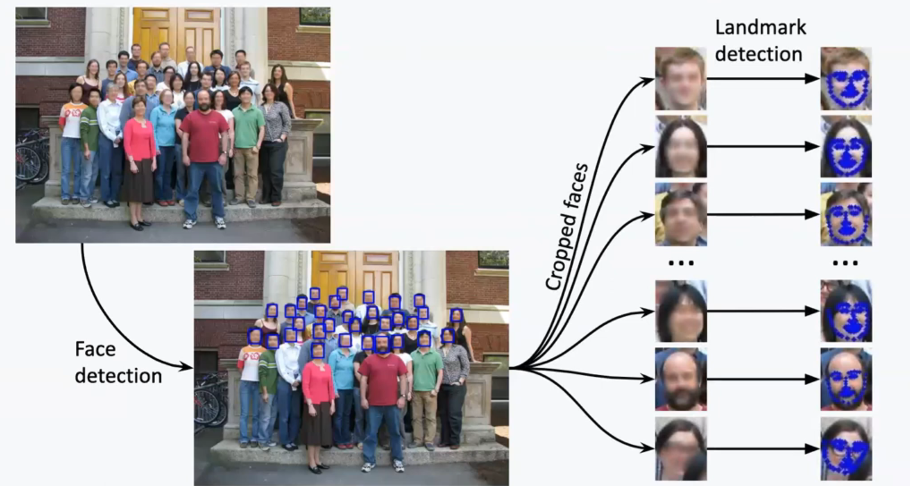
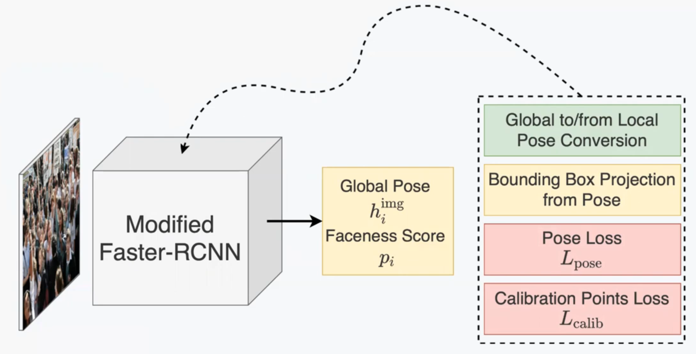
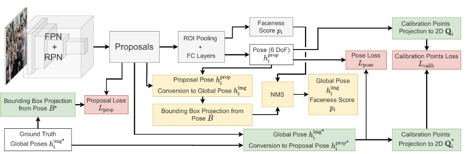
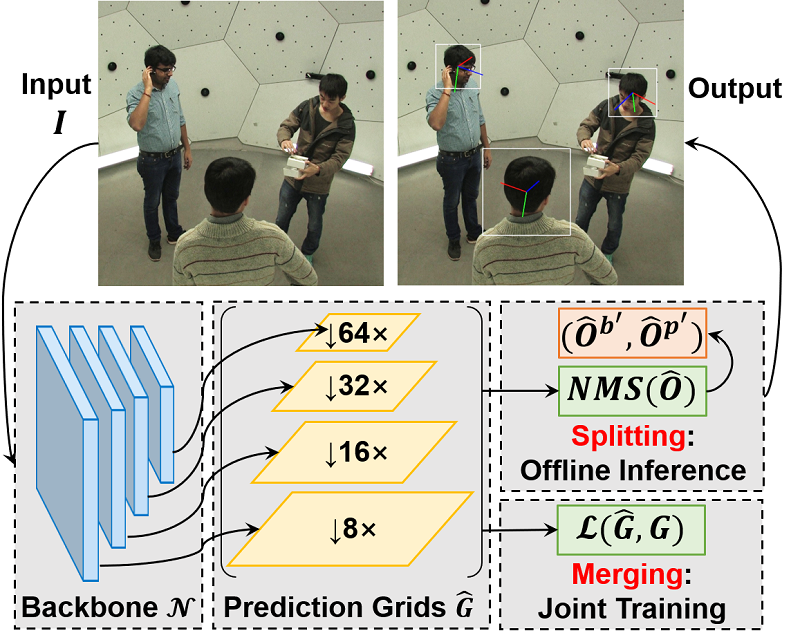
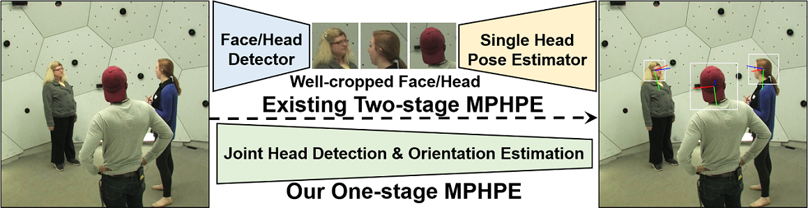
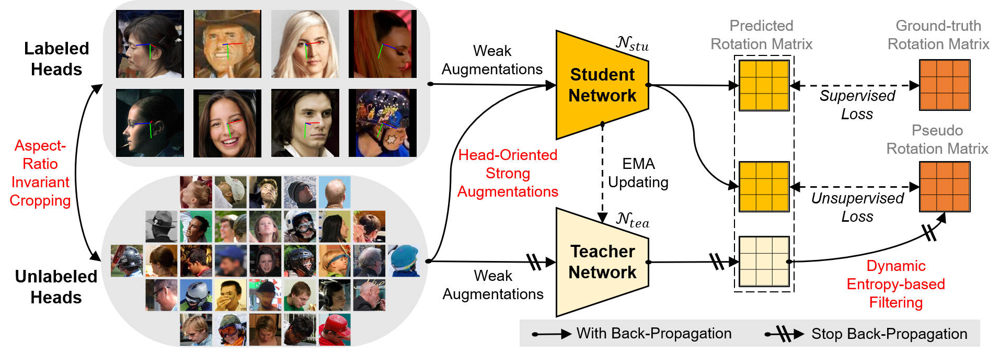
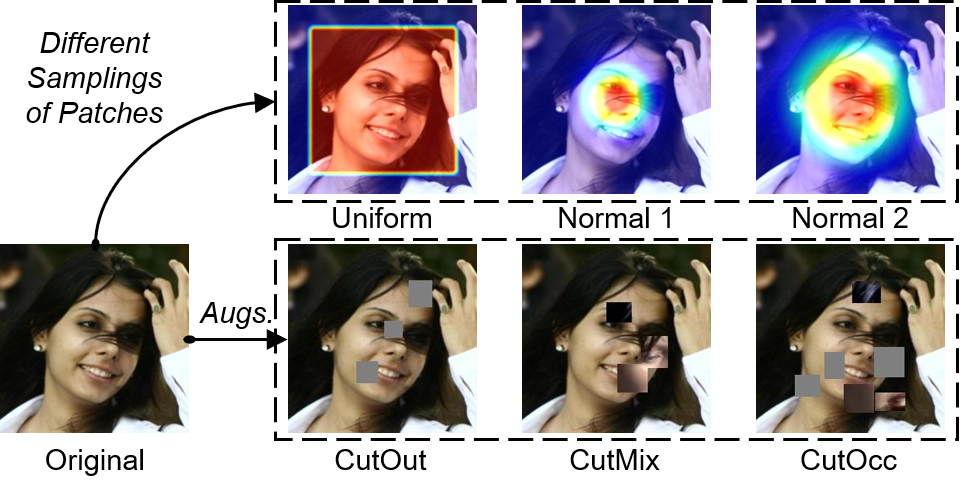
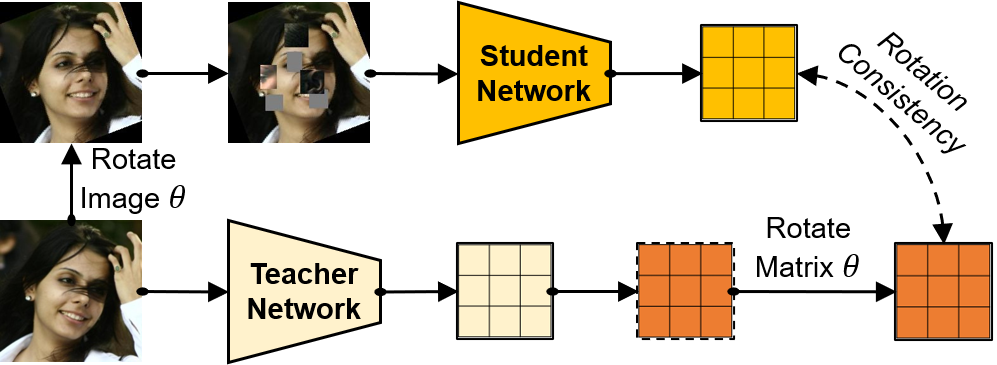

# Pose Estimation

姿态估计

## Intro

- 多阶段:回归关键点然后pnp求解

- 回归euler angle:不连续,有万向节死锁

- 回归quaternion:先回归再归一化

   1. 单位范数:需要归一化

   2. 符号二义性:q和-q代表同一旋转

   3. 损失设计问题:因为符号二义性问题,常用以下的loss

      ```
      min(
        ||q_pred - q_gt||,
        ||q_pred + q_gt||
      )
      ```

      或者直接用 angular / geodesic loss：

      ```
      L = 2 arccos(|q_pred · q_gt|)
      ```

   Cons

   - 仍然没有解决不连续的问题:why???对于 3D rotation，Euler angles 和 quaternions 这类 4 维及以下的表示在欧氏空间中仍存在不连续问题，而 5D / 6D 表示更适合 neural network 学习

- rotation vector

   loss算L2距离也可以，但是真正关心的是两个旋转在 SO(3) 上的角距离。更几何的做法通常是
   $$
   L_R=\arccos\left(\frac{\mathrm{tr}(R_{pred}^T R_{gt})-1}{2}\right)
   $$
   也就是把两个 rotation vector 都转成 rotation matrix，再计算它们之间的 geodesic distance

- 6D rotation representation

   这 6 个数可以看成两个 3D 向量：$a_1=(x_1,y_1,z_1),\quad a_2=(x_2,y_2,z_2)$

   也就是：网络输出：[x1, y1, z1, x2, y2, z2]。这两个向量可以理解为 rotation matrix 的前两列的“未正交化版本”。

   然后通过 Gram-Schmidt 正交化，把它们变成 rotation matrix 的前两列：
   $$
   b_1=\frac{a_1}{\|a_1\|},\quad b_2=\frac{a_2-(b_1^T a_2)b_1}{\|a_2-(b_1^T a_2)b_1\|},\quad b_3=b_1\times b_2 \\
   R=[b_1\; b_2\; b_3]
   $$


| 表示方式                   | 优点                              | 问题                                                    |
| -------------------------- | --------------------------------- | ------------------------------------------------------- |
| Euler angle                | 直观，方便评估 yaw / pitch / roll | 万向节锁，不连续，角度周期问题                          |
| Rotation vector            | 紧凑，适合 Rodrigues 转换         | 大角度时也可能不稳定,对神经网络来说不一定是最连续的表示 |
| Quaternion                 | 避免万向节锁，归一化后合法        | q 和 -q 等价，仍有不连续问题                            |
| Rotation matrix            | 几何意义清楚                      | 9 个数有冗余，需要正交约束                              |
| 6D rotation representation | 训练更连续，适合深度网络          | 不如 quaternion 直观                                    |

## Papers

### img2pose

- **img2pose: Face Alignment and Detection via 6DoF, Face Pose Estimation**. Vítor Albiero et.al. **CVPR**, **2021**, [(Arxiv)](https://arxiv.org/abs/2012.07791) [(S2)](https://www.semanticscholar.org/paper/8968f0db1546559866a33b24f130bd8b375b3dca) (Citations __154__) ([My PDF](https://drive.google.com/file/d/1HN_iAoG4W2sMio2zAkNeuWbggTsDvUMe/view?usp=drivesdk))

  - Takeaway:

    img2pose 把 multi-face alignment / detection 改写成 **whole-image 6DoF face pose regression**：不先跑 face detector，也不先定位 landmarks，而是直接预测每张脸的 rotation + translation。预测 pose 又能投影回 2D box，因此 detection 成为 pose estimation 的副产物。

  - Prior

    traditional pose detection pipeline

    
  
  - Motivation:

    传统 pipeline 通常是 `face detection -> landmark detection -> PnP / alignment`，串行模块之间强耦合：detector box 分布一变，landmark model 也可能要重调；tiny faces 上精确回归 landmarks 也更难。希望简化这个pipeline

  - Core Mechanism:

    overview:
  
    
  
    
  
    > [!NOTE]
    >
    > 看懂图就行了
    >
    > - 红色代表loss
    >
    > - 绿色代表中间的一些坐标转换操作
    >
    > - 黄色代表推理阶段的输出
    >
    >   因为要转换为bbox才能做NMS,所以中间多了几步
    >
    > 不同的坐标的表示见后面的介绍
  
    - 直接输出3D face pose for all faces
  
      - **What: direct 6DoF pose head.** 每个 face 输出 $h_i^{prop}=(r_x,r_y,r_z,t_x,t_y,t_z)$

        > [!TIP]
        >
        > 这里的r是轴角表示rotation vector也叫axis-angle / Rodrigues vector
  
      - **Why: pose can replace box and landmark supervision.** 给定 3D face points $P$、camera intrinsic $K$、pose 中恢复出的 $R,t$，可以把 3D face 投影到图像：
        $$
        [Q,1]^T \sim K[R,t][P,1]^T
        $$
        投影点 $Q$ 的外接框就是 2D face box。训练时，论文用 ground-truth pose 投影得到的 box $B^*$ 监督 proposal loss；推理时，再把预测 pose 投影成 box 做 NMS 与 face detection。这样 bbox 不再是主预测目标，而是 pose geometry 的派生量byproduct。

    - an efficient pose conversion method

      - **Why: proposal / image pose conversion.** two-stage detector 的 pose head 看到的是 proposal crop，而 6DoF translation 会随 crop center 与 crop scale 改变；若直接把全图 pose label 塞给 crop head，监督坐标系就不一致。
  
      - **Coordinate frames and matrices.**
  
        符号说明
  
        - $P \in \mathbb{R}^{3 \times n}$：canonical 3D face model 上的点，坐标在 **face/object coordinate** 中。
        - $[R,t]$：extrinsic pose，把 3D face points 从 **face/object coordinate** 变到 **camera coordinate**。这里直接R,t直接从pose得来 $R=(r_x,r_y,r_z)$，$t=(t_x,t_y,t_z)$。
        - $K$：intrinsic matrix，把 **camera coordinate** 中的 3D point 投影到某个 **2D pixel coordinate frame**。
  
        $$
        P_{face}\xrightarrow{[R,t]}P_{cam}\xrightarrow{K}Q_{pixel}
        $$
  
        对整张图来说，$K_{img}$ 的 principal point 是 full image center，大致表示“把 3D face 投影到原图像素坐标”。对 proposal/crop 来说，$K_{box}$ 表示“把同一个 3D face 投影到这个 proposal 对应的局部视角/裁剪视角”。因此 $K_{img}$ 和 $K_{box}$ 的差别主要来自：
  
        - **scale 不同**：proposal crop 里脸被放大了，所以同一个 $t_z$ 在 crop frame 下会被解释成离 camera 更近。
        - **principal point 不同**：crop 的中心不是整张图的中心，所以 $x,y$ 方向 translation 的含义会变。
  
        更具体地说，如果整图大小是 $(w,h)$，proposal box 是 $B=(x,y,w_{bb},h_{bb})$，那么可以把它们理解成：
  
        $$
        K_{img} =
        \begin{bmatrix}
        w+h & 0 & w/2 \\
        0 & w+h & h/2 \\
        0 & 0 & 1
        \end{bmatrix}
        $$
  
        $$
        K_{box} \approx
        \begin{bmatrix}
        w_{bb}+h_{bb} & 0 & x+w_{bb}/2 \\
        0 & w_{bb}+h_{bb} & y+h_{bb}/2 \\
        0 & 0 & 1
        \end{bmatrix}
        $$
  
        > [!TIP]
        >
        > 这里 $K_{box}$ 的 principal point 写成 $x+w_{bb}/2,y+h_{bb}/2$，是为了把 proposal/crop 的观察中心放回 full-image reference 下比较；如果只在 crop-local pixel coordinate 里看，它的中心就是 $(w_{bb}/2,h_{bb}/2)$。
  
        - **How:** 论文为原图和 crop 构造各自的 intrinsic matrix，在训练时把 global pose label 转成 proposal pose，在推理时把 proposal pose 转回 global pose。local-to-global conversion 的核心是先按 crop scale 调整深度，再用 $K_{box}$ 与 $K_{img}$ 平移 focal point： 
          $$
          \begin{aligned}
          t_z &\leftarrow t_z \frac{w+h}{w_{bb}+h_{bb}}, \\
          \mathbf{V} &= K_{box}[t_x,t_y,t_z]^T,\qquad \mathbf{t}' = K_{img}^{-1}\mathbf{V}, \\
          R' &= K_{img}^{-1}K_{box}R
          \end{aligned}
          $$
  
          这一转换保证同一张脸在 proposal crop 与原图 frame 下的 pose 语义一致，是 whole-image direct regression 能成立的关键。
  
          > [!NOTE]
          >
          > $\mathbf{V}=K_{box}[t_x,t_y,t_z]^T$ 可以理解为：先把 proposal-frame 下的 3D translation 投到“由 proposal camera 定义的像素射线/齐次像素坐标”里；再用 $K_{img}^{-1}\mathbf{V}$ 把这个像素射线反解回 full-image camera coordinate 下的 translation。$R'=K_{img}^{-1}K_{box}R$ 是类似的方向校正：它把 rotation 从 crop camera 的观察方向改写到 full-image camera 的观察方向。
          
          > [!WARNING]
          >
          > 投影时大致满足：
          >
          > $$
          >   u = f_x \frac{X}{Z} + c_x,\qquad v = f_y \frac{Y}{Z} + c_y
          > $$
          >
          > 如果 face model 的真实 3D 尺寸固定，$t_z$ 越大，投影到图像里的脸越小；$t_z$ 越小，脸越大。
          >
          > 这里确实有深度和脸大小的歧义：
          >
          > $$
          >   \text{image size} \approx \frac{f \cdot \text{face real size}}{t_z}
          > $$
          >
          > 如果只看一张单目图像里的 2D face size，那么：大脸 + 远一点/小脸 + 近一点.可能投影成差不多的 2D bbox 大小。
          >
          > img2pose 怎么处理这个问题：
          >
          >   1. 它假设 canonical 3D face shape 的尺度固定
          >      也就是说，模型不是同时估计“这个人的真实脸有多大”和“离相机多远”，而是默认 3D face
          >      template 的大小一致。在这个假设下，2D face size 可以反推出一个相对 $t_z$。
          >
          >   2. 它用 full-image / proposal 的 intrinsic matrix 保持尺度一致
          >      crop 后脸会变大，如果不修正，模型会误以为脸更近。因此论文做了 pose conversion：
          >
          >      > 为什么crop后脸会变大:crop 本身不会让脸的真实像素变大；但是 crop 之后通常会被 resize / RoI Pooling 成固定尺寸，所以脸在模型看到的局部图像中会占更大比例
          >
          >      $$
          >      t_z \leftarrow t_z \frac{w+h}{w_{bb}+h_{bb}}
          >      $$
          >
          >      这一步本质上是在修正 crop scale 对深度解释的影响。
          >
  
    - **Mapping graph.**
  
      ```mermaid
      graph TD
        A["Canonical 3D face points P<br>face object coordinate"]
        B["3D points in camera coordinate"]
        C["2D points Q_img<br>full image pixel coordinate"]
        D["2D points Q_prop<br>proposal crop pixel coordinate"]
        E["Box from projected points<br>B or B star"]
        F["Proposal pose frame<br>h_prop"]
        G["GT global pose<br>h_img_star"]
        H["GT proposal pose<br>h_prop_star"]
        I["Predicted proposal pose<br>h_prop"]
        J["Predicted global pose<br>h_img"]
        K1["Projected full image points<br>Q_img"]
        L["Predicted box B<br>for NMS and detection"]
        M["GT projected points<br>Q_img_star"]
        N["Projected GT box<br>B_star"]
        O["Proposal loss<br>L_prop"]
        P1["Predicted calibration points<br>Q_c"]
        P2["GT calibration points<br>Q_c_star"]
        Q["Calibration loss<br>L_calib"]
      
        A -- "extrinsic pose R t" --> B
        B -- "intrinsic K_img" --> C
        B -- "intrinsic K_box" --> D
        C -- "take enclosing box" --> E
        D -- "pose head observes this frame" --> F
      
        G -- "global to proposal conversion" --> H
        H -- "pose regression target" --> I
        I -- "proposal to global conversion" --> J
        J -- "project 3D face with K_img" --> K1
        K1 -- "take enclosing box" --> L
      
        G -- "project with K_img" --> M
        M -- "take enclosing box" --> N
        N -- "assign anchors and proposals" --> O
      
        J -- "project calibration points" --> P1
        G -- "project calibration points" --> P2
        P1 -- "L1 distance" --> Q
        P2 -- "L1 distance" --> Q
      ```
  
    - Loss:一共三部分
      $$
      L = L_{cls}(p_i, p_i^*) + p_i^* \cdot L_{pose}(h_i^{prop}, h_i^{prop*})
      + p_i^* \cdot L_{calib}(Q_i^c, Q_i^{c*})
      $$
  
      1. proposal cls: BCE 
      
      2. head regression在proposal frame下的6D pose: L2 平方距离
      
      3. calibration point loss。固定选五个非共面 3D face points，比较 GT pose 与 predicted pose 投影后的 2D point 差异，用几何误差补充纯 pose-vector regression
         $$
         L_{calib}=\sum_{j=1}^{5}\left(|u_j-u_j^*|+|v_j-v_j^*|\right)
         $$
  
  - Pipeline:
  
    - data:
  
      WIDER FACE 只有人脸框，没有 6DoF pose label。作者需要把训练数据转成 6DoF pose 标签。
  
      论文的做法是弱监督生成 pose label：
  
      ```
      WIDER FACE box
      → 使用 RetinaFace 得到 5 点 landmarks
      → 用 box + 5 landmarks 估计 6DoF pose
      → 训练时只保留 6DoF pose
      → 不再使用 box 和 landmarks 作为最终监督目标
      ```
  
  - Pros:
  
    - 6DoF pose 只需表达刚体 rotation 与 translation，监督维度比 5-point / 68-point landmarks 更紧凑。
    - 相比单纯 bbox，6DoF pose 还保留 face 在 3D 中的位置与朝向；已知 camera intrinsics 与 3D face shape 时，它本身就足以恢复 2D face region(2D bbox 只是byproduct)。
  
  - Cons:
  
    - RPN的 two-stage proposals
    - 训练 pose labels 需要 camera / 3D face geometry 与弱监督标注流程，论文在 WIDER FACE 上仍借助 RetinaFace landmarks 生成一部分 pose labels。
    - 该思路依赖 faces 这类结构稳定、可用 canonical 3D shape 描述的对象；推广到形变更强或 geometry prior 更弱的类别并不直接。
  
    | Cons                                      | 问题本质                            | 后续怎么发展                                            |
    | ----------------------------------------- | ----------------------------------- | ------------------------------------------------------- |
    | 直接回归 6DoF 太难                        | rotation 和 translation 非线性强    | 引入 face geometry、2D-3D correspondence、PnP           |
    | translation 不稳定                        | 深度和脸大小存在歧义                | TRG 专门处理 translation 和 face geometry               |
    | 不显式建模 3D face shape                  | 只用刚性 pose 对齐一个标准脸        | PerspNet、DAD-3DHeads、TRG 转向 geometry-aware          |
    | pseudo-label 依赖外部 landmark / detector | 训练标签不是天然 6DoF 真值          | 后续开始构建 6DoF / 3D head 数据集                      |
    | two-stage Faster R-CNN 框架较重           | RPN + RoI 的流程不如 one-stage 简洁 | DirectMHP 这类方法改成 one-stage multi-person head pose |
    | face-centric                              | 侧后方、看不到脸时很难              | full-range head pose、multi-person head pose 成为新方向 |
    | rotation 表示不够优雅                     | Euler angle 容易有不连续和歧义      | 6DRepNet、6DRepNet360 使用连续 rotation representation  |

### DirectMHP

- **DirectMHP: Direct 2D Multi-Person Head Pose Estimation with Full-range Angles.** Huayi Zhou, Fei Jiang, Hongtao Lu. **arXiv, 2023**. [(Arxiv)](https://arxiv.org/abs/2302.01110) [(Code)](https://github.com/hnuzhy/DirectMHP)

  - Takeaway:

    DirectMHP 将 multi-person head pose estimation (MPHPE) 做成 **one-stage end-to-end joint detection + pose regression**：以 YOLOv5 为 backbone，把 head pose（Euler angles）当作 head object 的一个附加 attribute，拼接在 bbox 输出之后 → 一次前向直接输出图中所有人的 head bbox + 朝向（full-range yaw $(-180^\circ,180^\circ)$）。无需单独的 face detector，也无需 landmarks。

    > 锐评:很粗糙的工作,在我看来就是换了yolov5的head输出，而且输出也是euler angle不太好

  - Motivation:

    此前 HPE 方法依赖两阶段 pipeline：`face/head detection → crop → pose regression`。存在三个根本缺陷：
  
    1. **两阶段不可端到端训练**：detector 和 pose estimator 各自独立优化，无法 joint 利用 shared features。
    2. **face detector 无法泛化到 full viewpoints**：传统 face detector 只对正脸/大角度 face 有效，对后脑勺（back-head）或 invisible face 失效 → 无法做 full-range $(-180^\circ,180^\circ)$ MPHPE。
    3. **crop 后丢失 context**：单头 crop 只看到局部区域，无法利用 surrounding context（身体、背景）来辅助判断朝向——这对后脑勺尤为重要。
    4. **无专门 MPHPE 数据集**：此前所有 HPE benchmark（300W-LP、BIWI、AFLW2000）都是 single-person + narrow-range yaw。

    核心 gap：**需要一个能直接处理全图 multi-person、支持 full-range yaw 的一阶段 end-to-end MPHPE 方法 + 对应数据集**。

  - Core Mechanism:

    overview:

    
  
    > pipeline 对比（传统两阶段 vs DirectMHP 一阶段）：
    >
    > 
    >
    > 传统方法：detect heads → crop → single HPE；DirectMHP：one-stage joint prediction。

    1. Merging：将 head pose 作为 object 的附加 attribute
  
    - **What:** 把传统 YOLOv5 的 每个 grid cell 的输出 channel 从 5（4 bbox + 1 objectness）扩展为 9：$C_o = 9$。
      
      | channel | 含义 |
      |---------|------|
      | $\hat{o}$ | objectness（该 cell 是否有 head） |
      | $\hat{b}'_x, \hat{b}'_y, \hat{b}'_w, \hat{b}'_h$ | candidate bbox offset |
      | $\hat{c}$ | head object score（正类置信度） |
      | $\hat{p}'_{pitch}, \hat{p}'_{yaw}, \hat{p}'_{roll}$ | candidate Euler angles |
      
    - **Why:** 这种 joint representation 让 network 学习 position 和 orientation 的内在关联。bbox 本身就包含 strong local features（眼耳口鼻）和 weak global features（周围背景、身体结构位置），把它们与 pose 绑定在一起做 joint prediction，网络可以 implicitly 利用这些信息。相比多阶段 pipeline，shared features 也能减少计算量。
    
    - **How:** 直接修改 YOLOv5 的最后输出层，把 $C_o$ 从 5 扩展到 9。bbox 部分沿用 YOLOv5 的 anchor-based 解码（Eqs 2-3）；pose 部分通过 sigmoid 激活 + rescale 映射到真实角度范围：
      $$
      \hat{p}_{yaw} = [\phi(\hat{p}'_{yaw}) - 0.5] \times 360^\circ \quad \text{(full-range: }-180^\circ\sim180^\circ\text{)}
      $$
      $$
      \hat{p}_{pitch} = [\phi(\hat{p}'_{pitch}) - 0.5] \times 180^\circ \quad \text{(range: }-90^\circ\sim90^\circ\text{)}
      $$
      $$
      \hat{p}_{roll} = [\phi(\hat{p}'_{roll}) - 0.5] \times 180^\circ \quad \text{(range: }-90^\circ\sim90^\circ\text{)}
      $$
      其中 $\phi$ 为 sigmoid，$\hat{p}'$ 为网络 raw output。该设计支持任意 pose representation（Euler / quaternion / 6D rotation 等），只需修改最后几层。
    
    2. 多尺度 dense prediction + 冗余抑制
    
    - **What:** bbox正常匹配,pose冗余抑制
    
    - **Why:** 多尺度设计应对 heads 的尺度多样性（远小近大）。但 YOLOv5 的冗余匹配策略（每个 ground-truth 匹配 4 个周围 cell + 多个 anchor）对 bbox detection 有收益，对 pose regression 却是噪声——同一 head 被多个 cell 重复预测时，pose loss 会收到矛盾信号。

    - **How:** 引入 confidence threshold $\tau = 0.4$ 来过滤低置信度候选：只有 $\hat{o} > \tau$ 的 grid cell 才参与 pose MSE loss 计算（见 below）。

    3. loss

       总 loss 为三部分加权和：
       $$
       L = N_{bs}(\alpha L_{box} + \beta L_{obj} + \gamma L_{mse})
       $$
       其中 $\alpha=0.05, \beta=0.7, \gamma=0.1$。
  
       - $L_{box} = \sum_s \frac{1}{|G_s|}\sum_i^{|G_s|} \left[1 - CIoU(\hat{b}_i, b_i)\right]$ — CIoU 回归损失
       - $L_{obj} = \sum_s \frac{w_s}{|G_s|}\sum_i^{|G_s|} BCE(\hat{o}, o \cdot CIoU(\hat{b}_i, b_i))$ — objectness 二分类损失
       - $L_{mse} = \sum_s \frac{1}{|G_s|}\sum_i^{|G_s|} \mathbb{1}(\hat{o}_i > \tau)\;\|\hat{p}'_i - p'_i\|^2$ — pose MSE（仅对有高置信度 head 的 grid cell 计算）
    
  - Pros:
  
    - **One-stage end-to-end**：首个将 full-range MPHPE 做成单阶段 dense prediction 的方法，无需 face detector 或 landmarks，推理高效。
    - **构建了 MPHPE 基准**：AGORA-HPE 和 CMU-HPE 是至今最完整的 full-range multi-person head pose benchmark。
    
  - Cons:
  
    - 使用 Euler angles 表示：仍有 gimbal lock 和 discontinuity 问题，不如 6D rotation / quaternion 表示优雅。论文虽声称支持任意表示，但实验只验证了 Euler。
    - YOLOv5 anchor-based
    - 数据集标签自动生成：AGORA-HPE/CMU-HPE 的 ground-truth pose 是自动从 3D landmarks 计算的（非人工标注），标签质量依赖于 SMPL-X fitting / 3D face alignment 精度。
    - 仅回归 rotation,不回归translation

### SemiUHPE

- **Semi-Supervised Unconstrained Head Pose Estimation in the Wild**. Huayi Zhou, Fei Jiang, Jin Yuan, Yong Rui, Hongtao Lu, Kui Jia. **arXiv**, **2024**, [(Arxiv)](https://arxiv.org/abs/2404.02544) [(Code)](https://github.com/hnuzhy/SemiUHPE)

  - Takeaway:

    SemiUHPE 是**首个 semi-supervised unconstrained head pose estimation 方法**。核心思路是将 FixMatch 的 semi-supervised classification 范式适配到 rotation regression：利用 Mean-Teacher 框架 + Matrix Fisher distribution 的 prediction entropy 做 confidence 度量，提出三项定制策略——aspect-ratio invariant cropping（无需 landmarks 的 head crop）、dynamic entropy-based filtering（多阶段自适应阈值过滤伪标签）、head-oriented strong augmentations（CutOcc + RotCons），让模型从少量 labeled heads + 大量 unlabeled wild heads 中学习 full-range omnidirectional HPE。

  - Motivation:

    现有 HPE 数据集存在两难：(1) 合成数据集如 300W-LP 存在 domain gap 和 artifacts，且主要覆盖 front-range；(2) 人工标注数据集如 DAD-3DHeads 虽覆盖 full-range 但规模小、成本高。Fully-supervised 方法受制于 labeled data 的质量与数量，难以泛化到真实 wild 场景。另一方面，大量 unlabeled in-the-wild head images（如 COCO）唾手可得但从未被利用。同时，已有 HPE 方法依赖 landmark-based affine alignment，对背面/无 face 的 head 不适用。因此需要一种能同时利用少量 labeled + 大量 unlabeled data 的 semi-supervised UHPE 方案。

  - Core Mechanism:

    

    - Matrix Fisher distribution 建模 rotation uncertainty

      - **What：用 Matrix Fisher distribution $\mathcal{MF}(\mathbf{R};\mathbf{A})$ 对 rotation 做概率建模。** 网络 $\mathcal{N}$ 输入 head image $\mathbf{x}$，输出 $3\times 3$ 矩阵 $\mathbf{A}_f = \mathcal{N}(\mathbf{x})$，定义分布：

        $$p(\mathbf{R}) = \mathcal{MF}(\mathbf{R};\mathbf{A}) = \frac{1}{F(\mathbf{A})}\exp(\text{tr}(\mathbf{A}^T\mathbf{R}))$$

        对 $\mathbf{A} = \mathbf{U}\mathbf{S}\mathbf{V}^T$ 做 SVD 后，mode $\mathbf{R}$（预测 rotation）和 dispersion $\mathbf{S}$（集中度）可由 SVD 求得。该分布的 **entropy $H(f)$** 作为 prediction confidence 度量：entropy 越低 → 分布越 peaked → 置信度越高。

      - **Why：rotation regression 没有分类任务的 softmax confidence。** 直接从 regression 输出无法区分"预测对了但 rotation 难"和"预测错了"。Matrix Fisher distribution 自然地同时输出 rotation + concentration，其 entropy 是天然的不确定性度量，等价于分类中的 confidence score，从而可以将 FixMatch 的 confidence-based pseudo label filtering 适配到 rotation regression。

    - Aspect-Ratio Invariant Cropping

      - **What：用 bounding box 对 head 做 loose crop + zero-padding 保持 aspect-ratio 不变。** 不依赖任何 landmark，不引入 affine deformation。

      - **Why：wild heads 尤其是 back-range heads 没有可见 landmarks。** 传统 HPE 的 landmark-based affine alignment 会扭曲自然 head shape（见图），且无法处理无 face 的背面场景。Naive cropping-resizing 又会导致 perceived orientation change（scaling 改变了 $t_z$ 的感知深度）。保持 aspect-ratio 同时避免了这两个问题。

    - Dynamic Entropy-based Filtering

      - **What：用多阶段动态阈值替代 FisherMatch 的 fixed entropy threshold。** 每 stage $k$ 按 percentile 计算阈值：

        $$\tau_k = \mathsf{percentile}\langle H(\mathcal{MF}(\mathcal{N}_{tea}^k(\mathbf{x}^u_i)))|_{i=1}^{N_u}, \delta\rangle$$

        其中 $\delta$ 是保留的 unlabeled 数据比例（由 $\mathcal{D}^u_{ood}$ 的规模决定）。随着训练推进，teacher 模型预测能力提升，阈值 $\tau_k$ 自动收紧。修正后的 unsupervised loss：

        $$\mathcal{L}'_{unsup}(\mathbf{x}^u) = \mathds{1}_{(H(p^k_{tea})\leq\tau_k)} \mathcal{L}^{CE}(p^k_{tea}, p_{stu})$$

      - **Why：unlabeled 中混合了 hard-but-valuable $\mathcal{D}^u_{id}$ 和 noisy $\mathcal{D}^u_{ood}$ 样本。** 固定阈值无法区分两者——高 entropy 既可能是 hard sample（遮挡/极端 pose）也可能是纯噪声（不可识别）。随着训练加深，teacher 能力提升，对同一样本的 uncertainty 也在变化，因此需要动态收紧阈值。Percentile-based 方式保证始终利用 top-$\delta$ 最可靠的伪标签。

    - Head-Oriented Strong Augmentations

      - **Pose-Irrelevant Cut-Occlusion (CutOcc)**：先 CutOut（head-centered normal distribution 采样 patch 做遮挡）再 CutMix（同 batch 内其他样本的 patch 粘贴），模拟 wild 场景中常见的 self-occlusion / emerged occlusion。CutOcc 不改变 head 的 pose 语义。

        

      - **Pose-Altering Rotation Consistency (RotCons)**：对 unlabeled image $\mathbf{x}^u$ 先做 in-plane rotation $T_{\mathsf{Rot}_\theta}$（$\theta \in (-30^\circ, 30^\circ)$），可选再叠加 CutOcc，得到 strong view $\overline{\mathbf{x}^u}$ 送入 student；weak view $\widetilde{\mathbf{x}^u}$ 送入 teacher。teacher 预测 $\widetilde{p_{tea}}$ 需绕 Z 轴旋转回与 $\overline{p_{stu}}$ 对齐：

        $$\overline{p_{stu}} = \mathcal{MF}(\mathcal{N}_{stu}(T_{\mathsf{CutOcc}}(T_{\mathsf{Rot}_\theta}(\mathbf{x}^u))))$$
        $$\widetilde{p_{tea}} = \mathcal{MF}(\mathcal{N}_{tea}(T_{\mathsf{weak}}(\mathbf{x}^u)))$$
        $$\widehat{p_{tea}} = \mathbf{M}_\theta \widetilde{p_{tea}},\quad \mathbf{M}_\theta = \begin{bmatrix}\cos\theta & \sin\theta & 0\\ -\sin\theta & \cos\theta & 0\\ 0 & 0 & 1\end{bmatrix}$$

        最后 enforce $\widehat{p_{tea}}$ 与 $\overline{p_{stu}}$ 的一致性。

        

      - **Why：FixMatch 的核心是 weak-strong augmentation pair，而更强的 strong augmentation 是关键。** 通用 SSL 的随机 crop/resize 对 HPE 不够好——head pose 对 rotation 敏感，且遮挡是 wild HPE 的核心困难。CutOcc 针对遮挡场景，RotCons 利用 HPE 天然的 $\mathcal{SO}(3)$ 结构做 in-plane rotation consistency，两者互补。

  - Pipeline:

    采用 **Mean-Teacher + FixMatch 范式**，两阶段训练：

    1. **Phase 1 (supervised warm-up)**：仅在 labeled set $\mathcal{D}^l$ 上用 supervised loss 训练 student $\mathcal{N}_{stu}$：
       $$\mathcal{L}_{sup}(\mathbf{x}^l, \mathbf{y}^l) = -\log(\mathcal{MF}(\mathbf{y}^l; \mathcal{N}_{stu}(\mathbf{x}^l)))$$
       Teacher $\mathcal{N}_{tea}$ 是 student 的 EMA。

    2. **Phase 2 (semi-supervised)**：同时使用 $\mathcal{D}^l$ 和 $\mathcal{D}^u$。Unlabeled data 走 pseudo-label 路径：
       - Unlabeled $\mathbf{x}^u$ → weak augment → teacher → 计算 entropy → 按 $\tau_k$ 过滤 → 保留的作为 pseudo label
       - 同一 $\mathbf{x}^u$ → strong augment (CutOcc + RotCons) → student → 与 teacher pseudo label 做 CE consistency loss
       - Labeled data 继续做 supervised loss
       - Teacher 通过 EMA 从 student 更新

    **推理时只用 student model**，无需 EMA teacher，效率更高。

    **Adaptation**：SemiUHPE 可无缝迁移到：
    - **SemiObjRot**：通用 object rotation regression，直接替换 rotation head 即可
    - **Semi3DHead**：在 DAD-3DNet 的 3DMM + heatmap + landmark branches 旁新增一个 $3\times 3$ rotation matrix branch，用 pose-guided filtering 过滤不可靠的 pseudo-labeled 3D heads

  - Pros:

    - 首次将 semi-supervised learning 引入 unconstrained wild HPE，避免了合成数据的 domain gap 和人工标注的高成本
    - Aspect-ratio invariant cropping 无需 landmarks，对 back-range/invisible heads 依然适用
    - Dynamic entropy filtering 自适应地平衡 hard sample 利用与 noisy sample 剔除，比 fixed threshold 更鲁棒
    - CutOcc + RotCons 两种 augmentation 精准针对 wild HPE 的两个核心困难（遮挡 + 极端 pose）
    - 框架通用性强：旋转矩阵 + Matrix Fisher distribution 的组合可直接迁移到 SemiObjRot 和 Semi3DHead
    - 推理时只用 student model（轻量），不依赖 teacher EMA

  - Cons:

    - 依赖 head detector 提供 bbox（虽然不需要 landmarks，但仍需 bbox 做 crop）
    - 超参数 $\delta$（percentile 保留比例）需要根据 $\mathcal{D}^u_{ood}$ 占比手动估计
    - RotCons 的 in-plane rotation 范围限定在 $(-30^\circ, 30^\circ)$，更大角度可能破坏 head crop 边界
    - 对极端 backward head（完全不可见 head structure）pseudo label 不可靠，框架只能过滤掉而无法从中学习
    - 与 img2pose 等 fully-supervised 6DoF 方法相比，semi-supervised 方式在 labeled data 充足时未必有优势，优势主要在 labeled data 稀缺场景

    | Cons | 问题本质 | 后续方向 |
    |------|---------|---------|
    | 依赖 head detector | 不能 end-to-end 从 full image 推理 | 探索 detection-free 或 joint detection+pose 框架 |
    | $\delta$ 需手动设定 | OOD 比例未知 | auto-detect OOD ratio 或 adaptive $\delta$ scheduling |
    | RotCons 角度受限 | 大角度可能破坏 crop | 结合 3D rotation augmentation 在 $\mathcal{SO}(3)$ 上直接采样 |
| backward heads 过滤而非学习 | 完全不可辨识 | 引入 temporal/multi-view consistency 或 3D prior |

### YOLO Pose


## Relation
