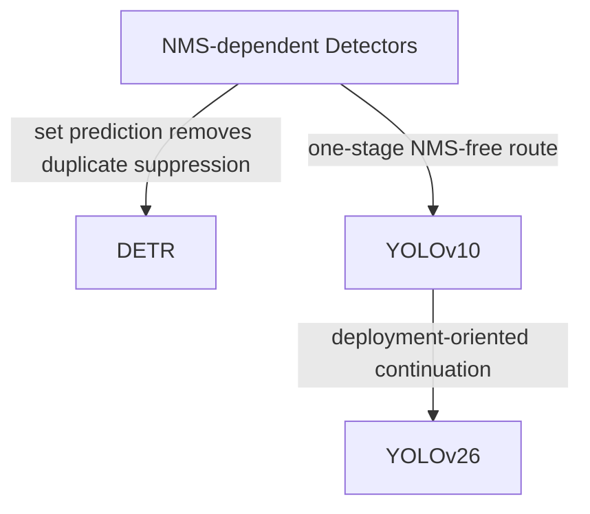

# Problem Line: NMS and End-to-End Detection

[TOC]

## Central Question

目标检测如何在保持训练稳定和推理准确的同时，减少甚至去掉 NMS 这类 heuristic post-processing？

## Why It Matters

NMS 简单有效，但它本质上是一个手工后处理步骤。End-to-End detection 希望把“预测结果唯一性”直接纳入模型结构或训练目标，而不是依赖事后去重。

## Paper Matrix

| Paper | 为什么放入这条线 | 在线中的作用 | 详细笔记 |
| --- | --- | --- | --- |
| DETR | 将 detection 建模为 set prediction，并用一对一 Hungarian matching 去掉 NMS。 | End-to-End set prediction | [02-3-DETR-Zoo](02-3-DETR-Zoo.md#detr) |
| YOLOv10 | 通过 consistent dual assignment 推动 YOLO 走向 NMS-free inference。 | NMS-free one-stage 路线 | [02-2-YOLO-Zoo](02-2-YOLO-Zoo.md#yolov10) |
| YOLOv26 | 继续简化推理结构，并使用 one-to-one 输出服务部署。 | NMS-free / deployment-oriented 延续 | [02-2-YOLO-Zoo](02-2-YOLO-Zoo.md#yolov26) |

## Relation

## Open Questions

- 为什么 one-to-one supervision 通常比 one-to-many dense supervision 弱？
- 什么情况下 NMS-free detection 对真实部署收益明显？什么情况下保留 NMS 仍然可接受？
- query-based 路线和 YOLO-style NMS-free 路线在训练稳定性上有什么差异？
