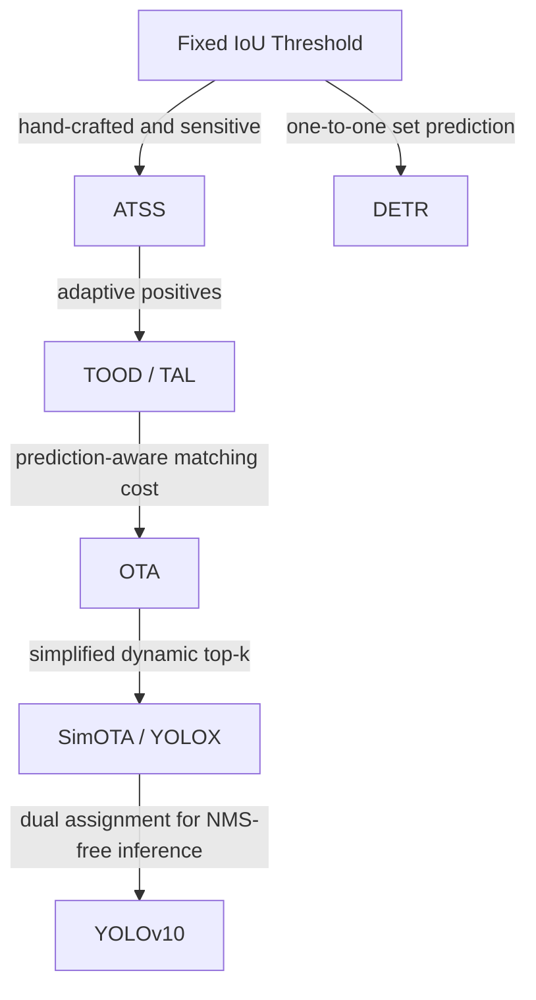

# Problem Line: Label Assignment

[TOC]

## Central Question

训练时，prediction / anchor / point / query 应该如何分配给 ground-truth objects？

## Why It Matters

Label Assignment 决定正负样本、recall、训练稳定性、ranking quality，以及 NMS-free detection 是否可行。

## Paper Matrix

| Paper / Method | 为什么放入这条线 | 在线中的作用 | 详细笔记 |
| --- | --- | --- | --- |
| Fixed IoU Threshold | 经典手工 assignment baseline。 | 静态 heuristic baseline | [本节详细笔记](#label-assignment-strategy) |
| Center-Prior Assignment | 利用几何先验减少边界附近的 noisy positives。 | Geometry-prior assignment | [本节详细笔记](#taxonomy) |
| ATSS | 指出 anchor-based 与 anchor-free 的关键差异主要在 assignment，并提出 per-GT adaptive threshold。 | Adaptive rule-driven assignment | [本节详细笔记](#taxonomy) |
| TOOD / TAL | 在选择正样本时对齐 classification 和 localization。 | Task-aligned prediction-aware assignment | [本节详细笔记](#taxonomy) |
| OTA | 使用 optimal transport / matching cost 动态分配正样本。 | Cost-based dynamic assignment | [本节详细笔记](#taxonomy) |
| SimOTA / YOLOX | 将 OTA 简化为更实用的 dynamic top-k assignment。 | Practical dynamic assignment | [02-2-YOLO-Zoo](02-2-YOLO-Zoo.md#yolox) |
| DETR | 使用一对一 Hungarian matching 替代 dense positive sample assignment。 | Set-prediction assignment | [02-3-DETR-Zoo](02-3-DETR-Zoo.md#detr) |
| YOLOv10 | 使用 consistent dual assignment 连接 one-to-many training 和 one-to-one inference。 | NMS-free YOLO 的 dual assignment | [02-2-YOLO-Zoo](02-2-YOLO-Zoo.md#yolov10) |

## Relation



## Open Questions

- assignment 什么时候应该依赖 geometry，什么时候应该依赖 prediction quality，什么时候二者都需要？
- 为什么 prediction-driven assignment 往往需要 warmup 或稳定化设计？
- 对 face/head 这类 nested objects，tie-breaking 应该更偏 geometry-specific 还是 score-specific？

## Label Assignment Strategy

### Intro

- Takeaway: label assignment就是在训练时，哪些预测框是正样本（positive）？哪些是负样本（negative）？

  > [!TIP]
  >
  > 仅在dense perdiction中存在，sparse prediction已经解决了这个问题

- Motivation: 如果 assignment 不合理：
  - 正样本太少 → 学不到
  - 正样本太多 → 噪声大
  - 小目标没有 anchor → 小目标 recall 崩
  - 遮挡目标被分错 → AP50 还行，AP75 很差

- 查看label assignment: 需要可视化看anchor如何与gt进行匹配的

- 一些insight: assignment 本质是 heuristic，没有一个真正理论最优解。

  因此 dense detection 论文大量时间都在研究：

  ```
  better label assignment
  ```

  而不是模型本身

下面介绍一些主流的方法：

1. 规则驱动：早几年的研究，如ATSS

2. 预测驱动：用模型当前输出结果来参与正样本选择，动态样本分配
   - Taxonomy
   
     - 基于Matching Cost的动态分配
   
       直接使用模型检测头的输出，与每一个Ground Truth计算一个匹配的代价，这个代价一般由分类loss和回归loss组成。Feature Map上所有的点（N个）的预测值与所有的Ground Truth（M个）计算得到的**NxM的矩阵**，就是所谓的**Cost Matrix**
   
       那么基于这个Cost Matrix进行二分图匹配/传输优化/取topk 都是一种动态匹配
   
       > [!TIP]
       >
       > 虽然看着是一个鸡生蛋，蛋生鸡的问题，然是NN还是能够训练学习
   
   - Pros: 更强
   
   - Cons:
     - **训练初期不稳定**，因为预测还不准
       - Sol: 使用 warmup / 混合规则 + 预测

### Taxonomy

#### 规则驱动

- Fixed IoU Threshold

- Center-Prior Assignment

    - Positive only if anchor center is inside GT center region (radius/ratio), then apply IoU rule.
    - Medium effort, reduces noisy positives near borders.

- __Bridging the Gap Between Anchor-Based and Anchor-Free Detection via Adaptive Training Sample Selection.__ *Shifeng Zhang et al.* __CVPR, 2020__ [(Arxiv)](https://arxiv.org/abs/1912.02424) [(S2)](https://www.semanticscholar.org/paper/db160e36aec4b43cc0651039eb1fc1e63527b090) (Citations __1965__) -- ATSS ([My PDF](https://drive.google.com/file/d/1pjk--V3r9oXrp0tIsSChaH9jjGlGgGNr/view?usp=drivesdk))

  - Takeaway: （规则驱动）ATSS argues that the key gap between anchor-based and anchor-free dense detectors is not the anchor itself, but **how positives/negatives are assigned**. 它用 per-GT 的自适应 IoU 阈值选正样本，在不增加推理开销的前提下显著提升 RetinaNet / FCOS。

    Anchor design 不是关键，sample selection 才是。

    > CNN 成立；放到后来的 Transformer / NMS-free / query-based detector，这个结论就不再能原样照搬。

  - Motivation:

    - 传统 anchor-based detector 用固定 IoU threshold（如 0.5/0.4）分配正负样本，hyperparameter 很敏感。
    - FCOS 这类 anchor-free detector 用 spatial + scale constraint 选样本，看起来更强，但作者追问的是：提升到底来自 “anchor-free”，还是来自 **assignment strategy**？
    - 论文先做 controlled comparison，发现只要把正负样本定义统一，anchor box regression 和 point regression 的性能差距几乎消失。

  - Core Mechanism:

    

    - Step 1: per-level candidate mining. 对每个 GT $g$，在每个 FPN level 里选出中心点距离 GT center 最近的 $k$ 个 anchors，组成 candidate set
      $$
      \mathcal{C}_g = \bigcup_{i=1}^{\mathcal{L}} \mathcal{S}_i,
      \quad |\mathcal{S}_i| = k,
      \quad |\mathcal{C}_g| = k\mathcal{L}.
      $$
      这样先保证每个尺度层都有机会参与，不再靠人工指定某个 level 负责某类目标。

    - Step 2: adaptive IoU threshold. 计算这些 candidates 与 GT 的 IoU 分布
      $$
      \mathcal{D}_g = IoU(\mathcal{C}_g, g),
      \qquad
      t_g = m_g + v_g,
      $$
      其中 $m_g = \mathrm{Mean}(\mathcal{D}_g)$，$v_g = \mathrm{Std}(\mathcal{D}_g)$。

      - $m_g$ 高：说明这个 GT 和预设 anchor 很匹配，质量比较高
      - $v_g$ 高：说明只有少数 pyramid levels 特别适合它，ATSS 会更倾向只从这些 level 里挑 positives。

    - Step 3: final positive selection. 若 candidate 满足 $IoU(c,g) \ge t_g$ 且 its center lies inside the GT box，则标为 positive；若一个 anchor 同时匹配多个 GT，就分给 IoU 最大的那个 GT。

      > [!NOTE]
      >
      > 本质上，ATSS 还是先用几何先验（center distance + IoU）筛 candidates，再做自适应 threshold，因此它比固定规则灵活，但还不是后面那种 fully prediction-driven matching。

  - Pipeline:

    1. 输入 image，经过 FPN 得到 multi-level dense anchors / points。
    2. 对每个 GT，在每个 level 选 top-$k$ closest candidates。中心点之间的欧式距离来计算
    3. 统计 candidate IoU 的 mean/std，得到该 GT 自己的 threshold $t_g$。
    4. 选出满足 threshold 且 center in GT 的 positives，用于 classification / regression 训练。
    5. 剩余样本视为 negatives；推理阶段不改 detector head，因此没有额外 inference overhead。

  - Pros:
    - 把 fixed IoU threshold / fixed scale range 变成 per-object adaptive assignment，鲁棒性更强。
    - 统一解释了 anchor-based 和 anchor-free 的差别：关键在 assignment，而不是 box vs point。
    - 几乎不引入额外超参，核心只剩一个较稳健的 $k$（默认 9）。
    - 在 paper 的 COCO minival 验证里，RetinaNet (#A=1) 用 ATSS 可从 $37.0$ AP 提升到 $39.3$ AP；FCOS full version 也有明显提升。

  - Cons:
    - 虽然叫 adaptive，但仍建立在 center prior、IoU 和 FPN level 这些 hand-crafted inductive bias 上。
    - 仍属于 rule/statistics-driven assignment，不会利用当前分类分数或回归质量做真正的 prediction-driven matching。
    - “anchor 本身不重要” 这个结论主要适用于当时的 CNN dense detectors；放到 DETR-style / NMS-free 范式需要重新审视。

近年来正样本的选择（label assignment）**由模型当前预测结果决定**，而不是固定规则决定。

#### 预测驱动

- **TOOD: Task-aligned One-stage Object Detection**. Chengjian Feng et.al. **ICCV**, **2021** (Oral) [(Arxiv)](https://arxiv.org/abs/2108.07755) [(S2)](https://www.semanticscholar.org/paper/7438524bf00d7c5a22cb8799797f57c3a794b220) [(Code)](https://github.com/fcjian/TOOD). -- TAL

  - Takeaway: TOOD 是 **预测驱动的 task-aligned label assignment** 的里程碑工作，提出 T-Head（task-interactive 特征 + Task-Aligned Predictor）和 TAL（基于对齐度量 $t = s^{\alpha} \cdot u^{\beta}$ 的样本分配 + task-aligned loss），让 classification 和 localization 的最优 anchor 在训练中**逐渐对齐**，从而 NMS 时高分框天然就是高 IoU 框。ICCV 2021 Oral，51.1 AP，超越同期 ATSS (47.7)、GFL (48.2)、PAA (49.0)。

    > [!NOTE]
    >
    > 指出任务不对齐问题，提出从 head 结构（T-Head）和 训练策略（TAL）两个层面同时解决这个问题的措施

  - Motivation: One-stage detector 的两个核心任务——classification（关注物体关键部位）和 localization（精确定位整个物体边界）——存在**内在矛盾**：

    1. **最优 anchor 不一致（Spatial Misalignment）**：classification 的最优 anchor 往往在物体中心（语义最显著处），而 localization 的最优 anchor 可能偏离中心（需要精确边界信息）。用同一套固定规则（如 center sampling 或 IoU threshold）给两个任务分配正样本，必然导致其中一个任务次优。
    2. **任务独立优化导致 score-IoU mismatch**：传统 parallel head 中 cls 和 reg 分支完全独立，cls 分支不知道 reg 分支预测的框有多准，reg 分支也不知道 cls 分支给了多少置信度。NMS 时可能出现高分类分但低 IoU 的框压制了低分类分但高 IoU 的框。

    > [!TIP]
    >
    > 其实是用来适配nms的：这是目标检测里的一个隐性矛盾，**检测器最终排序靠分类分数，但我们真正想保留下来的框还必须定位准确**

    

    > ATSS 的检测结果：Score 热力图（分类最优 anchor 在中心）和 IoU 热力图（定位最优 anchor 偏离中心）空间分布不一致。TOOD 的 T-head + TAL 使其逐渐对齐。

  - Core Mechanism:

    

    > TOOD 整体学习机制：T-head 在 FPN 特征上做预测 → TAL 根据对齐度量计算学习信号 → T-head 反向调整分类概率和定位预测。

    TOOD 从 **head 结构**（T-Head）和 **训练策略**（TAL）两个层面同时解决 misalignment 问题。

    - T-Head（Task-aligned Head）—— 增强任务交互 + 预测对齐

      - **What**: T-Head 替代传统的 parallel head（cls/reg 两个独立分支），改为：$N$ 层连续卷积提取 **task-interactive features** $X^{inter}_k$ → 两个 **Task-Aligned Predictor (TAP)** 分别做分类和定位 → **Prediction Alignment** 用 spatial probability map $M$ 调分类分、spatial offset map $O$ 调定位框。

        交互特征提取：
        $$
        X^{inter}_k = \delta(conv_k(X^{inter}_{k-1})), \quad X^{inter}_0 = X^{fpn}
        $$
        TAP 的层注意力（layer attention）让不同任务自适应选择不同层的特征（做了两件事）：
        $$
        X^{task}_k = \boldsymbol{w}_k \cdot X^{inter}_k, \quad \boldsymbol{w} = \sigma(fc_2(\delta(fc_1(\boldsymbol{x}^{inter}))))
        $$
        1. 对分类预测，用一个空间概率图调整分类分数，让分类分布更贴近高质量定位区域
        2. 对定位预测，学习 spatial offset 来调整边界框预测，使定位结果也向更对齐的位置靠近

        Prediction alignment——分类分用 $M$ 增强对齐位置、定位用 $O$ 微调到最佳边界：
        $$
        P^{align} = \sqrt{P \times M}, \quad B^{align}(i,j,c) = B(i+O(i,j,2c),\, j+O(i,j,2c+1),\, c)
        $$

      - **Why**: parallel head 的两个分支互不通信，cls 不知道 reg 的预测质量。T-Head 的 task-interactive features 让两个任务共享底层特征、互相感知对方状态；layer attention 解决共享特征带来的特征冲突（两个任务需要不同的 receptive field / feature level）；prediction alignment 让分类分和定位框在输出端也显式对齐。

      - **How**: $N=6$ 层 conv（params 与 parallel head 相当），TAP 中的 layer attention $\boldsymbol{w} \in \mathbb{R}^N$ 由跨层特征经 avgpool + fc + sigmoid 学到。$M$ 和 $O$ 也从 $X^{inter}$ 自动学习，$O$ 的每个 channel（4 个边界）独立学习各自的偏移量。T-Head 可独立使用，plug-and-play 到 ATSS/FCOS/FoveaBox 均有 0.7~1.9 AP 提升。

    - TAL（Task Alignment Learning）—— 对齐度量驱动的样本分配 + 损失

      - **What**: TAL 用一个统一的 **anchor alignment metric** 同时衡量分类和定位质量，并据此决定正样本选择和损失权重：
        $$
        t = s^{\alpha} \cdot u^{\beta}
        $$
        其中 $s$ 是分类分数，$u$ 是预测框与 GT 的 IoU，$\alpha, \beta$ 控制两个任务在对齐度量中的权重（默认 $\alpha=1, \beta=6$，强调定位质量）。

        **样本分配**：对每个 GT，选topk个 anchor 为正样本（默认 $k=13$），其余为负。分配是动态的——训练过程中 $s$ 和 $u$ 变化，$t$ 随之变化，正样本集合也在变化。

        **Task-aligned Loss**：
        
        - 分类损失：用归一化后的 $\hat{t}$（instance-level 归一化，保持 instance 间 rank 且保证 hard instance 有效学习）替代正样本的 binary label：
          $$
          L_{cls} = \sum_{i=1}^{N_{pos}} |\hat{t}_i - s_i|^{\gamma} \, BCE(s_i, \hat{t}_i) + \sum_{j=1}^{N_{neg}} s_j^{\gamma} \, BCE(s_j, 0)
          $$
        - 定位损失：用 $\hat{t}$ 对 GIoU loss 加权，让对齐度高的 anchor 主导回归训练：
          $$
          L_{reg} = \sum_{i=1}^{N_{pos}} \hat{t}_i \, L_{GIoU}(b_i, \bar{b_i})
          $$
        
        > [!NOTE]
        >
        > 不用硬标签，用归一化后的 alignment metric 作为正样本的软标签
        
      - **Why**: 传统 assignment（center sampling / IoU threshold）是 task-agnostic 的静态规则，不知道模型当前的预测质量。TAL 用 $t = s^{\alpha} \cdot u^{\beta}$ 将对齐度量**动态、联合地**衡量两个任务，使 assignment 自然偏向那些 cls 和 reg 同时好的 anchor。Task-aligned loss 进一步让 cls 的训练目标（$\hat{t}$）和 reg 的训练权重（$\hat{t}$）都围绕同一个对齐度量，**pull closer the optimal anchors for two tasks**。
      
      - **How**: 训练前 4 epoch 用 ATSS warmup（稳定收敛），之后切换到 TAL。$t$ 的计算依赖当前预测，因此 assignment 每个 iteration 动态更新。$\hat{t}$ 的归一化：对每个 instance，$\max(\hat{t}) = \max(u)$，保证 hard instance（所有 anchor 的 $t$ 都小）仍能获得有效学习信号。

  - Pipeline:

    1. **Backbone + FPN** 提取多尺度特征 $X^{fpn}$。

    2. **T-Head**：$N=6$ 层 conv 提取 task-interactive features → TAP（layer attention + task-specific prediction）→ classification score $P$ + bbox $B$ → $M$ map 对齐分类、$O$ map 对齐定位 → $P^{align}, B^{align}$。

       1. TAP 的层注意力（layer attention）让不同任务自适应选择不同层的特征

          > [!NOTE]
          >
          > 这里我们需要先理解，TOOD 不是完全共享分类和回归特征，也不是传统的完全分离两条分支，虽然feature是共享的，但是两个分支所需的feature是通过一个层注意力（对不同卷积层输出进行学习加权）分别提取出来的

          ```
          inter_feats = []
          for inter_conv in self.inter_convs:
              x = inter_conv(x)
              inter_feats.append(x)
          
          feat = torch.cat(inter_feats, 1)
          avg_feat = F.adaptive_avg_pool2d(feat, (1, 1))
          cls_feat = self.cls_decomp(feat, avg_feat)
          reg_feat = self.reg_decomp(feat, avg_feat)
          ```

       2. $M$ map 对齐分类、$O$ map 对齐定位

          这里我们先看分类分支，不是原来的`cls_score = sigmoid(cls_logits)`，而是

          ```python
          cls_logits = self.tood_cls(cls_feat)
          
          cls_prob = F.relu(self.cls_prob_conv1(feat))
          cls_prob = self.cls_prob_conv2(cls_prob)
          
          cls_score = sqrt(sigmoid(cls_logits) * sigmoid(cls_prob))
          ```

          cls_logits：类别预测，由分类专用特征 cls_feat 产生；cls_prob：空间对齐概率，由交互特征 feat 产生。最终 cls_score：两者的几何平均

          回归分支

          ```
          reg_dist = self.tood_reg(reg_feat)
          reg_bbox = decode(reg_dist)
          reg_offset = self.reg_offset_conv2(...)
          bbox_pred = self.deform_sampling(reg_bbox, reg_offset)
          # 这里展示的是anchor base的实现，anchor也有对应的实现
          ```

          多了一个offset的对齐预测

    3. **TAL 样本分配**（训练期）：对每个 GT 计算所有 anchor 的 $t = s^{\alpha} u^{\beta}$ → 选 top-$m$ 为正样本，其余为负 → 动态更新。

    4. **Task-aligned Loss**（训练期）：分类用 $\hat{t}$ 替代 binary label + focal loss，定位用 $\hat{t}$ 加权 GIoU loss。

    5. **推理期**：T-head 正常前向 → $P^{align}$ 和 $B^{align}$ → 标准 NMS（此时高分框天然对应高 IoU 框）。

    > 关键训练细节：前 4 epoch 用 ATSS warmup（loss 用 focal_loss → task_aligned_focal_loss 切换），$\alpha=1, \beta=6, m=13$ 为核心超参。

  - Pros:

    - **解决 score-IoU mismatch 的核心方案**：TAL 的 $t = s^{\alpha} u^{\beta}$ 成为后续大量 detector（YOLOX, GFLv2, RT-DETRv3 等）assignment 设计的基础范式。
    - **head 与 assignment 协同设计**：T-Head 提供更好的特征基础，TAL 提供正确的训练信号，二者互补。
    - **plug-and-play**：T-Head 可独立替换 parallel head，在各 one-stage detector 上普适提升 0.7~1.9 AP。
    - **性能突出**：51.1 AP，参数和 FLOPs 均少于同期 ATSS/GFL/PAA。
    - **预测驱动 + 动态 assignment**：不依赖手工几何先验，让模型自己学出哪些 anchor 是 task-aligned 的。

  - Cons:

    - **需 warmup**：前 4 epoch 依赖 ATSS 稳定初始收敛，不能从头直接 TAL。
    - **超参数敏感**：$\alpha, \beta, m$ 需要针对不同 detector 调整，论文的默认值不一定直接泛化。
    - **训练复杂度增加**：每次 iteration 需计算 $t$ 并做动态 assignment，loss 计算也比标准 focal loss 复杂。
    - **仍依赖 NMS**：TOOD 解决的是 score-IoU consistency，不是 NMS-free，本质上还是 dense prediction。

- PAA（Probabilistic Anchor Assignment）

  PAA 假设正负样本的联合损耗分布遵循高斯分布。因此，它使用 GMM 拟合正负样本分布，然后以正样本分布中心作为正负分界

- DERT

  Hungarian matching

  - Pros
    - Globally optimal assignment（一对一）严格限制一个 GT 只匹配一个预测

- __OTA: Optimal Transport Assignment for Object Detection.__ *Zheng Ge et al.* __CVPR, 2021__ [(Arxiv)](https://arxiv.org/abs/2103.14259) [(Code)](https://github.com/Megvii-BaseDetection/OTA) ([My PDF](https://drive.google.com/file/d/18dAOiw6HhK8r5TwONtKY8Z3RZ6HyrcxA/view?usp=drivesdk))

  - Takeaway: OTA 把 dense detector 的 label assignment 写成 **Optimal Transport** 问题：GT / background 是 suppliers，anchors / points 是 demanders，通过全局最小运输代价得到 one-to-many positives。它解决的不是 detector architecture，而是训练时“哪些候选该负责哪个 GT”的全局分配。

  - Motivation:
    - 固定 IoU / center prior / per-GT top-k 这类方法通常是局部 heuristic，多个 GT 争抢同一个 ambiguous anchor 时容易靠手工规则裁决。
    - DETR 的 Hungarian matching 是全局匹配，但偏 one-to-one；CNN dense detector 仍需要 one-to-many supervision，因此需要一个全局但允许多个 positives 的 assignment formulation。

  - Core Mechanism:

    

    - **OT formulation**. 对 $m$ 个 GT 和 $n$ 个 anchors，OTA 把每个 GT 看作供应若干 positive labels 的 supplier，把每个 anchor 看作 demand 为 1 的 demander，同时加入 background supplier 负责 negatives。核心目标是最小化 transport cost：
      $$
      \min_{\pi}\sum_{i=1}^{m}\sum_{j=1}^{n}c_{ij}\pi_{ij},
      \quad
      \text{s.t. } \sum_i\pi_{ij}=d_j,\ \sum_j\pi_{ij}=s_i,\ \pi_{ij}\ge0.
      $$
      这里 $c_{ij}$ 是第 $i$ 个 supplier 到第 $j$ 个 anchor 的匹配代价，$\pi_{ij}$ 是运输量；求出的 transport plan 决定 anchor 应该分给哪个 GT 或 background。

    - **Cost matrix**. Foreground cost 由 classification loss 和 localization loss 组成；background cost 只考虑分类成背景的 loss：
      $$
      c_{ij}^{fg}=L_{cls}(P_j^{cls},G_i^{cls})+\alpha L_{reg}(P_j^{box},G_i^{box}),
      \qquad
      c_j^{bg}=L_{cls}(P_j^{cls},\varnothing).
      $$
      所以 OTA 的 cost 本质上同时问两个问题：这个 anchor 是否分对类，以及它能不能回归到对应 GT。

    - **Dynamic $k$ supply**. 每个 GT 的 positive 数量 $s_i$ 不是固定常数，而是由当前预测质量估计：对该 GT 取 top-$q$ IoU 的预测框并求和，得到它大概需要多少 positives。直觉是 easy / large / well-covered objects 可以分到更多 positives，hard objects 则少一些。

    - **Sinkhorn-Knopp solver + center prior**. OTA 用 Sinkhorn-Knopp 近似求解 OT，并对远离 GT center 的候选加入额外 cost，避免训练早期低质量远端 anchors 被错误分配。

  - Pipeline:
    1. Detector forward 得到所有 anchors / points 的 class score 和 box prediction。
    2. 对每个 GT 估计 dynamic $k$，并设置 background supplier 的 supply。
    3. 计算 foreground / background cost matrix，并加入 center prior cost。
    4. 使用 Sinkhorn-Knopp 得到近似 transport plan $\pi^*$。
    5. 根据 $\pi^*$ 解码 positives / negatives，再按常规 detection loss 训练；inference 阶段不需要 OTA。

  - Pros:
    - 用全局 assignment 处理 ambiguous anchors，比 per-GT greedy matching 更 principled。
    - 保留 dense detector 需要的 one-to-many positives，不像 Hungarian matching 那样强制 one-to-one。
    - 只增加 training-time cost，inference 不引入额外计算。

  - Cons:
    - 训练时要构造 cost matrix 并运行 Sinkhorn 迭代，工程复杂度和训练开销都高于 SimOTA。
    - 仍依赖 center prior、dynamic $k$ 的 top-$q$ 估计、loss 权重 $\alpha$ 等超参数。
    - 因为 assignment 依赖当前预测质量，训练早期仍需要 prior / cost design 来稳定匹配。

- **YOLOX: Exceeding YOLO Series in 2021**. Zheng Ge et.al. **arXiv**, **2021**, [(Arxiv)](https://arxiv.org/abs/2107.08430) [(Code)](https://github.com/Megvii-BaseDetection/YOLOX). -- SimOTA ([My PDF](https://drive.google.com/file/d/1_S-BNWADHfHH7Ozqmu2z8dZ5TD9WuJ2i/view?usp=drivesdk))

  - Takeaway: SimOTA 是 YOLOX 里对 OTA 的工程化简化版。它保留了 **loss-aware cost + center prior + dynamic number of positives** 这几个关键思想，但不再真的去解 Optimal Transport，而是直接用 dynamic top-$k$ 做近似匹配，因此训练更快、实现更简单。

  - Motivation:

    - OTA 很强，但要用 Sinkhorn-Knopp 求 OT，YOLOX 作者实测会带来约 25% 的额外训练时间。
    - 对实时检测器来说，label assignment 不能太重，否则训练成本过高，不利于大规模工程使用。
    - 所以 SimOTA 的核心目标不是再追求“最优传输”的理论完备性，而是：保留 OTA 的有效成分，丢掉最贵的求解器。

  - Core Mechanism:

    - **Pair-wise matching cost**. 对每个 GT $g_i$ 和 prediction $p_j$，先计算匹配代价
      $$
      c_{ij} = L_{ij}^{cls} + \lambda L_{ij}^{reg},
      $$
      其中 $L_{ij}^{cls}$ 是分类损失，$L_{ij}^{reg}$ 是回归损失，$\lambda$ 是平衡系数。

      这个 cost 本质上在回答：哪个 prediction 对这个 GT 来说“又分得对，又框得准”。

    - **Center prior**. SimOTA 不是在全图所有 predictions 上选 positives，而是先限制在一个 fixed center region 内再做匹配。

      这样做的原因是：靠近 GT center 的 grids 更可能是高质量正样本，也能减少训练初期不稳定的低质量匹配。

    - **Dynamic top-$k$ matching**. 对每个 GT，不是固定分配 1 个或固定 $k$ 个正样本，而是在候选中心区域内选 cost 最小的 top-$k$ predictions 作为 positives。

      这里的 $k$ 不是常数，而是 dynamic 的。YOLOX 这篇 paper 把具体估计细节引用到 OTA：对每个 GT，先找出与它 IoU 最高的 top-$q$ predictions（OTA 里默认 $q=20$），再把这些 IoU 相加，得到该 GT 需要的正样本数量估计：
      $$
      k_i \approx \sum_{j \in \operatorname{Top}q(IoU)} IoU(p_j, g_i).
      $$
      实际实现里通常会再把它转成整数（至少为 1），作为这个 GT 的 dynamic $k$。

      直觉上，如果一个 GT 周围本来就有更多 predictions 能回归得很好，那么高 IoU prediction 的总和就更大，这个 GT 就应该分到更多 positives；反之，如果它本身难回归、可用候选少，那它的 $k$ 也会更小。

      > [!NOTE]
      >
      > 所以 SimOTA 可以看成：用 cost-based ranking + dynamic top-$k$，去近似 OTA 里的全局最优分配；它保留了“动态正样本数”这个很关键的 insight，但放弃了真正的 OT solver。

  - Pipeline:

    1. 对每个 GT，先根据 center prior 缩小候选预测范围。
    2. 计算候选 predictions 与该 GT 的 pair-wise cost。
    3. 用 dynamic $k$ 估计这个 GT 该分配多少个 positives。
    4. 选出该 GT 下 cost 最小的 top-$k$ predictions 作为 positives。
    5. 对应 grids 标为正样本，其余为负样本；不需要 Sinkhorn-Knopp 或 OT 求解。

  - Pros:
    - 相比 OTA，训练更省时，且不再引入 Sinkhorn 求解器相关的额外超参。
    - 保留了 loss-aware matching、center prior、dynamic positive count 这些真正有效的部分。
    - 很适合 one-stage real-time detector，因此后来在 YOLO 系里非常常见。
    - 在 YOLOX-DarkNet53 的 roadmap 里，加入 SimOTA 后 AP 从 $45.0$ 提升到 $47.3$。

  - Cons:
    - 它是对 OTA 的近似，不再显式保证 global optimal assignment。
    - center prior 仍然是一种 hand-crafted bias，候选区域外的预测基本没有机会成为正样本。
    - dynamic $k$ 估计仍然依赖当前预测框的 IoU 质量，因此训练初期的 matching 质量会受模型状态影响。

- __Category-Aware Dynamic Label Assignment with High-Quality Oriented Proposal.__ *Mingkui Feng et al.* __ArXiv, 2024__ [(Arxiv)](https://arxiv.org/abs/2407.03205) [(S2)](https://www.semanticscholar.org/paper/ccb0d094cf39cb17cf29214cb930f0dce9ca3211) (Citations __4__)

- __Integrating Diverse Assignment Strategies into DETRs.__ *Yiwei Zhang et al.* __arXiv, 2026__ [(Arxiv)](https://arxiv.org/abs/2601.09247)

- __Point2RBox-v3: Self-Bootstrapping from Point Annotations via Integrated Pseudo-Label Refinement and Utilization.__ *Teng Zhang et al.* __arXiv, 2025__ [(Arxiv)](https://arxiv.org/abs/2509.26281)

- __Improving Object Detection by Label Assignment Distillation.__ *Chuong H. Nguyen et al.* __arXiv, 2021__ [(Arxiv)](https://arxiv.org/abs/2108.10520)  蒸馏引导label assignment

- https://openaccess.thecvf.com/content/CVPR2025/html/Liu_FSHNet_Fully_Sparse_Hybrid_Network_for_3D_Object_Detection_CVPR_2025_paper.html

### Practice

现在我在做一个手头脸的检测人物，label assignment会从以下方面直接影响我的检测效果

- 小目标
- 密集场景
- 类间重叠：face inside head，存在层级关系，assignment可能混淆，分类不稳定
- 遮挡：漏检

##### 
