# Problem Line: Label Assignment

[TOC]

## Central Question

训练时，prediction / anchor / point / query 应该如何分配给 ground-truth objects？

## Why It Matters

Label Assignment 决定正负样本、recall、训练稳定性、ranking quality，以及 NMS-free detection 是否可行。

## Paper Matrix

| Paper / Method | 为什么放入这条线 | 在线中的作用 | 详细笔记 |
| --- | --- | --- | --- |
| Fixed IoU Threshold | 经典手工 assignment baseline。 | 静态 heuristic baseline | [本节详细笔记](#label-assignment-strategy) |
| Center-Prior Assignment | 利用几何先验减少边界附近的 noisy positives。 | Geometry-prior assignment | [本节详细笔记](#taxonomy) |
| ATSS | 指出 anchor-based 与 anchor-free 的关键差异主要在 assignment，并提出 per-GT adaptive threshold。 | Adaptive rule-driven assignment | [本节详细笔记](#taxonomy) |
| PAA | 用当前模型的 cls + loc loss 给 anchors 打分，并用 GMM 概率分布自适应分离正负样本。 | Probabilistic prediction-aware assignment | [本节详细笔记](#taxonomy) |
| TOOD / TAL | 在选择正样本时对齐 classification 和 localization。 | Task-aligned prediction-aware assignment | [本节详细笔记](#taxonomy) |
| OTA | 使用 optimal transport / matching cost 动态分配正样本。 | Cost-based dynamic assignment | [本节详细笔记](#taxonomy) |
| SimOTA / YOLOX | 将 OTA 简化为更实用的 dynamic top-k assignment。 | Practical dynamic assignment | [02-2-YOLO-Zoo](02-2-YOLO-Zoo.md#yolox) |
| DSLA | 用 smooth label + online IoU coupling 缓解 anchor-free detector 的分类/定位质量不一致。 | Dynamic smooth anchor-free assignment | [本节详细笔记](#taxonomy) |
| LAD | 不蒸馏 teacher 输出，而是蒸馏 teacher 的 label assignment 决策。 | Assignment distillation | [本节详细笔记](#taxonomy) |
| DETR | 使用一对一 Hungarian matching 替代 dense positive sample assignment。 | Set-prediction assignment | [02-3-DETR-Zoo](02-3-DETR-Zoo.md#detr) |
| YOLOv10 | 使用 consistent dual assignment 连接 one-to-many training 和 one-to-one inference。 | NMS-free YOLO 的 dual assignment | [02-2-YOLO-Zoo](02-2-YOLO-Zoo.md#yolov10) |

## Relation

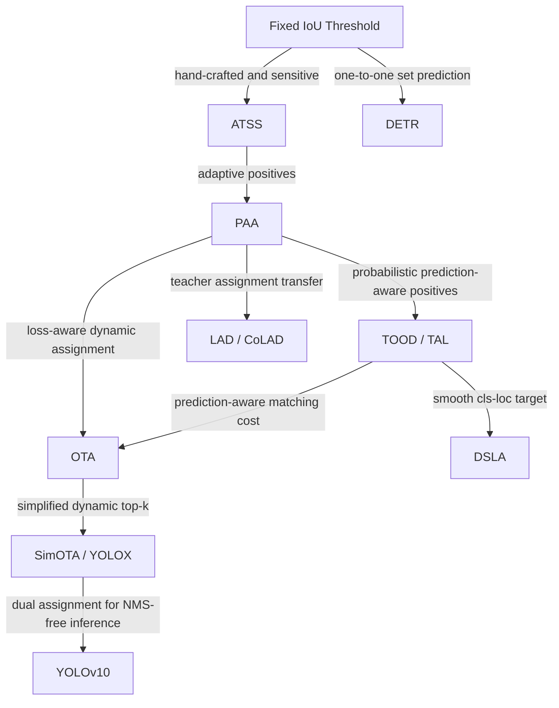

## Open Questions

- assignment 什么时候应该依赖 geometry，什么时候应该依赖 prediction quality，什么时候二者都需要？
- 为什么 prediction-driven assignment 往往需要 warmup 或稳定化设计？
- 对 face/head 这类 nested objects，tie-breaking 应该更偏 geometry-specific 还是 score-specific？

## Label Assignment Strategy

### Intro

- Takeaway: label assignment就是在训练时，哪些预测框是正样本（positive）？哪些是负样本（negative）？

  > [!TIP]
  >
  > 仅在dense perdiction中存在，sparse prediction已经解决了这个问题

- Motivation: 如果 assignment 不合理：
  - 正样本太少 → 学不到
  - 正样本太多 → 噪声大
  - 小目标没有 anchor → 小目标 recall 崩
  - 遮挡目标被分错 → AP50 还行，AP75 很差

- 查看label assignment: 需要可视化看anchor如何与gt进行匹配的

- 一些insight: assignment 本质是 heuristic，没有一个真正理论最优解。

  因此 dense detection 论文大量时间都在研究：

  ```
  better label assignment
  ```

  而不是模型本身

下面介绍一些主流的方法：

1. 规则驱动：早几年的研究，如ATSS

2. 预测驱动：用模型当前输出结果来参与正样本选择，动态样本分配
   - Taxonomy
   
     - 基于Matching Cost的动态分配
   
       直接使用模型检测头的输出，与每一个Ground Truth计算一个匹配的代价，这个代价一般由分类loss和回归loss组成。Feature Map上所有的点（N个）的预测值与所有的Ground Truth（M个）计算得到的**NxM的矩阵**，就是所谓的**Cost Matrix**
   
       那么基于这个Cost Matrix进行二分图匹配/传输优化/取topk 都是一种动态匹配
   
       > [!TIP]
       >
       > 虽然看着是一个鸡生蛋，蛋生鸡的问题，然是NN还是能够训练学习
   
   - Pros: 更强
   
   - Cons:
     - **训练初期不稳定**，因为预测还不准
       - Sol: 使用 warmup / 混合规则 + 预测

### Taxonomy

#### 规则驱动

- Fixed IoU Threshold Assignment

- Center-Prior Assignment

    - Takeaway: Positive only if anchor center is inside GT center region (radius/ratio), then apply IoU rule.
    - Pro: Medium effort, reduces noisy positives near borders.


##### ATSS

- __Bridging the Gap Between Anchor-Based and Anchor-Free Detection via Adaptive Training Sample Selection.__ *Shifeng Zhang et al.* __CVPR, 2020__ [(Arxiv)](https://arxiv.org/abs/1912.02424) [(S2)](https://www.semanticscholar.org/paper/db160e36aec4b43cc0651039eb1fc1e63527b090) ([My PDF](https://drive.google.com/file/d/1pjk--V3r9oXrp0tIsSChaH9jjGlGgGNr/view?usp=drivesdk))(Citations __1965__) 

  - Takeaway: 几何先验（center distance + 自适应 threshold IoU）筛 candidates

  - Insight: anchor-based and anchor-free dense detectors的主要区别是标签分配

  - Core Mechanism:

    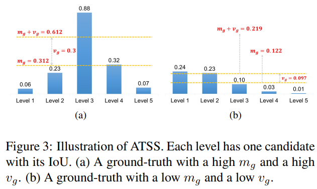

    - Step 1: per-level candidate mining. 对每个 GT $g$，在每个 FPN level 里选出中心点距离 GT center 最近的 $k$ 个 anchors，组成 candidate set
      $$
      \mathcal{C}_g = \bigcup_{i=1}^{\mathcal{L}} \mathcal{S}_i,
      \quad |\mathcal{S}_i| = k,
      \quad |\mathcal{C}_g| = k\mathcal{L}.
      $$
      这样先保证每个尺度层都有机会参与，不再靠人工指定某个 level 负责某类目标。

    - Step 2: adaptive IoU threshold. 计算这些 candidates 与 GT 的 IoU 分布
      $$
      \mathcal{D}_g = IoU(\mathcal{C}_g, g),
      \qquad
      t_g = m_g + v_g,
      $$
      其中 $m_g = \mathrm{Mean}(\mathcal{D}_g)$，$v_g = \mathrm{Std}(\mathcal{D}_g)$。

      - $m_g$ 高：说明这个 GT 和预设 anchor 很匹配，质量比较高
      - $v_g$ 高：说明只有少数 pyramid levels 特别适合它，ATSS 会更倾向只从这些 level 里挑 positives。

    - Step 3: final positive selection. 若 candidate 满足 $IoU(c,g) \ge t_g$ 且 its center lies inside the GT box，则标为 positive；若一个 anchor 同时匹配多个 GT，就分给 IoU 最大的那个 GT。

  - Pros:

    - 鲁棒性更强。
    - 统一解释了 anchor-based 和 anchor-free 的差别：关键在 assignment，而不是 box vs point。

  - Cons:
    - 虽然叫 adaptive，但仍建立在 center prior、IoU 和 FPN level 这些 hand-crafted inductive bias 上。
    - “anchor 本身不重要” 这个结论主要适用于当时的 CNN dense detectors；放到 DETR-style / NMS-free 范式需要重新审视。

近年来正样本的选择（label assignment）**由模型当前预测结果决定**，而不是固定规则决定。

#### 预测驱动

##### TOOD

- **TOOD: Task-aligned One-stage Object Detection**. Chengjian Feng et.al. **ICCV**, **2021** (Oral) [(Arxiv)](https://arxiv.org/abs/2108.07755) [(S2)](https://www.semanticscholar.org/paper/7438524bf00d7c5a22cb8799797f57c3a794b220) [(Code)](https://github.com/fcjian/TOOD).

  - Takeaway: 提出 T-Head（task-interactive 特征 + Task-Aligned Predictor）和 TAL（基于对齐度量 $t = s^{\alpha} \cdot u^{\beta}$ 的样本分配 + task-aligned loss），让 classification 和 localization 的最优 anchor 在训练中**逐渐对齐**，从而 NMS 时高分框天然就是高 IoU 框

  - Motivation: One-stage detector 的两个核心任务——classification（关注物体关键部位）和 localization（精确定位整个物体边界）——存在**内在矛盾**：
  
    1. **最优 anchor 不一致（Spatial Misalignment）**：classification 的最优 anchor 往往在物体中心（语义最显著处），而 localization 的最优 anchor 可能偏离中心（需要精确边界信息）。
    2. **任务独立优化导致 score-IoU mismatch**：训练目标同时优化 classification 和 localization，但推理时 NMS 常只用 classification score 排序，导致 score-ranking 和 box quality 不一致
  
    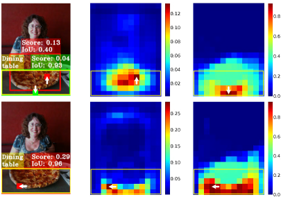
    
    > ATSS 的检测结果：Score 热力图（分类最优 anchor 在中心）和 IoU 热力图（定位最优 anchor 偏离中心）空间分布不一致。TOOD 的 T-head + TAL 使其逐渐对齐。

  - Core Mechanism:
  
    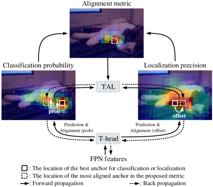

    > TOOD 整体学习机制：T-head 在 FPN 特征上做预测 → TAL 根据对齐度量计算学习信号 → T-head 反向调整分类概率和定位预测。

    TOOD 从 **head 结构**（T-Head）和 **训练策略**（TAL）两个层面同时解决 misalignment 问题。

    - T-Head（Task-aligned Head）—— 增强分类与回归的交互 + 预测对齐

      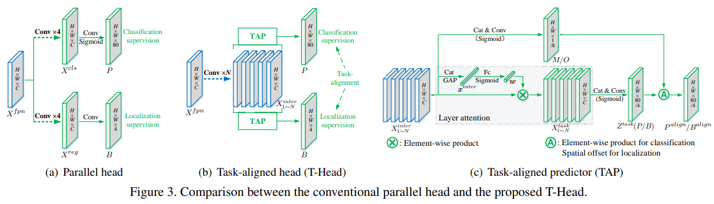

      $N$ 层连续卷积提取 **task-interactive features** $X^{inter}_k$ → 两个 Task-Aligned Predictor (TAP) 分别做分类和定位 → Prediction Alignment 用 spatial probability map $M$ 调分类分数、spatial offset map $O$ 调定位框。

      - TAP 的layer attention跨层特征经 avgpool + fc + relu + fc + sigmoid 学到：
        $$
        {x}^{inter} = \text{avgpool}(\text{cat}(X^{inter}_k))
        \\
        X^{task}_k = \boldsymbol{w}_k \cdot X^{inter}_k, \quad \boldsymbol{w} = \sigma(fc_2(\delta(fc_1(\boldsymbol{x}^{inter})))),\quad \delta=RELU \\
        $$
  
        $$
        X^{task} = \text{cat}(X^{task}_k),\quad Z^{task} = conv_2\left(\delta\left(conv_1\left(X^{task}\right)\right)\right) \\
        $$
  
        conv1 is $1\times 1$ to reduce dims
  
        1. 对分类预测，用一个空间概率图调整分类分数，让分类分布更贴近高质量定位区域
  
        2. 对定位预测，学习 spatial offset 来调整边界框预测，使定位结果也向更对齐的位置靠近
           $$
           P=\sigma(Conv_{cls}(Z^{task})),\quad B=Decode(Conv_{reg}(Z^{task}))
           $$
  
      - Prediction alignment——分类分用 $M$ 增强对齐位置、定位用 $O$ 微调到最佳边界：
        $$
        P^{align} = \sqrt{P \times M}, \quad B^{align}(i,j,c) = B(i+O(i,j,2c),\, j+O(i,j,2c+1),\, c)
        $$
        $(i,j,c)$表示第c channel的$(i,j)$

    - TAL（Task Alignment Learning）—— 对齐度量驱动的样本分配 + 损失

      TAL 用一个统一的 **anchor alignment metric** 同时衡量分类和定位质量：
      $$
      t = s^{\alpha} \cdot u^{\beta}
      $$
      其中 $s$ 是分类分数，$u$ 是预测框与 GT 的 IoU，$\alpha, \beta$ 控制两个任务在对齐度量中的权重（default $\alpha=1, \beta=6$）。

      - Label Assignment：对每个 GT，选topk个 anchor 为正样本（默认 $k=13$），其余为负。分配是动态的——训练过程中 $s$ 和 $u$ 变化，$t$ 随之变化，正样本集合也在变化。

  - **Task-aligned Loss**：
  
    - 分类损失：用归一化后的 $\hat{t}$（instance-level 归一化，保持 instance 间 rank 且保证 hard instance 有效学习）替代正样本的 binary label：
      $$
      L_{cls} = \sum_{i=1}^{N_{pos}} |\hat{t}_i - s_i|^{\gamma} \, BCE(s_i, \hat{t}_i) + \sum_{j=1}^{N_{neg}} s_j^{\gamma} \, BCE(s_j, 0)
      $$
  
    - 定位损失：用 $\hat{t}$ 对 GIoU loss 加权，让对齐度高的 anchor 主导回归训练：
      $$
      L_{reg} = \sum_{i=1}^{N_{pos}} \hat{t}_i \, L_{GIoU}(b_i, \bar{b_i})
      $$
      
      > [!NOTE]
      >
      > 不用硬标签，用归一化后的 alignment metric 作为正样本的软标签
  
  - Cons: 需 warmup，前期 epoch 依赖一些稳定的label assignment(eg: ATSS) 稳定初始收敛，不能从头直接 TAL
  
- Pipeline:
  
  1. **Backbone + FPN** 提取多尺度特征 $X^{fpn}$。
  
  2. **T-Head**：$N=6$ 层 conv 提取 task-interactive features → TAP（layer attention + task-specific prediction）→ classification score $P$ + bbox $B$ → $M$ map 对齐分类、$O$ map 对齐定位 → $P^{align}, B^{align}$。
  
     1. TAP 的层注意力（layer attention）让不同任务自适应选择不同层的特征
  
        > [!NOTE]
          >
          > 这里我们需要先理解，TOOD 不是完全共享分类和回归特征，也不是传统的完全分离两条分支，虽然feature是共享的，但是两个分支所需的feature是通过一个层注意力（对不同卷积层输出进行学习加权）分别提取出来的
  
        ```
          inter_feats = []
          for inter_conv in self.inter_convs:
              x = inter_conv(x)
              inter_feats.append(x)
          
          feat = torch.cat(inter_feats, 1)
          avg_feat = F.adaptive_avg_pool2d(feat, (1, 1))
          cls_feat = self.cls_decomp(feat, avg_feat)
          reg_feat = self.reg_decomp(feat, avg_feat)
        ```
  
     2. $M$ map 对齐分类、$O$ map 对齐定位
  
        这里我们先看分类分支，不是原来的`cls_score = sigmoid(cls_logits)`，而是
  
        ```python
          cls_logits = self.tood_cls(cls_feat)
          
          cls_prob = F.relu(self.cls_prob_conv1(feat))
          cls_prob = self.cls_prob_conv2(cls_prob)
          
          cls_score = sqrt(sigmoid(cls_logits) * sigmoid(cls_prob))
        ```
  
        cls_logits：类别预测，由分类专用特征 cls_feat 产生；cls_prob：空间对齐概率，由交互特征 feat 产生。最终 cls_score：两者的几何平均
  
        回归分支
  
        ```
          reg_dist = self.tood_reg(reg_feat)
          reg_bbox = decode(reg_dist)
          reg_offset = self.reg_offset_conv2(...)
          bbox_pred = self.deform_sampling(reg_bbox, reg_offset)
          # 这里展示的是anchor base的实现，anchor也有对应的实现
        ```
  
        多了一个offset的对齐预测
  
  3. **TAL 样本分配**（训练期）：对每个 GT 计算所有 anchor 的 $t = s^{\alpha} u^{\beta}$ → 选 top-$m$ 为正样本，其余为负 → 动态更新。
  
  4. **Task-aligned Loss**（训练期）：分类用 $\hat{t}$ 替代 binary label + focal loss，定位用 $\hat{t}$ 加权 GIoU loss。
  
  5. **推理期**：T-head 正常前向 → $P^{align}$ 和 $B^{align}$ → 标准 NMS（此时高分框天然对应高 IoU 框）。
  
  > 关键训练细节：前 4 epoch 用 ATSS warmup（loss 用 focal_loss → task_aligned_focal_loss 切换），$\alpha=1, \beta=6, m=13$ 为核心超参。

##### PAA

- __Probabilistic Anchor Assignment with IoU Prediction for Object Detection.__ *Kang-jik Kim, Hee Seok Lee.* __ECCV, 2020__ [(Arxiv)](https://arxiv.org/abs/2007.08103) [(S2)](https://www.semanticscholar.org/paper/92ad35b9e4b0ab761bcb1649fb8f5812f831052b) [(Code)](https://github.com/kkhoot/PAA) (Citations __494__)

  - Takeaway: PAA 把 anchor assignment 变成一个**概率分离问题**：先用当前模型的 classification + localization loss 给 anchors 打分，再对每个 GT 的候选 anchor scores 拟合 two-component GMM，自适应判断哪些是 positive / negative。

  - Core Mechanism:

    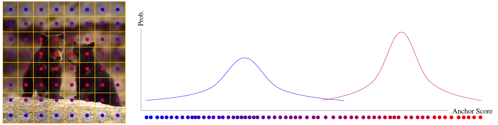
  
    PAA insight：对同一个 GT，当前模型会给不同 anchors 产生一维 anchor score 分布；用两个 Gaussian modes 表示 positive / negative，再按 posterior probability 切分。

    - **Anchor scoring = classification quality × localization quality**

      PAA 用当前模型 $f_\theta$ 对 anchor $a$ 的预测质量做正负样本：

      $$
      S(f_{\theta}(a, x), g)
      =
      S_{cls}(f_{\theta}(a, x), g)
      \times
      S_{loc}(f_{\theta}(a, x), g)^{\lambda}
      $$
  
      其中 $S_{cls}$ 是 GT class 对应的分类分数，$S_{loc}$ 用 predicted box 与 GT 的 IoU
  
      取负对数后，anchor score 与训练 loss 直接对齐：
      $$
      -\log S(f_{\theta}(a, x), g)
      =
      \mathcal{L}_{cls}(f_{\theta}(a, x), g)
      +
      \lambda\mathcal{L}_{IoU}(f_{\theta}(a, x), g)
      $$
      
      > [!NOTE]
      >
    > 用 assignment score 本身来自训练目标
    
  - **GMM-based probabilistic separation**
    
      对每个 GT，PAA 先把所有 anchors 分给其 IoU 最大的 GT，再从每个 FPN level 取 anchor score top-$K$ candidates
    
      然后用EM算法对候选 anchors 的一维 score 分布拟合 two-component GMM：
    
      $$
      P(a|x,g,\theta)
    =
      w_{1}\mathcal{N}_{1}(a;m_1,p_1)
      +
      w_{2}\mathcal{N}_{2}(a;m_2,p_2)
    $$
    
    其中两个 Gaussian modes 分别对应 negative / positive；EM 估计参数后，用每个 anchor 属于 positive component 的概率做分离。
    
    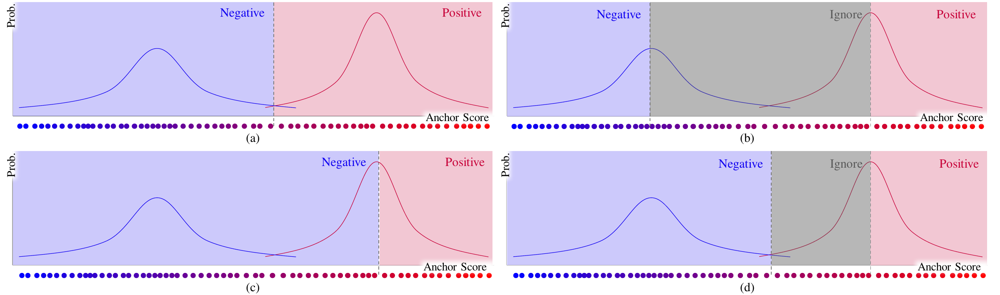
    
    > (c) 在论文 ablation 中最稳定
    
    - **IoU Prediction aligns post-processing with assignment**
    
      为减少 train-test objective gap，模型额外加一个 IoU prediction head，预测 detected box 与 GT 的 IoU定位质量，并在推理时用 unified score 排序：
    
      $$
      \mathcal{L}(f_{\theta}(a), g)
      =
      \mathcal{L}_{cls}(f_{\theta}(a), g)
      +
      \lambda_1\mathcal{L}_{IoU}(f_{\theta}(a), g)
      +
      \lambda_2\mathcal{L}_{IoUP}(f_{\theta}(a), g)
      $$
    
  - 推理时用 $S = S_{cls} \cdot S_{IoUP}^{\lambda}$ 做 NMS ranking，并可进一步用 score voting 微调 box 坐标
  
- Cons:
  
  - 依赖当前模型预测质量


##### DETR

- DETR

  - Globally optimal assignment（一对一）严格限制一个 GT 只匹配一个预测
  - Cons: 收敛慢，小目标不好


##### OTA

- __OTA: Optimal Transport Assignment for Object Detection.__ *Zheng Ge et al.* __CVPR, 2021__ [(Arxiv)](https://arxiv.org/abs/2103.14259) [(Code)](https://github.com/Megvii-BaseDetection/OTA) ([My PDF](https://drive.google.com/file/d/18dAOiw6HhK8r5TwONtKY8Z3RZ6HyrcxA/view?usp=drivesdk))

  - Takeaway: OTA 把 label assignment 写成 Optimal Transport 问题，通过全局最小运输代价得到 one-to-many positives

  - Motivation:多个 GT 争抢同一个 ambiguous anchor 时靠hand-crafted rules（eg: min loss,min IoU）
    
  - Core Mechanism:

    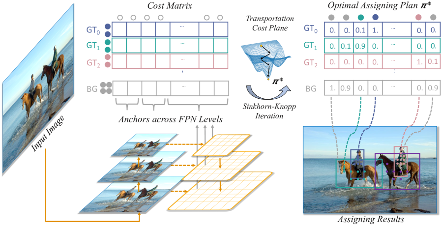

    - **OT formulation**. 对 $m$ 个 GT 和 $n$ 个 anchors，OTA 把每个 GT 看作供应若干 positive labels 的 supplier，把每个 anchor 看作 demand 为 1 的 demander，同时加入 background supplier 负责 negatives。核心目标是最小化 transport cost：
      $$
      \min_{\pi}\sum_{i=1}^{m}\sum_{j=1}^{n}c_{ij}\pi_{ij},
      \quad
      \text{s.t. } \sum_i\pi_{ij}=d_j,\ \sum_j\pi_{ij}=s_i,\ \pi_{ij}\ge0.
      $$
      这里 $c_{ij}$ 是第 $i$ 个 supplier 到第 $j$ 个 anchor 的匹配代价，$\pi_{ij}$ 是运输量；求出的 transport plan 决定 anchor 应该分给哪个 GT 或 background。
  
    - **Cost matrix**. Foreground cost = classification loss + localization loss + centor prior cost(避免训练早期低质量远端 anchors 被错误分配)；background cost 只考虑分类成背景的 loss：
      $$
      c_{ij}^{fg}=L_{cls}(P_j^{cls},G_i^{cls})+\alpha L_{reg}(P_j^{box},G_i^{box})+10^6\left(1-\mathbb{I}^{valid}_{ji}\right),
      \qquad
      c_j^{bg}=L_{cls}(P_j^{cls},\varnothing).
      $$
      在m个GT行下面还有一行bg行，表示选为bg的代价
      
    - **Dynamic $k$ supply**. 每个 GT 的 positive 数量 $s_i$ 不是固定常数，而是由当前预测质量估计：对该 GT 取 top-$q$ IoU 的预测框并求和，得到它大概需要多少 positives。直觉是 easy / large / well-covered objects 可以分到更多 positives，hard objects 则少一些。
    
    - **Sinkhorn-Knopp solver**. OTA 用 Sinkhorn-Knopp 近似求解 OT
    
  - Pros: 更好处理 ambiguous anchors，比 per-GT greedy matching 更 principled。
    
  - Cons:
    - 慢：训练时要构造 cost matrix 并运行 Sinkhorn 迭代
    - 因为 assignment 依赖当前预测质量，训练早期仍需要 prior / cost design 来稳定匹配。


##### SimOTA

- **YOLOX: Exceeding YOLO Series in 2021**. Zheng Ge et.al. **arXiv**, **2021**, [(Arxiv)](https://arxiv.org/abs/2107.08430) [(Code)](https://github.com/Megvii-BaseDetection/YOLOX) ([My PDF](https://drive.google.com/file/d/1_S-BNWADHfHH7Ozqmu2z8dZ5TD9WuJ2i/view?usp=drivesdk))

  - Takeaway: SimOTA 是 OTA 的简化版。保留了 **loss-aware cost + center prior + dynamic number of positives**, 直接用 dynamic top-$k$ 代替OT求解，更快。

  - Motivation: OTA 很慢

  - Core Mechanism:

    1. **Center prior**. SimOTA 不是在全图所有 predictions 上选 positives，而是先限制在一个 fixed center region 内再做匹配。

      why：靠近 GT center 的 grids 更可能是高质量正样本，也能减少训练初期不稳定的低质量匹配。
    $$
      g_x-rs_i < x_i < g_x+rs_i\\
      g_y-rs_i < y_i < g_y+rs_i
    $$
      in yolox $r=1.5$, s=stride

    2. **Pair-wise matching cost**. 对每个 GT $g_i$ 和 prediction $p_j$，先计算匹配代价
    $$
      c_{ij} = L_{ij}^{cls} + \lambda L_{ij}^{reg},
    $$

    3. **Dynamic top-$k$ matching**. 对每个 GT，不是固定分配 1 个或固定 $k$ 个正样本，而是在候选中心区域内选 cost 最小的 top-$k$ predictions 作为 positives。其余grids全为负样本

       这里的 $k$ 不是常数，而是 dynamic: 对每个 GT，先找出与它 IoU 最高的 top-$q$ predictions（OTA 里默认 $q=20$），再把这些 IoU 相加，得到该 GT 需要的正样本数量估计：
       $$
       k_j
         =
         \max
         \left(
         1,
         \left\lfloor
         \sum_{i \in TopK(IoU)}
         IoU(b_i,g_j)
         \right\rfloor
         \right)
       $$

      > [!NOTE]
      >
      > 所以 SimOTA 可以看成：用 cost-based ranking + dynamic top-$k$，去近似 OTA 里的全局最优分配；它保留了“动态正样本数”，但是不做全局最优求解，而是贪婪地直接取topk

  - Cons:
    - 不再显式保证 global optimal assignment
    - center prior 仍然是一种 hand-crafted bias
    - dynamic $k$ 估计仍然依赖当前预测框的 IoU 质量，因此训练初期的 matching 质量也会受模型状态影响

##### DSLA

- __DSLA: Dynamic Smooth Label Assignment for Efficient Anchor-Free Object Detection.__ *Hu Su, Yonghao He et al.* __Pattern Recognition, 2022__ [(Arxiv)](https://arxiv.org/abs/2208.00817) [(Code)](https://github.com/YonghaoHe/DSLA) (Citations __33__).

  - Takeaway: DSLA 将 anchor-free detectors的 hard positive / negative label 改成连续 smooth label，并把 IoU quality 乘进cls branch里

  - Motivation:

    - **Classification inconsistency**: FCOS 这类方法会让相邻 feature points 拿到完全不同的 0/1 label，但它们的 receptive field 很相似，模型很容易预测出相近分类分数，和 hard target 冲突。
    
  - Core Mechanism:

    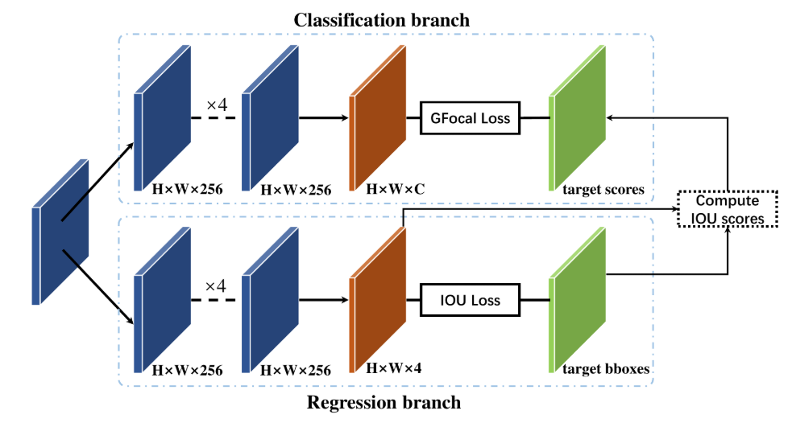

    

    - **Interval relaxation: smooth FPN level assignment**

      FCOS 原本用 feature level 的固定范围做 hard assignment。DSLA 先把每个尺度边界 $m_j$ 放宽成上下界：

      $$
      m_j^l = m_j(1-\kappa),
      \qquad
      m_j^u = m_j(1+\kappa)
      $$
  
      然后对边界附近的 points 赋连续 head score：

      $$
      {\rm head_s^i} =
      \begin{cases}
      1.0, & m_{i-1}<\max \le m_i\\
      \frac{m_{i-1}-\max}{m_{i-1}-m_{i-1}^l}, & m_{i-1}^l<\max \le m_{i-1}\\
      \frac{\max-m_i}{m_i^u-m_i}, & m_i<\max \le m_i^u\\
      0.0, & otherwise
      \end{cases}
      $$
  
      其中 $\max=\max(l^*,t^*,r^*,b^*)$。直觉是：跨 FPN level 的边界不要突然从 1 掉到 0，而要有一个缓冲带。

    - **Core zone: guarantee high target near object center**

      FCOS普通 centerness 几乎只有精确落在中心才等于 1，小目标或 stride 粗的 feature map 容易没有高 confidence target。DSLA 对每个 GT 在当前 feature stride $s$ 下定义 core zone：

      $$
      z_l=\max(0.5(b_l+b_r)-s/2,b_l),
      \quad
      z_r=\min(0.5(b_l+b_r)+s/2,b_r)
      $$
      
      $$
      z_t=\max(0.5(b_t+b_b)-s/2,b_t),
      \quad
      z_b=\min(0.5(b_t+b_b)+s/2,b_b)
      $$
      
      若 point 落在 core zone $Z$ 内，直接令 centerness 为 1：
  
      $$
      {\rm centerness_s} =
      \begin{cases}
      \sqrt{
      \frac{\min(l^*,r^*)}{\max(l^*,r^*)}
      \times
      \frac{\min(t^*,b^*)}{\max(t^*,b^*)}
      }, & C_P \notin Z\\
      1.0, & C_P \in Z
      \end{cases}
      $$
      
  
    最终的静态 smooth label 是：
  
    $$
    {\rm label_s} = {\rm centerness_s} \times {\rm head_s}
    $$
  
    - Dynamic IoU coupling: ${\rm label_d} = {\rm label_s} \times {\rm IoU_s}$
  
  - Cons: online IoU 在训练早期很低且变化大，所以必须依赖 centerness prior 稳定，不能单独用 IoU target。
  

##### LAD

- __Improving Object Detection by Label Assignment Distillation.__ *Chuong H. Nguyen et al.* __WACV, 2022__ [(Arxiv)](https://arxiv.org/abs/2108.10520) [(Code)](https://github.com/cybercore-co-ltd/CoLAD) (Citations __58__).

  - Takeaway: LAD 让 teacher 来执行 label assignment：用 teacher 的预测框/分类分数计算 assignment cost

  - Core Mechanism:

    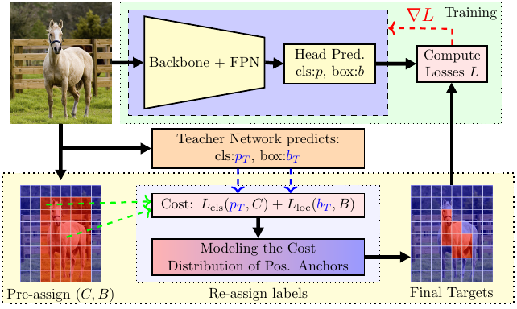
  
    - LAD直接用teacher来做label assignment：甚至小模型蒸大模型也能提升（不依赖容量优势）

      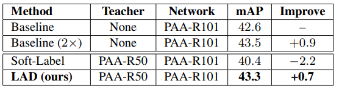

    - SoLAD: soft-label KD(正常蒸馏) + LAD
    
    - CoLAD: CoLAD 让两个网络从头共同训练，并动态选择当前谁更适合作为 teacher
    
  - Pros:

    - CoLAD 不要求预训练 teacher；实验中小 teacher 也能提升大 student，说明 LAD 不完全依赖 teacher 容量优势。
