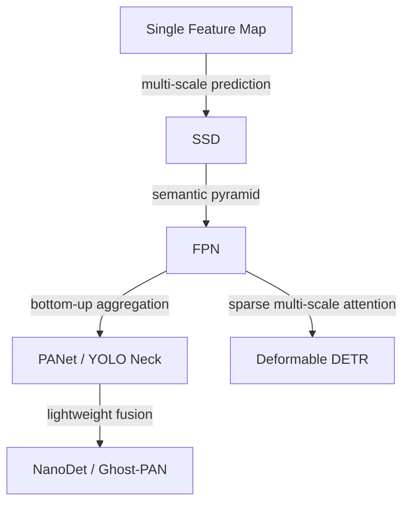

# Problem Line: Multi-Scale Feature Fusion

[TOC]

## Central Question

detector 如何同时利用高分辨率定位细节和高层语义上下文？

## Why It Matters

Object Detection 是 dense prediction 问题。小目标需要精细空间细节，分类和上下文判断又需要高层语义特征。Multi-scale feature fusion 就是在这两个需求之间搭桥。

## Paper Matrix

| Paper / Method | 为什么放入这条线 | 在线中的作用 | 详细笔记 |
| --- | --- | --- | --- |
| SSD | 一次前向中在多个 feature maps 上进行预测。 | 早期 multi-scale dense head | [02-OD-Model-Zoo](02-OD-Model-Zoo.md#ssd-zoo) |
| FPN | 通过 top-down pathway 和 lateral connection 构建 feature pyramid。 | 经典语义-空间融合结构 | [02-OD-Model-Zoo](02-OD-Model-Zoo.md#fpn-zoo) |
| PANet / YOLO necks | 增加 bottom-up aggregation，并形成实用 detector neck 设计。 | 双向特征聚合 | [02-2-YOLO-Zoo](02-2-YOLO-Zoo.md) |
| NanoDet / Ghost-PAN | 将 feature fusion 改造成更适合轻量部署的结构。 | Efficient feature pyramid | [02-OD-Model-Zoo](02-OD-Model-Zoo.md#nanodet-zoo) |
| Deformable DETR | 使用 multi-scale deformable attention 做高效 dense spatial sampling。 | 稀疏 multi-scale attention | [02-3-DETR-Zoo](02-3-DETR-Zoo.md) |

## Relation

## Open Questions

- 什么时候 feature fusion 比 assignment 或 loss design 更关键？
- 面向 tiny objects 时，feature pyramid 应该如何调整？
- CNN pyramid 和 transformer multi-scale attention 在实践中有什么本质差异？
