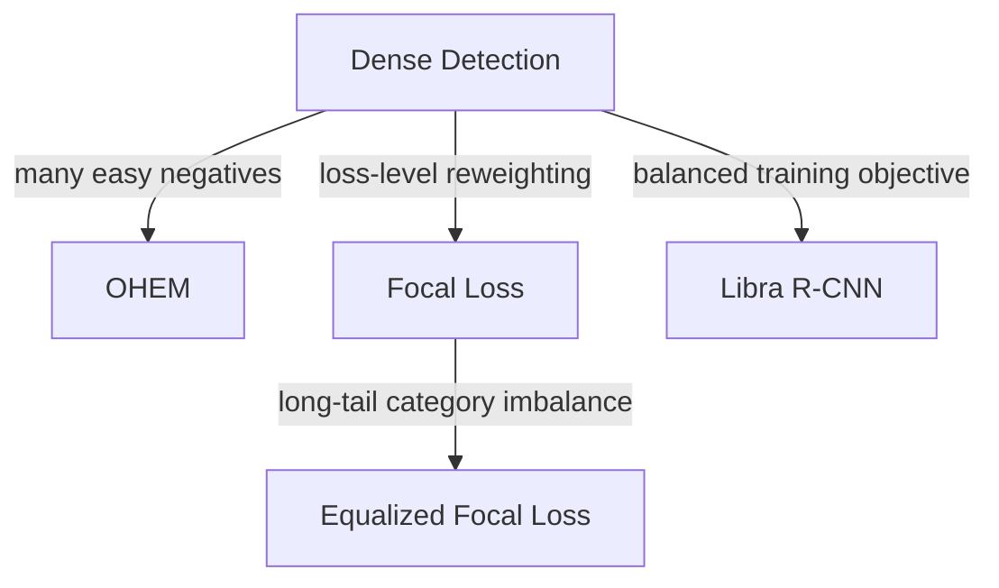

# Problem Line: Class Imbalance and Hard Examples

[TOC]

## Central Question

detector 应该如何处理前景/背景不平衡、easy/hard example 不平衡，以及 long-tail class imbalance？

## Why It Matters

Dense detector 会评估大量候选位置，其中绝大多数都是 easy background。如果不做平衡，梯度很容易被无信息负样本或高频类别主导。

## Paper Matrix

| Paper / Method | 为什么放入这条线 | 在线中的作用 | 详细笔记 |
| --- | --- | --- | --- |
| OHEM | 显式挖掘 hard examples。 | Hard-example sampling baseline | [本节详细笔记](#hard-example-mining) |
| Focal Loss | 在 dense detection 中降低 easy examples 的权重。 | Easy-negative suppression | [03-1-Loss](03-1-Loss.md#focal-loss) |
| Equalized Focal Loss | 将 focal-style weighting 扩展到 long-tail class frequency。 | Long-tail imbalance handling | [本节详细笔记](#class-imbalance) |
| Libra R-CNN | 从 balanced learning 角度研究 detection 训练。 | Balanced sampling/training view | [本节详细笔记](#libra-r-cnn-balanced-learning) |

## Relation

## Open Questions

- imbalance 应该通过 sampling、loss weighting 还是 assignment 解决？
- class imbalance 和 localization-quality ranking 之间如何相互影响？
- hard-example mining 对 small-object detection 是帮助更大，还是更容易引入不稳定？

## Detailed Notes

## Class Imbalance

- **Focal Loss for Dense Object Detection**. Tsung-Yi Lin et.al. **ICCV**, **2017**, [(Arxiv)](https://arxiv.org/abs/1708.02002) [(S2)](https://www.semanticscholar.org/paper/Focal-Loss-for-Dense-Object-Detection-Lin-Goyal/1a857da1a8ce47b2aa185b91b5cb215ddef24de7).

  - Takeaway: Focal Loss down-weights easy examples to address extreme foreground-background class imbalance in dense detectors.

  - Motivation: Dense detectors evaluate huge candidate locations; most are easy background, dominating standard cross-entropy loss.

  - Core Mechanism:
    - Binary cross-entropy with modulating factor
    - Let $y \in \{0,1\}$ be label, $p \in [0,1]$ be model prediction:
    - $p_t = \begin{cases} p & \text{if } y=1 \\ 1-p & \text{if } y=0 \end{cases}$
    - Cross Entropy: $\mathrm{CE}(p_t) = -\log(p_t)$
    - Focal Loss: $\mathrm{FL}(p_t) = -(1-p_t)^{\gamma}\log(p_t)$
    - $\gamma \geq 0$ is focusing parameter (typical: $\gamma=2$)
    - Easy examples ($p_t \approx 1$): $(1-p_t)^\gamma \approx 0$, loss heavily reduced
    - Hard examples ($p_t \ll 1$): modulating factor stays large, focused learning

  - Pros:
    - Eliminates need for hard negative mining
    - Foundation for RetinaNet and subsequent methods
    - Addresses two imbalance types: positive/negative and easy/hard

  - Cons:
    - Requires tuning $\gamma$ for different tasks
    - May still struggle with extreme long-tail distributions

- **Equalized Focal Loss**. Bing Li et.al. **CVPR**, **2022**, [(Arxiv)](https://arxiv.org/abs/2201.02593) [(S2)](https://www.semanticscholar.org/paper/Equalized-Focal-Loss-for-Dense-Long-Tailed-Object-Li-Yao/d1d75ac25fd457166360c346cf89005e2531a5fc).

  - Takeaway: EFL addresses long-tailed distribution with category-relevant modulating factors, dynamically adjusting loss based on imbalance degrees.

  - Motivation: Focal Loss treats all categories equally, but real-world datasets have severe class frequency imbalance (e.g., LVIS).

  - Core Mechanism:
    - **Category-relevant modulating factor**: Different modulating parameters for different categories
    - Reweights loss contribution based on class frequency
    - Balances gradients between frequent and rare classes
    - Adaptive to dataset's tail distribution

  - Pros:
    - Strong results on LVIS v1 benchmark
    - Better handles long-tailed distributions than standard FL
    - Dynamically adjusts per-category learning

  - Cons:
    - Additional hyperparameters per category
    - Requires class frequency statistics

## Hard Example Mining

原 archive 仅保留了该 heading；OHEM 作为 hard-example mining baseline 先在 Paper Matrix 中记录，详细笔记待补充。

## Libra R-CNN: Balanced Learning

- **Libra R-CNN: Towards Balanced Learning**. Jiangmiao Pang et.al. **CVPR**, **2019**, [(Arxiv)](https://arxiv.org/abs/1904.02701) [(S2)](https://www.semanticscholar.org/paper/Libra-R-CNN%3A-Towards-Balanced-Learning-for-Object-Pang-Chen/32a69681c103807704f71b838454c7924ceec5ce).

  - Takeaway: Libra R-CNN addresses three imbalance levels (sample, feature, objective) with IoU-balanced sampling, Balanced Feature Pyramid, and Balanced L1 Loss.

  - Motivation: Object detection suffers from multiple imbalance types: foreground-background, feature pyramid levels, and regression loss contributions.

  - Core Mechanism:
    - **IoU-balanced sampling**: Reduces sample-level imbalance by resampling based on IoU
    - **Balanced Feature Pyramid**: Reduces feature-level imbalance with integrated features
    - **Balanced L1 Loss**: Reduces objective-level imbalance by controlling regression loss gradients
    - Addresses imbalance at three levels systematically

  - Pros:
    - +2.5 AP over FPN Faster R-CNN
    - +2.0 AP over RetinaNet
    - Comprehensive solution to multiple imbalance types

  - Cons:
    - Adds complexity to training pipeline
    - More hyperparameters to tune

