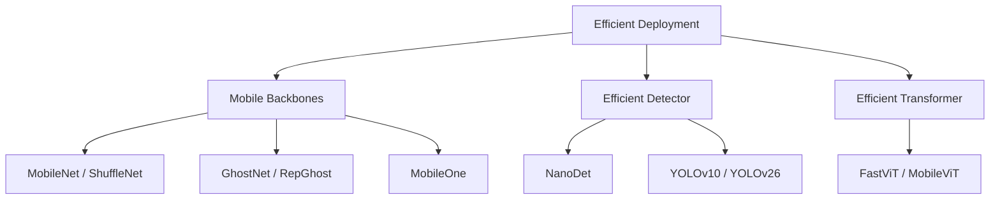

# Problem Line: Efficient Deployment

[TOC]

## Central Question

detector 如何在尽量不损失精度的情况下，改善真实 latency、memory footprint 和部署简洁性？

## Why It Matters

部署效率不只是 FLOPs。Memory access、branch structure、NMS/post-processing、quantization compatibility 和 export simplicity 都会影响真实设备表现。

## Paper Matrix

| Paper / Method | 为什么放入这条线 | 在线中的作用 | 详细笔记 |
| --- | --- | --- | --- |
| MobileNet v1/v2/v3 | 引入 mobile-friendly convolutional design。 | Efficient backbone baseline | [02-OD-Model-Zoo](02-OD-Model-Zoo.md#mobilenet-zoo) |
| ShuffleNet | 面向高效 group convolution 和 channel shuffle。 | Lightweight CNN design | [02-OD-Model-Zoo](02-OD-Model-Zoo.md#shuffle-net-zoo) |
| GhostNet / GhostNetV2 / RepGhost | 利用 feature redundancy 和 re-parameterization 生成 cheap features。 | Cheap operation / reparam backbone | [02-OD-Model-Zoo](02-OD-Model-Zoo.md#ghostnet-zoo) |
| MobileOne | 训练多分支结构，推理时融合为单分支。 | Structural reparameterization | [02-OD-Model-Zoo](02-OD-Model-Zoo.md#mobileone) |
| NanoDet / NanoDet-Plus | 面向移动端检测设计轻量 head / neck。 | Efficient detector design | [02-OD-Model-Zoo](02-OD-Model-Zoo.md#nanodet-zoo) |
| FastViT / MobileViT | 将 transformer-style representation 适配到 mobile latency 约束。 | Efficient vision transformer | [02-5-Vit-Zoo](02-5-Vit-Zoo.md#fastvit) |
| YOLOv10 / YOLOv26 | 减少后处理或简化推理组件，服务部署。 | NMS-free / export-friendly detection | [02-2-YOLO-Zoo](02-2-YOLO-Zoo.md#yolov10) |

## Relation

## Open Questions

- 哪个指标最能预测当前项目的真实设备 latency？
- 什么情况下去掉 NMS 比缩小 backbone 更重要？
- 哪些设计选择更适合 quantization / export？
