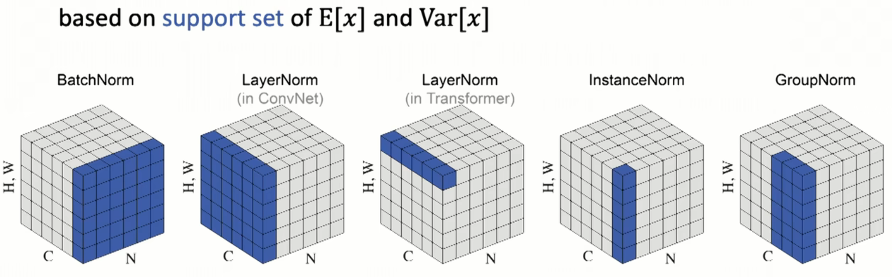

# Training Recipe
[TOC]

本文件保留不适合放入现有核心问题线的通用训练技巧，包括 data augmentation、initialization 和部分 training regularization。和 `03-1` 到 `03-7` 不同，这里不是严格的目标检测 problem line，而是训练技巧材料库。

## Data Augmentation

- color augmentation, random affine, random flip, and mosaic

- **Bag of Freebies for Training Object Detection Neural Networks**. Zhi Zhang et.al. **arxiv**, **2019**, [(Arxiv)](https://arxiv.org/abs/1902.04103) [(S2)](https://www.semanticscholar.org/paper/Bag-of-Freebies-for-Training-Object-Detection-Zhang-He/0ba8182fa99559257e99a56d790bf2c705c42537).
  - Takeaway: Systematically explores training tweaks that improve Faster R-CNN and YOLOv3 without architecture changes.
  
  - Motivation: Classical object detectors often overlook training details; many simple improvements can be combined for cumulative gains.
  
  - Core Mechanism:
    - **Visually Coherent Image Mixup**: Specialized mixup for object detection preserving spatial alignment
    - **Label Smoothing**: Regularization for classification head, smooths one-hot targets
    - **Cosine Learning Rate Schedule**: Outperforms traditional step LR schedules, smoother decay
    - **Synchronized Batch Normalization**: Better multi-GPU training performance
    - Random geometry transformations with careful application
  
  - Pros:
    - Up to 5% absolute precision improvement
    - No inference cost increase (pure training tricks)
    - Generalizable across different detectors
  
  - Cons:
    - Requires careful hyperparameter tuning
    - Some techniques may not transfer to all datasets
  
- **Simple Copy-Paste is a Strong Data Augmentation Method**. Golnaz Ghiasi et.al. **CVPR**, **2021**, [(Arxiv)](https://arxiv.org/abs/2012.07177) [(S2)](https://www.semanticscholar.org/paper/Simple-Copy-Paste-is-a-Strong-Data-Augmentation-for-Ghiasi-Cui/914a593b7f2e980470075a9955f1407641669a8f).

  - Takeaway: Copy-Paste augmentation pastes objects from one image onto another, achieving SOTA on multiple datasets.

  - Motivation: Object detection needs diverse training data; complex augmentations can be hard to design.

  - Core Mechanism:
    - **Copy-Paste**: Randomly paste objects from source image onto target image
    - Combines with self-training for additive gains
    - Preserves instance masks, enabling simultaneous detection and segmentation

  - Pros:
    - Simple to implement
    - State-of-the-art on COCO, LVIS, PASCAL
    - Effective for instance segmentation

  - Cons:
    - May create unrealistic scenes
    - Limited to datasets with instance masks

### low_contrast

low_contrast低对比度增强：当前 `RemoAniFaceDet` 代码里的 `low_contrast` 是一种训练期 photometric(光度测定) augmentation，用来模拟动物毛色、脸部纹理和背景颜色接近时的低可分辨度场景。它的核心不是普通 `contrast` 那样把所有像素乘一个比例，而是把图像向一个参考图 `ref` 混合，使像素逐渐靠近全局均值颜色或自身灰度版本：
$$
I' = \alpha I + (1 - \alpha)R
$$

其中 \(I\) 是原图，\(R\) 是参考图，\(\alpha \in [lower, upper]\)。\(\alpha\) 越小，原图保留越少，图像越灰、颜色差异越弱，前景和背景越接近；\(\alpha\) 越接近 1，增强越轻。

`LowContrast` 在常规颜色扰动之后、随机遮挡之前执行，因此它会作用在已经 resize/pad 并做过其他颜色增强的训练图上，但不会改变 bbox。

`RandomLowContrast` 的主要逻辑如下：

```python
if not low_contrast_prob or np.random.random() >= low_contrast_prob:
    return image

assert 0.0 <= lower <= upper <= 1.0

image = image.astype(np.float32)
alpha = np.random.uniform(lower, upper)

if np.random.random() < 0.5:
    ref = image.mean(axis=(0, 1), keepdims=True)
else:
    gray = cv2.cvtColor(image.astype(np.uint8), cv2.COLOR_BGR2GRAY)
    ref = cv2.cvtColor(gray, cv2.COLOR_GRAY2BGR).astype(np.float32)

image = image * alpha + ref * (1.0 - alpha)
image = np.clip(image, 0, 255).astype(np.uint8)
```

这里有两种参考图：

- **全图均值颜色**：`ref = image.mean(axis=(0, 1), keepdims=True)`，得到一个 BGR 三通道均值颜色，再通过 broadcast 混合到整张图。效果是把所有像素拉向同一个全局平均色，直接压缩图像的颜色和亮度差异。
- **灰度图转 BGR**：先 `BGR -> GRAY`，再 `GRAY -> BGR`。效果是保留局部明暗结构，但削弱色彩差异，让模型不要过度依赖颜色区分动物脸和背景。

和普通 `RandomContrast` 的区别：

- `RandomContrast` 是 `image *= delta`，主要改变整体像素强度尺度；`delta < 1` 会变暗，`delta > 1` 会变亮/增强，但像素之间的相对关系大体仍在。
- `RandomLowContrast` 是把图像往均值色或灰度图收缩，直接降低局部/全局可分辨度，更贴近“动物脸和背景相似、纹理边界不明显”的困难样本。

## Hard Negative Mining

- Takeaway: Hard Negative Mining(HNM) 是目标检测训练中处理正负样本极度不平衡的一种采样策略。dense detector 会在每张图上产生大量候选位置，其中绝大多数都是背景负样本。如果所有负样本都参与分类 loss，训练容易被大量“很容易判成背景”的位置主导，模型把容量浪费在简单背景上，而真正容易误检的困难背景反而没有得到足够关注。

  HNM 的核心思想是：正样本全部保留；负样本不全部保留，只选模型当前最容易误判的高分负样本。

  > 这里的 hard negative 通常指：GT assignment 后被标为背景，但是模型给出了较高 foreground score 的位置。它们更接近 false positive，因此比大量低分背景更有训练价值。

- Motivation

  在检测任务里，正样本和负样本数量通常差距很大：

  如果分类 loss 使用所有负样本，可能产生两个问题：

  1. 负样本数量压倒正样本：总 loss 主要来自背景位置，正样本监督被稀释。
  2. 简单负样本占比过高：很多背景位置预测分数已经很低，对继续训练的边际价值小。


- Pipeline

  把 HNM 加在普通检测分类 loss 路径上：

  ```python
  label_weights, hard_neg_states = self._apply_hard_negative_mining(
      cls_preds, labels, label_weights
  )
  loss_qfl = self.loss_qfl(
      cls_preds,
      (labels, label_scores),
      weight=label_weights,
      avg_factor=num_total_samples,
  )
  ```

  也就是说，HNM 实际是通过修改 `label_weights` 来控制哪些样本进入 `QualityFocalLoss`：

  - 正样本的 `label_weight` 保留为 1。
  - 未选中的负样本 `label_weight` 置为 0。
  - 被选中的 hard negatives `label_weight` 保留为 1。

  筛选逻辑：

  ```python
  valid_weight = label_weights > 0
  pos_mask = (labels >= 0) & (labels < self.num_classes) & valid_weight
  neg_mask = (labels == self.num_classes) & valid_weight
  num_pos = int(pos_mask.sum().item())
  num_neg = int(neg_mask.sum().item())
  max_neg = min(num_neg, max(0, int(num_pos * neg_ratio)))
  
  mined_weights = label_weights.new_zeros(label_weights.shape)
  mined_weights[pos_mask] = label_weights[pos_mask]
  if max_neg > 0:
      neg_scores = cls_preds.detach().sigmoid().max(dim=1).values
      neg_scores = neg_scores.masked_fill(~neg_mask, -1.0)
      _, topk_inds = torch.topk(neg_scores, k=max_neg)
      mined_weights[topk_inds] = label_weights[topk_inds]
  ```

  其中：

  - `pos_mask`：assign 到 GT 的正样本。
  - `neg_mask`：label 等于 `num_classes` 的背景负样本。
  - `neg_scores`：每个负样本位置的最大 foreground probability。
  - `neg_ratio`：最多保留多少负样本，规则是 `max_neg = min(num_neg, num_pos * neg_ratio)`。

  因此当 `neg_ratio = 3.0` 时，最多保留正样本数量 3 倍的负样本。

- Pros

  - 降低简单背景样本对分类 loss 的主导。

  - 让训练更关注高分背景，即更接近误检的困难负样本。

  - 对检测任务的正负样本不平衡问题有直接缓解作用。

  - 不增加推理成本，只影响训练阶段。

- Cons

  - `neg_ratio` 需要调参，过小可能导致背景监督不足，过大则接近全负样本训练。

  - 如果模型早期预测很不稳定，hard negative 选择可能带来噪声。

  - 当前实现按全局负样本分数 top-k 选择，没有做 per-level HNM；如果不同 FPN level 的负样本分布差异很大，可能导致某些 level 的负样本被选得太少。


## Initialization

### 权重初始化

- Xavier initialization [(paper)](https://proceedings.mlr.press/v9/glorot10a/glorot10a.pdf) [(Good Intro)](https://zhuanlan.zhihu.com/p/653754525)

  - Takeaway: 

    Xavier initialization sets the initial weights so that the variance of activations stays roughly stable across layers. 

  - Motivation: 

    Glorot and Bengio proposed it to reduce vanishing and exploding signals in deep networks.

  - Core Mechanism

    Xavier initialization chooses weights with zero mean and a variance that depends on both the number of input connections and the number of output connections.

    每个输出$o_i$都可以表示为
    $$
    o_i = \text{activation}(\sum_{j=1}^{n_{in}} w_{ij} x_j + b_i) \\
    $$
    那么$\sum_{j=1}^{n_{in}} w_{ij} x_j$的方差将为$n_{in}\times Var(w)\times Var(x)$，为了让每一层的输出方差接近其输入的方差，设置权重$w$的初始方差为
    $$
    \mathrm{Var}(W) \approx \frac{2}{fan_{in} + fan_{out}}
    $$
    然后权重会从，均值0和这样的方差的正态分布或者从以下均匀分布中抽取

    The Xavier normal form is
    $$
    W_{ij} \sim \mathcal{N}\left(0,\; \frac{2}{fan_{in} + fan_{out}}\right)
    $$
    The Xavier uniform form is
    $$
    W_{ij} \sim U\left[-a,\; a\right]
    $$
    where
    $$
    a = \sqrt{\frac{6}{fan_{in} + fan_{out}}}
    $$

    > [!NOTE]
    >
    > 上面只是解释了Xavier长什么样，以及为什么有用，但是没有告诉我们如何推导的，下面我来解释一下：
    >
    > - if \(x, y, w\) have independent elements
    > - if linear activation
    >
    > one layer: variance scaled by
    > \[
    > \mathrm{Var}[y] = n \mathrm{Var}[w]\mathrm{Var}[x]
    > \]
    >
    > many layers: variance scaled by
    > \[
    > \mathrm{Var}[y] = \prod_d n_d \mathrm{Var}[w_d]\mathrm{Var}[x]
    > \]
    > forward
    >
    > \[
    > \mathrm{Var}[y] = \prod_d n_d \mathrm{Var}[w_d]\mathrm{Var}[x]
    > \]
    >
    > backward
    >
    > \[
    > \mathrm{Var}\left[\frac{\partial \mathcal{E}}{\partial x}\right]
    > =
    > \prod_d m_d \mathrm{Var}[w_d]
    > \mathrm{Var}\left[\frac{\partial \mathcal{E}}{\partial y}\right]
    > \]
    >
    > vanishing gradient, if < 1. exploding gradient, if > 1
    >
    > 因此我们需要前面的系数$m_d \mathrm{Var}[w_d] = 1$，这就是Xavier init，这样可以保持每一层的方差
    >
    > 在有ReLU的情况下，我们需要做一些修改，比如$\frac{1}{2}m_d \mathrm{Var}[w_d] = 1$

  - Pros

    - 一定程度避免梯度消失和爆炸
    - 加速收敛

  - Cons

    - It is not the best choice for **ReLU** family activations, where He initialization is usually better.

    - It may still perform poorly in very deep or highly specialized architectures if used without adaptation.

- Guassian initialization

  - Core Mechanism

    In its most basic form, Gaussian initialization sets each weight as
    $$
    W_{ij} \sim \mathcal{N}(\mu,\sigma^2)
    $$
    In practice, people often use zero mean:
    $$
    W_{ij} \sim \mathcal{N}(0,\sigma^2)
    $$

  - Pros
    - a general random initialization method
  - Cons
    - Its quality depends heavily on the choice of $\sigma$.

- Kaiming/He initialization

  - Takeaway: 一种专门为 ReLU / LeakyReLU 系列激活函数设计的权重初始化方法。核心思想是：根据输入维度 `fan_in` 调整权重方差，让信号在深层网络中传播时尽量不变大、不变小

  - Motivation: 

    深层神经网络如果初始化不好，会出现两个问题：

    ```
    权重太小 → 激活值和梯度越传越小 → 梯度消失
    权重太大 → 激活值和梯度越传越大 → 梯度爆炸
    ```

    Xavier 初始化适合 `tanh`、`sigmoid` 这类比较对称的激活函数，但 **ReLU 会把负数直接截断为 0**：

    ```
    ReLU(x) = max(0, x)
    ```

    这意味着经过 ReLU 后，大约一半的输入会变成 0，激活分布的方差会发生变化。所以 He 初始化专门针对 ReLU 做了修正，让初始化方差比 Xavier 更大一些，从而补偿 ReLU 截断带来的信号损失。

  - Core Mechanism:

    Kaiming/He initialization 会根据当前层的 `fan_in`(当前层的输入维度) 设置权重方差：
    $$
    \mathrm{Var}(W)=\frac{2}{fan\_in}
    $$
    两个实现版本：Kaiming normal 和Kaiming uniform，这里就不展开介绍了


#### 如何选择

```
tanh / sigmoid / linear  → Xavier uniform 或 Xavier normal
ReLU / LeakyReLU         → Kaiming / He init
Transformer / BERT复现   → 按原论文/代码，常见是 normal std=0.02
自定义 gaussian_init     → 先看它的 mean/std 是否合理
```

## Normalization

保持训练中每层的方差，训练中及时初始化是这样的，但是训练过程中还是会打破这样的平衡，所以添加一层normalization layer。

- Pros
  - 加速收敛
  - 提高精度

各种变种：

- BatchNorm(BN)
- LayerNorm
- InstanceNorm
- GroupNorm



## Others

- EMA (Exponential Moving Average)
  - **What it is:** maintain a smoothed copy of model parameters updated every step.
  - **Update rule:** $\theta^{EMA}_t = \beta \theta^{EMA}_{t-1} + (1 - \beta) \theta_t$, where $\beta \in [0.9, 0.9999]$.
  - **How to use:** train with normal weights $\theta_t$, but **evaluate and/or export** using $\theta^{EMA}_t$.
  - **Why it helps:** reduces noise from SGD updates, improves stability, and often yields better validation/inference performance.
- earlystop
- label smoothing
- multi-stage training

掩蔽文本训练和跨实例对比学习

- zero-shot setting是什么

- 伪掩码注释，该数据集作为掩码头的主要训练数据

- 零样本检测表现
- 冻结骨干,新增关键头进行训练(不同关键点头负责不同内容分别进行训练)
