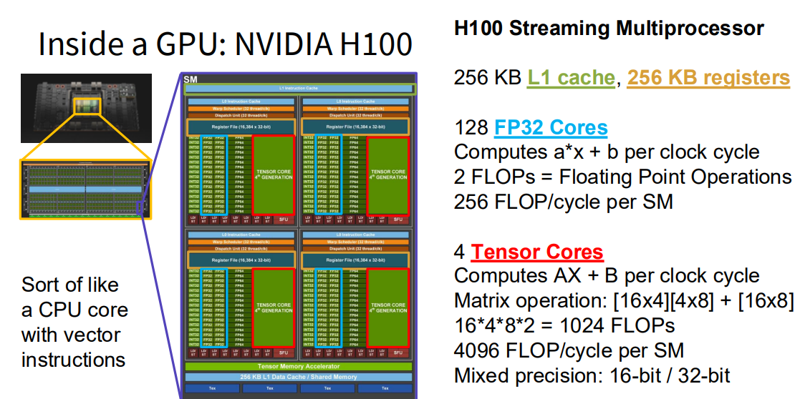
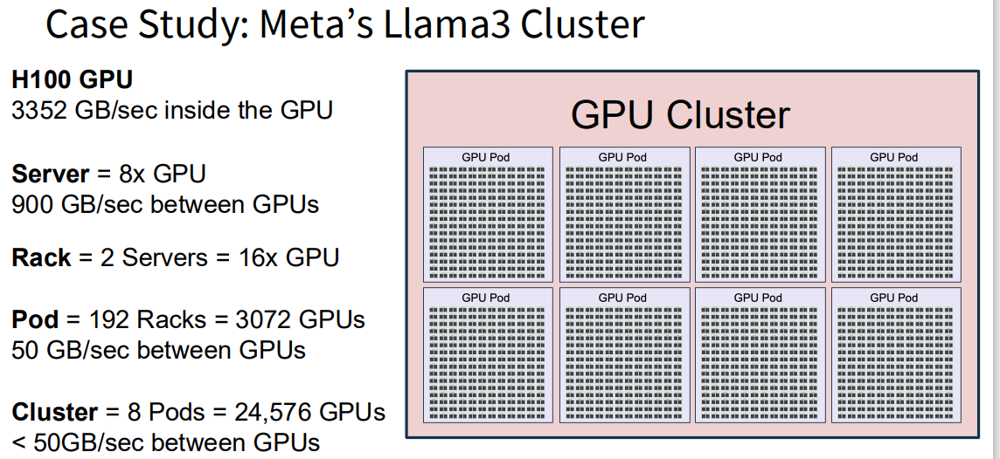
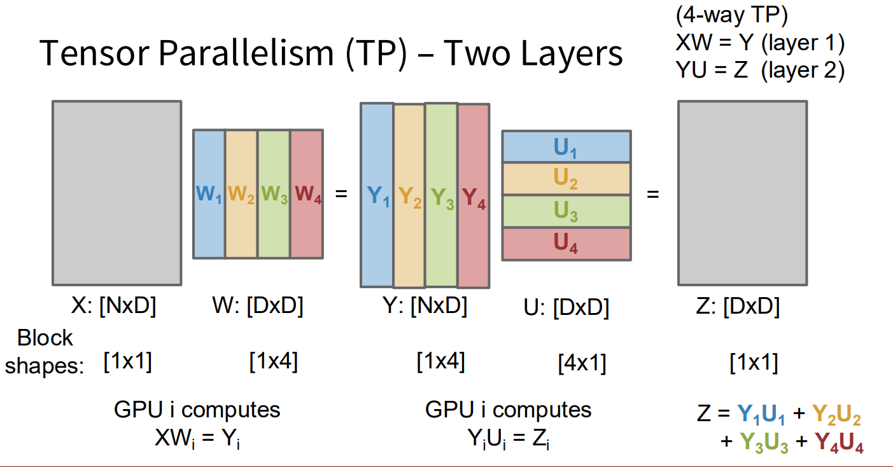

# Large-Scale Distributed Training

## What are GPUs

GPU = Graphics Processing Unit

> computer architecture

Now we have a GPU, and stack many of them to a supercomputer

GPU cluster = one big computer.

- Goal: Train one giant neural network on this cluster

- Google: Tensor Processing Units (TPUs)

## How to Train On lots of GPUs

GPUs are many and work independently and can`t talk about each other too much. On the top of that, we should first consider to split up things.

A model with L layers operates on tensors of shape (Batch, Sequence, Dim)

- Data Parallelism (DP) Split on Batch dimension
- Context Parallelism (CP) Split on Sequence dimension
- Pipeline Parallelism (PP) Split on L dimension
- Tensor Parallelism (TP) Split on Dim dimension

### Data Parallelism (DP)

- Idea: Use minibatch of MN samples, split over M GPUs

- Pipeline

  - Each GPU computes gradient on N examples
  - Average gradients across M GPUs

- Cons: Model size constrained by GPU memory.

  [Sol](#Fully Sharded Data Parallelism (FSPD)): Split model weights across GPUs

  > [!TIP]
  >
  > Each weight needs 4 numbers (weight, grad, Adam β1,  β2 ). Each number needs 2 bytes.

#### Fully Sharded Data Parallelism (FSPD)

- Idea: Split model weights across GPUs

  Each weight Wi is owned by one GPU, which also holds its grads and optim states.

- Pipeline

  1. Before forward for layer i, the GPU that owns $W_i$ broadcasts it to all GPUs.

  2. All GPUs run forward for layer i, then delete their local copy of $W_i$

     > [!NOTE]
     >
     > Fetch $W_{i+1}$ while computing forward with $W_i$ to accelerate.

  3. Before backward for layer i, owner broadcasts Wi to all GPUs

  4. All GPUs run backward for layer i to compute local dL/dWi and delete Wi

  5. Owner of Wi makes gradient update

     > [!NOTE]
     >
     > Fetch Wi while computing with  $W_{i+1}$; send dL/dWi and update Wi while computing with $W_{i-1}$

#### Hybrid Sharded Data Parallel (HSDP)

Split N = M*K GPUs into M groups of K Each group of K GPUs does FSDP, **splits  model weights** across all K GPUs. K can be O(100) GPUs. Do **DP** across the M groups.

---

#### Activation Checkpointing

- PD Cons: Model activations can fill up memory.

  Sol: Solution: Don’t keep all activations in  memory; recompute them on the fly!

- Each layer in the network is two functions:

  - Forward: Compute next-layer activations
    $$
    A_{i+1} = F_i^{\rightarrow}(A_i)
    $$

  - Backward: Compute prev-layer gradients
    $$
    G_i = F_i^{\leftarrow}(A_i,G_{i+1})
    $$

  If we save the activations, the Forward+backward: O(N) compute, O(N) memory

- Idea: Recompute activations during the backward pass

  Full Recomputation: O(N^2) compute, O(1) memory. The O(N^2) is bad.

- Idea: Don’t recompute everything, save a checkpoint every C layers

  C checkpoints: O(N^2/C) compute, O(C) memory.

So now we have HSDP + Activation Checkpointing.

- Cons: Lots of knobs to tune! How should we set them?

  Sol: Maximize Model Flops Utilization (MFU)

#### Hardware FLOPs Utilization (HFU)

What fraction of the GPU’s theoretical peak FLOPs is being used for “useful” model computation?

### Context Parallelism (CP) 

> [!TIP]
>
> Usually for Transformers

- Idea: Transformers operate on L-length sequences. Use multiple GPUs to process a single long sequence.
- Normalization, residual connections and MLP Trivially parallelizable
- Attention: More complex, need to dig in
  - QKV Projection: Same as MLP
  - Attention operator: Hardest to parallelize
    - (Option 1) Ring Attention: Divide into blocks and  distribute over GPUs. Inner loop over keys/values,  outer loop over queries. Complex to implement but  can scale to very long sequences.
    - (Option 2) Ulysses: Don’t try to distribute attention matrix,  instead parallelize over heads in multihead attention.  Simpler, but max parallelism = number of heads

### Pipeline Parallelism (PP)

- Idea: Split the layers of the model across GPUs. Copy activations  between layers at GPU boundaries.

- Cons: Sequential dependencies; GPUs are mostly sitting idle

  Sol: Run multiple microbatches at the same time, pipeline them through the GPUs

### Tensor Parallelism (TP)

- Idea: Split the weights of each linear layer across GPUs, use block matrix multiply

- Cons: Need to gather parts of Y after forward, can’t overlap with communication

- Sol: With 2 consecutive TP layers, shard first over row and second over column to avoid communication

  

  No need for communication after XW=Y! Each GPU computes one term of Z, then broadcasts to all other GPUs

### How to use for largest models

use all of them above.

## References

- [Stanford silde](https://cs231n.stanford.edu/slides/2025/lecture_11.pdf)