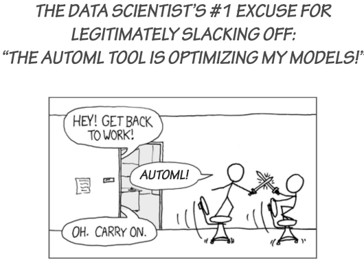
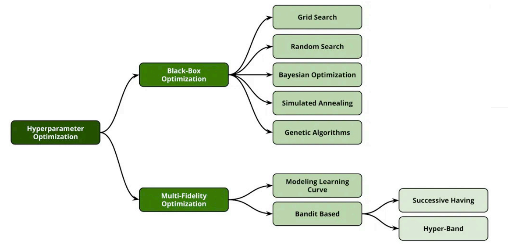
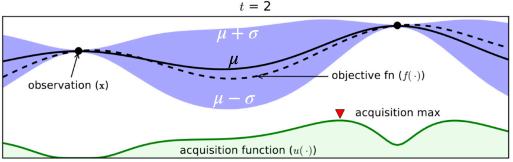
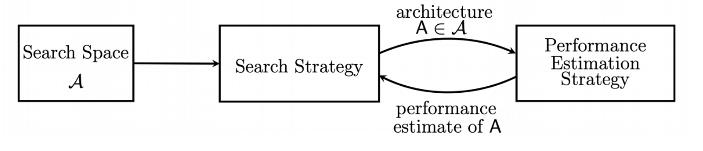

# Hyperparameter

[TOC]

## Manual Hyperparameter Tuning

- Goal: Hyperparameter tuning aims to find a set of good values.
- Pipeline
  1. Start with a good baseline, e.g. default settings in high-quality toolkits, values reported in papers
  2. Tune a value, retrain the model to see the changes
  3. Repeat multiple times to gain insights about

- Tips

  - Needs careful experiment management

  - Save your training logs and hyperparameters to compare, share and reproduce later

    - The simplest way is saving logs in text and put key metrics in Excel

    - Better options exist, e.g. tenesorboard and weights & bias(W&B)

      Start with **TensorBoard** if you want simple local visualization.

      Use **W&B** for serious experiments, sharing, and reproducibility.

  - Reproducing is hard, it relates to 

    - Environment(hardware & library)
    - Code
    - Randomness(seed): 不同随机种子如果结果波动很大就要想办法处理这种不稳定性
      - Sol1: 处理不了，就可以用多个模型做Ensemble，把它融合起来

  - Computation costs decrease exponentially, while human costs increase

- Automated Machine Learning(AutoML)

  - Automate every step in applying ML to solve real-world problems: data cleaning, feature extraction, model selection…

    

  - [Hyperparameter optimization (HPO)](#HPO algorithms)

  - [Neural architecture search (NAS)](#NAS)

## HPO algorithms

Hyperparameter optimization

### Search Space

Specify range for each hyperparameter

| Hyper-Parameter  | Range                                                        | Distribution |
| ---------------- | ------------------------------------------------------------ | ------------ |
| model (backbone) | [mobilenetv2_0.25, mobilenetv3_small, mobilenetv3_large, resnet18_v1b, resnet34_v1b, resnet50_v1b, resnet101_v1b, vgg16_bn, se_resnext50_32x4d, resnest50, resnest200] | categorical  |
| learning rate *  | [1e-6, 1e-1]                                                 | log-uniform  |
| batch size *     | [8, 16, 32, 64, 128, 256, 512]                               | categorical  |
| momentum **      | [0.85, 0.95]                                                 | uniform      |
| weight decay **  | [1e-6, 1e-2]                                                 | log-uniform  |
| detector         | [faster-rcnn, ssd, yolo-v3, center-net]                      | categorical  |

> [!WARNING]
>
> The search space can be exponentially large. Be careful to design.

- __Automated Machine Learning: State-of-The-Art and Open Challenges.__ *Radwa El Shawi et al.* __ArXiv, 2019__ [(Arxiv)](https://arxiv.org/abs/1906.02287) [(S2)](https://www.semanticscholar.org/paper/663108c231afdb91ca1e8af8ef8a6a937b5a6e20) (Citations __354__)

There are two main algorithms:

### Black-box

- Idea: treats a training job as a black-box in HPO
- Property: Completes the training process for each trial

#### Grid search

- 穷举，All combinations are evaluated
- Guarantees the best results
- Curse of dimensionality

#### Random search

- Random combinations are tried

  > [!TIP]
  >
  > In practice, the sample time depends on how long you want it to search.

- More efficient than grid search

#### Bayesian Optimization (BO)

- Idea: Iteratively learn a mapping from HP to objective function. Based on previous trials. Select the next trial based on the current estimation.

- Surrogate model
  - Estimate how the objective function depends on HP
  - Probabilistic regression models: Random forest, Gaussian process, …

### Multi-fidelity

- Idea: modifies the training job to speed up the search
- Property
  - Train on subsampled datasets
  - Reduce model size (e.g less #layers, #channels)
  - Stop bad configuration earlier

- Intuition: 只关心这个参数比上一个好就行，不一定要具体精度，甚至不是最优解

#### Successive Halving

- Pipeline
  1. Randomly pick n configurations to train m epochs
  2. Repeat until one configuration left: Keep the best configuration to train another epochs

- Pros: Save the budget for most promising config
- Cons: hard to choose the m and n. Sol: chech the Hyperband

#### Hyperband

- Hyperband runs multiple Successive Halving, each time decreases n and  increases m

  > [!NOTE]
  >
  > More exploration first, then do more exploit like our life.

## NAS

construct a good neural network model

### What is NAS

- Motivation: Hand-designed architectures (ResNet, MobileNet, ViT) are often sub-optimal for specific tasks and specific hardware.

- Idea: NAS automates the design of neural networks to optimize for:

  - Task accuracy

  - Latency on target hardware (e.g., GPU, mobile, embedded)

  - Model size and FLOPs

  - Energy consumption

  - Other constraints (e.g., memory, throughput)

- Goal: The goal of NAS is to find the best neural network architecture in the search space, maximizing the objective of interest (e.g., accuracy, efficiency, etc).

### Search space

- what: Search space is a set of candidate neural network architectures.

- how:
  - Cell-level search space: consider step by step
  - Network-level search space:
    - depth dimension
    - resolution dimension
    - width dimension
    - kernel size dimension
    - topology connection
- why: Search space design is crucial for NAS performance

### Search strategy

- what: Search strategy defines how to explore the search space
- how
  - grid search 
  - random search
  - reinforcement search
  - one-shot
  - gradient search
  - evolutionary search

## Efficient and hard-aware NAS

## NAS applications

## References

- [cs329p_slide](https://c.d2l.ai/stanford-cs329p/_static/pdfs/cs329p_slides_12_1.pdf)

- [NAS1](https://www.dropbox.com/scl/fi/hxhjhxonwqyw2hfoywzcp/Lec07-Neural-Architecture-Search-I.pdf?rlkey=o6s5dglazyb2o2nrc897ccppg&e=1&st=dcjyr42l&dl=0)
- [NAS2](https://www.dropbox.com/scl/fi/kaia5vvmdwb2bj0xnbihm/Lec08-Neural-Architecture-Search-II.pdf?rlkey=vkp9i12ljbk4jmdfp05j3ctdy&e=1&st=hincmob7&dl=0)