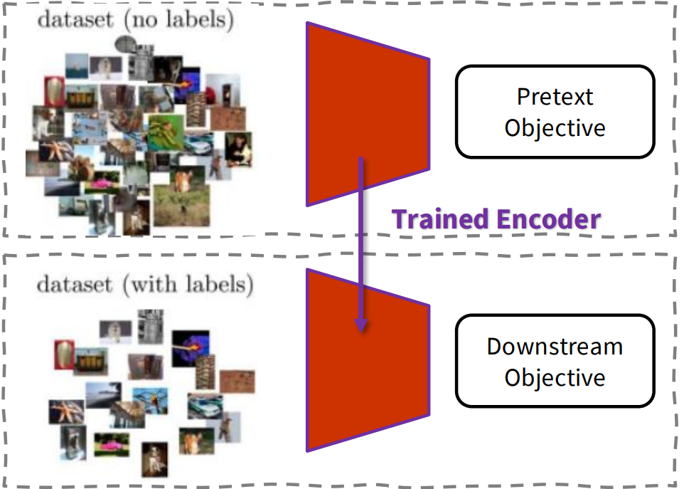
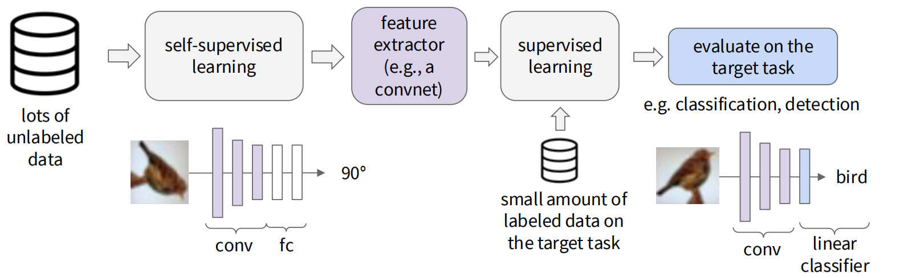
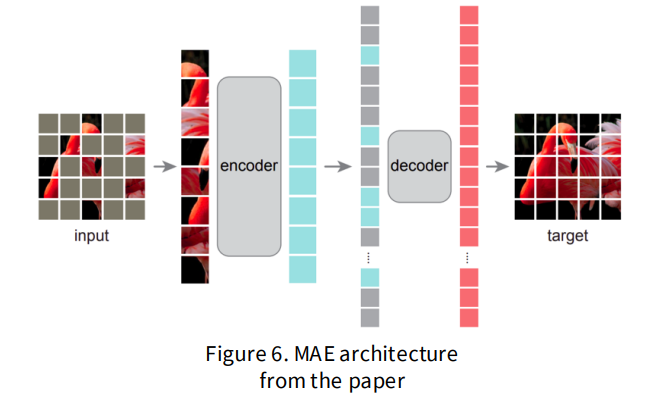
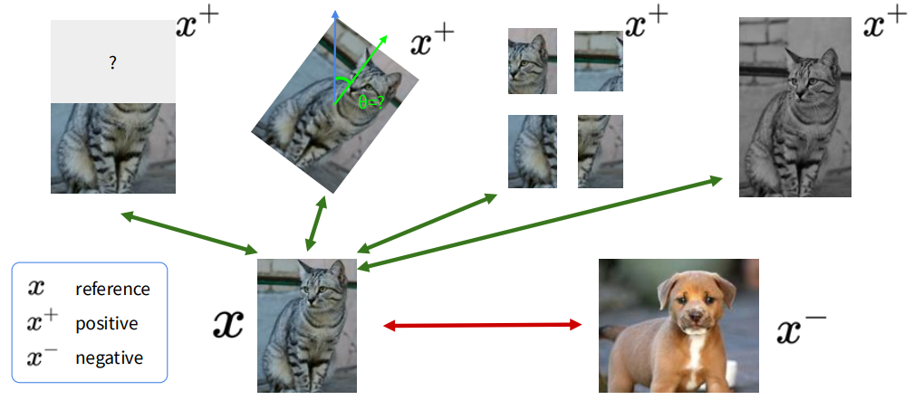
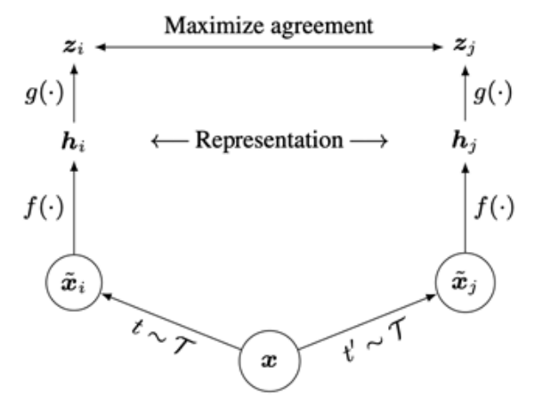
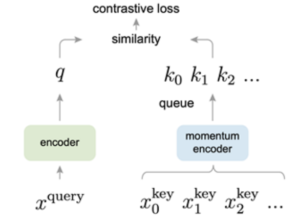
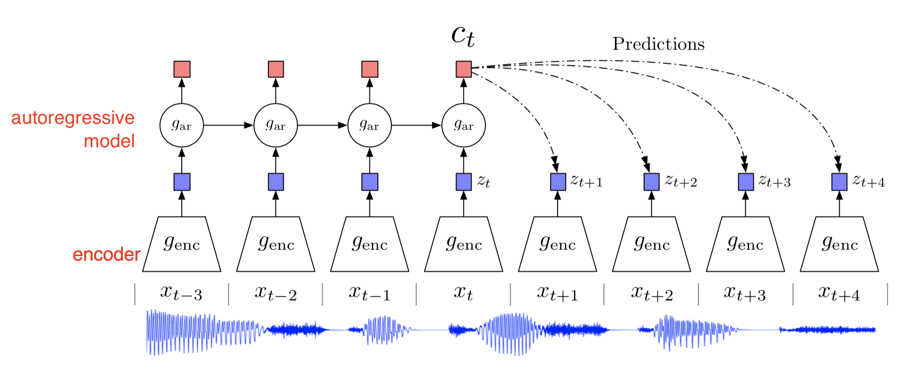

# Self-supervised Learning

From this section, we are gonna into **Generative and Interactive Visual Intelligence**.

## Pretext tasks from image transformations

- Takeaway: Pretext tasks from image transformations are self-supervised learning tricks where you **apply a known transformation to an image and ask a network to predict something about that transformation** (e.g., which rotation was applied, which patch goes where, how to restore color). 

  By solving this “fake” task, the model learns useful visual representations without human labels.

  

  - Pretext Task(self-supervised task): an unsupervised task; - but we learn with supervised learning  objectives, e.g.,  classification or regression
  - Downstream Task: The application you care about with labeled dataset.

  > [!NOTE]
  >
  > However, we usually don’t care about the final performance of this invented task. Rather we are interested in the learned intermediate representation with the expectation that this representation can carry good semantic or structural meanings and can be beneficial to a variety of practical downstream tasks.

  

- Prior: What is the problem with large-scale training? -- We need a lot of labeled data

  So we want to take use of the unlabelled data. However, unsupervised learning is not easy and usually works much less efficiently than supervised learning. -- What if we can get labels for free for unlabelled data and train unsupervised dataset in a supervised manner?

- Core Mechanism
  - Transformation classification
  - inpainting
  - rearrangement
  - coloring

- Pros
  - Flexible and domain-adaptable
- Cons
  - coming up with individual pretext tasks is tedious
  - the learned representations may not be general. Learned representations may be tied to a specific pretext task!

### Masked Auto Encoders (MAE)

- The MSE (mean squared error loss) in the pixel space between the  input image and the reconstructed image is adopted.
- Loss is only computed for masked patches

## Contrastive representation learning

- Takeaway: Contrastive representation learning is a way to learn powerful feature embeddings without (or with minimal) labels by **pulling semantically similar samples close together** in embedding space and **pushing dissimilar ones apart**.

  

- Core Mechanism: we want
  $$
  \text{score}(f(x),f(x^+)) \gg \text{score}(f(x),f(x^-))
  $$
  InfoNCE loss: N-way classification among positive and negative samples
  $$
  L = - \mathbb{E}_X \left[
  \log
  \frac{\exp\big(s(f(x), f(x^+))\big)}
  {\exp\big(s(f(x), f(x^+))\big) + \sum_{j=1}^{N-1} \exp\big(s(f(x), f(x_j^-))\big)}
  \right]
  $$

### Self-supervised Methods

Instance vs. Sequence Contrastive Learning

- **Instance contrastive learning**
  “Every *sample* is its own class.”
  You take different views of the **same instance** (image or clip) as positives, and different instances as negatives.
  - SimCLR, MoCo, BYOL (implicitly), etc.
- **Sequence contrastive learning**
  “Every *sequence* (and/or its sub-sequences) has internal structure over time.”
  You treat **temporally related segments** (e.g., different time windows within the same video) as positives and unrelated segments as negatives, so the model must capture *temporal consistency / dynamics*, not just appearance.
  - CPC-style, Multimodal, etc.

#### SimCLR

SimCLR: A Simple Framework for Contrastive Representation Learning

- Key ideas: non-linear projection head to allow flexible representation learning
- Core Mechanism
- Pipeline
  - generating positive samples from data augmentation
  - Iterate through and use each of the 2N sample as reference, compute average loss
- Pros: Simple to implement, effective in learning visual representation
- Cons: Requires large training batch size to be effective; large memory footprint

> [!note]
>
> - large batch size is crucial
> - Non-linear projection head and strong data augmentation are crucial for contrastive learning.

#### MoCo(v1,v2)

MoCo: Momentum Contrastive Learning

- Takeaway: contrastive learning using momentum sample encoder

  

- Core Mechanism

  - Decouple min-batch size with the number of keys: can support a large number of negative samples.

  - MoCo-v2 combines the key ideas from SimCLR, i.e., nonlinear projection head, strong data  augmentation, with momentum contrastive learning

  - The key encoder is slowly progressing through the momentum update rules:
    $$
    \theta_k \leftarrow m\theta_k+(1-m)\theta_q
    $$

#### CPC

CPC (Contrastive Predictive Coding): sequence-level contrastive learning

- Takeaway: Contrast “right” sequence with “wrong” sequence. Instead of reconstructing pixels/samples, it predicts which future embedding is correct among many candidates, pushing the model to capture high-level structure and long-range dependencies in time (or sequence position).
- Pros: Can be applied to a variety of learning problems
- Cons: Not as effective in learning image representations compared to instance-level methods.

## Unsupervised Learning

- Just data, no labels!
- Goal: learn hidden structure in data

## References

- [stanford slide](https://cs231n.stanford.edu/slides/2025/lecture_12.pdf)

- [Self-supervised Learning](https://lilianweng.github.io/posts/2019-11-10-self-supervised/)
- [Contrastive Representation Learning](https://lilianweng.github.io/posts/2021-05-31-contrastive/)
- [A curated list of awesome self-supervised methods](https://github.com/jason718/awesome-self-supervised-learning)