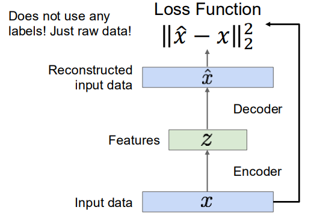
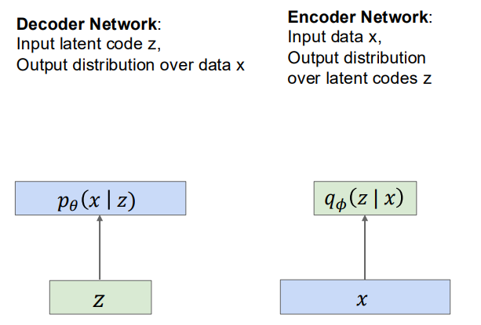
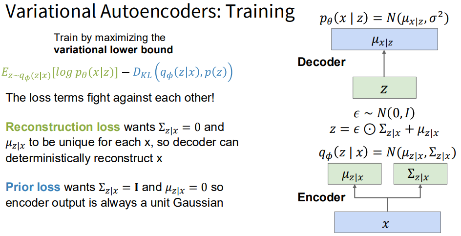

# Generative Models

介绍生成模型

## Concepts

Data: x. Label: y

### What

- Discriminative Model: Learn a probability distribution p(y|x)

  It focuses purely on **classification or prediction**.

- Generative Model: Learn a probability distribution p(x)

  - Detect outliers
  - Feature learning (without labels) 
  - Sample to generate new data

- Conditional Generative Model: Learn p(x|y)

  - Assign labels while rejecting outliers
  - Sample to generate data from labels

"Generative models" means either of Generative Model and Conditional Generative Model; **conditional generative models** are most common in practice

### Why

- Modeling ambiguity: If there are many possible outputs x for an input y, we want to model P(x | y)
- Language Modeling / Text to Image

### Taxonomy

Generative models

- Explicit density: Model can compute P(x)
  - Tractable density: Really compute P(x) -- Autoregressive
  - Approximate density: Approximate P(x) -- Variational Autoencoder (VAE)
- Implicit density: Cannot compute p(x) but can sample from P(x)
  - Direct: Can directly sample from P(x) -- Generative Adversarial Network (GAN)
  - Indirect: Iterative procedure to approximate samples from P(x) -- Diffusion Models

Now let`s check these models:

## Autoregressive Models

- Takeaway: Autoregressive models treat generation as a **sequential prediction problem**, producing each token/pixel/element conditioned on all previous ones. 

  They optimize the exact likelihood via maximum likelihood estimation (MLE)

  > [!NOTE]
  >
  > Maximum Likelihood Estimation
  >
  > - Goal:  Write down an explicit function for \( p(x) = f(x, W) \)
  >
  >   Given dataset \( x^{(1)}, x^{(2)}, \ldots, x^{(N)} \), train the model by solving:
  >
  >   $$
  >   W^{*} = \arg\max_{W} \prod_i p\big(x^{(i)}\big)
  >   $$
  >
  > - Sol:
  >
  >   Maximize probability of training data 
  >   (Maximum likelihood estimation)
  >   $$
  >   = \arg\max_{W} \sum_i \log p\big(x^{(i)}\big)
  >   $$
  >
  >   Log trick: Swap product and sum
  >
  >   $$
  >   = \arg\max_{W} \sum_i \log f\big(x^{(i)}, W\big)
  >   $$
  >
  >   This is our loss function. Maximize it with gradient descent.

- Core Mechanism:

  Assume x is a sequence: $x = (x_1,x_2...,x_T)$

  Use the chain rule of probability:
  $$
  p(x₁, x₂, …, xₙ) = \prod_i p(xᵢ | x_{<i})
  $$

- Example: Autoregressive Models of Images

  - Treat an image as a sequence of 8-bit subpixel values (scanline order). Model with an RNN or Transformer

  - Cons: 

    - Too expensive. 1024x1024 image is a sequence of 3M subpixels

      Sol: Model as sequence of tiles (small block of pixels), not sequence of subpixels

## Variational Autoencoders (VAEs)

### Autoencoders

Before introduce the VAEs, we introduce the (Non-Variational) Autoencoders.

- Idea: Unsupervised method for learning to extract features z from inputs x, without labels. So we should extract useful information for downstream tasks.

  - Con: So how do we learn without labels?

  - Sol: Reconstruct the input data with a decoder.

  

  In this way, we can use the encoder for the downstream tasks.

  If we could generate new z, could use the decoder to generate images.

  - Con: Generating new z is not any easier than generating new x
  
  - What if we force all z to come from a known distribution?
  
    Here the VAEs is coming.
  

### VAEs

Let`s take it step by step.

> [!NOTE]
>
> - auto: comes from auto-associative models
>   $$
>   x \;\rightarrow\; \text{model} \;\rightarrow\; \hat{x} \approx x
>   $$
>
> - variational: 
>
>   Instead of:
>
>   - Encoding $x$ → fixed code $z$
>
>   VAEs:
>
>   - Encode $x$ → **distribution over latent variables**
>   - Learn this distribution via **variational inference**

Assume training data $x_i$ is generated from unobserved (latent)  representation z. How can we train this -- **maximum likelihood**

We don`t observe z, so marginalize it.
$$
\log p_\theta(x)
= \log \int p_\theta(x, z)\,dz
= \log \int p_\theta(x|z)\, p(z)\, dz
$$
Here, we can compute $p_\theta(x|z)$ with the decoder. And assume Gaussian prior for z. But we can\`t integrated over all z. So we try Bayes\` rule.
$$
p_\theta(x) = \frac{p_\theta(x| z)p_\theta(z)}{p_\theta(z|x)}
$$

- Con: no way to compute $p_\theta(z|x)$
- Sol: Train another network that learns $q_\phi(z|x) \approx p_\theta(z|x)$

- Idea: Jointly train both encoder and decoder

OK, now what’s our training objective?
\[
\log p_\theta(x)
= \log \frac{p_\theta(x \mid z)p(z)}{p_\theta(z \mid x)}
= \log \frac{p_\theta(x \mid z)p(z) q_\phi(z \mid x)}{p_\theta(z \mid x) q_\phi(z \mid x)}
\]

\[
= \mathbb{E}_z[\log p_\theta(x \mid z)]
- \mathbb{E}_z\left[\log \frac{q_\phi(z \mid x)}{p(z)}\right]
+ \mathbb{E}_z\left[\log \frac{q_\phi(z \mid x)}{p_\theta(z \mid x)}\right]
\]

\[
= \mathbb{E}_{z \sim q_\phi(z \mid x)}[\log p_\theta(x \mid z)]
- D_{\mathrm{KL}}\left(q_\phi(z \mid x) \,\Vert\, p(z)\right)
+ D_{\mathrm{KL}}\left(q_\phi(z \mid x) \,\Vert\, p_\theta(z \mid x)\right)
\]

because we should have $q_\phi(z|x) \approx p_\theta(z|x)$. KL>=0, so we can drop it to get a lower bound on likelihood. We get the ELBO(Evidence Lower Bound)
$$
\mathcal{L}(\theta, \phi; x)
= \mathbb{E}_{q_\phi(z|x)}[\log p_\theta(x|z)]
- \mathrm{KL}\big(q_\phi(z|x) \,\Vert\, p(z)\big)
$$

$$
\log p_\theta(x) \ge \mathcal{L}(\theta, \phi; x)
$$

This is our VAE training objective.

- Pipeline(training)

  1. Run input data through encoder to get distribution over z
     $$
     q_\phi(z|x) = \mathcal{N}\left(\mu_\phi(x), \operatorname{diag}(\sigma_\phi^2(x))\right)
     $$

  2. Prior loss: Encoder output should be unit Gaussian (zero mean, unit variance)

  3. Sample z from encoder output $q_\phi(z|x)$ (Reparameterization trick)

     > [!NOTE]
     >
     > Reparameterization Trick: Direct sampling from $q_\phi(z|x)$ is not differentiable. Instead we use the reparameterization:
     > $$
     > \epsilon \sim \mathcal{N}(0, I) \\
     > z = \mu_\phi(x) + \sigma_\phi(x) \odot \epsilon
     > $$
     > Sample noise $\epsilon$ from a fixed standard normal.

  4. Run z through decoder to get predicted data mean: $\hat{x} = f_\theta(z)$

  5. Reconstruction loss: predicted mean should match x in L2

     - Reconstruction Loss

       If Bernoulli likelihood:
       $$
       -\mathbb{E}_{q_\phi(z|x)}[\log p_\theta(x|z)]
       = \text{BCE}(x, \hat{x})
       $$
       If Gaussian likelihood:
       $$
       = \frac{1}{2\sigma^2}\|x - \hat{x}\|^2 + \text{const}
       $$
       This term forces the decoder to recover meaningful features of x.

     - KL Divergence Term

       Because both distributions are Gaussians:
       $$
       \mathrm{KL}(q_\phi(z|x) \Vert p(z))
       = \frac{1}{2}\sum_{j=1}^K \left(\mu_j^2 + \sigma_j^2 - \log\sigma_j^2 - 1\right)
       $$
       This term aligns the encoder’s posterior with the prior $p(z)=\mathcal{N}(0,I)$. It prevents the latent space from becoming disordered or unbounded.

     Total VAE loss (per sample):
     $$
     \text{Loss} =
     - \mathbb{E}_{q_\phi(z|x)}[\log p_\theta(x|z)]
     + \mathrm{KL}(q_\phi(z|x) \Vert p(z))
     $$

  

## Generative Adversarial Networks (GANs)

## Diffusion

## References

- [ELBO blog](https://yunfanj.com/blog/2021/01/11/ELBO.html)

​	
