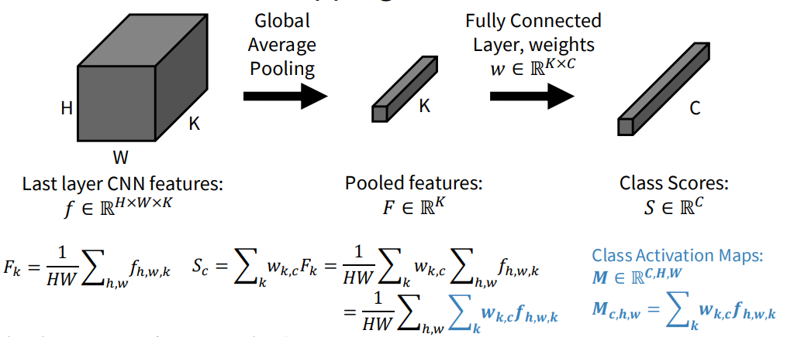

# Object Detection Basics

Quick guide to core object detection ideas: how boxes are defined and refined, how detectors are structured, how we evaluate them, and the trade-offs between design choices.

<!--more-->

## Computer Vision Tasks

## Bounding Boxes

- **Takeaway**: Boxes are the basic localization unit and the target for regression in detectors.
- **Prior**: Early detectors hand-crafted region proposals; modern models regress box offsets directly.
- **Core Mechanism**: Parameterize rectangles and learn offsets to align with ground truth.
  - Corner: \((x_{\min}, y_{\min}, x_{\max}, y_{\max})\)
  - Center: \((x_c, y_c, w, h)\); YOLO uses normalized values in \([0,1]\)
  - Regression target predicts \((\Delta x, \Delta y, \Delta w, \Delta h)\) to refine a prior box.
- **Pros**: Simple, differentiable, works with CNN/transformer heads.
- **Cons**: Axis-aligned only; sensitive to aspect-ratio priors; limited for rotated or elongated objects.

## Object Detection Evaluation Metrics

- **Takeaway**: IoU decides match quality; precision/recall summarize correctness; AP/mAP aggregate performance.
- **Prior**: Binary classification metrics extended with IoU thresholds (VOC, COCO).
- **Core Mechanism**: Sort detections by confidence, match to GT via IoU, compute PR curve, integrate to AP; average AP over classes for mAP.

| Metric    | What It Measures                         | How It’s Computed                              | Why It Matters                      |
| --------- | ---------------------------------------- | ---------------------------------------------- | ----------------------------------- |
| IoU       | Overlap quality                          | \(\frac{\text{intersection}}{\text{union}}\) | Defines TP/FP, used in losses       |
| Precision | Correctness of positives                 | \(\frac{TP}{TP+FP}\)                          | Penalizes false alarms              |
| Recall    | Coverage of true objects                 | \(\frac{TP}{TP+FN}\)                          | Penalizes missed detections         |
| F1-score  | Balance of precision and recall          | \(2 \cdot \frac{P \cdot R}{P + R}\)          | Single operating-point score        |
| AP        | Area under PR curve for one class        | Integral of PR curve (COCO), 11-pt (VOC)       | Class-level quality                 |
| mAP       | Mean AP across classes                   | Average of class APs                          | Standard leaderboard metric         |
| AR        | Average recall under limits              | COCO AR@1/10/100                               | Measures ability to find GTs        |

## One-Stage Object Detectors

- **Takeaway**: Predict boxes and classes in one pass for speed.
- **Prior**: Designed to avoid slow proposal stages (YOLO, SSD).
- **Core Mechanism**: Backbone → (optional) neck → dense head outputs box regression + objectness + class scores; multitask loss ties localization and classification.
- **Pros**: Real-time friendly; simpler deployment; stable end-to-end training.
- **Cons**: Historically weaker localization; class imbalance and NMS sensitivity; many dense negatives.

**Pipeline snapshot**
- Backbone: feature extractor (e.g., ResNet, MobileNet, CSPDarknet).
- Neck: multi-scale fusion (FPN, PANet, BiFPN) to help small objects.
- Head: dense predictions per location (box offsets, objectness, class probs).

**Representative models**: YOLO family, SSD, RetinaNet (Focal Loss), FCOS (anchor-free), YOLOv8 (anchor-free, decoupled heads, IoU losses).

## Two-Stage Object Detectors

- **Takeaway**: Separate proposal generation from classification/regression to maximize accuracy.
- **Prior**: Region-based detectors (R-CNN → Fast/Faster R-CNN) introduced learnable proposals.
- **Core Mechanism**: Stage 1 RPN proposes boxes; Stage 2 ROI head classifies and refines each proposal using pooled features.
- **Pros**: Strong localization; robust on crowded/complex scenes; extensible (e.g., Mask R-CNN).
- **Cons**: Slower; heavier; less edge-friendly.

**Pipeline snapshot**
- Backbone: feature extractor (e.g., ResNet, Swin Transformer).
- RPN: proposes ~200–300 candidate boxes with objectness + regression offsets.
- ROI head: ROI Align/Pooling → small head for class scores + box refinements; variants add masks (Mask R-CNN) or keypoints.

**Representative models**: Faster R-CNN (baseline two-stage), Mask R-CNN (adds instance masks), Cascade R-CNN (multi-stage refinement), Sparse R-CNN (learned proposals, no RPN).

## Feature Pyramid Networks (FPN)

- **Takeaway**: Strengthen semantics at multiple scales to detect small and large objects together.
- **Prior**: Single-resolution backbones lacked detail for small objects.
- **Core Mechanism**: Top-down pathway with lateral connections merges high-level semantics with high-resolution features; outputs a pyramid of feature maps.
- **Pros**: Better small-object recall; reusable neck for many detectors.
- **Cons**: Extra compute/memory; design choices (levels, fusion) affect latency.

## Anchor-Based Detectors

- **Takeaway**: Use predefined boxes (anchors) as priors and regress offsets.
- **Prior**: Early dense detectors needed fixed priors for scale/aspect coverage.
- **Core Mechanism**: Place \(k\) anchors per location per FPN level; assign via IoU thresholds; train objectness, class label, and box offsets.
- **Pros**: Stable training; explicit control over scales/ratios; mature ecosystem (YOLOv2/3, RetinaNet, Faster R-CNN RPN).
- **Cons**: Hyperparameter heavy (scales/ratios/thresholds); many negatives → imbalance; sensitive to dataset priors.

**Anchor math**
- Anchor \(a = (x_a, y_a, w_a, h_a)\); predict offsets \(t = (\Delta x, \Delta y, \Delta w, \Delta h)\).
- Decode: \(x = x_a + \Delta x \, w_a,\; y = y_a + \Delta y \, h_a,\; w = w_a e^{\Delta w},\; h = h_a e^{\Delta h}\).

## Anchor-Free Detectors

- **Takeaway**: Predict boxes directly without predefined anchors.
- **Prior**: Simplify design and reduce imbalance (FCOS, CornerNet, CenterNet, YOLOX/YOLOv8, DETR).
- **Core Mechanism**: Predict centers/keypoints/queries on feature maps; assign positives via center sampling or optimal transport/masks; regress distances to box edges.
- **Pros**: Fewer hyperparameters; cleaner formulation; better small-object behavior; easier to adapt across datasets.
- **Cons**: Requires careful positive sampling; may need specialized losses for stability.

**Representative families**: FCOS (center-based), CornerNet/CenterNet (keypoints), YOLOX/YOLOv8 (center-based + OTA), DETR (transformer queries, no NMS).

## Non-Maximum Suppression (NMS)

- **Takeaway**: Prunes overlapping detections to keep one box per object.
- **Prior**: Dense heads emit many overlapping candidates that need consolidation.
- **Core Mechanism**: Sort by confidence, keep the highest, remove boxes with IoU above a threshold; variants include Soft-NMS and DIoU-NMS.

### Plain NMS

- **Pros**: Simple, effective, and fast; improves precision.
- **Cons**: Threshold-sensitive; can drop true positives in crowded scenes; adds a post-processing step.

### Box Voting

- Takeaway: NMS+merge. Merges overlapping boxes instead of discarding them
- Pros:
  - Often improves localization accuracy and recall by averaging boxes weighted by scores.
- Cons:
  - Slightly slower; if voting IoU is too low, can over-merge and blur localization; can retain more boxes if thresholds aren’t tuned.

## Visualization & Understanding

### Model Layers Visualization

- What: Model-layer visualization means: looking inside the network to see what each layer (or neuron / channel) is doing.

- Why: The goals:

  - Debug: Is the network learning something reasonable or is it broken?
  - Interpret: Are early layers edge detectors? Are later layers detecting parts or objects?
  - Intuition: Understand how information flows and transforms through the network.

- How: For CNNs, we usually:

  1. Visualize **feature maps / activations**: what the layer outputs for a given image.
  2. Visualize **learned filters / kernels**: especially early conv layers, to see edge / color detectors.

  Just input an image and extract the feature map each channel.

### Saliency Maps

- What: A saliency map tells you: **for a given input image and a given class prediction, which pixels are most important for that prediction?**

  > Example: 例如肿瘤检查，看那个像素影响最大，即可定位肿瘤信息

- Basic idea: compute the **gradient of the score for class c with respect to the input image**:
  $$
  S_c(x) = \frac{\partial f_c(x)}{\partial x}
  $$
  $|S_c(x)|$ large ⇒ small change at that pixel changes the score a lot ⇒ pixel is important.

### CAM & Grad-CAM

- CAM (Class Activation Mapping)

  CAM shows **which spatial regions** are most responsible for the prediction of a class, but it assumes a specific architecture:
  
  - CNN backbone
  - Global Average Pooling (GAP)
  - Linear classification layer directly after GAP (no additional FCs)
  
  Under this architecture, you can directly compute a weighted sum of feature maps for a class.
  
  

- Grad-CAM (Gradient-weighted CAM)

  Grad-CAM generalizes CAM to **any CNN-based architecture**, including those with fully connected layers, more complex heads, etc.

## References

- Stanford CS231n intro slides: <https://cs231n.stanford.edu/slides/2024/lecture_9.pdf>
- NMS overview: <https://towardsdatascience.com/non-maxima-suppression-139f7e00f0b5/>
- Anchor boxes explainer: <https://towardsdatascience.com/anchor-boxes-the-key-to-quality-object-detection-ddf9d612d4f9/>
- PyTorch detection tutorial: <https://docs.pytorch.org/tutorials/intermediate/torchvision_tutorial.html>
- Intro to object detection: <https://www.geeksforgeeks.org/computer-vision/what-is-object-detection-in-computer-vision/>
