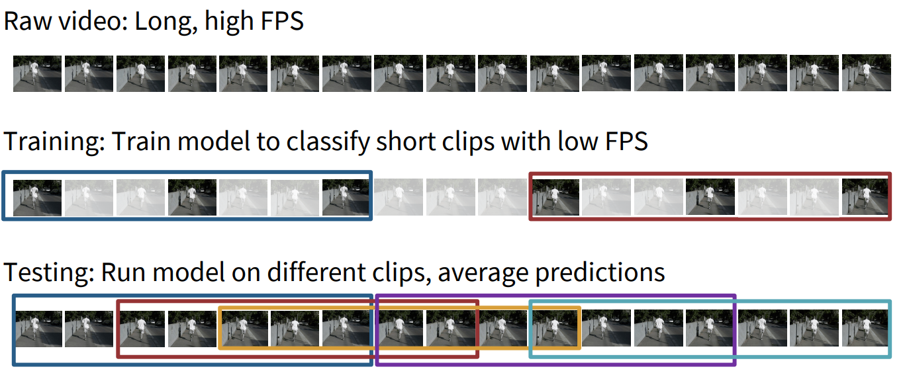
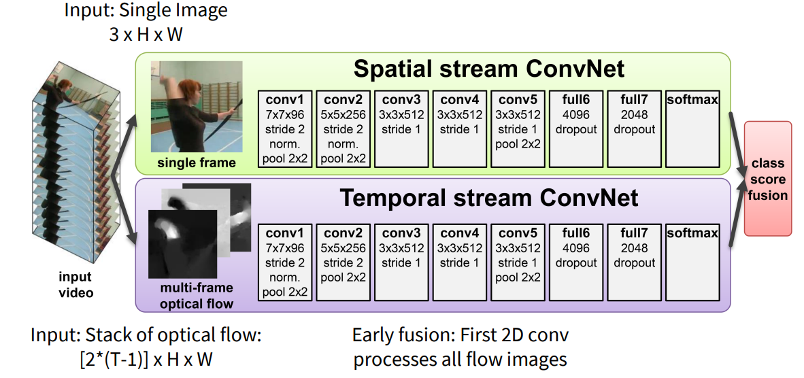
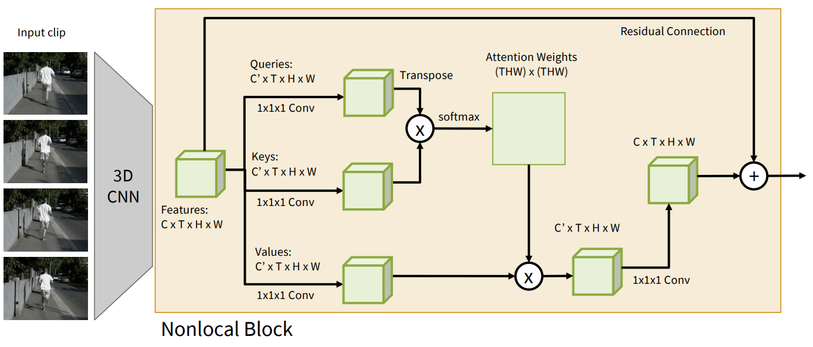

# Video Understanding

## Video classification

This is a challenging problem because videos contain both spatial (frame-based) and temporal (sequence-based) information, and understanding how to effectively capture the dynamic nature of videos is key.

- Challenges:

  - videos are big. sol: Training on Clips

    

  - Spatiotemporal Modeling

  - Temporal Dependencies

  - Long-term Dependencies

The following parts are trying to solve these challenges.

---

- Single-Frame CNN: train normal 2D CNN to classify video frames independently.

  Now we should consider when to combine the temporal information

  - Late Fusion: 

    - Intuition: Get high-level appearance of each frame, and combine them

    - How: two ways

      - with FC layers: Flatten + MLP

      - with pooling: Average Pool over space and time

    - Pros: Hard to compare low-level motion between frames

  - Early Fusion

    - Intuition: Compare frames with very first conv layer, after that normal 2D CNN
    - How: reshape the input($T\times 3\times H \times W$) to $3T\times H \times W$
    - Pros: One layer of temporal processing may not be enough

  To overcome all the pros, we introduce the 3D CNNs:

## 3D CNNs

- What: 3D CNNs operate on a sequence of frames (height × width × time)

- How: Inflating 2D Networks to 3D (I3D), reuse the 2D CNN architecture and repalce the 2D conv/pool layer with 3D version
- Pros:
  - Temporal shift-invariant since each filter slides over time
- Cons:
  - Computationally Intensive: expensive
  - Data Hungry

## Two-stream networks

- Prior: Previously Recognizing Actions from Motion: Optical Flow.

- **Two-stream networks** consist of two separate neural networks that process different kinds of data from the same video.

  

  - **Spatial Stream**(appearance): A CNN that processes individual video frames, treating the video as a series of still images.

  - **Temporal Stream**(motion): A network (usually based on optical flow) that processes the **motion** between consecutive frames, capturing the temporal changes in the video.

- Cons: only model short-term motion

To solve the con, we try to use RNN, but RNNs are slow for long sequences (can’t be parallelized), so we consider self-attention:

- Spatio-Temporal Self-Attention (Nonlocal Block)

  

- Vision Transformers for Video: many works have been done

## Multimodal video understanding

**Multimodal video understanding** involves combining multiple sources of information to improve the analysis of video content. These sources can include visual, auditory, and textual data.

- **Modalities**: Different types of data that can be extracted from a video, such as images (visual), speech or sound (auditory), and text (e.g., subtitles).

- **Fusion Techniques**: Methods used to combine different modalities, including early fusion (combining features before processing), late fusion (combining predictions from different models), or joint learning (learning shared representations from different modalities).

## References

- [Video Understanding slide](https://cs231n.stanford.edu/slides/2025/lecture_10.pdf)

