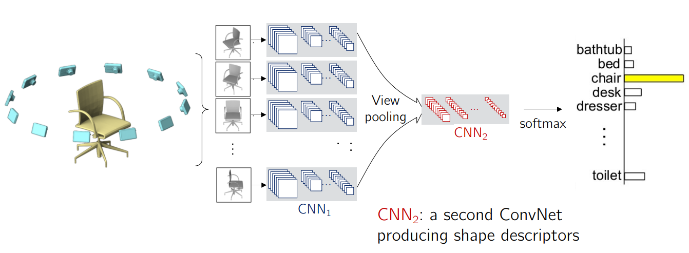

# 3D Vision
[TOC]

cs231n 3D vision part

## How to Represent Geometry

two types

- explicit: 直接存储3D结构本身
  - Non-parametric: point clouds / polygonal meshes
  - Parametric: 
- implicit: 不直接存几何，而是学习一个函数。function hard to describe
  - Non-parametric: voxel: a 3D metrix / level sets
  - Parametric: math function(Occupancy Field: 表示某点是否在物体内部) / Signed Distance Function (SDF): $f(x,y,z) = \text{distance to surface}$

| 维度     | Explicit     | Implicit |
| -------- | ------------ | -------- |
| 表达方式 | 直接存结构   | 学习函数 |
| 数据结构 | 点/体素/网格 | 神经网络 |
| 连续性   | 离散         | 连续     |
| 内存     | 大           | 小       |
| 可微     | 难           | 容易     |

## AI+

下面我们来看看利用AI在3D vision中的使用

### Datasets

many types of datasets

### Tasks

- **P(S) or P(S|c)** --- Generative models
  - Learning (conditional) shape priors
  - Shape generation, completion, & geometry data processing

- **P(c|S)** --- Discriminative models
  - Learning shape descriptors
  - Shape classification, segmentation, view estimation, etc.

- Joint modeling of 3D and 2D data
  - Large-scale 2D datasets & very good pretrained models
  - Differentiable projection/back-projection & differentiable/neural rendering

- Joint modeling of multi-modal data beyond visual (e.g., text)

### Development

| 方法     | 表示           | 类型           | 特点         |
| -------- | -------------- | -------------- | ------------ |
| CDBN     | Voxel          | Generative     | Energy-based |
| 3D CNN   | Voxel          | Discriminative | 监督训练     |
| PointNet | Point cloud    | Discriminative | 无规则输入   |
| NeRF     | Implicit field | Generative     | 连续表示     |

- pixel: use 2D to solve 3D problem

  - Multi-View CNN

    

    - Cons: 
      - Need projection
      - What if the input is noisy and/or incomplete? e.g., point cloud

- Voxels

  - 3D Conv Deep Belief Networks (CDBN): Stacked 3D Convolutional RBMs,本质是 generative model
  - 3D-GANs
  - Octave Tree Representations: memory efficient
  - Cons: 内存爆炸

- PointNet: First Learning Tool for Point

  - Takeaway: 用对称函数解决无序点集建模问题

  - Motivation: 点云有三个困难

    - 无序:Permutation Invariance(use symmetric functions) / Sampling Invariance
    - 不规则
    - 没有局部结构

  - Core Mechanism
    $$
    f(\{x_1,...,x_n\}) = g\left( \text{MAX}_{i} \{ h(x_i) \} \right)
    $$

    1. 对每个点独立做 MLP（共享权重）
    2. 用 max pooling 聚合
    3. 得到全局特征

- NeRF: 

  - Takeaway: NeRF 用一个神经网络表示整个 3D 场景，并通过体渲染生成任意视角图像

  - Core Mechanism：

    用mlp表示连续3D空间implicit representation:
    $$
    \text{Scene} = f_\theta(x)
    $$
    

  - Pros

    - 连续表示
    - 用函数替代几何结构

  - Cons

    - compute slow and waste: NeRF parameterizes scenes densely, at every point in space
      - Sol: Gaussian splatting parameterizes the scene sparsely, only  where density is nonzero.

## References

- https://cs231n.stanford.edu/slides/2025/lecture_15.pdf

03 18

26 18+23=41