# Basic Model Zoo

## CNN Zoo

- **Deep learning**. LeCun Yann et.al. **Nature**, **2015-5-27**, ([link](https://doi.org/10.1038/nature14539)).

  - 监督学习就是“定义可微损失 + 反向传播算梯度 +（小批量）SGD 优化 + 测试集检验泛化”

  - 高维非凸里，真正的绊脚石多是鞍点而非“坏极小值”，因此带噪声的小批量 SGD、本质上的随机性与动量等会有帮助穿过鞍点

    > 当然现在优化器有更多，例如AdamW,LAMB等

  - ReLU 在多层网络中通常学得更快，（直观理解）ReLU 是分段线性、计算简单；其“零–正”两段让很多激活在任一前向传播中为 0，形成**稀疏激活**

  - CNN:local connections, shared weights, pooling and the use of many layers

  - Distributed representations:特征由向量表示（每个维度代表一个微特征），彼此并不排斥，能因子化复杂的输入——输出关系

  - 到端的“CNN+RNN+强化学习”的主动感知/视觉决策

- **Gradient-based learning applied to document recognition**. Lecun Y. et.al. **Proc. IEEE**, **1998**, ([link](https://doi.org/10.1109/5.726791)).
  
  - LeNet-5
  
- **ImageNet classification with deep convolutional neural networks**. Krizhevsky Alex et.al. **Commun. ACM**, **2017-5-24**, ([link](https://doi.org/10.1145/3065386)).
  
  - AlexNet：论文比较工程，效果在ImageNet上比较好
    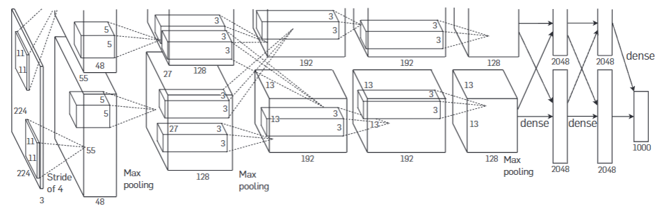
  - 使用数据增广来获得更多训练样本，通过平移、灰度变换等增广方式来扩充数据，使网络适应更多情况
  - 对网络中间层加入Dropout， 即随机使部分神经元不工作，提升模型对于整体特征的学习能力， 避免过拟合问题，提高泛化能力
  - 采用ReLU函数来替代Sigmoid函数，降低了计算量的同时，还避免了极端输入导致的梯度消失
  - 使用动量参数和学习率降低策略来加速收敛， 每当学习陷入瓶颈时学习率就会降低（手动）
  
- **Very Deep Convolutional Networks for Large-Scale Image Recognition**. Karen Simonyan et.al. **arxiv**, **2014**, ([link](http://arxiv.org/abs/1409.1556v6)).
  
  - VGGNet
  - 不同于以往的大卷积核，此网络中卷积核尺寸均为3× 3，相对于更大的卷积核而言减少了参数， 使得网络的层数能够得到加深，这样也能更好地保留图像的特征
  
- **Going deeper with convolutions**. Szegedy Christian et.al. **No journal**, **2015-6**, ([link](https://doi.org/10.1109/cvpr.2015.7298594)).
  
  - GoogLeNet (Inception v1)
  
- **Deep Residual Learning for Image Recognition**. He Kaiming et.al. **No journal**, **2016-6**,([link](https://doi.org/10.1109/cvpr.2016.90)).
  
  - ResNet：从求导来看即使梯度小，因为是加法所以还是能进行训练的
  
    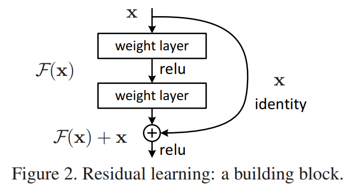
  
    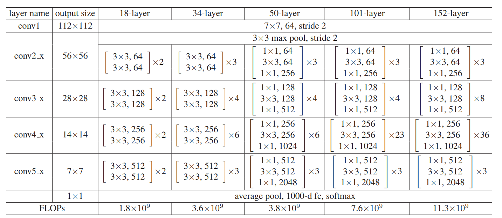
  
  - bottleneck的设计：右边先降维，再升维，这样就能做得更深
  
    做得深，就可以使用更多的通道数（可看作特征），用更复杂的特征向量来表示
  
    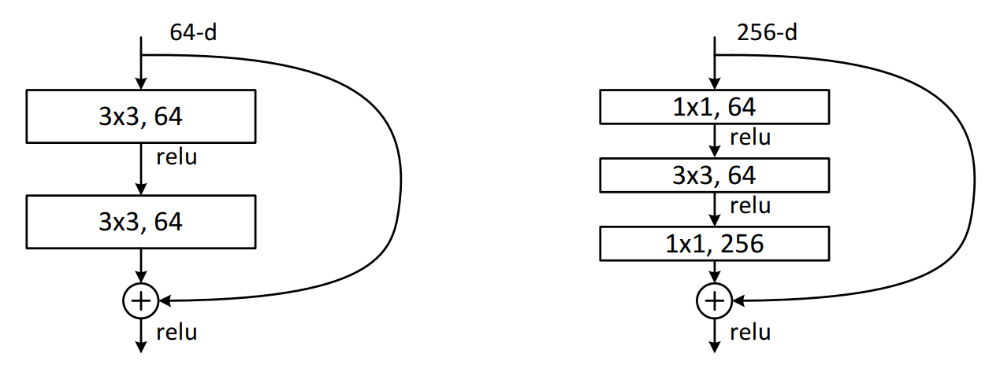
  
- **Densely Connected Convolutional Networks**. Huang Gao et.al. **No journal**, **2017-7**,([link](https://doi.org/10.1109/cvpr.2017.243)).
  
  - DenseNet
  
- **Rethinking the Inception Architecture for Computer Vision**. Szegedy Christian et.al. **No journal**, **2016-6**,([link](https://doi.org/10.1109/cvpr.2016.308)).
  
  - Inception-v3

## Attention Zoo


- __Neural Machine Translation by Jointly Learning to Align and Translate.__ *Dzmitry Bahdanau et al.* __CoRR, 2014__ [(Arxiv)](https://arxiv.org/abs/1409.0473) [(S2)](https://www.semanticscholar.org/paper/fa72afa9b2cbc8f0d7b05d52548906610ffbb9c5) (Citations __28426__)


  - Takeaway: This paper introduces **attention-based neural machine translation (NMT)**.

      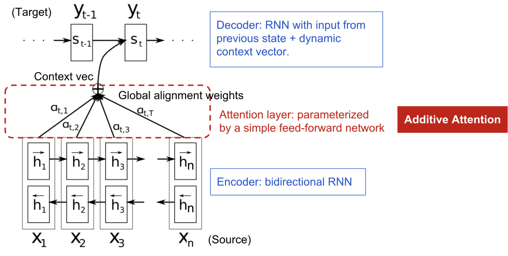


- **Attention Is All You Need**. Ashish Vaswani et.al. **arxiv**, **2017**, ([link](https://arxiv.org/abs/1706.03762v7))([details](../05-Attention.md)).

  - Takeaway: Transformer is a **self-attention-only** seq2seq model with **positional encoding**, enabling highly parallel training.

  - Prior: What’s Wrong with Seq2Seq Model?

    The seq2seq model normally has an encoder-decoder architecture: the encoder compress the info into a context vector of fixed length. A critical and apparent disadvantage of this fixed-length context vector design is incapability of remembering long sentences. The attention mechanism was born ([Bahdanau et al., 2015](https://arxiv.org/pdf/1409.0473.pdf)) to resolve this problem.

  - Core Mechanism:

      - Scaled Dot-Product Attention
      
          Given query Q, key K, value V:
          $$
          \text{Attention}(Q, K, V) = {\text{softmax}\left(\frac{QK^{T}}{\sqrt{d_k}}\right)} {V}
          $$
      
          Properties:
      
          - Computes weighted interactions between all token pairs.
          
          - Scaled normalization stabilizes gradients.
      
        - Global receptive field in a single layer
      
      - Multi-Head Self-Attention (MHSA): Instead of one attention map, use multiple projection heads:
        
        - Each head learns different relational patterns.
        - Heads are concatenated and linearly projected.
        
        $$
        \text{MultiHead}(Q, K, V) = [\text{head}_1; \ldots ; \text{head}_h]\, W^{O} \\
        \text{where}~ \text{head}_i = \text{Attention}(Q W_i^{Q},\, K W_i^{K},\, V W_i^{V})
        $$
      
        where $W_i^{Q}$, $W_i^{K}$, $W_i^{V}$, and $W^{O}$ are parameter matrices to be learned.
      
        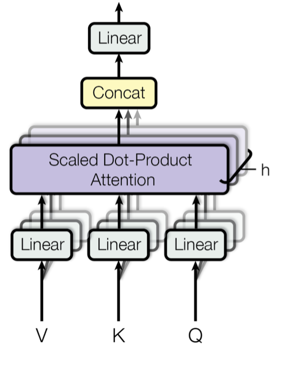
      
      - Positional Encodings
      
        Since the architecture is **non-recurrent** and **non-convolutional**, positional information is injected via sinusoidal encodings.
      
      - Encoder
      
        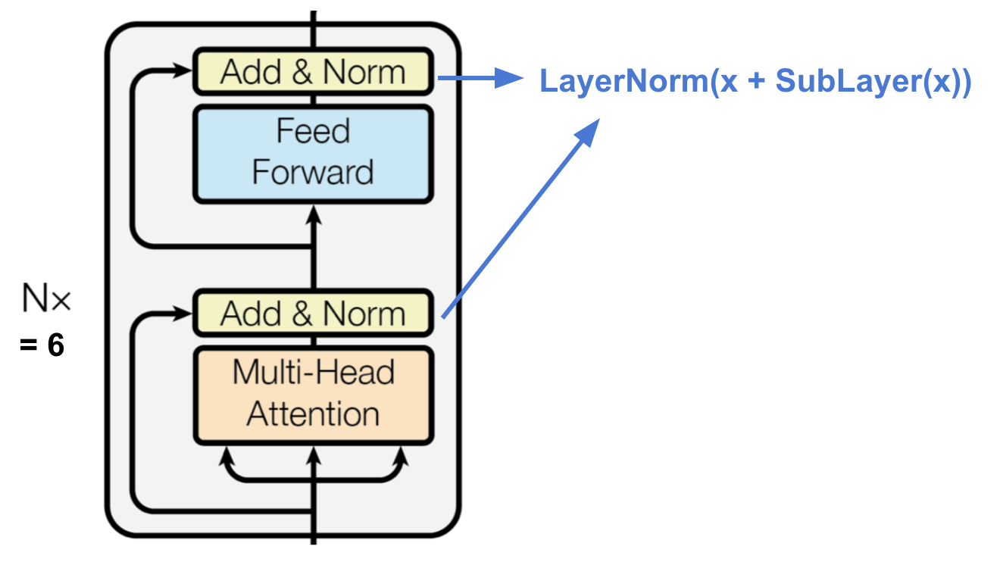
      
        The encoder generates an attention-based representation with capability to locate a specific piece of information from a potentially infinitely-large context.
        
          - Residual Connections + LayerNorm: Ensures stable deep training and gradient flow.
          - Feed-Forward Network (FFN) Per Token: A two-layer MLP applied independently on each position:
          - Adds non-linearity: Increases expressive capacity
        
      - Decoder
      
        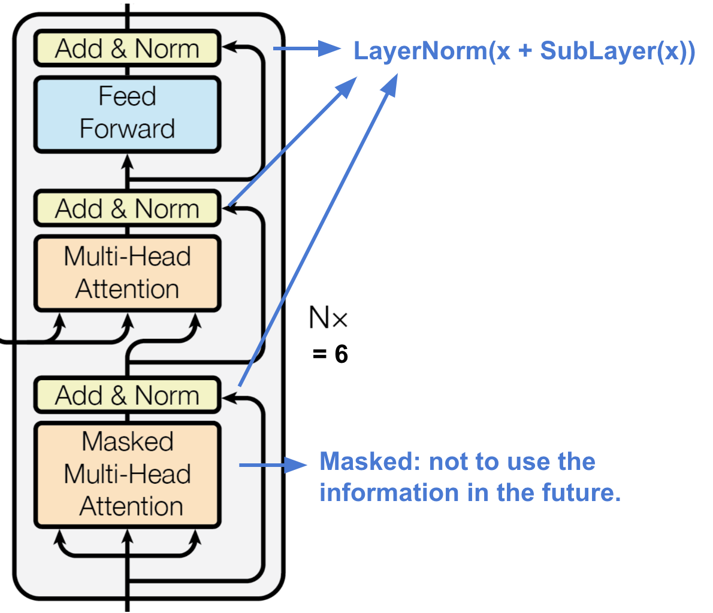
        
        - Each layer has two sub-layers of multi-head attention mechanisms and one sub-layer of fully-connected feed-forward network.
        - The first multi-head attention sub-layer is **modified** to prevent positions from attending to subsequent positions, as we don’t want to look into the future of the target sequence when predicting the current position.
        
        The full architecture:
        
        
  
  - Pros: Transformer rule the world.
  
  - Cons
    - A mainstream strategy to reduce attention’s complexity is splitting images into multiple windows and implementing the attention operation inside windows or crossing windows.

- __An Image is Worth 16x16 Words: Transformers for Image Recognition at Scale.__ *Alexey Dosovitskiy et al.* __ArXiv, 2020__ [(Arxiv)](https://arxiv.org/abs/2010.11929) [(S2)](https://www.semanticscholar.org/paper/268d347e8a55b5eb82fb5e7d2f800e33c75ab18a) (Citations __52634__)

  - Takeaway: ViT tokenizes image **patches** and runs a **Transformer encoder** with global self-attention.

  - Prior: Try transformer in vision.

  - Core Machanism:

    ViT replaces convolution with **patch-level tokens** processed by a **Transformer encoder**.

    - the input of transformer encoder includes: $N$ patches vecters of $D$ dimension concats the `[CLS]` token which is one vector of D dimension. And add the positional embedding by element-wise addition.

      ```
      encoder input = patch embeddings + class token + positional embeddings.
      ```

    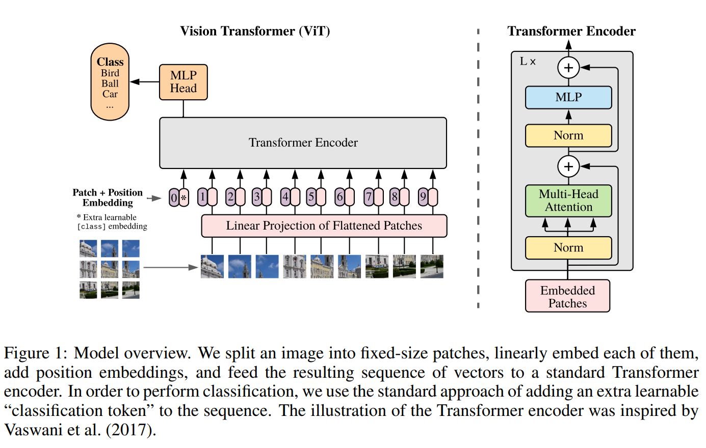

    - Pros
      - Global Receptive Field from the Start
      - Foundation for Many Vision Transformers
      
    - Cons
      - Requires Large-Scale Data
        - Quadratic Cost of Self-Attention


- __End-to-End Object Detection with Transformers.__ *Nicolas Carion et al.* __ArXiv, 2020__ [(Arxiv)](https://arxiv.org/abs/2005.12872) [(S2)](https://www.semanticscholar.org/paper/962dc29fdc3fbdc5930a10aba114050b82fe5a3e)([code_link](https://github.com/facebookresearch/detr)) (Citations __15847__)

  - Takeaway: DETR treats detection as **set prediction** using a Transformer encoder-decoder and **bipartite matching** loss.

  - Prior: Before DETR,  mainstream detectors followed a **two-stage** or **dense prediction** paradigm. One-stage detector heavily relies on anchors and hyperparameters.

    And transformer has begun to sweep other domains other than objection detection.

  - Core Mechanism:

    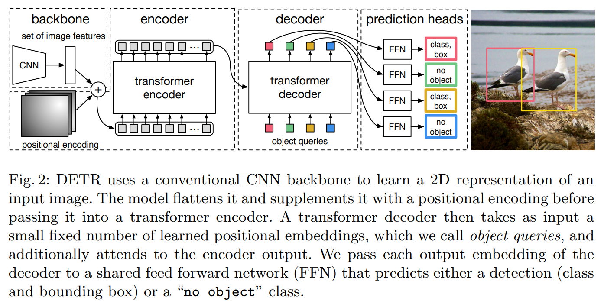

    - Set Prediction via Hungarian Matching
    
      DETR predicts **N object queries**, each responsible for one object.
       Ground truth objects and predicted queries are matched **one-to-one** using **Hungarian bipartite matching** with a cost composed of:
    
      - class probability $\sigma = \arg \min \sum L_{match}(y_i,y_{\sigma(i)})$
      - L1 box distance
      - GIoU loss

      This makes detections **order-invariant** and **unique**, removing NMS.

    - Object Queries (Learnable Embeddings)
    
      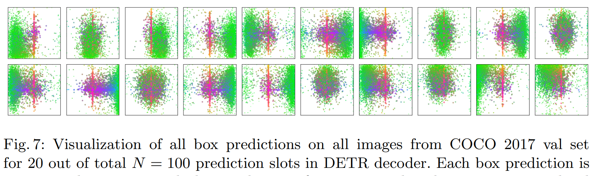
    
      Begins as a ramdom vector(n,learnable) and take the encoder output as side input.
    
      > [!TIP]
      >
      > It seems like you trained n different people to ask different questions about the input image.
    
    - Encoder: quadratic:
    
      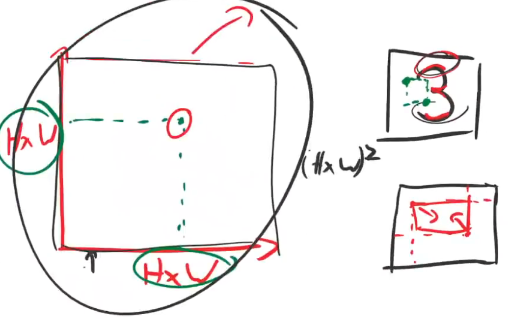
    
      Let`s check why the encoder is useful for image detection. Now each point in the matrix connect two points in the $H\times W$ map and 2 points can define a bbox. Which means every element in the matrix stands for the information about different bboxes.


  - Pipeline:
    
      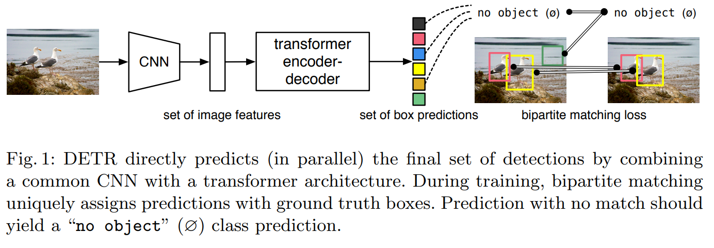
  - Pros
    
    fast, end-to-end
    
    > [!NOTE]
    >
    > RNNs for object detection were much slower and less effective, because they made predictions **sequentially rather than in parallel**.

  - Cons
    
    - slow convergence, hard to train
      - Weak Small-Object Performance
      - high computational cost

- __Deformable DETR: Deformable Transformers for End-to-End Object Detection.__ *Xizhou Zhu et al.* __ArXiv, 2020__ [(Arxiv)](https://arxiv.org/abs/2010.04159) [(S2)](https://www.semanticscholar.org/paper/39ca8f8ff28cc640e3b41a6bd7814ab85c586504)([code_link](https://github.com/fundamentalvision/Deformable-DETR)) (Citations __6350__)

- __Transformers in Vision: A Survey.__ *Salman Hameed Khan et al.* __ACM Computing Surveys (CSUR), 2021__ [(Link)](https://doi.org/10.1145/3505244) [(S2)](https://www.semanticscholar.org/paper/3a906b77fa218adc171fecb28bb81c24c14dcc7b) (Citations __3005__)

- **BERT: Pre-training of Deep Bidirectional Transformers for Language Understanding**. Jacob Devlin et.al. **arxiv**, **2018**, ([pdf](..\..\..\papers\models\BERT.pdf))([link](http://arxiv.org/abs/1810.04805v2)).

## Relations

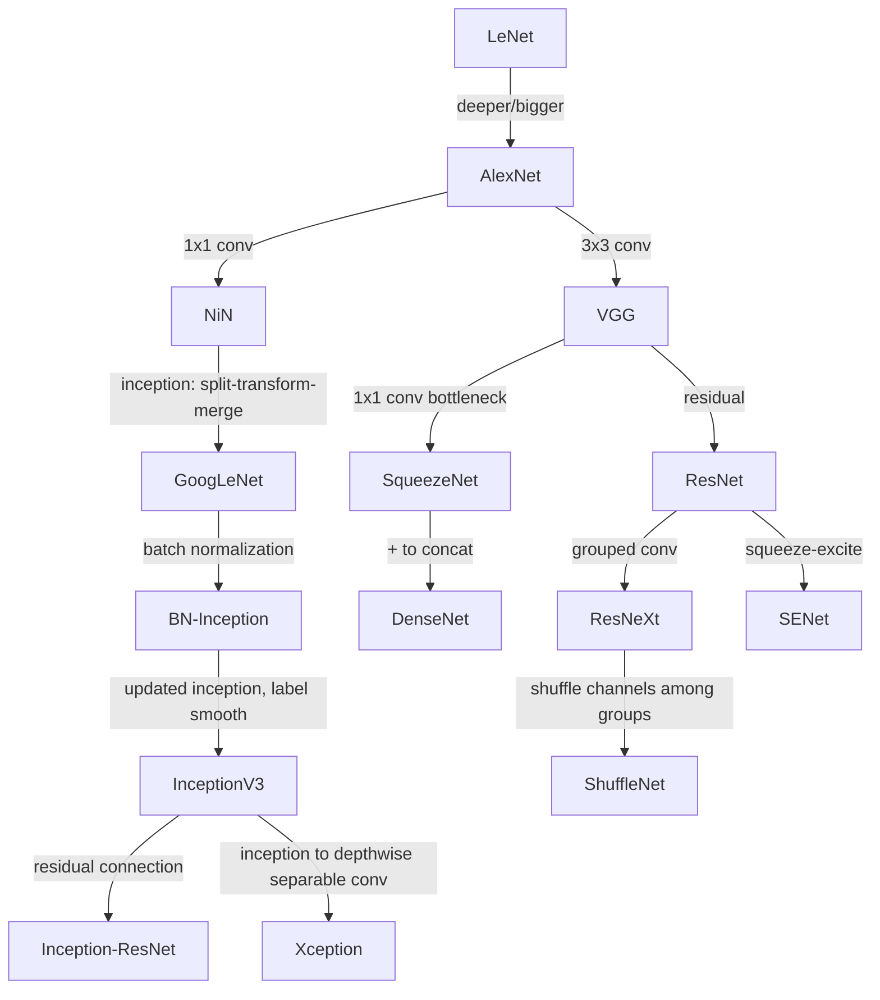

## References

- [DERT blog](https://ai.meta.com/blog/end-to-end-object-detection-with-transformers/)
- [Great blog about attention family](https://lilianweng.github.io/posts/2018-06-24-attention/)

- [Vit blog](https://research.google/blog/transformers-for-image-recognition-at-scale/?m=1)
