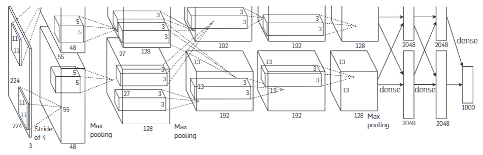
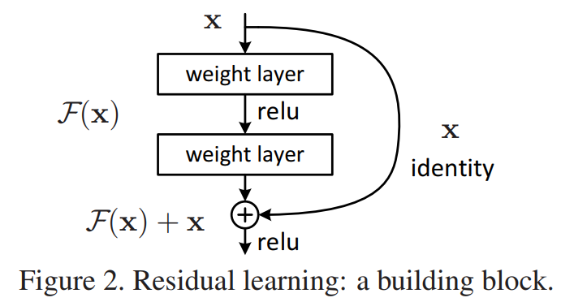
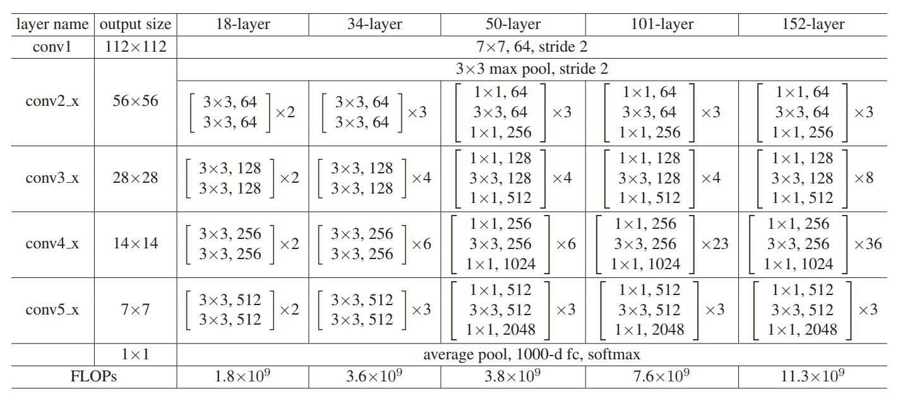
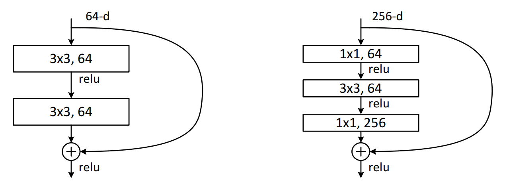
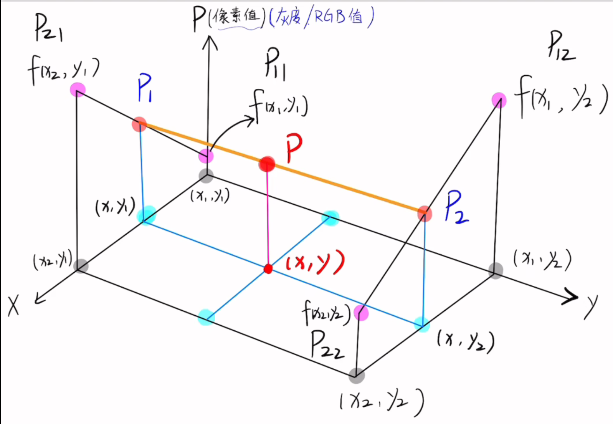
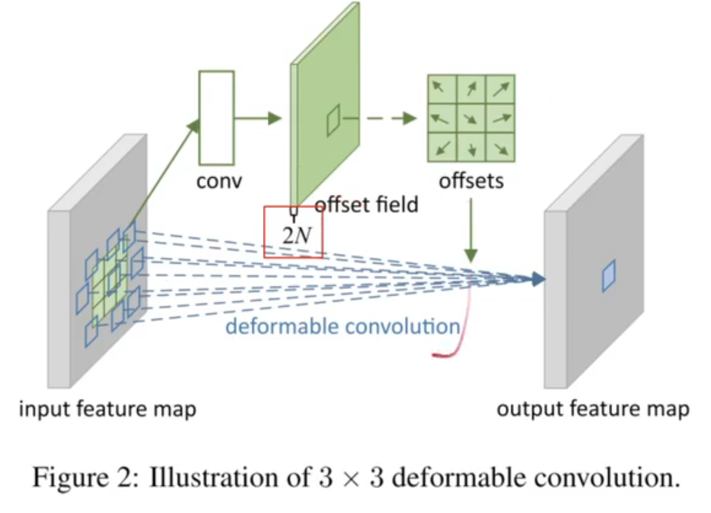
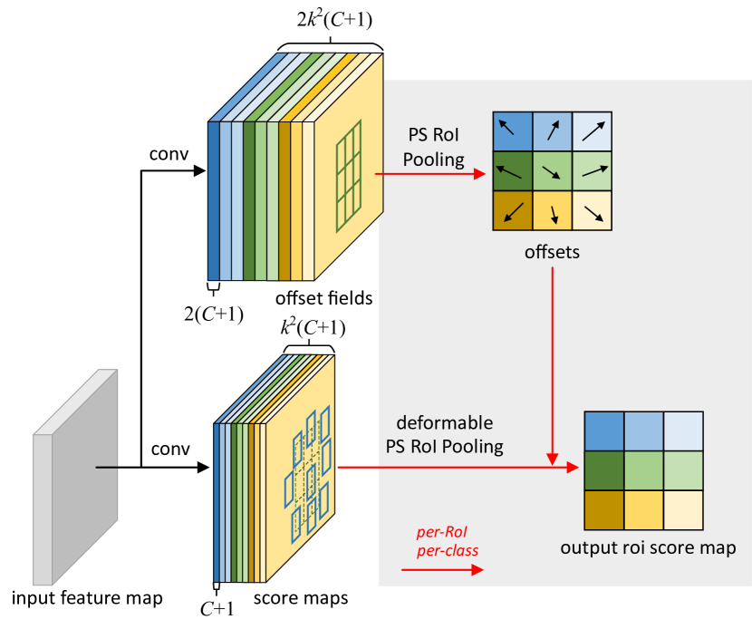
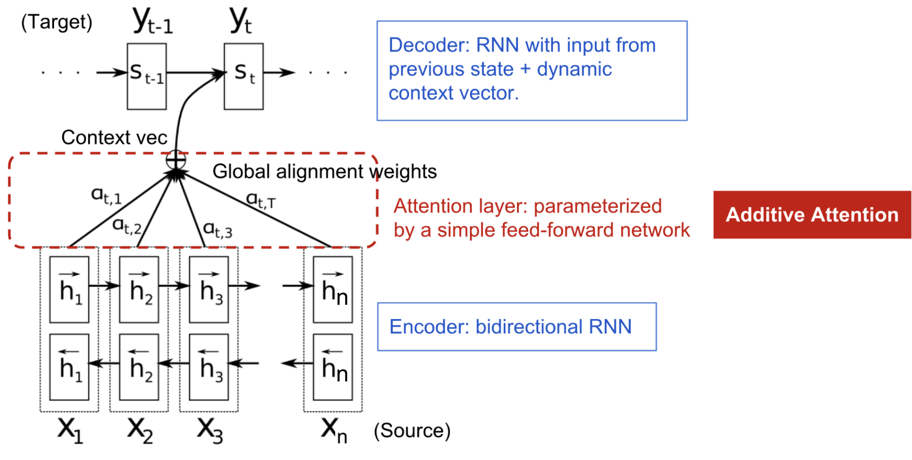
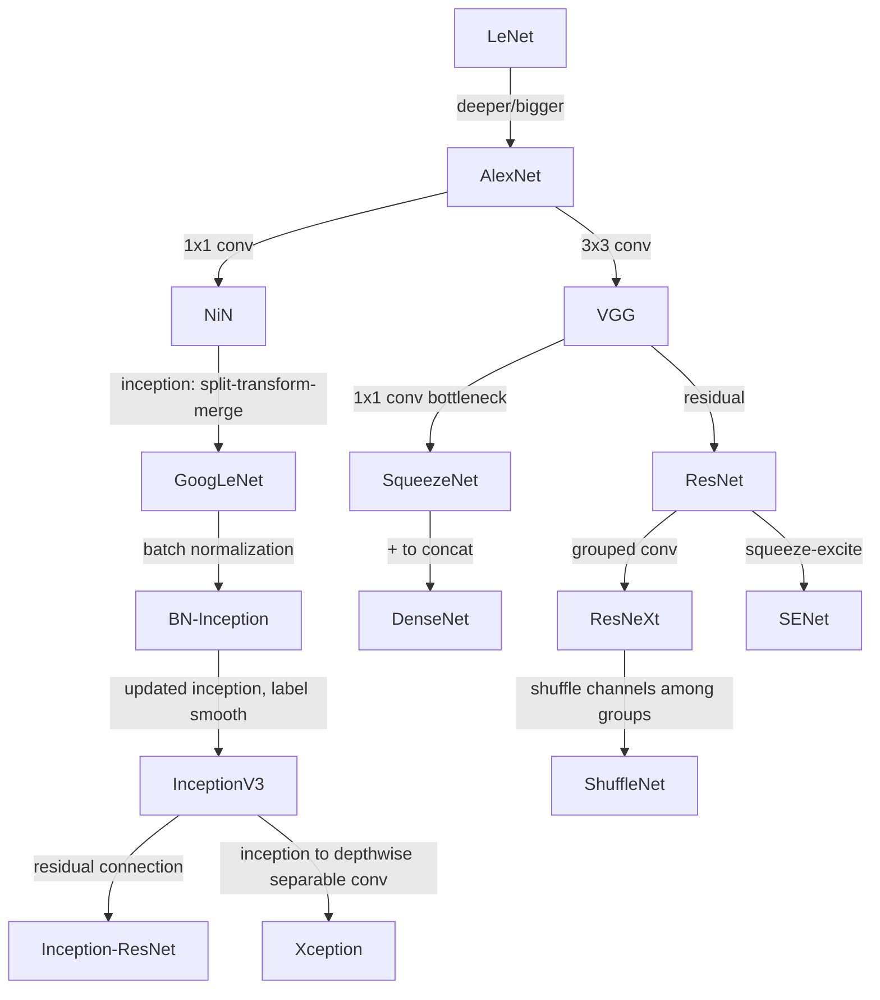

# Basic Model Zoo
[TOC]

## CNN Zoo

- **Deep learning**. LeCun Yann et.al. **Nature**, **2015-5-27**, ([link](https://doi.org/10.1038/nature14539)).

  - 监督学习就是“定义可微损失 + 反向传播算梯度 +（小批量）SGD 优化 + 测试集检验泛化”

  - 高维非凸里，真正的绊脚石多是鞍点而非“坏极小值”，因此带噪声的小批量 SGD、本质上的随机性与动量等会有帮助穿过鞍点

    > 当然现在优化器有更多，例如AdamW,LAMB等

  - ReLU 在多层网络中通常学得更快，（直观理解）ReLU 是分段线性、计算简单；其“零–正”两段让很多激活在任一前向传播中为 0，形成**稀疏激活**

  - CNN:local connections, shared weights, pooling and the use of many layers

  - Distributed representations:特征由向量表示（每个维度代表一个微特征），彼此并不排斥，能因子化复杂的输入——输出关系

  - 到端的“CNN+RNN+强化学习”的主动感知/视觉决策

- **Gradient-based learning applied to document recognition**. Lecun Y. et.al. **Proc. IEEE**, **1998**, ([link](https://doi.org/10.1109/5.726791)).

  - LeNet-5

- **ImageNet classification with deep convolutional neural networks**. Krizhevsky Alex et.al. **Commun. ACM**, **2017-5-24**, ([link](https://doi.org/10.1145/3065386)).

  - AlexNet：论文比较工程，效果在ImageNet上比较好
    
  - 使用数据增广来获得更多训练样本，通过平移、灰度变换等增广方式来扩充数据，使网络适应更多情况
  - 对网络中间层加入Dropout， 即随机使部分神经元不工作，提升模型对于整体特征的学习能力， 避免过拟合问题，提高泛化能力
  - 采用ReLU函数来替代Sigmoid函数，降低了计算量的同时，还避免了极端输入导致的梯度消失
  - 使用动量参数和学习率降低策略来加速收敛， 每当学习陷入瓶颈时学习率就会降低（手动）

- **Very Deep Convolutional Networks for Large-Scale Image Recognition**. Karen Simonyan et.al. **arxiv**, **2014**, ([link](http://arxiv.org/abs/1409.1556v6)).

  - VGGNet
  - 不同于以往的大卷积核，此网络中卷积核尺寸均为3× 3，相对于更大的卷积核而言减少了参数， 使得网络的层数能够得到加深，这样也能更好地保留图像的特征

- **Going deeper with convolutions**. Szegedy Christian et.al. **No journal**, **2015-6**, ([link](https://doi.org/10.1109/cvpr.2015.7298594)).

  - GoogLeNet (Inception v1)

- **Deep Residual Learning for Image Recognition**. He Kaiming et.al. **No journal**, **2016-6** ([link](https://doi.org/10.1109/cvpr.2016.90)).

  - ResNet：从求导来看即使梯度小，因为是加法所以还是能进行训练的

    

    

  - bottleneck的设计：右边先降维，再升维，这样就能做得更深

    做得深，就可以使用更多的通道数（可看作特征），用更复杂的特征向量来表示

    

- **Densely Connected Convolutional Networks**. Huang Gao et.al. **No journal**, **2017-7** ([link](https://doi.org/10.1109/cvpr.2017.243)).

  - DenseNet

- **Rethinking the Inception Architecture for Computer Vision**. Szegedy Christian et.al. **No journal**, **2016-6** ([link](https://doi.org/10.1109/cvpr.2016.308)).

  - Inception-v3

- __Deformable Convolutional Networks.__ *Jifeng Dai et al.* __arXiv, 2017__ [(Arxiv)](https://arxiv.org/abs/1703.06211) 

  - Takeaway: 

    Deformable Convolutional Networks enhance standard convolution by learning spatial offsets for sampling locations, allowing the network to adapt its receptive field to object geometry. This significantly improves performance in tasks with geometric variations such as object detection and segmentation.

  - Prior: 双线性插值

    

    1. 四个点先对x方向进行插值，得到两个点P1,P2
    2. 再对P1,P2，对y方向进行插值

  - Core Mechanism: deformable convolution + deformable RoI pooling

    - deformable convolution

      DCN augments each sampling location with a learnable offset $\Delta p_n$:
      $$
      y(p_0) = \sum_{p_n \in \mathcal{R}} w(p_n)\, x(p_0 + p_n + \Delta p_n)
      $$
      Since $p=p_0 + p_n + \Delta p_n$ is generally fractional, bilinear interpolation is used:
      $$
      x(p) = \sum_{q} G(q, p)\, x(q)
      $$
      Where $G(q, p)$ is the bilinear interpolation kernel.

      $G$ 为二维，可拆为两个一维核之积
      $$
      G(q,p) = g(q_x,p_x)\, g(q_y,p_y)
      $$
      其中：
      $$
      g(a,b) = \max(0, 1 - |a-b|)
      $$
      This keeps the operation differentiable and trainable end-to-end. 用周围四个点双线性插值来代替这个可能不为整数的 $p$

      

      - 这里offset field的2N是因为有N个点，每个点有x,y两个坐标，所以一共2N个偏移的值
      - 根据我们输入的值决定的：也是一种self attention

    - deformable RoI pooling

      

- Deformable convolutional networks v2

## Attention Zoo

- __Neural Machine Translation by Jointly Learning to Align and Translate.__ *Dzmitry Bahdanau et al.* __CoRR, 2014__ [(Arxiv)](https://arxiv.org/abs/1409.0473) [(S2)](https://www.semanticscholar.org/paper/fa72afa9b2cbc8f0d7b05d52548906610ffbb9c5) (Citations __28426__)

  - Takeaway: This paper introduces **attention-based neural machine translation (NMT)**.

      

- **Attention Is All You Need**. Ashish Vaswani et.al. **arxiv**, **2017**, ([link](https://arxiv.org/abs/1706.03762v7))([details](../../05-Attention.md)).

  check LLM part

- __Transformers in Vision: A Survey.__ *Salman Hameed Khan et al.* __ACM Computing Surveys (CSUR), 2021__ [(Link)](https://doi.org/10.1145/3505244) [(S2)](https://www.semanticscholar.org/paper/3a906b77fa218adc171fecb28bb81c24c14dcc7b) (Citations __3005__)

- **BERT: Pre-training of Deep Bidirectional Transformers for Language Understanding**. Jacob Devlin et.al. **arxiv**, **2018**, ([link](http://arxiv.org/abs/1810.04805v2)).

## Relations

```mermaid
graph TD
  A[LeNet] -->|deeper/bigger| B[AlexNet]

  %% Left branch
  B -->|1x1 conv| C[NiN]
  C -->|"inception: split-transform-merge"| D[GoogLeNet]
  D -->|batch normalization| E[BN-Inception]
  E -->|"updated inception, label smooth"| F[InceptionV3]
  F -->|residual connection| G[Inception-ResNet]
  F -->|"inception to depthwise separable conv"| H[Xception]

  %% Right branch
  B -->|3x3 conv| I[VGG]
  I -->|"1x1 conv bottleneck"| J[SqueezeNet]
  J -->|"+ to concat"| K[DenseNet]
  I -->|residual| L[ResNet]
  L -->|grouped conv| M[ResNeXt]
  M -->|"shuffle channels among groups"| N[ShuffleNet]
  L -->|squeeze-excite| O[SENet]

```

## References

- [DERT blog](https://ai.meta.com/blog/end-to-end-object-detection-with-transformers/)
- [Great blog about attention family](https://lilianweng.github.io/posts/2018-06-24-attention/)

- [Vit blog](https://research.google/blog/transformers-for-image-recognition-at-scale/?m=1)
