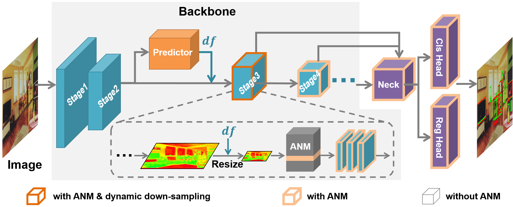
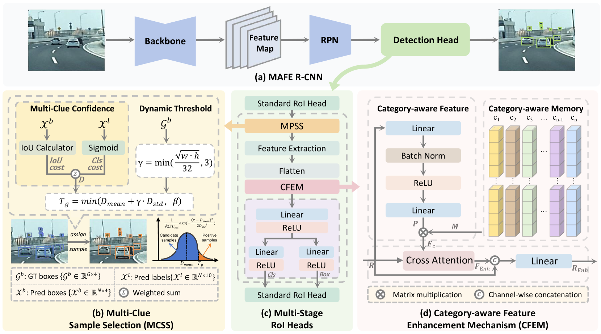

# Small Object
[TOC]

- __Dome-DETR: DETR with Density-Oriented Feature-Query Manipulation for Efficient Tiny Object Detection.__ *Zhangchi Hu et al.* __arXiv, 2025__ [(Arxiv)](https://arxiv.org/abs/2505.05741)

  - Takeaway

    Dome-DETR is a **DETR-based tiny-object detector** that uses a predicted **density map** to control both **where feature computation happens** and **where queries are allocated**. The core idea is: in tiny-object scenes, foreground is sparse but query demand is highly uneven, so the model should spend encoder/decoder budget only where density suggests it matters. 

  - Motivation

    The paper argues that tiny-object detection suffers from two coupled problems. 

    1. First, shallow high-resolution features contain crucial tiny-object details, but global attention over them is expensive and wastes computation on background.
    2. Second, fixed-query DETR is too rigid for scenes whose object counts vary drastically, especially aerial scenes with dense clusters. 

  - Core Mechanism

    Dome-DETR adds three modules on top of a D-FINE-style DETR pipeline: 

    1. **Density-Focal Extractor (DeFE)** to predict a density heatmap from shallow features

       > 就是希望强调前景区域，使用浅层CNN来捕捉空间密度

    2. **Masked Window Attention Sparsification (MWAS)** to prune low-density windows and refine valid windows with an Axis Permuted Encoder

       > 为什么这里需要一个掩码，因为浅层特征很关键，但是attention costs较高，因次抑制一下无关区域

    3. **Progressive Adaptive Query Initialization (PAQI)** to allocate more queries to high-density regions and fewer to sparse/background regions.

       > 将 DETR 中的固定查询机制（面临对象数量的巨大差异）改为自适应分配查询

- __DPNet: Dynamic Pooling Network for Tiny Object Detection.__ *Luqi Gong et al.* __arXiv, 2025__ [(Arxiv)](https://arxiv.org/abs/2505.02797)
  - Takeaway

    DPNet reframes tiny-object detection as an **input-aware accuracy-efficiency tradeoff** problem: instead of always using one fixed feature-map resolution, it predicts a suitable **down-sampling factor $df$** for each image so the detector spends more compute only when the input actually needs it. 

    实际上就是帮忙解决调整图像大小这个策略带来的计算成本和负样本数量的问题，而调整图像大小本身才是提升小目标检测效果的solution

  - Motivation

    Enlarging images often helps tiny objects, but it also sharply increases FLOPs and the number of negative/background samples. 因此我们需要在这中间取得trade-off. DPNet’s answer is not “always enlarge” or “always shrink,” but “**adapt the feature resolution per image**.” 

  - Core Mechanism

    

    > Figure 4:Framework of DPNet. DFP is inserted into the backbone as a plug-in and guides a stage’s the d⁢f selection. After the feature is rescaled by d⁢f, all normalization layers in the detector are replaced with ANM. The ANM will switch to the corresponding normalization layer for the feature map. The blue cubes are the stages of the backbone, the orange one is the proposed DFP, and the purple ones are the neck and head parts of the detector. (Best viewed in color)

    DPNet has three key pieces: 

    1. **Mixed Scale Training (MST)** so one detector can work under multiple down-sampling factors.

    2. **Adaptive Normalization Module (ANM)** so normalization is specialized for each $df$.

    3. **Down-sampling Factor Predictor (DFP)** that classifies which $df$ is best for the current image. A guidance loss is used to derive supervision for DFP from detector performance.

       但是实际上做的时候没这么fancy，对$df$选了几个候选值，然后对

  - Pros

    - The idea is simple and practical
    - modular: view it as a dynamic-resolution wrapper around a conventional CNN detector

  - Cons

    The method depends on a good discrete candidate set of $df$ values and on the quality of the predictor’s supervision. Because $df$ selection is classification-style rather than continuous optimization, the policy may be coarse. It also adds a two-step training logic: first train the detector under mixed $df$, then train the predictor.

- __MAFE R-CNN: Selecting More Samples to Learn Category-aware Features for Small Object Detection.__ *Yichen Li et al.* __arXiv, 2025__ [(Arxiv)](https://arxiv.org/abs/2505.16442) 

  - Takeaway

    MAFE R-CNN is a **two-stage / Cascade-style** detector that says small-object failure comes from two places at once: **bad positive-sample assignment** and **weak object representation**. Its answer is to jointly improve them with **MCSS** for assignment and **CFEM** for category-aware feature enhancement. 

  - Prior

    - Memory Module: 内存模块是使模型能够获取和保留输入图像之外有效信息的关键组成部分，促进训练过程中跨多幅图像的信息聚合
    
  - Motivation
  
    1. imbalanced samples：训练时，小目标很容易因为太小、框不准，而被当成“差样本”丢掉
    2. blurred features：推理时，小目标本身特征太弱、太模糊，不容易分清类别
    
  - Core Mechanism
  
    
  
    > 上述图里面是MPSS，怀疑是写错了
    
    - **MCSS**(Multi-Clue Sample Selection) forms a sample-quality score using multiple clues: **IoU distance**, **predicted category confidence**, and **ground-truth size**, then applies a **dynamic threshold** whose level depends on the score distribution and object size.
    
      负责解决问题1，挑样本。选择置信度（IoU+category configdence）>动态阈值(候选框置信度均值与标准差+当前真值框大小)的样本
    
    - **CFEM**(Category-aware Feature Enhancement Mechanism) maintains a **category-aware memory**, 利用和探究**同一类别特征之间的联系**
    
      负责解决问题2，使得目标特征更有类别意识。一共包含三个部分
    
      1. **Category-aware Memory**：类别记忆库。训练时会被**ground-truth feature** 持续更新，加权移动平均。而且会参考余弦相似度，避免 memory 过度贴近某一小撮样本，从而保持更强泛化性
    
      2. **Category-aware Feature Generation**：生成类别感知特征
    
         `Linear → BatchNorm → ReLU → Linear`来利用原始特征输出类别概率P来选择memory进行加权求和
    
      3. **Feature Interaction Enhancement**：类别特征和原始特征做交互增强。一个cross-attention
    
      > [!NOTE]
      >
      > 这里利用内存模块，之前都是图像级特征的记忆单元，这里使用实例级特征记忆模块，用于学习对象之间的上下文信息
    
    - 中间部分Multi-Stage RoI Heads: 多阶段 refinement
    
      ```
      Standard RoI Head →（中间插入 MCSS 和 CFEM）→ Standard RoI Head
      ```
    
      1. 先用一个标准 RoI head 做第一阶段预测；
      2. 然后用 **MCSS** 为后续阶段自适应地选正样本；
      3. 在第二阶段预测前，用 **CFEM** 增强候选框特征；
      4. 最后再用标准 RoI head 继续细化预测，得到最终检测结果。
  
- __LAF-YOLOv10 with Partial Convolution Backbone, Attention-Guided Feature Pyramid, Auxiliary P2 Head, and Wise-IoU Loss for Small Object Detection in Drone Aerial Imagery.__ *Sohail Ali Farooqui et al.* __arXiv, 2026__ [(Arxiv)](https://arxiv.org/abs/2602.13378) 

  - Takeaway

    就是在yolov10上做了一些修改变为LAF-YOLOv10，用于UAV-specific(Unmanned aerial vehicles)这个场景，将一些模块拼凑而成

  - Motivation

  - Core Mechanism

    一共提出了四个module(缝合怪，没有新的东西)

    - A Partial Convolution C2f (PC-C2f) module restricts spatial convolution to one quarter of backbone channels, reducing redundant computation while preserving discriminative capacity. 压缩backbone计算量

      标准的 C2f 块通过空间核处理 3×3 所有 C 通道。由于小物体只激活部分信道，该操作浪费了计算。PC-C2f 将空间卷积限制在 C/4 通道内，并使用 1×1 投影进行跨通道混音，作为隐式信息瓶颈，迫使骨干将容量集中于判别特征。

    - An Attention-Guided Feature Pyramid Network (AG-FPN) inserts Squeeze-and-Excitation channel gates before multi-scale fusion and replaces nearest-neighbor upsampling with DySample for content-aware interpolation. 细化跨尺度融合

    - An auxiliary P2 detection head at 160\*160 resolution extends localization to objects below 8\*8 pixels, while the P5 head is removed to redistribute parameters. P2恢复空间分辨率

      添加细分辨率探测头并去除大物体头已成为一种解决小目标检测的既定策略（但是要保证基本只有小目标，因为这样会对大目标有影响）

    - Wise-IoU v3 replaces CIoU for bounding box regression, attenuating gradients from noisy annotations in crowded aerial scenes. 稳定标签噪声下的回归

    

- __RS-TinyNet: Stage-wise Feature Fusion Network for Detecting Tiny Objects in Remote Sensing Images.__ *Xiaozheng Jiang et al.* __ArXiv, 2025__ [(Arxiv)](https://arxiv.org/abs/2507.13120) [(S2)](https://www.semanticscholar.org/paper/c3122c8c6a77e19f1197f9cf1501db9297591cc9) (Citations __0__)

- __A Data-Driven RetinaNet Model for Small Object Detection in Aerial Images.__ *Zhicheng Tang et al.* __arXiv, 2025__ [(Arxiv)](https://arxiv.org/abs/2509.02928)

- __MambaRefine-YOLO: A Dual-Modality Small Object Detector for UAV Imagery.__ *Shuyu Cao et al.* __ArXiv, 2025__ [(Arxiv)](https://arxiv.org/abs/2511.19134) [(S2)](https://www.semanticscholar.org/paper/e5b3979467ae975ea5dc7949a45e7b3f7485d9d8) (Citations __0__)

- __D$^3$R-DETR: DETR with Dual-Domain Density Refinement for Tiny Object Detection in Aerial Images.__ *Zixiao Wen et al.* __arXiv, 2026__ [(Arxiv)](https://arxiv.org/abs/2601.02747)

- __Breaking Self-Attention Failure: Rethinking Query Initialization for Infrared Small Target Detection.__ *Yuteng Liu et al.* __ArXiv, 2026__ [(Arxiv)](https://arxiv.org/abs/2601.02837) [(S2)](https://www.semanticscholar.org/paper/7ae4f75043be052b589c349697d2fc4d8c905061) (Citations __0__)

## Problems and Solutions

Tiny object detection presents significant challenges due to limited pixel information and complex distributions. 但是这么多年来大家都在做很多尝试（随便看一篇文章的Related Work都可以看到），这里总结一下：

- 特征表示不足(blurred features)且缺乏长程依赖建模，低分辨率、弱信号和高噪声

  > The essence of deep learning-based object detection is to classify and regress similar feature regions across all images, rather than performing independent classification and regression within each individual image.

  - Sol: （早期）解决方案侧重于数据增强(eg: copy-paste strategies)

  - Sol 物体尺度问题：

    - 调整图像大小(直接放大)

      ```
      SNIP
      SNIPER
      SM+
      QueryDet
      DPNet
      ```

    - 对齐预训练数据集与目标数据集尺度分布

    - 多尺度图像金字塔

  - Sol: （早期）specialized loss functions, 重新表述了并集交（IoU），以考虑绝对和相对对象大小

  - Sol: transformer-based models，mitigate these issues by eliminating hand-crafted components (e.g., NMS) and leveraging self-attention

    - Cons: heavily depend on manually designed bounding-box representations or finely tuned hyperparameters
    
  - Sol: image super-resolution [[19](https://arxiv.org/html/2505.16442v1#biba.bib19), [20](https://arxiv.org/html/2505.16442v1#biba.bib20), [21](https://arxiv.org/html/2505.16442v1#biba.bib21), [22](https://arxiv.org/html/2505.16442v1#biba.bib22)], feature fusion [[23](https://arxiv.org/html/2505.16442v1#biba.bib23), [24](https://arxiv.org/html/2505.16442v1#biba.bib24), [25](https://arxiv.org/html/2505.16442v1#biba.bib25)], and 

  - Sol: feature imitation [[26](https://arxiv.org/html/2505.16442v1#biba.bib26), [27](https://arxiv.org/html/2505.16442v1#biba.bib27), [13](https://arxiv.org/html/2505.16442v1#biba.bib13), [28](https://arxiv.org/html/2505.16442v1#biba.bib28)].(enhance small object features by imitating the features of larger objects)

- imbalanced samples: fixed strategies and thresholds lead to imbalanced sample assignment. Tiny prediction shifts significantly affect the sample distribution of small objects

  - Sol: propose sample assignment methods(assignment strategy)

    - Cons: They only rely on predicted **position information** to select samples, which can easily introduce low-quality samples and often fail to match samples when dealing with extremely small objects, leading to inadequate samples.

      > **position information** alone cannot serve as the sole criterion for determining positive and negative samples.

  - Sol:
