# Yolo Zoo

[TOC]

> [!TIP]
>
> Compared to the model architecture, I think the engineer tricks of yolo are more important.

- __You Only Look Once: Unified, Real-Time Object Detection.__ *Joseph Redmon et al.* __2016 IEEE Conference on Computer Vision and Pattern Recognition (CVPR), 2015__ [(Arxiv)](https://arxiv.org/abs/1506.02640) [(S2)](https://www.semanticscholar.org/paper/f8e79ac0ea341056ef20f2616628b3e964764cfd) (Citations __41521__)

  - Takeaway: YOLO predicts boxes and classes in **one CNN forward pass** (one-stage detection).

  - Motivation: Before YOLO, dominant detectors were region-based like R-CNN zoo which is multi-stage and slow at inference.

  - Core Mechanism:

    Divide the image into $S\times S$ grids and for each grid cell predict:

    - B bounding box(with position and confidence score $Pr(object)\times IOU_{\text{truth}}^{\text{pred}}$)
    - C class probabilities

    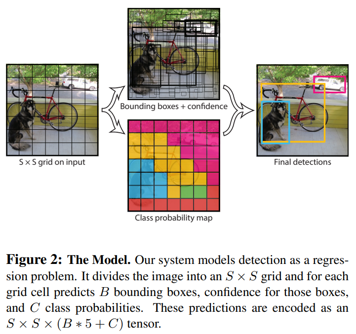

  - Pipeline

    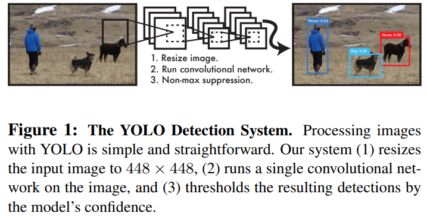

  - Pros

    - real-time, simple architecture
    - foundational impact: established the one-stage detection paradigm

  - Cons

    - coarse localization
    - struggles with small objects

- YOLOv5(no formal paper, engineering release)

  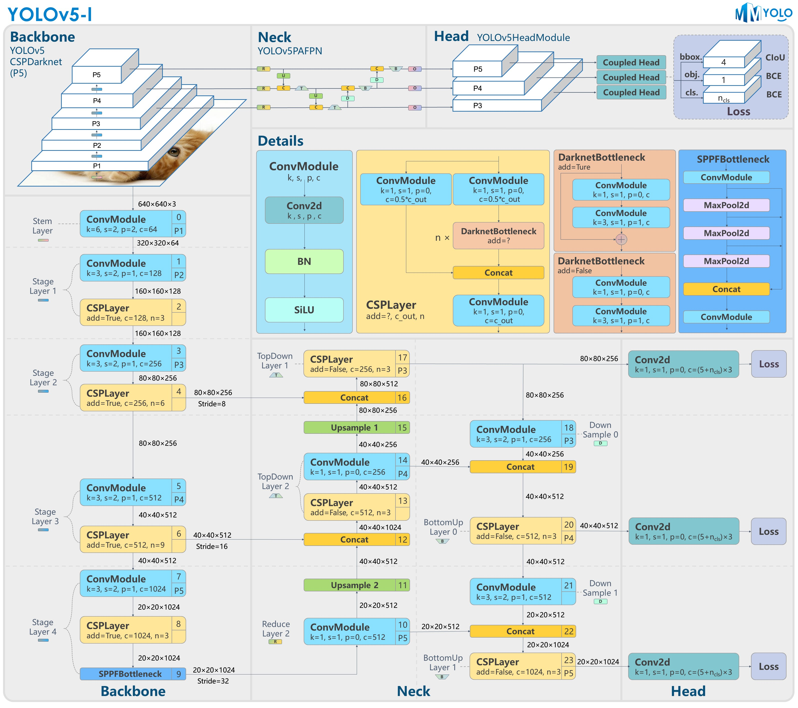

  - Core Mechanism

    - backbone

      - Conv -- CBA(convolution, batch normalization, activation(SiLU--sigmoid linear unit))

        use conv layer to replace the pooling layer

      - SPP(Spatial Pyramid Pooling)/SPPF(Spatial Pyramid Pooling Fast)

        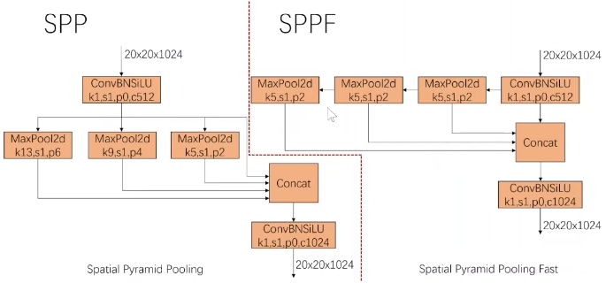

      - C3 -- cross stage partial network with 3 convolutions

        > [!NOTE]
        >
        > a simplified CSPNet(CSP (Cross Stage Partial))

    - neck

      - concat in different layers: 先从下到上，再从上到下


## YOLOX

- __YOLOX: Exceeding YOLO Series in 2021.__ *Zheng Ge et al.* __arXiv, 2021__ [(Arxiv)](https://arxiv.org/abs/2107.08430) 

  - Core Mechanism
    - Decoupled head
    - data augmentation: Mosaic and MixUp

- __YOLOv7: Trainable Bag-of-Freebies Sets New State-of-the-Art for Real-Time Object Detectors.__ *Chien-Yao Wang et al.* __2023 IEEE/CVF Conference on Computer Vision and Pattern Recognition (CVPR), 2022__ [(Arxiv)](https://arxiv.org/abs/2207.02696) [(S2)](https://www.semanticscholar.org/paper/3aed4648f7857c1d5e9b1da4c3afaf97463138c3) (Citations __8815__)

  - Main Takeaway: In addition to architecture optimization, Yolov7 proposed methods will focus on the optimization of the **training process**.

    > [!TIP]
    >
    > We call the proposed modules and optimization methods trainable bag-of-freebies.

    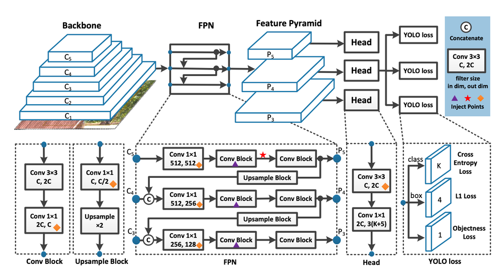

  - Core Mechanism: many tricks

    1. Extended efficient layer aggregation networks(E-ELAN)

       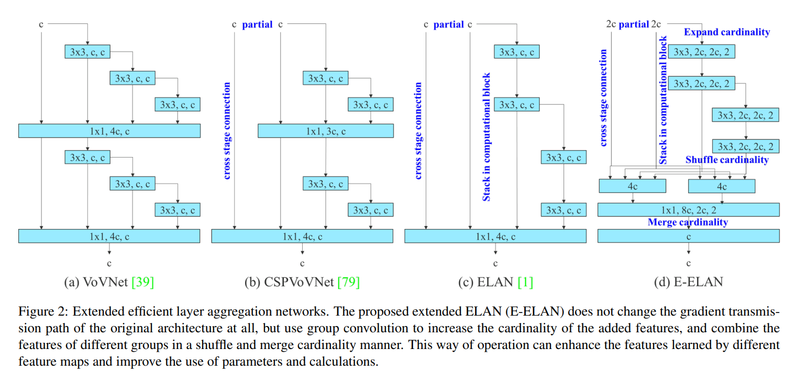

       - use **group convolution** to increase the cardinality of the added features, and combine the features of different groups in a shuffle and merge cardinality manner
       - Pros:
         - improve feature fusion and enhance feature extraction capabilities
         - In terms of architecture, E-ELAN only changes the architecture in computational block, while the architecture of transition layer is completely unchanged.

    2. Several trainable bag-of-freebies methods

       1. planned re-parameterized model

          > [!NOTE]
          >
          > To answer the issue of "how re-parameterized module replaces original module".

          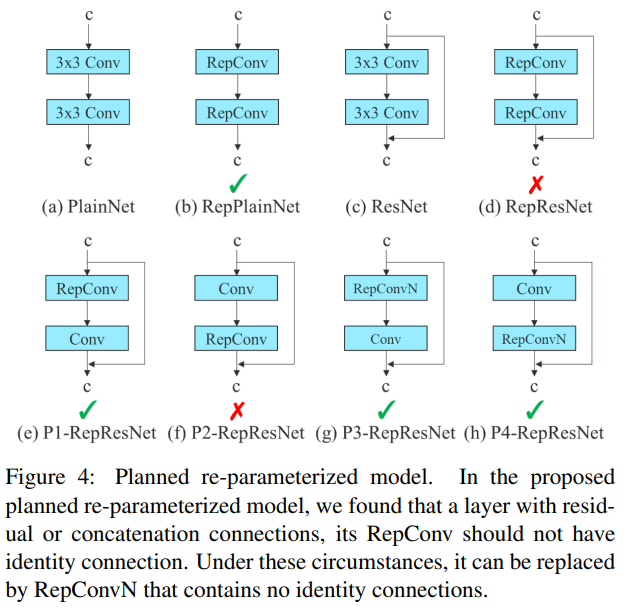

          - We found that a layer with residual or concatenation connections(ResNet and DenseNet), its RepConv should not have identity connection. Under these circumstances, it can be replaced by **RepConvN** that contains no identity connections.

       2. dynamic label assignment technology: coarse-to-fine lead guided label assignment

          > [!NOTE]
          >
          > To answer the issue of “How to assign dynamic targets for the outputs of different branches?”

           Coarse for auxiliary and fine for lead head label assigner

          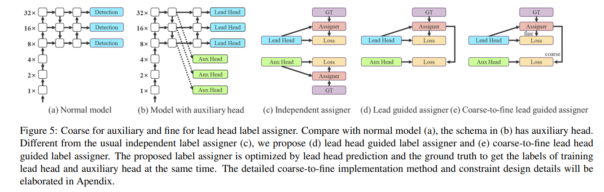

          > [!NOTE]
          >
          > - hard label: hard label assignment refers directly to the ground truth and generate hard label according to the given rules
          > - soft label: quality and distribution of prediction output by the network, and then consider together with the ground truth to use some calculation and optimization methods to generate a reliable soft label

          - Fine label is the same as the soft label generated by lead head guided label assigner.
          - Coarse label is generated by allowing more grids to be treated as positive target by relaxing the constraints of the positive sample assignment process.

       3. others:

          - Batch normalization in conv-bn-activation topology: This part mainly connects batch normalization layer directly to convolutional layer
          - Implicit knowledge in YOLOR combined with convolution feature map in addition and multiplication manner
          - EMA model: EMA is a technique used in mean teacher, and in our system we use EMA model purely as the final inference model
          - YOLOv7 leverages **AutoAugment** for data augmentation, which helps improve the model’s generalization to unseen data.
          - Loss Functions: **CIoU loss** and **Focal Loss** for better bounding box localization and class prediction accuracy, especially for smaller objects.

    3. compound model scaling for concatenation-based models

       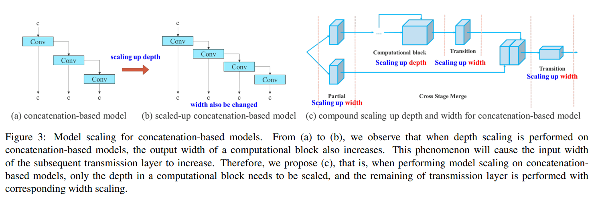

- __YOLOv8 to YOLO11: A Comprehensive Architecture In-depth Comparative Review.__ *Priyanto Hidayatullah et al.* __ArXiv, 2025__ [(Arxiv)](https://arxiv.org/abs/2501.13400) [(S2)](https://www.semanticscholar.org/paper/80886f2eed13a634045f4671d35be7bf67eef093) (Citations __51__)

  - Core Mechanism

    1. some blocks explanation

       - Conv block  = Conv2d + BN2d + SiLU

       - Downsampling Block:

         - Cons: employ typical 3×3 convolution with stride 2 for the downsampling  process which may be less efficient

         - yolov9: Adaptive Downsampling (ADown)

           - Pros: less parameter count as pooling involves no parameters

           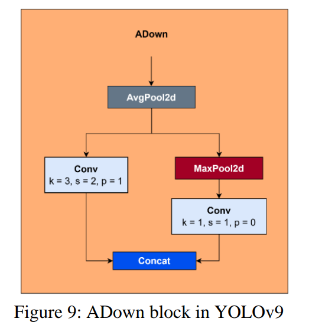

         - yolov10: Spatial-Channel Decoupled Downsampling (SCDown), which separates spatial reduction and channel addition operations

           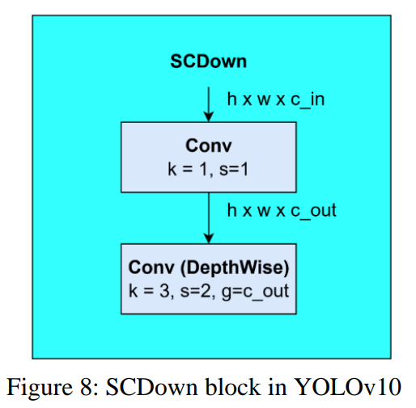

           use $1\times 1$ conv to change channel number and then use depthwise conv to decrease spatial resolution

       - C2fCIB, CIB, RepVGGDW

       - bottleneck

         `Bottleneck`是最基础的模块，用于构建更复杂的 CSP 结构。它包含两个卷积层，能够有效地减少计算量并提取特征。这个模块还可以选择是否使用 shortcut 连接，以增强梯度传播。

         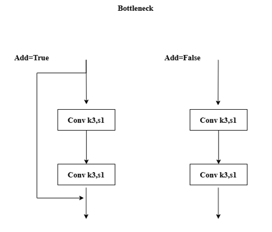

       - bottleneck_SP

         见到过bottleneck的第二个卷积换为了Strip Pooling

         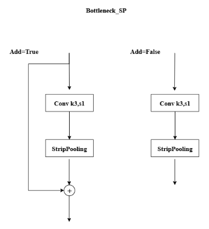

         > [!NOTE]
         >
         > Strip Pooling
         >
         > 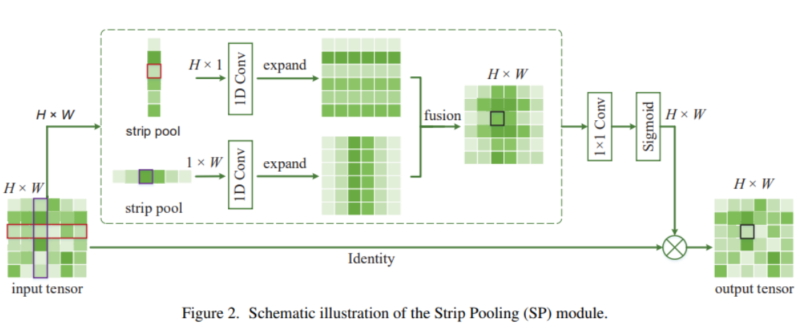
         >
         > Strip Pooling 是一类**条带形池化**，沿着**整行**或者**整列**去做聚合，也就是用长而窄的核去收集上下文
         >
         > - Pros: 更擅长抓住**横向连续**或者**纵向连续**的关系
         > - Cons: 
         >   - 不像注意力那样可以更自由地学习任意位置之间的成对关系
         >   - 会增加额外分支、融合操作和内存访问

       - C3

         `C3`是 CSP 瓶颈模块的一个基础版本，它的目的是通过增加特征的传递路径来提升网络的表现。C3 包含三个卷积层和一系列瓶颈层，能够高效提取不同层次的特征。

         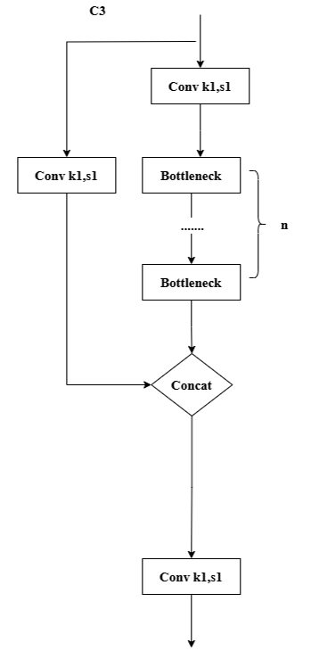

       - C3K:

         `C3k(可定制卷积核)`：C3k是C3模块的一个变体，主要改进在于它允许自定义卷积核的大小（bottleneck中的)。可以更好地适应不同尺寸的图像特征，尤其是当我们需要捕捉更大范围的上下文信息时。当`k=3`时，`C3k=C3`

         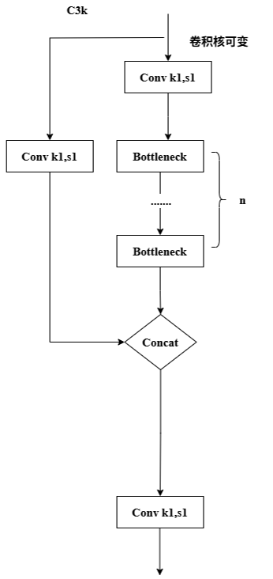

       - C2f is a faster Implementation of CSP Bottleneck with 2 convolutions. C2f is utilized for feature extraction at all stages

         在`C2f`中，通过减少瓶颈层的数量以及对特征的快速分割和合并，达到了加速网络的目的，非常适合在对速度要求较高的应用场景中使用。

         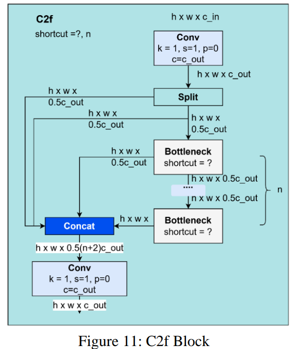

       - C3k2

         `C3k2`结合了`C2f`的速度优势和`C3k`的灵活性。它允许在运行时选择是否使用`C3k`层来处理特征，提供了很高的可配置性。

         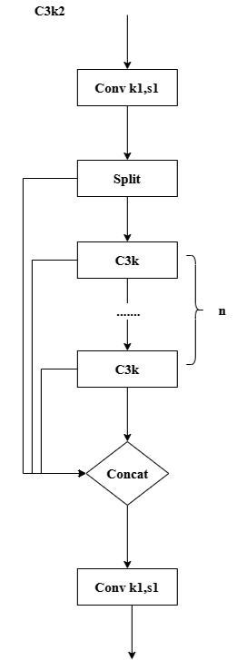

       - SPPF & SPPELAN: Spatial Pyramid Pooling – Fast

       - C2PSA and Attention Block

       - Detect Block

         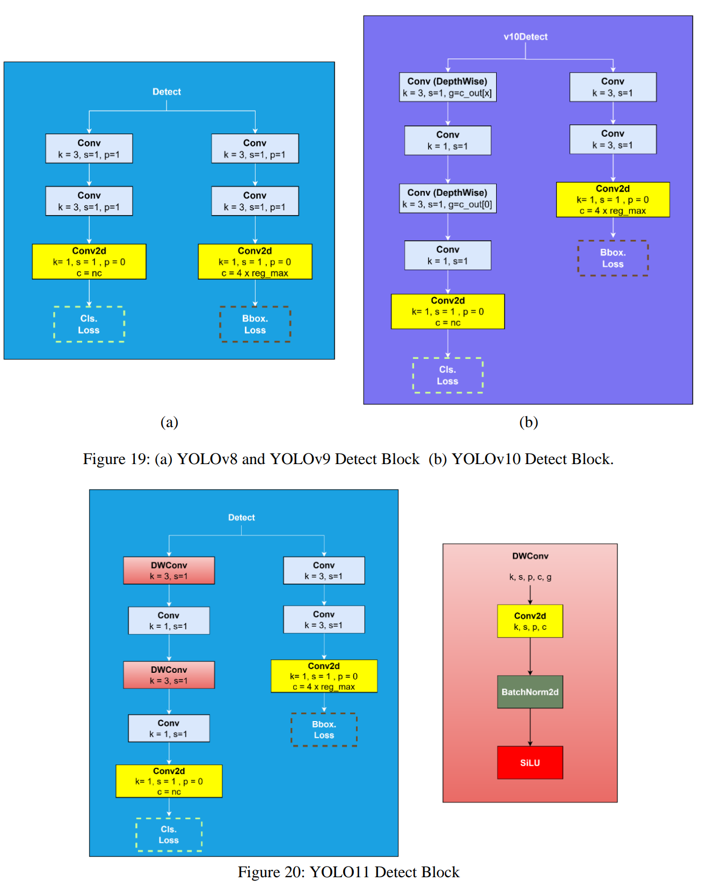

  - Performance

    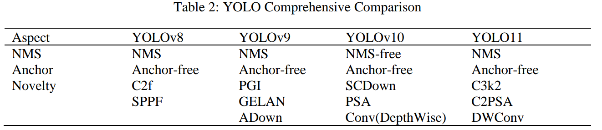


## YOLOv10

- __YOLOv10: Real-Time End-to-End Object Detection.__ *Ao Wang et al.* __ArXiv, 2024__ [(Arxiv)](https://arxiv.org/abs/2405.14458) [(S2)](https://www.semanticscholar.org/paper/3723f1406b8f65471030b81fb5045067f0e29c2d) (Citations __3550__)

  - Takeaway: YOLOv10 eliminates NMS, marking a shift toward fully end-to-end detection. 系统性地重构了 backbone、neck 和 head 的若干组件，用更低的计算开销换取更好的精度速度权衡。

    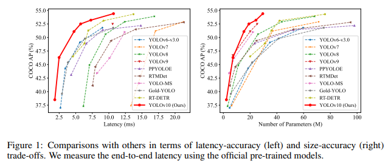

  - Motivation

    不够快的两个关键瓶颈

    - 后处理以来nms
    - 很多已有 YOLO 的模块设计是逐步堆叠出来的，存在明显的 **计算冗余和效率浪费**

  - Core Mechanism

    - Architecture

      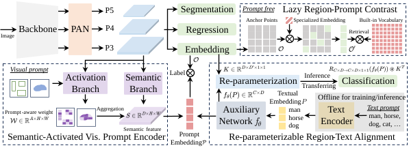

    - NMS-free

      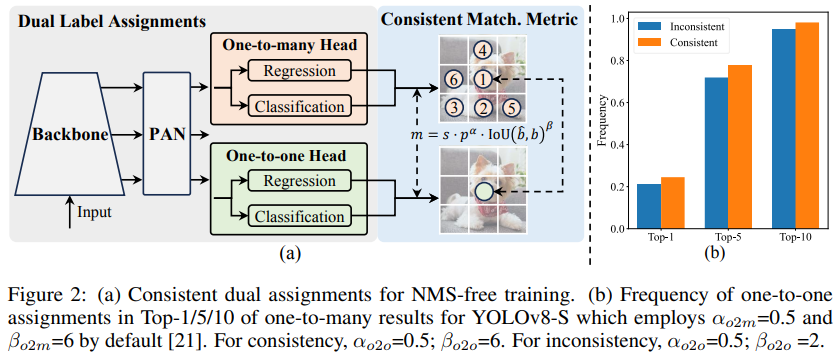

      - Motivation: 我们想要实现nms-free，one-to-one matching assigns only one prediction to each ground truth, avoiding the NMS post-processing. However, it leads to weak supervision, which causes suboptimal accuracy and convergence speed.

        因此想要使用one to many的来补偿这部分损失

      提出了 **consistent dual assignments**，让模型在训练时同时获得 one to many 和 one to one 两种监督，从而在推理时可以只保留 one to one 分支并去掉 NMS

      Consistent matching metric
      $$
      m(\alpha,\beta)=s \cdot p^{\alpha}\cdot \mathrm{IoU}(\hat{b}, b)^{\beta}
      $$

      - s表示spatial prior,也就是这个预测点是否落在对应目标内部的空间先验
      - p是分类分数
      - $\hat b$是预测框
      - b是gt box
      - $\alpha$控制分类的权重
      - $\beta$控制定位的权重

      > [!NOTE]
      >
      > 为什么要有这个Consistent matching metric，因为如果两个分支有不同的匹配度量，就会产生supervision gap
      >
      > 实际上，两个分支只是公式形式一样，但参数形式不同
      > $$
      > m_{o2m}=m(\alpha_{o2m},\beta_{o2m}),~ m_{o2o}=m(\alpha_{o2o},\beta_{o2o})
      > $$
      > 假设 one to many 分支给某个真实目标分出了正样本集合 $\Omega$，one to one 分支最终选中了第 $i$ 个预测，那么它们的分类目标写成：
      > $$
      > t_{o2m,j}=u^{*}\cdot \frac{m_{o2m,j}}{m_{o2m}^{*}}, \qquad j\in\Omega \\
      > t_{o2o,i}=u^{*}\cdot \frac{m_{o2o,i}}{m_{o2o}^{*}} = u^{*} \\
      > m^*表示最大匹配分数
      > $$
      > 然后我们需要衡量supervision gap
      >
      > 把两个分支的监督差异写成 1-Wasserstein distance，最后化简成:
      > $$
      > A = t_{o2o,i} - \mathbb{I}(i\in\Omega)\, t_{o2m,i}
      >     + \sum_{k\in\Omega\setminus\{i\}} t_{o2m,k}
      > $$
      > $\mathbb{I}(i\in\Omega)$是指示函数。如果 one to one 选中的第 $i$ 个预测也在 one to many 的正样本集合里，它等于 1，否则等于 0。
      >
      > 看一下这个式子，差异=o2o监督 - o2m共享的部分 + o2m其他正样本的而额外监督，A越小，监督越一致，即当one to one选的样本正好是one to many选的最优正样本时，gap最小
      >
      > 可以证明$\alpha_{o2o}=r\cdot \alpha_{o2m},\beta_{o2o}=r\cdot \beta_{o2m}$，即$m_{o2o}=m_{o2m}^{\,r}$能保持一致性，使得监督方向更协调

      那么o2o到底是如何从o2m中学习的呢

      - o2m让backbone and neck获得的特征比较好

      - o2o和o2m学习的正样本利用$m_{o2o}=m_{o2m}^{\,r}$尽量保持一致

        > 感觉o2m的帮助很弱

    - 系统性地重构了 backbone、neck 和 head 的若干组件，用更低的计算开销换取更好的精度速度权衡。

      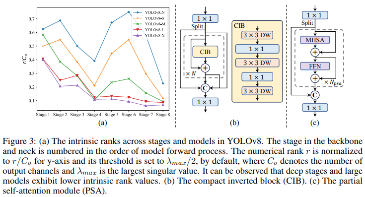

      ```python
      class CIB(nn.Module):
          """Standard bottleneck."""
      
          def __init__(self, c1, c2, shortcut=True, e=0.5, lk=False):
              """Initializes a bottleneck module with given input/output channels, shortcut option, group, kernels, and
              expansion.
              """
              super().__init__()
              c_ = int(c2 * e)  # hidden channels
              self.cv1 = nn.Sequential(
                  Conv(c1, c1, 3, g=c1),
                  Conv(c1, 2 * c_, 1),
                  Conv(2 * c_, 2 * c_, 3, g=2 * c_) if not lk else RepVGGDW(2 * c_),
                  Conv(2 * c_, c2, 1),
                  Conv(c2, c2, 3, g=c2),
              )
      		# 决定做不做残差
              self.add = shortcut and c1 == c2
      
          def forward(self, x):
              """'forward()' applies the YOLO FPN to input data."""
              return x + self.cv1(x) if self.add else self.cv1(x)
      
      class C2fCIB(C2f):
          """Faster Implementation of CSP Bottleneck with 2 convolutions."""
      
          def __init__(self, c1, c2, n=1, shortcut=False, lk=False, g=1, e=0.5):
              """Initialize CSP bottleneck layer with two convolutions with arguments ch_in, ch_out, number, shortcut, groups,
              expansion.
              """
              super().__init__(c1, c2, n, shortcut, g, e)
              self.m = nn.ModuleList(CIB(self.c, self.c, shortcut, e=1.0, lk=lk) for _ in range(n))
      ```

      ```python
      class PSA(nn.Module):
      
          def __init__(self, c1, c2, e=0.5):
              super().__init__()
              assert(c1 == c2)
              self.c = int(c1 * e)
              self.cv1 = Conv(c1, 2 * self.c, 1, 1)
              self.cv2 = Conv(2 * self.c, c1, 1)
              
              self.attn = Attention(self.c, attn_ratio=0.5, num_heads=self.c // 64)
              self.ffn = nn.Sequential(
                  Conv(self.c, self.c*2, 1),
                  Conv(self.c*2, self.c, 1, act=False)
              )
              
          def forward(self, x):
              a, b = self.cv1(x).split((self.c, self.c), dim=1)
              b = b + self.attn(b)
              b = b + self.ffn(b)
              return self.cv2(torch.cat((a, b), 1))
      ```

      

## YOLOv11

- __YOLOv11: An Overview of the Key Architectural Enhancements.__ *Rahima Khanam, Muhammad Hussain.* __ArXiv, 2024__ [(Arxiv)](https://arxiv.org/abs/2410.17725) [(S2)](https://www.semanticscholar.org/paper/adccc00dbd0fe63e4e34bc3445a29bc2ec910cbc) (Citations __1398__)

  > YOLOv11(no formal paper, engineering release) but there are **third-party analysis papers** on “YOLOv11”

  - Takeaway:

    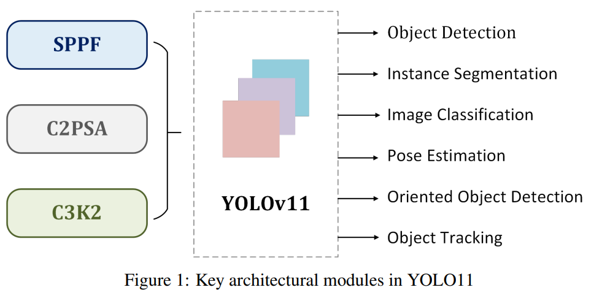

  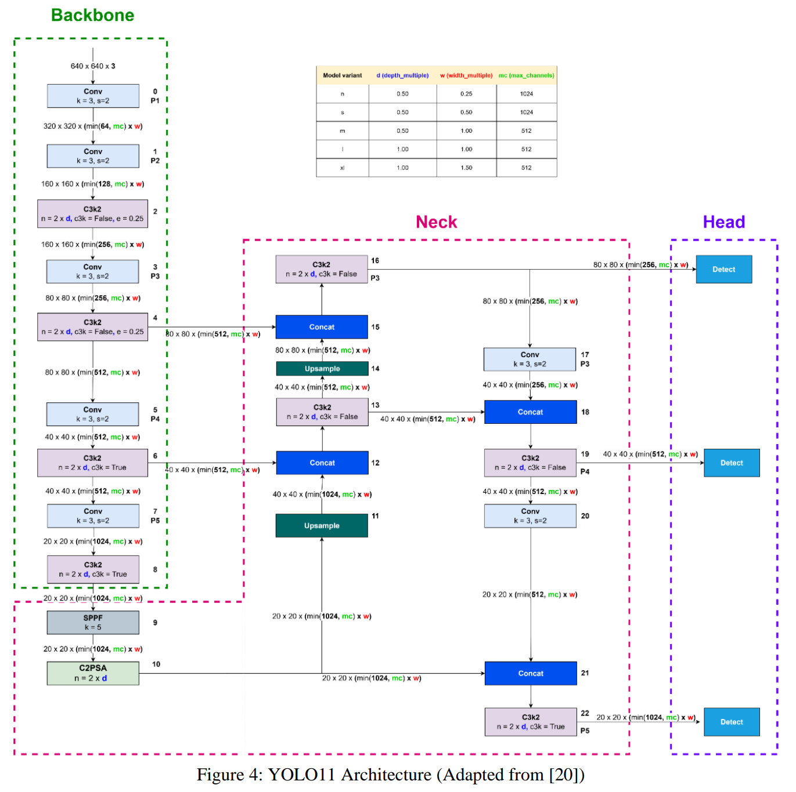

  - Core Mechanism
    - C3k2
    - C2PSA


## YOLOv12

- __YOLOv12: Attention-Centric Real-Time Object Detectors.__ *Yunjie Tian et al.* __ArXiv, 2025__ [(Arxiv)](https://arxiv.org/abs/2502.12524) [(S2)](https://www.semanticscholar.org/paper/ae1d5360f2f556139cffd10d6e9d2e0241c937e0) [(Code)](https://github.com/sunsmarterjie/yolov12) (Citations __609__)

  - Takeaway:

    YOLOv12 is an attention-centric real-time detector that tries to keep YOLO-style speed while shifting the backbone and neck toward efficient attention. Its main result is a better latency-accuracy trade-off than YOLOv10, YOLO11, and several RT-DETR variants at comparable scales.

    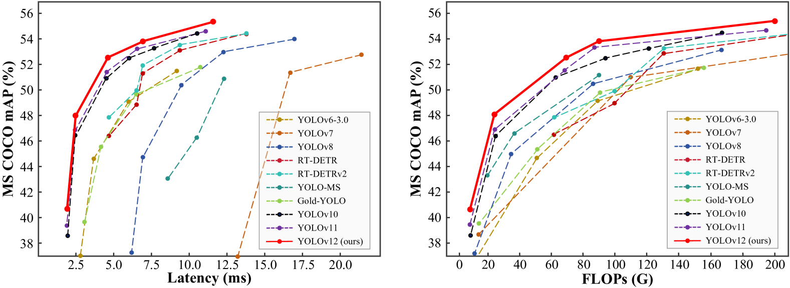

  - Motivation:

    Earlier YOLO variants mostly stayed CNN-centric because vanilla self-attention is expensive: token interactions scale quadratically with sequence length and often have worse memory behavior than convolutions. YOLOv12 is motivated by a narrower question: can attention be integrated into YOLO in a way that still preserves real-time deployment characteristics?

  - Core Mechanism:

    - Area Attention (A2): instead of full global attention, YOLOv12 partitions features into a few(L) large horizontal or vertical areas and performs attention inside those areas. This cuts attention cost while keeping a larger receptive field than many small-window schemes.

      > [!NOTE]
      >
      > This is the paper's starting point: attention is more expressive, and its quadratic scaling is the main barrier to real-time detection.

      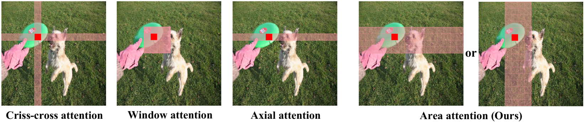

      Under the default area partition setting(L == 4), the paper states the attention computation is reduced from:

      $$
      2 n^2 h d \;\rightarrow\; \frac{1}{2} n^2 h d
      $$

      where $n$ is the token count per direction, $h$ is the head count, and $d$ is the head dimension. The reduction comes from replacing full pairwise interactions with area-based interactions.

    - R-ELAN: YOLOv12 redesigns the ELAN-style aggregation block with residual scaling and a cleaner aggregation path, because naive attention plus standard ELAN becomes unstable for larger detector scales.

      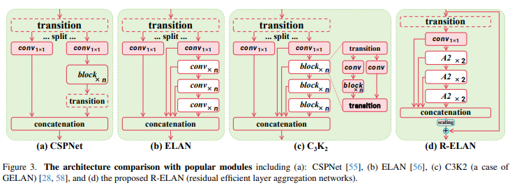

      - Motivation

        Efficient layer aggregation networks (ELAN) can introduce **instability**. We argue that such a design causes gradient blocking and lacks residual connections from input to output.而且还围绕注意力机制构建网络，都会导致网络不稳定。

    - YOLO-specific attention cleanup: the paper also makes several pragmatic choices so attention behaves well in detector codepaths, including FlashAttention, no positional encoding, a smaller MLP ratio, `Conv2d + BN` instead of `Linear + LN`, and a `7x7` depthwise separable position perceiver.

  - Pipeline:
  
    1. Resize the input image and pass it through a hierarchical YOLO-style backbone.
    2. Keep the first two backbone stages from YOLOv11, then replace later stages with attention-centric blocks built around A2 and R-ELAN.
    3. Aggregate multi-scale features in the neck using the same efficient attention design philosophy.
    4. Feed the resulting feature pyramid into a standard YOLO multi-scale detection head for box and class prediction.
    5. Train and evaluate on COCO; the paper positions YOLOv12 mainly as an architecture improvement rather than a new loss-design paper.

  - Pros:
  
    - Pushes YOLO toward attention-centric design without giving up the real-time regime.
    - Reports strong latency-accuracy trade-offs across N/S/M/L/X model scales.
    - Uses relatively simple engineering choices instead of introducing a heavy new assignment or loss pipeline.
    - Shows attention can outperform strong CNN-based YOLO baselines and RT-DETR-style competitors when tuned for detector efficiency.

  - Cons:
  
    - The method is still resolution-sensitive because attention cost grows with token count.
    - Area attention is an efficiency trade-off, so it does not preserve full global attention.
    - The paper is more architecture/system design than mathematical novelty, so there is limited new theory or loss design to study.
    - Larger attention-based variants required extra stabilization work such as R-ELAN and residual scaling.
  
- __YOLO-World: Real-Time Open-Vocabulary Object Detection.__ *Tianheng Cheng et al.* __2024 IEEE/CVF Conference on Computer Vision and Pattern Recognition (CVPR), 2024__ [(Arxiv)](https://arxiv.org/abs/2401.17270) [(S2)](https://www.semanticscholar.org/paper/37c112454a236ab91c9c6b5cc165a6c3251e9206) (Citations __698__)

## YOLOv13

__YOLOv13: Real-Time Object Detection with Hypergraph-Enhanced Adaptive Visual Perception.__ *Mengqi Lei et al.* __arXiv, 2025__ [(Arxiv)](https://arxiv.org/abs/2506.17733) [(Code)](https://github.com/iMoonLab/yolov13)

- Takeaway

- Motivation

  yolo早期依赖卷积，v12只是区域自注意力，缺乏跨尺度、跨位置的高阶关联

  Area-based self-attention mechanism introduced in YOLOv12 are limited to local information aggregation and pairwise correlation modeling, **lacking the capability to capture global multi-to-multi high-order correlations**

- Core Mechanism: HyperACE+FullPAD+轻量化DS系列模块

  - Architecture

    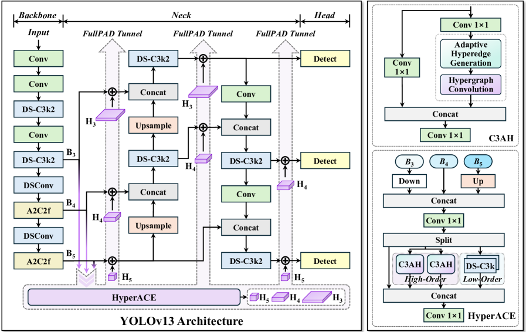

    > [!NOTE]
    >
    > The network architecture of our proposed YOLOv13 model(backbone+neck+head). Taking multi-scale features extracted from the backbone as input, HyperACE adaptively explores high-order correlations and achieves feature enhancement and fusion. Then, the correlation-enhanced features are distributed to the entire network by FullPAD tunnels to achieve accurate object detection in complex scenes. The detailed structure of HyperACE is shown on the right.

    >读懂每个部分
    >
    >- DS-C3k2: 将大核卷积替换为轻量级DS-C3k2
    >- DS-C3k
    >- A2C2f
    >- DSConv
    >- Adaptive Hyperedge Generation
    >- Hypergraph Convolution
    >- C3AH: 为什么这么设计
    >- HyperACE: 把来自 backbone 后三层的多尺度特征对齐并融合，然后分成三支。第一支做**全局高阶关系建模**，第二支做**局部低阶关系建模**，第三支保留**shortcut 原始信息**
    >- FullPAD Tunnel

  - Hypergraph-based Adaptive Correlation Enhancement (HyperACE) mechanism

    HyperACE 将多尺度特征图中的像素作为顶点，并采用可学习的超边构造模块，以自适应地探索顶点间的高阶相关性

    > [!NOTE]
    >
    > 这里介绍一下超图，普通图只能描述“两两关系”，超图中的每个超边连接多个顶点，从而能够建模多个顶点之间的相关性
    >
    > - 普通图：
    >
    >   - What: 普通图里有顶点 vertex/边 edge
    >
    >     一条边只能连接两个顶点。如果我们写一个普通图
    >     $$
    >     G=(V,E)
    >     $$
    >     其中
    >
    >     - $V=\{v_1,v_2,\dots,v_n\}$ 是顶点集合
    >     - $E\subseteq V\times V$ 是边集合
    >
    >     那么一条边通常写成
    >     $$
    >     e_{ij}=(v_i,v_j)
    >     $$
    >     这表示 $v_i$ 和 $v_j$ 有关系。
    >
    >   - Cons:问题在于，现实里很多关系天然不是二元的。eg: 一整条道路区域里的很多像素共同属于“道路”。如果用普通图表示，就得把这组点两两连边，这样会带来两个问题：
    >
    >     1. 关系被拆碎了。本来是“这几个点共同属于一个整体关系”，结果变成很多条 pairwise 边
    >     2. 表达会失真。两两连边不等于真正建模了“群体关系”
    >
    > 为了解决这样的问题，我们就需要超图了：
    >
    > - 超图：
    >
    >   - What:
    >
    >     超图 hypergraph 写作
    >     $$
    >     \mathcal{G}=(V,\mathcal{E})
    >     $$
    >     其中
    >
    >     - $V=\{v_1,v_2,\dots,v_n\}$ 还是顶点集合
    >     - $\mathcal{E}=\{e_1,e_2,\dots,e_m\}$ 是**超边集合**
    >
    >     普通图里一条边连接两个点。超图里一条超边 $e$ 可以连接**任意多个点**：
    >     $$
    >     e \subseteq V
    >     $$
    >     例如
    >     $$
    >     e_1=\{v_1,v_3,v_7,v_8\}
    >     $$
    >     表示 $v_1,v_3,v_7,v_8$ 被同一个高阶关系连在一起。
    >
    >     超图最常见的数学表示，不是邻接矩阵，而是**关联矩阵** incidence matrix
    >
    >     设有 $n$ 个顶点，$m$ 条超边。
    >      定义关联矩阵 $H\in\mathbb{R}^{n\times m}$：
    >     $$
    >     H(v,e)=
    >     \begin{cases}
    >     1, & \text{如果顶点 } v \in e \\
    >     0, & \text{否则}
    >     \end{cases}
    >     $$
    >     也可以是加权形式，不一定非要 0 和 1。
    >
    >     举个例子。
    >      如果有 4 个顶点
    >     $$
    >     V=\{v_1,v_2,v_3,v_4\}
    >     $$
    >     两条超边
    >     $$
    >     e_1=\{v_1,v_2,v_3\},\qquad e_2=\{v_2,v_4\}
    >     $$
    >     那么关联矩阵就是
    >     $$
    >     H=
    >     \begin{bmatrix}
    >     1 & 0\\
    >     1 & 1\\
    >     1 & 0\\
    >     0 & 1
    >     \end{bmatrix}
    >     $$
    >     然后我们来看看顶点度和超边度
    >
    >     - 顶点度
    >
    >       顶点 $v_i$ 的度，表示它参与了多少条超边。若超边有权重 $w(e)$，则
    >       $$
    >       d(v_i)=\sum_{e\in\mathcal{E}} w(e)\, H(v_i,e)
    >       $$
    >       如果都是 1 权重，那就是“这个点被多少条超边包含”。
    >
    >       把所有顶点度写成对角矩阵：
    >       $$
    >       D_v=\mathrm{diag}(d(v_1),d(v_2),\dots,d(v_n))
    >       $$
    >
    >     - 超边度
    >
    >       超边 $e_j$ 的度，表示它包含多少个顶点：
    >       $$
    >       \delta(e_j)=\sum_{v\in V} H(v,e_j)
    >       $$
    >       把所有超边度写成对角矩阵：
    >       $$
    >       D_e=\mathrm{diag}(\delta(e_1),\delta(e_2),\dots,\delta(e_m))
    >       $$
    >
    >   - How
    >
    >     这里介绍超图如何进行信息传播
    >
    >     其实很直观：顶点先把信息传给超边，超边再把信息传回顶点
    >
    >     设顶点特征矩阵为
    >     $$
    >     X\in\mathbb{R}^{n\times d}
    >     $$
    >     其中每个顶点有 $d$ 维特征。
    >
    >     先是顶点到超边，把属于同一条超边的顶点特征聚合起来：
    >     $$
    >     E = D_e^{-1}H^T X
    >     $$
    >     这里
    >
    >     - $H^T X$ 的意思是，把每条超边包含的顶点特征加总
    >     - 再乘 $D_e^{-1}$ 是做平均或归一化
    >
    >     所以 $E\in\mathbb{R}^{m\times d}$ 表示每条超边的特征
    >
    >     再是超边到顶点，每个顶点再从它所属的超边那里接收信息：
    >     $$
    >     X' = D_v^{-1} H W E
    >     $$
    >     把上一步 $E$ 代进去：
    >     $$
    >     X' = D_v^{-1} H W D_e^{-1} H^T X
    >     $$
    >
    >     - W是给不同超边分配的不同权重
    >
    >     这就是最经典的超图传播公式之一。
    >
    >     它特别像普通图里的邻接传播：
    >     $$
    >     X' = AX
    >     $$
    >     但这里的传播不是直接点到点，而是**点 $\rightarrow$ 超边 $\rightarrow$ 点**，所以它天然能把高阶关系编码进去。
    >
    >     很多 Hypergraph Neural Network 的基本形式，都围绕下面这个式子：
    >     $$
    >     X^{(l+1)} = \sigma\!\left( D_v^{-1/2} H W D_e^{-1} H^T D_v^{-1/2} X^{(l)} \Theta^{(l)} \right)
    >     $$
    >     这就是超图神经网络里非常经典的一层
    >
    >     - $D_v^{-1/2}$前后夹着，对顶点度做对称归一化
    >
    >     - $\Theta^{(l)}$ 可学习参数矩阵，作用和普通 GCN 里的线性变换一样：
    >       $$
    >       X^{(l)}\Theta^{(l)}
    >       $$
    >       就是先把每个点的特征投影到新空间
    >
    >     本质上就是：**线性变换后的顶点特征，先在超边里聚合，再回到顶点，同时做各种归一化和权重控制**
    >
    >     那么在DL中到底怎么构造超边呢，常见三种方法
    >
    >     1. 人工规则构造，eg
    >
    >        - 同一类别的节点进同一超边
    >        - 空间上相近的一组 patch 进同一超边
    >        - 同一尺度的一组候选框进同一超边
    >
    >     2. 基于相似性构造
    >
    >        先算特征相似度，再把相似的一组节点放进一个超边
    >
    >     3. 可学习构造
    >
    >        谁做了这个工作。模型自己学习“哪些节点应该属于同一条超边”
    >
    > - Pro: 超图建模多像素高阶相关性对于视觉任务（包括物体检测）具有必要性和有效性，实现更强的跨位置、跨尺度特征融合
    > - Motivation: 现有方法仅通过手动设置阈值参数值来判断像素是否基于像素特征距离相关，即特征距离低于特定阈值的像素被视为相关。这样的手动设置非常不好

    下面我们来看看yolov13中对超图的代码实现

    ~~~python
    class AdaHyperedgeGen(nn.Module):
        ```生成超图里的超边归属关系``` 
        def __init__(self, node_dim, num_hyperedges=64, num_heads=4, dropout=0.1, context="both"):
            super().__init__()
            self.node_dim = node_dim # 记录每个 token 的特征维度
            self.num_hyperedges = num_hyperedges # 规定要生成多少条超边。可以把它理解成“关系簇”的数量
            self.num_heads = num_heads # 做多头关系计算，思路类似多头注意力
            self.head_dim = node_dim // num_heads # 每个 head 分到多少维度
            self.context = context # 指定用什么全局上下文生成动态超边原型。这里支持 mean、max、both
    
            self.prototype_base = nn.Parameter(torch.Tensor(num_hyperedges, node_dim)) # 可学习的基础超边原型表
            nn.init.xavier_uniform_(self.prototype_base)
    
            if context in ("mean", "max"):
                self.context_net = nn.Linear(node_dim, num_hyperedges * node_dim)
            elif context == "both":
                self.context_net = nn.Linear(2 * node_dim, num_hyperedges * node_dim)
    
            self.pre_head_proj = nn.Linear(node_dim, node_dim) # 在分多头之前，先做一次线性投影，让 token 特征更适合后续相似度计算
            self.dropout = nn.Dropout(dropout)
            self.scaling = math.sqrt(self.head_dim) # 和注意力一样，用缩放因子稳定点积大小
    
        def forward(self, X):
            B, N, D = X.shape
            avg_context = X.mean(dim=1)
            max_context, _ = X.max(dim=1)
            # 把均值和最大值拼起来。这样每张图的全局语义描述更强
            context_cat = torch.cat([avg_context, max_context], dim=-1)
    
            prototype_offsets = self.context_net(context_cat).view(B, self.num_hyperedges, D)
            prototypes = self.prototype_base.unsqueeze(0) + prototype_offsets
    
            X_proj = self.pre_head_proj(X)
            X_heads = X_proj.view(B, N, self.num_heads, self.head_dim).transpose(1, 2)
            proto_heads = prototypes.view(B, self.num_hyperedges, self.num_heads, self.head_dim).permute(0, 2, 1, 3)
    
            logits = torch.bmm(
                X_heads.reshape(B * self.num_heads, N, self.head_dim),
                proto_heads.reshape(B * self.num_heads, self.num_hyperedges, self.head_dim).transpose(1, 2)
            ) / self.scaling
    
            logits = logits.view(B, self.num_heads, N, self.num_hyperedges).mean(dim=1)
            logits = self.dropout(logits)
            return F.softmax(logits, dim=1)
    ~~~
  
    ~~~python
    class AdaHGConv(nn.Module):
        ```HyperACE 里的超图消息传递```
        def __init__(self, embed_dim, num_hyperedges=64, num_heads=4, dropout=0.1, context="both"):
            super().__init__()
            self.edge_generator = AdaHyperedgeGen(embed_dim, num_hyperedges, num_heads, dropout, context)
            self.edge_proj = nn.Sequential(nn.Linear(embed_dim, embed_dim), nn.GELU())
            self.node_proj = nn.Sequential(nn.Linear(embed_dim, embed_dim), nn.GELU())
    
        def forward(self, X):
            # 得到超边的关联矩阵
            A = self.edge_generator(X)
            # 超边特征 = 属于该超边的所有节点的加权汇总
            He = torch.bmm(A.transpose(1, 2), X)
            # 给超边特征做非线性变换
            He = self.edge_proj(He)
            # 把超边特征传播回节点
            X_new = torch.bmm(A, He)
            X_new = self.node_proj(X_new)
            return X_new + X
    ~~~
  
    ~~~python
    class AdaHGComputation(nn.Module):
        ```把二维特征图变成超图 token，再变回来```
        def __init__(self, embed_dim, num_hyperedges=64, num_heads=4, dropout=0.1, context="both"):
            super().__init__()
            self.hgnn = AdaHGConv(embed_dim, num_hyperedges, num_heads, dropout, context)
    
        def forward(self, x):
            B, C, H, W = x.shape
            tokens = x.flatten(2).transpose(1, 2)
            tokens = self.hgnn(tokens)
            x_out = tokens.transpose(1, 2).view(B, C, H, W)
            return x_out
    ~~~
  
    - C3AH: 把超图塞进C3风格结构
  
      ```python
      class C3AH(nn.Module):
          def __init__(self, c1, c2, e=1.0, num_hyperedges=64, context="both"):
              super().__init__()
              c_ = int(c2 * e)
              assert c_ % 16 == 0
              num_heads = c_ // 16
      
              self.cv1 = Conv(c1, c_, 1, 1)
              self.cv2 = Conv(c1, c_, 1, 1)
              self.m = AdaHGComputation(
                  embed_dim=c_,
                  num_hyperedges=num_hyperedges,
                  num_heads=num_heads,
                  dropout=0.1,
                  context=context,
              )
              self.cv3 = Conv(2 * c_, c2, 1)
      
          def forward(self, x):
              return self.cv3(torch.cat((self.m(self.cv1(x)), self.cv2(x)), 1))
      ```
  
    - HyperACE
  
      ```python
      class HyperACE(nn.Module):
          def __init__(self, c1, c2, n=1, dsc3k=False, channel_adjust=False, e1=0.5, e2=1, num_hyperedges=64, context="both"):
              super().__init__()
              self.c = int(c2 * e1)
              self.cv1 = Conv(c1, 3 * self.c, 1, 1)
              self.cv2 = Conv((4 + n) * self.c, c2, 1)
              self.m = nn.ModuleList(
                  DSC3k(self.c, self.c, 2, shortcut=True) if dsc3k else DSBottleneck(self.c, self.c, shortcut=True)
                  for _ in range(n)
              )
              self.fuse = FuseModule(c1, channel_adjust)
              self.branch1 = C3AH(self.c, self.c, e2, num_hyperedges, context)
              self.branch2 = C3AH(self.c, self.c, e2, num_hyperedges, context)
      
          def forward(self, X):
              x = self.fuse(X)
              y = list(self.cv1(x).chunk(3, 1))
              out1 = self.branch1(y[1])
              out2 = self.branch2(y[1])
              y.extend(m(y[-1]) for m in self.m)
              y[1] = out1
              y.append(out2)
              return self.cv2(torch.cat(y, 1))
      ```
  
    - a Full-Pipeline Aggregation-and-Distribution (FullPAD) paradigm based on HyperACE
  
      - Motivation: 如果只有一个强模块塞在某一层，信息增强往往是局部的
  
      FullPAD不是只在单个阶段做特征增强，而是把 HyperACE 处理过的相关性增强特征，通过三条通道分发到：
  
      1. backbone 和 neck 的连接处
      2. neck 的内部层
      3. neck 和 head 的连接处
  
      ```python
      class FullPAD_Tunnel(nn.Module):
          def __init__(self):
              super().__init__()
              self.gate = nn.Parameter(torch.tensor(0.0))
      
          def forward(self, x):
              out = x[0] + self.gate * x[1]
              return out
      ```
  
      这里还有个门控机制，因为训练刚开始时，额外注入的增强信息几乎不起作用，系统更稳定
  
    - 轻量化 DS 系列模块：FullPAD会增加一些开销，又用这些DS block把开销压下去
  

## YOLOv26

- Motivation

  **edge and low-power devices** 导向: 真实部署里会碰到一堆麻烦，比如导出不顺、后处理复杂、NMS 带来额外延迟、DFL 让某些硬件或推理框架兼容性变差。所以想要把这些阻碍拿掉，使其更适合端测部署

- Core Mechanism：End-to-End NMS-Free, DFL removal

  - Architecture

    

  - DFL removal

    - Motivation: DFL 虽然有效，但常常让导出变复杂，也限制硬件兼容性。所以 YOLO26 直接去掉了 DFL，以换取更简洁的推理与更广的边缘设备支持

    ```python
    self.reg_max = reg_max
    self.no = nc + self.reg_max * 4
    self.cv2 = nn.ModuleList(
        nn.Sequential(Conv(x, c2, 3), Conv(c2, c2, 3), nn.Conv2d(c2, 4 * self.reg_max, 1))
        for x in ch
    )
    # 直接变成恒等映射
    self.dfl = DFL(self.reg_max) if self.reg_max > 1 else nn.Identity()
    ```
  
  - End-to-End NMS-Free: YOLO26 is a native end-to-end model. 

    > [!NOTE]
    >
    > How to achieve???
  
    yolov26当前实现里同时保留了 one-to-many 和 one-to-one 两种训练头，用于不同的监督方式（如果开启端到端，两种会一起运行）
  
    Detect头定义
  
    ```python
    self.end2end = end2end
    if end2end:
        self.one2one_cv2 = copy.deepcopy(self.cv2)
        self.one2one_cv3 = copy.deepcopy(self.cv3)
    ```
  
    Detect 头前向传播
  
    ```py
    preds = self.forward_head(x, **self.one2many)
    if self.end2end:
        x_detach = [xi.detach() for xi in x]
        one2one = self.forward_head(x_detach, **self.one2one)
        preds = {"one2many": preds, "one2one": one2one}
    
    if self.training:
        return preds
    # 推理阶段只取 one-to-one 结果做解码
    y = self._inference(preds["one2one"] if self.end2end else preds)
    if self.end2end:
        y = self.postprocess(y.permute(0, 2, 1))
    return y if self.export else (y, preds)
    ```
  
    后处理为什么不用NMS：scores and conf直接取topk
  
    ```python
    @staticmethod
    def postprocess(preds: torch.Tensor, max_det: int, nc: int = 80):
        boxes, scores = preds.split([4, nc], dim=-1)
        scores, conf, idx = Detect.get_topk_index(scores, max_det)
        boxes = boxes.gather(dim=1, index=idx.repeat(1, 1, 4))
        return torch.cat([boxes, scores, conf], dim=-1)
    ```
  
  - ProgLoss + STAL
  
    Improved loss functions increase detection accuracy, with notable improvements in **small-object recognition**
  
    ```python
    def init_criterion(self):
        return E2ELoss(self) if getattr(self, "end2end", False) else v8DetectionLoss(self)
    ```
  
    > [!TIP]
    >
    > 什么是V8检测头
  
    Then dive into E2ELoss
  
    > [!NOTE]
    >
    > 有两套loss，让one2many loss的权重逐渐衰减。
    >
    > Progloss stands for progressive loss.渐进式体现在训练初期更依赖 one-to-many 的密集监督，让优化更稳定。训练后期逐渐把重心转向 one-to-one，更贴近端到端推理目标
  
    ```python
    class E2ELoss:
        def __init__(self, model, loss_fn=v8DetectionLoss):
            self.one2many = loss_fn(model, tal_topk=10)
            self.one2one = loss_fn(model, tal_topk=7, tal_topk2=1)
            self.updates = 0
            self.total = 1.0
            self.o2m = 0.8
            self.o2o = self.total - self.o2m
            self.o2m_copy = self.o2m
            self.final_o2m = 0.1
    
        def __call__(self, preds, batch):
            loss_one2many = self.one2many(preds["one2many"], batch)
            loss_one2one = self.one2one(preds["one2one"], batch)
            return loss_one2many[0] * self.o2m + loss_one2one[0] * self.o2o, loss_one2one[1]
    	
        def update(self):
            self.updates += 1
            self.o2m = self.decay(self.updates)
            self.o2o = self.total - self.o2m
    ```
  
    STAL stands for ?
  
    > [!NOTE]
    >
    > STAL 会特别照顾小目标，比如对小于 8 像素的目标保证最少若干个 anchor assignment
  
    ```python
    gt_bboxes_xywh = xyxy2xywh(gt_bboxes)
    wh_mask = gt_bboxes_xywh[..., 2:] < self.stride[0]
    gt_bboxes_xywh[..., 2:] = torch.where(
        (wh_mask * mask_gt).bool(),
        torch.tensor(self.stride_val, device=gt_bboxes.device, dtype=gt_bboxes.dtype),
        gt_bboxes_xywh[..., 2:],
    )
    gt_bboxes = xywh2xyxy(gt_bboxes_xywh)
    ```
  
    `gt_bboxes_xywh[..., 2:] = torch.where(...)`对这些过小的目标，强行把宽高至少提升到 `stride_val`。过小目标如果按原尺寸做正样本选择，容易谁都分不到，或者分得太少。所以直接先把小框“托底”到一个更容易命中的尺寸，再做候选点筛选，实现“小目标感知分配”。
  
  - MuSGD Optimizer: combine SGD with Muon(Inspired by Moonshot AI's [Kimi K2](https://www.kimi.com/)) enabling more stable training and faster convergence.
  
    下面来详细看看代码的实现：参数分组，
  
    ```python
    use_muon = name == "MuSGD"
    # 二维及以上的参数，比如卷积核、线性层权重，进入 Muon 风格更新组
    if param.ndim >= 2 and use_muon:
        g[3][fullname] = param
        # 偏置项单独分组
    elif "bias" in fullname:
        g[2][fullname] = param
        # BN 参数、温度参数单独分组
    elif isinstance(module, bn) or "logit_scale" in fullname:
        g[1][fullname] = param
    else:
        g[0][fullname] = param
    ```
  
    ```python
    def muon_update(grad, momentum, beta=0.95, nesterov=True):
        # 用线性插值更新动量缓冲
        momentum.lerp_(grad, 1 - beta)
        # 启用 Nesterov，就把当前梯度与动量混合
        update = grad.lerp(momentum, beta) if nesterov else momentum
        if update.ndim == 4:
            update = update.view(len(update), -1)
        # 对更新矩阵做 Newton-Schulz 形式的零幂归一化处理
        update = zeropower_via_newtonschulz5(update)
        update *= max(1, grad.size(-2) / grad.size(-1)) ** 0.5
        return update
    ```
  
    MUSGD.step
  
    ```python
    update = muon_update(grad, state["momentum_buffer"], group["momentum"], group["nesterov"])
    p.add_(update.reshape(p.shape), alpha=-(lr * self.muon))
    
    if group["weight_decay"] != 0:
        grad = grad.add(p, alpha=group["weight_decay"])
    
    state["momentum_buffer_SGD"].mul_(group["momentum"]).add_(grad)
    sgd_update = grad.add(state["momentum_buffer_SGD"], alpha=group["momentum"]) if group["nesterov"] else state["momentum_buffer_SGD"]
    p.add_(sgd_update, alpha=-(lr * self.sgd))
    ```
  
  - **Precision Pose Estimation**
    Integrates [Residual Log-Likelihood Estimation](https://arxiv.org/abs/2107.11291) (RLE) for more accurate keypoint localization and optimizes the decoding process for increased inference speed.
  
  - **Refined OBB Decoding**
    Introduces a specialized angle loss to improve detection accuracy for square-shaped objects and optimizes OBB decoding to resolve boundary discontinuity issues.
