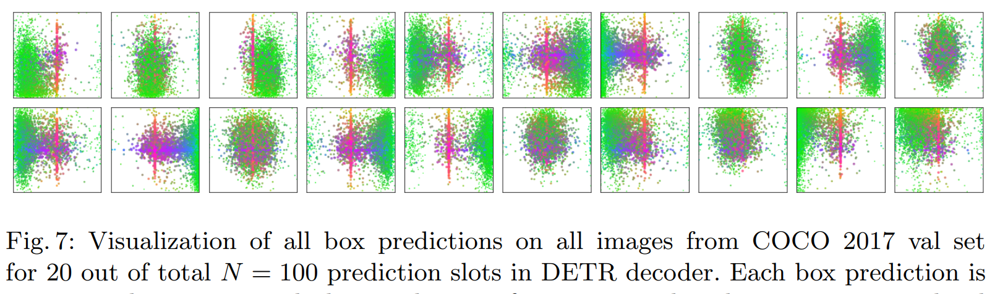
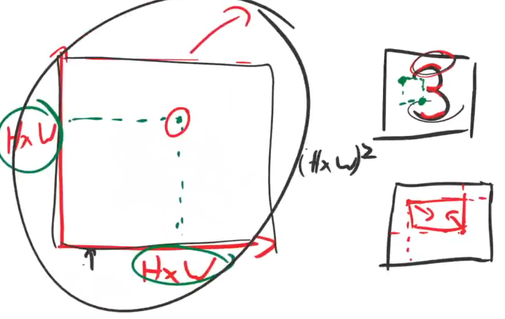
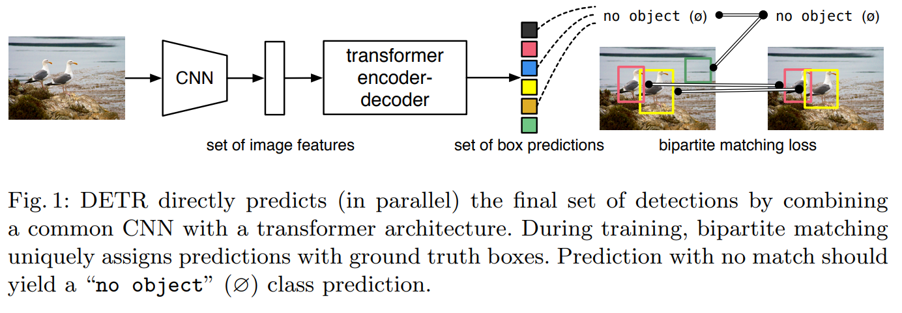
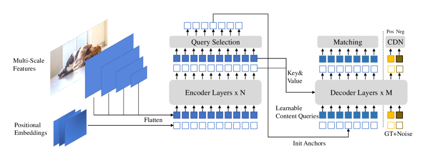

# DETR Zoo

## DETR

- __End-to-End Object Detection with Transformers.__ *Nicolas Carion et al.* __ArXiv, 2020__ [(Arxiv)](https://arxiv.org/abs/2005.12872) [(S2)](https://www.semanticscholar.org/paper/962dc29fdc3fbdc5930a10aba114050b82fe5a3e)([code_link](https://github.com/facebookresearch/detr)) (Citations __15847__) -- DETR

  - Takeaway: DETR treats detection as **set prediction** using a Transformer encoder-decoder and **bipartite matching** loss.

  - Motivation: Before DETR, mainstream detectors followed a **two-stage** or **dense prediction** paradigm. One-stage detector heavily relies on anchors and hyperparameters.

    And transformer has begun to sweep other domains other than objection detection.

  - Core Mechanism:

    

    - Object Queries (Learnable Embeddings) 替代生成anchor

      
  
      Begins as a ramdom vector(n,learnable) and take the encoder output as side input.
  
      > [!TIP]
      >
      > It seems like you trained n different people to ask different questions about the input image.
  
      > [!NOTE]
      >
      > 为什么需要这个query?
      >
      > 因为 decoder 不是自己凭空开始工作的，它需要一组初始“查询 token”。
      >
      > ```
      > tgt = torch.zeros_like(query_embed)
      > ```
      >
      > 这里：
      >
      > - tgt 是全 0 的初始 decoder 状态
      > - query_embed 提供的是 query 的身份信息 / 位置提示
      > - decoder 用它们去和 encoder 的图像特征做 attention
  
    - Encoder: quadratic:
  
      
  
      Let`s check why the encoder is useful for image detection. Now each point in the matrix connect two points in the $H\times W$ map and 2 points can define a bbox. Which means every element in the matrix stands for the information about different bboxes.
  
    - Set Prediction via Hungarian Matching 替代后处理nms
  
      DETR predicts **N object queries**, each responsible for one object.
       Ground truth objects and predicted queries are matched **one-to-one** using **Hungarian bipartite matching** with a cost composed of:

      - class probability $\sigma = \arg \min \sum L_{match}(y_i,y_{\sigma(i)})$
      - L1 box distance
      - GIoU loss
  
      This makes detections **order-invariant** and **unique**, removing NMS.
  
      > [!NOTE]
      >
      > 二分图匹配（Bipartite Matching）
      >
      > Sol: 匈牙利算法（Hungarian Algorithm）就是一个解决二分图最有匹配问题的经典算法
  
  - Pipeline:
  
    
  
    现在有上图大概知道整体结构框架，下面我们结合代码来深入探究每个部分的实现。这里我们用resnet50作为backbone，选取一张大小为`[H=800,W=1200]`的图片作为输入
  
    ```python
        model = DETR(
            backbone=backbone_with_pos,
            transformer=transformer,
            num_classes=91,
            num_queries=num_queries,
            aux_loss=False,
        )
    ```
  
    - backbone: `num_channel = 2048`
  
      - backbone: 选一个backbone（这里以resnet50作为参考）
  
        ```
        self.body = IntermediateLayerGetter(backbone, return_layers=return_layers) #用于提取中间特征曾
        xs = self.body(tensor_list.tensors)
        ```
  
        这里得到的xs是一个字典eg:
  
        ```
        {
        	"0": feature_map
        }
        ```
  
        然后再用一层字典封装:因为输出的xs只是特征图，后续detr还需要mask（对应featuremap的大小，使用F.interpolate放缩），因为重新构建了一个字典，下面代码中name是每个层的编号0,1，x是featuremap，看你需要哪些层提取出来变为新的NestedTensor
  
        ```python
                out: Dict[str, NestedTensor] = {}
                for name, x in xs.items():
                    m = tensor_list.mask
                    assert m is not None
                    mask = F.interpolate(m[None].float(), size=x.shape[-2:]).to(torch.bool)[0]
                    out[name] = NestedTensor(x, mask)
                return out
        ```
  
      - positional embedding: 正弦位置编码PositionEmbeddingSine，实现和transformer中的positional embedding差不多，而且泛化到了图像。
  
        > [!NOTE]
        >
        > 为什么用正弦和余弦：
        >   - 这样模型既能区分绝对位置，也更容易感知相对距离
        >
        >     $\sin(a + b), \cos(a + b)$可以用 $\sin(a), \cos(a)$ 线性表示，这说明位置差（relative position）可以通过线性变换得到
        >
        >   - 连续、平滑多尺度频率（multi-scale）不同维度用不同频率：
        >
        >     - 有的变化慢（捕捉长距离）高维 → 低频（变化慢）
        >     - 有的变化快（捕捉局部）低维 → 高频（变化快）
  
        ```python
        y_embed = not_mask.cumsum(1, dtype=torch.float32)
        x_embed = not_mask.cumsum(2, dtype=torch.float32)
        if self.normalize:
            eps = 1e-6
            y_embed = y_embed / (y_embed[:, -1:, :] + eps) * self.scale
            x_embed = x_embed / (x_embed[:, :, -1:] + eps) * self.scale
        ```
  
        x,y分别累计坐标，然后归一化到`[0,2*pi]`(scale默认为2*pi)
  
        > [!NOTE]
        >
        > 归一化的好处：
        >
        > - 不同大小的图，位置范围统一
        > - 后面喂给 sin/cos 更稳定
  
        频率项 dim_t：$\text{频率} \sim \frac{1}{\text{dim}_t}$
        $$
        \mathrm{dim}_t
        =
        \mathrm{temperature}^{\frac{2\left\lfloor t/2 \right\rfloor}{\text{num\_pos\_feats}}} 
        $$
  
        > [!note]
        >
        > 这里说明一下为什么要有$\lfloor t/2 \rfloor$:因为想让相邻两个通道共享同一个频率
        > $$
        > \mathrm{dim}_{2k} = \mathrm{dim}_{2k+1}
        > =
        > \mathrm{temperature}^{\frac{2k}{\text{num\_pos\_feats}}}
        > $$
        > 这样就能把同一频率分为一对$(\sin(\cdot), \cos(\cdot))$
        >
        > 那么为什么我们一定要sin + cos一起呢，只用sin不行吗？
        >
        > - 信息不完整（相位丢失）$\sin(\theta) = \sin(\pi - \theta)$,不同位置可能映射一样无法唯一确定位置
        >
        > - 用$(\sin(\theta), \cos(\theta))= e^{i\theta}$可唯一表示位置，$e^{i(\theta_1 - \theta_2)} = e^{i\theta_1} \cdot e^{-i\theta_2}$相对位置可以通过点积体现
  
        ```python
        dim_t = torch.arange(self.num_pos_feats, dtype=torch.float32, device=x.device) #
        dim_t = self.temperature ** (2 * (dim_t // 2) / self.num_pos_feats)
        ```
  
        > [!TIP]
        >
        > 默认：
        >
        > - temperature = 10000
        > - num_pos_feats = hidden_dim // 2
        >
        > 直觉上：
        >
        > - 小频率看“粗位置”
        > - 大频率看“细位置”
        > - 多种频率叠在一起，位置就能表示得更丰富
  
        把坐标除以不同频率，得到最后的位置编码
        $$
        PE(pos, 2i) = \sin\left(\frac{pos}{10000^{2i/d}}\right) \\
        PE(pos, 2i+1) = \cos\left(\frac{pos}{10000^{2i/d}}\right)
        $$
  
        ```
        pos_x = x_embed[:, :, :, None] / dim_t
        pos_y = y_embed[:, :, :, None] / dim_t
        交替使用 sin 和 cos
        pos_x = torch.stack((pos_x[:, :, :, 0::2].sin(), pos_x[:, :, :, 1::2].cos()), dim=4).flatten(3)
        pos_y = torch.stack((pos_y[:, :, :, 0::2].sin(), pos_y[:, :, :, 1::2].cos()), dim=4).flatten(3)
        ```
  
        最后输出`[B, 2 * num_pos_feats(128), H, W]`
  
      - jointer: combine backbone and position embedding
  
        - 输入：NestedTensor`[1,2048,25,38]`
  
          > [!NOTE]
          >
          > 这里`[1,2048,25,38]`是
          >
          > - 1：1 张图
          > - 2048：ResNet-50 最后一层 layer4 的通道数
          > - 25 x 38：原图 800 x 1200 经过 backbone 下采样后的空间大小
        
          - tensor_list.tensors：真正的图像 batch，形状通常是 [B, C, H, W]
          - tensor_list.mask：padding 区域标记，形状通常是 [B, H, W]
        
          如何得到的
        
        - 分别输入给backbone and positional embedding
        
        - 输出：`[features, pos(position embedding)]`
        
          实际上在后续的使用中pos_embedding就是直接加在了tensor上
        
          ```python
          def with_pos_embed(self, tensor, pos: Optional[Tensor]):
              return tensor if pos is None else tensor + pos
          ```
  
    - transformer: 
  
      ```
      transformer = Transformer(d_model=256, return_intermediate_dec=True)
      ```
  
      > [!TIP]
      >
      > d_model = 2*num_pos_feats=256
  
      ```python
      self.query_embed = nn.Embedding(num_queries, hidden_dim) # 本质上是一个可学习参数表，没有输入，当作被训练为查询不同信息的侦探
      self.input_proj = nn.Conv2d(backbone.num_channels, hidden_dim, kernel_size=1)
      # input_proj先经过一个 1x1 conv，把通道数从 2048 压成 256(transformer input)
      ```
  
      ```python
      hs = self.transformer(self.input_proj(src), mask, self.query_embed.weight, pos[-1])[0]
      ```
  
      > 具体结构见attention is all you need
  
      下面我们来看看transformer的具体结构
  
      ```python
      class Transformer(nn.Module):
      
          def __init__(self, d_model=512, nhead=8, num_encoder_layers=6,
                       num_decoder_layers=6, dim_feedforward=2048, dropout=0.1,
                       activation="relu", normalize_before=False,
                       return_intermediate_dec=False):
              super().__init__()
      
              encoder_layer = TransformerEncoderLayer(d_model, nhead, dim_feedforward,
                                                      dropout, activation, normalize_before)
              encoder_norm = nn.LayerNorm(d_model) if normalize_before else None
              self.encoder = TransformerEncoder(encoder_layer, num_encoder_layers, encoder_norm)
      
              decoder_layer = TransformerDecoderLayer(d_model, nhead, dim_feedforward,
                                                      dropout, activation, normalize_before)
              decoder_norm = nn.LayerNorm(d_model)
              self.decoder = TransformerDecoder(decoder_layer, num_decoder_layers, decoder_norm,
                                                return_intermediate=return_intermediate_dec)
      
              self._reset_parameters()
      
              self.d_model = d_model
              self.nhead = nhead
      
          def _reset_parameters(self):
              for p in self.parameters():
                  if p.dim() > 1:
                      nn.init.xavier_uniform_(p)
      
          def forward(self, src, mask, query_embed, pos_embed):
              # flatten NxCxHxW to HWxNxC
              bs, c, h, w = src.shape
              src = src.flatten(2).permute(2, 0, 1)
              pos_embed = pos_embed.flatten(2).permute(2, 0, 1)
              query_embed = query_embed.unsqueeze(1).repeat(1, bs, 1)
              mask = mask.flatten(1)
      
              tgt = torch.zeros_like(query_embed)
              memory = self.encoder(src, src_key_padding_mask=mask, pos=pos_embed)
              hs = self.decoder(tgt, memory, memory_key_padding_mask=mask,
                                pos=pos_embed, query_pos=query_embed)
              return hs.transpose(1, 2), memory.permute(1, 2, 0).view(bs, c, h, w)
      ```
  
      detr使用的transformer和原始transformer不一样的地方就在多了learned queries
  
      `self.query_embed.weight`
  
      > 直接取query_embed的权重，没有输入
  
      - 这是 DETR 里那 num_queries（默认100） 个 learned queries
  
        - shape 通常是：[num_queries, hidden_dim] = [100, 256]
        - 每个 query 都会在 decoder 里尝试负责一个目标
  
      最后transformer输出`hs=torch.Size([6, 1, 100, 256])`
  
      > [!NOTE]
      >
      > 我们来看看输出为什么是这个样子：`[layer_num,batch_size,num_queries,hidden_dim]`
  
    - class and bbox
  
      在得到transformer的输出后：
  
      ```
      self.class_embed = nn.Linear(hidden_dim, num_classes + 1)
      self.bbox_embed = MLP(hidden_dim, hidden_dim, 4, 3)
      
      outputs_class = self.class_embed(hs)
      outputs_coord = self.bbox_embed(hs).sigmoid()
      out = {'pred_logits': outputs_class[-1], 'pred_boxes': outputs_coord[-1]}
      # 只选decoder最后一层的输出最为最终输出
      ```
  
      所以最终每张图得到的是：
  
        - pred_logits.shape = [1, 100, num_classes + 1]
        - pred_boxes.shape = [1, 100, 4]
  
    上述只是介绍了推理阶段，现在我们来看看训练阶段因此我们主要来看看如何匹配和loss计算的
  
    在看这两个之前，如果是训练阶段
  
    ```
    if self.aux_loss:
          out['aux_outputs'] = self._set_aux_loss(outputs_class, outputs_coord)
    ```
  
    这里训练和推理第一次出现分叉：
    - 推理一般只看最终层 pred_logits、pred_boxes
    - 训练如果 aux_loss=True，还会额外用每个 decoder 中间层的输出算辅助损失
  
    > [!TIP]
    >
    > 训练过程不止看最终结果，还看过程草稿
  
    在类别`SetCriterion`中，主要先后做了两件事
  
    1. compute hungarian assignment between ground truth boxes and the outputs of the model -- 做匹配
  
       ```
       outputs_without_aux = {k: v for k, v in outputs.items() if k != 'aux_outputs'}
       
       # Retrieve the matching between the outputs of the last layer and the targets
       # 直接匈牙利算法做二分图匹配
       indices = self.matcher(outputs_without_aux, targets)
       # 归一化计算，避免不同batch中gt数量不一样的影响
       # Compute the average number of target boxes accross all nodes, for normalization purposes
       num_boxes = sum(len(t["labels"]) for t in targets)
       num_boxes = torch.as_tensor([num_boxes], dtype=torch.float, device=next(iter(outputs.values())).device)
       if is_dist_avail_and_initialized():
           torch.distributed.all_reduce(num_boxes)
       num_boxes = torch.clamp(num_boxes / get_world_size(), min=1).item()
       ```
  
       那么关键就是看matcher中是如何计算的：
  
       ```
       # Compute the classification cost. Contrary to the loss, we don't use the NLL,
       # but approximate it in 1 - proba[target class].
       # The 1 is a constant that doesn't change the matching, it can be ommitted.
       # 分类代价：预测这个 GT 类别的概率越大，代价越小
       cost_class = -out_prob[:, tgt_ids]
       
       # Compute the L1 cost between boxes
       cost_bbox = torch.cdist(out_bbox, tgt_bbox, p=1)
       
       # Compute the giou cost betwen boxes
       cost_giou = -generalized_box_iou(box_cxcywh_to_xyxy(out_bbox), box_cxcywh_to_xyxy(tgt_bbox))
       
       # Final cost matrix
       C = self.cost_bbox * cost_bbox + self.cost_class * cost_class + self.cost_giou * cost_giou
       # 真正使用匈牙利算法做匹配
       indices = [linear_sum_assignment(c[i]) for i, c in enumerate(C.split(sizes, -1))]
       ```
  
    2. supervise each pair of matched ground-truth / prediction (supervise class and box) -- 算loss
  
  - Pros
  
    fast, end-to-end
  
    > [!NOTE]
    >
    > RNNs for object detection were much slower and less effective, because they made predictions **sequentially rather than in parallel**.
  
  - Cons
  
    - slow convergence, hard to train
    - Weak Small-Object Performance
    - high computational cost


## Deformable DETR

- __Deformable DETR: Deformable Transformers for End-to-End Object Detection.__ *Xizhou Zhu et al.* __arXiv, 2020__ [(Arxiv)](https://arxiv.org/abs/2010.04159) [(Video)](https://www.bilibili.com/video/BV1GB4y1X72R/?spm_id_from=333.337.search-card.all.click&vd_source=3a8e3df5af30a81c441200ce3c96e8fc) [(Code)](https://github.com/fundamentalvision/Deformable-DETR) (Citations __6350__)

  - Takeaway: Deformable DETR replaces global dense attention with sparse, learnable **deformable attention** that focuses on a small set of key sampling points across multi-scale features, dramatically accelerating convergence and significantly improving small-object detection while preserving end-to-end training.

  - Motivation: slow convergence and limited feature spatial resolution and Global attention complexity: $\mathcal{O}(N^2)$ of DETR

    - Root causes: Global attention over full feature maps is inefficient and No effective multi-scale feature integration.

  - Core Mechanism

    

    1. Deformable Attention

       Instead of attending to **all spatial positions**, each query attends to a **small set of learned sampling points** around a reference point.

       Standard attention:
       $$
       \text{Attention}(Q,K,V) = \text{Softmax}\left(\frac{QK^T}{\sqrt{d}}\right)V
       $$
       Complexity:
       $$
       \mathcal{O}(HW \times HW)
       $$

       ------

       Deformable attention:
       $$
       \text{DeformAttn}(z_q, p_q, x) =
       \sum_{m=1}^{M}
       W_m
       \left[
       \sum_{k=1}^{K}
       A_{mqk} \cdot
       W'_m \, x\left(p_q + \Delta p_{mqk}\right)
       \right]
       $$

    2. Multi-Scale Deformable Attention

       Extends deformable attention to multiple feature levels:
       $$
       \text{MSDeformAttn}(z_q, \hat{p}_q) =
       \sum_{m=1}^{M}
       W_m
       \left[
       \sum_{l=1}^{L}
       \sum_{k=1}^{K}
       A_{mlqk} \cdot
       W'_m \, x_l(\phi_l(\hat{p}_q) + \Delta p_{mlqk})
       \right]
       $$
       

  - Pros:

    - faster convergence
    - Strong small-object performance.

  - Cons:

    - More complex implementation than vanilla DETR
    - CUDA custom ops required for efficiency

- __RT-DETRv2: Improved Baseline with Bag-of-Freebies for Real-Time Detection Transformer.__ *Wenyu Lv et al.* __ArXiv, 2024__ [(Arxiv)](https://arxiv.org/abs/2407.17140) [(S2)](https://www.semanticscholar.org/paper/1e030d91607e38b7b7fdd002123ca8baafbedc8f) [(Code)](https://github.com/lyuwenyu/RT-DETR?tab=readme-ov-file)(Citations __186__)

- __RT-DETRv4: Painlessly Furthering Real-Time Object Detection with Vision Foundation Models.__ *Zijun Liao et al.* __arXiv, 2025__ [(Arxiv)](https://arxiv.org/abs/2510.25257)

- __Dome-DETR: DETR with Density-Oriented Feature-Query Manipulation for Efficient Tiny Object Detection.__ *Zhangchi Hu et al.* __arXiv, 2025__ [(Arxiv)](https://arxiv.org/abs/2505.05741)

  - [check here](02-1-Small-Object.md)


## DINO

- **DINO: DETR with Improved DeNoising Anchor Boxes for End-to-End Object Detection**. Hao Zhang et.al. **arXiv**, **2022**, ([link](https://arxiv.org/abs/2203.03605)) [(Code)](https://github.com/IDEA-Research/DINO).

  - Takeaway:

    DINO(**D**ETR with **I**mproved de**N**oising anch**O**r boxes) makes DETR-style end-to-end detection much more practical by combining stronger denoising training, better decoder query initialization, and improved box refinement. It keeps the no-NMS end-to-end formulation while reaching strong COCO results and much faster convergence than earlier DETR variants.

    > [!TIP]
    >
    > transformer加自监督在视觉也很香

  - Motivation:

    Earlier DETR-family models still suffered from slow convergence, unstable matching early in training, and weak query semantics in the decoder.主要想要解决以下两点问题

    1. Previous DETR-like models are inferior to the improved classical detectors.
    2. The *scalability* of DETR-like models has not been well studied.

  - Core Mechanism:

    DINO combines ideas from `DAB-DETR`, `DN-DETR`, and `Deformable DETR`, then improves three critical pieces rather than proposing an entirely new detector family.

    - DETR num_queries 如何理解？

    - aux loss at each decoder layer? 是什么

    - fix_refpoints_hw ???

    - Architecture

      

      > Figure 2:The framework of our proposed DINO model. Our improvements are mainly in the Transformer encoder and decoder. The top-K encoder features in the last layer are selected to initialize the positional queries for the Transformer decoder, whereas the content queries are kept as learnable parameters. Our decoder also contains a Contrastive DeNoising (CDN) part with both positive and negative samples.

      作为类似 DESTR 的模型，DINO 包含骨干、多层变换器编码器、多层变压器解码器和多个预测头。遵循 DAB-DETR [[21](https://ar5iv.labs.arxiv.org/html/2203.03605?_immersive_translate_auto_translate=1#bib.bib21)]，我们将解码器中的查询表述为动态锚点框，并逐步在解码器层间细化。遵循 DN-DETR [[17](https://ar5iv.labs.arxiv.org/html/2203.03605?_immersive_translate_auto_translate=1#bib.bib17)]，我们在 Transformer 解码层中添加地面真实标签和带有噪声的框，以帮助训练时稳定双分匹配。我们还采用了可变形注意力 [[41](https://ar5iv.labs.arxiv.org/html/2203.03605?_immersive_translate_auto_translate=1#bib.bib41)] 以提高计算效率。此外，我们提出了以下三种新方法。首先，为了改善一一匹配，我们提出一种*对比去噪训练* ，通过同时添加同一真实的正样本和负样本。在将两种不同的噪声添加到同一个地面真实盒后，我们将带有较小噪声的框标记为正，另一个标记为负。对比去噪训练帮助模型避免同一目标的重复输出。其次，动态锚盒查询表述将类 DESTR 模型与经典两阶段模型连接起来。因此，我们提出了*一种混合查询选择*方法，以更好地初始化查询。我们从编码器的输出中选择初始锚点框作为位置查询，类似于 [[41](https://ar5iv.labs.arxiv.org/html/2203.03605?_immersive_translate_auto_translate=1#bib.bib41)， [39](https://ar5iv.labs.arxiv.org/html/2203.03605?_immersive_translate_auto_translate=1#bib.bib39)]。 然而，我们保持内容查询的可学习性，鼓励第一层解码器专注于空间先验。第三，为了利用后期层细化后的盒状信息，帮助优化其相邻早期层的参数，我们提出了一种新的 *“前瞻两次* ”方案，用梯度修正更新后的参数。

    - Contrastive DeNoising (CDN): 

      

      - Prior：在介绍CDN前先介绍一下DN

        DN 就是 DeNoising，这里指“去噪训练”。
        - 核心思想是：把真实 GT 框和 GT 类别复制几份，故意加上一些扰动，再喂给 decoder，让模型学会把这些带噪声的输入恢复回正确目标

        query: 就是anchor，一般由两个部分组成

          - tgt：这个 query 的内容向量，负责“找什么”
          - refpoint_embed：这个 query 的参考位置/参考框，负责“去哪找”。decoder在这个基础上进行fine tune。有两种生成方法
            1. 单阶段：直接学习一个"reference embedding"
            2. 两阶段（默认）：先让 encoder 为所有空间位置生成 proposal，再按分类分数选 top-k proposal 作为 decoder 初始 reference boxes

        noise: 人为加到 GT 标签和 GT 框上的扰动，不是给图像加噪点

      - Motivation: DN在稳定训练和加速趋同方面非常有效，借助 DN 查询，它学会根据附近有 GT 框的锚点做出预测。然而，它缺乏预测附近无物体锚点“无物体”的能力，为解决这个问题，提出了一种对比去噪（CDN）方法来拒绝无用锚点

      - Core

        Instead of only reconstructing noisy ground-truth boxes, DINO creates both positive and negative denoising queries so the decoder learns which anchors should be pulled toward the target and which should be pushed away.

        > [!NOTE]
        >
        > noise是如何添加的？
        >
        > - label noise：把一部分真实类别随机改成别的类别
        > - box noise：把真实框的位置和大小随机扰动，并且负样本那一半的框扰动更大，所以更“难”
        >
        > 如何加入训练的呢？
        >
        > - 普通 query：负责正常检测，最后还要走 Hungarian matching。
        >
        > - DN/CDN query：由 GT 直接构造，带噪声，但监督更直接。
        >
        > 两者一起送进transformer但不会互相乱看，因为有专门的 attn_mask 做隔离，输出后，DN 部分会被单独切出来计算 dn loss

      - Pro

        让训练早期更稳定、更快收敛，因为DETR最大的问题就是早期训练的query太弱

        实现机理：能够避免混淆，选择高质量的anchors(queries)来预测bbox，这种混淆来自两个方面

        1. 重复预测：多个anchor靠近同一个物体，难以决定选择哪个anchor
        2. 可能选择与gt较远的anchor

      还用了ATD(Average Top-K Distance) an anchor-quality metric to analyze why CDN improves matching behavior:

      $$
      \mathrm{ATD}(k)=\frac{1}{k}\sum \mathrm{topK}\left(\left\{\lVert b_0-a_0\rVert_1,\lVert b_1-a_1\rVert_1,\ldots,\lVert b_{N-1}-a_{N-1}\rVert_1\right\},k\right)
      $$

      Lower ATD means the matched anchors are closer to their target boxes, which the paper uses as supporting evidence that CDN improves optimization.用最差的k个

    - Mixed query selection: DINO initializes positional queries from top-K encoder outputs but keeps the content queries learnable, which gives stronger spatial priors without fully copying encoder content into the decoder.

      

      - b是deformable DETR提出的，获得位置和内容查询

        位置查询和内容查询均由所选特征的线性变换生成。此外，这些选定特征会被送入辅助检测头以获得预测框，用于初始化参考框

      - c是DINO提出的，仅增强位置查询，下面是原因

        由于所选功能是初步内容特征，未经过进一步细化，可能会对解码者产生歧义和误导。例如，选定的特征可能包含多个物体，或仅是物体的一部分。相比之下，我们的混合查询选择方法仅通过顶级 K 精选功能增强位置查询，保持内容查询的可学习性

    - Look forward twice: 

      

      > Comparison of box update in Deformable DETR and our method.

      我们先来理解一下每个参数是什么意思
      $$
      \Delta b_i = Layer_i(b_{i-1}),\quad b_i\prime = Update(b_{i-1},\Delta b_i) \\
      b_i = Detach(b_i\prime),\quad b_i^{(pred)} = Update(b_{i-1}\prime,\Delta b_i)
      $$

      b就是框，decoder 每层都会预测一个 box offset($\Delta b$)这个 offset 会加到当前 reference box 上，得到新框，再传给下一层继续 refine。这就形成了一个迭代逐层框精修过程。

      之前下一层decoder会使用这个更好的框，但是梯度不会传播回来，这是为了稳定训练。

      而DINO look forward twice只是一种 box regression 的梯度设计，让第 i 层的 box 分支不仅被第 i 层自己的 loss 更新，还额外受到第 i+1 层 loss 的影响：

      1. 保留之前的路径，给下一层 decoder 用的 reference，是 detached 的
      2. 给外层监督输出保存的 reference，不是 detached 的

      > [!NOTE]
      >
      > 为什么这样是有用的？
      >
      > 直觉上看早层的框比较粗，如果能用后层的细框监督会更好

  - Pipeline:

    这里讲述完整的工程实现和一些工程细节

    1. Feed the image into a backbone and build multi-scale features.

       输出得到的feat=[feature, mask], mask主要给 transformer 用，避免 attention 去看 padding 区域（因为输出图片尺寸不一致会被padding到相同尺寸，是当前 batch 里“经过数据增强后的图片”的最大尺寸，不是一个写死的全局固定值）

    2. Add CDN queries built from noisy positive and negative ground-truth boxes.

       生成额外的 denoising label query, box query 和 attention mask

    3. Use the transformer encoder to enhance those features and produce encoder proposals.

       - feature输入transformer encoder之前，还要把不同层特征统一投影到 transformer 需要的 hidden dim；如果配置的特征层数比 backbone 实际输出更多，还会继续下采样补额外层

    4. Select top-K encoder outputs for positional query initialization while keeping learnable content queries.

    5. Run the decoder with deformable attention and iterative box refinement.

    6. Output final class logits and refined boxes end-to-end, using standard classification plus `L1` and `GIoU` box losses.

  - Pros:

    - Greatly improves convergence relative to earlier DETR-style baselines.
    - Keeps the end-to-end detection pipeline without NMS.
    - Combines modular improvements that are well supported by ablations.
    - Scales well to stronger backbones and extra detection pretraining.

  - Cons:

    - The method is engineering-heavy, with gains coming from several coordinated tricks rather than one simple mechanism.
    - Best headline results depend on strong backbones and extra pretraining.
    - Multi-scale deformable attention and larger variants are still computationally heavy.
    - It is less conceptually minimal than vanilla DETR because it accumulates multiple training and refinement techniques.

- __DINO-X: A Unified Vision Model for Open-World Object Detection and Understanding.__ *Tianhe Ren et al.* __arXiv, 2024__ [(Arxiv)](https://arxiv.org/abs/2411.14347)

- __Grounding DINO: Marrying DINO with Grounded Pre-Training for Open-Set Object Detection.__ *Shilong Liu et al.* __arXiv, 2023__ [(Arxiv)](https://arxiv.org/abs/2303.05499) [(Code)](https://github.com/IDEA-Research/GroundingDINO)
