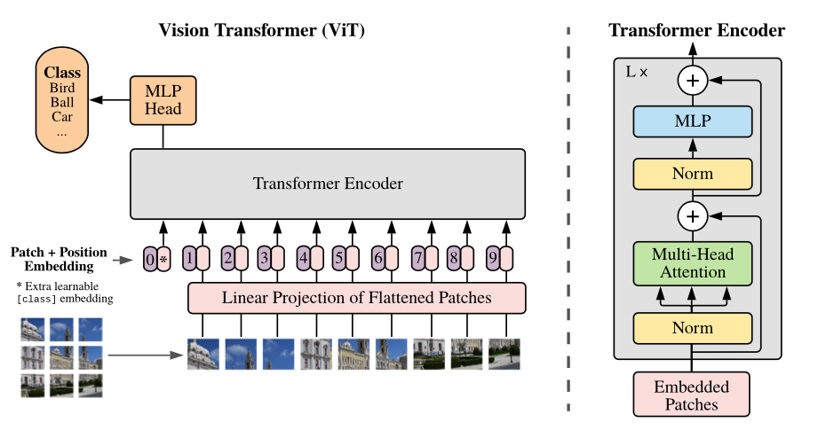
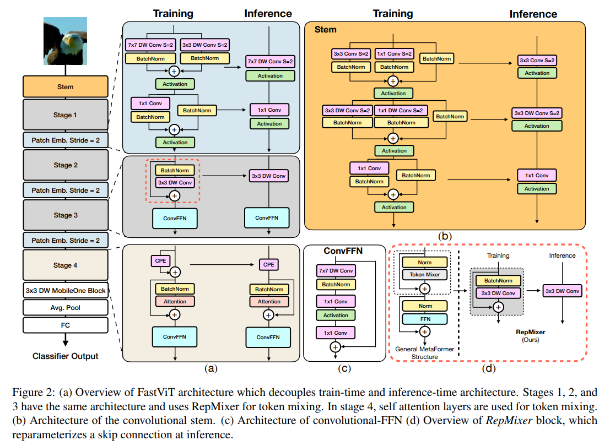
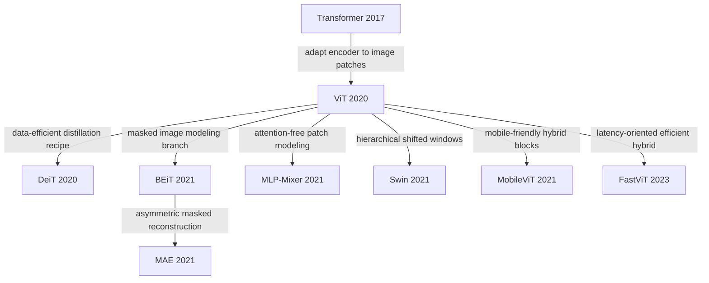

# ViT Zoo

Focus on Vision Transformer variants and their core design trade-offs.

[TOC]

## ViT

- **An Image is Worth 16x16 Words: Transformers for Image Recognition at Scale**. Alexey Dosovitskiy et.al. **arxiv**, **2020**, ([link](https://arxiv.org/abs/2010.11929)). ([My PDF](https://drive.google.com/file/d/1bosN8AC80PN7-CLeX2Ay0Pj1i_Lsyp_u/view?usp=drivesdk))

  - Takeaway: ViT directly splits an image into fixed-size patches, turns them into a token sequence, and applies a vanilla Transformer encoder for image classification. 顾名思义，一个image batch = 1 token

    > [!TIP]
    >
    > transformer 开始正式杀入 CV, 而且几乎没有引入 CV-specialized inductive bias。给CV挖了一个大坑
    >
    > 打破了nlp和CV模型不一致的问题，又给多模态挖了一个大坑

  - Motivation: CNN 的局部归纳偏置很强，而transformers没有这些归纳偏置（先验知识）
  
    - 平移不变性
    - 局部性
  
    为什么之前transformer没有用到CV，到底有什么难处？
  
    1. 需要把图片这个2d转换为1d的序列输入encoder
    2. 计算复杂度是$O(n^2)$，如果直接像素输入序列太长计算复杂度会爆炸
  
    但作者想验证一个更激进的问题: if we scale data and model size enough, can a pure Transformer also work for vision?
  
  - Core Mechanism:
  
    
  
    > [!NOTE]
    >
    > Figure 1: Model overview. We split an image into fixed-size patches, linearly embed each of them, add position embeddings, and feed the resulting sequence of vectors to a standard Transformer encoder. In order to perform classification, we use the standard approach of adding an extra learnable “classification token” to the sequence. The illustration of the Transformer encoder was inspired by Vaswani et al. (2017).
    >
    > 这里的`0*`就是对应的可学习的分类token（小白纸），位置始终在0,它可以和所有patch交互，因此最后分类直接看这一个的输出就可以了
  
    - Patchify + linear projection
  
      把输入图像切成固定大小的 patch, 每个 patch flatten 后映射到同一维度的 token embedding。然后拼接一个可学习的 `[CLS]` token, 再加位置编码:
  
      $$
      z_0 = [x_{\mathrm{cls}}; x_p^1E; x_p^2E; \dots; x_p^NE] + E_{\mathrm{pos}}
      $$
  
      这里 $N=HW/P^2$, 表示 patch 数量; $E$ 是 patch projection matrix。这样图像就被改写成标准 Transformer 可处理的 token sequence。
  
      > [!NOTE]
      >
      > 输入224\*224的图片，每个patch为16\*16，那么有14\*14=196个序列长度(BERT256)就变为可以接受的了
  
    - Standard Transformer encoder
  
      后续基本就是 vanilla encoder stack: LayerNorm + Multi-Head Self-Attention + MLP block + residual connection。核心收益是所有 patch 从第一层开始就能做 global interaction。
      
    - Position embedding
  
      原文还做了不同位置编码的实验：无编码/1-d/2-d/relative，结果就是没编码稍微差一点，有编码效果都差不多
  
  - Pipeline:
  
    1. Input image 切成 $P\times P$ patches.
  
       这里用224\*224举例，分为16\*16的patch，因此序列长度为14\*14=19
  
    2. Flatten each patch and linearly project to token embeddings.
  
       每个patch的维度是16\*16\*3=768，这个linearly project就是一个fc(768\*768(d_model，后面这个768是可以改变的，取决于你模型想要做多大))
  
    3. Prepend `[CLS]` token and add positional embeddings.
  
       得到197\*768
  
    4. Feed the full sequence into Transformer encoder layers.
  
       
  
       这里多头注意力,Vit-base用的12个头，因此k,q,v的维度是197\*64(768/12)
  
    5. Use the final `[CLS]` representation for classification.
  
  - Experiment
  
    
    
    可以看到Vit的随着数据集的扩大不断变强的能力
  
  - Pros
  
    - Global receptive field from the first layer.
    - Architecture is simple and highly scalable.
    - Became the base template for many later ViT variants.
  
  - Cons
  
    - Weak locality prior, so it is data-hungry.
    - Full attention has quadratic cost w.r.t. token number.
    - Plain single-scale design is not ideal for dense prediction.

## FastVit

- __FastViT: A Fast Hybrid Vision Transformer using Structural Reparameterization.__ *Pavan Kumar Anasosalu Vasu et al.* __arXiv, 2023__ [(Arxiv)](https://arxiv.org/abs/2303.14189) 

  > MobileOne 原班人马打造，可以看做是 MobileOne 的方法在 Transformer 上的一个改进型的应用

  - Takeaway: a hybrid vision transformer architecture that obtains the state-of-the-art latency-accuracy trade-off. 引入了一种新的 token mixer，叫做 RepMixer，它使用结构重新参数化技术，通过删除网络中的 Shortcut 来降低内存访问成本。效果也很好

  - Motivation: 很多 hybrid ViT 在 accuracy 上已经不错，但真实设备上的 latency 往往并不理想。论文的核心切入点不是只看 FLOPs，而是进一步关注 **memory access cost**: skip connection、branching 和 attention-like mixing 在移动端会带来真实时延开销，因此作者希望设计一个对 mobile inference 更友好的 hybrid backbone。

  - Core Mechanism

    - Architecture: FastViT 是一个 hybrid vision transformer，也就是混合式视觉 Transformer。作者把网络分成了四个 stage。前 3 个 stage 主要用 RepMixer 来做 token mixing，第 4 个 stage 才使用 self attention

      

      - 每个stage分辨率减半，通道数加倍

    - a new token mixer: RepMixer。它的目标不是像标准注意力那样做全局交互，而是更像一个高效的局部信息搅拌器，用深度卷积去混合空间信息。下面介绍一下主要特点

      > [!TIP]
      >
      > skip connection由于增加了内存访问成本 (memory access cost)，这些跳过连接在延迟方面占了很大的开销。所以这里想到了使用**结构重参数化**来删除 skip-connection

      1. use structural reparameterization to remove skip connection

      2. 为主要的层添加一些过参数化的额外的分支，以在训练时提升模型的精度，在推理时全部消除

      3. 使用了大核卷积在前几个阶段替换掉 self-attention

         主要是在FFN和Patch Embedding中加入

  - Pipeline:

    1. Input image 先经过 patch embedding / early convolution stem.
    2. 前几个 stage 使用 RepMixer block 做高效 token mixing, 同时逐 stage 下采样。
    3. 后期 stage 再引入 self-attention，补充更强的全局建模能力。
    4. 训练时使用 over-parameterized branches，推理前通过 structural reparameterization 融合成单分支高效模型。
    5. 最终输出用于 classification，也可迁移到 detection、segmentation 等下游任务。

  - Pros

    

    - 非常强调 real-world latency，而不只是 paper FLOPs。
    - RepMixer + reparameterization 在移动端部署场景里很有针对性。
    - 兼顾 CNN 式层次结构和 Transformer 式后期全局建模，迁移性较强。

  - Cons

    - 本质上仍然是 carefully engineered hybrid design，结构不如 plain ViT 那么统一简洁。
    - 性能优势部分依赖特定硬件与部署实现，跨平台结论要谨慎看。
    - 早期主要依赖局部 mixing，长程依赖仍然更多留到后期 attention stage 处理。

## Swin Transformer

- **Swin Transformer: Hierarchical Vision Transformer using Shifted Windows**. Ze Liu et.al. **arxiv**, **2021**, ([link](https://arxiv.org/abs/2103.14030)). ([My PDF](https://drive.google.com/file/d/1ITHMu_BCEdOAe-d2UTodE8FjAdfbX44L/view?usp=drivesdk))

  - Takeaway: Swin Transformer replaces global attention with window-based local attention plus shifted windows, while building a hierarchical backbone that is much more suitable for detection and segmentation.

  - Motivation: 原始 ViT 的 token resolution 基本固定，而且全局 attention 的复杂度随图像尺寸二次增长，不太适合高分辨率输入和 dense prediction。Swin 的目标就是同时解决 efficiency 和 multi-scale representation 这两个问题。

  - Core Mechanism:

    

    - Hierarchical backbone

      Swin 不再一直保持固定 token 数，而是像 CNN 一样逐 stage 下采样，让 feature map 分辨率逐渐降低、通道数逐渐升高，因此天然更适合作为通用 backbone。

    - Window-based self-attention

      self-attention 不在整张图上做，而是在每个 non-overlapping local window 内做。这样复杂度从全局 attention 的 quadratic cost 降到对图像大小近似线性:

      $$
      \Omega(\mathrm{W\text{-}MSA}) = 4hwC^2 + 2M^2hwC
      $$

      其中 $h,w$ 是 feature map spatial size, $C$ 是通道维度, $M$ 是 window size。关键点在于第二项不再是 $(hw)^2$ 级别。

    - Shifted window connection

      如果一直使用固定窗口，不同窗口之间无法通信。Swin 采用交替的 W-MSA / SW-MSA: 一层按常规窗口分块，下一层把窗口平移半个 window size，让跨窗口的信息通过 attention 自然传播。

  - Pipeline:

    1. Split image into non-overlapping patches and embed them.
    2. Process tokens with Swin blocks inside local windows.
    3. Alternate regular windows and shifted windows for cross-window interaction.
    4. Use patch merging between stages to downsample and expand channels.
    5. Output multi-scale features for classification or dense prediction heads.

  - Pros

    - Linear-complexity attention w.r.t. image size.
    - Multi-scale hierarchy makes it detection/segmentation friendly.
    - Strong general-purpose backbone performance.

  - Cons

    - Window partition introduces extra design complexity.
    - Long-range interaction is weaker than full global attention in a single layer.
    - Performance depends on careful stage/window hyperparameter choices.

## MLP-Mixer

- **MLP-Mixer: An all-MLP Architecture for Vision**. Ilya Tolstikhin et.al. **arxiv**, **2021**, ([link](https://arxiv.org/abs/2105.01601)).

  - Takeaway: MLP-Mixer shows that image classification does not strictly require convolution or self-attention; a stack of token-mixing MLPs and channel-mixing MLPs can already achieve competitive results.

  - Motivation: 在 ViT 爆火之后，一个自然问题是: Transformer 的成功到底来自 attention，还是来自 patchify + large-scale training 这套 recipe? MLP-Mixer 的回答是，attention 不是必要条件。

  - Core Mechanism:

    

    - Token-mixing MLP

      输入张量可记为 $X\in\mathbb{R}^{S\times C}$, 其中 $S$ 是 patch/token 数量，$C$ 是 channel 维度。token-mixing MLP 固定每个 channel，沿 token 维做混合，让不同 patch 之间交换空间信息:

      $$
      U_{*,i} = X_{*,i} + W_2\sigma(W_1\,\mathrm{LN}(X)_{*,i})
      $$

      这里的 MLP 是在 token 维度上工作的，因此本质上在做 spatial mixing。

    - Channel-mixing MLP

      然后固定每个 token，沿 channel 维再做一次标准 MLP:

      $$
      Y_{j,*} = U_{j,*} + W_4\sigma(W_3\,\mathrm{LN}(U)_{j,*})
      $$

      这样两个 MLP 一个负责跨 patch 交流，一个负责单 patch 内的特征变换，组合起来替代 conv 和 attention。

  - Pipeline:

    1. Split image into patches and linearly embed them.
    2. Stack Mixer layers.
    3. In each layer, run token-mixing MLP across patches.
    4. Run channel-mixing MLP across feature channels.
    5. Global pool and classify.

  - Pros

    - Architecture is extremely clean and conceptually simple.
    - Good evidence that patch-based modeling recipe matters a lot.
    - Works competitively when trained at scale.

  - Cons

    - No built-in locality or hierarchy.
    - Token-mixing MLP parameterization is tied to sequence length.
    - Mainly strong on classification, less naturally suited for dense tasks.

## IGPT

## BEiT

- **BEiT: BERT Pre-Training of Image Transformers**. Hangbo Bao et.al. **arxiv**, **2021**, ([link](https://arxiv.org/abs/2106.08254)) ([OpenReview](https://openreview.net/forum?id=p-BhZSz59o4)).

  - Takeaway: BEiT 把 BERT-style masked language modeling 迁移到视觉上：不是重建 raw pixels，而是 mask 掉 image patches 后去预测离散化的 visual tokens，因此提供了一种比直接像素回归更抽象的离散 token-level pretraining 目标。

  - Motivation: ViT 虽然在 supervised setting 很强，但仍然非常依赖大规模标注数据。NLP 里的 BERT 说明 masked token prediction 可以学到很强的通用表示，因此一个自然问题就是：对图像来说，能不能像 BERT 一样通过 masked modeling 做自监督预训练？

    难点在于 image patch 不像 word token 那样天然离散，所以不能直接照搬 MLM。

  - Core Mechanism:

    

    > [!NOTE]
    >
    > 这个 overview figure 很直观地展示了 BEiT 的核心思想：输入给 ViT 的是被 mask 的 patch sequence，而监督信号来自一个 pretrained tokenizer 产生的 discrete visual tokens。

    - Discrete visual tokens as targets

      BEiT 先用一个预训练好的 image tokenizer（论文中使用 dVAE）把图像转换成离散 visual tokens。这样每个 patch 都有一个类似“视觉词表 id”的目标标签，masked image modeling 就被转化成 masked token classification。

    - Frozen tokenizer supervision

      同一张图片一方面会被 patchify 后送进 ViT encoder，另一方面由一个预训练好的 tokenizer 产生离散 visual tokens 作为监督目标。训练时真正被优化的是 masked patch sequence 上的 ViT encoder，而 tokenizer 主要提供被 mask 位置原本对应的 target ids。

    - Masked image modeling objective

      其核心目标可以写成：

      $$
      \mathcal{L}_{\mathrm{MIM}} = - \sum_{i \in \mathcal{M}} \log p_\theta(z_i \mid x^{\mathrm{masked}})
      $$

      其中 $\\mathcal{M}$ 是被 mask 的 patch 位置，$z_i$ 是 tokenizer 给出的离散 visual token。关键点是：预测目标不是 pixel value，而是离散语义 token，因此任务更像 BERT 的 masked token recovery。

  - Pipeline:

    1. Input image 一方面被切成 patches，另一方面送入 pretrained tokenizer 得到 discrete visual tokens。
    2. 随机 mask 一部分输入 patches。
    3. 将带 mask 的 patch sequence 输入 bidirectional ViT encoder。
    4. 仅在 masked positions 上预测原始 visual token ids。
    5. 预训练完成后，丢弃 token prediction head，将 encoder 用于 classification / detection / segmentation 等下游任务。

  - Pros

    - 比 pixel reconstruction 更偏 semantic supervision，更接近 NLP 中 BERT 的训练方式。
    - 证明了 masked image modeling 可以成为 ViT 的有效自监督预训练范式。
    - 为后续 MAE、SimMIM 等 MIM 路线提供了重要起点。

  - Cons

    - 依赖额外的 tokenizer（例如 dVAE），训练流程不如后来的 MAE 那么简洁。
    - 预训练目标质量会受到离散 tokenizer 本身质量的影响。
    - 相比直接 reconstruct pixels，整个 tokenizer + masked-token classification 设计更复杂，工程成本更高。
    - 与后来的 MAE 相比，BEiT 仍然在 full-length token sequence 上做 encoder 计算，因此没有 MAE 那种明显的 encoder-side efficiency 优势。

## MAE

- **Masked Autoencoders Are Scalable Vision Learners**. Kaiming He et.al. **arxiv**, **2021**, ([link](https://arxiv.org/abs/2111.06377)). ([My PDF](https://drive.google.com/file/d/1o2CegIX6zjekBU0JEa4G2zy59Bn4SZlI/view?usp=drivesdk))

  - Takeaway: MAE uses heavy random masking plus an asymmetric encoder-decoder to turn image reconstruction into an efficient and scalable self-supervised pretraining objective for ViTs.

    > [!TIP]
    >
    > 用Vit来做跟BERT一样的自监督学习

    > [!note]
    >
    > 这里我们理解一下什么是auto，为什么这里叫autoencoder: auto自 是指输入和输出的东西是一样的，所以nlp中输入输出都是一些words(token)因此叫做autoregression

  - Motivation: BERT-style masked modeling 在 NLP 很成功，但在图像上直接照搬通常效果一般，因为像素冗余度太高、重建任务太容易。MAE 的核心问题就是: how to make masked image modeling non-trivial and efficient enough for large ViTs?

  - Core Mechanism:
  
    
  
    MAE实际就是观察部分的数据，然后重构完整的信号
  
    > [!NOTE]
    >
    > 这里使用了一个非对称结构：就是encoder和decoder的输入是不一样的
    >
    > - encoder只能看见一些没被mask的patch，避免了transformer的计算复杂度，输出latent representation
    > - decoder输入完整的patch，被mask掉的只有位置编码
  
    - High masking ratio
  
      MAE 直接随机 mask 掉约 75% patches。这个比例非常高，使得重建任务不再是 low-level copy，而更像是逼模型去理解全局语义和结构。
  
    - Asymmetric encoder-decoder
  
      encoder 只处理 visible patches, 不输入 mask token；decoder 再把 latent 表示和 mask tokens 拼起来做重建。这样 encoder 的计算量明显下降，是 MAE 训练高效的关键原因之一。
  
    - Reconstruction objective on masked patches
  
      训练目标只在被 mask 的 patch 上计算像素重建误差:
  
      $$
      \mathcal{L} = \frac{1}{|\mathcal{M}|}\sum_{i\in\mathcal{M}} \lVert x_i - \hat{x}_i \rVert_2^2
      $$
  
      其中 $\mathcal{M}$ 是 masked patch 集合。作者发现这种简单的 pixel reconstruction target 就足够学到很强的 visual representation。
  
  - Pipeline:
  
    1. Split image into patches.
    2. Randomly mask a large portion of patches, typically 75%.
    3. Feed only visible patches to the ViT encoder.
    4. Append mask tokens and use a lightweight decoder to reconstruct missing patches.
    5. Pretrain with reconstruction loss, then discard decoder and finetune the encoder for downstream tasks.
  
  - Pros
  
    - Very simple self-supervised pretraining recipe.
    - Encoder-side compute is efficient because masked patches are skipped.
    - Scales well to large ViT backbones and transfers strongly.
  
  - Cons
  
    - Pretraining and finetuning are two-stage rather than end-to-end downstream training.
    - Reconstruction objective is still pixel-level, so representation quality depends on masking strategy.
    - Benefit is most obvious when enough pretraining compute is available.

## Relation

- One useful way to read this trajectory is: **Transformer -> ViT -> training recipe / masked pretraining / architecture variants / efficient mobile hybrids**, where DeiT makes ViT more data-efficient, BEiT and MAE anchor the masked-modeling branch, Swin strengthens dense prediction, and FastViT pushes the line toward real-device latency.
