# Object Detection Model Zoo

Focus on object detection models

[TOC]

## Model Zoo

### MobileNet Zoo

- **MobileNets: Efficient Convolutional Neural Networks for Mobile Vision Applications**. Andrew G. Howard et.al. **arxiv**, **2017**, ([link](https://arxiv.org/abs/1704.04861v1)).

  - Takeaway: MobileNet v1 introduces [Depthwise Separable Convolutions(DSC)](06-Module-Design.md#Depthwise Separable Convolutions(DSC)) as a drop-in replacement for standard convs, using **depthwise conv + pointwise conv** to drastically reduce FLOPs and parameters while keeping acceptable accuracy for mobile/embedded deployment.

  - Prior: Classical CNNs (VGG, ResNet) use full 3×3 convolutions with cost:

    - Computation: `H × W × Cin × Cout × K²`
    - Parameters: `Cin × Cout × K²`
    
    This is too heavy for phones and embedded devices. 
    
  - Core Mechanism: Depthwise Separable Convolutions(DSC): Replace a standard `K×K` conv with:

    - **Depthwise conv**: `K×K` per input channel, no channel mixing  
    - **Pointwise conv**: `1×1` conv to mix channels

    

    This factorizes computation:

    - Original MACs: `H × W × Cin × Cout × K²`
    - DSC MACs: `H × W × (Cin × K² + Cin × Cout)`

    For typical settings (e.g., `K=3`, `Cin ~ Cout`), this greatly reduces compute. Additionally, MobileNet v1 introduces:

    - width multiplier $\alpha$: thinner models, controls the number of channels in each layer

    - resolution multiplier $\rho$: reduce the computational cost, controls the input image resolution
      $$
      D_K \times D_K \times \alpha M \times \rho D_F \times \rho D_F+\alpha M \times \alpha N \times  \rho D_F \times \rho D_F
      $$

    Together, they form a simple knob set for accuracy–efficiency trade-offs.

    > [!TIP]
    >
    > Less regularization and data augmentation techniques because **small models have less trouble with overfitting**.

  - Pros

    - Massive reduction in FLOPs and parameters vs full convs.

  - Cons

    - Pure DSC networks can be **memory-bound** (low compute/memory ratio).
    - Representational power is weaker than advanced backbones (e.g., ResNet, MobileNet v2/v3).
    - No explicit mechanism to handle **information loss** in low-dimensional bottlenecks.

- **MobileNetV2: Inverted Residuals and Linear Bottlenecks**. Mark Sandler et.al. **arxiv**, **2018**, ([link](https://arxiv.org/abs/1801.04381v4)).

  - Takeaway: MobileNet v2 introduces the **Inverted Residual + Linear Bottleneck** block, improving over v1.

  - Prior: MobileNet v1’s DSC is efficient but suffers from information loss in narrow intermediate layers. And there`s no residual connections in most layers.

  - Core Mechanism:

    a novel layer module: the inverted residual with linear bottleneck

    1. **Expansion**:
       The input is first passed through a **1×1 convolution** that **expands** the number of channels, increasing the model’s representational capacity.
    2. **Depthwise Separable Convolution**:
       After the expansion, a **depthwise separable convolution** (which is more computationally efficient than a regular convolution) is applied. This operation is performed on each channel separately, rather than combining all channels together, reducing the number of parameters and computation.
    3. **Projection (Linear Bottleneck)**:
       The **output** of the depthwise separable convolution is then passed through a **1×1 convolution** that **projects** the feature map back to a smaller number of channels.

    

    > [!NOTE]
    >
    > ReLU6: $y = min(max(x,0),6)$, cut the value in 6

    Key tricks:

    - linear bottlenecks

      No non-linearity (e.g., ReLU) after the final projection to avoid losing information in low-dimensional space (maintain representational power).

    - Inverted residuals

      - Normal bottleneck use $1\times 1$ layers to reduce and then increase(restore) dimensions, which helps in reducing computational cost. However, this comes with a trade-off, as you need to balance the reduction in dimensions with the need to preserve sufficient information.
      - Inverted residuals use $1\times 1$ layers to increase and then reduce dimensions

  - Pros

    - Remains highly efficient and widely adopted in detection/segmentation backbones.

  - Cons

    - Still heavily reliant on depthwise conv (memory-bound).
    - This design is not memory-efficient for both inference and training.

- __Searching for MobileNetV3.__ *Andrew G. Howard et al.* __2019 IEEE/CVF International Conference on Computer Vision (ICCV), 2019__ [(Arxiv)](https://arxiv.org/abs/1905.02244) [(S2)](https://www.semanticscholar.org/paper/5e19eba1e6644f7c83f607383d256deea71f87ae) ([code_link](https://github.com/d-li14/mobilenetv3.pytorch))(Citations __8097__)

  - Takeaway: MobileNet v3 combines（有点缝合怪的感觉）:

    - **Inverted residual blocks from v2**,
    - **Squeeze-and-Excitation (SE)** for channel attention,
    - **NAS-based layer configuration** and customized **nonlinearities** (h-swish, h-sigmoid), to push mobile efficiency further while keeping FLOPs low.

  - Prior: Google’s work on NAS and SE (SENet, EfficientNet) motivates an automated and more refined design.

  - Core Mechanism:

    MobilenetV3 block: MobileNetV2 + Squeeze-and-Excite

    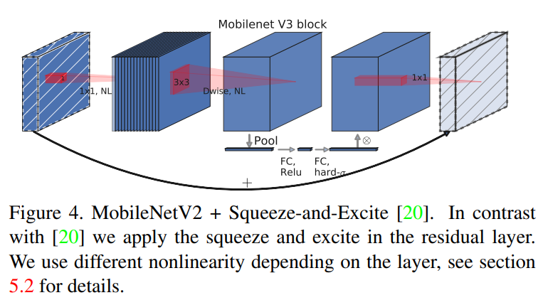

    Key tricks

    - Introduces **h-swish** (hard-swish) and **h-sigmoid** as cheap approximations of swish/sigmoid, better suited for mobile hardware.
      $$
      \text{hsigmoid}(x) = \frac{ReLU6(x+3)}{6},\quad \text{h-swish}(x) = x\cdot \frac{ReLU6(x+3)}{6}
      $$
      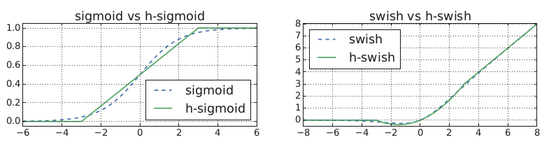

    - Overall architecture (widths, kernel sizes, presence of SE, activation type) is discovered via **NAS** under latency constraints.

  - Pipeline:

    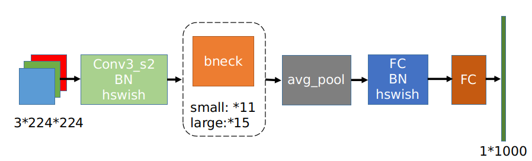

  - Pros

    - Architecture tailored for target latency on specific hardware.
    - **Excellent backbone** for mobile classification and detection.

  - Cons

    - Harder to reason about or modify compared to simple v1/v2 patterns.


### R-CNN Zoo

- **Rich feature hierarchies for accurate object detection and semantic segmentation**. Ross Girshick et.al. **arxiv**, **2013**, ([link](https://arxiv.org/abs/1311.2524v5)).

  > R-CNN: Regions with CNN features

  - CNN on region proposals (Selective Search): run the CNN **on each region proposals**.

    

    -  Module design: Region proposals(Selective Search) + Feature extraction(4096-dimensional vector using pre-trained CNN) +  classspecific linear SVMs
    - drawback: multi-stage / non end-to-end, slow, require large disk space

  - To solve the labeled datais scarce: use unsupervised pre-training, followed by supervised fine-tuning/supervised pre-training on a large auxiliary dataset (ILSVRC), followed by domainspecific fine-tuning on a small dataset(is also effective)

  - Cons

    - very slow: need to do ~2k independent forward passes for each image.

- **Fast R-CNN**. Ross Girshick et.al. **arxiv**, **2015**, ([link](https://arxiv.org/abs/1504.08083v2)).

  - Run the CNN **once per image** to get a feature map, then use **ROI pooling** to reuse convolutional features for all proposals. Train classification and bbox regression jointly with a single softmax + regression head.

    

    > how to project: using the network’s total stride sss to map box coordinates from image space to feature-map space: divide coordinates by sss, then crop that sub-region from the conv feature map.

    - Joint loss: classification cross-entropy + smooth L1 bbox regression loss.
    - The RoI pooling layer uses max pooling to convert the features inside any valid region of interest into a small feature map with a fixed spatial extent of H × W (e.g., 7 × 7).

  - Cons:
    - Proposals are the test-time computational bottleneck in state-of-the-art detection systems.

- **Faster R-CNN: Towards Real-Time Object Detection with Region Proposal Networks**. Shaoqing Ren et.al. **arxiv**, **2015**, ([link](https://arxiv.org/abs/1506.01497v3)). 

  - Takeaway: Faster R-CNN is a **two-stage object detector** that integrates **Region Proposal Network (RPN)** with the detection head, replacing external proposal methods and enabling end-to-end training with better speed and accuracy than R-CNN / Fast R-CNN.

    Faster R-CNN’s key idea:  **Learn region proposals with a CNN (RPN) that shares features with the detector.**

  - Prior

    - **R-CNN**: Selective Search proposals + per-region CNN; very slow.
    - **Fast R-CNN**: Single CNN per image + ROI pooling; faster but still depends on external region proposal (e.g., Selective Search), which is CPU-bound and slow.
    - The bottleneck: generating region proposals outside the CNN.

  - Core Mechanism: Attach an **RPN head** on top which slides small conv over the feature map. For each spatial position, predicts:

    - objectness scores for multiple anchors,
    - bounding box regressions for anchors.

    Then generate proposals from RPN and apply **ROI pooling / ROI Align** on shared features.

    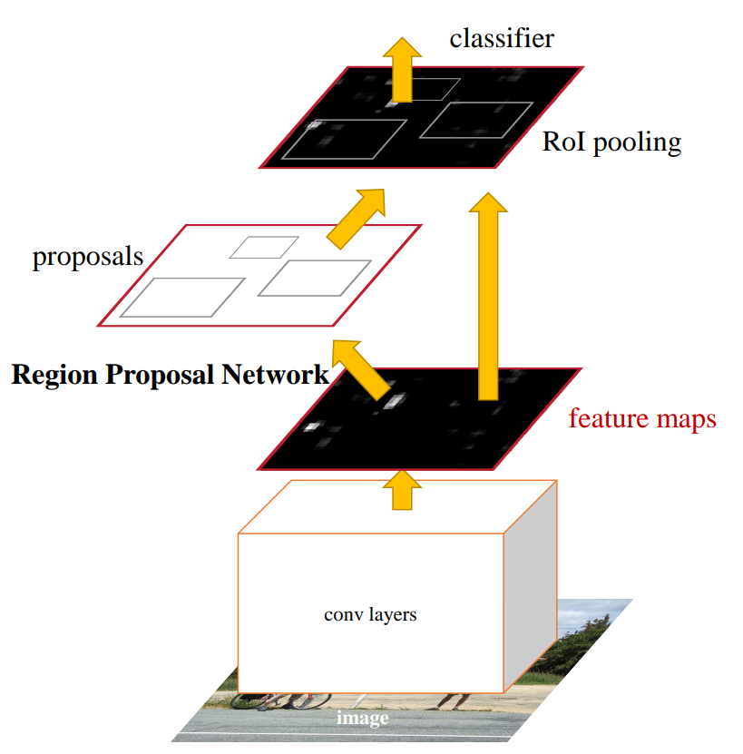

    Faster R-CNN is a single, unified network for object detection. The RPN module serves as the 'attention' of this unified network.

  - Pros:

    - End-to-end CNN-based detection with learned proposals.
    - Flexible: works with various backbones (ResNet, MobileNet, etc.).

  - Cons: 

    - relatively heavy / two-stage: 1.RPN to generate proposals. 2.ROI head to classify and refine them.
    - Anchor-based design: many hyperparameters, inefficiency

- **Mask R-CNN**. Kaiming He et.al. **arxiv**, **2017**, ([link](https://arxiv.org/abs/1703.06870v3)).

> [!TIP]
>
> The R-CNN universe is not used any more because all of they require large calculation

---


### GhostNet Zoo

- **GhostNet: More Features from Cheap Operations**. Kai Han et.al. **arxiv**, **2019**, ([link](https://arxiv.org/abs/1911.11907v2))([code link](https://github.com/huawei-noah/Efficient-AI-Backbones)) (Citations __5494__).

  - Takeaway: GhostNet dramatically reduces the cost of convolution by observing that many feature maps in standard CNNs are *redundant* and can be generated by cheap linear transformations instead of expensive convolutions.

  - Motivation: Standard CNNs generate feature maps like:$Y = Conv(X)$. But analysis shows:

    - Many feature maps are **highly correlated**
    - Much of the computation is **producing redundant information**
    - Depthwise conv reduces compute but becomes **memory-bound**
    - Mobile models (MobileNetV1/V2/V3) still require substantial 1×1 conv operations

  - Core Mechanism: Ghost Module

    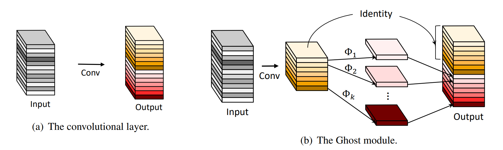

    GhostModule proposes that output feature maps consist of:

    - **Intrinsic features:** small set of essential feature maps (computed by real convolution)

    - **Ghost features:** redundant maps derived from intrinsic ones (via cheap ops)

      > [!NOTE]
      >
      > Here cheap operation is actually group convolution, group number = input channel number, which is equivalent to depthwise separable convolution. Of course,we can apply other ops like affine transformation, wavelet transformation, shift etc.

    GhostBottleneck

    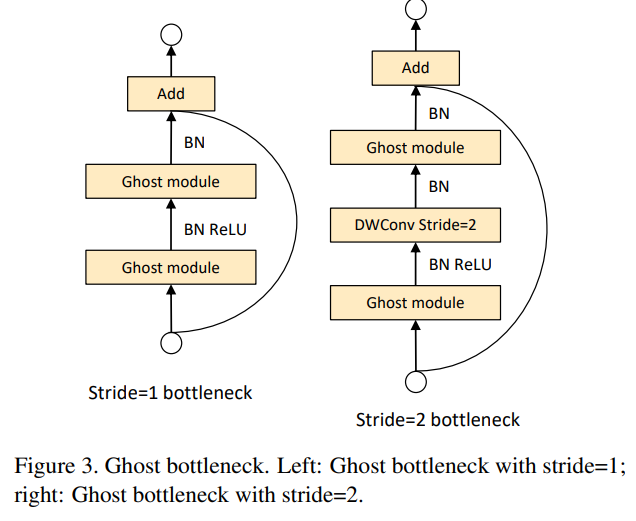

    ```
    Input
      → GhostModule (expand)
        → DepthwiseConv (if stride=2)
          → Squeeze-and-Excitation (optional)
            → GhostModule (project)
    + Shortcut (identity or depthwise+pointwise)
    ```

    > [!TIP]
    >
    > We found that the construction process of GhostNet is to use Ghost bottleneck to replace the bottleneck in MobileNetV3.

  - Pipeline

    ```mermaid
    flowchart LR
    
    A[Intrinsic Feature Generation<br/>Apply standard 1x1 or 3x3 conv<br/>Produce a small set of intrinsic feature maps]
        --> B[Ghost Feature Generation<br/>Apply cheap linear ops -- DW conv etc.<br/>Generate additional ghost feature maps]
    
    B --> C[Concatenation<br/>Merge intrinsic + ghost features<br/>Match full conv output dimensions]
    
    C --> D[Optional Squeeze-and-Excitation<br/>Channel attention to refine features]
    
    D --> E[Stack Ghost Bottlenecks<br/>Form GhostNet blocks and full network]
    
    ```

  - Pros

    - Massive reduction of FLOPs
    - Generalizable: Ghost Module can replace conv in ResNet, MobileNet, etc.

  - Cons

    - Depthwise convolution is memory-bound: Latency improvements may vary by hardware.
    - Cheap operations (depthwise conv, linear transforms) are inherently local. Missing global or long-range feature interactions.

- __GhostNetV2: Enhance Cheap Operation with Long-Range Attention.__ *Yehui Tang et al.* __ArXiv, 2022__ [(Arxiv)](https://arxiv.org/abs/2211.12905) [(S2)](https://www.semanticscholar.org/paper/3e420beb7f5d1bc370470b31908dd766ba35eedd) (Citations __582__)

  - Takeaway: GhostNetV2 = GhostNet + long-range spatial modeling (DFC) with almost zero extra cost.

  - Prior

    - Cheap operations (depthwise conv, linear transforms) are inherently local.
    - Transformers provide global attention, but are too costly for mobile.

  - Core Mechanism

    GhostNetV2 introduces the **Decoupled Fully Connected (DFC)** mechanism — a computationally cheap yet globally aware operator.

    DFC is a spatial long-range attention operator that approximates a **fully connected** layer over the spatial dimension **but decouples it into two 1D projections**, making it extremely efficient.

    One way to implement an attention map using an FC layer is
    $$
    {a}_{hw}=\sum_{h^\prime,w^\prime}{F_{hw,h^\prime,w^\prime}\odot 
    {z}_{h^\prime,w^\prime}} \tag{3}
    $$
    $ \odot $ represents the element-wise multiplication，$ F^{HW\times H\times W} $is the learnable weight. Still $O(H^2W^2)$

    CNN features are 2D, and this 2D shape naturally provides a perspective to reduce the computational load of the FC layer. The author decomposes Equation 3 into 2 FC layers and aggregates features along the horizontal and vertical directions respectively.
    $$
    {a}_{hw}^\prime=\sum_{h^\prime=1}^{H}{F_{h,h^\prime w}^H\odot {z}_{h^\prime w}},h=1,2,\cdot\cdot\cdot,H,w=1,2,\cdot\cdot\cdot,W \tag{4}
    $$

    $$
    {a}_{hw}=\sum_{w^\prime=1}^{W}{F_{w,h w^\prime}^W\odot {a}_{hw^\prime}^\prime},h=1,2,\cdot\cdot\cdot,H,w=1,2,\cdot\cdot\cdot,W \tag{5}
    $$

    The computational complexity of the attention module can be reduced to $O(H^2W+HW^2)$.

    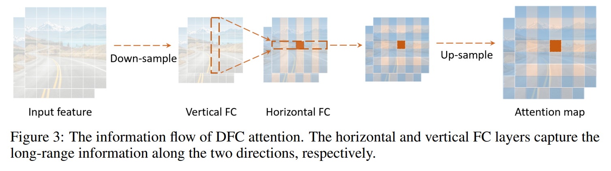

    GhostNetV2 bottleneck

    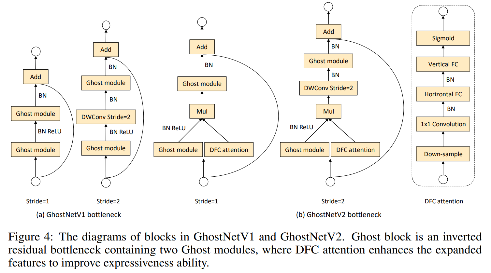

  - Pros:

    - Adds long-range spatial reasoning
    - **Versatile**: works for classification, detection, segmentation, and mobile vision tasks

  - Cons:

    - More complex
    - Less mathematically expressive than Transformers

- __GhostNets on Heterogeneous Devices via Cheap Operations.__ *Kai Han et al.* __International Journal of Computer Vision, 2022__ [(Arxiv)](https://arxiv.org/abs/2201.03297) [(S2)](https://www.semanticscholar.org/paper/c3a302ed0a8687f8b7bc50e4a1dff0f96b4fbf52) (Citations __165__)

  - Takeaway: This paper generalizes GhostNet to **heterogeneous hardware (CPU and GPU)** by:

    - Designing a **CPU-efficient Ghost module (C-Ghost)** that operates at the feature-map level with cheap operations, and
    - Designing a **GPU-efficient Ghost stage (G-Ghost)** that exploits **stage-wise redundancy** while avoiding GPU-inefficient ops like heavy depthwise conv.

  - Prior: 

    - 

  - Core Mechanism: G-Ghost

    

    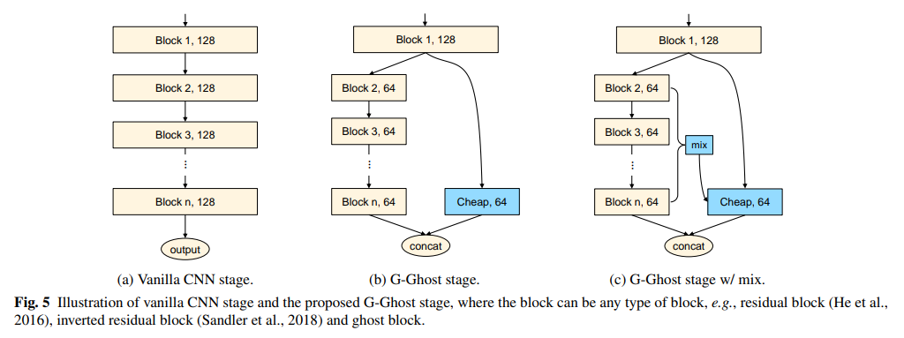

    why mix: There might be a lack of deep information that needs to be extracted in multiple layers later on, so add the rich expressive power of the middle layer, and then mix

    how mix: Global average pooling

    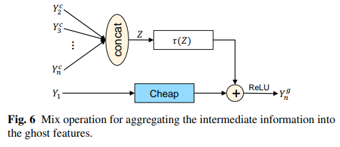

  - Pros

    - plug-and-play
    - GPU-friendly

  - Cons

    - Less “unified” than a single-architecture solution

- __RepGhost: A Hardware-Efficient Ghost Module via Re-parameterization.__ *Chengpeng Chen et al.* __ArXiv, 2022__ [(Arxiv)](https://arxiv.org/abs/2211.06088) [(S2)](https://www.semanticscholar.org/paper/d8d754d93d4a4fcc62838429fd36f795cb8f5d98) (Citations __144__)

  - Takeaway: RepGhost replaces the original Ghost module’s feature concatenation with a re-parameterizable, add-based design that implicitly reuses features in the weight space instead of the feature space.
  - Prior: 
    - [CPU vs GPU] We call the original Ghost as C-Ghost because cheap operations such as Depthwise are more friendly to mobile devices such as pipelined CPUs and ARM, but are not so "cheap" for GPUs with strong parallel computing capabilities. Because the computational density of Depthwise operations is relatively low. So we want to dive into a module more GPU-friendly.
    - [Concat vs Add] `concat` vs `add` on ARM:
      - Same params and FLOPs,
      - But `concat` is about **2× slower** than `add` due to memory access overhead.

### Yolo Zoo

> [!TIP]
>
> Compared to the model architecture, I think the engineer tricks of yolo are more important.

- __You Only Look Once: Unified, Real-Time Object Detection.__ *Joseph Redmon et al.* __2016 IEEE Conference on Computer Vision and Pattern Recognition (CVPR), 2015__ [(Arxiv)](https://arxiv.org/abs/1506.02640) [(S2)](https://www.semanticscholar.org/paper/f8e79ac0ea341056ef20f2616628b3e964764cfd) (Citations __41521__)

  - Takeaway: YOLO reframes object detection as a single, unified regression problem from image pixels to bounding boxes and class probabilities, using **one convolutional network, one forward pass**.

  - Prior: Before YOLO, dominant detectors were region-based like R-CNN zoo which is multi-stage and slow at inference.

  - Core Mechanism:

    Divide the image into $S\times S$ grids and for each grid cell predict:

    - B bounding box(with position and confidence score $Pr(object)\times IOU_{\text{truth}}^{\text{pred}}$)
    - C class probabilities

    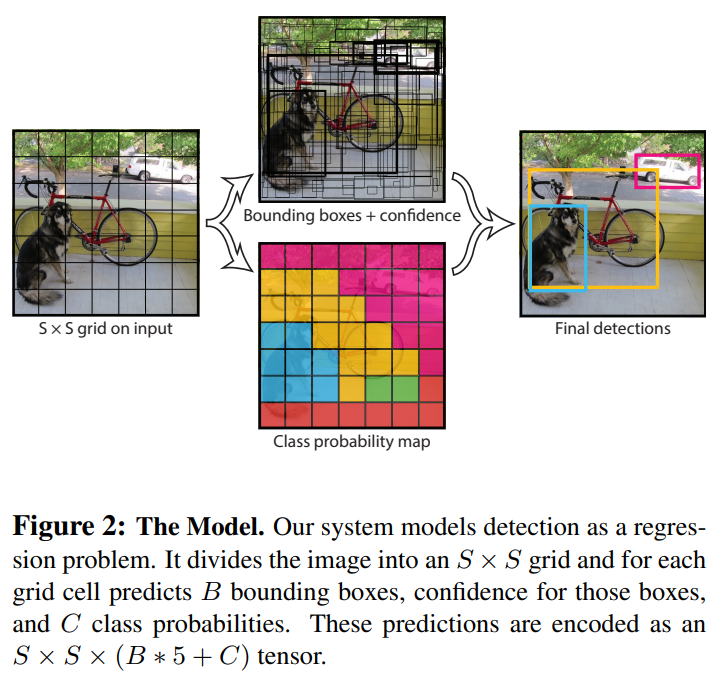

  - Pipeline

    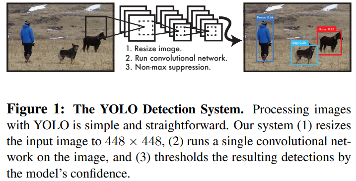

  - Pros

    - real-time, simple architecture
    - foundational impact: established the one-stage detection paradigm

  - Cons

    - coarse localization
    - struggles with small objects

- YOLOv5(no formal paper, engineering release)

  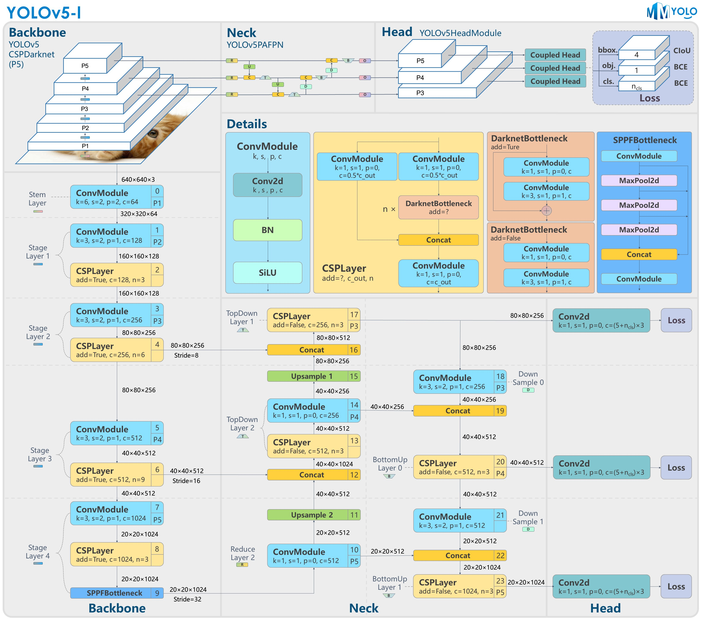

  - Core Mechanism

    - backbone

      - Conv -- CBA(convolution, batch normalization, activation(SiLU--sigmoid linear unit))

        use conv layer to replace the pooling layer

      - SPP(Spatial Pyramid Pooling)/SPPF(Spatial Pyramid Pooling Fast)

        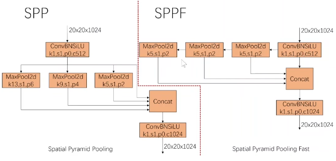

      - C3 -- cross stage partial network with 3 convolutions

        > [!NOTE]
        >
        > a simplified CSPNet
    
    - neck
    
      - concat in different layers: 先从下到上，再从上到下 

- __YOLOv7: Trainable Bag-of-Freebies Sets New State-of-the-Art for Real-Time Object Detectors.__ *Chien-Yao Wang et al.* __2023 IEEE/CVF Conference on Computer Vision and Pattern Recognition (CVPR), 2022__ [(Arxiv)](https://arxiv.org/abs/2207.02696) [(S2)](https://www.semanticscholar.org/paper/3aed4648f7857c1d5e9b1da4c3afaf97463138c3) (Citations __8815__)

  - Main Takeaway: In addition to architecture optimization, Yolov7 proposed methods will focus on the optimization of the **training process**.

    > [!TIP]
    >
    > We call the proposed modules and optimization methods trainable bag-of-freebies.

    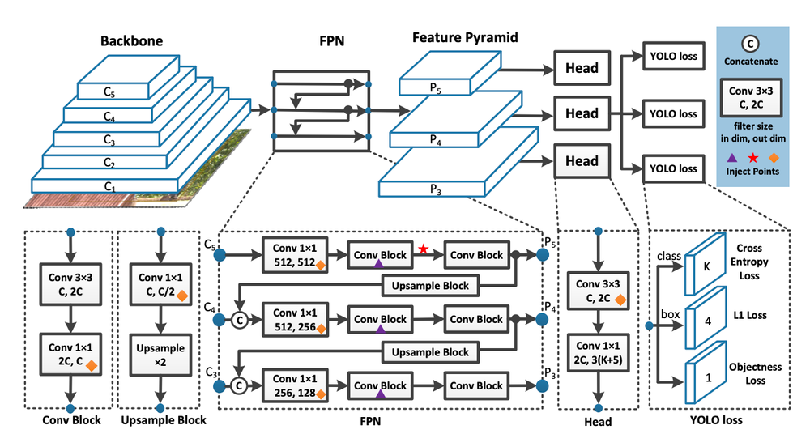

  - Core Mechanism: many tricks

    1. Extended efficient layer aggregation networks(E-ELAN)

       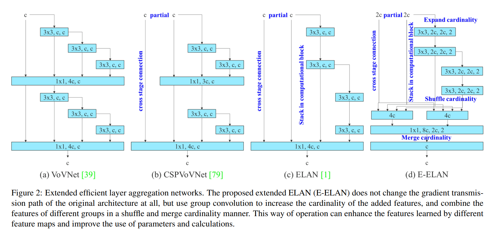

       - use **group convolution** to increase the cardinality of the added features, and combine the features of different groups in a shuffle and merge cardinality manner
       - Pros: 
         - improve feature fusion and enhance feature extraction capabilities
         - In terms of architecture, E-ELAN only changes the architecture in computational block, while the architecture of transition layer is completely unchanged.

    2. Several trainable bag-of-freebies methods

       1. planned re-parameterized model

          > [!NOTE]
          >
          > To answer the issue of "how re-parameterized module replaces original module".

          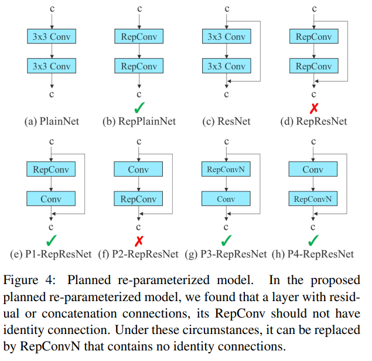

          - We found that a layer with residual or concatenation connections(ResNet and DenseNet), its RepConv should not have identity connection. Under these circumstances, it can be replaced by **RepConvN** that contains no identity connections.
    
       2. dynamic label assignment technology: coarse-to-fine lead guided label assignment

          > [!NOTE]
          >
          > To answer the issue of “How to assign dynamic targets for the outputs of different branches?”
          
           Coarse for auxiliary and fine for lead head label assigner
          
          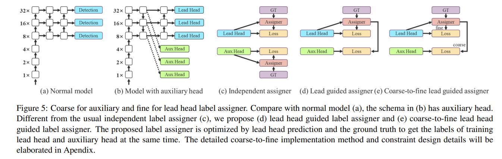
          
          > [!NOTE]
          >
          > - hard label: hard label assignment refers directly to the ground truth and generate hard label according to the given rules
          > - soft label: quality and distribution of prediction output by the network, and then consider together with the ground truth to use some calculation and optimization methods to generate a reliable soft label
          
          - Fine label is the same as the soft label generated by lead head guided label assigner.
          - Coarse label is generated by allowing more grids to be treated as positive target by relaxing the constraints of the positive sample assignment process.
          
       3. others: 
    
          - Batch normalization in conv-bn-activation topology: This part mainly connects batch normalization layer directly to convolutional layer
          - Implicit knowledge in YOLOR combined with convolution feature map in addition and multiplication manner
          - EMA model: EMA is a technique used in mean teacher, and in our system we use EMA model purely as the final inference model
          - YOLOv7 leverages **AutoAugment** for data augmentation, which helps improve the model’s generalization to unseen data.
          - Loss Functions: **CIoU loss** and **Focal Loss** for better bounding box localization and class prediction accuracy, especially for smaller objects.
    
    3. compound model scaling for concatenation-based models
    
       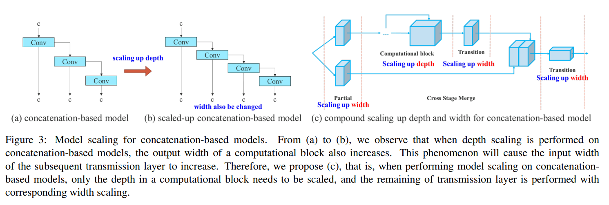

- __YOLOv8 to YOLO11: A Comprehensive Architecture In-depth Comparative Review.__ *Priyanto Hidayatullah et al.* __ArXiv, 2025__ [(Arxiv)](https://arxiv.org/abs/2501.13400) [(S2)](https://www.semanticscholar.org/paper/80886f2eed13a634045f4671d35be7bf67eef093) (Citations __51__)

  - Core Mechanism

    1. some blocks explanation

       - Conv block  = Conv2d + BN2d + SiLU

       - Downsampling Block: 

         - Cons: employ typical 3×3 convolution with stride 2 for the downsampling  process which may be less efficient

         - yolov9: Adaptive Downsampling (ADown)

           - Pros: less parameter count as pooling involves no parameters

           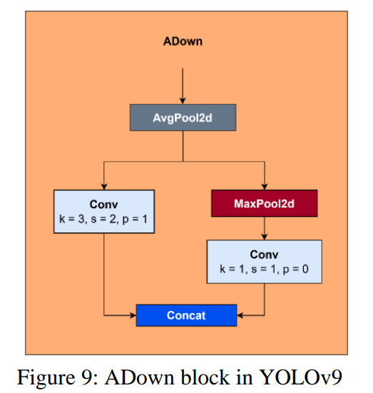

         - yolov10: Spatial-Channel Decoupled Downsampling (SCDown), which separates spatial reduction and channel addition operations

           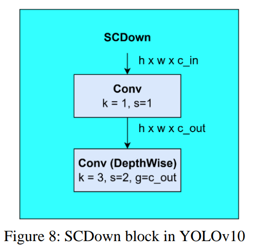

           use $1\times 1$ conv to change channel number and then use depthwise conv to decrease spatial resolution

       - C2f is a faster Implementation of CSP Bottleneck with 2 convolutions. C2f is utilized for feature extraction at all  stages

         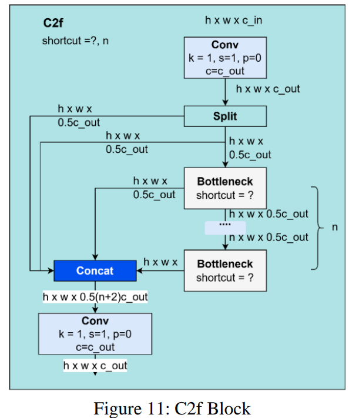

       - C2fCIB, CIB, RepVGGDW

       - C3k2 Block

       - SPPF & SPPELAN: Spatial Pyramid Pooling – Fast

       - C2PSA and Attention Block

       - Detect Block

         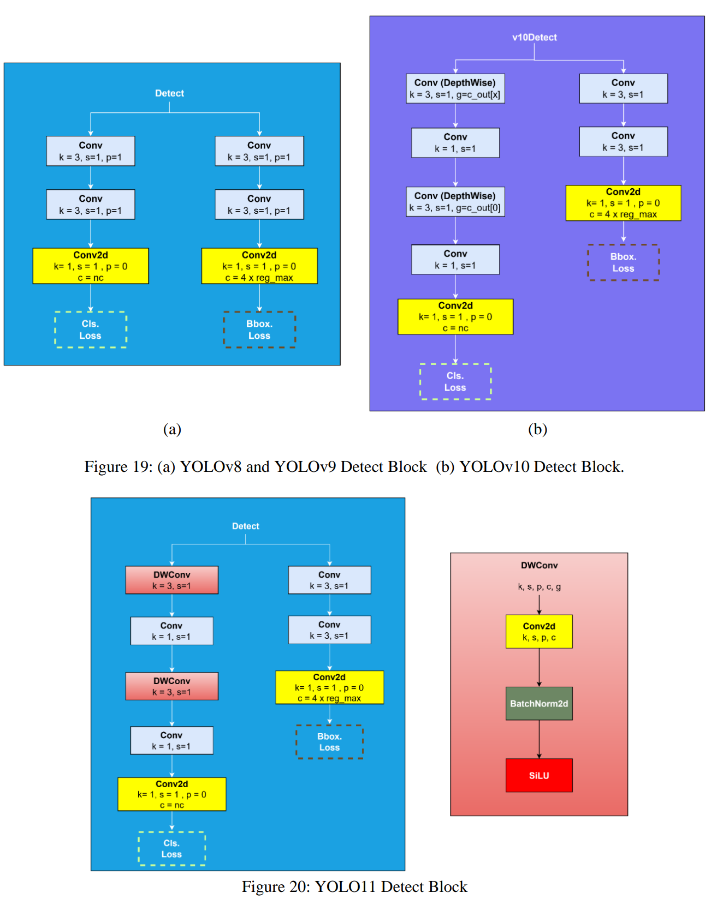

       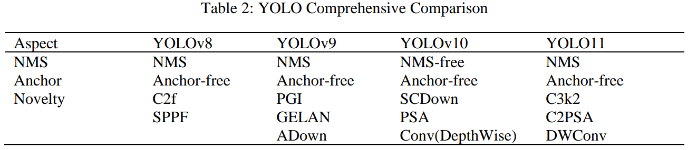

- __YOLOv11: An Overview of the Key Architectural Enhancements.__ *Rahima Khanam, Muhammad Hussain.* __ArXiv, 2024__ [(Arxiv)](https://arxiv.org/abs/2410.17725) [(S2)](https://www.semanticscholar.org/paper/adccc00dbd0fe63e4e34bc3445a29bc2ec910cbc) (Citations __1398__)

  > YOLOv11(no formal paper, engineering release) but there are **third-party analysis papers** on “YOLOv11”

  - Takeaway:

    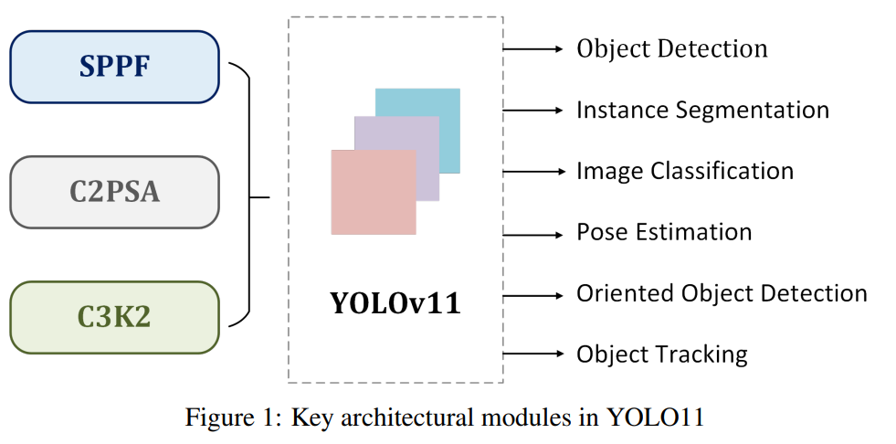

  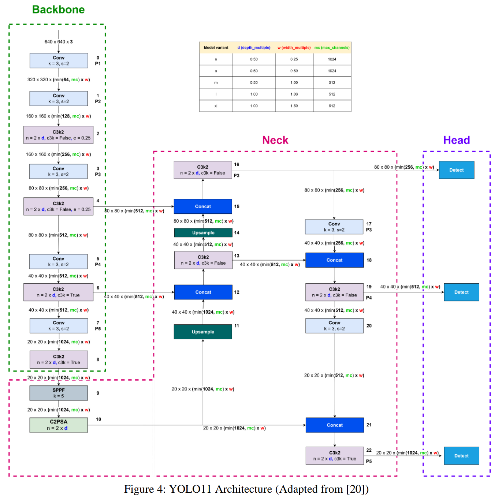

  - Core Mechanism
    - C3k2
    - C2PSA

- __YOLOv12: Attention-Centric Real-Time Object Detectors.__ *Yunjie Tian et al.* __ArXiv, 2025__ [(Arxiv)](https://arxiv.org/abs/2502.12524) [(S2)](https://www.semanticscholar.org/paper/ae1d5360f2f556139cffd10d6e9d2e0241c937e0) (Citations __609__)

### Others

- **ShuffleNet: An Extremely Efficient Convolutional Neural Network for Mobile Devices**. Xiangyu Zhang et.al. **arxiv**, **2017**, ([link](https://arxiv.org/abs/1707.01083v2)).

  - Takeaway: ShuffleNet designs extremely efficient CNNs using:

    - **Group Convolutions** to reduce computation,
    - **Channel Shuffle** to preserve information flow across groups, making it suitable for very low FLOP budgets.

  - Core Mechanism: Group convolutions and shuffling

    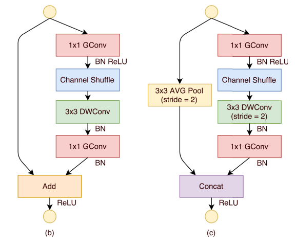

    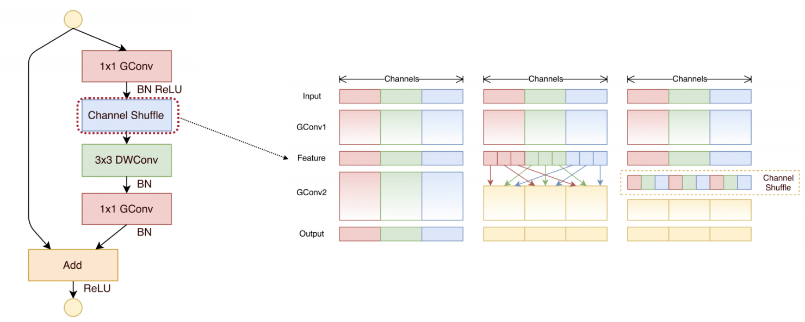

  - Cons

    - Channel shuffle pattern can be non-trivial for some inference engines.
    - Accuracy still limited compared to newer designs like MobileNet v3, GhostNet, MobileOne at similar budgets.

- **SSD: Single Shot MultiBox Detector**. Liu Wei et.al. **No journal**, **2016**, ([link](https://doi.org/10.1007/978-3-319-46448-0_2)).

  - Takeaway: SSD is a **single-stage, anchor-based detector** that predicts bounding boxes and class scores **directly from multiple feature maps** in one forward pass, avoiding region proposals and enabling real-time detection with reasonable accuracy.

  - Prior: YOLO showed that single-stage detection is fast but initially had localization and small-object issues. There was a need for a detector that:

    - is single-shot (no proposal stage),

  - uses multi-scale features for better small-object detection,

    - keeps good speed–accuracy trade-of

  - Core Mechanism: Architecture

    - Use a backbone network (e.g., VGG, MobileNet) and attach **extra conv layers** to produce a **feature pyramid**.
    - On each selected feature map:
      - Define a set of **default boxes (anchors)** with different aspect ratios and scales.
      - Use small conv filters to predict:
        - class scores for each default box,
        - bounding box offsets for each default box.
    - Combine predictions from all feature maps and apply NMS.

    

    > [!NOTE]
    >
    > This is why it's called **single-shot**: All predictions happen in **one forward pass**, **on multiple scales**.

  - Pros:

    - Eliminate proposal generation and resampling entirely.
    - Multi-scale feature maps improve detection across object sizes.

  - Cons:

    - Performance on **very small objects** is weaker than some later methods (e.g., FPN-based detectors), since SSD relies on relatively shallow high-resolution maps with limited semantics.
    - The hand-designed scales/aspect ratios of default boxes require tuning for new datasets

- **MobileOne: An Improved One millisecond Mobile Backbone**. Pavan Kumar Anasosalu Vasu et.al. **arxiv**, **2022**, ([link](https://arxiv.org/abs/2206.04040v2)).

  - Takeaway: MobileOne uses **structural reparameterization**: train with a **multi-branch over-parameterized block** (for accuracy and optimization), then **fuse all branches into a single 3×3 conv** at inference, achieving extremely fast, deployment-friendly mobile backbones.

  - Prior: Structural reparameterization (e.g., RepVGG) shows we can **train multi-branch, infer single-branch** by fusing conv+BN branches into one conv.

    > [!IMPORTANT]
    >
    > The relationship between these two indicators(**floating-point operations (FLOPs) and parameter count**) and the specific latency of the model is not so clear. For the **specific latency**, we should also consider **memory access cost(MAC) and degree of parallelism.**

  - Core Mechanism: Architectural Blocks(MobileOne block)

    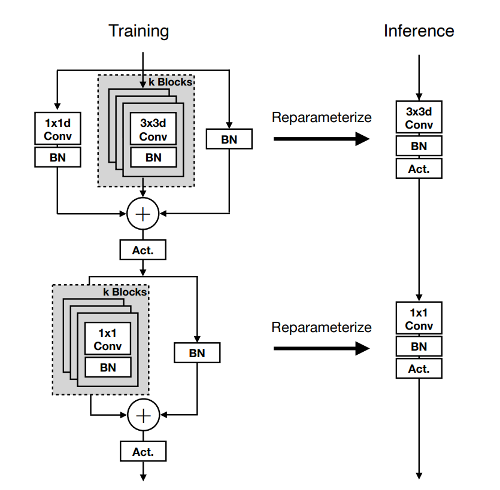

    Use structural re-parameterization to decouple the *training* architecture from the *inference* architecture

    - training time: each of those convs (depthwise and pointwise) is expanded into a multi-branch structure (over-parameterized)

    - inference time: all these branches are algebraically fused into a single conv per stage, so the runtime block is very simple

      > Straight cylinder shape： this structure is chosen to minimize latency and memory access cost on mobile hardware.

    - the DSC module is integrated by "scale branch", "skip branch" and "conv branches"

      - `rbr_scale`: center-only 1×1 path (after padding) that improves channel-wise scaling flexibility
      - `rbr_skip`: identity + BN path providing residual-like behavior and extra affine freedom
      - `rbr_conv`: main expressive conv paths (3×3 or 1×1)

    

  - Pros

    - Extremely fast at inference due to: Single-path structure/Fewer ops, better cache behavior.

  - Cons

    - Once fused, the model loses its multi-branch flexibility (harder to fine-tune structurally).

- __Spatial Pyramid Pooling in Deep Convolutional Networks for Visual Recognition.__ *Kaiming He et al.* __IEEE Transactions on Pattern Analysis and Machine Intelligence, 2014__ [(Arxiv)](https://arxiv.org/abs/1406.4729) [(S2)](https://www.semanticscholar.org/paper/cbb19236820a96038d000dc629225d36e0b6294a) (Citations __12112__)

  - Takeaway: Spatial Pyramid Pooling (SPP) removes the **fixed input-size constraint** of CNNs by introducing a **multi-level spatial pooling layer** that outputs a **fixed-length representation regardless of input resolution**, while simultaneously improving recognition accuracy through multi-scale spatial context aggregation.
  
  - Prior: Before SPP, standard CNN (e.g., AlexNet, VGG-style networks) required **fixed-size inputs**
  
  - Core Mechanism
  
    Apply pooling over **spatial bins of different granularities**, producing a **fixed-dimensional output** independent of the input feature map size.
  
  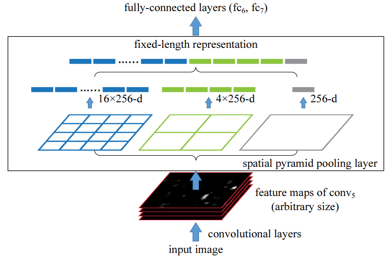

- __VarifocalNet: An IoU-aware Dense Object Detector.__ *Haoyang Zhang et al.* __2021 IEEE/CVF Conference on Computer Vision and Pattern Recognition (CVPR), 2020__ [(Arxiv)](__VarifocalNet: An IoU-aware Dense Object Detector.__ *Haoyang Zhang et al.* __2021 IEEE/CVF Conference on Computer Vision and Pattern Recognition (CVPR), 2020__ [(Arxiv)](https://arxiv.org/abs/2008.13367) [(S2)](https://www.semanticscholar.org/paper/14c3510e4f4b370d5cd0420037406024533f4b6f) (Citations __851__)) [(S2)](https://www.semanticscholar.org/paper/14c3510e4f4b370d5cd0420037406024533f4b6f) (Citations __1305__)

- __A Dual Weighting Label Assignment Scheme for Object Detection.__ *Shuai Li et al.* __2022 IEEE/CVF Conference on Computer Vision and Pattern Recognition (CVPR), 2022__ [(Arxiv)](https://arxiv.org/abs/2203.09730) [(S2)](https://www.semanticscholar.org/paper/8e68ea6bf41335d341cf629fa03b91463531bf98) (Citations __100__)

- __Once for All: Train One Network and Specialize it for Efficient Deployment.__ *Han Cai et al.* __ArXiv, 2019__ [(Arxiv)](https://arxiv.org/abs/1908.09791) [(S2)](https://www.semanticscholar.org/paper/7823292e5c4b05c47af91ab6ddf671a0da709e82) (Citations __1414__)

- __PBADet: A One-Stage Anchor-Free Approach for Part-Body Association.__ *Zhongpai Gao et al.* __ArXiv, 2024__ [(Arxiv)](https://arxiv.org/abs/2402.07814) [(S2)](https://www.semanticscholar.org/paper/1ba604d5766f632f5430b8a5d8f9d656645ac8a6) (Citations __1__)

  - Takeaway: PBADet unifies *part detection* and *part-to-person association* in a **one-stage, anchor-free** detector by predicting a simple **part → body-center 2D offset**, enabling efficient and scalable association without multi-stage matching networks.

    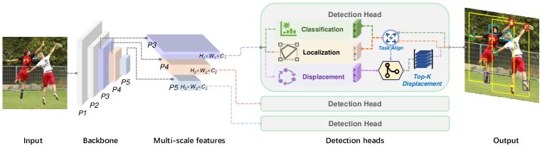

  - Prior: Earlier pipelines often used **two-stage** designs (detect bodies and parts separately, then associate) or **body → part offsets** (e.g., predicting multiple offsets from each body to many parts), which can become **channel-heavy** as part types grow and can be brittle under occlusion/invisibility. PBADet instead flips the direction to **part → body** with a single universal offset.

  - Core Mechanism: For each part candidate (dense point/feature location), PBADet predicts:

    1. the **part bounding box** + classification, and
    2. a **2D vector** that points from the part to its **owning body center**.
        This keeps the association head **constant-sized** regardless of the number of part categories.

  - Pros: 

    - Simple & fast: one-stage, anchor-free; lightweight association head
    - Scalable: offset head does **not** grow with part category count

  - Cons:

    - **Still relies on post-processing matching** (not fully end-to-end assignment)
    - **Sensitive to body detection quality**: missed/shifted body boxes can break association. Crowded/overlapping people may confuse the assignments.

- __TOOD: Task-aligned One-stage Object Detection.__ *Chengjian Feng et al.* __2021 IEEE/CVF International Conference on Computer Vision (ICCV), 2021__ [(Arxiv)](https://arxiv.org/abs/2108.07755) [(S2)](https://www.semanticscholar.org/paper/7438524bf00d7c5a22cb8799797f57c3a794b220) (Citations __1029__)

- __FCOS: Fully Convolutional One-Stage Object Detection.__ *Zhi Tian et al.* __2019 IEEE/CVF International Conference on Computer Vision (ICCV), 2019__ [(Arxiv)](https://arxiv.org/abs/1904.01355) [(S2)](https://www.semanticscholar.org/paper/e2751a898867ce6687e08a5cc7bdb562e999b841) (Citations __5666__)

  - Takeaway: FCOS is an **anchor-free, proposal-free, one-stage detector** that predicts objects **per pixel** using a fully convolutional head.

    > 第一个这样做得比较好的
    
  - Core Mechanism
  
    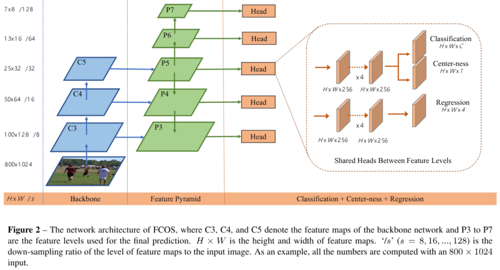
  
    Per location on a feature map, FCOS predicts three things： **classification, box regression, centerness**
  
    Box regression uses distances to four sides of the target box
    $$
    \mathbf{t} = (l, t, r, b)
    $$
    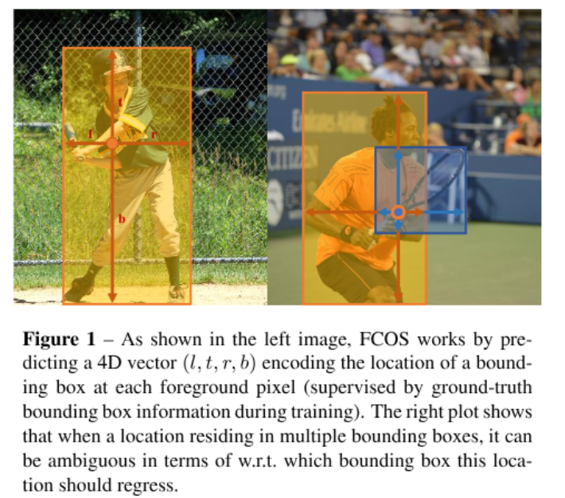
  
    For a feature-map location mapped to image coordinates $(x, y)$ and a ground-truth box with corners $(x_0, y_0)$ and $(x_1, y_1)$
    $$
    l = x - x_0,\quad t = y - y_0,\quad r = x_1 - x,\quad b = y_1 - y
    $$
    Centerness down-weights locations near box edges: a **localization quality indicator**
    $$
    \text{centerness} =
    \sqrt{
    \frac{\min(l, r)}{\max(l, r)}
    \cdot
    \frac{\min(t, b)}{\max(t, b)}
    }
    $$
  
    > We employ sqrt here to slow down the decay of the centerness
  
    Final score at inference multiplies classification confidence and centerness
    $$
    s = \sigma(p_{\text{cls}})\cdot \sigma(p_{\text{ctr}})
    $$
    Training objective combines classification, regression, and centerness losses
    $$
    L = L_{\text{cls}} + \lambda L_{\text{reg}} + \gamma L_{\text{ctr}}
    $$
    A common regression choice in FCOS is IoU or GIoU loss
    $$
    L_{\text{reg}} = 1 - \mathrm{IoU}(B, B^{gt})
    $$
  
    $$
    L_{\text{reg}} = 1 - \mathrm{GIoU}(B, B^{gt})
    $$


## Loss Function

check the [OD-Loss-Zoo](./03-OD-Loss-Zoo)

## Module Design

chech the [Module Design](../../../Efficient-AI/06-Module-Design.md)

## References

- [Depthwise Convolution explanation]( https://towardsdatascience.com/a-basic-introduction-to-separable-convolutions-b99ec3102728)
- [MobileNetv2 explanation]( https://ai.googleblog.com/2018/04/mobilenetv2-next-generation-of-on.html)
- [MobileNetV2 explained video](https://www.youtube.com/watch?v=DkNIBBBvcPs)
- [MobileNetV1_intro](https://research.google/blog/mobilenets-open-source-models-for-efficient-on-device-vision/?_gl=1)
- [Selective-search](https://learnopencv.com/selective-search-for-object-detection-cpp-python/)
