# Object Detection Model Zoo

Focus on object detection models

[TOC]

## Model Zoo

### MobileNet Zoo

- **MobileNets: Efficient Convolutional Neural Networks for Mobile Vision Applications**. Andrew G. Howard et.al. **arxiv**, **2017**, ([link](https://arxiv.org/abs/1704.04861v1)).

  - Takeaway: MobileNet v1 replaces standard convs with **depthwise + pointwise** convs (DSC) to cut FLOPs/params for mobile.

  - Motivation: Classical CNNs (VGG, ResNet) use full 3×3 convolutions with cost:

    - Computation: `H × W × Cin × Cout × K²`
    - Parameters: `Cin × Cout × K²`

    This is too heavy for phones and embedded devices.

  - Core Mechanism: Depthwise Separable Convolutions(DSC): Replace a standard `K×K` conv with:

    - **Depthwise conv**: `K×K` per input channel, no channel mixing
    - **Pointwise conv**: `1×1` conv to mix channels

    

    This factorizes computation:

    - Original MACs: `H × W × Cin × Cout × K²`
    - DSC MACs: `H × W × (Cin × K² + Cin × Cout)`

    For typical settings (e.g., `K=3`, `Cin ~ Cout`), this greatly reduces compute. Additionally, MobileNet v1 introduces:

    - width multiplier $\alpha$: thinner models, controls the number of channels in each layer

    - resolution multiplier $\rho$: reduce the computational cost, controls the input image resolution
      $$
      D_K \times D_K \times \alpha M \times \rho D_F \times \rho D_F+\alpha M \times \alpha N \times  \rho D_F \times \rho D_F
      $$

    Together, they form a simple knob set for accuracy–efficiency trade-offs.

    > [!TIP]
    >
    > Less regularization and data augmentation techniques because **small models have less trouble with overfitting**.

  - Pros

    - Massive reduction in FLOPs and parameters vs full convs.

  - Cons

    - Pure DSC networks can be **memory-bound** (low compute/memory ratio).
    - Representational power is weaker than advanced backbones (e.g., ResNet, MobileNet v2/v3).
    - No explicit mechanism to handle **information loss** in low-dimensional bottlenecks.

- **MobileNetV2: Inverted Residuals and Linear Bottlenecks**. Mark Sandler et.al. **arxiv**, **2018**, ([link](https://arxiv.org/abs/1801.04381v4)).

  - Takeaway: MobileNet v2 introduces the **Inverted Residual + Linear Bottleneck** block, improving over v1.

  - Motivation: MobileNet v1’s DSC is efficient but suffers from information loss in narrow intermediate layers. And there`s no residual connections in most layers.

  - Core Mechanism:

    a novel layer module: the inverted residual with linear bottleneck

    1. **Expansion**:
       The input is first passed through a **1×1 convolution** that **expands** the number of channels, increasing the model’s representational capacity.
    2. **Depthwise Separable Convolution**:
       After the expansion, a **depthwise separable convolution** (which is more computationally efficient than a regular convolution) is applied. This operation is performed on each channel separately, rather than combining all channels together, reducing the number of parameters and computation.
    3. **Projection (Linear Bottleneck)**:
       The **output** of the depthwise separable convolution is then passed through a **1×1 convolution** that **projects** the feature map back to a smaller number of channels.

    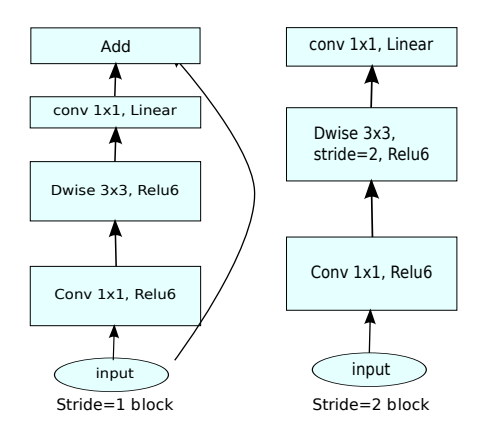

    > [!NOTE]
    >
    > ReLU6: $y = min(max(x,0),6)$, cut the value in 6

    Key tricks:

    - linear bottlenecks

      No non-linearity (e.g., ReLU) after the final projection to avoid losing information in low-dimensional space (maintain representational power).

    - Inverted residuals

      - Normal bottleneck use $1\times 1$ layers to reduce and then increase(restore) dimensions, which helps in reducing computational cost. However, this comes with a trade-off, as you need to balance the reduction in dimensions with the need to preserve sufficient information.
      - Inverted residuals use $1\times 1$ layers to increase and then reduce dimensions

  - Pros

    - Remains highly efficient and widely adopted in detection/segmentation backbones.

  - Cons

    - Still heavily reliant on depthwise conv (memory-bound).
    - This design is not memory-efficient for both inference and training.

- __Searching for MobileNetV3.__ *Andrew G. Howard et al.* __2019 IEEE/CVF International Conference on Computer Vision (ICCV), 2019__ [(Arxiv)](https://arxiv.org/abs/1905.02244) [(S2)](https://www.semanticscholar.org/paper/5e19eba1e6644f7c83f607383d256deea71f87ae) ([code_link](https://github.com/d-li14/mobilenetv3.pytorch))(Citations __8097__)

  - Takeaway: MobileNet v3 combines（有点缝合怪的感觉）:

    - **Inverted residual blocks from v2**,
    - **Squeeze-and-Excitation (SE)** for channel attention,
    - **NAS-based layer configuration** and customized **nonlinearities** (h-swish, h-sigmoid), to push mobile efficiency further while keeping FLOPs low.

  - Motivation: Google’s work on NAS and SE (SENet, EfficientNet) motivates an automated and more refined design.

  - Core Mechanism:

    MobilenetV3 block: MobileNetV2 + Squeeze-and-Excite

    

    Key tricks

    - Introduces **h-swish** (hard-swish) and **h-sigmoid** as cheap approximations of swish/sigmoid, better suited for mobile hardware.
      $$
      \text{hsigmoid}(x) = \frac{ReLU6(x+3)}{6},\quad \text{h-swish}(x) = x\cdot \frac{ReLU6(x+3)}{6}
      $$
      

    - Overall architecture (widths, kernel sizes, presence of SE, activation type) is discovered via **NAS** under latency constraints.

  - Pipeline:

    

  - Pros

    - Architecture tailored for target latency on specific hardware.
    - **Excellent backbone** for mobile classification and detection.

  - Cons

    - Harder to reason about or modify compared to simple v1/v2 patterns.

### R-CNN Zoo

- **Rich feature hierarchies for accurate object detection and semantic segmentation**. Ross Girshick et.al. **arxiv**, **2013**, ([link](https://arxiv.org/abs/1311.2524v5)).

  > R-CNN: Regions with CNN features

  - Takeaway

    CNN on region proposals (Selective Search): run the CNN **on each region proposals**.

    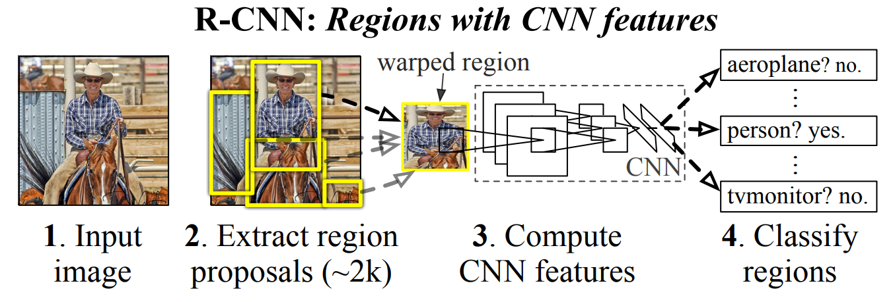

    -  Module design: Region proposals(Selective Search) + Feature extraction(4096-dimensional vector using pre-trained CNN) +  classspecific linear SVMs
    - drawback: multi-stage / non end-to-end, slow, require large disk space

  - Core Mechanism

    To solve the labeled datais scarce: use unsupervised pre-training, followed by supervised fine-tuning/supervised pre-training on a large auxiliary dataset (ILSVRC), followed by domainspecific fine-tuning on a small dataset(is also effective)

  - Cons

    - very slow: need to do ~2k independent forward passes for each image.

- **Fast R-CNN**. Ross Girshick et.al. **arxiv**, **2015**, ([link](https://arxiv.org/abs/1504.08083v2)).

  - Run the CNN **once per image** to get a feature map, then use **ROI pooling** to reuse convolutional features for all proposals. Train classification and bbox regression jointly with a single softmax + regression head.

    

    > how to project: using the network’s total stride sss to map box coordinates from image space to feature-map space: divide coordinates by sss, then crop that sub-region from the conv feature map.

    - Joint loss: classification cross-entropy + smooth L1 bbox regression loss.
    - The RoI pooling layer uses max pooling to convert the features inside any valid region of interest into a small feature map with a fixed spatial extent of H × W (e.g., 7 × 7).

  - Cons:
    - Proposals are the test-time computational bottleneck in state-of-the-art detection systems.

- **Faster R-CNN: Towards Real-Time Object Detection with Region Proposal Networks**. Shaoqing Ren et.al. **arxiv**, **2015**, ([link](https://arxiv.org/abs/1506.01497v3)).

  - Takeaway: Faster R-CNN adds an **RPN** to generate proposals, enabling end-to-end two-stage detection without external proposal methods.

    Faster R-CNN’s key idea:  **Learn region proposals with a CNN (RPN) that shares features with the detector.**

  - Motivation

    - **R-CNN**: Selective Search proposals + per-region CNN; very slow.
    - **Fast R-CNN**: Single CNN per image + ROI pooling; faster but still depends on external region proposal (e.g., Selective Search), which is CPU-bound and slow.
    - The bottleneck: generating region proposals outside the CNN.

  - Core Mechanism: Attach an **RPN head** on top which slides small conv over the feature map. For each spatial position, predicts:

    - objectness scores for multiple anchors,
    - bounding box regressions for anchors.

    Then generate proposals from RPN and apply **ROI pooling / ROI Align** on shared features.

    > [!NOTE]
    >
    > ROI Pooling是如何对不同大小ROI特征区域进行处理的，如何处理大小不同的输入:
    >
    > 1. **先规定一个输出尺寸**，比如 $H \times W = 7 \times 7$；
    > 2. **把当前这个 $h \times w$ 的区域，均匀切成 $H \times W$ 个小格子**；
    > 3. 每个小格子内部做一次 **max pooling**；
    > 4. 这样每个小格子输出 1 个值，最终就得到一个 $H \times W$ 的结果。

    > [!TIP]
    >
    > 只在乎这里是不是有个物体，整个特征图上进行滑动扫描，每扫到一个位置，就围绕这个位置生成多种大小和长宽比的候选框，然后给每个框打分、微调位置

    

    Faster R-CNN is a single, unified network for object detection. The RPN module serves as the 'attention' of this unified network.

  - Pros:

    - End-to-end CNN-based detection with learned proposals.
    - Flexible: works with various backbones (ResNet, MobileNet, etc.).

  - Cons:

    - relatively heavy / two-stage: 1.RPN to generate proposals. 2.ROI head to classify and refine them.
    - Anchor-based design: many hyperparameters, inefficiency

- **Mask R-CNN**. Kaiming He et.al. **arxiv**, **2017**, ([link](https://arxiv.org/abs/1703.06870v3)).

- __MAFE R-CNN: Selecting More Samples to Learn Category-aware Features for Small Object Detection.__ *Yichen Li et al.* __arXiv, 2025__ [(Arxiv)](https://arxiv.org/abs/2505.16442) 

> [!TIP]
>
> The R-CNN universe is not used any more because all of they require large calculation

---

### FPN Zoo

- __Feature Pyramid Networks for Object Detection.__ *Tsung-Yi Lin et al.* __arXiv, 2016__ [(Arxiv)](https://arxiv.org/abs/1612.03144) 

  - Takeaway

    Feature Pyramid Networks (FPN) is a multi-scale feature fusion architecture for object detection. Its key idea is to combine the **strong semantics of deep layers** with the **high resolution of shallow layers** through a **top-down pathway with lateral connections**, producing feature maps at multiple scales that are all semantically strong. :contentReference[oaicite:0]{index=0}

  - Motivation

    Object detection must handle objects of very different sizes, but standard ConvNet backbones naturally create a hierarchy where:

    - shallow layers have **high resolution** but **weak semantics**
    - deep layers have **strong semantics** but **low resolution**

    Traditional image pyramids can address scale variation, but they are expensive in computation and memory. Before FPN, many detectors either relied mainly on the final deep feature map, which hurts small-object detection, or built pyramids in less efficient ways. FPN was proposed to exploit the **inherent pyramidal hierarchy** inside ConvNets and build a strong feature pyramid with only marginal extra cost.

  - Core Mechanism

    

    FPN has three core parts:

    1. backbone to extract features
       \[
       C_2,\; C_3,\; C_4,\; C_5
       \]
       
    2. Top-down pathway
       
       Starting from the deepest feature map, FPN upsamples higher-level semantic features and sends them downward.

    3. Lateral connections
       
       At each scale, the upsampled high-level feature is merged with the corresponding backbone feature using a lateral \(1\times1\) convolution.

    The fused pyramid features are denoted:

    \[
    P_2,\; P_3,\; P_4,\; P_5
    \]

    A common way to write the fusion is:

    \[
    P_l = \mathrm{Conv}_{3\times3}\!\left(\mathrm{Conv}_{1\times1}(C_l) + \mathrm{Up}(P_{l+1})\right)
    \]

    > [!note]
    >
    > several ways to fuse the feature
    >
    > 1. use 1×1 Convolution to  align channels and add element-wisely
    >    - cheap and keeps channel dimension fixed
    > 2. just channel concatenation

    where:

    - \(C_l\) is the backbone feature at level \(l\)
    - \(P_{l+1}\) is the higher-level pyramid feature
    - \(\mathrm{Up}(\cdot)\) is usually 2× upsampling
    - \(\mathrm{Conv}_{1\times1}\) aligns channel dimensions
    - \(\mathrm{Conv}_{3\times3}\) reduces aliasing after fusion

    The highest pyramid level is usually initialized as:

    \[
    P_5 = \mathrm{Conv}_{1\times1}(C_5)
    \]

    So the whole design can be understood as:

    \[
    \text{high-level semantics} + \text{low-level spatial detail} \rightarrow \text{multi-scale strong features}
    \]

    This is the central reason FPN works especially well for detection across scales, including small objects. 

  - Pros

    - Strong, efficient and simple

  - Cons

    - Fusion is relatively simple: FPN mainly uses element-wise addition, which may not be the most expressive cross-scale fusion strategy.
    - Information flow is mostly top-down: lower-level detailed information is enhanced by high-level semantics, but reverse aggregation is limited.
      - Sol: later methods such as PANet were designed partly to address this.

    - Scale assignment is heuristic: assigning objects to feature levels is not fully adaptive in the original design.

- __Path Aggregation Network for Instance Segmentation.__ *Shu Liu et al.* __arXiv, 2018__ [(Arxiv)](https://arxiv.org/abs/1803.01534) [(Code)](https://github.com/ShuLiu1993/PANet)

  - Takeaway
  
    Path Aggregation Network (PANet) is an extension of FPN-based instance segmentation that improves information flow across feature levels. Its main idea is to strengthen **bottom-up localization propagation**, **multi-level RoI feature aggregation**, and **mask prediction fusion**, so proposal-based segmentation and detection can use both strong semantics and precise spatial details more effectively. :contentReference[oaicite:0]{index=0}
  
  - Motivation
  
    In FPN-based frameworks such as Mask R-CNN, high-level features contain strong semantics, but accurate localization cues often originate from lower layers. The original PANet paper argues that the path from shallow localization features to topmost features is too long, which can weaken precise spatial information for downstream proposal classification, box regression, and mask prediction. PANet was proposed to shorten this path and let proposal subnetworks access useful information from **all** pyramid levels more directly.
  
  - Core Mechanism
  
    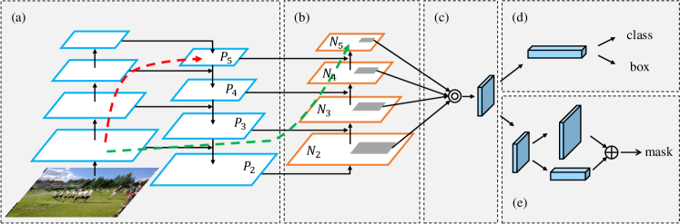
  
    Figure: Illustration of our framework. (a) FPN backbone. (b) Bottom-up path augmentation. (c) Adaptive feature pooling. (d) Box branch. (e) Fully-connected fusion. Note that we omit channel dimension of feature maps in (a) and (b) for brevity.
  
    > [!TIP]
    >
    > the dashed green line is a shortcut
  
    1. Bottom-up Path Augmentation
       
       On top of the standard FPN top-down pyramid, PANet adds an extra **bottom-up path** so lower-level localization signals can travel upward more efficiently. This strengthens the whole feature hierarchy with spatially precise information.
  
       $$
       P_l = \text{Conv}_{3\times3}\left(\text{Conv}_{1\times1}(C_l) + \text{Up}(P_{l+1})\right) \\
       N_{l+1} = \text{Conv}_{3\times3}\left(P_{l+1} + \text{Conv}_{3\times3}^{stride=2}(N_l)\right)
       $$
       
    2. Adaptive Feature Pooling
       
       In standard FPN-based RoI assignment, each proposal is usually mapped to only one pyramid level. PANet instead pools RoI features from **all feature levels** and fuses them, so each proposal can use multi-scale information directly.
  
       A concise mathematical view is:
       
       \[
       \mathbf{r} = \sum_{l} \alpha_l \, \mathrm{RoIAlign}(N_l, \mathrm{RoI}),
       \]
       
       where:
       
       - \(N_l\) is the feature map at level \(l\)
       - \(\mathrm{RoIAlign}(N_l, \mathrm{RoI})\) extracts proposal features from level \(l\)
       - \(\alpha_l\) is a fusion weight
  
       > [!TIP]
       >
       > The paper’s core point is not the exact symbol choice, but the idea that proposal features **should aggregate information from all pyramid levels rather than only one**.
       
    3. Fully-Connected Fusion for Mask Prediction
       
       PANet adds a complementary branch for mask prediction that captures a different view of each proposal, then fuses it with the normal FCN-style mask branch. This improves mask quality by combining local dense prediction with more global proposal-level information. 
  
       A simple fusion expression is:
       
       \[
       \mathbf{m}_{\text{final}} = \mathbf{m}_{\text{fcn}} + \mathbf{m}_{\text{fc}},
       \]
       
       where:
       
       - \(\mathbf{m}_{\text{fcn}}\) is the mask from the convolutional mask branch
       - \(\mathbf{m}_{\text{fc}}\) is the mask from the fully-connected branch
  
       Again, this is a compact mathematical summary of the fusion idea described in the paper.


### GhostNet Zoo

- **GhostNet: More Features from Cheap Operations**. Kai Han et.al. **arxiv**, **2019**, ([link](https://arxiv.org/abs/1911.11907v2))([code link](https://github.com/huawei-noah/Efficient-AI-Backbones)) (Citations __5494__).

  - Takeaway: GhostNet dramatically reduces the cost of convolution by observing that many feature maps in standard CNNs are *redundant* and can be generated by cheap linear transformations instead of expensive convolutions.

  - Motivation: Standard CNNs generate feature maps like:$Y = Conv(X)$. But analysis shows:

    - Many feature maps are **highly correlated**
    - Much of the computation is **producing redundant information**
    - Depthwise conv reduces compute but becomes **memory-bound**
    - Mobile models (MobileNetV1/V2/V3) still require substantial 1×1 conv operations

  - Core Mechanism: Ghost Module

    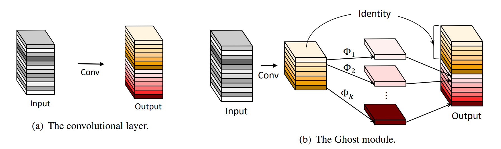

    GhostModule proposes that output feature maps consist of:

    - **Intrinsic features:** small set of essential feature maps (computed by real convolution)

    - **Ghost features:** redundant maps derived from intrinsic ones (via cheap ops)

      > [!NOTE]
      >
      > Here cheap operation is actually group convolution, group number = input channel number, which is equivalent to depthwise separable convolution. Of course, we can apply other ops like affine transformation, wavelet transformation, shift etc.

    GhostBottleneck

    

    ```
    Input
      → GhostModule (expand)
        → DepthwiseConv (if stride=2)
          → Squeeze-and-Excitation (optional)
            → GhostModule (project)
    + Shortcut (identity or depthwise+pointwise)
    ```

    > [!TIP]
    >
    > We found that the construction process of GhostNet is to use Ghost bottleneck to replace the bottleneck in MobileNetV3.

  - Pipeline

    ```mermaid
    flowchart LR

    A[Intrinsic Feature Generation<br/>Apply standard 1x1 or 3x3 conv<br/>Produce a small set of intrinsic feature maps]
        --> B[Ghost Feature Generation<br/>Apply cheap linear ops -- DW conv etc.<br/>Generate additional ghost feature maps]

    B --> C[Concatenation<br/>Merge intrinsic + ghost features<br/>Match full conv output dimensions]

    C --> D[Optional Squeeze-and-Excitation<br/>Channel attention to refine features]

    D --> E[Stack Ghost Bottlenecks<br/>Form GhostNet blocks and full network]

    ```

  - Pros

    - Massive reduction of FLOPs
    - Generalizable: Ghost Module can replace conv in ResNet, MobileNet, etc.

  - Cons

    - Depthwise convolution is memory-bound: Latency improvements may vary by hardware.
    - Cheap operations (depthwise conv, linear transforms) are inherently local. Missing global or long-range feature interactions.

- __GhostNetV2: Enhance Cheap Operation with Long-Range Attention.__ *Yehui Tang et al.* __ArXiv, 2022__ [(Arxiv)](https://arxiv.org/abs/2211.12905) [(S2)](https://www.semanticscholar.org/paper/3e420beb7f5d1bc370470b31908dd766ba35eedd) (Citations __582__)

  - Takeaway: GhostNetV2 = GhostNet + long-range spatial modeling (DFC) with almost zero extra cost.

  - Motivation

    - Cheap operations (depthwise conv, linear transforms) are inherently local.
    - Transformers provide global attention, but are too costly for mobile.

  - Core Mechanism

    GhostNetV2 introduces the **Decoupled Fully Connected (DFC)** mechanism — a computationally cheap yet globally aware operator.

    DFC is a spatial long-range attention operator that approximates a **fully connected** layer over the spatial dimension **but decouples it into two 1D projections**, making it extremely efficient.

    One way to implement an attention map using an FC layer is
    $$
    {a}_{hw}=\sum_{h^\prime,w^\prime}{F_{hw,h^\prime,w^\prime}\odot
    {z}_{h^\prime,w^\prime}} \tag{3}
    $$
    $ \odot $ represents the element-wise multiplication，$ F^{HW\times H\times W} $is the learnable weight. Still $O(H^2W^2)$

    CNN features are 2D, and this 2D shape naturally provides a perspective to reduce the computational load of the FC layer. The author decomposes Equation 3 into 2 FC layers and aggregates features along the horizontal and vertical directions respectively.
    $$
    {a}_{hw}^\prime=\sum_{h^\prime=1}^{H}{F_{h,h^\prime w}^H\odot {z}_{h^\prime w}},h=1,2,\cdot\cdot\cdot,H,w=1,2,\cdot\cdot\cdot,W \tag{4}
    $$

    $$
    {a}_{hw}=\sum_{w^\prime=1}^{W}{F_{w,h w^\prime}^W\odot {a}_{hw^\prime}^\prime},h=1,2,\cdot\cdot\cdot,H,w=1,2,\cdot\cdot\cdot,W \tag{5}
    $$

    The computational complexity of the attention module can be reduced to $O(H^2W+HW^2)$.

    

    GhostNetV2 bottleneck

    

  - Pros:

    - Adds long-range spatial reasoning
    - **Versatile**: works for classification, detection, segmentation, and mobile vision tasks

  - Cons:

    - More complex
    - Less mathematically expressive than Transformers

- __GhostNets on Heterogeneous Devices via Cheap Operations.__ *Kai Han et al.* __International Journal of Computer Vision, 2022__ [(Arxiv)](https://arxiv.org/abs/2201.03297) [(S2)](https://www.semanticscholar.org/paper/c3a302ed0a8687f8b7bc50e4a1dff0f96b4fbf52) (Citations __165__)

  - Takeaway: This paper generalizes GhostNet to **heterogeneous hardware (CPU and GPU)** by:

    - Designing a **CPU-efficient Ghost module (C-Ghost)** that operates at the feature-map level with cheap operations, and
    - Designing a **GPU-efficient Ghost stage (G-Ghost)** that exploits **stage-wise redundancy** while avoiding GPU-inefficient ops like heavy depthwise conv.

  - Motivation:

    -

  - Core Mechanism: G-Ghost

    

    why mix: There might be a lack of deep information that needs to be extracted in multiple layers later on, so add the rich expressive power of the middle layer, and then mix

    how mix: Global average pooling

    

  - Pros

    - plug-and-play
    - GPU-friendly

  - Cons

    - Less “unified” than a single-architecture solution

- __RepGhost: A Hardware-Efficient Ghost Module via Re-parameterization.__ *Chengpeng Chen et al.* __ArXiv, 2022__ [(Arxiv)](https://arxiv.org/abs/2211.06088) [(S2)](https://www.semanticscholar.org/paper/d8d754d93d4a4fcc62838429fd36f795cb8f5d98) (Citations __144__)

  - Takeaway: RepGhost replaces the original Ghost module’s feature concatenation with a re-parameterizable, add-based design that implicitly reuses features in the weight space instead of the feature space.
  - Motivation:
    - [CPU vs GPU] We call the original Ghost as C-Ghost because cheap operations such as Depthwise are more friendly to mobile devices such as pipelined CPUs and ARM, but are not so "cheap" for GPUs with strong parallel computing capabilities. Because the computational density of Depthwise operations is relatively low. So we want to dive into a module more GPU-friendly.
    - [Concat vs Add] `concat` vs `add` on ARM:
      - Same params and FLOPs,
      - But `concat` is about **2× slower** than `add` due to memory access overhead.

### NanoDet Zoo

- NanoDet. ([Intro](https://zhuanlan.zhihu.com/p/306530300))

- __NanoDet-Plus: Super fast and high accuracy lightweight anchor-free object detection model.__ *RangiLyu.* __GitHub software repository, 2021__ [(Intro)](https://zhuanlan.zhihu.com/p/449912627) [(Code)](https://github.com/RangiLyu/nanodet). 

  - Takeaway: 

    lightweight, anchor-free, one-stage object detector. Tiny and fast with better feature fusion (Ghost-PAN) and better label assignment during training (AGM + DSLA). 良心涨点

  - Prior: FCOS + GFL

  - Core Mechanism

    ```
    backbone(ShuffleNetV2) → GhostPAN → NanoDetPlusHead + aux_head
    ```
    
    
    
    - FCOS-style anchor-free detection: `backbone+FPN+head`
    
    - GFL-style box representation: combine Quality Focal Loss, Distribution Focal Loss, and GIoU Loss
      $$
      \mathcal{L}
      =
      \mathcal{L}_{\text{QFL}}
      + \lambda_{\text{bbox}}\,\mathcal{L}_{\text{GIoU}}
      + \lambda_{\text{DFL}}\,\mathcal{L}_{\text{DFL}}.
      $$
      
    - Ghost-PAN(a light feature pyramid) for lightweight multi-scale fusion
    
      Ghost-PAN: add ghost blocks to PAN module
      $$
      \{C_3,C_4,C_5\}
      \;\xrightarrow{\text{1×1 reduce conv}}\;
      \{\tilde C_3,\tilde C_4,\tilde C_5\} \\
      \text{Top-down: }\;
      P_{l}^{td}=\text{GhostBlock}\big(\operatorname{Concat}(\operatorname{Up}(P_{l+1}^{td}),\tilde C_l)\big) \\
      \text{Bottom-up: }\;
      P_{l+1}^{out}=\text{GhostBlock}\big(\operatorname{Concat}(\operatorname{Down}(P_l^{out}),P_{l+1}^{td})\big)
      $$
      
      Pipeline
      
      1. reduce all input feature C channels to a fixed value
      2. Top-down: upsample P(bilinear), cancat with C, and send into the ghostblock to get the fused feature
      3. Bottom-up: downsample N(conv with stride=2), cancat with P, and send into the ghostblock to get the fused feature
      4. extra layer: 为了增强对更大目标的检测。this combines:
         - a stride-2 transform of the original deepest reduced backbone feature
         - a stride-2 transform of the current deepest PAN output
      
    - head: num_cls+4*(reg_max+1) where the reg_max is the distribution for each side
    
    - label assignment: AGM + DSLA
    
      > [!IMPORTANT]
      >
      > Idea: 用更强大branch的来指导head做匹配
    
      - AGM(Assign Guidance Module): guide the head to do label assignment.
    
        > [!TIP]
        >
        > Training-only auxiliary branch
        >
        > aux head 需要 detach，Reason：它在 NanoDet-Plus 里主要是做 assignment guidance，不希望这条辅助分配路径持续反向干扰 backbone 和主 FPN 的特征学习
    
        Pipeline
      
        1. deepcopy fpn as aux_fpn and concat the fpn_feat and aux_fpn_feat as dual_fpn_feat to send into the aux_head
        2. AGM用4个3x3的卷积预测类概率和检测框送进DSLA
      
      - DSLA(Dynamic Soft Label Assigner): 计算cost_matrix，然后进行动态分配
        
        - cost matrix 计算`cost_matrix = cls_cost + iou_cost * self.iou_factor`
        - dynamic_k_matching: 用联合代价挑正样本，并让每个 GT 的正样本数量由当前 IoU 质量自适应决定
        
        Pipeline
        
        1. prior center 过滤候选
        2. 计算cost matrix
        3. 取每个 GT 的 top-k IoU（topk=13）下取整数, min=1
        4. 选cost最小的k个prior
        5. 解决一个 prior 匹配多个 GT 的冲突：只保留cost最小的gt
      
      | Method               | COCO mAP 0.5:0.95 |
      | -------------------- | ----------------- |
      | NanoDet              | 20.6              |
      | NanoDet + DSLA       | 21.9              |
      | NanoDet + DSLA + AGM | 22.7              |
    
  - Experiment
  
    - Config: AdamW+CosineAnnealingLR+EMA
    
    | Model                   | Resolution | mAPval 0.5:0.95 | CPU Latency (i7-8700) | ARM Latency (4xA76) | FLOPS     | Params    | Model Size                         |
    | ----------------------- | ---------- | --------------- | --------------------- | ------------------- | --------- | --------- | ---------------------------------- |
    | NanoDet-m               | 320*320    | 20.6            | **4.98ms**            | **10.23ms**         | **0.72G** | **0.95M** | **1.8MB(FP16)** \| **980KB(INT8)** |
    | **NanoDet-Plus-m**      | 320*320    | **27.0**        | **5.25ms**            | **11.97ms**         | **0.9G**  | **1.17M** | **2.3MB(FP16)** \| **1.2MB(INT8)** |
    | **NanoDet-Plus-m**      | 416*416    | **30.4**        | **8.32ms**            | **19.77ms**         | **1.52G** | **1.17M** | **2.3MB(FP16)** \| **1.2MB(INT8)** |
    | **NanoDet-Plus-m-1.5x** | 320*320    | **29.9**        | **7.21ms**            | **15.90ms**         | **1.75G** | **2.44M** | **4.7MB(FP16)** \| **2.3MB(INT8)** |
    | **NanoDet-Plus-m-1.5x** | 416*416    | **34.1**        | **11.50ms**           | **25.49ms**         | **2.97G** | **2.44M** | **4.7MB(FP16)** \| **2.3MB(INT8)** |
    | YOLOv3-Tiny             | 416*416    | 16.6            | -                     | 37.6ms              | 5.62G     | 8.86M     | 33.7MB                             |
    | YOLOv4-Tiny             | 416*416    | 21.7            | -                     | 32.81ms             | 6.96G     | 6.06M     | 23.0MB                             |
    | YOLOX-Nano              | 416*416    | 25.8            | -                     | 23.08ms             | 1.08G     | 0.91M     | 1.8MB(FP16)                        |
    | YOLOv5-n                | 640*640    | 28.4            | -                     | 44.39ms             | 4.5G      | 1.9M      | 3.8MB(FP16)                        |
    | FBNetV5                 | 320*640    | 30.4            | -                     | -                   | 1.8G      | -         | -                                  |
    | MobileDet               | 320*320    | 25.6            | -                     | -                   | 0.9G      | -         | -                                  |
    
  - Cons
  
    - 很多部分都被过多优化了，为了追求极值的小模型
  
    - Small-object performance is still challenging
  
    - Heavily optimized for a particular engineering niche
    
      not suit for server-side high-accuracy detection

### Yolo Zoo

check [here](02-2-YOLO-Zoo.md)


### FCOS Zoo

- __FCOS: Fully Convolutional One-Stage Object Detection.__ *Zhi Tian et al.* __2019 IEEE/CVF International Conference on Computer Vision (ICCV), 2019__ [(Arxiv)](https://arxiv.org/abs/1904.01355) [(S2)](https://www.semanticscholar.org/paper/e2751a898867ce6687e08a5cc7bdb562e999b841) [(Code)](https://github.com/tianzhi0549/FCOS/) (Citations __5666__)

  - Takeaway: FCOS is an **anchor-free, proposal-free, one-stage detector** that predicts objects **per pixel** using a fully convolutional head.

    > 第一个这样做得比较好的，直接回归点到四边的距离

  - Core Mechanism

    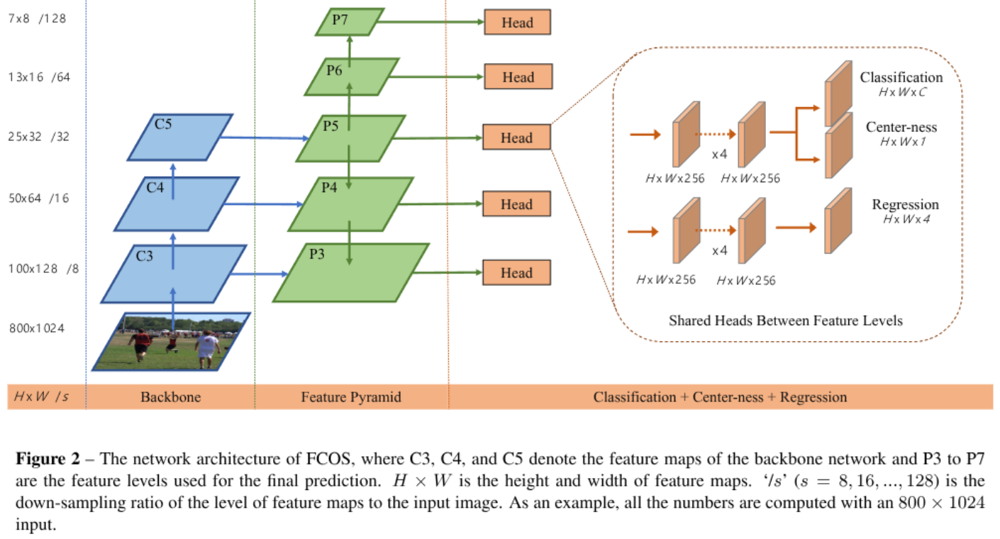

    - fuse the features:
      $$
      P_l = \operatorname{Conv}\bigl(\operatorname{Up}(P_{l+1}) + \operatorname{Lat}(C_l)\bigr)
      $$
      where:
  
      - $C_l$ is the backbone feature at level $l$
      - $\operatorname{Lat}(C_l)$ is a lateral projection, usually a $1\times1$ conv
      - $\operatorname{Up}(P_{l+1})$ is the upsampled higher-level pyramid feature
      - the sum merges the two
      - the final conv smooths the fused result
  
    - head：共享权重的检测头
  
      > [!NOTE]
      >
      > FCN(fully convolutional)与CNN的区域在把于CNN最后的全连接层换成卷积层，输出的是一张已经Label好的图片，不需要保持同样的尺寸
      
      - 归一化方法：使用Group Normalization
  
    Per location on a feature map, FCOS predicts three things： **classification, box regression, centerness**
  
    Box regression uses distances to four sides of the target box
    $$
    \mathbf{t} = (l, t, r, b)
    $$
    
  
    For a feature-map location mapped to image coordinates $(x, y)$ and a ground-truth box with corners $(x_0, y_0)$ and $(x_1, y_1)$
    $$
    l = x - x_0,\quad t = y - y_0,\quad r = x_1 - x,\quad b = y_1 - y
    $$
    Centerness down-weights locations near box edges: a **localization quality indicator**
    $$
    \text{centerness} =
    \sqrt{
    \frac{\min(l, r)}{\max(l, r)}
    \cdot
    \frac{\min(t, b)}{\max(t, b)}
    }
    $$
  
    > We employ sqrt here to slow down the decay of the centerness
  
    Final score at inference multiplies classification confidence and centerness
    $$
    s = \sigma(p_{\text{cls}})\cdot \sigma(p_{\text{ctr}})
    $$
    Training objective combines classification, regression, and centerness losses
    $$
    L = L_{\text{cls}} + \lambda L_{\text{reg}} + \gamma L_{\text{ctr}}
    $$
    A common regression choice in FCOS is IoU or GIoU loss
    $$
    L_{\text{reg}} = 1 - \mathrm{IoU}(B, B^{gt})
    $$
  
    $$
    L_{\text{reg}} = 1 - \mathrm{GIoU}(B, B^{gt})
    $$
  
  - Cons
    - FCOS的centerness分支在轻量级的模型上很难收敛
      - Sol: GFL 完美去掉了Centerness分支


### EfficientNet Zoo

### DETR Zoo

- DETR: check [here](01-Basic-Model-Zoo.md)

- __Deformable DETR: Deformable Transformers for End-to-End Object Detection.__ *Xizhou Zhu et al.* __arXiv, 2020__ [(Arxiv)](https://arxiv.org/abs/2010.04159) [(Video)](https://www.bilibili.com/video/BV1GB4y1X72R/?spm_id_from=333.337.search-card.all.click&vd_source=3a8e3df5af30a81c441200ce3c96e8fc) [(Code)](https://github.com/fundamentalvision/Deformable-DETR)

  - Takeaway: Deformable DETR replaces global dense attention with sparse, learnable **deformable attention** that focuses on a small set of key sampling points across multi-scale features, dramatically accelerating convergence and significantly improving small-object detection while preserving end-to-end training.

  - Motivation: slow convergence and limited feature spatial resolution and Global attention complexity: $\mathcal{O}(N^2)$ of DETR

    - Root causes: Global attention over full feature maps is inefficient and No effective multi-scale feature integration.

  - Core Mechanism

    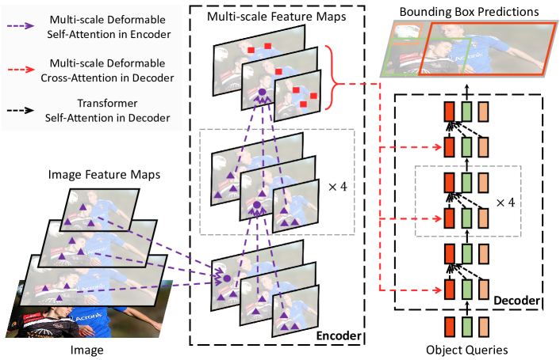

    1. Deformable Attention

       Instead of attending to **all spatial positions**, each query attends to a **small set of learned sampling points** around a reference point.

       Standard attention:
       $$
       \text{Attention}(Q,K,V) = \text{Softmax}\left(\frac{QK^T}{\sqrt{d}}\right)V
       $$
       Complexity:
       $$
       \mathcal{O}(HW \times HW)
       $$

       ------

       Deformable attention:
       $$
       \text{DeformAttn}(z_q, p_q, x) =
       \sum_{m=1}^{M}
       W_m
       \left[
       \sum_{k=1}^{K}
       A_{mqk} \cdot
       W'_m \, x\left(p_q + \Delta p_{mqk}\right)
       \right]
       $$

    2. Multi-Scale Deformable Attention

       Extends deformable attention to multiple feature levels:
       $$
       \text{MSDeformAttn}(z_q, \hat{p}_q) =
       \sum_{m=1}^{M}
       W_m
       \left[
       \sum_{l=1}^{L}
       \sum_{k=1}^{K}
       A_{mlqk} \cdot
       W'_m \, x_l(\phi_l(\hat{p}_q) + \Delta p_{mlqk})
       \right]
       $$
       

  - Pros:

    - faster convergence
    - Strong small-object performance.

  - Cons:

    - More complex implementation than vanilla DETR
    - CUDA custom ops required for efficiency

- __RT-DETRv2: Improved Baseline with Bag-of-Freebies for Real-Time Detection Transformer.__ *Wenyu Lv et al.* __ArXiv, 2024__ [(Arxiv)](https://arxiv.org/abs/2407.17140) [(S2)](https://www.semanticscholar.org/paper/1e030d91607e38b7b7fdd002123ca8baafbedc8f) [(Code)](https://github.com/lyuwenyu/RT-DETR?tab=readme-ov-file)(Citations __186__)

- __RT-DETRv4: Painlessly Furthering Real-Time Object Detection with Vision Foundation Models.__ *Zijun Liao et al.* __arXiv, 2025__ [(Arxiv)](https://arxiv.org/abs/2510.25257)

- __Dome-DETR: DETR with Density-Oriented Feature-Query Manipulation for Efficient Tiny Object Detection.__ *Zhangchi Hu et al.* __arXiv, 2025__ [(Arxiv)](https://arxiv.org/abs/2505.05741)
  - [check here](02-1-Small-Object.md)

### Shuffle-Net Zoo

- **ShuffleNet: An Extremely Efficient Convolutional Neural Network for Mobile Devices**. Xiangyu Zhang et.al. **arxiv**, **2017**, ([link](https://arxiv.org/abs/1707.01083v2)).

  - Takeaway: ShuffleNet designs extremely efficient CNNs using:

    - **Group Convolutions** to reduce computation,
    - **Channel Shuffle** to preserve information flow across groups, making it suitable for very low FLOP budgets.

  - Core Mechanism: Group convolutions and shuffling

    

    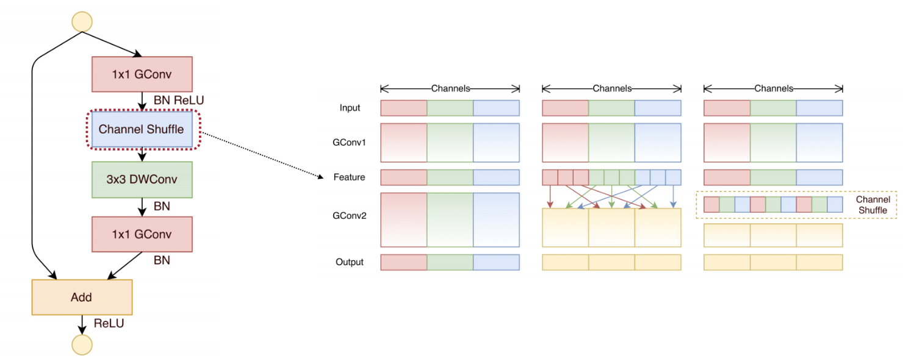

  - Cons

    - Channel shuffle pattern can be non-trivial for some inference engines.
    - Accuracy still limited compared to newer designs like MobileNet v3, GhostNet, MobileOne at similar budgets.

- __ShuffleNet V2: Practical Guidelines for Efficient CNN Architecture Design.__ *Ningning Ma et al.* __ArXiv, 2018__ [(Arxiv)](https://arxiv.org/abs/1807.11164) [(S2)](https://www.semanticscholar.org/paper/c02b909a514af6b9255315e2d50112845ca5ed0e) (Citations __6114__)

### DINO Zoo

- __DINO-X: A Unified Vision Model for Open-World Object Detection and Understanding.__ *Tianhe Ren et al.* __arXiv, 2024__ [(Arxiv)](https://arxiv.org/abs/2411.14347)

- __Grounding DINO: Marrying DINO with Grounded Pre-Training for Open-Set Object Detection.__ *Shilong Liu et al.* __arXiv, 2023__ [(Arxiv)](https://arxiv.org/abs/2303.05499) [(Code)](https://github.com/IDEA-Research/GroundingDINO)

### SAM

- __Artificial General Intelligence for Medical Imaging Analysis.__ *Xiang Li et al.* __IEEE Reviews in Biomedical Engineering, 2023__ [(Arxiv)](https://arxiv.org/abs/2306.05480) [(S2)](https://www.semanticscholar.org/paper/d818f40ea693a335e02f32dab520351d271c58bf) (Citations __57__)

### Small Object

[check here](02-1-Small-Object.md)

### SSD Zoo

- **SSD: Single Shot MultiBox Detector**. Liu Wei et.al. **No journal**, **2016**, ([link](https://doi.org/10.1007/978-3-319-46448-0_2)) [(Code)](https://github.com/sgrvinod/a-PyTorch-Tutorial-to-Object-Detection?tab=readme-ov-file).

  - Takeaway: SSD is a **single-stage, anchor-based** detector that predicts on **multi-scale feature maps** in one pass.

  - Motivation: YOLO showed that single-stage detection is fast but initially had localization and small-object issues. There was a need for a detector that:

    - is single-shot (no proposal stage),
    - uses multi-scale features for better small-object detection,
    - keeps good speed–accuracy trade-of

  - Core Mechanism: Architecture

    ```
    backbone+FPN+head
    ```

    - Use a backbone network (e.g., VGG, MobileNet) and attach **extra conv layers** to produce a **feature pyramid**.
    - On each selected feature map:
      - Define a set of **default boxes (anchors)** with different aspect ratios and scales.
      - Use small conv filters to predict:
        - class scores for each default box,
        - bounding box offsets for each default box.
    - Combine predictions from all feature maps and apply NMS.

    

    > [!NOTE]
    >
    > This is why it's called **single-shot**: All predictions happen in **one forward pass**, **on multiple scales**.

  - Pros:

    - Eliminate proposal generation and resampling entirely.
    - Multi-scale feature maps improve detection across object sizes.

  - Cons:

    - Performance on **very small objects** is weaker than some later methods (e.g., FPN-based detectors), since SSD relies on relatively shallow high-resolution maps with limited semantics.
    - The hand-designed scales/aspect ratios of default boxes require tuning for new datasets

### MobileOne

- **MobileOne: An Improved One millisecond Mobile Backbone**. Pavan Kumar Anasosalu Vasu et.al. **arxiv**, **2022**, ([link](https://arxiv.org/abs/2206.04040v2)).

  - Takeaway: MobileOne trains **multi-branch** blocks, then **fuses to a single conv** for fast mobile inference.

  - Motivation: Structural reparameterization (e.g., RepVGG) shows we can **train multi-branch, infer single-branch** by fusing conv+BN branches into one conv.

    > [!IMPORTANT]
    >
    > The relationship between these two indicators(**floating-point operations (FLOPs) and parameter count**) and the specific latency of the model is not so clear. For the **specific latency**, we should also consider **memory access cost(MAC) and degree of parallelism.**

  - Core Mechanism: Architectural Blocks(MobileOne block)

    

    Use structural re-parameterization to decouple the *training* architecture from the *inference* architecture

    - training time: each of those convs (depthwise and pointwise) is expanded into a multi-branch structure (over-parameterized)

    - inference time: all these branches are algebraically fused into a single conv per stage, so the runtime block is very simple

      > Straight cylinder shape： this structure is chosen to minimize latency and memory access cost on mobile hardware.

    - the DSC module is integrated by "scale branch", "skip branch" and "conv branches"

      - `rbr_scale`: center-only 1×1 path (after padding) that improves channel-wise scaling flexibility
      - `rbr_skip`: identity + BN path providing residual-like behavior and extra affine freedom
      - `rbr_conv`: main expressive conv paths (3×3 or 1×1)

    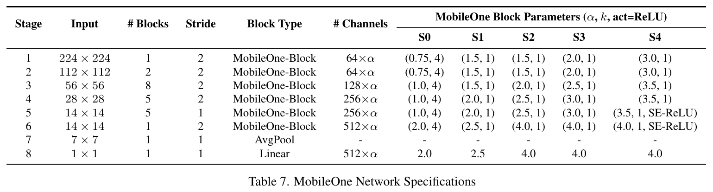

  - Pros

    - Extremely fast at inference due to: Single-path structure/Fewer ops, better cache behavior.

  - Cons

    - Once fused, the model loses its multi-branch flexibility (harder to fine-tune structurally).

### Vit Zoo

- __An Image is Worth 16x16 Words: Transformers for Image Recognition at Scale.__ *Alexey Dosovitskiy et al.* __ArXiv, 2020__ [(Arxiv)](https://arxiv.org/abs/2010.11929) [(S2)](https://www.semanticscholar.org/paper/268d347e8a55b5eb82fb5e7d2f800e33c75ab18a) (Citations __52634__)

  - Takeaway: ViT tokenizes image **patches** and runs a **Transformer encoder** with global self-attention.

  - Motivation: Try transformer in vision.

  - Core Machanism:

    ViT replaces convolution with **patch-level tokens** processed by a **Transformer encoder**.

    - the input of transformer encoder includes: $N$ patches vecters of $D$ dimension concats the `[CLS]` token which is one vector of D dimension. And add the positional embedding by element-wise addition.

      ```
      encoder input = patch embeddings + class token + positional embeddings.
      ```

    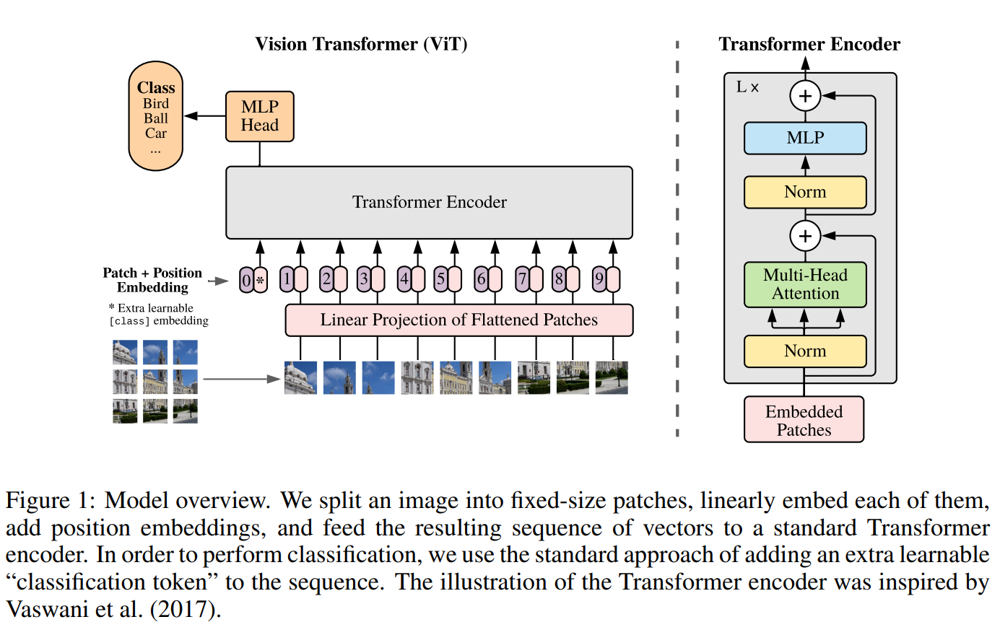

  - Pros

    - Global Receptive Field from the Start
    - Foundation for Many Vision Transformers

  - Cons

    - Requires Large-Scale Data
    - Quadratic Cost of Self-Attention

- __FastViT: A Fast Hybrid Vision Transformer using Structural Reparameterization.__ *Pavan Kumar Anasosalu Vasu et al.* __arXiv, 2023__ [(Arxiv)](https://arxiv.org/abs/2303.14189) 

  > MobileOne 原班人马打造，可以看做是 MobileOne 的方法在 Transformer 上的一个改进型的应用

  - Takeaway: a hybrid vision transformer architecture that obtains the state-of-the-art latency-accuracy trade-off. 引入了一种新的 token mixer，叫做 RepMixer，它使用结构重新参数化技术，通过删除网络中的 Shortcut 来降低内存访问成本。效果也很好

  - Core Mechanism

    - Architecture: FastViT 是一个 hybrid vision transformer，也就是混合式视觉 Transformer。作者把网络分成了四个 stage。前 3 个 stage 主要用 RepMixer 来做 token mixing，第 4 个 stage 才使用 self attention

      

      - 每个stage分辨率减半，通道数加倍

    - a new token mixer: RepMixer。它的目标不是像标准注意力那样做全局交互，而是更像一个高效的局部信息搅拌器，用深度卷积去混合空间信息。下面介绍一下主要特点

      > [!TIP]
      >
      > skip connection由于增加了内存访问成本 (memory access cost)，这些跳过连接在延迟方面占了很大的开销。所以这里想到了使用**结构重参数化**来删除 skip-connection
    
      1. use structural reparameterization to remove skip connection
    
      2. 为主要的层添加一些过参数化的额外的分支，以在训练时提升模型的精度，在推理时全部消除
    
      3. 使用了大核卷积在前几个阶段替换掉 self-attention
    
         主要是在FFN和Patch Embedding中加入


### Others

- __Spatial Pyramid Pooling in Deep Convolutional Networks for Visual Recognition.__ *Kaiming He et al.* __IEEE Transactions on Pattern Analysis and Machine Intelligence, 2014__ [(Arxiv)](https://arxiv.org/abs/1406.4729) [(S2)](https://www.semanticscholar.org/paper/cbb19236820a96038d000dc629225d36e0b6294a) (Citations __12112__)

  - Takeaway: SPP uses **multi-level pooling** to produce fixed-length features from **any input size**.

  - Motivation: Before SPP, standard CNN (e.g., AlexNet, VGG-style networks) required **fixed-size inputs**

  - Core Mechanism

    Apply pooling over **spatial bins of different granularities**, producing a **fixed-dimensional output** independent of the input feature map size.

  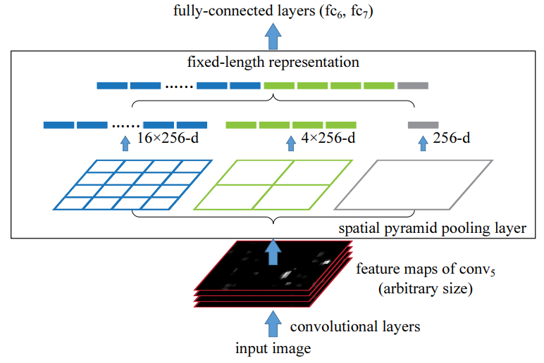

- __VarifocalNet: An IoU-aware Dense Object Detector.__ *Haoyang Zhang et al.* __2021 IEEE/CVF Conference on Computer Vision and Pattern Recognition (CVPR), 2020__ [(Arxiv)](__VarifocalNet: An IoU-aware Dense Object Detector.__ *Haoyang Zhang et al.* __2021 IEEE/CVF Conference on Computer Vision and Pattern Recognition (CVPR), 2020__ [(Arxiv)](https://arxiv.org/abs/2008.13367) [(S2)](https://www.semanticscholar.org/paper/14c3510e4f4b370d5cd0420037406024533f4b6f) (Citations __851__)) [(S2)](https://www.semanticscholar.org/paper/14c3510e4f4b370d5cd0420037406024533f4b6f) (Citations __1305__)

- __A Dual Weighting Label Assignment Scheme for Object Detection.__ *Shuai Li et al.* __2022 IEEE/CVF Conference on Computer Vision and Pattern Recognition (CVPR), 2022__ [(Arxiv)](https://arxiv.org/abs/2203.09730) [(S2)](https://www.semanticscholar.org/paper/8e68ea6bf41335d341cf629fa03b91463531bf98) (Citations __100__)

- __Once for All: Train One Network and Specialize it for Efficient Deployment.__ *Han Cai et al.* __ArXiv, 2019__ [(Arxiv)](https://arxiv.org/abs/1908.09791) [(S2)](https://www.semanticscholar.org/paper/7823292e5c4b05c47af91ab6ddf671a0da709e82) (Citations __1414__)

- __PBADet: A One-Stage Anchor-Free Approach for Part-Body Association.__ *Zhongpai Gao et al.* __ArXiv, 2024__ [(Arxiv)](https://arxiv.org/abs/2402.07814) [(S2)](https://www.semanticscholar.org/paper/1ba604d5766f632f5430b8a5d8f9d656645ac8a6) (Citations __1__)

  - Takeaway: PBADet predicts part boxes plus a **part → body-center offset** for one-stage association.

    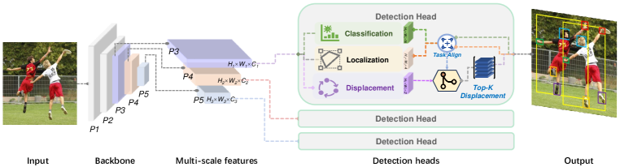

  - Motivation: Earlier pipelines often used **two-stage** designs (detect bodies and parts separately, then associate) or **body → part offsets** (e.g., predicting multiple offsets from each body to many parts), which can become **channel-heavy** as part types grow and can be brittle under occlusion/invisibility. PBADet instead flips the direction to **part → body** with a single universal offset.

  - Core Mechanism: For each part candidate (dense point/feature location), PBADet predicts:

    1. the **part bounding box** + classification, and
    2. a **2D vector** that points from the part to its **owning body center**.
        This keeps the association head **constant-sized** regardless of the number of part categories.

  - Pros:

    - Simple & fast: one-stage, anchor-free; lightweight association head
    - Scalable: offset head does **not** grow with part category count

  - Cons:

    - **Still relies on post-processing matching** (not fully end-to-end assignment)
    - **Sensitive to body detection quality**: missed/shifted body boxes can break association. Crowded/overlapping people may confuse the assignments.

- __TOOD: Task-aligned One-stage Object Detection.__ *Chengjian Feng et al.* __2021 IEEE/CVF International Conference on Computer Vision (ICCV), 2021__ [(Arxiv)](https://arxiv.org/abs/2108.07755) [(S2)](https://www.semanticscholar.org/paper/7438524bf00d7c5a22cb8799797f57c3a794b220) (Citations __1029__)


## Loss Function

check the [OD-Loss-Zoo](./03-OD-Loss-Zoo)

## Module Design

chech the [Module Design](../../../Efficient-AI/02-Module-Design.md)

## References

- [Depthwise Convolution explanation]( https://towardsdatascience.com/a-basic-introduction-to-separable-convolutions-b99ec3102728)
- [MobileNetv2 explanation]( https://ai.googleblog.com/2018/04/mobilenetv2-next-generation-of-on.html)
- [MobileNetV2 explained video](https://www.youtube.com/watch?v=DkNIBBBvcPs)
- [MobileNetV1_intro](https://research.google/blog/mobilenets-open-source-models-for-efficient-on-device-vision/?_gl=1)
- [Selective-search](https://learnopencv.com/selective-search-for-object-detection-cpp-python/)
