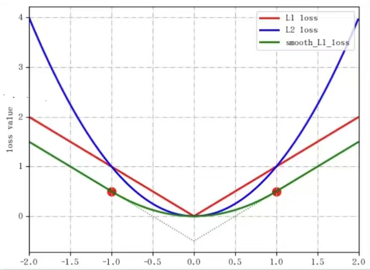
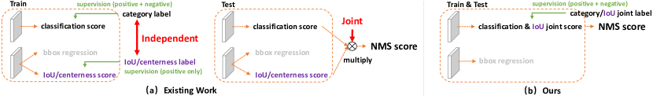
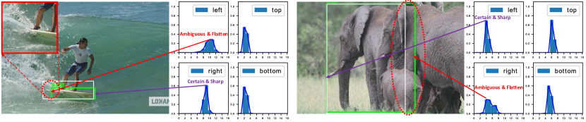
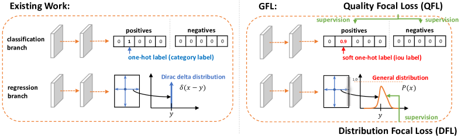
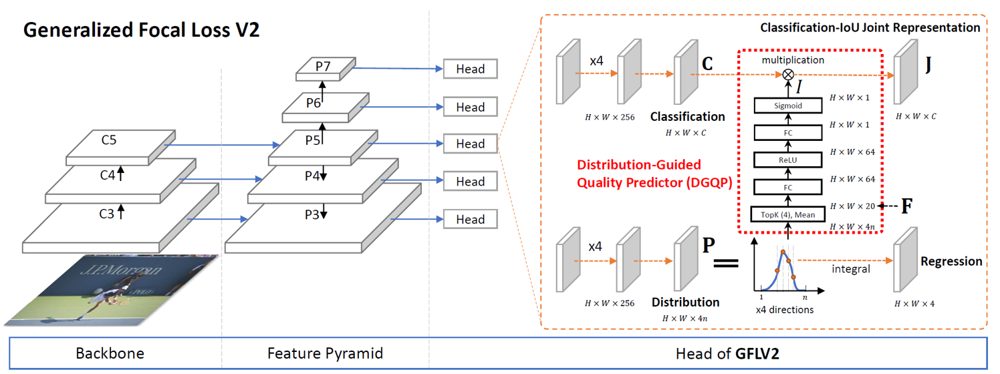
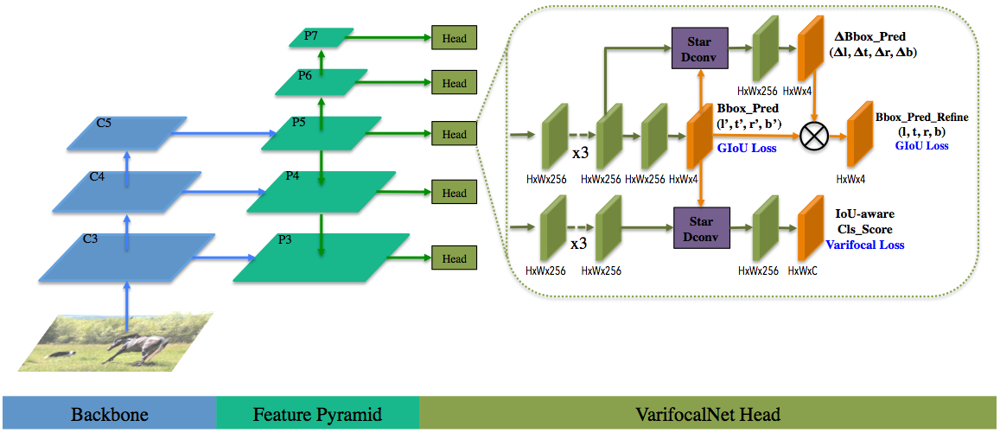
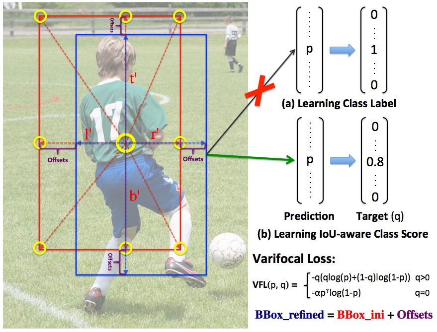
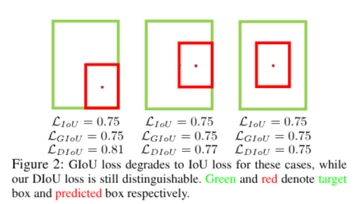

# Object Detection Loss Zoo

Focus on object detection loss function

## Basic Loss

Just check the [Loss function document](https://docs.pytorch.org/docs/stable/generated/torch.nn.modules.loss.L1Loss.html) which includes the math formula and how to use it in pytorch.

- smooth L1: 

  **Fast R-CNN**. Ross Girshick et.al. **arxiv**, **2015**, ([link](https://arxiv.org/abs/1504.08083v2)).

  - Core Mechanism:

    对单一维度的回归误差
    $$
    x = y - y^{gt}
    $$
    Smooth L1 定义为
    $$
    \mathrm{SmoothL1}(x) =
    \begin{cases}
    0.5 x^2, & |x| < 1 \\
    |x| - 0.5, & \text{otherwise}
    \end{cases}
    $$
    

    对四个回归参数 $(t_x, t_y, t_w, t_h)$ 分别计算总损失为
    $$
    L_{\text{reg}} = \sum_{i \in \{x,y,w,h\}} \mathrm{SmoothL1}(t_i - t_i^{gt})
    $$

  - Pros

    - 相比 L2，避免了大误差带来的梯度爆炸，对 outliers less sensitive
    - 相比 L1，在小误差区域提供连续梯度，收敛更快
    - 与 IoU 无关，优化的是参数空间而非几何重叠

  - Cons

    - 回归目标是参数偏移，不直接反映定位质量。计算Bounding Box的4个坐标值和GT框之间的误差，然后将这4个loss进行相加构成回归损失，但是这种做法假设Bounding Box的4个点是相互独立的，实际上其有一定相关性

## Focal Loss

- __Focal Loss for Dense Object Detection.__ *Tsung-Yi Lin et al.* __IEEE Transactions on Pattern Analysis and Machine Intelligence, 2017__ [(Arxiv)](https://arxiv.org/abs/1708.02002) [(S2)](https://www.semanticscholar.org/paper/1a857da1a8ce47b2aa185b91b5cb215ddef24de7) (Citations __3113__)

  - Takeaway: Focal Loss down-weights easy negatives to handle dense class imbalance.

  - Motivation:

    - **positive vs. negative class imbalance problem**: Dense detectors evaluate a huge number of candidate locations. Most are easy background.

    - **easy vs. hard example problem**: Standard Cross Entropy is dominated by these **easy negatives**, which hurts training and recall for rare positives.

  - Core Mechanism:

    - Start from binary cross entropy. Let $y\in\{0,1\}$ be the label and $p\in[0,1]$ be the model’s predicted probability for class $1$. Define
      $$
      p_t =
      \begin{cases}
      p & \text{if } y=1\\
      1-p & \text{if } y=0
      \end{cases}
      $$

    - **Cross Entropy**
      $$
      \mathrm{CE}(p_t) = -\log(p_t)
      $$

    - **Focal Loss**: addresses the **easy vs. hard example problem**
      $$
      \mathrm{FL}(p_t) = -(1-p_t)^{\gamma}\log(p_t)
      $$
      where $\gamma \ge 0$ is the focusing parameter.

      - If an example is easy, $p_t$ is near 1, then $(1-p_t)^\gamma$ is near 0, so its loss contribution is heavily reduced.
      - If an example is hard, $p_t$ is small, the modulating factor stays large, so it gets more weight.

    - **Alpha-balanced Focal Loss**: addresses the **positive vs. negative class imbalance problem**
      $$
      \mathrm{FL}(p_t) = -\alpha_t (1-p_t)^{\gamma}\log(p_t)
      $$
      with
      $$
      \alpha_t =
      \begin{cases}
      \alpha & \text{if } y=1\\
      1-\alpha & \text{if } y=0
      \end{cases}
      $$
      $\alpha$ helps balance positive and negative classes.

    - Multi-class version is typically applied per class using sigmoid outputs, treating each class as a one-vs-rest binary problem:
      $$
      \mathrm{FL} = \sum_{c=1}^{C} -\alpha_{t,c}(1-p_{t,c})^\gamma \log(p_{t,c})
      $$

  - Pipeline:

    - Train classification with Focal Loss instead of standard cross entropy
    - Train box regression with a standard localization loss such as Smooth L1 or IoU-based losses

  - Pros:

    - Handles dense imbalance without explicit hard negative mining

    - Improves recall and precision for rare positives

    - Simple drop-in replacement for classification loss

    - Works well with large-scale dense detection heads

  - Cons:

    - Adds hyperparameters $\gamma$ (common $\gamma$ = 2) and $\alpha$ that need tuning

    - If $\gamma$ is too large, learning can underfit easy but important examples

    - Does not directly address localization quality ranking or NMS limitations, it mainly fixes classification imbalance

      > [!TIP]
      >
      > Localization quality refers to **how well a predicted box aligns with the ground-truth box**, usually measured by **IoU**. After a detector predicts many boxes, it needs to **rank** them by confidence score before applying NMS.

      - localization quality ranking: Classification score only reflects **class confidence** so a box with **high class score but poor IoU** may be ranked above

      > [!NOTE]
      >
      > So some works try to combine the classification score and the classification quality estimation (simple multiply), but new problems occur, check the Generalized Focal Loss to see how to solve it.

      - NMS limitations: the **highest score box is the best localized one** which is wrong.

- __Generalized Focal Loss: Learning Qualified and Distributed Bounding Boxes for Dense Object Detection.__ *Xiang Li et al.* __ArXiv, 2020__ [(Arxiv)](https://arxiv.org/abs/2006.04388) [(S2)](https://www.semanticscholar.org/paper/da60e046aac895b5775ed34bde45beb86aad0fe8) [(Code)](https://github.com/implus/GFocal?tab=readme-ov-file)(Citations __1544__)

  > Good Intro: [大白话](https://zhuanlan.zhihu.com/p/147691786)
  >
  > 良心技术，**别问，问就是无cost涨点**

  - Takeaway: *Generalized Focal Loss (GFL)* improves dense one-stage object detection by

    1. predicting a **joint class score that already encodes localization quality** (so training and inference are consistent), 
    2. regressing boxes as **distributions** rather than single deterministic values, which better handles ambiguity and uncertainty.

  - Motivation:

    Consider three fundamental elements: **quality estimation, classification and localization**

    - Situation: Dense detectors typically treat detection as **classification + box regression**.

      Classification often uses **Focal Loss**, while box regression is learned as a **single point value** (Dirac-delta–like target).

    - Con 1: Inconsistent usage of localization quality estimation and classification score between training and inference:

      - not end-to-end causing the gap. Trained independently but compositely utilized (e.g., multiplication) during inference
      - The supervision of the localization quality estimation is currently assigned for positive samples only, which is unreliable as negatives may get chances to have uncontrollably higher quality predictions

      

    - Con 2: Inflexible representation of bounding boxes:

      Deterministic box regression (Dirac delta distribution for localization) is inflexible when boundaries are uncertain (occlusion, blur, crowded scenes). 我们希望用一种general的分布去建模边界框的表示, so we want a "distribution"

      

  - Core Mechanism:

    two loss: Quality Focal Loss (QFL), Distribution Focal Loss (DFL) and summarize them into GFL

    - **QFL (Quality Focal Loss):** Solve "Does classification score reflect positioning quality?

      extends focal loss to **soft/continuous targets** for the joint class-quality score. Add focal loss part on BCE loss
      $$
      \mathrm{QFL}(p,y)
      =
      |y - p|^{\beta}
      \left(
      - y \log p - (1-y)\log(1-p)
      \right).
      $$

      - 正样本把分数学成质量值: 正样本时如果 $p$ 偏离 $y$ 很大，loss 被放大

      - 负样本依旧具有 focal 的“抑制容易负样本”效果

      > [!TIP]
      >
      > For multi-class implementation, use sigmoid operation marked as $\sigma$ 

      

    - **DFL (Distribution Focal Loss):** Solve "Can regression express positioning uncertainty?"

      For bounding box regression, each side offset is modeled as a **discrete distribution**.

      Let the continuous regression target be
      $$
      y \in [0, n],
      $$
      and the predicted distribution be
      $$
      \mathbf{p} = (p_0, p_1, \dots, p_n),
      \quad \sum_{i=0}^{n} p_i = 1.
      $$

      > Discretize the continuous regression problem

      Let
      $$
      i = \lfloor y \rfloor, \quad i+1 = \lceil y \rceil.
      $$
      The Distribution Focal Loss is defined as
      $$
      \mathrm{DFL}(\mathbf{p}, y)
      =
      - \big(
      (y_{i+1}-y)\log p_i
      +
      (y - y_i)\log p_{i+1}
      \big),
      $$
      where $y_i = i$ and $y_{i+1} = i+1$.

      > [!TIP]
      >
      > Without using one-hot

      This enforces probability mass concentration around the true continuous target.

      > [!NOTE]
      >
      > Why can't we just use expectation regression? -- Many different distributions may have the same expectation which leads to low learning efficiency and inaccurate positioning

    - GFL： A unified set of perspectives and training objectives

      The final training objective in GFL-based detectors is
      $$
      \mathcal{L}
      =
      \frac{1}{N_{\text{pos}}}
      \sum_i \mathcal{L}_{\text{QFL},i}
      +
      \frac{1}{N_{\text{pos}}}
      \sum_i \mathbb{1}_{\{i \in \text{pos}\}}
      \left(
      \mathcal{L}_{\text{IoU},i}
      +
      \mathcal{L}_{\text{DFL},i}
      \right).
      $$
      Here:

      - $\mathcal{L}_{\text{QFL}}$ is applied to all samples
      - $\mathcal{L}_{\text{IoU}}$ is an IoU-based regression loss (e.g. GIoU)
      - $\mathcal{L}_{\text{DFL}}$ is applied to positive samples only

  - Pros:

    - **Fixes train–test inconsistency**: no separate quality branch that’s used differently at inference
    - **Better localization**: distributional regression captures uncertainty and improves box accuracy
    - **Stronger ranking of detections**: scores correlate better with actual localization quality
    - **Drop-in upgrade** for many dense detection frameworks (the idea is modular)

  - Cons:

    - **More computation/memory** than plain scalar box regression (predicting distributions over bins)
    - **Extra hyperparameters** (e.g., number of bins / reg_max, loss weights) can affect performance
    - **Not a full solution to crowded-scene assignment** by itself—still depends on the label assignment strategy and NMS behavior

| Component  | Hyperparameter | Typical value              |
| ---------- | -------------- | -------------------------- |
| Focal Loss | $\gamma$       | 2.0                        |
| Focal Loss | $\alpha$       | 0.25 (often omitted later) |
| QFL        | $\beta$        | 2.0                        |
| DFL        | reg_max        | 16                         |
| DFL        | weight         | 0.25                       |

- __Generalized Focal Loss V2: Learning Reliable Localization Quality Estimation for Dense Object Detection.__ *Xiang Li et al.* __2021 IEEE/CVF Conference on Computer Vision and Pattern Recognition (CVPR), 2020__ [(Arxiv)](https://arxiv.org/abs/2011.12885) [(S2)](https://www.semanticscholar.org/paper/cd9a2b4578fbd812fea5d31e5b8e778f13e352c0) [(code)](https://github.com/implus/GFocalV2?tab=readme-ov-file) (Citations __282__)

  > check the [大白话](https://zhuanlan.zhihu.com/p/313684358)
  >
  > 无cost，涨幅在1~2个点AP，良心

  - Takeaway: GFLV2 predicts IoU quality from box **distribution statistics** via a tiny DGQP for more reliable quality estimation.

  - Motivation

    - Many methods estimate quality from shared **convolution features** in the classification or regression branches. localization quality estimation (LQE)
    - GFLV1 produces a general distribution. Since the shape of the distribution is very related to the real positioning quality, why don't we take advantage of it and use statistics that can express the shape of the distribution to guide the estimation of the final positioning quality?

  - Core Mechanism

    

    - **General distribution for box edges**
      Classic regression can be written as a Dirac delta expectation
      $$
      y=\int_{-\infty}^{+\infty}\delta(x-y)\,x\,dx
      $$
      GFL style regression represents each edge by a distribution $P(x)$ and estimates it by expectation over a discretized range
      $$
      \hat{y}=\int_{-\infty}^{+\infty}P(x)\,x\,dx
      $$
      Discretized form
      $$
      \hat{y}=\sum_{i=0}^{n}P(y_i)\,y_i
      $$

    - **Decomposed joint score**
      GFLV2 explicitly decomposes the joint score into classification $C$ and IoU scalar $I$, then forms the joint representation $J$ for both training and inference
      $$
      J=C\times I
      $$
      where $C=[C_1,\dots,C_m]$ and $I\in[0,1]$.

    - **DGQP predicts IoU from distribution statistics**
      For each side $w\in\{l,r,t,b\}$, the discrete distribution is
      $$
      P_w=[P_w(y_0),P_w(y_1),\dots,P_w(y_n)]
      $$
      Build a statistical feature by concatenating Top k values plus the mean from each side distribution
      $$
      F=\mathrm{Concat}\big(\mathrm{Topk}_m(P_w)\mid w\in\{l,r,t,b\}\big)
      $$
      Then DGQP maps $F$ to an IoU scalar with two FC layers
      $$
      I=\mathcal{F}(F)=\sigma\big(W_2\,\delta(W_1F)\big)
      $$
      with ReLU $\delta$ and Sigmoid $\sigma$. The paper reports a typical setting $k=4$, hidden dim $p=64$.

      > Just sort or select make it lightwight

- __VarifocalNet: An IoU-aware Dense Object Detector.__ *Haoyang Zhang et al.* __2021 IEEE/CVF Conference on Computer Vision and Pattern Recognition (CVPR), 2020__ [(Arxiv)](https://arxiv.org/abs/2008.13367) [(S2)](https://www.semanticscholar.org/paper/14c3510e4f4b370d5cd0420037406024533f4b6f) (Citations __854__)

  - Takeaway: predicts an IoU-aware classification score directly and trains it with Varifocal Loss (VFL), **aligning classification confidence with localization quality** and improving ranking for dense one-stage detectors.

  - Motivation

    - Dense detectors often **decouple classification and localization quality**, then multiply scores at inference, causing train-test mismatch and poor ranking of low-quality boxes.
    - Standard Focal Loss treats all positive samples equally, even if their IoU quality varies widely.

  - Core Mechanism

    
  
    
  
    > Figure 1:An illustration of our method. Instead of learning to predict the class label (a) for a bounding box, we learn the IoU-aware classification score (**IACS**) as its detection score which merges the object presence confidence and localization accuracy (b). We propose a **varifocal loss** for training a dense object detector to predict the IACS, and a star-shaped bounding box feature representation (the features at nine yellow sampling points) for IACS prediction. With the new representation, we refine the initially regressed box (in red) into a more accurate one (in blue).
  
    - **IoU-aware classification target**
      Use a soft target $q \in [0,1]$ for each positive sample, typically the IoU between the predicted box and its matched GT. Negatives have $q=0$.
  
    - **Varifocal Loss (VFL)**
      Modify Focal Loss to handle soft targets and emphasize high-quality positives while down-weighting easy negatives.
  
      Intuition:
      - High-IoU positives get larger weights, so the classifier learns to rank high-quality boxes higher.
      - Low-quality positives contribute less, reducing noisy gradients.
      - Easy negatives are down-weighted similarly to Focal Loss.
  
      $$
      \mathrm{VFL}(p,q)=
      \begin{cases}
      -q\big(q\log p + (1-q)\log(1-p)\big), & q>0 \\
      -\alpha\,p^{\gamma}\log(1-p), & q=0
      \end{cases}
      $$
      where $p$ is the predicted IoU-aware classification score and $q$ is the target (IoU).
      
      - $q>0$ (positive): soft IoU target, higher-quality positives get larger weight.
      - $q=0$ (negative): focal-style down-weighting for easy negatives.
  
      > [!NOTE]
      >
      > - 正样本部分：模型希望 $p \approx q$, 类似于BCE(soft label: q)
      
    - **IoU-aware score for NMS**
      The classification head directly outputs the quality-aware score used for ranking at inference (no extra quality branch).
  
  - Pros
  
    - Better score-ranking consistency between training and inference
    - Improved AP, especially for higher IoU thresholds
    - Drop-in for dense heads with minor changes
  
  - Cons
  
    - Requires IoU target computation for positives during training
    - Gains depend on assignment strategy and regression quality
    - Extra hyperparameters (VFL focusing terms) may need tuning

## IoU Loss

- __UnitBox: An Advanced Object Detection Network.__ *Jiahui Yu et al.* __Proceedings of the 24th ACM international conference on Multimedia, 2016__ [(Arxiv)](https://arxiv.org/abs/1608.01471) [(S2)](https://www.semanticscholar.org/paper/22264e60f1dfbc7d0b52549d1de560993dd96e46) (Citations __1614__)

  - Takeaway: introduce the IoU loss.

  - Core Mechanism: 

    - Idea: It abandons coordinate-offset regression and **directly optimizes box overlap**, aligning training objective with detection evaluation.

    - Intersection over Union (IoU) 
      $$
      \mathrm{IoU}(B, B^{gt}) = \frac{|B \cap B^{gt}|}{|B \cup B^{gt}|}
      $$

    - IoU Loss
      $$
      L_{\mathrm{IoU}} = 1 - \mathrm{IoU}(B, B^{gt})
      $$

  - Pros

    - Scale-invariant and directly reflects localization accuracy
    - Penalizes poor overlap rather than coordinate error

  - Cons

    - IoU loss only works when the bounding boxes have overlap, and would not provide any moving gradient for non-overlapping cases.
    - Performance degrades for distant or poorly initialized predictions.

- __Generalized Intersection Over Union: A Metric and a Loss for Bounding Box Regression.__ *S. H. Rezatofighi et al.* __2019 IEEE/CVF Conference on Computer Vision and Pattern Recognition (CVPR), 2019__ [(Arxiv)](https://arxiv.org/abs/1902.09630) [(S2)](https://www.semanticscholar.org/paper/889c81b4d7b7ed43a3f69f880ea60b0572e02e27) (Citations __5066__)

  - Takeaway: proposes **Generalized IoU** as both a **metric** and a **loss** for bounding box regression.

  - Motivation

    - when two boxes **do not overlap**, IoU is zero and provides **no useful gradient**

  - Core Mechanism

    - Generalized IoU

      Idea: Add a term that measures how well the two boxes fit inside their **smallest enclosing box**.

      Smallest enclosing box: Let $C$ be the smallest box that encloses both $A$ and $B$.

      Generalized IoU
      $$
      \mathrm{GIoU}(A,B)=\mathrm{IoU}(A,B)-\frac{|C\setminus (A\cup B)|}{|C|}
      $$
      GIoU loss
      $$
      L_{\mathrm{GIoU}} = 1-\mathrm{GIoU}(A,B)
      $$
      Intuition

      - If $A$ and $B$ overlap well, the second term is small, GIoU is close to IoU.
      - If $A$ and $B$ do not overlap, IoU is 0 but the enclosing-box penalty drives the prediction toward the target.

  - Pros

    - Provides gradients even when predicted and GT boxes are disjoint.

  - Cons

    - Still not explicitly optimizing some important geometry cues like center distance and aspect ratio alignment, which later methods target.

      > [!TIP]
      >
      > Just answer how much they overlap, not answer how well they overlap

    - slow convergence especially for the boxes at horizontal and vertical orientations

- __Distance-IoU Loss: Faster and Better Learning for Bounding Box Regression.__ *Zhaohui Zheng et al.* __ArXiv, 2019__ [(Arxiv)](https://arxiv.org/abs/1911.08287) [(S2)](https://www.semanticscholar.org/paper/63a243afcb133569a962c41e9db956c076c5c4f3) (Citations __4404__) DIoU/CIoU

  - Takeaway: DIoU/CIoU add **center distance** (and **aspect ratio** for CIoU) to IoU loss for faster, better regression.

  - Motivation:

    - GIou just answers how much they overlap, doesn`t answer how well they overlap.

  - Core Mechanism

    Generally, the IoU-based loss can be defined as
    $$
    \mathcal{L} = 1 - \mathrm{IoU} + \mathcal{R}(B, B^{gt})
    $$
    where $\mathcal{R}(B, B^{gt})$ is the penalty term for the predicted box $B$ and the target box $B^{gt}$. By designing proper penalty terms.

    - Distance IoU Loss

      Idea: Add a **geometric cue** into the loss -- **Center alignment**
      $$
      L_{\mathrm{DIoU}} = 1 - \mathrm{IoU}(B, B^{gt}) + \frac{\rho^2(b, b^{gt})}{c^2}
      $$
      Notation

      - Pred box $B$, GT box $B^{gt}$
      - Box centers $b$, $b^{gt}$
      - $\rho(\cdot,\cdot)$ is Euclidean distance
      - $c$ is the diagonal length of the smallest enclosing box covering both $B$ and $B^{gt}$

      

    - Complete IoU Loss: add an aspect ratio consistency term

      Idea: Align centers, overlap, and shape at the same time.
      $$
      L_{\mathrm{CIoU}} = 1 - \mathrm{IoU}(B, B^{gt}) + \frac{\rho^2(b, b^{gt})}{c^2} + \alpha v
      $$

      $$
      v = \frac{4}{\pi^2}\left(\arctan\frac{w^{gt}}{h^{gt}} - \arctan\frac{w}{h}\right)^2
      $$

      $$
      \alpha = \frac{v}{(1-\mathrm{IoU}(B, B^{gt})) + v}
      $$

      - $\alpha$ is a positive trade-off parameter
      - $v$ measures the consistency of aspect ratio

    - DIoU-NMS: suggest that DIoU is a better criterion for NMS

  - Pros

    - Works better than plain IoU loss when boxes do not overlap or barely overlap, because center distance gives a useful gradient signal.
    - CIoU faster convergence in practice, especially early training.

  - Cons

    - CIoU introduces additional terms and can be slightly more sensitive to noisy aspect ratios in some datasets.
    - Benefits depend on detector design and assignment strategy, some setups may see smaller gains.

- __SIoU Loss: More Powerful Learning for Bounding Box Regression.__ *Zhora Gevorgyan.* __ArXiv, 2022__ [(Arxiv)](https://arxiv.org/abs/2205.12740) [(S2)](https://www.semanticscholar.org/paper/406b457cf2dc9a62417b05b755ef5434df0a4d33) (Citations __827__)

  - Takeaway: SIoU extends IoU-based regression by adding **angle-aware distance** and **shape** costs, which guides boxes to move in a more direct path toward the target and speeds convergence.

  - Motivation

    - GIoU/DIoU/CIoU improve overlap and center distance, but still ignore the **direction** of the required correction.
    - When centers are far apart, regression can take inefficient paths, slowing convergence.

  - Core Mechanism

    SIoU = Angle cost + Distance cost + Shape cost + IoU cost

    - **Angle cost**
      Encourage the center offset to align with the axis that yields the most direct correction, reducing unnecessary movement.

    - **Distance cost**
      Uses normalized center distance, modulated by the angle term so the model favors axis-aligned corrections and converges faster.

    - **Shape cost**
      Penalizes width/height mismatch via scale-aware terms, encouraging consistent aspect ratios.

    - **Overall loss**
      $$
      \Lambda=\sin\!\left(2\sin^{-1}\!\frac{\min(|x-x^{gt}|,\;|y-y^{gt}|)}{\sqrt{(x-x^{gt})^2+(y-y^{gt})^2+\epsilon}}\right)
      $$
      $$
      \Delta=\frac{1}{2}\sum_{t\in\{x,y\}}\left(1-e^{-\gamma\rho_t}\right),\quad \gamma=2-\Lambda
      $$
      $$
      \rho_x=\frac{(x-x^{gt})^2}{W_g^2},\quad \rho_y=\frac{(y-y^{gt})^2}{H_g^2}
      $$
      $$
      \Omega=\frac{1}{2}\sum_{t\in\{w,h\}}\left(1-e^{-\omega_t}\right)^{\theta},\quad \theta=4
      $$
      $$
      \omega_w=\frac{|w-w^{gt}|}{\max(w,w^{gt})},\quad \omega_h=\frac{|h-h^{gt}|}{\max(h,h^{gt})}
      $$
      $$
      L_{\mathrm{SIoU}} = 1 - \mathrm{IoU} + \frac{\Delta+\Omega}{2}
      $$
      
      - $\Lambda$ captures the angle between center offset and axes (direction guidance).
      - $\Delta$ penalizes center distance, scaled by angle difficulty.
      - $\Omega$ penalizes size mismatch (shape).

  - Pros

    - Faster convergence than CIoU in many setups
    - More stable regression when boxes are far apart
    - Simple drop-in replacement for other IoU losses

  - Cons

    - Additional hyperparameters and geometric terms
    - Benefits can be smaller if assignment already yields close initial boxes
    - More complex loss may be harder to tune across datasets

- https://arxiv.org/pdf/2101.08158

  > [!NOTE]
>
  > - FM（focus mechanism聚焦机制）：给每个样本的损失乘一个权重，权重由样本“难度/质量”决定（比如 IoU、loss 大小）。目标是抑制容易样本或噪声样本，把学习资源集中到更关键的样本上
>
  > - Non‑monotonic FM（非单调聚焦）：权重不是随着样本质量单调增加或减少，而是对“中等质量”样本给最大权重，同时压低“太差”和“太好”的样本。
  >
>   Intuition：
  >
>      - 太好（高 IoU）→ 已经学会了，少给梯度
  >      - 太差（很低 IoU / 可能是噪声）→ 少给梯度
  >      - 中等质量 → 最有学习价值，给最大权重

- __Wise-IoU: Bounding Box Regression Loss with Dynamic Focusing Mechanism.__ *Zanjia Tong et al.* __ArXiv, 2023__ [(Arxiv)](https://arxiv.org/abs/2301.10051) [(S2)](https://www.semanticscholar.org/paper/f2a42960b362bc673638643257d65c309b7324dd) (Citations __744__)

  - Takeaway: WIoU introduces a **dynamic focusing mechanism** that reweights IoU-based regression to reduce the influence of low-quality outliers and highlight more informative samples.

  - Motivation

    - Standard IoU losses treat all positives similarly, so extreme outliers or very easy samples can dominate gradients.
    - Static reweighting (e.g., fixed focal terms) cannot adapt to training dynamics.

  - Core Mechanism

    - **Distance-aware IoU**
      Start from an IoU loss and add a distance penalty between box centers to improve non-overlap cases.

    - **Dynamic focusing**
      Reweight each sample based on its current IoU quality and training statistics, suppressing outliers and over-easy samples.

    - **WIoU variants**
      Multiple versions are proposed (v1/v2/v3) with different focusing schedules, including monotonic and non-monotonic weighting to emphasize mid-quality samples.

    - **WIoU v1 (distance attention)**
      $$
      L_{\mathrm{WIoU}\,v1} = R_{\mathrm{WIoU}}\,L_{\mathrm{IoU}}
      $$
      $$
      R_{\mathrm{WIoU}}=\exp\!\left(\frac{(x-x^{gt})^2+(y-y^{gt})^2}{W_g^2+H_g^2}\right)
      $$
      where $W_g,H_g$ are the size of the smallest enclosing box (detached).
      
      - $R_{\mathrm{WIoU}}$ increases penalty when centers are far apart.
      - Detaching $W_g,H_g$ avoids unstable gradients from the enclosing box size.

    - **WIoU v2 (monotonic focusing)**
      $$
      L_{\mathrm{WIoU}\,v2}=r\,L_{\mathrm{WIoU}\,v1},\quad r=\left(\frac{L^*_{\mathrm{IoU}}}{L_{\mathrm{IoU}}}\right)^{\gamma}
      $$
      where $L^*_{\mathrm{IoU}}$ is the EMA of $L_{\mathrm{IoU}}$.
      
      - Monotonic focus: smaller IoU loss (easier samples) get lower gradient gain.
      - EMA normalization keeps gradients stable over training.

    - **WIoU v3 (dynamic non-monotonic focusing)**
      $$
      \beta=\frac{L^*_{\mathrm{IoU}}}{L_{\mathrm{IoU}}},\quad r=\frac{\beta}{\delta\alpha\beta-\delta}
      $$
      $$
      L_{\mathrm{WIoU}\,v3}=r\,L_{\mathrm{WIoU}\,v1}
      $$
      
      - Non-monotonic focus: highest gain for mid-quality samples, suppresses outliers.
      - $\beta$ adapts the focus to current batch statistics.

  - Pros

    - Better robustness to noisy or low-quality positives
    - Improves regression stability across training stages
    - Works as a drop-in replacement for IoU losses

  - Cons

    - Extra computation for dynamic weighting
    - Requires careful tuning of focusing strategy and momentum statistics
    - Gains may depend on detector architecture and assignment

最近相关发展 paper links

- EIoU, Focal-EIoU
   Focal and Efficient IOU Loss for Accurate Bounding Box Regression
   [https://arxiv.org/abs/2101.08158](https://arxiv.org/abs/2101.08158?utm_source=chatgpt.com) [arXiv](https://arxiv.org/abs/2101.08158?utm_source=chatgpt.com)
- Alpha-IoU
   Alpha-IoU: A Family of Power Intersection over Union Losses for Bounding Box Regression
   [https://arxiv.org/abs/2110.13675](https://arxiv.org/abs/2110.13675?utm_source=chatgpt.com) [arXiv](https://arxiv.org/abs/2110.13675?utm_source=chatgpt.com)

旋转框方向上也有一条很常见的相关发展线

- GWD
   Rethinking Rotated Object Detection with Gaussian Wasserstein Distance Loss
   [https://arxiv.org/abs/2101.11952](https://arxiv.org/abs/2101.11952?utm_source=chatgpt.com) [arXiv](https://arxiv.org/abs/2101.11952?utm_source=chatgpt.com)
- KFIoU
   The KFIoU Loss for Rotated Object Detection
   [https://arxiv.org/abs/2201.12558](https://arxiv.org/abs/2201.12558?utm_source=chatgpt.com)
