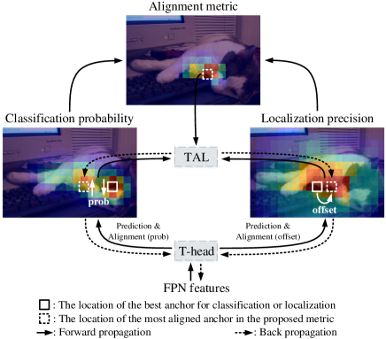
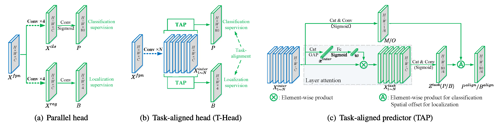

# Training Strategies
[TOC]

## Data Augmentation

- color augmentation, random affine, random flip, and mosaic

- **Bag of Freebies for Training Object Detection Neural Networks**. Zhi Zhang et.al. **arxiv**, **2019**, [(Arxiv)](https://arxiv.org/abs/1902.04103) [(S2)](https://www.semanticscholar.org/paper/Bag-of-Freebies-for-Training-Object-Detection-Zhang-He/0ba8182fa99559257e99a56d790bf2c705c42537).
  - Takeaway: Systematically explores training tweaks that improve Faster R-CNN and YOLOv3 without architecture changes.
  
  - Motivation: Classical object detectors often overlook training details; many simple improvements can be combined for cumulative gains.
  
  - Core Mechanism:
    - **Visually Coherent Image Mixup**: Specialized mixup for object detection preserving spatial alignment
    - **Label Smoothing**: Regularization for classification head, smooths one-hot targets
    - **Cosine Learning Rate Schedule**: Outperforms traditional step LR schedules, smoother decay
    - **Synchronized Batch Normalization**: Better multi-GPU training performance
    - Random geometry transformations with careful application
  
  - Pros:
    - Up to 5% absolute precision improvement
    - No inference cost increase (pure training tricks)
    - Generalizable across different detectors
  
  - Cons:
    - Requires careful hyperparameter tuning
    - Some techniques may not transfer to all datasets
  
- **Simple Copy-Paste is a Strong Data Augmentation Method**. Golnaz Ghiasi et.al. **CVPR**, **2021**, [(Arxiv)](https://arxiv.org/abs/2012.07177) [(S2)](https://www.semanticscholar.org/paper/Simple-Copy-Paste-is-a-Strong-Data-Augmentation-for-Ghiasi-Cui/914a593b7f2e980470075a9955f1407641669a8f).

  - Takeaway: Copy-Paste augmentation pastes objects from one image onto another, achieving SOTA on multiple datasets.

  - Motivation: Object detection needs diverse training data; complex augmentations can be hard to design.

  - Core Mechanism:
    - **Copy-Paste**: Randomly paste objects from source image onto target image
    - Combines with self-training for additive gains
    - Preserves instance masks, enabling simultaneous detection and segmentation

  - Pros:
    - Simple to implement
    - State-of-the-art on COCO, LVIS, PASCAL
    - Effective for instance segmentation

  - Cons:
    - May create unrealistic scenes
    - Limited to datasets with instance masks

## Class Imbalance

- **Focal Loss for Dense Object Detection**. Tsung-Yi Lin et.al. **ICCV**, **2017**, [(Arxiv)](https://arxiv.org/abs/1708.02002) [(S2)](https://www.semanticscholar.org/paper/Focal-Loss-for-Dense-Object-Detection-Lin-Goyal/1a857da1a8ce47b2aa185b91b5cb215ddef24de7).

  - Takeaway: Focal Loss down-weights easy examples to address extreme foreground-background class imbalance in dense detectors.

  - Motivation: Dense detectors evaluate huge candidate locations; most are easy background, dominating standard cross-entropy loss.

  - Core Mechanism:
    - Binary cross-entropy with modulating factor
    - Let $y \in \{0,1\}$ be label, $p \in [0,1]$ be model prediction:
    - $p_t = \begin{cases} p & \text{if } y=1 \\ 1-p & \text{if } y=0 \end{cases}$
    - Cross Entropy: $\mathrm{CE}(p_t) = -\log(p_t)$
    - Focal Loss: $\mathrm{FL}(p_t) = -(1-p_t)^{\gamma}\log(p_t)$
    - $\gamma \geq 0$ is focusing parameter (typical: $\gamma=2$)
    - Easy examples ($p_t \approx 1$): $(1-p_t)^\gamma \approx 0$, loss heavily reduced
    - Hard examples ($p_t \ll 1$): modulating factor stays large, focused learning

  - Pros:
    - Eliminates need for hard negative mining
    - Foundation for RetinaNet and subsequent methods
    - Addresses two imbalance types: positive/negative and easy/hard

  - Cons:
    - Requires tuning $\gamma$ for different tasks
    - May still struggle with extreme long-tail distributions

- **Equalized Focal Loss**. Bing Li et.al. **CVPR**, **2022**, [(Arxiv)](https://arxiv.org/abs/2201.02593) [(S2)](https://www.semanticscholar.org/paper/Equalized-Focal-Loss-for-Dense-Long-Tailed-Object-Li-Yao/d1d75ac25fd457166360c346cf89005e2531a5fc).

  - Takeaway: EFL addresses long-tailed distribution with category-relevant modulating factors, dynamically adjusting loss based on imbalance degrees.

  - Motivation: Focal Loss treats all categories equally, but real-world datasets have severe class frequency imbalance (e.g., LVIS).

  - Core Mechanism:
    - **Category-relevant modulating factor**: Different modulating parameters for different categories
    - Reweights loss contribution based on class frequency
    - Balances gradients between frequent and rare classes
    - Adaptive to dataset's tail distribution

  - Pros:
    - Strong results on LVIS v1 benchmark
    - Better handles long-tailed distributions than standard FL
    - Dynamically adjusts per-category learning

  - Cons:
    - Additional hyperparameters per category
    - Requires class frequency statistics

## Hard Example Mining

## Label Assignment Strategy

### Intro

- Takeaway: label assignment就是在训练时，哪些预测框是正样本（positive）？哪些是负样本（negative）？
- Motivation: 如果 assignment 不合理：
  - 正样本太少 → 学不到
  - 正样本太多 → 噪声大
  - 小目标没有 anchor → 小目标 recall 崩
  - 遮挡目标被分错 → AP50 还行，AP75 很差

- 查看label assignment: assignment visualization

下面介绍一些主流的方法：

1. 规则驱动：早几年的研究，如ATSS

2. 预测驱动：用模型当前输出结果来参与正样本选择，动态样本分配
   - Taxonomy
   
     - 基于Matching Cost的动态分配
   
       直接使用模型检测头的输出，与每一个Ground Truth计算一个匹配的代价，这个代价一般由分类loss和回归loss组成。Feature Map上所有的点（N个）的预测值与所有的Ground Truth（M个）计算得到的**NxM的矩阵**，就是所谓的**Cost Matrix**
   
       那么基于这个Cost Matrix进行二分图匹配/传输优化/取topk 都是一种动态匹配
   
       > [!TIP]
       >
       > 虽然看着是一个鸡生蛋，蛋生鸡的问题，然是NN还是能够训练学习
   
   - Pros: 更强
   
   - Cons:
     - **训练初期不稳定**，因为预测还不准
       - Sol: 使用 warmup / 混合规则 + 预测

### Taxonomy

- Fixed IoU Threshold

- Center-Prior Assignment

    - Positive only if anchor center is inside GT center region (radius/ratio), then apply IoU rule.
    - Medium effort, reduces noisy positives near borders.

- __Bridging the Gap Between Anchor-Based and Anchor-Free Detection via Adaptive Training Sample Selection.__ *Shifeng Zhang et al.* __2020 IEEE/CVF Conference on Computer Vision and Pattern Recognition (CVPR), 2019__ [(Arxiv)](https://arxiv.org/abs/1912.02424) [(S2)](https://www.semanticscholar.org/paper/db160e36aec4b43cc0651039eb1fc1e63527b090) (Citations __1965__) -- ATSS

  - Takeaway: （规则驱动）ATSS automatically selects positive samples based on statistical characteristics, bridging anchor-based and anchor-free detectors.

    Anchor design 不是关键，sample selection 才是。

    > CNN成立，现在Transformer NMS-free不再完全成立

  - Motivation: Label assignment in detection relies on fixed IoU thresholds; anchor-based vs anchor-free detectors have different assignment strategies.

    - 当时大家认为： Anchor-free 比 anchor-based 好，是因为“没有 anchor”
    - 但作者提出一个关键问题：真正的差别，是否只是 sample selection 不同？

  - Core Mechanism: Anchor-based 和 Anchor-free 的差距，本质来自训练样本选择方式，而不是 anchor 本身。

    ATSS 对每个 GT，动态计算 IoU 阈值

    1. Per-level selection: Select $k$ anchors closest to GT center per pyramid level
    2. Dynamic IoU threshold: $t_g = m_g + v_g$ (mean + std of IoU values)

    > [!NOTE]
    >
    > 自适应后，anchor-base更像是anchor-free

  - Pros:
    - No hyperparameter for IoU threshold
    - Better performance than fixed-threshold methods

  - Cons:
    - Still level-based assignment
    - 这个结论在当时2020–2022的CNN detector基本成立，但是现在Transformer、NMS-free、Query-based不再完全成立
    - 虽然称为动态，但是本质上依然是**基于先验信息**（中心点和anchor）的静态匹配策略

近年来正样本的选择（label assignment）**由模型当前预测结果决定**，而不是固定规则决定。

- **TOOD: Task-aligned One-stage Object Detection**. Chengjian Feng et.al. **ICCV**, **2021**, [(Arxiv)](https://arxiv.org/abs/2108.07755) [(S2)](https://www.semanticscholar.org/paper/7438524bf00d7c5a22cb8799797f57c3a794b220) [(Code)](https://github.com/fcjian/TOOD). -- TAL

  - Takeaway: （预测驱动）TOOD aligns classification and localization objectives with task-aligned learning, improving ranking consistency and final AP.

  - Motivation: One-stage detectors often optimize classification and box regression separately, causing score-IoU mismatch during NMS ranking.

    两个任务的最优样本不一致，这就是Misalignment

  - Core Mechanism: 为了让两个任务共享同一套对齐标准，有如下三点

    

    1. **T-Head (Task-aligned Head)**: Shared interactive features are learned for classification and localization branches.

    2. **Task Alignment Learning (TAL)**: Uses an alignment metric to jointly evaluate class confidence and localization quality for positive sample selection.
       $$
       score = (cls)^{\alpha} \cdot (IoU)^{\beta}
       $$

    3. **Task-aligned Loss**: Optimizes both tasks toward consistent high-quality predictions so classification scores better reflect box quality.

    

    - training: 前 4 个 epoch 用 ATSS 稳定收敛;之后用 TAL：样本分配、分类监督、回归权重都围绕同一个对齐指标。

      > [!tip]
      >
      > loss function也会跟着改变，先用focal_loss_with_prob再用task_aligned_focal_loss

  - Pros:
    - Mitigates classification-localization misalignment effectively.
    - Strong gains on COCO with one-stage detectors.
    - Plug-and-play assignment idea, later adopted by many detectors.

  - Cons:
    - Adds assignment/loss design complexity compared with fixed IoU rules.
    - Sensitive to alignment metric and hyperparameter settings.

- PAA（Probabilistic Anchor Assignment）

  PAA 假设正负样本的联合损耗分布遵循高斯分布。因此，它使用 GMM 拟合正负样本分布，然后以正样本分布中心作为*正**负*分界

- DERT

  Hungarian matching

  - Pros
    - Globally optimal assignment（一对一）严格限制一个 GT 只匹配一个预测

- __OTA: Optimal Transport Assignment for Object Detection.__ *Zheng Ge et al.* __arXiv, 2021__ [(Arxiv)](https://arxiv.org/abs/2103.14259) [(Code)](https://github.com/Megvii-BaseDetection/OTA)

  - Takeaway: OTA formulates label assignment as **optimal transport** problem, finding globally optimal assignment for all anchors simultaneously.
  - Motivation: Most assignment strategies assign anchors per-GT locally greedily, ignoring global optimal configuration. 多个 GT 争抢同一个候选框
  - Core Mechanism:
    - **Optimal Transport (OT) formulation**: Global perspective for all anchors
    - Transportation cost: Weighted sum of classification and regression losses
    - Solves OT problem to find optimal one-to-one matching TaskAlignedAssigner. 直接计算难度较大，Sinkhorn-Knopp 近似求解
  - Pros:
    - Globally optimal assignment（多对多）更适合 dense detector
    - Theoretically principled approach
    - Outperforms greedy assignment strategies
  - Cons:
    - Higher computational cost (solving OT problem)
    - Complex implementation 人脸 / 手势检测常用。后来常用simOTA，效果接近更简单

- SimOTA

  - 相比OTA的实现更加简单，效果差不多，更加常用

- __Category-Aware Dynamic Label Assignment with High-Quality Oriented Proposal.__ *Mingkui Feng et al.* __ArXiv, 2024__ [(Arxiv)](https://arxiv.org/abs/2407.03205) [(S2)](https://www.semanticscholar.org/paper/ccb0d094cf39cb17cf29214cb930f0dce9ca3211) (Citations __4__)

- __Integrating Diverse Assignment Strategies into DETRs.__ *Yiwei Zhang et al.* __arXiv, 2026__ [(Arxiv)](https://arxiv.org/abs/2601.09247)

- __Point2RBox-v3: Self-Bootstrapping from Point Annotations via Integrated Pseudo-Label Refinement and Utilization.__ *Teng Zhang et al.* __arXiv, 2025__ [(Arxiv)](https://arxiv.org/abs/2509.26281)

- __Improving Object Detection by Label Assignment Distillation.__ *Chuong H. Nguyen et al.* __arXiv, 2021__ [(Arxiv)](https://arxiv.org/abs/2108.10520)  蒸馏引导label assignment

- https://openaccess.thecvf.com/content/CVPR2025/html/Liu_FSHNet_Fully_Sparse_Hybrid_Network_for_3D_Object_Detection_CVPR_2025_paper.html

### Practice

现在我在做一个手头脸的检测人物，label assignment会从以下方面直接影响我的检测效果

- 小目标
- 密集场景
- 类间重叠：face inside head，存在层级关系，assignment可能混淆，分类不稳定
- 遮挡：漏检

## Initialization

### 权重初始化

- Xavier initialization [(paper)](https://proceedings.mlr.press/v9/glorot10a/glorot10a.pdf) [(Good Intro)](https://zhuanlan.zhihu.com/p/653754525)

  - Takeaway: 

    Xavier initialization sets the initial weights so that the variance of activations stays roughly stable across layers. 

  - Motivation: 

    Glorot and Bengio proposed it to reduce vanishing and exploding signals in deep networks.

  - Core Mechanism

    Xavier initialization chooses weights with zero mean and a variance that depends on both the number of input connections and the number of output connections.

    每个输出$o_i$都可以表示为
    $$
    o_i = \text{activation}(\sum_{j=1}^{n_{in}} w_{ij} x_j + b_i) \\
    $$
    那么$\sum_{j=1}^{n_{in}} w_{ij} x_j$的方差将为$n_{in}\times Var(w)\times Var(x)$，为了让每一层的输出方差接近其输入的方差，设置权重$w$的初始方差为
    $$
    \mathrm{Var}(W) \approx \frac{2}{fan_{in} + fan_{out}}
    $$
    然后权重会从，均值0和这样的方差的正态分布或者从以下均匀分布中抽取

    The Xavier normal form is
    $$
    W_{ij} \sim \mathcal{N}\left(0,\; \frac{2}{fan_{in} + fan_{out}}\right)
    $$
    The Xavier uniform form is
    $$
    W_{ij} \sim U\left[-a,\; a\right]
    $$
    where
    $$
    a = \sqrt{\frac{6}{fan_{in} + fan_{out}}}
    $$

  - Pros

    - 一定程度避免梯度消失和爆炸
    - 加速收敛

  - Cons

    - It is not the best choice for **ReLU** family activations, where He initialization is usually better.

    - It may still perform poorly in very deep or highly specialized architectures if used without adaptation.

- Guassian initialization

  - Core Mechanism

    In its most basic form, Gaussian initialization sets each weight as
    $$
    W_{ij} \sim \mathcal{N}(\mu,\sigma^2)
    $$
    In practice, people often use zero mean:
    $$
    W_{ij} \sim \mathcal{N}(0,\sigma^2)
    $$

  - Pros
    - a general random initialization method
  - Cons
    - Its quality depends heavily on the choice of $\sigma$.

- He initialization

## Scheduling & Optimization

- **Libra R-CNN: Towards Balanced Learning**. Jiangmiao Pang et.al. **CVPR**, **2019**, [(Arxiv)](https://arxiv.org/abs/1904.02701) [(S2)](https://www.semanticscholar.org/paper/Libra-R-CNN%3A-Towards-Balanced-Learning-for-Object-Pang-Chen/32a69681c103807704f71b838454c7924ceec5ce).

  - Takeaway: Libra R-CNN addresses three imbalance levels (sample, feature, objective) with IoU-balanced sampling, Balanced Feature Pyramid, and Balanced L1 Loss.

  - Motivation: Object detection suffers from multiple imbalance types: foreground-background, feature pyramid levels, and regression loss contributions.

  - Core Mechanism:
    - **IoU-balanced sampling**: Reduces sample-level imbalance by resampling based on IoU
    - **Balanced Feature Pyramid**: Reduces feature-level imbalance with integrated features
    - **Balanced L1 Loss**: Reduces objective-level imbalance by controlling regression loss gradients
    - Addresses imbalance at three levels systematically

  - Pros:
    - +2.5 AP over FPN Faster R-CNN
    - +2.0 AP over RetinaNet
    - Comprehensive solution to multiple imbalance types

  - Cons:
    - Adds complexity to training pipeline
    - More hyperparameters to tune

- **DN-DETR: Accelerate DETR Training by Introducing Query DeNoising**. Feng Li et.al. **CVPR**, **2022**, [(Arxiv)](https://arxiv.org/abs/2203.01305) [(S2)](https://www.semanticscholar.org/paper/DN-DETR%3A-Accelerate-DETR-Training-by-Introducing-Li-Zhang/78d02f2909a582c624eca2d0f67c91ee91974180).

  - Takeaway: DN-DETR accelerates DETR convergence by feeding noised ground-truth boxes into decoder and reconstructing original boxes.

  - Motivation: DETR converges slowly (requires 500+ epochs) due to unstable bipartite matching in early training.

  - Core Mechanism:
    - **Denoising Training**:
      1. Add noise to ground-truth boxes (random offset, scaling)
      2. Feed noised boxes as decoder queries
      3. Reconstruct original unnoised boxes
    - Stabilizes bipartite matching by providing better supervision early
    - Reduces matching difficulty in early training stages
    - Auxiliary denoising loss

  - Pros:
    - Significantly accelerates convergence
    - Maintains DETR's simplicity (no NMS)
    - Reduces training epochs from 500 to ~150

  - Cons:
    - Adds auxiliary loss and computational cost during training
    - Requires tuning noise parameters

## Others

- EMA (Exponential Moving Average)
  - **What it is:** maintain a smoothed copy of model parameters updated every step.
  - **Update rule:** $\theta^{EMA}_t = \beta \theta^{EMA}_{t-1} + (1 - \beta) \theta_t$, where $\beta \in [0.9, 0.9999]$.
  - **How to use:** train with normal weights $\theta_t$, but **evaluate and/or export** using $\theta^{EMA}_t$.
  - **Why it helps:** reduces noise from SGD updates, improves stability, and often yields better validation/inference performance.
- earlystop
- label smoothing
- multi-stage training

掩蔽文本训练和跨实例对比学习

- zero-shot setting是什么

- 伪掩码注释，该数据集作为掩码头的主要训练数据

- 零样本检测表现
- 冻结骨干,新增关键头进行训练(不同关键点头负责不同内容分别进行训练)
