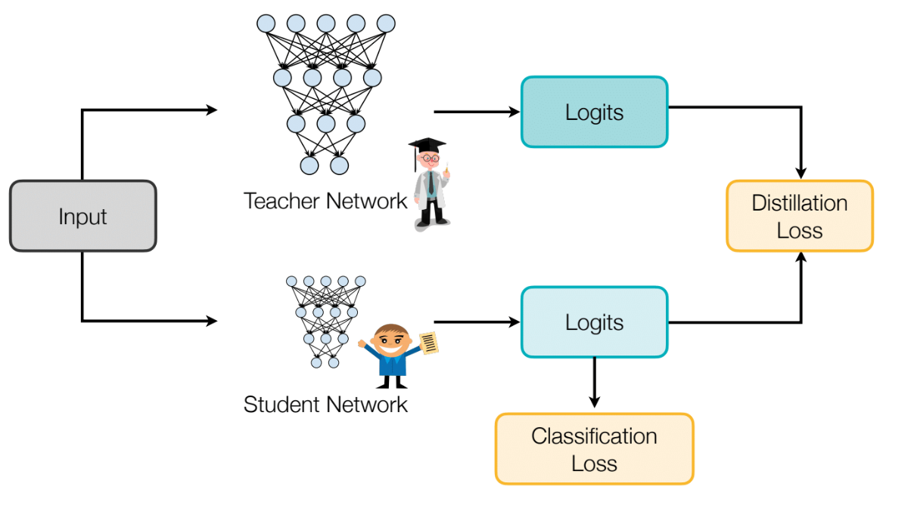
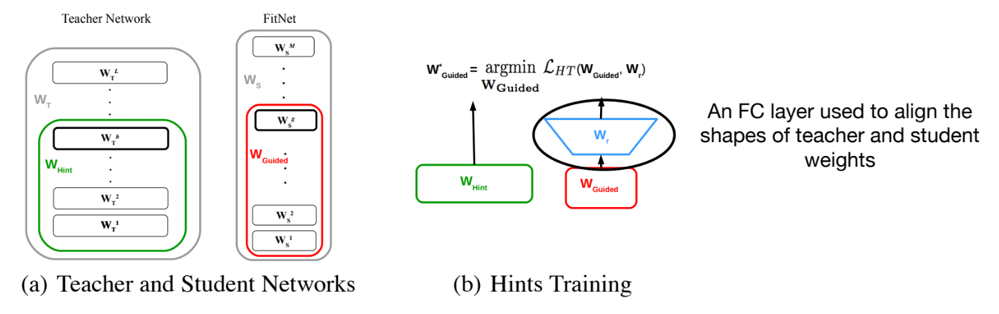
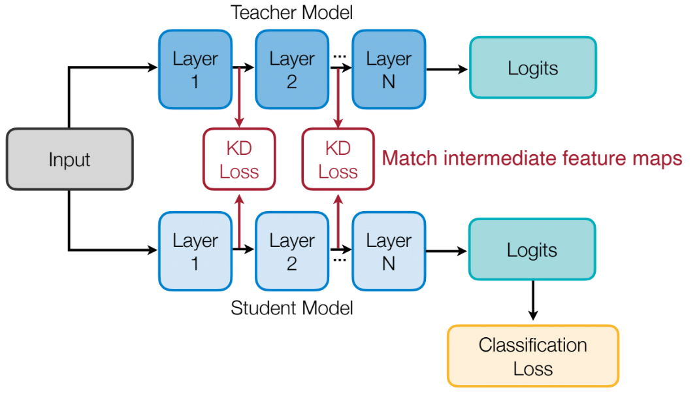
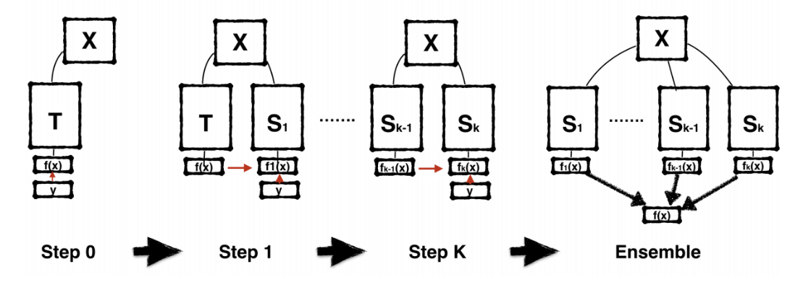
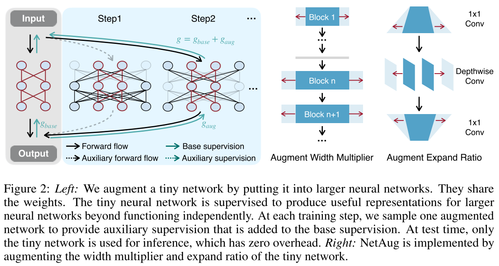
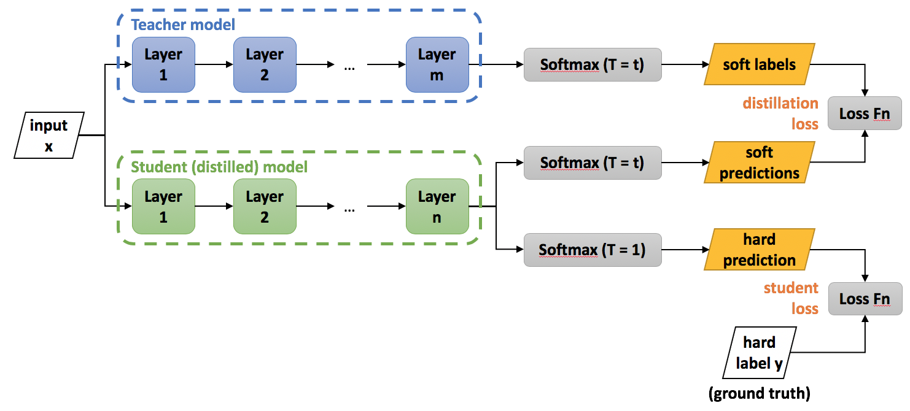
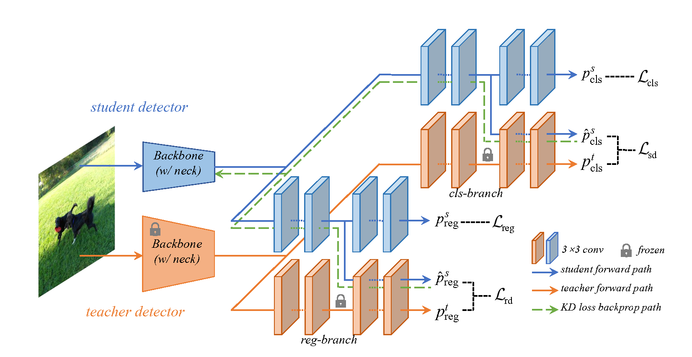
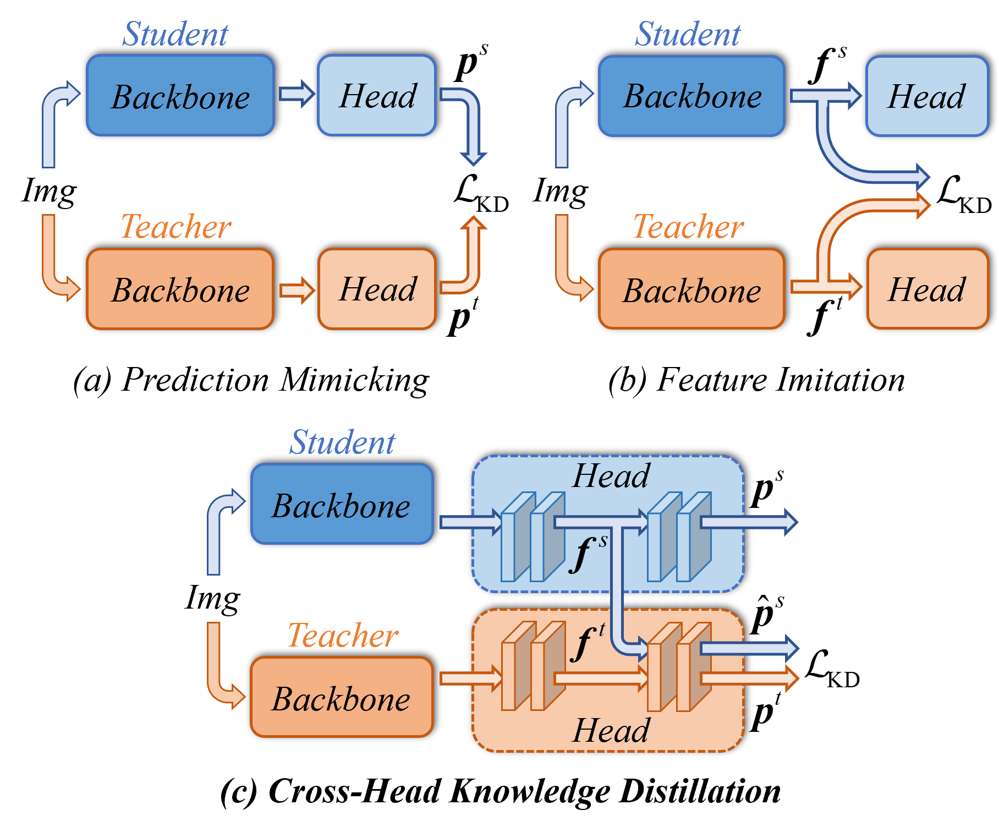

# Knowledge Distillation
[TOC]

知识蒸馏是迁移学习的一种

## What is knowledge distillation



- The goal of knowledge distillation is to align the class probability distributions from teacher and student networks.

## What to match
How to match? - use distillation loss to train.

1. output logits

     - cross entropy loss
     - L2 loss
2. intermediate weights

   

   - An FC layer used to align the shapes of teacher and student weights.

3. intermediate features

   

   - minimizing maximum mean discrepancy between feature maps

4. gradients

5. sparsity patterns

6. relational information

## Self and online distillation

- self distillation

  

  - Born-Again Networks adds iterative training stages and using both classification objective and distillation objective in subsequent stages

    ```mermaid
    graph LR
    A[Teacher Model] -- Soft Targets --> B[Student Model]
    C[Hard Labels] -- Supervised Signal --> B
    ```

  - network architecture $T= S_1= S_2=...$

  - network accuracy $T< S_1<S_2...$

- online distillation

  - deep mutual learning
    - Idea of deep mutual learning: for both teacher and student networks, we want to add a distillation objective that minimizes the output distribution of the other party.
    - Deep mutual learning can improve both student (net 2) and teacher (net 1) models.

- combined

  be your own teacher: deep supervision + distillation

  - Use deeper layers to distill shallower layers.
  - Intuition: Labels at later stages are more reliable, so the authors use them to supervise thepredictions from the previous stages.

## Network augmentation

- conventional approach

  - data augmentation/dropout during training to avoid overfitting
    - improve large neural network`s performance
    - but hurts tiny nn performance(because tiny nn lacks capacity)

- network augmentation

  

## Papers

### KD

- __Distilling the Knowledge in a Neural Network.__ *Geoffrey Hinton, Oriol Vinyals, Jeff Dean.* __NIPS 2014 Deep Learning Workshop / arXiv, 2015__ [(Arxiv)](https://arxiv.org/abs/1503.02531) [(PDF)](https://arxiv.org/pdf/1503.02531) [(Source)](https://arxiv.org/src/1503.02531) -- distilling-knowledge ([My PDF](https://drive.google.com/file/d/1_6XpJNvG-Lgs1nxVLPe6yc9yHEiqniE7/view?usp=drivesdk))

  - Takeaway

    这篇 paper 提出了经典 **Knowledge Distillation**：先训练 cumbersome model / ensemble，再用它产生的 **soft targets** 训练更小、更易部署的 student model。核心 insight 是 teacher 对非正确类别的相对概率也包含 generalization knowledge，而不只是 hard label 的 one-hot 信息。

    > [!NOTE]
    >
    > - soft target 是模型输出的概率分布
    > - ensemble 的意思是：不是只训练一个模型，而是训练多个模型，然后把它们的预测结果合在一起，得到一个更稳定、更准确的最终预测。

  - Motivation

    ensemble 通常能提升精度，但 inference 成本高、部署复杂；直接让小模型只学 hard labels 又会丢掉 teacher 对类别相似性的判断。作者希望把大模型/ensemble 学到的函数映射压缩进小模型，而不是复制参数或结构。

  - Core Mechanism

    

    > External structure diagram from [Neural Network Distiller / IntelLabs documentation](https://intellabs.github.io/distiller/knowledge_distillation.html). The original Hinton et al. paper does not include this architecture figure; this diagram is used here only as an auxiliary explainer for the teacher-student distillation flow.

    1. **Temperature soft targets**

       teacher 和 student 都用更高 temperature 的 softmax 来产生 / 匹配更平滑的类别分布：

       $$
       q_i = \frac{\exp(z_i / T)}{\sum_j \exp(z_j / T)}
       $$

       其中 $T=1$ 是普通 softmax；更大的 $T$ 会让 distribution 更 soft，把 teacher 对相似类别的排序暴露出来。训练 student 时，主要 loss 是和 teacher soft targets 的 cross entropy；如果 transfer set 有 labels，再额外加一个较低权重的 hard-label cross entropy。

       > [!NOTE]
       >
       > paper 还指出 soft-target gradients 会随 $1/T^2$ 缩放，所以混合 hard / soft targets 时通常要乘回 $T^2$ 来保持相对贡献稳定。
       >
       > ```python
       > teacher_probs = torch.sigmoid(teacher_cls_masked / temperature)
       > cls_loss = F.binary_cross_entropy_with_logits(
       >     student_cls_masked / temperature,
       >     teacher_probs,
       >     reduction='none',
       > ).sum(dim=-1)
       > cls_loss = (cls_loss * weights).sum() / norm
       > cls_loss = cls_loss * (temperature ** 2) * self.cls_loss_weight
       > ```

       > [!TIP]
       >
       > temperature的作用：普通 softmax 可能输出很尖锐的概率：
       >
       > ```
       > 猫：0.98
       > 狗：0.01
       > 狐狸：0.005
       > 汽车：0.005
       > ```
       >
       > 这时候其他类别的概率太小，学生很难学到类别之间的关系。所以 Hinton 提出用较高的 temperature，把概率分布变得更平滑
       >
       > student 也要 / temperature：因为要在同一个温度空间里比较

    2. **Soft targets as dark knowledge**

       即使 teacher 给某些错误类的概率很小，这些错误类之间的比例也表达了类别相似性。例如某个 “2” 更像 “3” 还是更像 “7”。这类信息在 hard label 中不存在，但对 student generalization 很有用。paper 还说明在 high-temperature limit 下，distillation 近似于 matching teacher / student logits，因此 logit matching 可以看作 distillation 的 special case。

    3. **Specialist models for huge label spaces**

       对超大类别数任务，作者提出一个 generalist + 多个 specialist 的 ensemble。generalist 负责全类别；每个 specialist 只关注一组容易混淆的 fine-grained classes，其余类别合并成一个 dustbin class。specialist 的类簇来自 generalist prediction covariance / confusion-like structure，可并行训练。

       inference 时只激活和 generalist top prediction 相关的 specialists，并求一个 full distribution $\mathbf{q}$：

       $$
       KL(\mathbf{p}^{g}, \mathbf{q}) + \sum_{m \in A_k} KL(\mathbf{p}^{m}, \mathbf{q})
       $$

       其中 $\mathbf{p}^{g}$ 是 generalist distribution，$\mathbf{p}^{m}$ 是 active specialist distribution，$A_k$ 是被 generalist top classes 触发的 specialist 集合。这个目标让最终分布同时接近 generalist 的全局判断和 specialists 的局部细粒度判断。

  - Pipeline

    1. 训练一个 cumbersome model：可以是 ensemble，也可以是强正则的大模型。
    2. 用 teacher 在 transfer set 上输出 high-temperature soft targets。
    3. 训练 student 去匹配这些 soft targets；如果有 labels，再混合 hard-label CE。
    4. inference 时 student 使用 $T=1$，不再需要 teacher / ensemble。
    5. 对 large-class setting，可额外训练 specialist ensemble 来提升 generalist，对混淆类别做细粒度区分。

  - Key Results

    - MNIST：大模型 67 test errors；普通小模型 146 errors；小模型只靠匹配 $T=20$ 的 soft targets 可到 74 errors。
    - Speech recognition：10-model ensemble 的 frame accuracy / WER 为 61.1% / 10.7%；distilled single model 达到 60.8% / 10.7%，接近 ensemble。
    - JFT specialists：baseline test accuracy 25.0%，加入 61 个 specialists 后到 26.1%；conditional test accuracy 从 43.1% 到 45.9%。

  - Pros

    - 方法简单、通用：只需要 teacher output distribution，不要求 teacher / student 架构相同。
    - soft targets 同时提供类别相似性和更低方差的训练信号。
    - specialist models 给出了大类别数场景下比完整 ensemble 更可并行、更经济的增强方式。

  - Cons

    - temperature、soft / hard loss 权重需要调参。
    - specialist ensemble 部分还没有证明能再蒸馏回单个大模型；paper 明确说 “We have not yet shown...” 。
    - JFT 数据集和商业 speech system 的部分实验细节较少，可复现性弱于公开 benchmark。


### CrossKD

- __CrossKD: Cross-Head Knowledge Distillation for Object Detection.__ *Jiabao Wang et al.* __2024 IEEE/CVF Conference on Computer Vision and Pattern Recognition (CVPR), 2024__ [(Arxiv)](https://arxiv.org/abs/2306.11369) [(S2)](https://www.semanticscholar.org/paper/d263c8efdb9fe1a14c249461dc06353814648f32) [(Code)](https://github.com/jbwang1997/CrossKD) (Citations __103__) ([My PDF](https://drive.google.com/file/d/13u0NUbnBwryly6n5jG3ZGMQj4ELROkx8/view?usp=drivesdk))

  - Takeaway

    CrossKD 是一种面向 **dense object detection** 的 prediction-level distillation：它不直接要求学生自己的 detection head 输出去模仿 teacher，而是把 **student head 的中间特征送入 frozen teacher head 的后半段**，得到 cross-head predictions，再让这些预测模仿 teacher predictions。这样既保留了 prediction mimicking 的 task-oriented 优点，又缓解了检测任务中 ground-truth supervision 和 teacher supervision 的目标冲突。

  - Prior

    目标检测里的 KD 方法大致分成两类：

    - **Prediction mimicking**：让 student prediction 直接模仿 teacher prediction；优点是更贴近 detection objective，但在 object detection 中容易和 label assignment / GT supervision 产生冲突。
    - **Feature imitation**：让 student feature 对齐 teacher feature；信息量更丰富，也常被验证有效，但它不一定直接优化最终检测预测的任务目标。

  - Motivation

    在 dense detector 中，同一个位置 / anchor 可能同时受到 ground-truth label、dynamic label assignment 和 teacher prediction 的监督。如果直接把 teacher prediction 压到 student final head 上，student 会在同一路径上学习**两套可能不一致**的 targets，导致训练效率低、KD signal 不稳定。

    > [!NOTE]
    >
    > 为什么会有这样的冲突？
    >
    > 如果某个位置上：
    >
    > - 学生根据 ground truth 被要求判成正样本或高分
    > - 教师却在这个位置给了较低分，或者给了另一种分布（因为label assignment的分配不一致）
    >
    > 那学生就在这个位置同时收到两种不一致的监督。论文把这件事叫做 **target conflict**

    CrossKD 的核心动机是：**让蒸馏损失作用在 cross-head prediction 上，而不是直接改写 student 原始检测输出**，从而减少 target conflict。

  - Core Mechanism

    

    

    作者提出把蒸馏路径改掉：

    - 检测损失还是走学生自己的 head
    - 蒸馏损失改为让学生中间特征经过冻结的教师后半 head，形成 cross-head prediction，再去对齐教师预测

    论文认为这样能缓解 ground-truth supervision 和 teacher supervision 的直接冲突，因为 cross-head prediction 和 teacher prediction 共享了教师 head 的一部分，二者更一致，蒸馏过程也更平滑

    > [!NOTE]
    >
    > 只是缓解，没有消除，把两种监督拆到不同路径上

    1. **Cross-head prediction mimicking**

       对检测头中的某一层 $C_i$，先取 student head 的中间特征 $\mathbf{f}_i^s$，再把它送入 teacher head 的后续层 $C_{i+1}^t,\dots$，得到 cross-head prediction $\hat{\mathbf{p}}^s$。蒸馏时匹配的是 $\hat{\mathbf{p}}^s$ 和 teacher prediction $\mathbf{p}^t$，而不是直接匹配 student 原始预测 $\mathbf{p}^s$ 和 $\mathbf{p}^t$。

       $$
       \mathcal{L}_{\text{CrossKD}}
       =
       \frac{1}{|\mathcal{S}|}
       \sum_{r \in \mathcal{R}}
       \mathcal{S}(r)
       \mathcal{D}_{\text{pred}}
       \left(\hat{\mathbf{p}}^s(r), \mathbf{p}^t(r)\right)
       $$

       其中 $r$ 表示 prediction map 上的位置，$\mathcal{D}_{\text{pred}}$ 是 prediction-level distillation distance(eg: 分类BCE loss，回归kl散度)。paper 中 CrossKD 直接令 $\mathcal{S}(r)=1$，也就是不再设计复杂的 region selection，而是在整张 prediction map 上做蒸馏。

       > [!NOTE]
       >
       > 其实是做了一个假设：最终对齐的是 prediction space，这个空间比 backbone feature space 更task-oriented
       >
       > 理解：
       >
       > - backbone feature space 很“私有”，不同骨干网络各有各的表达习惯
       > - prediction space 更“公共”，因为不管前面用什么 backbone，最后都要回答同一个检测任务

    2. **Separate original detection path and distillation path**

       student 自己的 detection head 仍然用正常检测损失学习 ground truth；CrossKD loss 则通过 frozen teacher head 反传到 student intermediate feature。这样 student final prediction 不会被 teacher target 直接“拉扯”，但 student feature 仍然会学习如何产生 teacher-compatible prediction。

       $$
       \mathcal{L}
       =
       \mathcal{L}_{cls}(\mathbf{p}^s_{cls}, \mathbf{p}^{gt}_{cls})
       +
       \mathcal{L}_{reg}(\mathbf{p}^s_{reg}, \mathbf{p}^{gt}_{reg})
       +
       \mathcal{L}^{cls}_{\text{CrossKD}}(\hat{\mathbf{p}}^s_{cls}, \mathbf{p}^t_{cls})
       +
       \mathcal{L}^{reg}_{\text{CrossKD}}(\hat{\mathbf{p}}^s_{reg}, \mathbf{p}^t_{reg})
       $$

       分类分支通常用 teacher classification scores 作为 soft labels；回归分支取决于 detector head：GFL / LD 这类 distributional regression 可用 KL divergence，RetinaNet / ATSS 这类直接框回归可用 GIoU，并且 ATSS 还会额外蒸馏 centerness。

    3. **Feature scale alignment in implementation**

       官方实现里 `reuse_teacher_head` 会先对 student intermediate feature 做轻量统计对齐，再送入 teacher head tail：

       $$
       \tilde{\mathbf{f}}^s
       =
       \frac{\mathbf{f}^s-\mu_s}{\sigma_s+\epsilon}\sigma_t+\mu_t
       $$

       把学生中间特征 `stu_feat` 按通道展开，在每个通道上统计均值和标准差；再把学生特征先标准化，再用教师对应特征 `tea_feat` 的均值和标准差重新缩放。这里的 `align_scale` 本质上就是先把 **输入分布错位** 压小
       
       > [!TIP]
       >
       > 当student and teacher的通道不同时，先对齐通道再进行align_scale

  - Pipeline

    ```
    image
     ├── student backbone + FPN
     │    └── student head forward_crosskd
     │         ├── student normal prediction -> 正常检测 loss
     │         └── student intermediate head feature
     │
     └── teacher backbone + FPN, no_grad
          └── teacher head forward_crosskd
               ├── teacher normal prediction
               └── teacher intermediate head feature
    student intermediate feature
       -> align mean/std to teacher intermediate feature
       -> teacher head forward_from(cross_layer)
       -> crossed student prediction
    crossed student prediction vs teacher normal prediction
       -> CrossKDLoss
       -> 加到 total_loss
    ```

    1. 准备一个 trained teacher detector 和一个 student detector；training 阶段 teacher frozen。

       ```python
       self.teacher.eval()
       for p in self.teacher.parameters():
           p.requires_grad_(False)
       ```

    2. 同一张图像分别经过 teacher / student backbone、neck 和 detection head。

       ```python
       tea_feats = self.teacher.extract_feat(batch_inputs)
       stu_feats = self.extract_feat(batch_inputs)
       ```

    3. 从 student head 的第 $i$ 层取出中间特征 $\mathbf{f}_i^s$，同时保留 teacher prediction $\mathbf{p}^t$。

       ```python
       tea_cls, tea_reg, tea_cls_hold, tea_reg_hold = multi_apply(
           self.forward_crosskd_single, tea_feats,
           self.teacher.bbox_head.scales, module=self.teacher)
       
       stu_cls, stu_reg, stu_cls_hold, stu_reg_hold = multi_apply(
           self.forward_crosskd_single, stu_feats,
           self.bbox_head.scales, module=self)
       ```

    4. 将 $\mathbf{f}_i^s$ 经过必要的 feature statistics alignment 后，送入 teacher head 的后半段，得到 cross-head prediction $\hat{\mathbf{p}}^s$。

       ```python
       reused_cls, reused_reg = multi_apply(
           self.reuse_teacher_head,
           tea_cls_hold, tea_reg_hold,
           stu_cls_hold, stu_reg_hold,
           self.teacher.bbox_head.scales)
       ```

       `reuse_teacher_head` 内部先做 `align_scale`，再复用 teacher head tail：

       ```python
       stu = (stu - stu_mean) / (stu_std + 1e-6)
       stu = stu * tea_std + tea_mean
       reused_cls_score = teacher_head.gfl_cls(reused_cls_feat)
       reused_bbox_pred = scale(teacher_head.gfl_reg(reused_reg_feat)).float()
       ```

    5. student 原始输出 $\mathbf{p}^s$ 用正常 detection loss 学 ground truth；cross-head prediction $\hat{\mathbf{p}}^s$ 用 CrossKD loss 学 teacher prediction。

       ```python
       losses = self.loss_by_feat(
           tea_cls, tea_reg, tea_feats,
           stu_cls, stu_reg, stu_feats,
           reused_cls, reused_reg,
           batch_data_samples)
       ```

       在 `loss_by_feat` / `pred_mimicking_loss_single` 中，核心就是把 cross-head prediction 和 teacher prediction 对齐：

       ```python
       loss_cls_kd = self.loss_cls_kd(reused_cls_score, tea_cls_score, label_weights)
       loss_reg_kd = self.loss_reg_kd(reused_bbox_pred, tea_bbox_pred, weight=reg_weights)
       ```

       > [!NOTE]
       >
       > 这里还有个细节，就是常常只学习label assignment分配的正样本/负样本（mask），而没有啥都学习
       >
       
       > [!WARNING]
       >
       >   PureDet：
       >
       >   stu_feat = stu_feat.permute(1, 0, 2, 3).reshape(C, -1)
       >   mean/std over N*H*W, per-channel global statistics
       >
       >   也就是每个 channel 在整个 batch 和空间维度上统一对齐。
       >
       >   当前 Remo：
       >
       >   stu_mean = stu_feat.mean(dim=(2, 3), keepdim=True)
       >   stu_std = stu_feat.std(dim=(2, 3), keepdim=True)
       >
       >   也就是每张图、每个 channel 独立按空间维度对齐。
       >
       >   我的倾向：当前 Remo 的 per-image per-channel 对齐更稳，尤其 batch size 小、多尺度/多图差
       >   异大时。
       >
       >   原因：
       >
       >   - PureDet 的 C x (N*H*W) 会把 batch 内不同图片的分布混在一起。如果 batch 内有亮度、尺
       >     度、背景差异，student 的某张图会被其他图的统计量影响。
       >   - 当前 Remo 的 B x C x H x W 按每张图单独对齐，不跨样本污染，更像 instance-level feature
       >     normalization。
       >   - 但 PureDet 的做法统计量更多，batch 足够大且数据分布稳定时，噪声更小
       >
       > 既然通道数不对齐，那么统计学生的feat内容是否有影响？如何计算
       
    6. inference 时只保留 student detector，不需要 teacher head，也不引入额外推理开销。
    
       ```python
       feats = self.extract_feat(batch_inputs)
       results = self.bbox_head.predict(feats, batch_data_samples)
       ```
    
  - Pros
  
    - **Task-oriented**：仍然蒸馏 prediction-level knowledge，比纯 feature imitation 更贴近检测目标。
    - **结构简单**：不依赖复杂 region selection，paper 中直接在整张 prediction map 上蒸馏。
    - **冲突更小**：把 normal detection path 和 distillation path 分开，缓解 GT target 与 teacher target 的直接竞争。
    - **部署友好**：额外 teacher-head reuse 只发生在 training，inference 仍然是原 student detector。
  
  - Cons
  
    - 主要验证范围是 COCO 上的 **dense object detectors**，不能直接推断到 two-stage detector、DETR-style detector 或 3D detection。
    - training 阶段需要额外访问 teacher head 并计算 cross-head forward，训练成本高于普通 student-only training。
    - 方法依赖 student / teacher detection head 能够被切分并复用后半段；如果 head 结构差异很大，复用 teacher head tail 会更麻烦。

