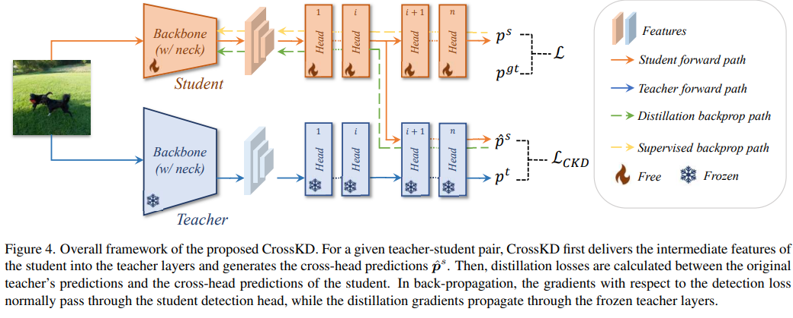

# Knowledge Distillation
[TOC]

知识蒸馏是迁移学习的一种

## What is knowledge distillation


- The goal of knowledge distillation is to align the class probability distributions from teacher and student networks.

## What to match
How to match? - use distillation loss to train.

1. output logits

     - cross entropy loss
     - L2 loss
2. intermediate weights

   

   - An FC layer used to align the shapes of teacher and student weights.

3. intermediate features

   

   - minimizing maximum mean discrepancy between feature maps

4. gradients

5. sparsity patterns

6. relational information

## Self and online distillation

- self distillation

  

  - Born-Again Networks adds iterative training stages and using both classification objective and distillation objective in subsequent stages

    ```mermaid
    graph LR
    A[Teacher Model] -- Soft Targets --> B[Student Model]
    C[Hard Labels] -- Supervised Signal --> B
    ```

  - network architecture $T= S_1= S_2=...$

  - network accuracy $T< S_1<S_2...$

- online distillation

  - deep mutual learning
    - Idea of deep mutual learning: for both teacher and student networks, we want to add a distillation objective that minimizes the output distribution of the other party.
    - Deep mutual learning can improve both student (net 2) and teacher (net 1) models.

- combined

  be your own teacher: deep supervision + distillation

  - Use deeper layers to distill shallower layers.
  - Intuition: Labels at later stages are more reliable, so the authors use them to supervise thepredictions from the previous stages.

## Network augmentation

- conventional approach

  - data augmentation/dropout during training to avoid overfitting
    - improve large neural network`s performance
    - but hurts tiny nn performance(because tiny nn lacks capacity)

- network augmentation

  

## Papers

- __CrossKD: Cross-Head Knowledge Distillation for Object Detection.__ *Jiabao Wang et al.* __2024 IEEE/CVF Conference on Computer Vision and Pattern Recognition (CVPR), 2023__ [(Arxiv)](https://arxiv.org/abs/2306.11369) [(S2)](https://www.semanticscholar.org/paper/d263c8efdb9fe1a14c249461dc06353814648f32) [(Code)](https://github.com/jbwang1997/CrossKD) (Citations __103__)

  - Takeaway

    We present a simple yet effective distillation scheme, termed CrossKD, which delivers the intermediate features of the student's detection head to the teacher's detection head. The resulting cross-head predictions are then forced to mimic the teacher's predictions, greatly improving the student's detection performance.

  - Prior

    现有的 KD 方法大致可分为两类

    - 预测模拟prediction mimicking：教师预测的平滑分布比狄拉克分布更易于学习
    - 特征模仿feature imitation：认为中间特征包含的信息比教师的预测更多，目的是确保师生对之间的特征一致性

  - Motivation

    目标检测里的传统预测蒸馏经常让学生同时面对两种不完全一致的监督信号，也就是标注监督和教师预测监督，这样会造成监督冲突，导致不稳定or效率低下。因此学生不应该被迫通过与标签监督完全相同的final head path来吸收教师的预测目标

  - Core Mechanism

    CrossKD 的做法不是直接让学生头输出去模仿教师头输出，而是把学生头的中间特征送进教师头的后半部分，构造出一个交叉头预测，再让这个交叉头预测去模仿教师预测，从而减轻监督冲突

    
  
    
  
    The total training objective is the student’s normal detection loss plus a KD term on the cross-head predictions:
    $$
    \mathcal{L} = \mathcal{L}_{det} + \lambda \mathcal{L}_{KD}
    $$
  
  - Pipeline
  
    下面来看看代码，在`CrossKDGFL` 里最关键的是三步：
  
    1. 教师跑一遍 head，拿到教师预测，同时把教师头在某一层的中间特征暂存下来。
    2. 学生也跑一遍 head，同样取出学生在该层的中间特征。
    3. 把学生中间特征送进教师头剩下的层，得到 `reused_cls_scores` 和 `reused_bbox_preds`，这就是 cross head prediction
  
    ```python
    class CrossKDGFL:
        def loss(self, images, data_samples):
            # 教师前向
            tea_feats = self.teacher.extract_feat(images)
            tea_cls, tea_reg, tea_cls_hold, tea_reg_hold = multi_apply(
                self.forward_crosskd_single,
                tea_feats,
                self.teacher.bbox_head.scales,
                module=self.teacher,
            )
    
            # 学生前向
            stu_feats = self.extract_feat(images)
            stu_cls, stu_reg, stu_cls_hold, stu_reg_hold = multi_apply(
                self.forward_crosskd_single,
                stu_feats,
                self.bbox_head.scales,
                module=self,
            )
    
            # 学生中间特征进入教师后半头
            reused_cls, reused_reg = multi_apply(
                self.reuse_teacher_head,
                tea_cls_hold,
                tea_reg_hold,
                stu_cls_hold,
                stu_reg_hold,
                self.teacher.bbox_head.scales,
            )
    
            # 常规检测损失 + CrossKD 损失
            losses = self.loss_by_feat(
                tea_cls, tea_reg, tea_feats,
                stu_cls, stu_reg, stu_feats,
                reused_cls, reused_reg,
                data_samples,
            )
            return losses
    ```
  
    上述关键的地方在与self.forward_crosskd_single前推直到到达reused_teacher_head_idx指定的地方，还有就是self.reuse_teacher_head。我们来看看其做了什么
  
    `reuse_teacher_head` 是 CrossKD 最关键的一段。它先把学生中间特征做一次统计对齐，也就是让学生特征按通道标准化后，再匹配到教师特征的均值和方差。然后，把这个对齐后的学生特征送进教师头剩下的层，输出新的分类和回归结果
  
    ~~~python
    import torch
    import torch.nn.functional as F
    
    def align_scale(self, stu_feat, tea_feat):
        ```做一种很轻量的 feature statistics matching```
        n, c, h, w = stu_feat.shape
    
        stu = stu_feat.permute(1, 0, 2, 3).reshape(c, -1)
        tea = tea_feat.permute(1, 0, 2, 3).reshape(c, -1)
    
        stu_mean = stu.mean(dim=-1, keepdim=True)
        stu_std = stu.std(dim=-1, keepdim=True)
        tea_mean = tea.mean(dim=-1, keepdim=True)
        tea_std = tea.std(dim=-1, keepdim=True)
    
        stu = (stu - stu_mean) / (stu_std + 1e-6)
        stu = stu * tea_std + tea_mean
    
        return stu.reshape(c, n, h, w).permute(1, 0, 2, 3)
    
    def reuse_teacher_head(
        self,
        tea_cls_feat,
        tea_reg_feat,
        stu_cls_feat,
        stu_reg_feat,
        scale,
    ):
        reused_cls_feat = self.align_scale(stu_cls_feat, tea_cls_feat)
        reused_reg_feat = self.align_scale(stu_reg_feat, tea_reg_feat)
    
        if self.reused_teacher_head_idx != 0:
            reused_cls_feat = F.relu(reused_cls_feat)
            reused_reg_feat = F.relu(reused_reg_feat)
    
        teacher_head = self.teacher.bbox_head
    
        for i in range(self.reused_teacher_head_idx, teacher_head.stacked_convs):
            reused_cls_feat = teacher_head.cls_convs[i](reused_cls_feat)
            reused_reg_feat = teacher_head.reg_convs[i](reused_reg_feat)
    
        reused_cls_score = teacher_head.gfl_cls(reused_cls_feat)
        reused_bbox_pred = scale(teacher_head.gfl_reg(reused_reg_feat)).float()
        return reused_cls_score, reused_bbox_pred
    ~~~
  
    最后我们来看看总损失
  
    CrossKD 的总损失由两部分组成 = 学生原本的检测损失 + cross head prediction 和 teacher prediction 之间的蒸馏损失
  
    ```python
    def pred_mimicking_loss_single(
        self,
        tea_cls_score,
        tea_bbox_pred,
        reused_cls_score,
        reused_bbox_pred,
        label_weights,
        avg_factor,
    ):
        # 分类蒸馏
        tea_cls_score = tea_cls_score.permute(0, 2, 3, 1).reshape(-1, self.bbox_head.cls_out_channels)
        reused_cls_score = reused_cls_score.permute(0, 2, 3, 1).reshape(-1, self.bbox_head.cls_out_channels)
        label_weights = label_weights.reshape(-1)
    
        loss_cls_kd = self.loss_cls_kd(
            reused_cls_score,
            tea_cls_score,
            label_weights,
            avg_factor=avg_factor,
        )
    
        # GFL 回归蒸馏
        reg_max = self.bbox_head.reg_max
        tea_bbox_pred = tea_bbox_pred.permute(0, 2, 3, 1).reshape(-1, reg_max + 1)
        reused_bbox_pred = reused_bbox_pred.permute(0, 2, 3, 1).reshape(-1, reg_max + 1)
    
        reg_weights = tea_cls_score.max(dim=1)[0].sigmoid()
        reg_weights[label_weights == 0] = 0
    
        loss_reg_kd = self.loss_reg_kd(
            reused_bbox_pred,
            tea_bbox_pred,
            weight=reg_weights[:, None].expand(-1, 4).reshape(-1),
            avg_factor=4.0,
        )
    
        return loss_cls_kd, loss_reg_kd, reg_weights.sum()
    ```
  
    两种loss分别使用什么做的：
  
    1. 分类蒸馏损失：`KDQualityFocalLoss` 本质上是 **用教师 sigmoid 后的分类输出当软目标**，然后对学生的 cross head 分类输出做带 focal weight 的二值交叉熵。focal weight 是
       $$
       |\sigma(pred)-target|^\beta
       $$
       仓库默认这里的 `beta=1`。
  
    2. 回归蒸馏损失：GFL 的框回归不是直接回归 4 个坐标，而是每一边回归一段离散分布，所以仓库用了 `KnowledgeDistillationKLDivLoss`。这个损失会先把教师 logits 做 softmax，再计算学生和教师分布之间的 KL 散度
  
       ```python
       def kd_kl_loss(pred, soft_label, T=1.0, class_reduction="sum"):
           target = torch.softmax(soft_label / T, dim=1).detach()
           loss = F.kl_div(
               torch.log_softmax(pred / T, dim=1),
               target,
               reduction="none",
           )
           if class_reduction == "mean":
               loss = loss.mean(dim=1)
           elif class_reduction == "sum":
               loss = loss.sum(dim=1)
           return loss * (T * T)
       
       class KnowledgeDistillationKLDivLoss(nn.Module):
           def __init__(self, T=1.0, class_reduction="sum", loss_weight=1.0):
               super().__init__()
               self.T = T
               self.class_reduction = class_reduction
               self.loss_weight = loss_weight
       
           def forward(self, pred, soft_label, weight=None):
               loss = kd_kl_loss(
                   pred,
                   soft_label,
                   T=self.T,
                   class_reduction=self.class_reduction,
               )
               if weight is not None:
                   loss = loss * weight
               return self.loss_weight * loss.mean()
       ```
  
       不同检测头只改最后的预测层和回归蒸馏损失
  
       -  GFL 用 `gfl_cls` 和 `gfl_reg`，回归蒸馏是 KL。
       -  RetinaNet 用 `retina_cls` 和 `retina_reg`，回归蒸馏是 GIoU。
       -  ATSS 也是直接框回归，用 GIoU，还额外蒸馏 centerness
  
       一份最小伪代码版本
  
       ```python
       # 1. 教师前向
       tea_pred, tea_mid = teacher_head(feat, return_mid=True, cut_idx=k)
       
       # 2. 学生前向
       stu_pred, stu_mid = student_head(feat, return_mid=True, cut_idx=k)
       
       # 3. 学生中间特征对齐后送入教师头后半段
       stu_mid_aligned = align_scale(stu_mid, tea_mid)
       cross_pred = teacher_head_tail(stu_mid_aligned, start_idx=k)
       
       # 4. 总损失
       loss_det = detection_loss(stu_pred, gt)
       loss_kd_cls = kd_cls_loss(cross_pred.cls, tea_pred.cls)
       loss_kd_reg = kd_reg_loss(cross_pred.reg, tea_pred.reg)
       loss = loss_det + lam1 * loss_kd_cls + lam2 * loss_kd_reg
       ```
  
  - Pros
  
    - more task-oriented
  
  - Cons
  
    - The method is designed and validated mainly for **object detection**, especially dense detectors, so its evidence base is narrower than a fully general KD framework.


