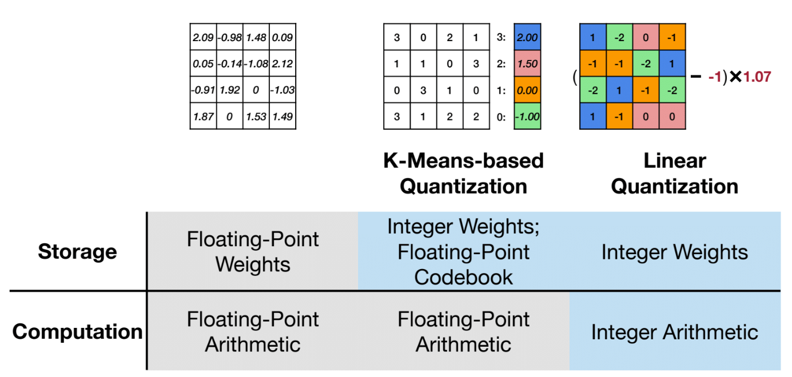
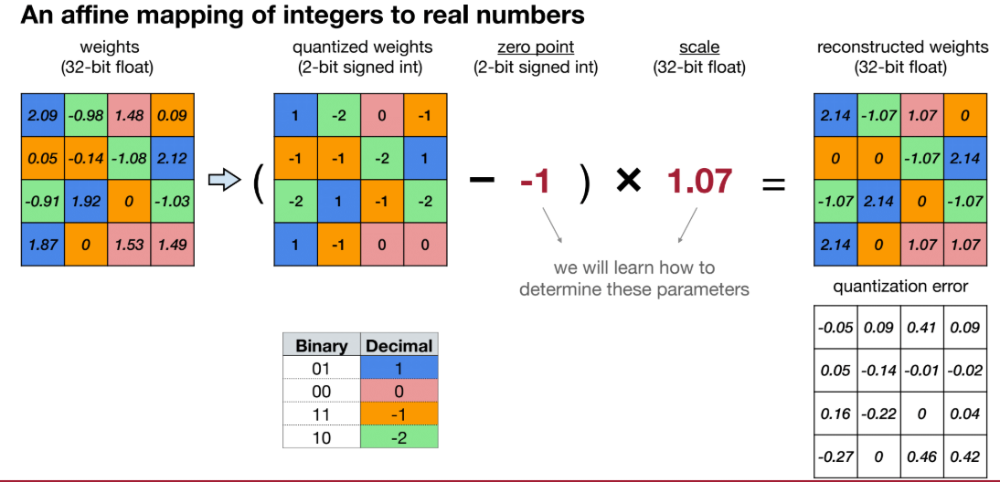
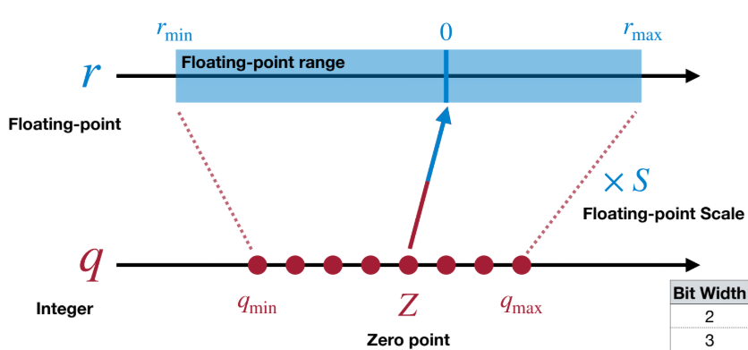
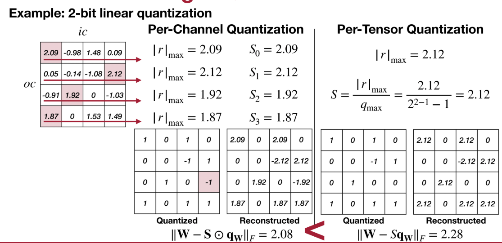
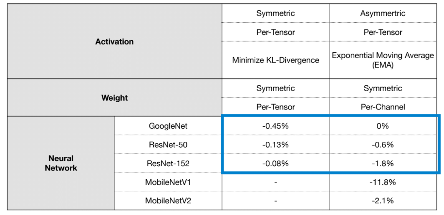
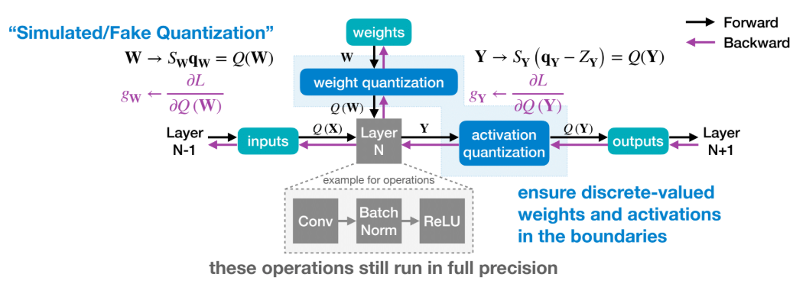
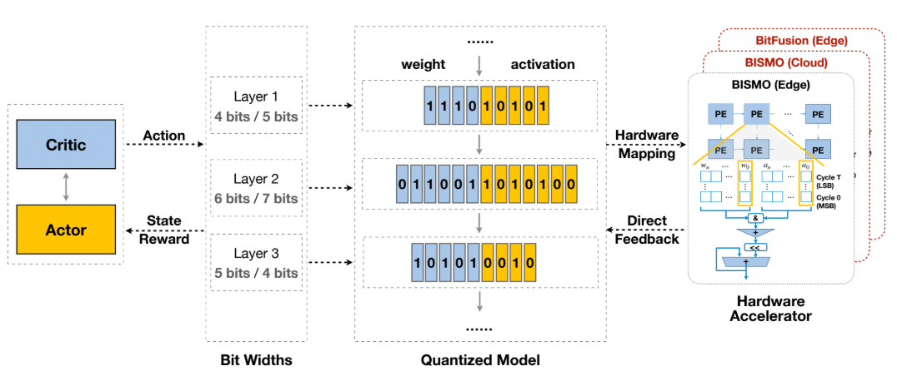

# Quantization

## Review: Numeric Data Types

> How is numeric data represented in modern computing systems?

Now we take a review about the numeric data types, including integer sand floating-point numbers (FP32, FP16, INT4, etc.)

- unsigned integer
  - n-bit range:$[0,2^n-1]$
- signed interger
  - Sign-Magnitude Representation: the first bit is sign bit
    - n-bit range:$[-2^{n-1}+1,2^{n-1}-1]$
    - Both 000...00 and 100...00 represent 0
  - Two’s Complement Representation
    - n-bit range:$[-2^{n-1},2^{n-1}-1]$
    - 000...00 represents 0
    - 100...00 represents $-2^{n-1}$

- fix-point number： sign+integer + 'Decimal' point+fraction

- floating-point number

  - 32-bit: sign bit + 8 bit exponent + 23 bit fraction(significant / mantissa)
    $$
    (-1)^{\text{sign}} \times (1 + \text{Fraction}) \times 2^{\text{Exponent} - 127} \quad\leftarrow\ \text{Exponent Bias} = 127 = 2^{8-1}-1
    $$

## What is Quantization

Quantization converts high-precision (e.g., 32-bit floating point) weights and activations into lower-precision representations (e.g., 8-bit integers). This reduces both memory and computational demands.

## Two Types of Common Quantization

- k-means-based quantization

  - A $n$-bit k-means quantization will divide synapses into $2^n$ clusters, and synapses in the same cluster will share the same weight value.

    Therefore, k-means quantization will create a codebook, inlcuding

    - `centroids`: $2^n$ fp32 cluster centers.
    - `labels`: a $n$-bit integer tensor with the same #elements of the original fp32 weights tensor. Each integer indicates which cluster it belongs to.

    During the inference, a fp32 tensor is generated based on the codebook for inference:

    > **_quantized_weight_ = _codebook.centroids_\[_codebook.labels_\].view_as(weight)**

  - Pro:

    - **Much lower quantization error** than uniform quantization (centroids adapt to real distribution)

  - Con: 

    - Harder to accelerate on standard hardware (centroid lookup)

    - More complicated training/integration

    - Not suitable for activation quantization (too slow)

- linear quantization(uniform quantization)

  - what: an affine mapping of integers to real numbers

    
    $$
    r(floating-point) = (q(integer)-Z(integer))\times S(floating-point)
    $$

    $$
    q = int(round(r/S))+Z
    $$
    
    > q stands for the n-bit signed int
    
    

## Post-Training Quantization(PTQ)

> How should we get the optimal linear quantization parameters $(S,Z)$ ?

Introduce Post-Training Quantization(PTQ) that quantizes a floating-point neural network model, including: channel quantization, group quantization, and range clipping

### Quantization Granularity

- per-tensor: use single scale for whole weight tensor

  - process: $|r|_{\max} = |W|_{\max}$, and get the scale $S = \frac{|r|_{\max}}{q_{\text{max}}}$
  - works well for large models
  - accuracy drops for small models

- per-channel

  

- group quantization

  - why: achieve a balance between quantization accuracy and hardware efficiency
  - what: Divide channels into groups of size `g` and assign one scale per group.

### Dynamic Range Clipping

When quantizing activations (or sometimes weights), the quantizer must map a **float range** to a fixed **INT8** or **INT4** range. Example activation distribution:

- Most values lie in **[−1, 1]**
- A few outliers lie in **[10, 20]**

Dynamic Range Clipping fixes this by removing outliers before computing min/max.

how:

- Exponential Moving Average (EMA)
- MSE-Based Clipping
- KL-Divergence Clipping

### Rounding

There`are two ways for rounding.

1. round to nearest

2. adaptive rounding for weight quantization

   - why: Rounding-to-nearest is not optimal

     > Weights are correlated with each other. The best rounding for each weight (to nearest) is not the best rounding for the whole tensor.

- Let`t check the MobileNet: Smaller models seem to not respondas well to post-training quantization, presumably due to their smaller representational capacity.

## Quantization-Aware Training(QAT)

> How should we improve performance of quantized models>

- what: **Quantization-Aware Training (QAT)** is a training technique where quantization effects are **simulated during training**, allowing the model to *learn* to be robust to quantization noise. It produces models whose INT8 (or INT4) accuracy is nearly identical to FP32 accuracy.

- why: QAT allows the model to adjust weights and activations during training as if they were quantized. For example, PTQ directly converts a trained FP32 model into INT8 without retraining which needs QAT.

- how:

  During QAT, quantization is inserted into the forward pass while gradients are computed through a non-quantized path.

  

  - how gradients  back-propagate through the (simulated) quantization？

    The answer is STE(Straight-Through Estimator)

    The **Straight-Through Estimator (STE)** is an approximation method used to compute gradients through **non-differentiable** or **discrete** operations during backpropagation.

    In quantization, many operations are **not differentiable**:

    - `round(x)`
    - `sign(x)`
    - `clip(x)`
    - discrete quantization function
    - binary/ternary quantization

    > different operation has different STE gradient.

    Because back-propagation requires gradients, STE allows us to *pretend* that these discrete operations are differentiable.

## Binary and Ternary Quantization

- binary: $\{-1,1\}$
- ternary: $\{-1,0,1\}$

- pro
  - Highest compression ratio
- con
  - Severe accuracy degradation in deep networks
  - Gradients through sign() are zero → need STE (Straight-Through Estimator)
  - Hard to train and unstable

## Mixed-precision Quantization

**Mixed-Precision Quantization** assigns **different bit-widths** (e.g., INT8, INT6, INT4, INT2, FP16) to **different layers or different tensors** within a model to achieve an optimal balance.

For each layer, we have different choices to choose the different percision. It`s hard to choose. Solution: design automation: HAQ (Hardware-Aware Automated Quantization) is a framework designed to optimize the quantization of deep neural networks (DNNs) by leveraging mixed precision.

## References

- <https://arxiv.org/pdf/2004.09602>
