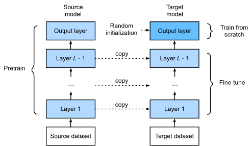

#  Transfer Learning

*Transfer learning* transfer the knowledge learned from the *source dataset* to the *target dataset*.

[TOC]

## Fine-Tuning

*fine-tuning*: a common technique in transfer learning

- Pipeline:

  

  1. Pretrain a neural network model, i.e., the *source model*, on a source dataset.
  2. Create a new neural network model, i.e., the *target model*. This copies all model designs and their parameters on the source model except the output layer.
     - We assume that these model parameters contain the knowledge learned from the source dataset and this knowledge will also be applicable to the target dataset.
     - We also assume that the output layer of the source model is closely related to the labels of the source dataset; thus it is not used in the target model.
  3. Add an output layer to the target model, whose number of outputs is the number of categories in the target dataset. Then randomly initialize the model parameters of this layer.
  4. Train the target model on the target dataset, such as a chair dataset. The output layer will be trained from scratch, while the parameters of all the other layers are fine-tuned based on the parameters of the source model.

  ```
  finetune_net = torchvision.models.resnet18(pretrained=True)
  finetune_net.fc = nn.Linear(finetune_net.fc.in_features, 2)
  nn.init.xavier_uniform_(finetune_net.fc.weight);
  ```

- Generally, fine-tuning parameters uses a smaller learning rate with just a few epochs, while training the output layer from scratch can use a larger learning rate.

### CV

CV can have large-scale labeled dataset.

### NLP

- NLP have large-scale unlabeled dataset.
- self-supervised pre-training

- Transformer based pre-trained models
  - BERT: a transformer encoder trained with masked words prediction and next  sentence prediction
  - GPT: a transformer decoder (will cover in prompt learning)
  - T5: a transformer encoder-decoder trained to fill span of text from documents

## Prompt-based Learning

- Goal: Fine-tune the weights of medium sized LM (e.g. <1B)
- Design task-specific prompts VS train a new output layer
  - Prompt-based FT is more example efficient than standard FT (100x)

- Automatic prompt search