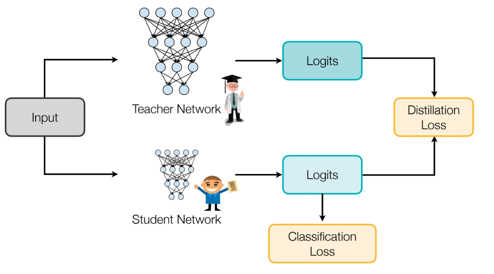
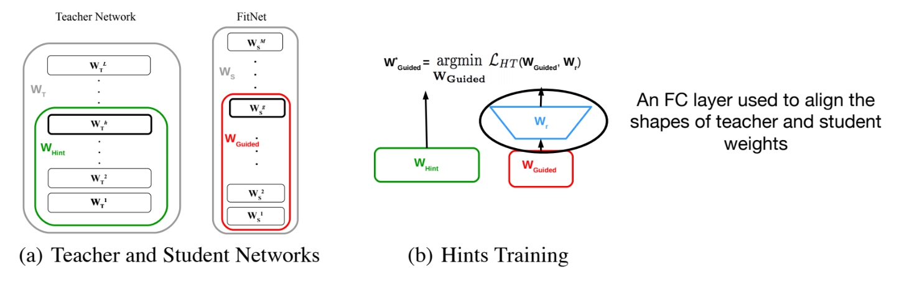
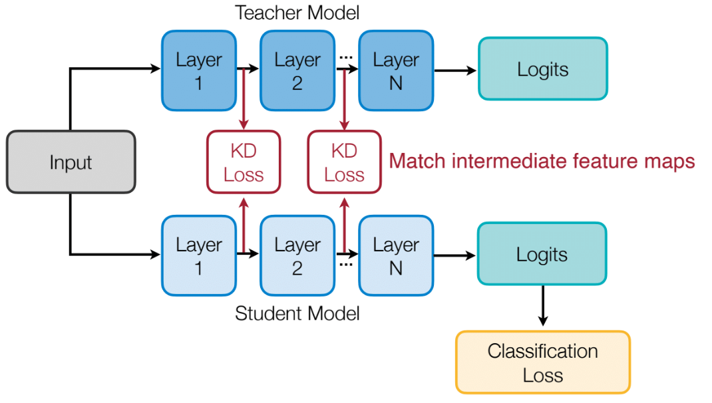
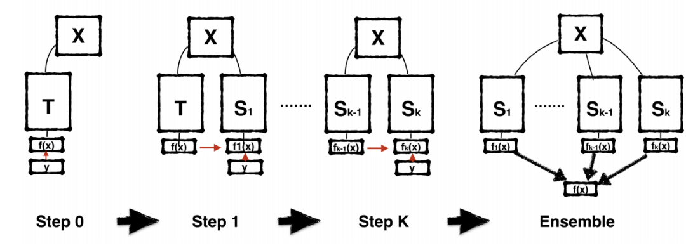
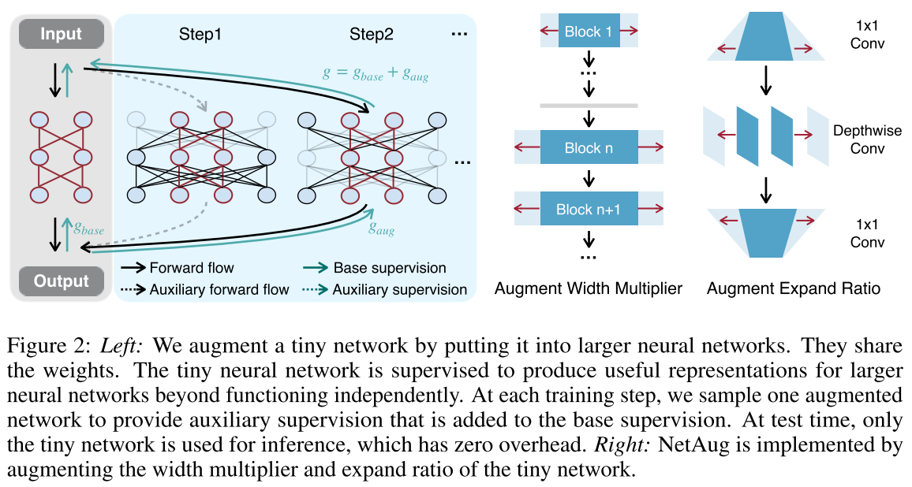

# Knowledge Distillation

## What is knowledge distillation



- The goal of knowledge distillation is to align the class probability distributions from teacher and student networks.

## What to match
How to match? - use distillation loss to train.

1. output logits

     - cross entropy loss
     - L2 loss
2. intermediate weights

   

   - An FC layer used to align the shapes of teacher and student weights.

3. intermediate features

   

   - minimizing maximum mean discrepancy between feature maps

4. gradients

5. sparsity patterns

6. relational information

## Self and online distillation

- self distillation

  

  - Born-Again Networks adds iterative training stages and using both classification objective and distillation objective in subsequent stages

    ```mermaid
    graph LR
    A[Teacher Model] -- Soft Targets --> B[Student Model]
    C[Hard Labels] -- Supervised Signal --> B
    ```

  - network architecture $T= S_1= S_2=...$

  - network accuracy $T< S_1<S_2...$

- online distillation

  - deep mutual learning
    - Idea of deep mutual learning: for both teacher and student networks, we want to add a distillation objective that minimizes the output distribution of the other party.
    - Deep mutual learning can improve both student (net 2) and teacher (net 1) models.

- combined

  be your own teacher: deep supervision + distillation

  - Use deeper layers to distill shallower layers.
  - Intuition: Labels at later stages are more reliable, so the authors use them to supervise thepredictions from the previous stages.

## Network augmentation

- conventional approach

  - data augmentation/dropout during training to avoid overfitting
    - improve large neural network`s performance
    - but hurts tiny nn performance(because tiny nn lacks capacity)

- network augmentation

  
