# Contrastive Learning 对比学习

## Intro

- 对比学习通过比较样本之间的相似性来学习表征。基本思想是让同一语义对象的不同视图更接近，让不同对象的表示更远。

  它常用于自监督学习和跨模态学习，例如 CLIP 通过图像-文本对比目标学习联合表征。

- 常用评价方法是什么：

  对于分类：冻结 encoder，只训练一个线性分类器。

  ```
  frozen encoder + linear classifier
  ```

下面介绍四个主要的发展阶段：

## 百花齐放

方法、模型、目标函数、代理任务都还没统一

### InstDisc

- __Unsupervised Feature Learning via Non-Parametric Instance-level Discrimination.__ *Zhirong Wu et al.* __arXiv, 2018__ [(Arxiv)](https://arxiv.org/abs/1805.01978)
  - Takeaway: 提出实例判别Instance Discrimination和memory bank做对比学习
  
  - Core Mechanism
  
    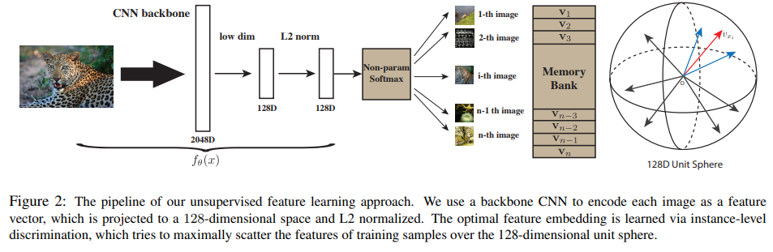
  
    - pretext task: Instance Discrimination
  
      正负样本的选择：用数据增强得到正样本，从memory bank中随即抽取4096个负样本，不断更新memory bank。
  
      > 因为memory bank要存的很多，因此维度不会很高仅128
  
    - NCE loss

### InvaSpread

- __Unsupervised Embedding Learning via Invariant and Spreading Instance Feature.__ *Mang Ye et al.* __arXiv, 2019__ [(Arxiv)](https://arxiv.org/abs/1904.03436) -- 

  - 一个编码器的端到端对比学习

  - Core Mechanism

    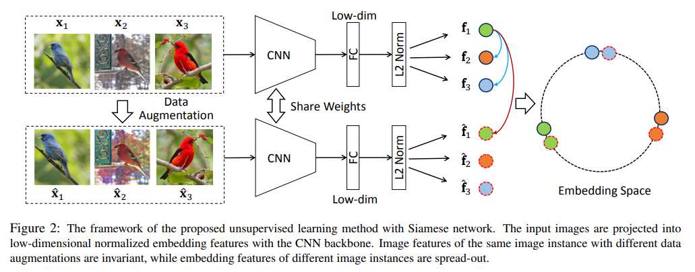

    - pretext task: Instance Discrimination

      正负样本的选择：一个minibatch=256，正样本还是数据增强后的图片（一共256），但是负样本是同一个minibatch的图片包括数据增强后的图片（2*(256-1)）。实现端到端的学习

    - NCE loss varient

  - Pro

    - 端到端学习
    - 可以认为是SimCLR前身

  - Con

    - 效果不好：batch size不够大，没有输出的MLP，数据增强也不强大

### CPC

- __Representation Learning with Contrastive Predictive Coding.__ *Aaron van den Oord et al.* __arXiv, 2018__ [(Arxiv)](https://arxiv.org/abs/1807.03748) -- CPC

  - Takeaway: 对比预测编码，图像语音文本强化学习全都能做

  - Core Mechanism

    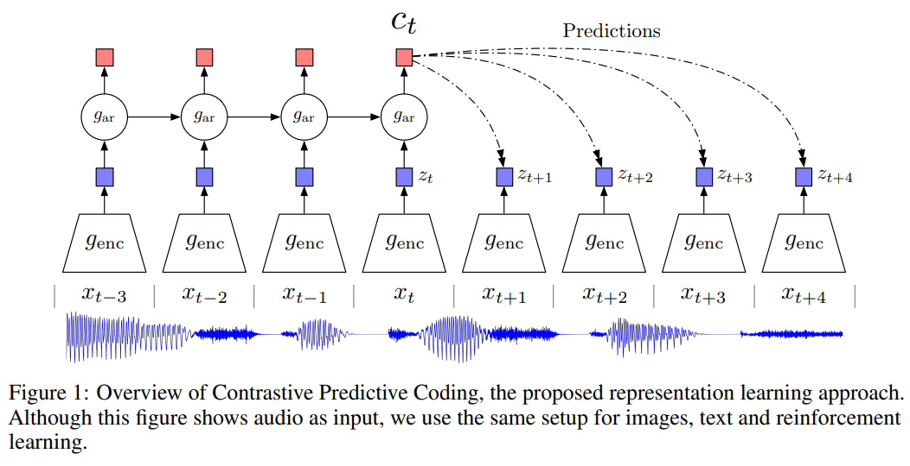

    >$g_{ar}$: auto regression,$c_t$: context representation

    - pretext task: prediction，自回归模型预测，真实的作为正样本，随机输入的作为负样本
    - model: 一个encoder+一个自回归模型

### CMC

- __Contrastive Multiview Coding.__ *Yonglong Tian et al.* __arXiv, 2019__ [(Arxiv)](https://arxiv.org/abs/1906.05849)

  - Takeaway: 多视角下的对比学习

    > 后面就发展为多模态的对比学习

  - Core Mechanism

    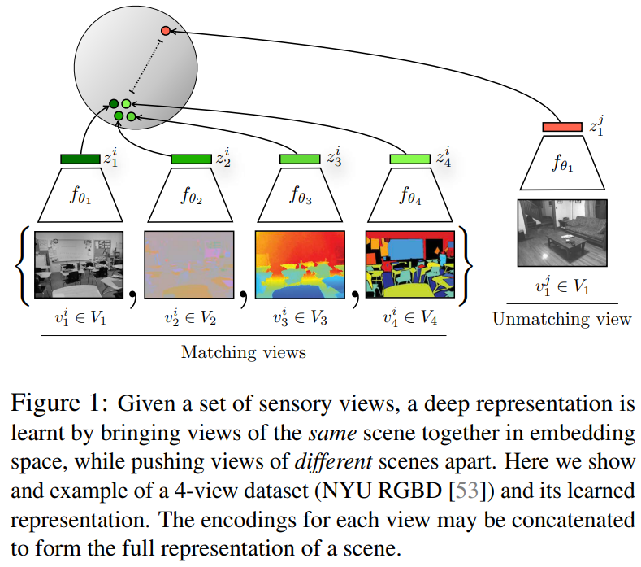

    - pretext task: 多视角（多模态）
    - Info min: 互信息要合适，不多也不少


## CV双雄

MoCo + SimCLR

### MoCov1

- **Momentum Contrast for Unsupervised Visual Representation Learning**. Kaiming He et.al. **CVPR**, **2020**, ([Arxiv](https://arxiv.org/abs/1911.05722)) [(CVF)](https://openaccess.thecvf.com/content_CVPR_2020/html/He_Momentum_Contrast_for_Unsupervised_Visual_Representation_Learning_CVPR_2020_paper.html) [(Code)](https://github.com/facebookresearch/moco). ([My PDF](https://drive.google.com/file/d/1eD-1PnWox5H9K87435BdAuLOkwza-H7L/view?usp=drivesdk))

  - Takeaway: MoCo 把 contrastive learning 看成 dictionary lookup：用一个动态 queue 存大量 negative keys，同时用 momentum encoder 生成稳定 keys，解决 queued features 的 consistency 问题

    > [!NOTE]
    >
    > 大家关注MoCo的原因是：MoCo是第一个使用无监督的预训练全面在主流视觉任务上比有监督预训练效果更好
    >
    > 当然我们对无监督学习还有其他期待：像nlp那样，更大模型+更多data是否能不断地提升性能

  - Prior

    

    > [!NOTE]
    >
    > 将对比学习归纳为一个动态字典的问题：query and key，使得query和key中positive向量相似，与negative key远离

    - NCE loss：
      - Motivation: 之前直接用CE来计算，但是因为是自监督学习，所以相当于每张图片都是一个类，这样类别很大，softmax基本就不work了，
      - Core: 我们在CE上进行改进得到NCE(noise contrastive estimation)，之前类别多产生问题，所以这里就只用两分类: data sample and noisy sample，NCE 用真实样本和噪声样本做二分类。但是数据还是很多，因此就使用采样的方法，所以叫做estimation

  - Motivation: 早期 instance-level contrastive learning 通常有两个矛盾：end-to-end 大 batch 方法需要很多 GPU memory，memory bank 方法虽然能存很多 negatives，但 encoder 更新后 bank 中旧特征容易不一致。

    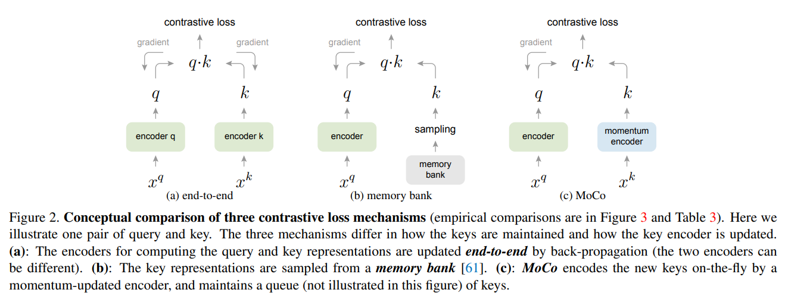

    > [!NOTE]
    >
    > 在MoCo之前主要有两种结构
    >
    > - end-to-end：有分别有两个encoder（可一样也可不一样），Pro:可动态更新consistent好，Con:需要大的batch_size(SimCLR好因为其8192的batch_size)。
    > - memory bank：对所有图片的特征直接先存起来，每次取出来$k_{sample}$计算loss，然后更新encoder，只是对$k_{sample}$推理得到新的特征更新memory bank。Pro:不需要大的batch_size，因为我已经用bank存起来了（随便取），Con:因为memory bank中的不同key是不同时间的encoder计算得到的，存在inconsistent

    因此我们想要 a large and consistent dictionary

    MoCo 的想法是不用特别大的 batch，而是维护一个动态队列来存储很多历史负样本

  - Core Mechanism:
  
    

    - Contrastive learning as dictionary lookup

      对一张图片做两种 augmentation，query encoder 产生 $q$，key encoder 产生正样本 $k_+$；queue 中其它图片的 keys 作为 negatives。核心 InfoNCE loss 是：

      $$
    \mathcal{L}_q = -\log \frac{\exp(q\cdot k_+ / \tau)}{\sum_{i=0}^{K}\exp(q\cdot k_i / \tau)}
      $$

      其中 $\tau$ 是 temperature，$K$ 是 queue 中 negative keys 数量。这个目标本质上是在大量候选 key 里识别与 query 匹配的 positive key。
  
      > [!NOTE]
    >
      > 本质上是将NCE去除的多分类又弄了回来，变成K+1类别的分类任务（回到cross entropy了）

    - Dynamic queue as a large dictionary
  
      MoCo 不把 negatives 限制在当前 mini-batch，而是维护一个 FIFO queue：当前 batch 的 keys enqueue，最旧的 keys dequeue。这样 dictionary size 和 batch size 解耦，可以用较小 batch 获得大量 negatives。

    - Momentum encoder for consistent keys

      如果 key encoder 每一步都被 backprop 直接更新，queue 里不同时间产生的 keys 会来自差异很大的 encoder，破坏 dictionary consistency。MoCo 用 query encoder 的 moving average 来更新 key encoder：

      $$
    \theta_{\mathrm{k}} \leftarrow m\theta_{\mathrm{k}} + (1-m)\theta_{\mathrm{q}}
      $$

      其中 $\theta_q$ 由梯度更新，$\theta_k$ 只做 momentum update。$m$ 接近 1 时，key encoder 变化更慢，queue 中旧 keys 与新 keys 更一致。
  
  - Pros: Momentum encoder 明确解决 queued features 的 consistency 问题。


### SimCLRv1

- **A Simple Framework for Contrastive Learning of Visual Representations**. Ting Chen et.al. **ICML**, **2020**, ([Arxiv](https://arxiv.org/abs/2002.05709)) [(Code)](https://github.com/google-research/simclr). ([My PDF](https://drive.google.com/open?id=1AsvXgGqrEvev7nSUiyjYTDqfPvdNfHtK))

  - Takeaway: 简单的对比学习 (数据增强 + MLP head + 大batch训练久)

  - Motivation: 早期 self-supervised visual representation learning 往往依赖复杂 pretext task、specialized architecture、memory bank 或 handcrafted heuristic。SimCLR 想回答的问题是：如果去掉 memory bank / special architecture，仅用 end-to-end contrastive learning，哪些训练组件真正决定 representation quality？

    > [!NOTE]
    >
    > 这里有个trade-off:
    >
    > 因为需要大batch更好，因为负样本更多，任务更难，更能学习。但是当batch大了之后，会有很多false negetive，比如都是两只哈巴狗（不同图片），这时是当作负样本被推开的
    >
    > 实际上大的batch size是必要的（可以查看MoCo的介绍），SimCLR是直接end-to-end的学习，因为有google的tpu，batch_size为8192，已经满足大batch_size的需求了

  - Core Mechanism:

    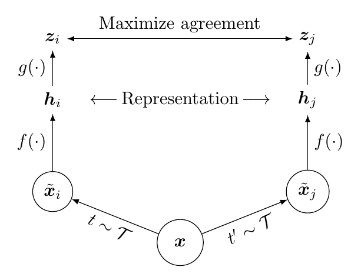

    SimCLR 简单结构：两次 augmentation 产生 positive pair，经同一个 encoder $f(\cdot)$ 得到 representation $h$，再经 projection head $g(\cdot)$ 得到 contrastive space 中的 $z$；预训练结束后丢弃 $g$，只保留 encoder representation $h$。
    
    - Strong data augmentation defines the task

      对每个 image 随机采样两种 augmentation view，形成 positive pair；论文中关键组合是 random crop + color distortion，并加入 Gaussian blur。

      一个 minibatch(4096) 有 $N$ 张图，每张图生成两个 views，共 $2N$ 个样本；同一原图的两个 views 是 positive，其余 $2(N-1)$ 个 views 都作为 in-batch negatives。

    - Nonlinear projection head separates training space and representation space

      encoder $f(\cdot)$ 输出 $h_i$，projection head $g(\cdot)$ 再映射到 $z_i$，contrastive loss 作用在 $z$ 上而不是直接作用在 $h$ 上：

      $$
      h_i = f(\tilde{x}_i), \qquad z_i = g(h_i)=W^{(2)}\sigma(W^{(1)}h_i)
      $$

      加一个 nonlinear projection head 会**明显提升**最终 encoder representation 的 linear evaluation 质量；直觉上，projection head 可以吸收 contrastive objective 需要的不变性约束，让下游使用的 $h$ 保留更多有用信息。
    
      > [!NOTE]
      >
      > 什么是projection head 可以吸收 contrastive objective 需要的不变性约束？为什么需要吸收这个约束？
      >
      > 如果没有projection head模型会被鼓励忽略：颜色变化、局部细节这些内容，这对 contrastive task 是好的，因为它让两个 view 更容易被拉近（这就是不变性约束），我们希望projection head来满足这些不变性约束，而representation希望尽量保留更丰富的信息
    
    - Loss: NT-Xent loss with normalized embeddings and temperature
    
      对 positive pair $(i,j)$，SimCLR 使用 normalized temperature-scaled cross entropy loss：
      $$
      \ell_{i,j} = -\log \frac{\exp(\operatorname{sim}(z_i,z_j)/\tau)}{\sum_{k=1}^{2N} \mathbf{1}_{[k\neq i]}\exp(\operatorname{sim}(z_i,z_k)/\tau)} \\
      \mathcal{L}
      =
      \frac{1}{2N}
      \sum_{k=1}^{N}
      \left[
      \ell_{2k-1,2k}
      +
      \ell_{2k,2k-1}
      \right]
      $$
    
      其中 $\text{sim}(z_i, z_j)=\frac{z_i^\top z_j}{\|z_i\|\|z_j\|}$ 是 cosine similarity，$\tau$ 是 temperature，$1_{k\ne i}$排除自己和自己的相似度。分子拉近同一图片的两个 augmented views，分母把 batch 内其它 views 当 negatives 推远。
    
      > [!NOTE]
      >
      > 本质是一个cross entropy：可以把公式改写成 softmax 分类。
      >
      > 对 anchor $z_i$，模型给每个候选 $z_k$ 一个 logit：
      >$$
      > \text{logit}_{i,k}
      > =
      > \frac{\text{sim}(z_i,z_k)}{\tau}
      > $$
      > 然后 softmax 得到 $z_k$ 是正样本的概率：
      > $$
      > p_{i,k}
      > =
      > \frac{
      > \exp(\text{sim}(z_i,z_k)/\tau)
      > }{
      > \sum_{m=1}^{2N} \mathbf{1}_{m \ne i}
      > \exp(\text{sim}(z_i,z_m)/\tau)
      > }
      > $$
      > 真正的正确类别是 $j$，所以 loss 就是：
      > $$
      > \ell_{i,j} = -\log p_{i,j}
      > $$
      > 这和普通分类交叉熵非常像
      > 
      
      normalization 和 temperature 共同控制 similarity scale 与 hard negative 权重，使 contrastive cross entropy 更稳定、更适合大 batch 训练。
      
    
  - Cons
  
    - 对 large batch 和 long training 比较敏感，训练资源需求高。
    - In-batch negative 机制可能把语义相近但不同实例的图片当成 negatives，存在 false negative 问题。

### MoCov2

- __Improved Baselines with Momentum Contrastive Learning.__ *Xinlei Chen et al.* __arXiv, 2020__ [(Arxiv)](https://arxiv.org/abs/2003.04297)

  - Takeaway: MoCov1 + improvements from SimCLRv1.效果很好
  - Experiment

    这里主要看看实验

    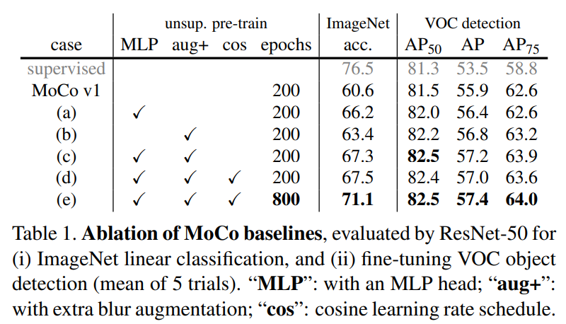

    MLP的效果提升很明显，而且对比学习epoch越长，效果越好


### SimCLRv2

- __Big Self-Supervised Models are Strong Semi-Supervised Learners.__ *Ting Chen et al.* __arXiv, 2020__ [(Arxiv)](https://arxiv.org/abs/2006.10029)

  - Takeaway: 大的自监督预训练模型很适合做半监督学习

  - Core Mechanism

    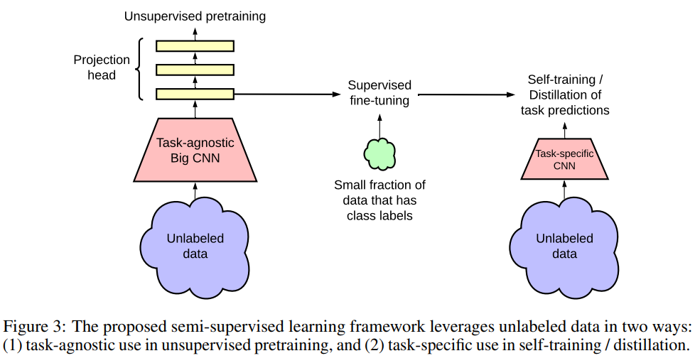

    用半监督方法训练一个teacher得到伪标签，再来训练student

    - 对比学习：bigger backbone+2层projection head+MoCo动量编码器


### DeepClustering

### SWaV

- __Unsupervised Learning of Visual Features by Contrasting Cluster Assignments.__ *Mathilde Caron et al.* __arXiv, 2020__ [(Arxiv)](https://arxiv.org/abs/2006.09882)

  - Takeaway: 聚类对比学习（已经没有负样本了）。SWaV(SWapping Assignments between Views)

  - Core Mechanism

    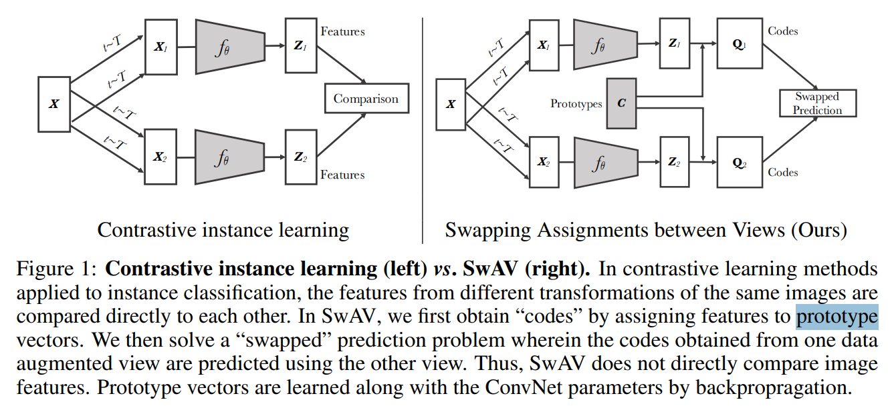

    - multi crop: 不要只从一张图生成 2 个大视图，而是生成多个不同分辨率的视图，让模型在全局和局部之间学习一致的语义表示。将2\*224\*224->2\*160\*160+4\*96\*96，全局+局部


## 不用负样本

### BYOL

> [!TIP]
>
> 论文中latent,hidden,embedding,feature其实都是特征的意思，哈哈

- __Bootstrap your own latent: A new approach to self-supervised Learning.__ *Jean-Bastien Grill et al.* __arXiv, 2020__ [(Arxiv)](https://arxiv.org/abs/2006.07733) [(good_blog)](https://imbue.com/blog/2020-08-24-understanding-self-supervised-contrastive-learning#852338ad0406)

  - Takeaway: 不需要负样本的对比学习

  - Core Mechanism

    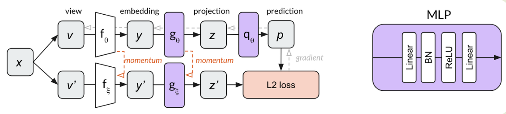

    - pretext task: 变成预测任务，自己预测自己

      mse loss

    - model: 上分支被称为Online，下分支被称为Target，结构不对称


blog中提出MLP中必须有BN

> [!NOTE]
>
> 在MLP中必须有BN才能防止模型坍塌。why?
>
> maybe是因为BN泄漏：计算了整个batch的均值方差，相当于得到了batch中其他样本的信息，相当于可能是学了当前正样本跟平均图片的差异（隐含的负样本）

- __BYOL works even without batch statistics.__ *Pierre H. Richemond et al.* __ArXiv, 2020__ [(Arxiv)](https://arxiv.org/abs/2010.10241) [(S2)](https://www.semanticscholar.org/paper/af424c489ada416912634f1e580a485e10e53770) (Citations __130__)
  - 回应blog：证明了不是BN提供的隐式负样本才能学得好，就是正样本之间自己玩就OK

### SimSiam

- __Exploring Simple Siamese Representation Learning.__ *Xinlei Chen, Kaiming He.* __2021 IEEE/CVF Conference on Computer Vision and Pattern Recognition (CVPR), 2020__ [(Arxiv)](https://arxiv.org/abs/2011.10566) [(S2)](https://www.semanticscholar.org/paper/0e23d2f14e7e56e81538f4a63e11689d8ac1eb9d) (Citations __4994__)

  - Takeaway: 化繁为简的孪生表征学习。CNN做对比学习的归纳总结工作

    因为之前的对比学习的发展都是一个个tricks堆起来的

  - Core Mechanism

    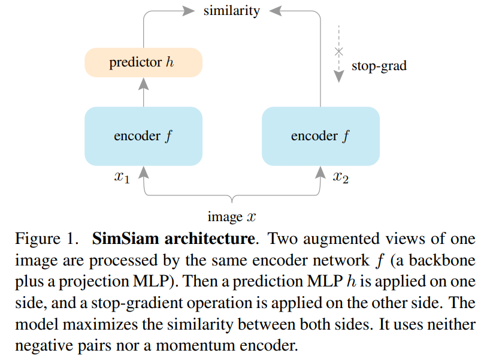

    不用负样本，不用大的batch，不用momentum encoder（这里是共享权重）照样能正常训练 -- 主要是因为有stop gradient的存在

    - EM(expection-maximization)算法的解释

  - Experiment

    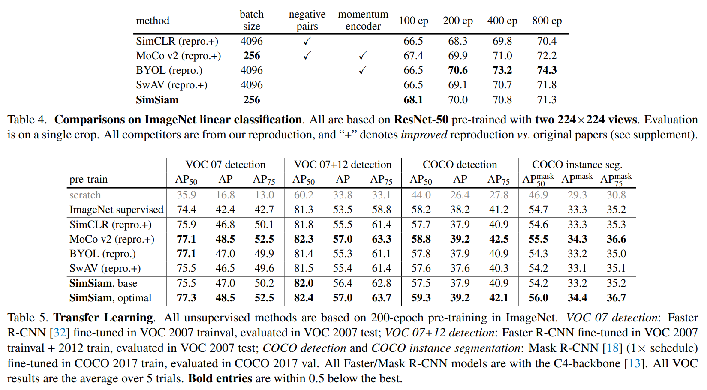


### 孪生网络结构对比

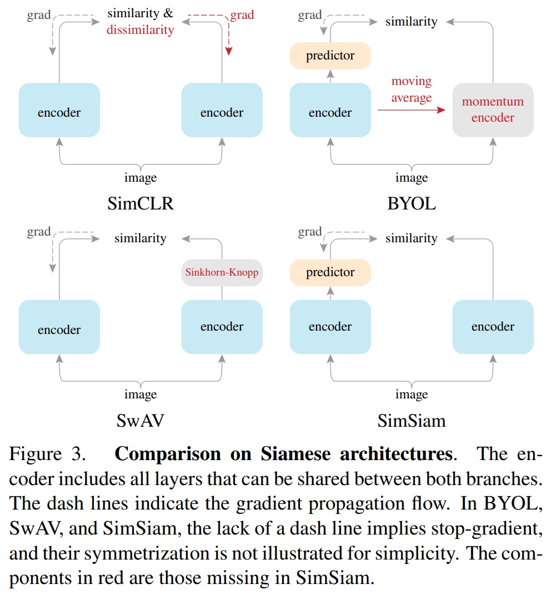

### Barlow Twins

- __Barlow Twins: Self-Supervised Learning via Redundancy Reduction.__ *Jure Zbontar et al.* __arXiv, 2021__ [(Arxiv)](https://arxiv.org/abs/2103.03230) 
  - 换了目标函数


## 基于Transformer

### MoCov3

- __An Empirical Study of Training Self-Supervised Vision Transformers.__ *Xinlei Chen et al.* __2021 IEEE/CVF International Conference on Computer Vision (ICCV), 2021__ [(Arxiv)](https://arxiv.org/abs/2104.02057) [(S2)](https://www.semanticscholar.org/paper/739ceacfafb1c4eaa17509351b647c773270b3ae) (Citations __2369__)
  - Takeaway: 如何更稳定的自监督训练ViT
  
    > [!TIP]
    >
    > 当训练出现问题的时候，可以查看一下梯度回传的大小
  
  - Core Mechanism
  
    - 这里发现tokenization的projection head是很大影响的

### DINO

- __Emerging Properties in Self-Supervised Vision Transformers.__ *Mathilde Caron et al.(meta FAIR)* __ICCV, 2021__ [(Arxiv)](https://arxiv.org/abs/2104.14294) [(Code)](https://github.com/facebookresearch/dino)

  - Takeaway: DINOv1 就是BYOL+Vit，用centering+sharpening来稳定训练。

    Insight：自监督 ViT 的 last-block self-attention 会自然浮现 object boundaries / semantic layout
    
  
    > DINO 训练的 ViT last-block `[CLS]` attention 能直接突出 objects / boundaries，说明 SSL(Self-Supervised Learning) ViT feature 保留了 dense layout information。
  
    > [!TIP]
    >
    > 严格说，DINO 不属于经典对比学习，DINO 属于 self-supervised learning 中的 self-distillation
  
  - Core Mechanism:
  
    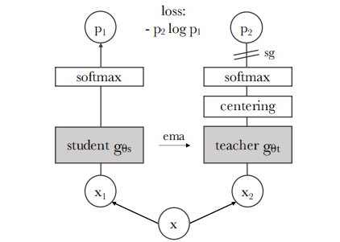
  
    - Multi-crop local-to-global training + Momentum teacher + stop-gradient
  
    - 稳定训练：Centering + sharpening 防止 collapse
    
      teacher 输出在 softmax 前先减去 batch center，再用较低 teacher temperature 做 sharpening：
      $$
      P_t(x)=\text{softmax}\left(\frac{g_{\theta_t}(x)-c}{\tau_t}\right)
      $$
    
      center 用 EMA 更新：
  
      $$
      c \leftarrow mc + (1-m)\frac{1}{B}\sum_{i=1}^{B}g_{\theta_t}(x_i)
      $$
    centering 防止某一维长期支配输出，但会推动分布趋向 uniform；sharpening 让 teacher target 更尖锐（因为要作为监督），但单独使用又可能导致另一种 collapse。两者配合在 momentum teacher 下形成平衡。student branch 使用较高温度 softmax（平滑一点学习）。
    
  - Cons: 训练仍然敏感
