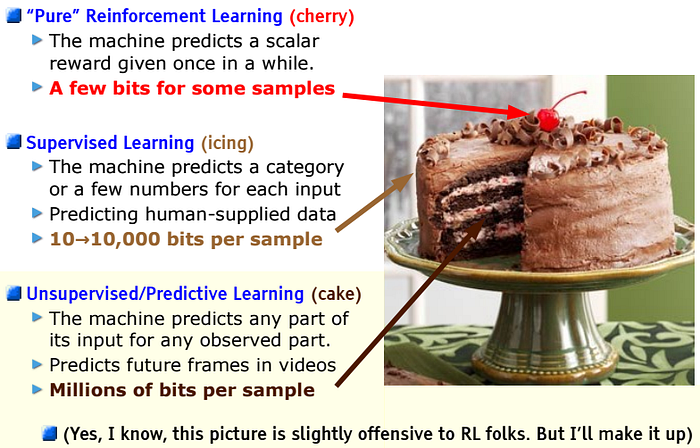

# Learning Paradigms and Methods

[TOC]

机器学习方法可以从多个正交维度分类。一个方法通常不会只属于一个类别，例如自监督学习既可以按监督信号来源分类，也常用于表征学习；对比学习既是一类训练目标，也常作为自监督学习的具体实现。

<!--more-->

## Taxonomy

```text
机器学习方法
│
├── 按监督信号来源分类
│   ├── 监督学习
│   ├── 无监督学习
│   ├── 半监督学习
│   ├── 自监督学习
│   ├── 弱监督学习
│   └── 主动学习
│
├── 按训练目标分类
│   ├── 判别式学习
│   ├── 生成式学习
│   ├── 对比学习
│   ├── 对抗学习
│   └── 表征学习
│
├── 按交互方式分类
│   ├── 强化学习
│   ├── 模仿学习
│   └── 在线学习
│
└── 按迁移与泛化能力分类
    ├── 迁移学习
    ├── 多任务学习
    ├── 元学习
    ├── 小样本学习
    ├── 持续学习
    └── 联邦学习
```



## 按监督信号来源分类

这类分类关注：**训练信号来自哪里，以及标签成本有多高**。

| 方法 | 核心问题 | 典型场景 |
| --- | --- | --- |
| 监督学习 | 使用人工标注的输入-输出对学习映射 | 分类、回归、目标检测、机器翻译 |
| 无监督学习 | 从无标签数据中发现结构或分布规律 | 聚类、降维、密度估计、异常检测 |
| 半监督学习 | 少量有标签数据 + 大量无标签数据 | 医学影像、网页分类、语音识别 |
| 自监督学习 | 从数据本身构造监督信号 | BERT 掩码预测、GPT next-token prediction、图像对比学习 |
| 弱监督学习 | 使用噪声标签、不完整标签或规则标签 | 远程监督、程序化标注、网页弱标签 |
| 主动学习 | 模型主动选择最值得标注的样本 | 标注预算有限的数据集构建 |

### 监督学习

监督学习假设训练集中有明确的输入 \(x\) 和目标 \(y\)，目标是学习从 \(x\) 到 \(y\) 的映射：

$$
f_\theta: x \rightarrow y
$$

常见任务包括分类、回归、序列标注、检测与分割。它的优势是目标清晰、评估直接；局限是依赖高质量标注数据。

典型思路：

- **经验风险最小化**：定义损失函数，例如交叉熵或均方误差，在训练集上最小化预测误差。
- **正则化控制泛化**：用 L1/L2 正则、Dropout、数据增强、early stopping 等方法避免过拟合。
- **特征到标签的端到端映射**：传统方法依赖人工特征，深度学习通常直接从原始输入学习多层特征。
- **训练-验证-测试划分**：用验证集调参，用测试集估计最终泛化能力。

Pros:

- 目标明确，损失函数和评估指标通常容易定义。
- 在高质量标注数据充足时，效果稳定且容易落地。
- 工程流程成熟，适合分类、回归、检测等标准任务。

Cons:

- 依赖大量人工标注，数据成本高。
- 对标签噪声敏感，错误标注会直接影响训练。
- 泛化能力受训练分布限制，遇到分布外数据容易退化。

### 无监督学习

> TODO: https://sites.google.com/view/berkeley-cs294-158-sp24/home?utm_source=chatgpt.com

无监督学习只使用输入数据 \(x\)，不依赖人工标签。它通常用于发现数据内部结构，例如相似样本聚类、低维流形、潜变量或概率分布。

常见方法包括 K-Means、PCA、Autoencoder、Gaussian Mixture Model 等，包含无监督学习。

典型思路：

- **聚类**：把相似样本分到同一组，例如 K-Means、层次聚类、谱聚类。
- **降维**：保留主要信息并压缩表示，例如 PCA、t-SNE、UMAP、Autoencoder。
- **密度建模**：估计数据分布，用于生成、异常检测或概率推断，例如 GMM、normalizing flow。
- **结构发现**：从数据中找出潜在因子、主题或低维流形。

Pros:

- 不需要人工标签，适合大规模未标注数据。
- 能发现数据中的潜在结构，用于探索分析和预处理。
- 可作为下游任务的特征学习或初始化方法。

Cons:

- 目标函数常与真实任务目标不完全一致。
- 评估困难，聚类或表示质量不一定有直接标准。
- 结果可解释性和稳定性可能较弱，受超参数影响明显。

### 半监督学习

半监督学习结合少量有标签数据和大量无标签数据。核心假设是数据分布本身能提供额外约束，例如相近样本应该有相近标签，决策边界应该避开高密度区域。

常见技术包括伪标签、Consistency Regularization、Mean Teacher、FixMatch 等。

典型思路：

| 方法            | 核心思想                                   |
| --------------- | ------------------------------------------ |
| 伪标签          | 模型给无标签数据生成标签，再用这些标签训练 |
| 一致性正则      | 同一个样本加扰动后，预测结果应该一致       |
| 图传播          | 相似样本应该有相似标签                     |
| Teacher-Student | teacher 给 student 提供软监督              |

Pros:

- 能用少量标签撬动大量无标签数据，降低标注成本。
- 在标签稀缺但无标签数据丰富的任务中很实用。
- 常能提升模型泛化，尤其适合图像、语音、文本分类。

Cons:

- 依赖分布假设；如果无标签数据分布不匹配，可能伤害性能。
- 伪标签错误会被模型不断放大。
- 训练流程比纯监督学习更复杂，调参成本更高。

### 自监督学习SSL

> 无监督学习的一种
>
> TODO: https://lilianweng.github.io/posts/2019-11-10-self-supervised/?utm_source=chatgpt.com

常用对比学习


自监督学习从数据本身构造预测任务，不需要人工标注。它的关键是设计 pretext task（这里就是八仙过海大显神通的时候了，看脑洞），使模型通过完成代理任务学习可迁移的表征。

一些典型的pretext task：

- NLP: masked language modeling, next-token prediction
- CV: image inpainting, rotation prediction, contrastive learning
  - instance discrimination: 同一张图的两种增强视图应该相似

- Multimodal: image-text matching, masked image-text modeling

> [!NOTE]
>
> 其实后面的操作都是固定的套路，关键就在于如何设计pretext task

典型思路：

| 数据类型 | 自监督任务                     |
| -------- | ------------------------------ |
| 图像     | 遮住一块图像，让模型恢复       |
| 图像     | 同一张图的两种增强视图应该相似 |
| 文本     | 遮住词，让模型预测             |
| 视频     | 预测未来帧                     |
| 语音     | 遮住语音片段，让模型恢复       |

Pros:

- 不依赖人工标签，能利用海量原始数据。
- 适合预训练通用表示，再迁移到多个下游任务。
- 在 NLP、CV、多模态中已经成为现代大模型训练核心范式。

Cons:

- 预训练成本高，通常需要大量算力和数据。
- 代理任务设计会影响最终表示质量。
- 学到的能力不一定自动覆盖目标任务，仍可能需要微调或对齐。

### 弱监督学习

弱监督学习使用**不完全、不精确或带噪声**的监督信号。它适合标注昂贵但可以获得规则、启发式标签或外部知识的场景。

| 弱监督类型 | 例子                           |
| ---------- | ------------------------------ |
| 不完整标签 | 只有部分样本有标签             |
| 粗粒度标签 | 只有图像级标签，没有像素级标签 |
| 噪声标签   | 标签可能是错的                 |
| 规则标签   | 用人工规则自动生成标签         |

弱监督的挑战是如何建模标签噪声，并防止模型过拟合错误监督信号。

典型思路：

- **规则或启发式标注**：用关键词、模式匹配、知识库、程序化规则生成标签。
- **多源标签融合**：把多个弱标注源合并，估计每个标注源的可靠性。
- **噪声鲁棒训练**：使用 label smoothing、样本重加权、噪声转移矩阵等方法降低错误标签影响。
- **远程监督**：用外部数据库或知识图谱自动构造训练样本，常见于信息抽取。

Pros:

- 可以快速构造大规模训练数据，减少精标成本。
- 适合专家规则、知识库或业务日志丰富的场景。
- 能把人类先验以规则或标注函数形式注入训练流程。

Cons:

- 标签噪声不可避免，错误监督可能形成系统性偏差。
- 弱标注规则的覆盖率和准确率需要额外评估。
- 模型可能学到规则漏洞，而不是真正的任务语义。

### 主动学习

主动学习假设标注预算有限，让模型主动挑选最有价值的样本交给人类标注。常见选择策略包括不确定性采样、多样性采样和期望模型变化。

典型思路：

| 策略         | 含义                             |
| ------------ | -------------------------------- |
| 不确定性采样 | 选择模型最犹豫的样本             |
| 多样性采样   | 选择覆盖不同分布的样本           |
| 代表性采样   | 选择最典型的样本                 |
| 查询委员会   | 多个模型意见不一致的样本优先标注 |

Pros:

- 在标注预算有限时，提高每个标签的价值。
- 能优先补齐模型薄弱区域，减少冗余标注。
- 适合医学、法律、工业检测等标注昂贵领域。

Cons:

- 需要人类标注系统和模型训练系统形成闭环。
- 采样策略不当会造成数据偏置。
- 频繁迭代训练和标注会增加工程复杂度。

## 按训练目标分类

这类分类关注：**模型被训练去优化什么目标**。

| 方法 | 核心目标 | 典型例子 |
| --- | --- | --- |
| 判别式学习 | 直接学习$p(y|x)$或决策边界 |                                                 |
| 生成式学习 | 学习 \(p(x)\)、\(p(x,y)\) 或数据生成过程 | VAE、GAN、Diffusion Model、Autoregressive Model |
| 对比学习 | 拉近正样本、推远负样本 | SimCLR、MoCo、CLIP |
| 对抗学习 | 通过竞争目标提升模型能力或鲁棒性 | GAN、adversarial training |
| 表征学习 | 学习可迁移、可复用的特征表示 | Autoencoder、self-supervised pretraining |

### 判别式学习

判别式学习直接面向预测任务，学习输入到标签的条件关系：

$$
p(y|x)
$$

它通常在分类和回归任务中表现强，训练目标直接，评估清晰。

典型思路：

- **直接学习决策边界**：不必完整建模数据生成过程，只关心如何区分类别或预测目标。
- **最大化条件似然**：训练分类器输出正确标签的概率更高。
- **间隔最大化**：例如 SVM 追求类别之间更大的 margin，提高泛化能力。
- **判别特征学习**：让同类样本表示更接近，不同类样本更容易分开。

Pros:

- 直接优化预测性能，通常在分类和回归上效率高。
- 不需要建模完整数据分布，训练目标更聚焦。
- 输出结果容易和任务指标对应。

Cons:

- 对数据分布本身理解较少，生成、补全能力弱。
- 对分布外样本和类别变化可能不够鲁棒。
- 需要足够覆盖目标边界的训练样本。

### 生成式学习

生成式学习关注数据如何产生，目标是建模数据分布：

$$
p(x) \quad \text{or} \quad p(x, y)
$$

生成式模型可以用于数据生成、补全、压缩、异常检测和表示学习。现代生成式学习包括自回归模型、VAE、GAN 和扩散模型。

典型思路：

- **自回归分解**：把联合分布拆成条件概率连乘，逐步生成数据。
- **潜变量建模**：假设观测数据由潜变量生成，例如 VAE 学习隐空间和解码器。
- **对抗生成**：生成器和判别器博弈，使生成样本逐渐接近真实数据。
- **逐步去噪**：扩散模型从噪声中逐步恢复数据，学习反向生成过程。

```
Naive Bayes
GMM
VAE
GAN
Diffusion Model
Autoregressive Model
Flow Model
```

Pros:

- 能生成新样本，也能做补全、去噪、编辑和模拟。
- 学习数据分布，适合无监督或自监督预训练。
- 可用于数据增强、异常检测和多模态生成。

Cons:

- 训练成本通常较高，采样也可能较慢。
- 评估生成质量困难，指标和人类感受不总是一致。
- 可能生成不真实、有偏或不可控的内容。

### 对比学习

check 01-1. 对比学习通过比较样本之间的相似性来学习表征。基本思想是让同一语义对象的不同视图更接近，让不同对象的表示更远。

它常用于自监督学习和跨模态学习，例如 CLIP 通过图像-文本对比目标学习联合表征。

References

- check [对比学习论文综述【论文精读】](https://www.bilibili.com/video/BV19S4y1M7hm/?share_source=copy_web&vd_source=93bb338120537438ee9180881deab9c1)


### 对抗学习

对抗学习通过两个或多个目标之间的竞争训练模型。典型例子是 GAN：生成器尝试生成逼真样本，判别器尝试区分真实样本和生成样本。

对抗鲁棒训练：对抗思想也用于鲁棒性训练，例如用 adversarial examples 提升模型面对扰动时的稳定性。

典型思路：

- **生成-判别博弈**：一个模型制造难样本，另一个模型识别或抵抗这些样本。
- **最小最大优化**：训练目标通常包含互相竞争的 min-max 结构。
- **对抗样本训练**：在输入上加入小扰动，让模型学会对局部攻击保持稳定。
- **领域对抗**：通过对抗目标让模型学到领域无关表征，用于 domain adaptation。

Pros:

- 能提升生成质量、鲁棒性或领域不变性。
- 对难样本敏感，能暴露普通训练目标忽略的问题。
- 在生成建模和鲁棒训练中有重要价值。

Cons:

- 训练不稳定，容易出现模式崩溃或梯度问题。
- min-max 优化难调，超参数和训练技巧影响大。
- 对抗鲁棒性常伴随精度、成本或可解释性权衡。

### 表征学习

表征学习关注如何把原始数据转换成更适合下游任务的表示。好的表征通常具有可分性、可迁移性、鲁棒性和压缩性。

深度学习的一个核心优势就是可以端到端学习层级表征。

```
原始数据 x
↓
表征 z
↓
下游任务
```

典型思路：

- **层级特征学习**：低层学习局部模式，高层学习抽象语义。
- **预训练再迁移**：先在大规模数据上学习通用表示，再迁移到下游任务。
- **瓶颈压缩**：通过 Autoencoder 或信息瓶颈让表示保留关键因素。
- **解耦表示**：希望不同维度对应不同可解释因素，例如形状、颜色、姿态。

Pros:

- 能减少下游任务对标注数据的依赖。
- 好的表示可以跨任务复用，提升迁移效率。
- 有助于把高维原始数据变成更容易建模的结构。

Cons:

- 表征质量难直接评估，通常依赖下游任务验证。
- 预训练目标和下游任务不匹配时收益有限。
- 可能保留数据偏见或丢失任务关键细节。

## 按交互方式分类

这类分类关注：**模型是否与环境交互，以及训练数据是否随时间变化**。

| 方法 | 核心问题 | 典型场景 |
| --- | --- | --- |
| 强化学习 | 通过试错最大化长期回报 | 游戏、机器人、推荐系统、决策控制 |
| 模仿学习 | 从专家行为中学习策略 | 自动驾驶、机器人操作、游戏 AI |
| 在线学习 | 数据流持续到来，模型边用边更新 | 广告点击率预测、金融风控、实时推荐 |

### 强化学习

强化学习研究智能体如何在环境中采取动作，以最大化长期累计奖励。它通常被建模为 Markov Decision Process：

$$
(S, A, P, R, \gamma)
$$

强化学习的核心难点包括 exploration vs exploitation、credit assignment、sample efficiency 和稳定训练。

典型思路：

- **价值函数学习**：估计状态或动作的长期价值，例如 Q-learning、DQN。
- **策略优化**：直接优化策略参数，例如 Policy Gradient、PPO。
- **Actor-Critic**：Actor 负责选择动作，Critic 负责评估动作价值。
- **探索机制**：用 epsilon-greedy、熵正则、内在奖励等方法探索环境。

```
Q-learning
DQN
Policy Gradient
Actor-Critic
PPO
SAC
DDPG
AlphaZero
```

Pros:

- 适合序列决策和长期回报优化问题。
- 不要求每一步都有人工标签，可以从环境反馈中学习。
- 能处理控制、规划、博弈、机器人等交互任务。

Cons:

- 样本效率低，真实环境试错成本高。
- 奖励设计困难，容易出现 reward hacking。
- 训练不稳定，结果对环境、随机种子和超参数敏感。

### 模仿学习

模仿学习不直接从奖励函数开始，而是从专家示范中学习策略。它适合奖励难以设计但专家轨迹容易获得的场景。

常见方法包括 Behavior Cloning 和 Inverse Reinforcement Learning。

典型思路：

- **行为克隆**：把专家状态-动作对当作监督学习数据，直接学习 \(s \rightarrow a\)。
- **逆强化学习**：从专家行为中反推出奖励函数，再用强化学习求策略。
- **DAgger**：让模型执行策略并由专家纠正，缓解训练分布和执行分布不一致。
- **离线轨迹利用**：在不频繁真实交互的情况下，从已有专家数据中学习。

| 方法                           | 含义                     |
| ------------------------------ | ------------------------ |
| Behavior Cloning               | 直接把专家动作当标签     |
| Inverse Reinforcement Learning | 反推出专家背后的奖励函数 |
| GAIL                           | 用对抗学习模仿专家行为   |

Pros:

- 不需要手写复杂奖励函数，直接利用专家示范。
- 比纯强化学习更省交互样本，训练初期更稳定。
- 适合自动驾驶、机器人等专家轨迹可获得的任务。

Cons:

- 性能上限受专家数据质量限制。
- 行为克隆容易出现分布偏移，错误会在执行时累积。
- 很难超越专家，除非结合强化学习或额外探索。

### 在线学习

在线学习中，模型不断接收新数据并更新参数。它关注数据分布变化、低延迟更新和长期稳定性。

在线学习与持续学习相关，但在线学习更强调数据流式到来和即时更新；持续学习更强调跨任务长期记忆与避免遗忘。

典型思路：

- **逐样本或小批量更新**：每来一批新数据就更新模型，而不是等待完整数据集。
- **滑动窗口**：只保留最近数据，适应分布变化。
- **增量优化**：使用 SGD、online convex optimization 等方法持续修正参数。
- **漂移检测**：监控数据分布或性能变化，发现 concept drift 后调整模型。

Pros:

- 能快速适应新数据和分布变化。
- 不需要等待完整数据集，适合实时系统。
- 训练和部署可以持续闭环，保持模型新鲜度。

Cons:

- 容易受到噪声、异常流量或短期偏差影响。
- 需要监控模型漂移、性能退化和数据质量。
- 如果没有回放或约束，可能遗忘旧模式。

## 按迁移与泛化能力分类

这类分类关注：**模型如何利用已有知识解决新任务、新领域或新数据分布问题**。

| 方法 | 核心问题 | 典型场景 |
| --- | --- | --- |
| 迁移学习 | 把源任务知识迁移到目标任务 | ImageNet 预训练、LLM fine-tuning |
| 多任务学习 | 同时学习多个相关任务 | 多头模型、联合训练、语义分割 + 深度估计 |
| 元学习 | 学会如何快速学习 | few-shot classification、learning to optimize |
| 小样本学习 | 少量样本下泛化到新类别或新任务 | few-shot image classification、prompt learning |
| 持续学习 | 顺序学习多个任务且避免遗忘 | lifelong learning、continual adaptation |
| 联邦学习 | 多方数据不共享，协同训练模型 | 医疗、金融、移动端个性化 |

### 迁移学习

迁移学习利用源领域或源任务中学到的知识，提高目标领域或目标任务的学习效率。现代深度学习中，预训练再微调是最常见的迁移学习范式。

典型思路：

- **预训练 + 微调**：先在大规模源数据上训练，再在目标任务上调整参数。
- **冻结特征提取器**：保留通用 backbone，只训练下游任务头。
- **领域自适应**：缩小源领域和目标领域的分布差异。
- **参数高效迁移**：只训练少量新增参数，例如 adapter、LoRA、prompt tuning。

Pros:

- 显著降低目标任务的数据和算力需求。
- 能复用大规模预训练模型中的通用知识。
- 在标注数据有限时通常比从零训练更可靠。

Cons:

- 源任务和目标任务差异大时可能发生负迁移。
- 预训练模型的偏见、错误和限制会被继承。
- 微调策略不当可能破坏原有能力或过拟合小数据。

### 多任务学习

多任务学习在一个模型中同时优化多个任务。它希望相关任务共享表征，从而提升泛化能力或降低训练成本。

核心问题是任务之间可能互相帮助，也可能产生负迁移。

典型思路：

- **共享主干 + 任务头**：底层表示共享，不同任务使用各自输出头。
- **联合损失优化**：把多个任务损失加权组合，同时训练。
- **任务权重调节**：动态调整不同任务的 loss weight，避免某个任务主导训练。
- **任务关系建模**：利用任务之间的层级、依赖或相似性设计共享结构。

Pros:

- 相关任务可以互相提供归纳偏置，提高泛化能力。
- 共享模型结构能降低存储和推理成本。
- 有助于学习更通用的表示。

Cons:

- 任务冲突会导致负迁移。
- loss 权重、采样比例和共享层设计较难调。
- 不同任务的数据规模和收敛速度差异会带来训练不平衡。

### 元学习

元学习的目标是 learning to learn，即让模型从多个任务经验中学到快速适应新任务的能力。

典型方向包括基于优化的元学习、基于度量的元学习和基于模型的元学习。

典型思路：

- **基于优化**：学习一个好的初始化，使模型用少量梯度步就能适应新任务，例如 MAML。
- **基于度量**：学习 embedding 空间，在新任务中通过距离或原型分类，例如 Prototypical Networks。
- **基于记忆或模型**：让模型内部带有快速适应机制，例如外部记忆、超网络。
- **任务级训练**：训练时按任务采样 episode，使训练过程接近测试时的新任务适应。

Pros:

- 目标是快速适应新任务，适合任务频繁变化的场景。
- 能把跨任务经验转化为学习策略或初始化。
- 和小样本学习、个性化建模关系紧密。

Cons:

- 需要大量训练任务，而不只是大量样本。
- 训练过程复杂，计算成本和实现成本较高。
- 训练任务分布和测试任务分布不一致时效果会下降。

### 小样本学习

小样本学习关注在每个新类别或新任务只有极少样本时如何泛化。它和元学习关系紧密，但小样本学习更强调问题设定，元学习更强调训练策略。

常见设定

```
N-way K-shot
```

例如 5-way 1-shot 表示有 5 个类别，每个类别只有 1 个样本。

典型思路：

- **度量学习**：学习一个空间，使少量支持样本足以定义类别边界。
- **原型方法**：用每类少量样本的均值作为 class prototype。
- **数据增强或生成**：合成更多样本，缓解数据稀缺。
- **利用预训练模型**：通过 prompt、linear probing 或轻量微调释放大模型已有知识。

Pros:

- 适合新类别、新场景快速上线。
- 大幅减少标注需求。
- 与预训练模型结合时，工程实用性强。

Cons:

- 少量样本很难覆盖类内变化，结果不稳定。
- 对样本选择和 prompt/模板设计敏感。
- 容易把预训练模型中的偏见误当作任务知识。

### 持续学习

持续学习要求模型按顺序学习新任务，同时尽量保留旧任务能力。核心挑战是 catastrophic forgetting。

常见方法包括 replay、regularization、parameter isolation 和 dynamic architecture。

典型思路：

- **经验回放**：保存旧任务样本或生成伪样本，与新任务一起训练。
- **正则化保护旧知识**：限制重要参数变化，例如 EWC。
- **参数隔离**：为不同任务分配不同子网络、mask 或 adapter。
- **动态扩展结构**：当新任务无法复用旧结构时，增加新模块。

Pros:

- 支持模型长期学习和持续适应新任务。
- 避免每次新任务都从零训练或完整重训。
- 更接近真实系统中数据和任务不断变化的情况。

Cons:

- catastrophic forgetting 很难彻底解决。
- 需要在新任务学习和旧任务保持之间权衡。
- 回放旧数据可能受存储、隐私或数据许可限制。

### 联邦学习

联邦学习允许多个客户端在不直接共享原始数据的情况下协同训练模型。它的核心目标是兼顾数据隐私、通信效率和模型性能。

典型算法是 FedAvg。主要挑战包括 non-IID 数据、通信开销、客户端异构性和隐私攻击。

典型思路：

- **本地训练 + 中央聚合**：客户端在本地数据上训练，服务器聚合参数更新。
- **FedAvg**：服务器按数据量或权重平均各客户端模型参数。
- **隐私增强**：结合差分隐私、安全聚合或加密技术降低泄露风险。
- **个性化联邦学习**：在共享全局模型的同时，为不同客户端保留个性化部分。

Pros:

- 原始数据留在本地，适合隐私敏感场景。
- 能利用多方分散数据训练共享模型。
- 适合医疗、金融、移动端等数据难集中领域。

Cons:

- 客户端数据 non-IID 会影响全局模型效果。
- 通信成本高，客户端算力和网络条件不一致。
- 仍可能存在梯度泄露、投毒攻击和系统安全风险。

## Others

- 度量学习：关注样本之间的距离

- 排序学习：学习谁应该排在前面。例如搜广推

- 图学习

- 因果学习：因果学习不只关注相关性，还关注原因和结果

  相关并不等于因果：冰淇淋销量和溺水人数都在夏天增加，但冰淇淋不是溺水的原因

- 蒸馏

## Relations

| 方法       | 是否需要标签   | 训练信号来自哪里 | 典型目标         | 代表方法                  |
| ---------- | -------------- | ---------------- | ---------------- | ------------------------- |
| 监督学习   | 需要           | 人工标签         | 预测标签         | CNN，SVM，XGBoost         |
| 无监督学习 | 不需要         | 数据自身结构     | 发现规律         | K-means，PCA，Autoencoder |
| 半监督学习 | 少量需要       | 标签加无标签数据 | 提高数据利用率   | FixMatch，Mean Teacher    |
| 自监督学习 | 不需要人工标签 | 构造的预训练任务 | 学表征           | BERT，SimCLR，MAE         |
| 弱监督学习 | 需要弱标签     | 噪声或粗标签     | 低成本训练       | MIL，Snorkel              |
| 主动学习   | 部分需要       | 模型主动请求标签 | 降低标注成本     | Uncertainty Sampling      |
| 对比学习   | 不一定         | 样本相似关系     | 学距离结构       | SimCLR，MoCo，CLIP        |
| 对抗学习   | 不一定         | 模型之间竞争     | 生成或增强鲁棒性 | GAN，PGD                  |
| 强化学习   | 不需要标签     | 环境奖励         | 学决策策略       | DQN，PPO，SAC             |
| 模仿学习   | 需要示范       | 专家行为         | 学专家策略       | BC，GAIL                  |
| 迁移学习   | 通常需要       | 预训练知识       | 迁移到新任务     | Fine-tuning               |
| 元学习     | 需要任务集合   | 多任务经验       | 快速适应新任务   | MAML，ProtoNet            |
| 持续学习   | 不固定         | 连续任务数据     | 不遗忘旧知识     | Replay，EWC               |
| 联邦学习   | 不固定         | 分布式本地数据   | 隐私保护训练     | FedAvg                    |

这些分类维度不是互斥的。更好的理解方式是把一个具体方法放到多个维度中定位：

| 方法例子 | 监督信号 | 训练目标 | 交互方式 | 迁移与泛化 |
| --- | --- | --- | --- | --- |
| BERT 预训练 | 自监督学习 | 表征学习 | 离线训练 | 迁移学习 |
| GPT 预训练 | 自监督学习 | 生成式学习 | 离线训练 | 迁移学习 |
| CLIP | 自监督/弱监督学习 | 对比学习 | 离线训练 | 迁移学习 |
| GAN | 可监督或无监督 | 生成式学习、对抗学习 | 离线训练 | 可用于迁移 |
| PPO | 奖励监督 | 强化学习目标 | 强化学习 | 可结合迁移或多任务 |
| FedAvg | 取决于任务标签 | 取决于本地任务 | 分布式协作 | 联邦学习 |

## References

- https://sites.google.com/view/berkeley-cs294-158-sp24/home?utm_source=chatgpt.com
- https://lilianweng.github.io/posts/2019-11-10-self-supervised/?utm_source=chatgpt.com
