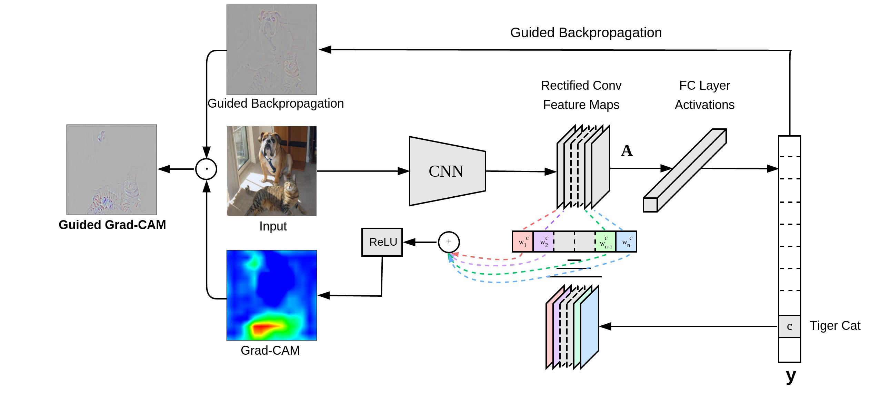

# Representation Learning

表征学习: 

> [!NOTE]
>
> Deep learning is representation learning.

## 什么是表征学习

表征学习：模型自动学会把原始数据转换成更有用的“表示/特征”

> [!TIp]
>
> 一张图片 → 一个向量，向量里编码“边缘、纹理、物体类别、姿态”等信息。
>
> 一句话 → 一个 embedding，编码语义、语法、上下文关系。

表征学习希望模型自己从数据里学出特征。下面给出一个直观的例子：

假设你要训练模型判断图片是猫还是狗。如果模型直接看像素，它看到的是几百万个数字。如果模型学到了表征，它可能逐层形成：

- 低层表征：边缘、颜色、纹理
- 中层表征：耳朵、眼睛、毛发、轮廓
- 高层表征：猫脸、狗脸、动物姿态
- 最终表征：一个能区分猫狗的向量

深度学习之所以强，很大程度上就是因为神经网络能自动学习这种**层级化表征**。

那么自然而然就会引出问题：

1. 怎样的表征是更好的：就是能让后续学习任务更容易的表征，具有以下的一些性质：抽象性，解耦性（不同的特征尽量分开，disentangled representation），平滑性（不同的猫应该有相似的语义特征），可迁移性，层次性（深度学习区别于浅层模型的关键）

   > [!NOTE]
   >
   > 迁移学习是深度表征最重要的发现之一

   > [!NOTE]
   >
   > 解耦型，如果模型能把“手的形状”和“背景光照”分开，它就更容易泛化。如果模型把二者混在一起，它可能会学到 shortcut

   > [!TIP]
   >
   > 这里给出一个好的表征的例子：同样是分类任务，原始像素空间中可能不可线性分割，但经过神经网络的隐藏层变换后，最后一层特征可能已经变得接近线性可分

2. 如何才能学习更好的表征：这就是我们要研究的东西，为什么能学到好特征，以及什么样的目标函数、网络结构、先验假设能帮助模型学得更好

## 如何更好地学习表征

这是一些早期的路线图：

| 方法类别       | 主要思想                                             |
| -------------- | ---------------------------------------------------- |
| 概率模型       | 用隐变量解释观测数据，比如 RBM、DBN                  |
| 自动编码器     | 让模型压缩并重构输入，从而学到 latent representation |
| 稀疏编码       | 希望一个样本只激活少量特征，使表示更简洁             |
| 流形学习       | 假设高维数据分布在低维流形附近                       |
| 深层网络       | 通过多层非线性变换学习层次化表征                     |
| 无监督特征学习 | 利用无标签数据学习对下游任务有用的特征               |

### 深度学习中的表征学习

表征学习有一个核心矛盾：既要保留输入中的信息，又要让表征具备好的性质，比如独立性、稀疏性、可分性等

> [!NOTE]
>
> 这里的一个trade-off其实就是：保留对任务有用的信息，压缩或丢弃对任务无关的信息

- 早期的深度学习训练：greedy layer-wise unsupervised pretraining。它的思想是，每一层单独用无监督方法训练，比如 RBM、autoencoder、sparse coding，然后把这些层堆起来，再做有监督微调。当然现在是端到端的学习

- 有监督学习：使用loss and label来做trade-off，但是标签只告诉模型“结果是什么”，不一定告诉模型“正确原因是什么”。所以有监督学习还需要正则化、数据增强、更多数据和合理结构来避免 shortcut

- 无监督和自监督：无监督学习没有标签，所以它必须自己设计“什么该保留，什么该忽略”。这时 trade-off 主要由训练目标决定。

  - Autoencoder 的目标是重构输入：
    $$
    X \rightarrow Z \rightarrow \hat X
    $$
    如果 bottleneck 很小，模型必须压缩信息，只保留最重要的因素。

  - Denoising Autoencoder：故意把输入破坏，然后让模型恢复原图。希望学习稳定结构

  - SimCLR：不同的数据增强

当然不同的任务需要的trade-off不同，比如分类就希望对很多细节不敏感（比如背景，颜色扰动等，因此分类的表征通常更抽象）

## 可视化

2013：Visualizing ConvNet: Seeing is understanding.可视化查看输入会创造怎样的feature

如何可视化查看呢：

1. set a one-hot featuremap
2. back-prop to pixels

如果是论文或实验分析，建议至少放两类图：

1. feature map / heatmap，说明模型关注区域，Grad-CAM看模型做某个预测时依赖哪里
2. t-SNE / UMAP，说明表征空间是否更可分

- __Grad-CAM: Visual Explanations from Deep Networks via Gradient-based Localization.__ *Ramprasaath R. Selvaraju et al.* __arXiv, 2016__ [(Arxiv)](https://arxiv.org/abs/1610.02391) 

  - Takeaway: 

  - Motivation

    它想回答一个问题：模型为什么把这张图判断成某一类？用于模型可解释性分析

  - Core Mechanism

    Grad-CAM 使用某个类别得分对最后一层卷积特征图的梯度，来衡量每个通道对该类别的重要性

    

- LayerCAM https://pubmed.ncbi.nlm.nih.gov/34156941/

  像素位置的正梯度”去加权 activation

  - 比 Grad-CAM 更细
  - 对中浅层更友好
  - 对小目标更友好
  - 更容易在 FPN 层看到局部结构

## References

- [DeepLearning book chapter15](https://www.deeplearningbook.org/contents/representation.html?utm_source=chatgpt.com)

- [A review](https://pubmed.ncbi.nlm.nih.gov/23787338/)
