# LLM Basic Concepts and Full Pipeline

- 本章目标：画一张大模型总图，包含数据、tokenizer、embedding、attention、FFN、训练目标、推理、微调、评估。跑通一个最小文本生成脚本。写一页笔记，总结大模型训练与使用流程。

## Basic Concepts

- natural language processing (NLP) is still challenging.
- LLM
  - characters
    - **Scale**: They contain millions, billions, or even hundreds of billions of parameters
    - **General capabilities**: They can perform multiple tasks without task-specific training
    - **In-context learning**: They can learn from examples provided in the prompt
    - **Emergent abilities**: As these models grow in size, they demonstrate capabilities that weren’t explicitly programmed or anticipated
  - limitations
    - **Hallucinations**: They can generate incorrect information confidently
    - **Lack of true understanding**: They lack true understanding of the world and operate purely on statistical patterns
    - **Bias**: They may reproduce biases present in their training data or inputs.
    - **Context windows**: They have limited context windows (though this is improving)
    - **Computational resources**: They require significant computational resources

## Full Pipeline

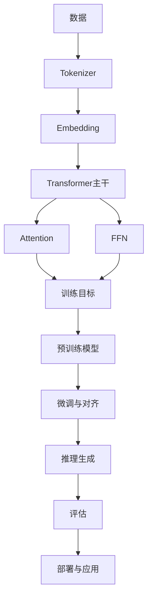

下面我们来分别看每一步部分的大概实现

### 数据

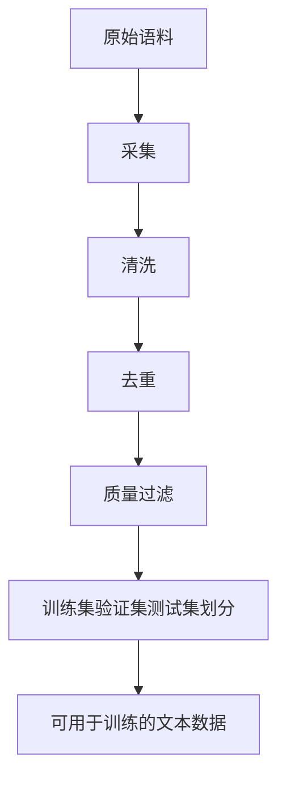

### Tokenizer

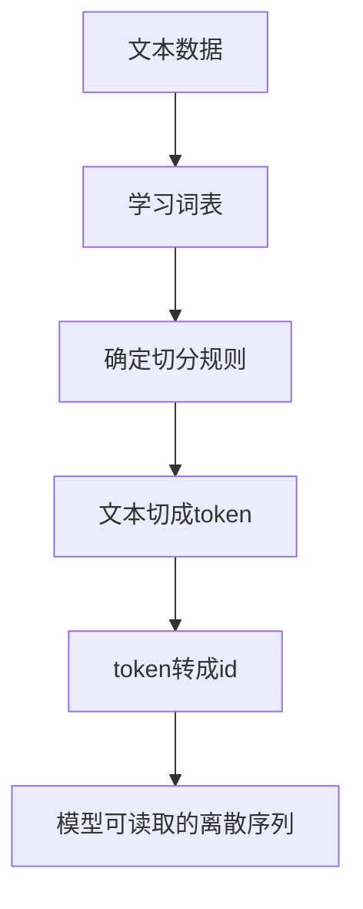

### 输入表达

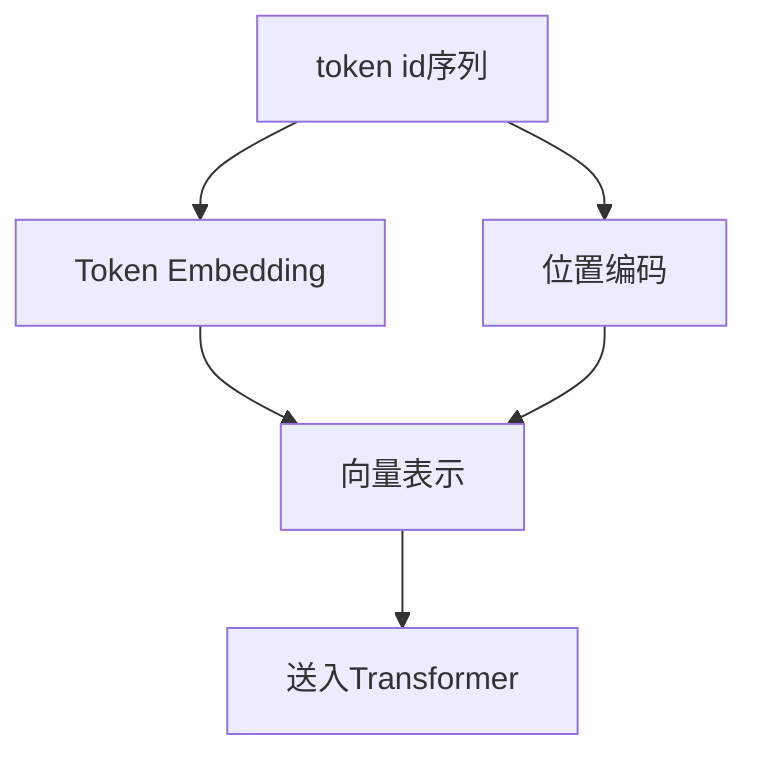

### Transformer 内部模块

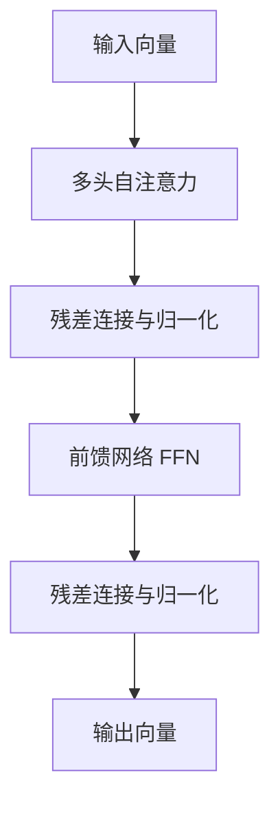

他们分别的作用

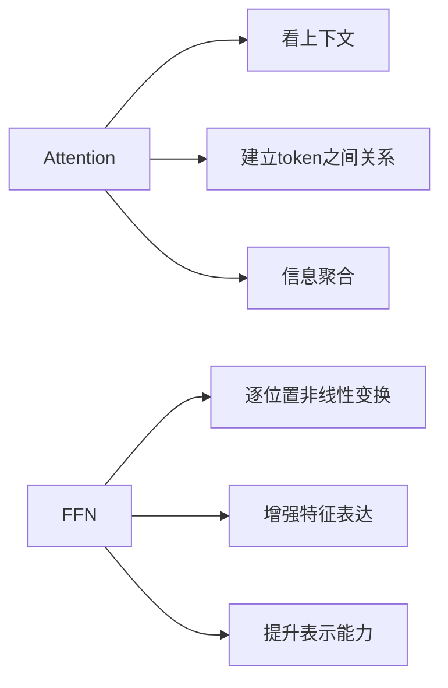

### training

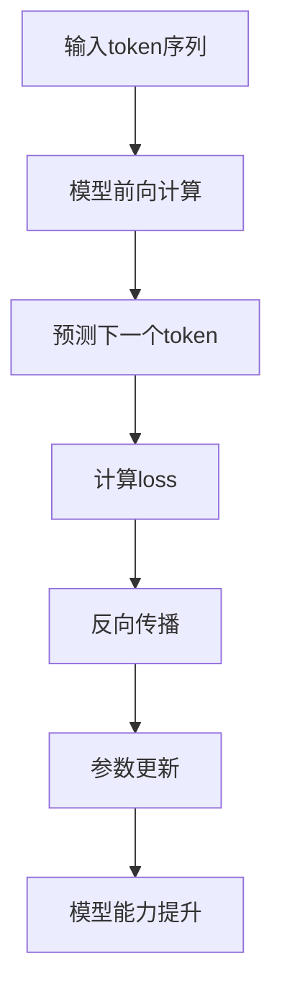

### 微调与对齐模块

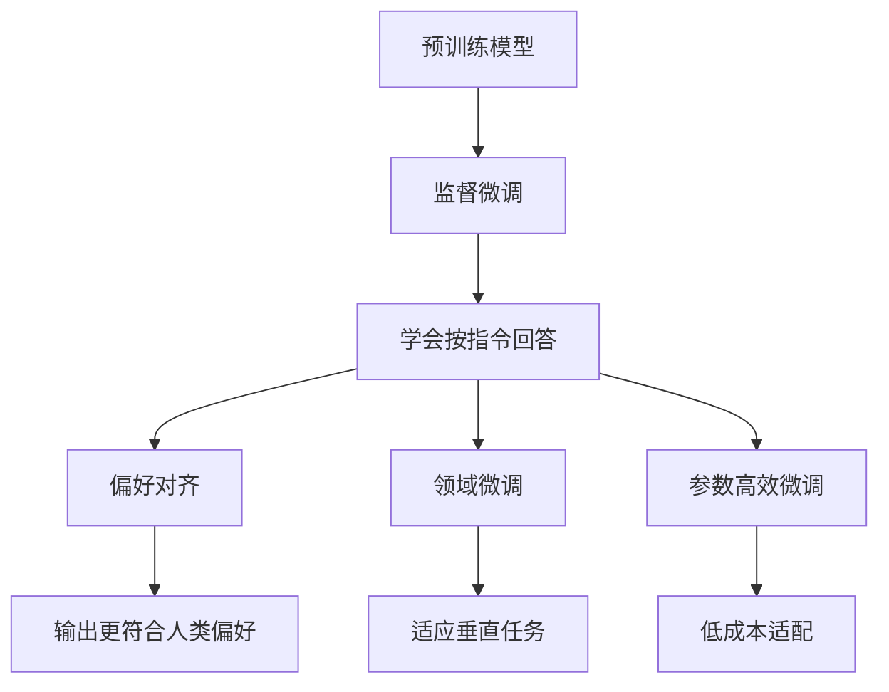

### 推理模块

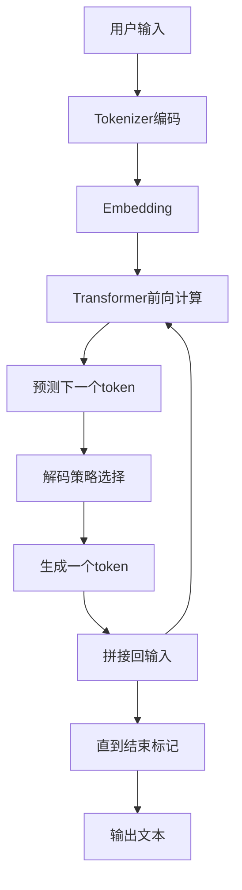

解码策略

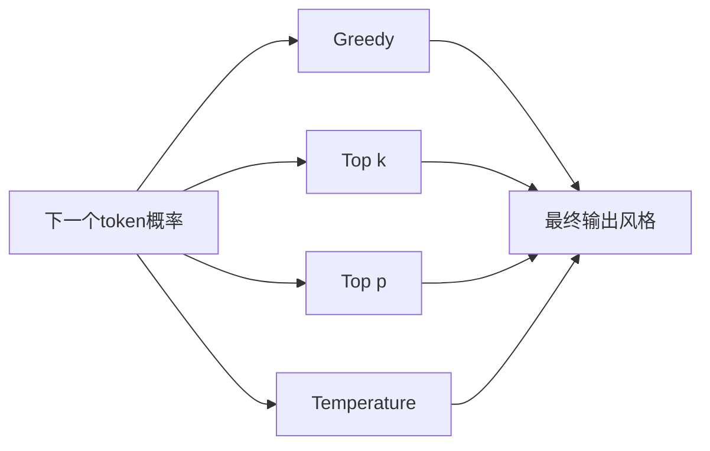

### 评估与应用模块

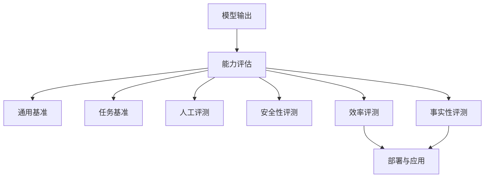

## References

- Hugging Face LLM Course 第 1 章 ([Hugging Face](https://huggingface.co/learn/llm-course/en/chapter1/1?utm_source=chatgpt.com))
- Stanford CS336 课程主页 ([Stanford CS336](https://cs336.stanford.edu/?utm_source=chatgpt.com))
- Attention Is All You Need 论文 ([arXiv](https://arxiv.org/abs/1706.03762?utm_source=chatgpt.com))
- Transformers Quickstart 官方文档 ([Hugging Face](https://huggingface.co/docs/transformers/en/quicktour?utm_source=chatgpt.com))