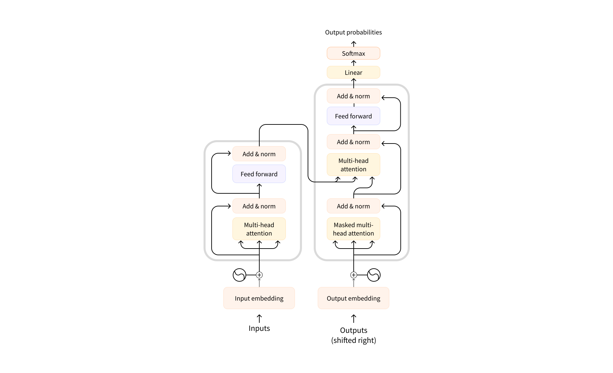

# Transformer Overview and Core Ideas

什么是attention???

cross-attention: 建立两个语言之间的桥梁

多头注意力：给attention加上卷积

transformer:全局建模能力很强。小镇做题家模型，需要大量数据

scaling law

SFT:监督式微调（不新，所以我们要用强化学习）

强化学习：chatgpt先训练了一个打分器

RLHF诞生了

图文对齐：CLIP

当预训练把不管什么智慧敲进KV矩阵后，另外一个神经网络就有信息把它提取出来（生成Q，然后cross-attention）

未来：SFT+RHLF

空间感知智能

## Transformers

There are different kinds of transformer models. Broadly, they can be grouped into three categories:

- GPT-like (also called *auto-regressive* Transformer models)
- BERT-like (also called *auto-encoding* Transformer models)
- T5-like (also called *sequence-to-sequence* Transformer models)

### How do Transformers work?

- Transformers are language models: This means they have been trained on large amounts of raw text in a self-supervised fashion.

  > [!NOTE]
  >
  > Self-supervised learning is a type of training in which the objective is automatically computed from the inputs of the model.
  >
  > That means that humans are not needed to label the data!

  For specific task, the general pretrained model then goes through a process called *transfer learning* or *fine-tuning*.

- Transformers are big models

### The original architecture

- attention mask

### How Transformers solve tasks