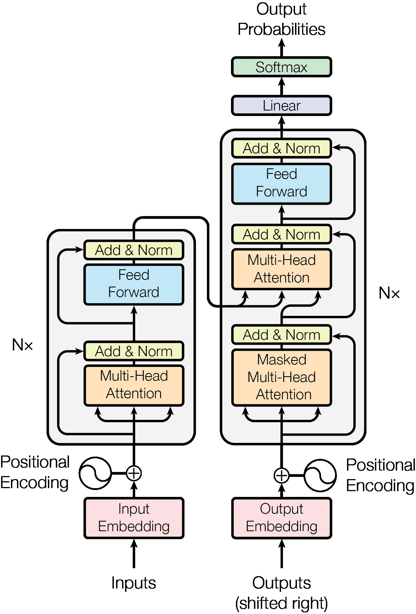
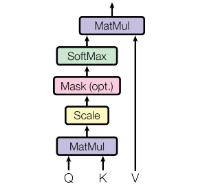
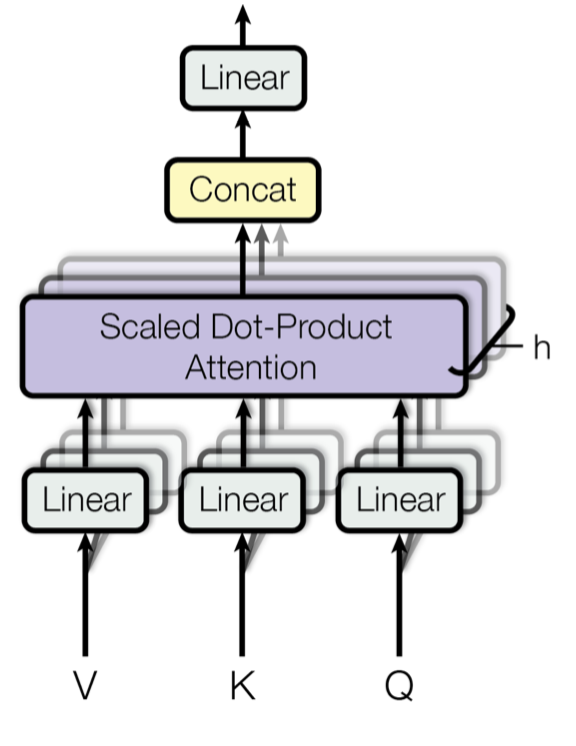
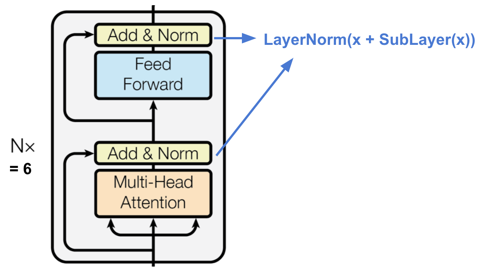
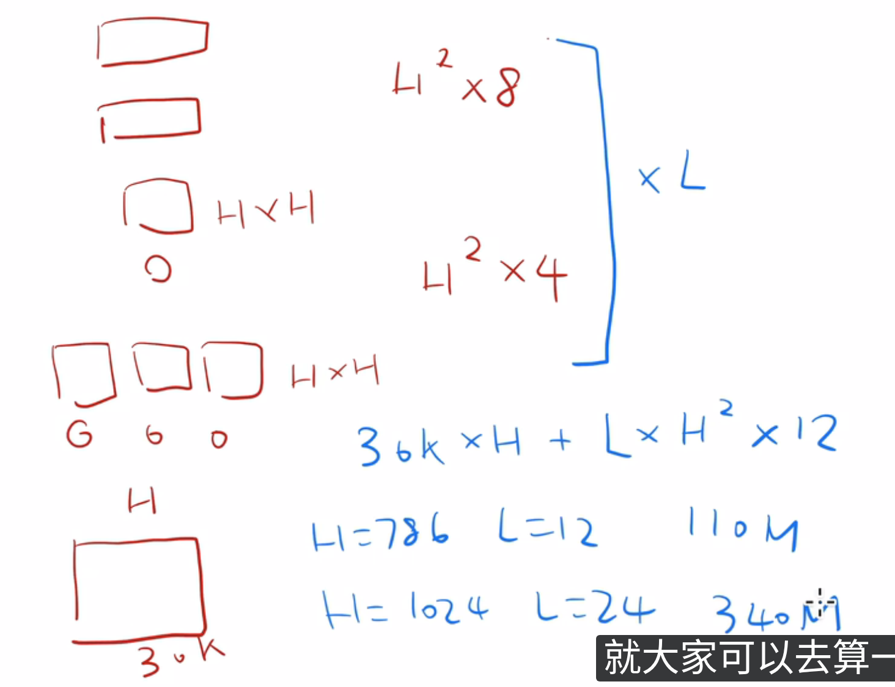
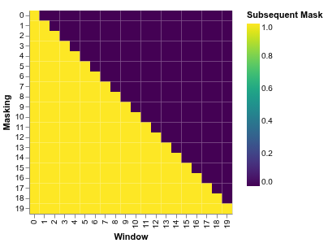
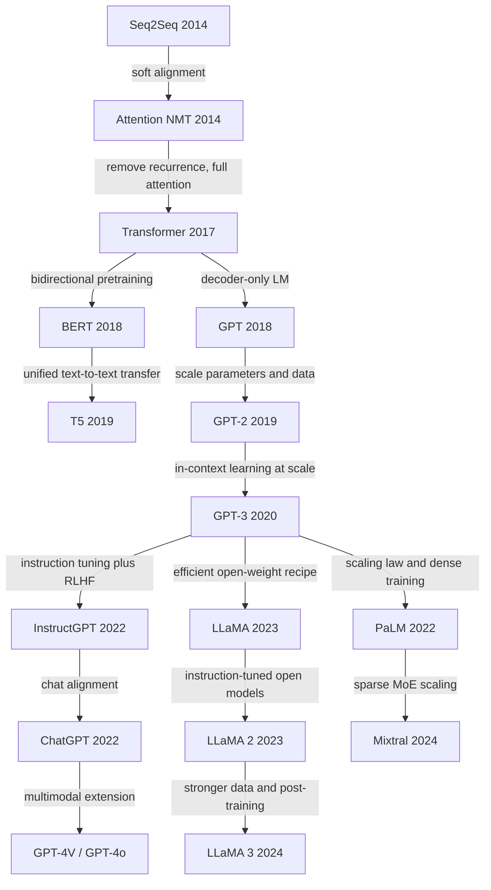

# Milestone

介绍一些LLM上的重要论文

## Transformer

当然在最开始先介绍transformer

- **Attention Is All You Need**. Ashish Vaswani et.al. **NeurIPS**, **2017**, ([Arxiv](https://arxiv.org/abs/1706.03762)) ([NeurIPS](https://papers.nips.cc/paper/7181-attention-is-all-you-need)) ([details](https://nlp.seas.harvard.edu/annotated-transformer/#attention-visualization)).

  - Takeaway: Transformer is a **self-attention-only** seq2seq model with **positional encoding**, enabling highly parallel training.

  - Motivation: What’s Wrong with Seq2Seq Model?

    The seq2seq model normally has an encoder-decoder architecture: the encoder compress the info into a context vector of fixed length. A critical and apparent disadvantage of this fixed-length context vector design is incapability of remembering long sentences. The attention mechanism was born ([Bahdanau et al., 2015](https://arxiv.org/pdf/1409.0473.pdf)) to resolve this problem.

  - Core Mechanism:

    - The model uses a pure encoder-decoder stack: the encoder alternates multi-head self-attention and position-wise FFN blocks, while the decoder adds masked self-attention and encoder-decoder cross-attention.

    - Scaled dot-product attention is the basic operation:

      $$
      \mathrm{Attention}(Q, K, V) = \mathrm{softmax}\left(\frac{QK^\top}{\sqrt{d_k}}\right)V
      $$
  
      Dividing by $\sqrt{d_k}$ keeps logits from growing too large, which stabilizes optimization when key/query dimensions increase.

    - Multi-head attention lets the model attend to different relations in parallel:

      $$
      \mathrm{MultiHead}(Q, K, V) = [\mathrm{head}_1; \ldots; \mathrm{head}_h]W^O, \quad
      \mathrm{head}_i = \mathrm{Attention}(QW_i^Q, KW_i^K, VW_i^V)
      $$
  
      This gives different heads different representation subspaces instead of forcing all dependencies into a single attention map.

      

      The original architecture diagram shows the full encoder-decoder stack, residual connections, and where masked attention appears in the decoder.

    - Because the model has no recurrence or convolution, it injects token order through sinusoidal positional encoding:

      $$
      PE_{(pos,2i)} = \sin\left(pos / 10000^{2i/d_{\mathrm{model}}}\right), \quad
      PE_{(pos,2i+1)} = \cos\left(pos / 10000^{2i/d_{\mathrm{model}}}\right)
      $$
  
      This gives the network relative and absolute position information without introducing a recurrent state.

  - Pros:

    - Transformer rule the world!
    - Removes recurrence, so training is substantially more parallelizable than classic RNN-based seq2seq models.
    - Achieves new SOTA translation results on WMT14 English-German and English-French in the paper's setting.
    - Any two positions interact through short attention paths, which helps model long-range dependencies.
    - The architecture is simple and modular enough to become the backbone for later encoder-only, decoder-only, and multimodal foundation models.
  
  - Cons:

    - Full self-attention has $O(n^2)$ time and memory complexity in sequence length, which becomes a bottleneck for long contexts.
    - Specifically, during self-attention, intermediate maps such as the attention map (QKT ) and the softmax map (L × L) need to be stored from high-speed GPU SRAM (the actual location of the computation) to high bandwidth GPU memory (HBM) and later retrieved during the computation, and the read and write speed of the former is more than 10 times that of the latter, thus resulting in significant memory accessing overhead and increased wall-clock time1 .
    - The paper is still framed as a translation-focused encoder-decoder system, so it does not yet describe the decoder-only large-scale recipe used by later LLMs.
    - Some English-French headline numbers differ slightly across arXiv and proceedings versions, so the safest takeaway is the SOTA claim rather than one exact FR BLEU value.

### The whole architecture

- Core Mechanism:

  - The full architecture:

    

- Pipeline: 下面我将分模块分别介绍每个部分


#### Self Attention

> [!NOTE]
>
> 在介绍Scaled Dot-Product Attention先介绍一下attention. The two most commonly used attention functions are additive attention [(cite)](https://arxiv.org/abs/1409.0473), and dot-product (multiplicative) attention.
>
> - ot-product (multiplicative) attention pros: 计算更快更有效
>
> 在transformer中使用的attention是在Dot-Product基础上还在了scaled, scaling factor of
> $\frac{1}{\sqrt{d_k}}$, 因此叫做Scaled Dot-Product Attention

Scaled Dot-Product Attention



假设输入序列表示为矩阵：
$$
X \in \mathbb{R}^{n \times d_{\text{model}}}
$$
其中

- $n$ 是序列长度
- $d_{\text{model}}$ 是每个 token 的表示维度

Self Attention 不会直接拿 $X$ 去做计算，而是先通过三个线性变换得到：
$$
Q = XW_Q \\
K = XW_K \\
V = XW_V
$$
Given query Q, key K, value V:
$$
\text{Attention}(Q, K, V) = {\text{softmax}\left(\frac{QK^{T}}{\sqrt{d_k}}\right)} {V}
$$

> [!NOTE]
>
> - $\sqrt{d_k}$: 假设 $Q$ 和 $K$ 的分量都比较独立，方差接近 1，那么点积 $Q \cdot K$ 的方差会随着维度 $d_k$ 增大而增大(为什么,见后面)。维度越大，点积值越容易很大。进入 softmax 后会变得很尖锐，导致：
>
>   - 某些位置权重几乎是 1
>  - 其余位置几乎是 0
>   - 梯度不稳定
>   
>   除以 $\sqrt{d_k}$ 后，数值尺度更平稳，训练更容易。
>
>   > [!NOTE]
>  >
>   > 为什么需要数值尺度更平缓呢？
>   >
>   > - 当 logits 太大时: $\text{softmax}(8, 1, -2) \approx (0.999, 0.001, 0)$ 注意力几乎全压到一个位置，梯度很小，训练不稳定
>   > - 当 logits 太小时: $\text{softmax}(0.01, 0.02, -0.01) \approx (0.334, 0.337, 0.329)$ 看不出来谁重要，注意力表达能力变弱
>   
>   下面我们来看看为什么除以 $\sqrt{d_k}$ 可以稳定方差到常数量级，看看背后的数学原理：
>
>   设单个 query 和 key 向量分别是
> $$
>   q = (q_1, q_2, \dots, q_{d_k}), \quad k = (k_1, k_2, \dots, k_{d_k})
> $$
>   它们的点积是
> $$
>   s = q^\top k = \sum_{i=1}^{d_k} q_i k_i
> $$
>   为了分析方便，通常做一个经典假设：
>   
>   - $q_i$ 和 $k_i$ 独立
>  - 均值为 0
>   - 方差为 1
>   
>   那么每一项 $q_i k_i$ 的均值是 0，方差是
> $$
>   \operatorname{Var}(q_i k_i) = \operatorname{Var}(q_i)\operatorname{Var}(k_i) = 1
> $$
>   于是整个点积的方差就是
> $$
>   \operatorname{Var}(s) = \sum_{i=1}^{d_k} \operatorname{Var}(q_i k_i) = d_k
> $$
>   所以：
> $$
>   \operatorname{Var}(q^\top k) = d_k
> $$
>   这意味着点积的**标准差**是$\sqrt{d_k}$。
>   
> - ${\text{softmax}\left(\frac{QK^{T}}{\sqrt{d_k}}\right)}$: 是注意力权重矩阵，满足每一行和为 1，对当前位置来说，整句话里每个位置分别该分配多少权重

- Pipeline

  ```python
  def attention(query, key, value, mask=None, dropout=None):
      "Compute 'Scaled Dot Product Attention'"
      d_k = query.size(-1)
      scores = torch.matmul(query, key.transpose(-2, -1)) / math.sqrt(d_k)
      if mask is not None:
          scores = scores.masked_fill(mask == 0, -1e9)
      p_attn = scores.softmax(dim=-1)
      if dropout is not None:
          p_attn = dropout(p_attn)
      return torch.matmul(p_attn, value), p_attn
  ```

- Pros:

  - 并行计算友好

  - 能直接建模长距离依赖: Global receptive field in a single layer

  - Computes weighted interactions between all token pairs.

  - Scaled normalization stabilizes gradients.


- Cons:

  - 计算复杂度高：注意力矩阵大小是 $n \times n$， 所以时间和显存复杂度通常写成$O(n^2)$
    - Sol: 后来有很多attention都是为了解决这个

  - 不天然包含位置信息
    - Sol: 位置编码


> [!note]
>
> self的意思就是Q,K,V,都是来自同一个输入序列

> [!TIP]
>
> 下面给出一个直观的理解：
>
> 假设一句话是：
> $$
> [\text{The}, \text{cat}, \text{sat}, \text{on}, \text{the}, \text{mat}]
> $$
> 当模型更新 `sat` 这个 token 时，它可能会给
>
> - `cat` 较高权重，因为谁 sat 很重要
> - `on` 和 `mat` 也有一定权重，因为动作和位置相关
> - `The` 权重可能较低，因为语义贡献较小
>
> 所以 `sat` 的新表示，不再只是它自己原来的 embedding，而是融合了与它相关的上下文信息。
>
> 这就是 Self Attention 的本质：**每个 token 的表示，变成了“结合上下文之后的表示”**

#### Multi Head Attention

Multi-Head Self-Attention (MHSA):

- Takeaway

  Multi Head Attention 是把 attention 放到多个不同的投影子空间中并行计算，让模型能够同时捕捉不同类型、不同粒度的依赖关系，再将这些信息融合起来

- Core Mechanism

  Instead of one attention map, use multiple projection heads:

  - Each head learns different relational patterns.
  - Heads are concatenated and linearly projected.

  $$
  \text{MultiHead}(Q, K, V) = \text{Concat}[\text{head}_1; \ldots ; \text{head}_h]\, W^{O} \\
  \text{where}~ \text{head}_i = \text{Attention}(Q W_i^{Q},\, K W_i^{K},\, V W_i^{V})
  $$

  Where the projections are parameter matrices $W^Q_i \in
  \mathbb{R}^{d_{\text{model}} \times d_k}$, $W^K_i \in
  \mathbb{R}^{d_{\text{model}} \times d_k}$, $W^V_i \in
  \mathbb{R}^{d_{\text{model}} \times d_v}$ and $W^O \in
  \mathbb{R}^{hd_v \times d_{\text{model}}}$.

  

- Pipeline

  ```python
  class MultiHeadedAttention(nn.Module):
      def __init__(self, h, d_model, dropout=0.1):
          "Take in model size and number of heads."
          super(MultiHeadedAttention, self).__init__()
          assert d_model % h == 0
          # We assume d_v always equals d_k
          self.d_k = d_model // h
          self.h = h
          self.linears = clones(nn.Linear(d_model, d_model), 4)
          self.attn = None
          self.dropout = nn.Dropout(p=dropout)
  
      def forward(self, query, key, value, mask=None):
          "Implements Figure 2"
          if mask is not None:
              # Same mask applied to all h heads.
              mask = mask.unsqueeze(1)
          nbatches = query.size(0)
  
          # 1) Do all the linear projections in batch from d_model => h x d_k
          query, key, value = [
              lin(x).view(nbatches, -1, self.h, self.d_k).transpose(1, 2)
              for lin, x in zip(self.linears, (query, key, value))
          ]
  
          # 2) Apply attention on all the projected vectors in batch.
          x, self.attn = attention(
              query, key, value, mask=mask, dropout=self.dropout
          )
  
          # 3) "Concat" using a view and apply a final linear.
          x = (
              x.transpose(1, 2)
              .contiguous()
              .view(nbatches, -1, self.h * self.d_k)
          )
          del query
          del key
          del value
          return self.linears[-1](x)
  ```
  
- Pros

  - 将一个head表达所有关系变成不同head分工协作，直观上任务会容易一些

#### Position-wise Feed-Forward Networks

This consists of two linear transformations with a ReLU activation in between.
$$
\mathrm{FFN}(x)=\max(0, xW_1 + b_1) W_2 + b_2 \\
d_{\text{model}}=512,~~d_{ff}=2048
$$

```python
class PositionwiseFeedForward(nn.Module):
    "Implements FFN equation."

    def __init__(self, d_model, d_ff, dropout=0.1):
        super(PositionwiseFeedForward, self).__init__()
        self.w_1 = nn.Linear(d_model, d_ff)
        self.w_2 = nn.Linear(d_ff, d_model)
        self.dropout = nn.Dropout(dropout)

    def forward(self, x):
        return self.w_2(self.dropout(self.w_1(x).relu()))
```

#### Embeddings and Softmax

用embedding将input token和output token转换为$d_{model}$

In our model, we share the same weight matrix between the two embedding layers and the pre-softmax linear transformation, similar to [(cite)](https://arxiv.org/abs/1608.05859). In the embedding layers, we multiply those weights by dmodel*d*model.

```python
class Embeddings(nn.Module):
    def __init__(self, d_model, vocab):
        super(Embeddings, self).__init__()
        self.lut = nn.Embedding(vocab, d_model)
        self.d_model = d_model

    def forward(self, x):
        return self.lut(x) * math.sqrt(self.d_model)
```

输入为一种文本，输出也应是一种序列文本,需要设置一下max_Len，也就是最大的文本长度，要对不足的部分做padding

#### Positional Encoding

Since the architecture is **non-recurrent** and **non-convolutional**, positional information is injected via sinusoidal encodings. 使用正弦位置编码PositionEmbeddingSine,将“位置编码”添加到编码器和解码器堆栈底部的输入嵌入中。
$$
PE_{(pos,2i)} = \sin(pos / 10000^{2i/d_{\text{model}}}) \\
PE_{(pos,2i+1)} = \cos(pos / 10000^{2i/d_{\text{model}}})
$$
where $pos$ is the position and $i$ is the dimension.

波长形成几何级数 from $2\pi$ to $10000\cdot 2\pi$

> [!NOTE]
>
> 为什么用正弦和余弦：
>
>   - 这样模型既能区分绝对位置，也更容易感知相对距离
>
>     $\sin(a + b), \cos(a + b)$可以用 $\sin(a), \cos(a)$ 线性表示，这说明位置差（relative position）可以通过线性变换得到
>
>   - 连续、平滑多尺度频率（multi-scale）不同维度用不同频率：
>
>     - 有的变化慢（捕捉长距离）高维 → 低频（变化慢）
>     - 有的变化快（捕捉局部）低维 → 高频（变化快）

频率项 dim_t：$\text{频率} \sim \frac{1}{\text{dim}_t}$
$$
\mathrm{dim}_t
=
\mathrm{temperature}^{\frac{2\left\lfloor t/2 \right\rfloor}{\text{num\_pos\_feats}}} 
$$

> [!note]
>
> 这里说明一下为什么要有$\lfloor t/2 \rfloor$:因为想让相邻两个通道共享同一个频率
> $$
> \mathrm{dim}_{2k} = \mathrm{dim}_{2k+1}
> =
> \mathrm{temperature}^{\frac{2k}{\text{num\_pos\_feats}}}
> $$
> 这样就能把同一频率分为一对$(\sin(\cdot), \cos(\cdot))$
>
> 那么为什么我们一定要sin + cos一起呢，只用sin不行吗？
>
> - 信息不完整（相位丢失）$\sin(\theta) = \sin(\pi - \theta)$,不同位置可能映射一样无法唯一确定位置
>
> - 用$(\sin(\theta), \cos(\theta))= e^{i\theta}$可唯一表示位置，$e^{i(\theta_1 - \theta_2)} = e^{i\theta_1} \cdot e^{-i\theta_2}$相对位置可以通过点积体现

```python
class PositionalEncoding(nn.Module):
    "Implement the PE function."

    def __init__(self, d_model, dropout, max_len=5000):
        super(PositionalEncoding, self).__init__()
        self.dropout = nn.Dropout(p=dropout)

        # Compute the positional encodings once in log space.
        pe = torch.zeros(max_len, d_model)
        position = torch.arange(0, max_len).unsqueeze(1)
        div_term = torch.exp(
            torch.arange(0, d_model, 2) * -(math.log(10000.0) / d_model)
        )
        pe[:, 0::2] = torch.sin(position * div_term)
        pe[:, 1::2] = torch.cos(position * div_term)
        pe = pe.unsqueeze(0)
        self.register_buffer("pe", pe)

    def forward(self, x):
        x = x + self.pe[:, : x.size(1)].requires_grad_(False)
        return self.dropout(x)
```


#### Encoder



我们来详细看看这个结构,一个encoder分为两个sublayer, The first is a multi-head
self-attention mechanism, and the second is a simple, position-wise
fully connected feed-forward network

```python
def clones(module, N):
    "Produce N identical layers."
    return nn.ModuleList([copy.deepcopy(module) for _ in range(N)])

class Encoder(nn.Module):
    "Core encoder is a stack of N layers"

    def __init__(self, layer, N):
        super(Encoder, self).__init__()
        self.layers = clones(layer, N)
        self.norm = LayerNorm(layer.size)

    def forward(self, x, mask):
        "Pass the input (and mask) through each layer in turn."
        for layer in self.layers:
            x = layer(x, mask)
        return self.norm(x)
# 最后生成就是Encoder(EncoderLayer,6)
class EncoderLayer(nn.Module):
    "Encoder is made up of self-attn and feed forward (defined below)"

    def __init__(self, size, self_attn, feed_forward, dropout):
        super(EncoderLayer, self).__init__()
        self.self_attn = self_attn
        self.feed_forward = feed_forward
        self.sublayer = clones(SublayerConnection(size, dropout), 2)
        self.size = size

    def forward(self, x, mask):
        "Follow Figure 1 (left) for connections."
        x = self.sublayer[0](x, lambda x: self.self_attn(x, x, x, mask))
        return self.sublayer[1](x, self.feed_forward)
```

  - Residual Connections + LayerNorm: Ensures stable deep training and gradient flow.

    ```python
    class SublayerConnection(nn.Module):
        """
        A residual connection followed by a layer norm.
        Note for code simplicity the norm is first as opposed to last.
        """
    
        def __init__(self, size, dropout):
            super(SublayerConnection, self).__init__()
            self.norm = LayerNorm(size)
            self.dropout = nn.Dropout(dropout)
    # 注意这里的实现和论文写的是不一样的
        def forward(self, x, sublayer):
            "Apply residual connection to any sublayer with the same size."
            return x + self.dropout(sublayer(self.norm(x)))
    
    class LayerNorm(nn.Module):
        "Construct a layernorm module (See citation for details)."
    
        def __init__(self, features, eps=1e-6):
            super(LayerNorm, self).__init__()
            self.a_2 = nn.Parameter(torch.ones(features))
            self.b_2 = nn.Parameter(torch.zeros(features))
            self.eps = eps
    
        def forward(self, x):
            mean = x.mean(-1, keepdim=True)
            std = x.std(-1, keepdim=True)
            return self.a_2 * (x - mean) / (std + self.eps) + self.b_2
    ```

    > [!NOTE]
    >
    > 观察到这里layernorm的实现和原论文中的实现是不一样的
    >
    > - post-norm: 在原论文中`y = LayerNorm(x + Dropout(Sublayer(x)))`
    > - pre-norm: 就是现在代码实现的这样`y = x + Dropout(Sublayer(LayerNorm(x)))`
    >
    > 为什么这里代码复现是使用pre-norm呢,而且后面的实现很多也是使用pre-norm?
    >
    > - 本质上是为了训练更稳，尤其层数变深时更明显,让残差连接不要经过Norm,直接高速公路
    >
    > 而在每个小模块内部中使用pre-norm,再在最后的末尾统一做一个LayerNorm

  - Feed-Forward Network (FFN) Per Token: A two-layer MLP applied independently on each position:

  - Adds non-linearity: Increases expressive capacity

##### 参数估计

这里还给出一些如何对参数进行估计，我们这里假设$H=d_{model}$

在一个encoder中每一层主要是一个MLA+MLP，而QKV是没有参数的，只有输入和输出的时候有一个projection，而在MLP中一般第一个全连接层的输出$d_{ff} = 4H$，第二个输入是$4H$，输出是$H$，这里设置有$L$层

然后嵌入层输入是你字典的大小，输出是$H$，最后可以估计参数如下




#### Decoder


Decoder有三个sublayers. Each layer has two sub-layers of multi-head attention mechanisms and one sub-layer of fully-connected feed-forward network.

```python
class Decoder(nn.Module):
    "Generic N layer decoder with masking."

    def __init__(self, layer, N):
        super(Decoder, self).__init__()
        self.layers = clones(layer, N)
        self.norm = LayerNorm(layer.size)

    def forward(self, x, memory, src_mask, tgt_mask):
        for layer in self.layers:
            x = layer(x, memory, src_mask, tgt_mask)
        return self.norm(x)

class DecoderLayer(nn.Module):
    "Decoder is made of self-attn, src-attn, and feed forward (defined below)"

    def __init__(self, size, self_attn, src_attn, feed_forward, dropout):
        super(DecoderLayer, self).__init__()
        self.size = size
        self.self_attn = self_attn
        self.src_attn = src_attn
        self.feed_forward = feed_forward
        self.sublayer = clones(SublayerConnection(size, dropout), 3)

    def forward(self, x, memory, src_mask, tgt_mask):
        "Follow Figure 1 (right) for connections."
        m = memory
        x = self.sublayer[0](x, lambda x: self.self_attn(x, x, x, tgt_mask))
        x = self.sublayer[1](x, lambda x: self.src_attn(x, m, m, src_mask))
        return self.sublayer[2](x, self.feed_forward)
```

- The first multi-head attention sub-layer is **modified** to prevent positions from attending to subsequent positions, as we don’t want to look into the future of the target sequence when predicting the current position.

  ```python
  # mask the subsequent positions
  def subsequent_mask(size):
      "Mask out subsequent positions."
      attn_shape = (1, size, size)
      subsequent_mask = torch.triu(torch.ones(attn_shape), diagonal=1).type(
          torch.uint8
      )
      return subsequent_mask == 0
  ```



### Inference

创建一个transformer

```python
def make_model(
    src_vocab, tgt_vocab, N=6, d_model=512, d_ff=2048, h=8, dropout=0.1
):
    "Helper: Construct a model from hyperparameters."
    # tgt stands for target
    c = copy.deepcopy
    attn = MultiHeadedAttention(h, d_model)
    ff = PositionwiseFeedForward(d_model, d_ff, dropout)
    position = PositionalEncoding(d_model, dropout)
    model = EncoderDecoder(
        Encoder(EncoderLayer(d_model, c(attn), c(ff), dropout), N),
        Decoder(DecoderLayer(d_model, c(attn), c(attn), c(ff), dropout), N),
        nn.Sequential(Embeddings(d_model, src_vocab), c(position)),
        nn.Sequential(Embeddings(d_model, tgt_vocab), c(position)),
        Generator(d_model, tgt_vocab),
    )

    # This was important from their code.
    # Initialize parameters with Glorot / fan_avg.
    for p in model.parameters():
        if p.dim() > 1:
            nn.init.xavier_uniform_(p)
    return model
```

> [!TIP]
>
> 目标前缀，就是“目标序列里目前已经知道的前半段”
>
> 下面的ys就是目标前缀

```python
def inference_test():
    test_model = make_model(11, 11, 2)
    test_model.eval()
    src = torch.LongTensor([[1, 2, 3, 4, 5, 6, 7, 8, 9, 10]])
    src_mask = torch.ones(1, 1, 10)

    # 先送进encode理解src得到memory
    memory = test_model.encode(src, src_mask)
    # 初始化目标序列，目前只有一个 token 0。它扮演“起始符”的角色
    ys = torch.zeros(1, 1).type_as(src)

    for i in range(9):
		# out 是当前整个目标前缀每个位置的隐藏表示，但真正要拿来预测“下一个词”的，只是最后一个位置 out[:, -1]
        out = test_model.decode(
            memory, src_mask, ys, subsequent_mask(ys.size(1)).type_as(src.data)
        )
        # 只取最后一个位置来预测下一个词
        prob = test_model.generator(out[:, -1])
        # 贪心解码：选概率最大的词
        _, next_word = torch.max(prob, dim=1)
        next_word = next_word.data[0]
        # 新词拼接回去,继续下轮预测
        ys = torch.cat(
            [ys, torch.empty(1, 1).type_as(src.data).fill_(next_word)], dim=1
        )

    print("Example Untrained Model Prediction:", ys)	
```

下面是一个Hugging Face实例使用的推理

```python
from transformers import AutoTokenizer, AutoModelForCausalLM
import torch

model_name = "gpt2"
tokenizer = AutoTokenizer.from_pretrained(model_name)
model = AutoModelForCausalLM.from_pretrained(model_name)

prompt = "The future of AI is"
inputs = tokenizer(prompt, return_tensors="pt")

outputs = model.generate(
    **inputs,
    max_new_tokens=50,
    do_sample=True,
    temperature=0.7,   # 这里设置 temperature
    top_k=50,
    top_p=0.9
)

print(tokenizer.decode(outputs[0], skip_special_tokens=True))
```

这里面我们发现多了一个temperature. 这里是指temperature softmax,下面我们来看看这个温度系数有什么作用

标准的softmax: $p_i = \frac{e^{z_i}}{\sum_j e^{z_j}}$,而temperature softmax: 
$$
p_i = \frac{e^{z_i / T}}{\sum_j e^{z_j / T}} = \text{softmax}(z/T)
$$

> [!NOTE]
>
> 为什么我们需要这个temperature?
>
> temperature 的作用是调节不同输出logits的概率分布
>
> - 当 $T \to 0$
>   $$
>   p_i \to \text{one-hot（最大 logit 对应的位置）}
>   $$
>
>   - 行为：**近似 argmax**
>   - 几乎完全确定性,概率分布更尖锐
>
> - 当 $T \to \infty$
>   $$
>   p_i \to \frac{1}{N}
>   $$
>
>   - 所有类别概率接近相等
>   - 完全随机
>
> | Temperature | 分布形状 | 模型行为     |
> | ----------- | -------- | ------------ |
> | 小 $T<1$    | 很尖锐   | 更自信、保守 |
> | $T=1$       | 正常     | 原始分布     |
> | 大 $T>1$    | 更平滑   | 更随机、多样 |

### Training

check ([details](https://nlp.seas.harvard.edu/annotated-transformer/#attention-visualization))

## Zoo

- __Scaling Vision Transformers.__ *Xiaohua Zhai et al.* __arXiv, 2021__ [(Arxiv)](https://arxiv.org/abs/2106.04560) 

  - Takeaway

    *Scaling Vision Transformers* shows that Vision Transformers have strong and predictable scaling behavior: as model size, data size, and compute increase together, performance keeps improving. It also presents a refined ViT training and architecture recipe that enables a 2B-parameter model to reach **90.45% top-1 on ImageNet**.

  - Motivation

    Previous work had already shown that scale is a key driver of success for Transformers in language, but it was still unclear **how Vision Transformers scale** with respect to model size, dataset size, and compute. 

    The paper is motivated by the need to understand these scaling laws for vision, so that future ViT systems can be designed more systematically rather than by trial and error.

    Another motivation is practical: standard ViT training becomes increasingly expensive and memory-hungry at large scale. The authors therefore not only study scaling behavior, but also refine the architecture and training setup to reduce memory use and improve accuracy.

  - Core Mechanism

    The core idea is to study ViT through the lens of **scaling laws**. Instead of proposing a completely new backbone, the paper systematically scales three things:

    1. **Model size**
    2. **Training data size**
    3. **Training compute**

    The paper models the relationship between error and scale using a power-law style formulation. A simplified form is:

    $$
    \mathrm{Error}(N) \approx aN^{-\alpha} + b
    $$

    where \(N\) can represent a scaling variable such as model size, dataset size, or compute budget, \(a\) and \(b\) are constants, and \(\alpha\) is the scaling exponent. The key message is that ViT error decreases in a predictable way as scale increases. This power-law view is the central analytical tool of the paper.

    In addition, the authors refine the standard ViT recipe to make large-scale training feasible and more effective. The paper summary explicitly states that they refine both **architecture and training**, reducing memory consumption and increasing accuracy while scaling up to a **2B-parameter ViT**.

  - Pipeline

    1. Start from the Vision Transformer backbone and prepare variants at different scales.
    2. Scale the **model size** up and down across a broad range. 
    3. Scale the **training dataset size** up and down to study its interaction with model size. 
    4. Measure performance as a function of **training compute** and fit scaling trends.
    5. Refine the ViT architecture and training setup to improve memory efficiency and optimization at large scale.
    6. Train an extremely large ViT, then evaluate it on ImageNet and few-shot transfer tasks. The paper reports **90.45% top-1 on ImageNet** and **84.86% top-1 with only 10 examples per class** in few-shot transfer.

  - Math Formula

    A concise way to express the paper’s scaling-law viewpoint is:

    $$
    \mathcal{L}(x) = A x^{-\alpha} + B
    $$

    where:

    - \(\mathcal{L}(x)\) is the loss or error
    - \(x\) is a scale variable such as model size, dataset size, or compute
    - \(A\) and \(B\) are constants
    - \(\alpha\) is the scaling exponent

    This formula captures the main empirical observation of the paper: performance improves with scale in a regular, power-law-like manner.

    Since the paper studies Vision Transformers, the underlying self-attention block still follows the standard Transformer form:

    $$
    \mathrm{Attention}(Q, K, V) = \mathrm{softmax}\left(\frac{QK^\top}{\sqrt{d_k}}\right)V
    $$

    and the overall scaling study examines how networks built from these blocks behave as their size and training resources grow.

  - Pros

    - It provides one of the clearest early demonstrations that **Vision Transformers obey useful scaling laws**, which gives researchers a principled way to think about future ViT design. :contentReference[oaicite:14]{index=14}
    - It shows that very large ViTs can achieve **state-of-the-art accuracy**, including **90.45% ImageNet top-1**.
    - It improves not only full-data classification, but also **few-shot transfer**, indicating strong representation quality at scale.
    - It does not just analyze scaling; it also refines training and architecture to reduce memory consumption and improve practical large-scale training.

  - Cons

    - The strongest results rely on **extreme scale**, including very large models and large compute budgets, so the recipe is not easily accessible to ordinary researchers or smaller labs. This is a reasonable inference from the paper’s reported 2B-parameter setting and large-scale study scope.
    - The paper is more about **scaling behavior and training recipe** than about introducing a fundamentally new architecture, so its novelty is less architectural than some other ViT papers. This is an interpretation based on the paper summary.
    - Because it emphasizes scaling, some conclusions are less directly useful when compute, data, or memory are limited. This is an inference from the paper’s large-scale experimental setup.

## Relation



- One useful way to read this trajectory is: **Attention -> Transformer -> foundation-model scaling -> alignment -> open-weight / multimodal expansion**.
