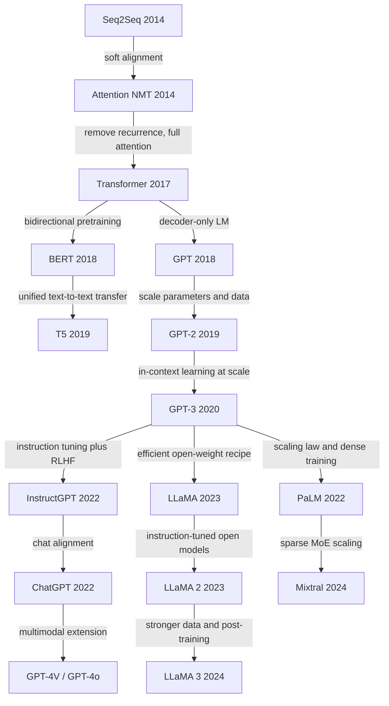

# Milestone

介绍一些LLM上的重要论文

- **Attention Is All You Need**. Ashish Vaswani et.al. **NeurIPS**, **2017**, ([Arxiv](https://arxiv.org/abs/1706.03762)) ([NeurIPS](https://papers.nips.cc/paper/7181-attention-is-all-you-need)).

  - Takeaway:

    Transformer replaces recurrence and convolutions with an attention-only encoder-decoder, improving translation quality while making training much more parallelizable. This paper is the milestone that turns self-attention into the dominant primitive for later LLMs.

  - Motivation:

    Earlier seq2seq systems were mostly based on RNNs or CNNs, so they still suffered from sequential computation or long dependency paths even after adding attention. The paper asks whether sequence transduction can be built from attention alone so that long-range interactions become easier to model and training becomes faster on modern hardware.

  - Core Mechanism:

    - The model uses a pure encoder-decoder stack: the encoder alternates multi-head self-attention and position-wise FFN blocks, while the decoder adds masked self-attention and encoder-decoder cross-attention.

    - Scaled dot-product attention is the basic operation:

      $$
      \mathrm{Attention}(Q, K, V) = \mathrm{softmax}\left(\frac{QK^\top}{\sqrt{d_k}}\right)V
      $$

      Dividing by $\sqrt{d_k}$ keeps logits from growing too large, which stabilizes optimization when key/query dimensions increase.

    - Multi-head attention lets the model attend to different relations in parallel:

      $$
      \mathrm{MultiHead}(Q, K, V) = [\mathrm{head}_1; \ldots; \mathrm{head}_h]W^O, \quad
      \mathrm{head}_i = \mathrm{Attention}(QW_i^Q, KW_i^K, VW_i^V)
      $$

      This gives different heads different representation subspaces instead of forcing all dependencies into a single attention map.

      

      The original architecture diagram shows the full encoder-decoder stack, residual connections, and where masked attention appears in the decoder.

    - Because the model has no recurrence or convolution, it injects token order through sinusoidal positional encoding:

      $$
      PE_{(pos,2i)} = \sin\left(pos / 10000^{2i/d_{\mathrm{model}}}\right), \quad
      PE_{(pos,2i+1)} = \cos\left(pos / 10000^{2i/d_{\mathrm{model}}}\right)
      $$

      This gives the network relative and absolute position information without introducing a recurrent state.

  - Pipeline:

    1. Tokenize source and target sentences, then map them to embeddings.
    2. Add positional encodings so the attention-only stack can distinguish token order.
    3. Pass the source sequence through the encoder to build contextual memory.
    4. Feed shifted target tokens into the decoder with causal masking, then cross-attend to encoder memory.
    5. Predict next-token probabilities autoregressively and train with Adam, learning-rate warmup, dropout, and label smoothing.

  - Pros:

    - Removes recurrence, so training is substantially more parallelizable than classic RNN-based seq2seq models.
    - Achieves new SOTA translation results on WMT14 English-German and English-French in the paper's setting.
    - Any two positions interact through short attention paths, which helps model long-range dependencies.
    - The architecture is simple and modular enough to become the backbone for later encoder-only, decoder-only, and multimodal foundation models.

  - Cons:

    - Full self-attention has $O(n^2)$ time and memory complexity in sequence length, which becomes a bottleneck for long contexts.
    - Specifically, during self-attention, intermediate maps such as the attention map (QKT ) and the softmax map (L × L) need to be stored from high-speed GPU SRAM (the actual location of the computation) to high bandwidth GPU memory (HBM) and later retrieved during the computation, and the read and write speed of the former is more than 10 times that of the latter, thus resulting in significant memory accessing overhead and increased wall-clock time1 .
    - The paper is still framed as a translation-focused encoder-decoder system, so it does not yet describe the decoder-only large-scale recipe used by later LLMs.
    - Some English-French headline numbers differ slightly across arXiv and proceedings versions, so the safest takeaway is the SOTA claim rather than one exact FR BLEU value.

## Zoo

- __Scaling Vision Transformers.__ *Xiaohua Zhai et al.* __arXiv, 2021__ [(Arxiv)](https://arxiv.org/abs/2106.04560) 

  - Takeaway

    *Scaling Vision Transformers* shows that Vision Transformers have strong and predictable scaling behavior: as model size, data size, and compute increase together, performance keeps improving. It also presents a refined ViT training and architecture recipe that enables a 2B-parameter model to reach **90.45% top-1 on ImageNet**.

  - Motivation

    Previous work had already shown that scale is a key driver of success for Transformers in language, but it was still unclear **how Vision Transformers scale** with respect to model size, dataset size, and compute. 

    The paper is motivated by the need to understand these scaling laws for vision, so that future ViT systems can be designed more systematically rather than by trial and error.

    Another motivation is practical: standard ViT training becomes increasingly expensive and memory-hungry at large scale. The authors therefore not only study scaling behavior, but also refine the architecture and training setup to reduce memory use and improve accuracy.

  - Core Mechanism

    The core idea is to study ViT through the lens of **scaling laws**. Instead of proposing a completely new backbone, the paper systematically scales three things:

    1. **Model size**
    2. **Training data size**
    3. **Training compute**

    The paper models the relationship between error and scale using a power-law style formulation. A simplified form is:

    $$
    \mathrm{Error}(N) \approx aN^{-\alpha} + b
    $$

    where \(N\) can represent a scaling variable such as model size, dataset size, or compute budget, \(a\) and \(b\) are constants, and \(\alpha\) is the scaling exponent. The key message is that ViT error decreases in a predictable way as scale increases. This power-law view is the central analytical tool of the paper.

    In addition, the authors refine the standard ViT recipe to make large-scale training feasible and more effective. The paper summary explicitly states that they refine both **architecture and training**, reducing memory consumption and increasing accuracy while scaling up to a **2B-parameter ViT**.

  - Pipeline

    1. Start from the Vision Transformer backbone and prepare variants at different scales. :contentReference[oaicite:6]{index=6}
    2. Scale the **model size** up and down across a broad range. :contentReference[oaicite:7]{index=7}
    3. Scale the **training dataset size** up and down to study its interaction with model size. :contentReference[oaicite:8]{index=8}
    4. Measure performance as a function of **training compute** and fit scaling trends. :contentReference[oaicite:9]{index=9}
    5. Refine the ViT architecture and training setup to improve memory efficiency and optimization at large scale. :contentReference[oaicite:10]{index=10}
    6. Train an extremely large ViT, then evaluate it on ImageNet and few-shot transfer tasks. The paper reports **90.45% top-1 on ImageNet** and **84.86% top-1 with only 10 examples per class** in few-shot transfer. :contentReference[oaicite:11]{index=11}

  - Math Formula

    A concise way to express the paper’s scaling-law viewpoint is:

    $$
    \mathcal{L}(x) = A x^{-\alpha} + B
    $$

    where:

    - \(\mathcal{L}(x)\) is the loss or error
    - \(x\) is a scale variable such as model size, dataset size, or compute
    - \(A\) and \(B\) are constants
    - \(\alpha\) is the scaling exponent

    This formula captures the main empirical observation of the paper: performance improves with scale in a regular, power-law-like manner. :contentReference[oaicite:12]{index=12}

    Since the paper studies Vision Transformers, the underlying self-attention block still follows the standard Transformer form:

    $$
    \mathrm{Attention}(Q, K, V) = \mathrm{softmax}\left(\frac{QK^\top}{\sqrt{d_k}}\right)V
    $$

    and the overall scaling study examines how networks built from these blocks behave as their size and training resources grow. :contentReference[oaicite:13]{index=13}

  - Pros

    - It provides one of the clearest early demonstrations that **Vision Transformers obey useful scaling laws**, which gives researchers a principled way to think about future ViT design. :contentReference[oaicite:14]{index=14}
    - It shows that very large ViTs can achieve **state-of-the-art accuracy**, including **90.45% ImageNet top-1**. :contentReference[oaicite:15]{index=15}
    - It improves not only full-data classification, but also **few-shot transfer**, indicating strong representation quality at scale. :contentReference[oaicite:16]{index=16}
    - It does not just analyze scaling; it also refines training and architecture to reduce memory consumption and improve practical large-scale training. :contentReference[oaicite:17]{index=17}

  - Cons

    - The strongest results rely on **extreme scale**, including very large models and large compute budgets, so the recipe is not easily accessible to ordinary researchers or smaller labs. This is a reasonable inference from the paper’s reported 2B-parameter setting and large-scale study scope. :contentReference[oaicite:18]{index=18}
    - The paper is more about **scaling behavior and training recipe** than about introducing a fundamentally new architecture, so its novelty is less architectural than some other ViT papers. This is an interpretation based on the paper summary. :contentReference[oaicite:19]{index=19}
    - Because it emphasizes scaling, some conclusions are less directly useful when compute, data, or memory are limited. This is an inference from the paper’s large-scale experimental setup. :contentReference[oaicite:20]{index=20}

## Relation

- One useful way to read this trajectory is: **Attention -> Transformer -> foundation-model scaling -> alignment -> open-weight / multimodal expansion**.
